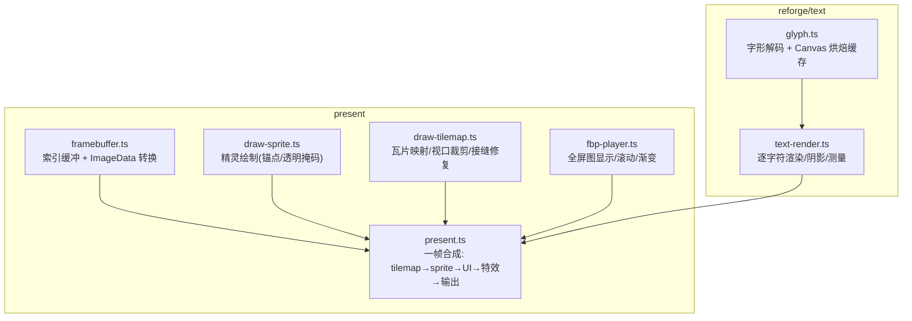
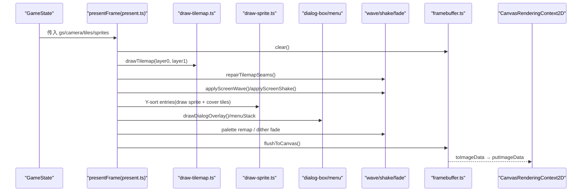
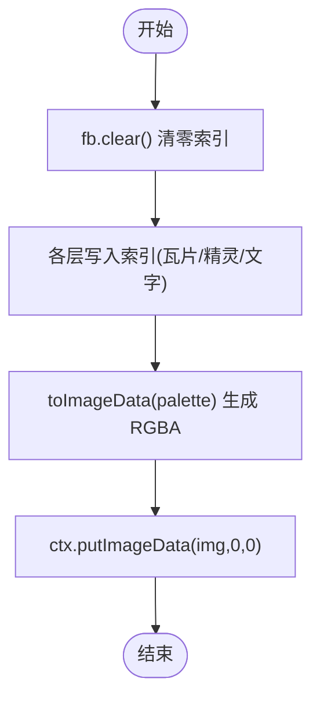
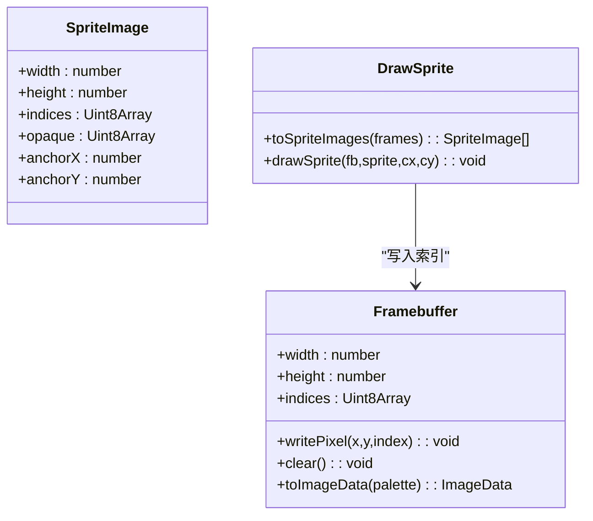
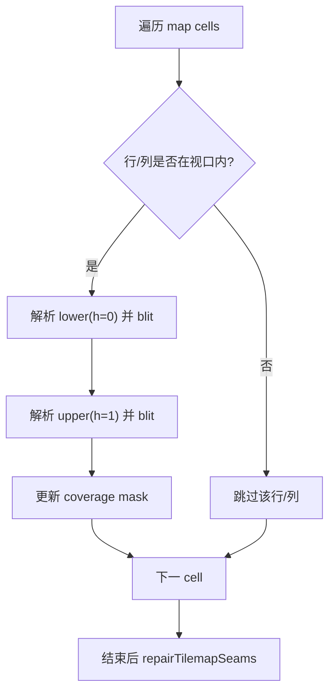
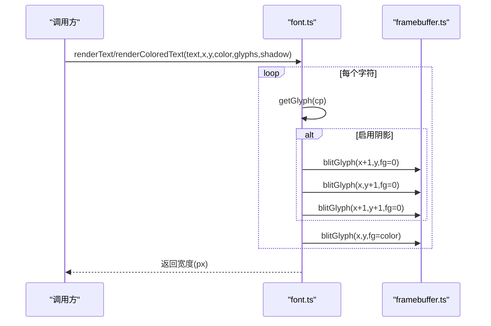
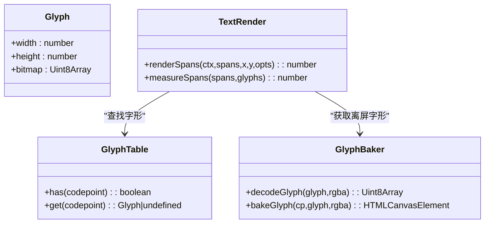
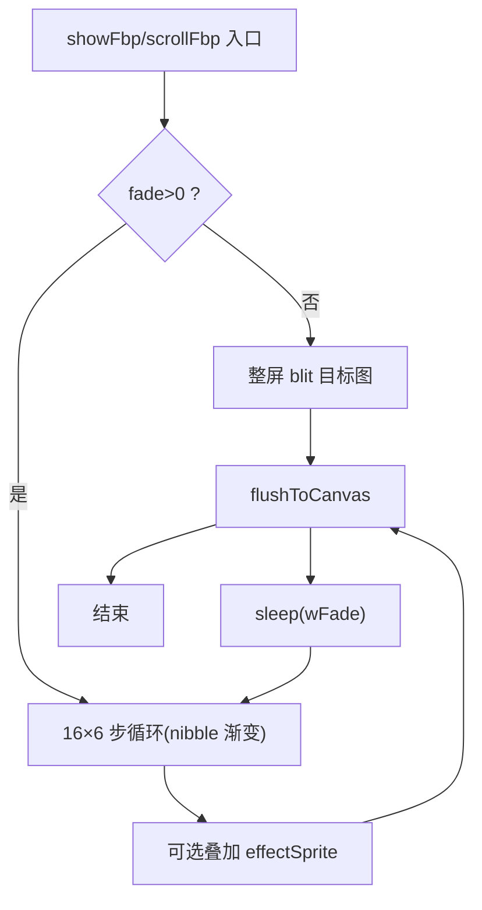
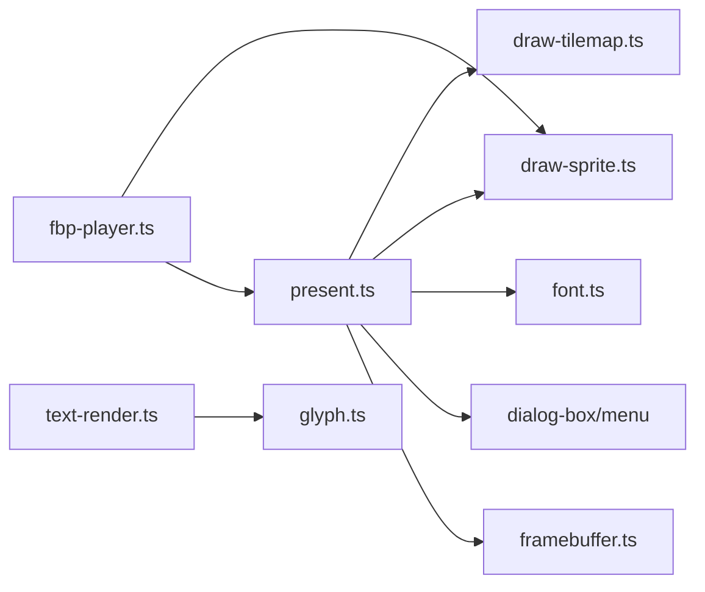

# UI 渲染引擎

<cite>
**本文引用的文件**   
- [packages/game/src/present/framebuffer.ts](file://packages/game/src/present/framebuffer.ts)
- [packages/game/src/present/draw-sprite.ts](file://packages/game/src/present/draw-sprite.ts)
- [packages/game/src/present/draw-tilemap.ts](file://packages/game/src/present/draw-tilemap.ts)
- [packages/game/src/present/font.ts](file://packages/game/src/present/font.ts)
- [packages/reforge/src/text/glyph.ts](file://packages/reforge/src/text/glyph.ts)
- [packages/reforge/src/text/text-render.ts](file://packages/reforge/src/text/text-render.ts)
- [packages/game/src/present/present.ts](file://packages/game/src/present/present.ts)
- [packages/game/src/shell/fbp-player.ts](file://packages/game/src/shell/fbp-player.ts)
</cite>

## 目录
1. [简介](#简介)
2. [项目结构](#项目结构)
3. [核心组件](#核心组件)
4. [架构总览](#架构总览)
5. [详细组件分析](#详细组件分析)
6. [依赖关系分析](#依赖关系分析)
7. [性能考量](#性能考量)
8. [故障排查指南](#故障排查指南)
9. [结论](#结论)
10. [附录](#附录)

## 简介
本技术文档面向 UI 渲染子系统，围绕 Canvas 2D 与索引缓冲（index buffer）的混合管线展开，覆盖以下关键主题：
- Canvas 2D 渲染优化：离屏缓冲、批量绘制、像素级操作
- 字体渲染系统：字形表缓存、多语言支持、彩色文本渲染、阴影效果
- 精灵绘制引擎：索引图像格式、透明度处理、缩放算法、批渲染优化
- 地图渲染管线：瓦片映射、视口裁剪、层级排序
- 性能监控指标、内存管理策略、跨浏览器兼容性处理
- 自定义渲染后端的扩展接口与最佳实践

## 项目结构
渲染子系统位于 packages/game/src/present 与 packages/reforge/src/text 两大模块中：
- present：帧缓冲、精灵/瓦片绘制、对话框/菜单叠加、特效（波动/震屏/淡入淡出）、主循环合成
- reforge/text：基于 Canvas 2D 的字形解码与烘焙缓存，用于重绘型 UI 或开发工具链

图表来源
- [packages/game/src/present/framebuffer.ts](file://packages/game/src/present/framebuffer.ts)
- [packages/game/src/present/draw-sprite.ts](file://packages/game/src/present/draw-sprite.ts)
- [packages/game/src/present/draw-tilemap.ts](file://packages/game/src/present/draw-tilemap.ts)
- [packages/game/src/present/present.ts](file://packages/game/src/present/present.ts)
- [packages/game/src/shell/fbp-player.ts](file://packages/game/src/shell/fbp-player.ts)
- [packages/reforge/src/text/glyph.ts](file://packages/reforge/src/text/glyph.ts)
- [packages/reforge/src/text/text-render.ts](file://packages/reforge/src/text/text-render.ts)

章节来源
- [packages/game/src/present/framebuffer.ts](file://packages/game/src/present/framebuffer.ts)
- [packages/game/src/present/draw-sprite.ts](file://packages/game/src/present/draw-sprite.ts)
- [packages/game/src/present/draw-tilemap.ts](file://packages/game/src/present/draw-tilemap.ts)
- [packages/game/src/present/present.ts](file://packages/game/src/present/present.ts)
- [packages/game/src/shell/fbp-player.ts](file://packages/game/src/shell/fbp-player.ts)
- [packages/reforge/src/text/glyph.ts](file://packages/reforge/src/text/glyph.ts)
- [packages/reforge/src/text/text-render.ts](file://packages/reforge/src/text/text-render.ts)

## 核心组件
- 帧缓冲（Framebuffer）
  - 提供 320×200 索引缓冲，writePixel 带边界检查，toImageData 将索引查调色板转为 RGBA，供 Canvas 2D putImageData 输出。
- 精灵绘制（Sprite）
  - 每帧独立 anchor（底部中心），opaque mask 控制透明；drawSprite 按行扫描写入 fb。
- 瓦片地图（Tilemap）
  - 双层瓦片（底层/顶层），h=0/h=1 子行偏移，viewport 裁剪，接缝漏黑修复，cover tile 计算以正确遮挡。
- 字体渲染（Font/Glyph）
  - game/present/font.ts：位图字形 blit 到索引缓冲，支持阴影与逐字颜色。
  - reforge/text/glyph.ts：字形解码为 RGBA，Canvas 离屏缓存，text-render.ts 实现阴影与测量。
- 主合成器（Present）
  - 组合 tilemap→特效→精灵+cover→对话框/菜单→fade→shake→flushToCanvas。
- 全屏图播放（FBP Player）
  - 支持 fade 渐变、滚动卷入、MGO 特效精灵叠加。

章节来源
- [packages/game/src/present/framebuffer.ts](file://packages/game/src/present/framebuffer.ts)
- [packages/game/src/present/draw-sprite.ts](file://packages/game/src/present/draw-sprite.ts)
- [packages/game/src/present/draw-tilemap.ts](file://packages/game/src/present/draw-tilemap.ts)
- [packages/game/src/present/font.ts](file://packages/game/src/present/font.ts)
- [packages/reforge/src/text/glyph.ts](file://packages/reforge/src/text/glyph.ts)
- [packages/reforge/src/text/text-render.ts](file://packages/reforge/src/text/text-render.ts)
- [packages/game/src/present/present.ts](file://packages/game/src/present/present.ts)
- [packages/game/src/shell/fbp-player.ts](file://packages/game/src/shell/fbp-player.ts)

## 架构总览
下图展示单帧渲染流程与数据流向，从游戏状态到最终 Canvas 输出。

图表来源
- [packages/game/src/present/present.ts](file://packages/game/src/present/present.ts)
- [packages/game/src/present/draw-tilemap.ts](file://packages/game/src/present/draw-tilemap.ts)
- [packages/game/src/present/draw-sprite.ts](file://packages/game/src/present/draw-sprite.ts)
- [packages/game/src/present/framebuffer.ts](file://packages/game/src/present/framebuffer.ts)

## 详细组件分析

### 帧缓冲与 Canvas 2D 输出
- 设计要点
  - 使用 Uint8Array 存储索引，writePixel 做边界检查，避免越界写。
  - toImageData 将索引查调色板生成 RGBA，一次性 putImageData 输出，减少多次 drawImage 开销。
- 离屏缓冲
  - createFramebuffer 可创建任意尺寸缓冲，便于调试缩略图或离线预渲染。
- 批量绘制
  - 通过整帧 toImageData 一次提交，降低 GPU/CPU 同步次数。
- 像素级操作
  - 在 fade remap、dither 渐变等场景直接对 indices 进行像素级读写。

图表来源
- [packages/game/src/present/framebuffer.ts](file://packages/game/src/present/framebuffer.ts)
- [packages/game/src/present/present.ts](file://packages/game/src/present/present.ts)

章节来源
- [packages/game/src/present/framebuffer.ts](file://packages/game/src/present/framebuffer.ts)
- [packages/game/src/present/present.ts](file://packages/game/src/present/present.ts)

### 精灵绘制引擎
- 数据结构
  - SpriteImage：width/height、indices、opaque、anchorX/anchorY。
- 透明度处理
  - 使用 opaque mask 判定是否写入，避免把 palette index 0 误判为透明。
- 锚点与对齐
  - 每帧根据自身宽高设置 anchor（底部中心），解决不同高度帧脚底对齐问题。
- 批渲染优化
  - 收集所有精灵与 cover tile 为 DrawEntry，统一 Y-sort 后顺序绘制，减少状态切换。

图表来源
- [packages/game/src/present/draw-sprite.ts](file://packages/game/src/present/draw-sprite.ts)
- [packages/game/src/present/framebuffer.ts](file://packages/game/src/present/framebuffer.ts)

章节来源
- [packages/game/src/present/draw-sprite.ts](file://packages/game/src/present/draw-sprite.ts)

### 地图渲染管线（瓦片映射/视口裁剪/层级排序）
- 双层瓦片
  - layer 0（底层）先画，layer 1（顶层）后画，确保门/柱子等遮挡精灵。
- 子行与基线
  - h=0（lower）相对 baseline 上移 8px，h=1（upper）在 baseline；列方向有半格偏移。
- 视口裁剪
  - 按 row/col 范围快速剔除屏幕外瓦片，减少无效写入。
- 接缝修复
  - 记录 coverage mask，对未覆盖像素用最近邻居填充，复现原版“缝里是邻接地形”的效果。
- Cover Tile 与 Y-sort
  - 根据精灵位置计算可能覆盖它的 layer-1 瓦片，作为额外绘制项参与排序，保证高 y 瓦片盖住低 y 精灵。

图表来源
- [packages/game/src/present/draw-tilemap.ts](file://packages/game/src/present/draw-tilemap.ts)

章节来源
- [packages/game/src/present/draw-tilemap.ts](file://packages/game/src/present/draw-tilemap.ts)

### 字体渲染系统（字形表/多语言/彩色文本/阴影）
- 字形表与加载
  - loadGlyphs 从 glyphs.json 加载 UTF-8 codepoint 到 GlyphTable。
- 位图字形 Blit
  - MSB-first 按行位图，blitGlyph 逐像素写入前景色。
- 阴影效果
  - triple shadow（+1,0)/(0,+1)/(+1,+1) 黑色 + 主色字。
- 彩色文本
  - renderColoredText 支持逐字符调色板索引着色。
- Canvas 2D 路径（reforge）
  - decodeGlyph 生成 RGBA，bakeGlyph 写入离屏 canvas 并按 (cp,rgba) 缓存，text-render.ts 负责阴影与测量。

图表来源
- [packages/game/src/present/font.ts](file://packages/game/src/present/font.ts)
- [packages/game/src/present/framebuffer.ts](file://packages/game/src/present/framebuffer.ts)

图表来源
- [packages/reforge/src/text/text-render.ts](file://packages/reforge/src/text/text-render.ts)
- [packages/reforge/src/text/glyph.ts](file://packages/reforge/src/text/glyph.ts)

章节来源
- [packages/game/src/present/font.ts](file://packages/game/src/present/font.ts)
- [packages/reforge/src/text/glyph.ts](file://packages/reforge/src/text/glyph.ts)
- [packages/reforge/src/text/text-render.ts](file://packages/reforge/src/text/text-render.ts)

### 全屏图播放与特效（FBP Player）
- 功能
  - 瞬时显示、palette-index nibble 渐变、滚动卷入、MGO 特效精灵叠加。
- 关键点
  - 渐变采用 rgIndex 步长交错访问，模拟 sdlpal 真值；HACKHACK 特定 chunk 跳过最终整屏 blit 保留渐变结果。
  - 支持可选 skipKeys 跳过（默认不可跳）。

图表来源
- [packages/game/src/shell/fbp-player.ts](file://packages/game/src/shell/fbp-player.ts)

章节来源
- [packages/game/src/shell/fbp-player.ts](file://packages/game/src/shell/fbp-player.ts)

## 依赖关系分析
- present.ts 聚合 draw-tilemap、draw-sprite、font/dialog/menu 以及特效模块，形成单帧合成中枢。
- framebuffer.ts 被多处读取/写入，是索引缓冲的唯一事实源。
- fbp-player.ts 复用 draw-sprite 与 flushToCanvas，保持视觉一致性。
- reforge/text 与 present 解耦：前者走 Canvas 2D 路径，后者走索引缓冲路径，二者共享 Glyph/GlyphTable 概念。

图表来源
- [packages/game/src/present/present.ts](file://packages/game/src/present/present.ts)
- [packages/game/src/present/draw-tilemap.ts](file://packages/game/src/present/draw-tilemap.ts)
- [packages/game/src/present/draw-sprite.ts](file://packages/game/src/present/draw-sprite.ts)
- [packages/game/src/present/font.ts](file://packages/game/src/present/font.ts)
- [packages/game/src/shell/fbp-player.ts](file://packages/game/src/shell/fbp-player.ts)
- [packages/reforge/src/text/text-render.ts](file://packages/reforge/src/text/text-render.ts)
- [packages/reforge/src/text/glyph.ts](file://packages/reforge/src/text/glyph.ts)

章节来源
- [packages/game/src/present/present.ts](file://packages/game/src/present/present.ts)
- [packages/game/src/present/draw-tilemap.ts](file://packages/game/src/present/draw-tilemap.ts)
- [packages/game/src/present/draw-sprite.ts](file://packages/game/src/present/draw-sprite.ts)
- [packages/game/src/present/font.ts](file://packages/game/src/present/font.ts)
- [packages/game/src/shell/fbp-player.ts](file://packages/game/src/shell/fbp-player.ts)
- [packages/reforge/src/text/text-render.ts](file://packages/reforge/src/text/text-render.ts)
- [packages/reforge/src/text/glyph.ts](file://packages/reforge/src/text/glyph.ts)

## 性能考量
- 离屏缓冲与批量提交
  - 使用单一 Uint8Array 索引缓冲，toImageData 一次性生成 RGBA，putImageData 一次提交，显著降低 drawImage 调用次数。
- 视口裁剪与快速跳过
  - 瓦片绘制按行/列范围判断，整行/列不在视口时直接 continue，减少无意义遍历。
- 透明掩码与条件写入
  - 精灵与瓦片均使用 opaque mask，避免对透明像素执行 writePixel，降低分支与写入成本。
- 接缝修复的局部性
  - coverage mask 复用同一块缓冲，每帧 fill(0) 即可，避免重复分配。
- 特效分阶段应用
  - wave/shake 在合适阶段施加，避免对 UI 层造成不必要扭曲。
- 字体缓存
  - reforge/text 的 bakeGlyph 按 (cp,rgba) 缓存离屏 canvas，避免重复解码与涂绘。

[本节为通用指导，不直接分析具体文件]

## 故障排查指南
- 精灵脚底错位/溢出
  - 症状：爬行精灵脚部向下溢出。根因：整组共用 frame0 的宽高当 anchor。修复：每帧按自身宽高设置 anchor。
- 瓦片“梯子状”杂乱
  - 症状：dense 场景出现错乱。根因：把 idx===0 当作透明，导致 opaque palette-0 像素被跳过。修复：改用 opaque mask 判定。
- 血池“黑色三角”
  - 症状：地图斜接缝处出现黑三角。根因：每帧清屏到 index 0，而原版不清屏。修复：repairTilemapSeams 用 coverage 扩散填充。
- 跟随者角色错乱
  - 症状：跟随者显示成队长。根因：错误复用 partyFrames。修复：按各自 spriteNum 取对应 frames。
- 对话闪烁箭头颜色异常
  - 症状：等待按键时箭头颜色不轮转。修复：按 100ms 步进左轮转 palette[0xF9..0xFE]。

章节来源
- [packages/game/src/present/draw-sprite.ts](file://packages/game/src/present/draw-sprite.ts)
- [packages/game/src/present/draw-tilemap.ts](file://packages/game/src/present/draw-tilemap.ts)
- [packages/game/src/present/present.ts](file://packages/game/src/present/present.ts)

## 结论
本渲染引擎以索引缓冲为核心，结合 Canvas 2D 输出，实现了高性能的 2D 渲染管线。通过严格的视口裁剪、opaque mask、Y-sort 与 cover tile 机制，保证了正确的遮挡与性能。字体系统同时支持索引缓冲与 Canvas 2D 两条路径，兼顾运行期与工具链需求。未来可在批渲染、GPU 加速与更细粒度的性能埋点上继续演进。

[本节为总结，不直接分析具体文件]

## 附录

### 性能监控指标建议
- 帧时间分布：tilemap 绘制、精灵绘制、UI 叠加、特效、toImageData/putImageData
- 绘制计数：瓦片写入次数、精灵写入次数、UI 绘制次数
- 内存峰值：coverage mask 复用、离屏字形缓存大小
- 卡顿定位：大对象分配（如 toImageData 缓冲区）频率

[本节为通用指导，不直接分析具体文件]

### 内存管理策略
- 复用全局缓冲：seamCoverageBuf 每帧 fill(0)，避免频繁分配。
- 字形缓存上限：可按 cp 数量或总字节数限制 cache 大小，必要时淘汰最久未用条目。
- 离屏 canvas 生命周期：仅在需要时创建，并在不再使用时释放引用。

[本节为通用指导，不直接分析具体文件]

### 跨浏览器兼容性处理
- Canvas 2D 可用性：bakeGlyph 检测 getContext('2d') 失败抛错，调用方可降级回索引缓冲路径。
- ImageData 支持：主流浏览器均支持，但需注意移动端低端设备的 putImageData 性能差异。
- 字体资源加载：loadGlyphs 基于 fetch，需考虑网络错误与 CORS 配置。

章节来源
- [packages/reforge/src/text/glyph.ts](file://packages/reforge/src/text/glyph.ts)

### 自定义渲染后端扩展接口
- 替换 flushToCanvas
  - 当前实现：fb.toImageData(palette) → ctx.putImageData。可改为 WebGL/WebGPU 纹理上传路径。
- 抽象 PixelWriter
  - 将 fb.writePixel 抽象为接口，允许后端选择 SIMD/多线程/硬件加速写入。
- 抽象 Sprite/Tiler
  - 将 drawSprite/blitTile 抽象为后端无关 API，由具体后端实现批渲染与合并批次。
- 字体后端
  - 在 text-render.ts 中注入自定义 glyphSource，支持向量字体或 GPU 字形图集。

章节来源
- [packages/game/src/present/present.ts](file://packages/game/src/present/present.ts)
- [packages/game/src/present/framebuffer.ts](file://packages/game/src/present/framebuffer.ts)
- [packages/reforge/src/text/text-render.ts](file://packages/reforge/src/text/text-render.ts)