# UI 组件系统

<cite>
**本文引用的文件**
- [packages/game/src/present/dialog-box.ts](file://packages/game/src/present/dialog-box.ts)
- [packages/reforge/src/dialog/dialog-box.ts](file://packages/reforge/src/dialog/dialog-box.ts)
- [packages/reforge/src/text/text-render.ts](file://packages/reforge/src/text/text-render.ts)
- [packages/reforge/src/menu/menu-box.ts](file://packages/reforge/src/menu/menu-box.ts)
- [packages/reforge/src/menu/system-box.ts](file://packages/reforge/src/menu/system-box.ts)
- [packages/reforge/src/menu/item-list.ts](file://packages/reforge/src/menu/item-list.ts)
- [packages/reforge/src/menu/magic-box.ts](file://packages/reforge/src/menu/magic-box.ts)
- [packages/game/src/core/menu/in-game-menu.ts](file://packages/game/src/core/menu/in-game-menu.ts)
</cite>

## 目录
1. [简介](#简介)
2. [项目结构](#项目结构)
3. [核心组件](#核心组件)
4. [架构总览](#架构总览)
5. [详细组件分析](#详细组件分析)
6. [依赖关系分析](#依赖关系分析)
7. [性能考量](#性能考量)
8. [故障排查指南](#故障排查指南)
9. [结论](#结论)
10. [附录](#附录)

## 简介
本技术文档聚焦于 UI 组件系统的实现与扩展，覆盖对话框系统与菜单组件两大子系统：
- 对话框系统：文本渲染、光标控制、自动滚动（分页）、多行显示、头像/姓名牌布局、打字节奏与尾停顿。
- 菜单组件：主菜单、物品栏、法术选择、角色状态界面、确认框与系统菜单的架构与实现。
- 交互逻辑：焦点管理、键盘导航、鼠标支持、触摸适配（概念性说明）。
- 响应式布局与屏幕适配：高分辨率策略、坐标高清化、九宫格框与平铺填充。
- 自定义组件开发指南与主题定制方法。

## 项目结构
UI 相关代码分布在两个阶段包中：
- 第一阶段（game）：忠实还原 sdlpal 行为，对话框与菜单以“真实值”对齐。
- 第二阶段（reforge）：新引擎 Canvas 2D，对话与菜单采用共享文本渲染原语与数据驱动布局。

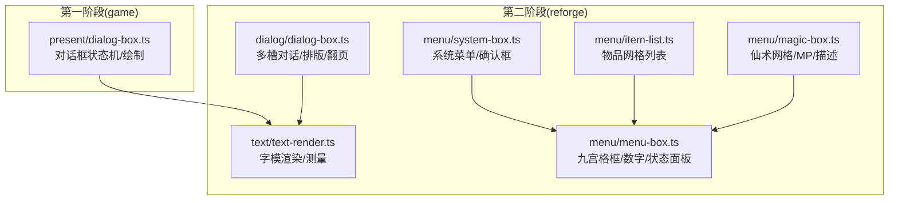

图表来源
- [packages/game/src/present/dialog-box.ts](file://packages/game/src/present/dialog-box.ts)
- [packages/reforge/src/dialog/dialog-box.ts](file://packages/reforge/src/dialog/dialog-box.ts)
- [packages/reforge/src/text/text-render.ts](file://packages/reforge/src/text/text-render.ts)
- [packages/reforge/src/menu/menu-box.ts](file://packages/reforge/src/menu/menu-box.ts)
- [packages/reforge/src/menu/system-box.ts](file://packages/reforge/src/menu/system-box.ts)
- [packages/reforge/src/menu/item-list.ts](file://packages/reforge/src/menu/item-list.ts)
- [packages/reforge/src/menu/magic-box.ts](file://packages/reforge/src/menu/magic-box.ts)

章节来源
- [packages/game/src/present/dialog-box.ts](file://packages/game/src/present/dialog-box.ts)
- [packages/reforge/src/dialog/dialog-box.ts](file://packages/reforge/src/dialog/dialog-box.ts)
- [packages/reforge/src/text/text-render.ts](file://packages/reforge/src/text/text-render.ts)
- [packages/reforge/src/menu/menu-box.ts](file://packages/reforge/src/menu/menu-box.ts)
- [packages/reforge/src/menu/system-box.ts](file://packages/reforge/src/menu/system-box.ts)
- [packages/reforge/src/menu/item-list.ts](file://packages/reforge/src/menu/item-list.ts)
- [packages/reforge/src/menu/magic-box.ts](file://packages/reforge/src/menu/magic-box.ts)

## 核心组件
- 对话框系统（两阶段）
  - 第一阶段：基于 sdlpal text.c 的状态机与绘制管线，逐字打字、翻页等键、尾停顿、姓名牌/头像定位、颜色切换与控制符解析。
  - 第二阶段：多槽（top/bottom）共存、按段推进、自动翻页与 autoAdvance、光标着色与缓存。
- 文本渲染原语
  - 字模表 + 阴影三通道 + 字符级 RGBA 色 + 最大字符裁剪（打字效果）。
- 菜单组件
  - 九宫格框与卷轴框、数字绘制、状态面板、系统菜单、物品网格、仙术网格。

章节来源
- [packages/game/src/present/dialog-box.ts](file://packages/game/src/present/dialog-box.ts)
- [packages/reforge/src/dialog/dialog-box.ts](file://packages/reforge/src/dialog/dialog-box.ts)
- [packages/reforge/src/text/text-render.ts](file://packages/reforge/src/text/text-render.ts)
- [packages/reforge/src/menu/menu-box.ts](file://packages/reforge/src/menu/menu-box.ts)
- [packages/reforge/src/menu/system-box.ts](file://packages/reforge/src/menu/system-box.ts)
- [packages/reforge/src/menu/item-list.ts](file://packages/reforge/src/menu/item-list.ts)
- [packages/reforge/src/menu/magic-box.ts](file://packages/reforge/src/menu/magic-box.ts)

## 架构总览
对话框与菜单共用文本渲染原语；菜单通过统一九宫格框与数字绘制完成高保真外观；第二阶段引入多槽对话与排版管线，提升可维护性与可扩展性。

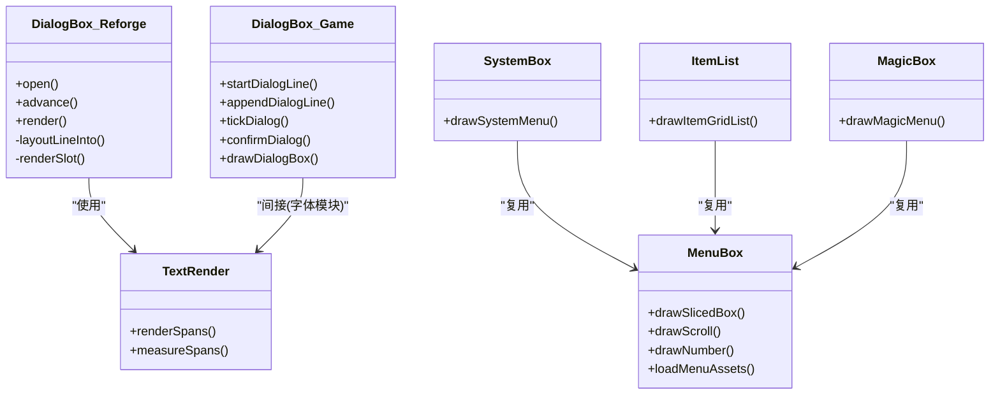

图表来源
- [packages/game/src/present/dialog-box.ts](file://packages/game/src/present/dialog-box.ts)
- [packages/reforge/src/dialog/dialog-box.ts](file://packages/reforge/src/dialog/dialog-box.ts)
- [packages/reforge/src/text/text-render.ts](file://packages/reforge/src/text/text-render.ts)
- [packages/reforge/src/menu/menu-box.ts](file://packages/reforge/src/menu/menu-box.ts)
- [packages/reforge/src/menu/system-box.ts](file://packages/reforge/src/menu/system-box.ts)
- [packages/reforge/src/menu/item-list.ts](file://packages/reforge/src/menu/item-list.ts)
- [packages/reforge/src/menu/magic-box.ts](file://packages/reforge/src/menu/magic-box.ts)

## 详细组件分析

### 对话框系统（第一阶段）
- 文本解析与控制符
  - 控制符：颜色切换、打字速度、行末提前结束、图标标记、转义。
  - 输出：可见文本、逐字符色、每字出现时刻、行末状态（跨行持续）、等键图标。
- 位置与布局
  - 正文/姓名牌/头像位置由 style 决定；narration 居中单行框。
- 状态机
  - 阶段：typing → line-done → waiting-page-key / waiting-end-key。
  - 翻页：累计 4 行后等键清屏并归零行计数。
  - 尾停顿：~NN 不可加速，按键仅穿透等待。
- 绘制
  - 姓名牌独立路径（固定色），正文支持逐字符上色，箭头图标在末尾定位。

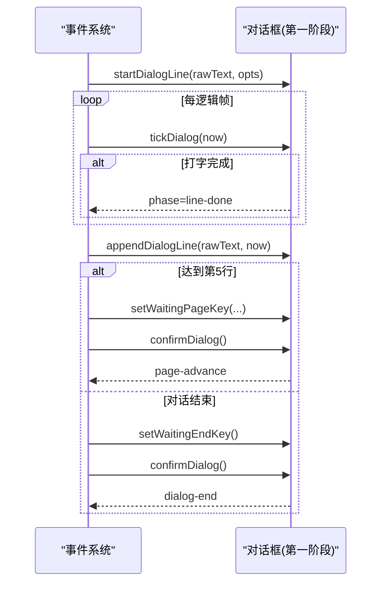

图表来源
- [packages/game/src/present/dialog-box.ts](file://packages/game/src/present/dialog-box.ts)

章节来源
- [packages/game/src/present/dialog-box.ts](file://packages/game/src/present/dialog-box.ts)

### 对话框系统（第二阶段）
- 多槽模型
  - top/bottom 各自独立排版与翻页，同槽覆盖、异槽共存。
- 排版与打字
  - layoutLines 将一段话拆为 DisplayLine；活跃槽按 speed 与 elapsed 计算 charsShown。
- 翻页与自动推进
  - advance 两段式：先瞬显当前页，再翻下一页或推进下一段；autoAdvance 时不可加速。
- 光标
  - 仅在活跃槽且全显且非 autoAdvance 时显示；预烘焙带色步骤，按时间轮转。

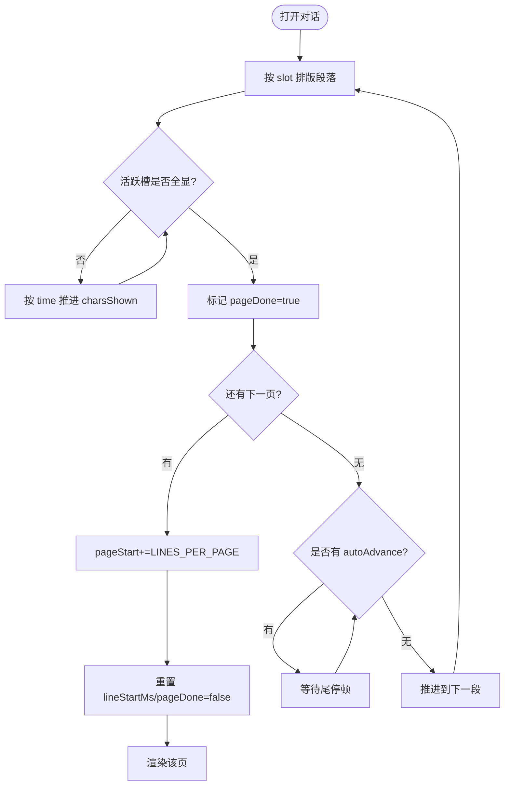

图表来源
- [packages/reforge/src/dialog/dialog-box.ts](file://packages/reforge/src/dialog/dialog-box.ts)

章节来源
- [packages/reforge/src/dialog/dialog-box.ts](file://packages/reforge/src/dialog/dialog-box.ts)

### 文本渲染原语
- renderSpans
  - 逐字符从 GlyphTable 取字模，可选三层阴影（黑），支持 maxChars 截断用于打字。
- measureSpans
  - 不绘制，只累加宽度，用于光标定位与布局。

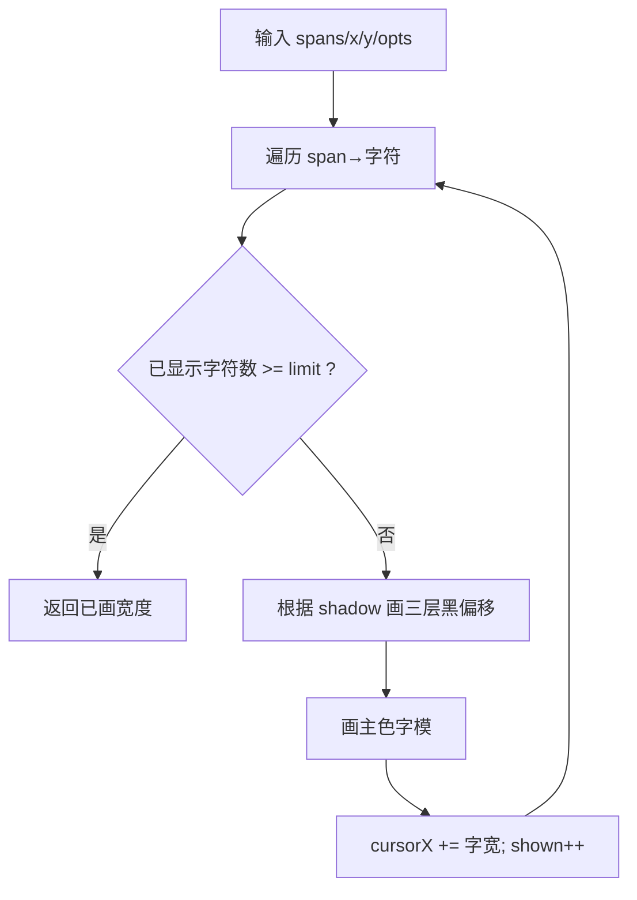

图表来源
- [packages/reforge/src/text/text-render.ts](file://packages/reforge/src/text/text-render.ts)

章节来源
- [packages/reforge/src/text/text-render.ts](file://packages/reforge/src/text/text-render.ts)

### 菜单组件：通用框架与资产
- 九宫格框与卷轴
  - drawSlicedBox 按 9 块实际宽高拼接，中心/四边平铺，四角原尺寸；大阴影通过离屏合成形状。
  - drawScroll 用九宫格撑出任意长度单行框。
- 数字绘制
  - 右对齐/左对齐两种模式，支持不同颜色数字集（黄/蓝/青）。
- 资产加载
  - 批量异步加载 PNG 为 ImageBitmap，预烘焙 RGBA，运行时直接 drawImage。

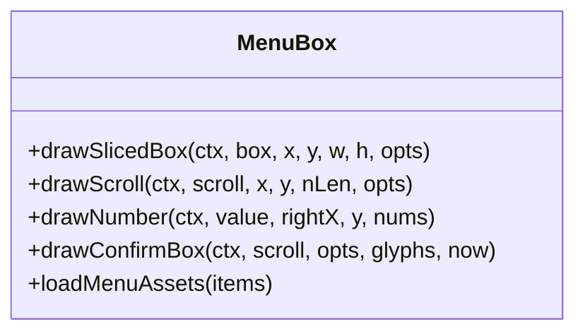

图表来源
- [packages/reforge/src/menu/menu-box.ts](file://packages/reforge/src/menu/menu-box.ts)

章节来源
- [packages/reforge/src/menu/menu-box.ts](file://packages/reforge/src/menu/menu-box.ts)

### 系统菜单与确认框
- 系统菜单
  - 固定坐标与行距，项启用/禁用/选中态颜色一致；支持占位提示文案。
- 确认框
  - 左右双框 + 文字，选中态闪烁色来自统一常量。

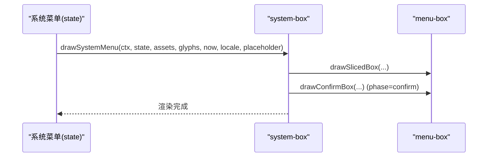

图表来源
- [packages/reforge/src/menu/system-box.ts](file://packages/reforge/src/menu/system-box.ts)
- [packages/reforge/src/menu/menu-box.ts](file://packages/reforge/src/menu/menu-box.ts)

章节来源
- [packages/reforge/src/menu/system-box.ts](file://packages/reforge/src/menu/system-box.ts)
- [packages/reforge/src/menu/menu-box.ts](file://packages/reforge/src/menu/menu-box.ts)

### 物品栏（网格列表）
- 3 列网格：名称、数量、选中光标；穿戴中标绿。
- 底部 itembox：图标 + 多行描述（浅黄）。
- 数字与颜色复用统一资产。

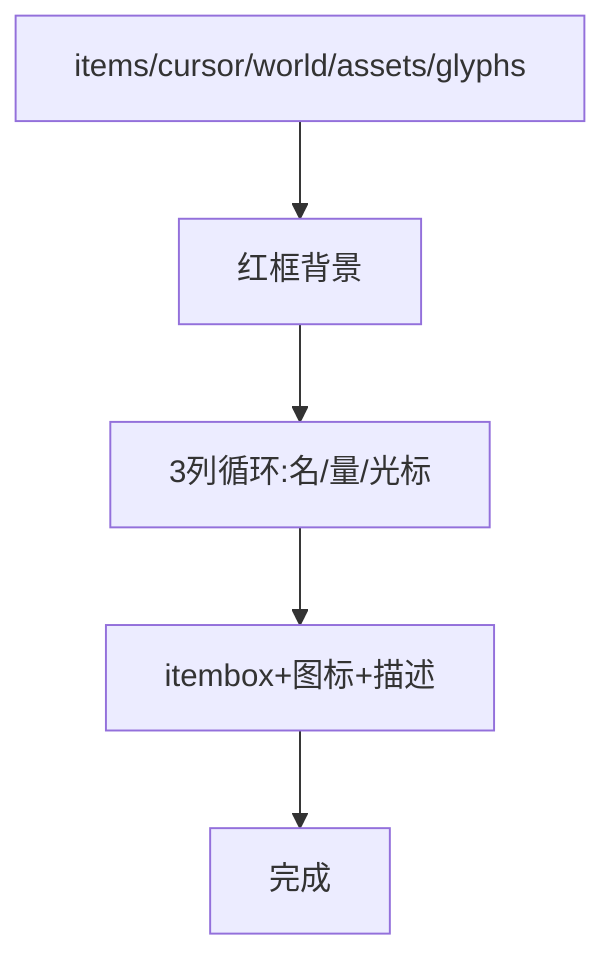

图表来源
- [packages/reforge/src/menu/item-list.ts](file://packages/reforge/src/menu/item-list.ts)
- [packages/reforge/src/menu/menu-box.ts](file://packages/reforge/src/menu/menu-box.ts)

章节来源
- [packages/reforge/src/menu/item-list.ts](file://packages/reforge/src/menu/item-list.ts)
- [packages/reforge/src/menu/menu-box.ts](file://packages/reforge/src/menu/menu-box.ts)

### 法术选择（仙术菜单）
- 红框网格 + MP box（needed/current）+ 角色框（HP/MP 当前/最大）+ 描述。
- 禁用态：MP 不足灰显；选中态闪烁；选人箭头在 pick-target 阶段显示。

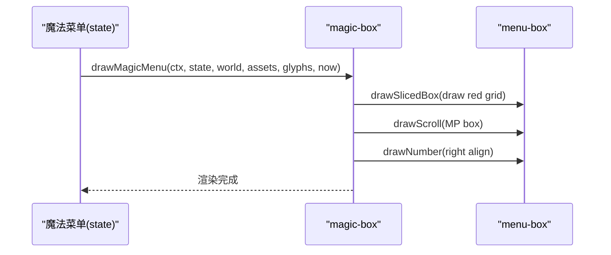

图表来源
- [packages/reforge/src/menu/magic-box.ts](file://packages/reforge/src/menu/magic-box.ts)
- [packages/reforge/src/menu/menu-box.ts](file://packages/reforge/src/menu/menu-box.ts)

章节来源
- [packages/reforge/src/menu/magic-box.ts](file://packages/reforge/src/menu/magic-box.ts)
- [packages/reforge/src/menu/menu-box.ts](file://packages/reforge/src/menu/menu-box.ts)

### 主菜单与系统菜单（状态机）
- 主菜单：4 项（状态/法术/物品/系统），默认记忆上次选择。
- 系统菜单：5 项（存档/读档/音乐/音效/退出），含二次确认与开关子选单。

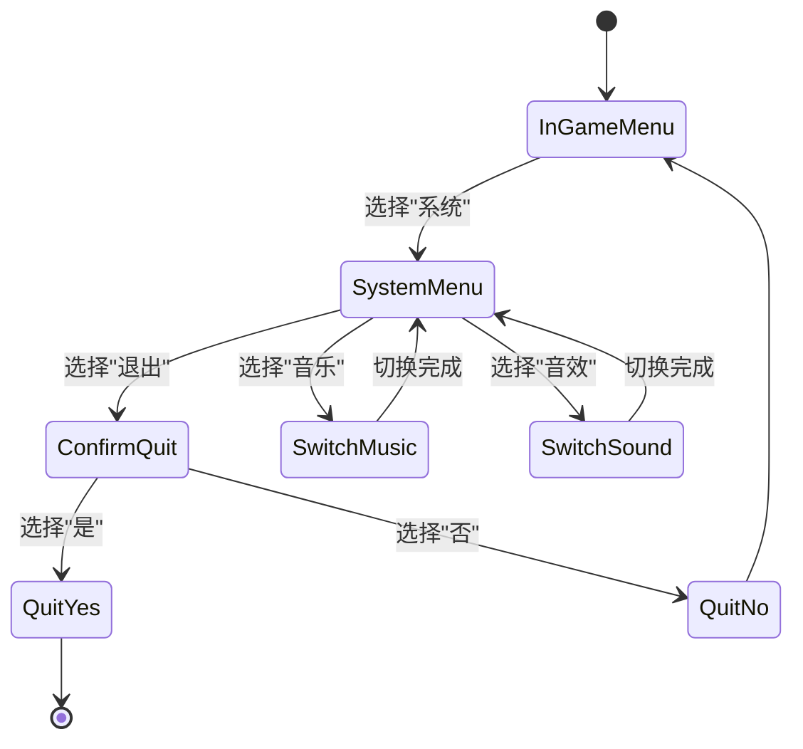

图表来源
- [packages/game/src/core/menu/in-game-menu.ts](file://packages/game/src/core/menu/in-game-menu.ts)

章节来源
- [packages/game/src/core/menu/in-game-menu.ts](file://packages/game/src/core/menu/in-game-menu.ts)

### 交互逻辑（焦点/导航/指针/触摸）
- 焦点管理
  - 菜单项 cursor 由 SelectionMenuState 统一管理，上下移动与边界回绕。
- 键盘导航
  - 方向键移动、Enter/Space 确认、Esc 返回上层（概念性说明）。
- 鼠标支持
  - 点击菜单项/确认框选项可直接选中（概念性说明）。
- 触摸适配
  - 触控点映射到逻辑坐标，点击区域判定与长按反馈（概念性说明）。

[本节为概念性说明，不直接分析具体文件]

### 响应式布局与屏幕适配
- 高分辨率策略
  - 调用方 ctx.scale(WORLD_SCALE=4)，所有菜单/对话框在 320 逻辑坐标下绘制，物理像素 ×4 整数放大，点阵字锐利。
- 坐标高清化
  - 对话框 POS 常量机制化，渲染时 ×UI_SCALE；字模 blit 位置与阴影偏移按物理像素调整。
- 九宫格与平铺
  - 不规则 frame 尺寸下，按块实际宽高定位，中心/四边平铺，避免拉伸变形。

章节来源
- [packages/reforge/src/menu/menu-box.ts](file://packages/reforge/src/menu/menu-box.ts)
- [packages/reforge/src/dialog/dialog-box.ts](file://packages/reforge/src/dialog/dialog-box.ts)

### 自定义 UI 组件开发指南
- 新建组件建议
  - 复用 renderSpans/measureSpans 进行文本渲染。
  - 使用 drawSlicedBox/drawScroll 构建容器与边框。
  - 数字绘制使用 drawNumber/drawNumberLeft，按需选择颜色集。
- 主题定制
  - 通过 MenuAssets 注入不同九宫格/数字/图标资源即可更换主题。
  - 颜色常量集中定义，新增主题只需替换资源与色表。
- 布局规范
  - 遵循 320×200 逻辑坐标系，所有坐标乘以 WORLD_SCALE 落物理像素。
  - 行距/间距尽量使用常量，便于全局调整。

章节来源
- [packages/reforge/src/menu/menu-box.ts](file://packages/reforge/src/menu/menu-box.ts)
- [packages/reforge/src/text/text-render.ts](file://packages/reforge/src/text/text-render.ts)

## 依赖关系分析
- 低耦合
  - 文本渲染与原语解耦，对话框与菜单均消费同一套渲染接口。
- 资源驱动
  - 菜单通过 MenuAssets 注入资源，降低硬编码，提高可替换性。
- 状态与渲染分离
  - 状态机（in-game-menu、dialog-box）与绘制函数（各 *-box.ts）职责清晰。

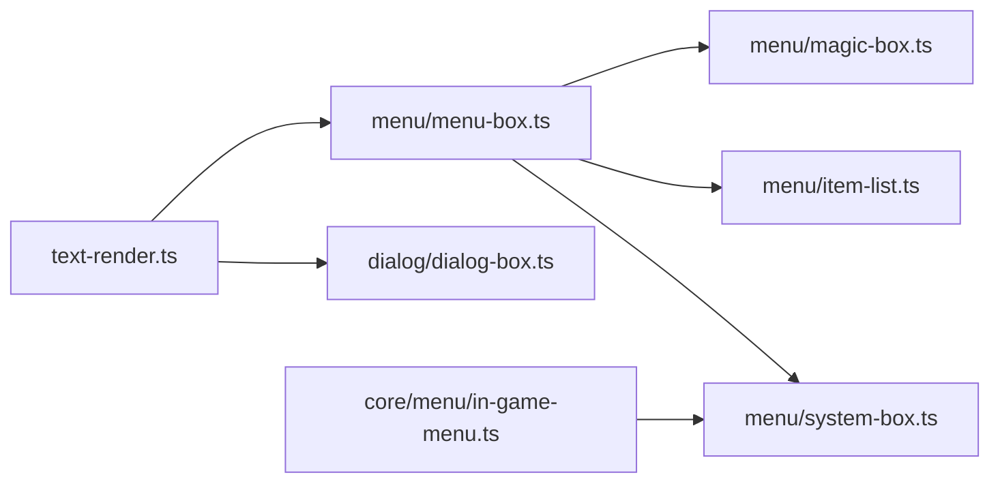

图表来源
- [packages/reforge/src/text/text-render.ts](file://packages/reforge/src/text/text-render.ts)
- [packages/reforge/src/dialog/dialog-box.ts](file://packages/reforge/src/dialog/dialog-box.ts)
- [packages/reforge/src/menu/menu-box.ts](file://packages/reforge/src/menu/menu-box.ts)
- [packages/reforge/src/menu/system-box.ts](file://packages/reforge/src/menu/system-box.ts)
- [packages/reforge/src/menu/item-list.ts](file://packages/reforge/src/menu/item-list.ts)
- [packages/reforge/src/menu/magic-box.ts](file://packages/reforge/src/menu/magic-box.ts)
- [packages/game/src/core/menu/in-game-menu.ts](file://packages/game/src/core/menu/in-game-menu.ts)

章节来源
- [packages/reforge/src/text/text-render.ts](file://packages/reforge/src/text/text-render.ts)
- [packages/reforge/src/dialog/dialog-box.ts](file://packages/reforge/src/dialog/dialog-box.ts)
- [packages/reforge/src/menu/menu-box.ts](file://packages/reforge/src/menu/menu-box.ts)
- [packages/reforge/src/menu/system-box.ts](file://packages/reforge/src/menu/system-box.ts)
- [packages/reforge/src/menu/item-list.ts](file://packages/reforge/src/menu/item-list.ts)
- [packages/reforge/src/menu/magic-box.ts](file://packages/reforge/src/menu/magic-box.ts)
- [packages/game/src/core/menu/in-game-menu.ts](file://packages/game/src/core/menu/in-game-menu.ts)

## 性能考量
- 字模缓存
  - GlyphTable 与 bakeGlyph 减少重复计算；光标步骤预烘焙，按索引命中。
- 离屏合成
  - 大阴影通过离屏 canvas 一次合成，避免多次复杂绘制。
- 批量资源加载
  - Promise.all 并行加载 PNG，减少首屏等待。
- 整数倍缩放
  - ×4 nearest-neighbor 避免模糊，减少后期滤镜开销。

[本节提供一般性指导，不直接分析具体文件]

## 故障排查指南
- 对话框问题
  - 翻页异常：检查 shouldWaitPageKey 与 resetDialogBody 调用时机。
  - 尾停顿被加速：确认 ~NN 分支未因按键重置 lineStartMs。
  - 姓名牌错位：核对 shouldRenderAsTitle 条件（首行 + 非 center + 冒号结尾）。
- 菜单问题
  - 九宫格错位：检查 tileFill 与四角定位顺序，确保右列锚左对齐。
  - 数字对齐错误：确认 drawNumber/drawNumberLeft 的 rightX/leftX 与步进。
- 文本渲染问题
  - 阴影缺失或偏移：确认 renderSpans 的 shadow 与三次偏移绘制顺序。
  - 打字卡顿：检查 wall-clock 驱动与 revealAt 计算。

章节来源
- [packages/game/src/present/dialog-box.ts](file://packages/game/src/present/dialog-box.ts)
- [packages/reforge/src/menu/menu-box.ts](file://packages/reforge/src/menu/menu-box.ts)
- [packages/reforge/src/text/text-render.ts](file://packages/reforge/src/text/text-render.ts)

## 结论
本 UI 组件系统以“真实值对齐 + 数据驱动 + 渲染原语复用”为核心原则，实现了高保真的对话框与菜单体验。第二阶段在多槽对话、排版与高清化方面进一步提升了可维护性与扩展性。通过统一的九宫格框、数字绘制与资源注入，主题定制与新组件开发变得直观高效。

[本节为总结性内容，不直接分析具体文件]

## 附录
- 术语
  - 九宫格框：将框分为 3×3 块，四边与中心平铺，四角原尺寸拼接。
  - 卷轴框：单行框，按长度动态撑开，适用于金钱/确认/存档槽等。
  - 字模表：按码点缓存的位图集合，供文本渲染快速查找。
- 最佳实践
  - 优先使用 renderSpans/measureSpans 进行文本处理。
  - 所有布局常量集中管理，避免硬编码。
  - 资源通过 MenuAssets 注入，保持渲染层无侵入。

[本节为补充信息，不直接分析具体文件]