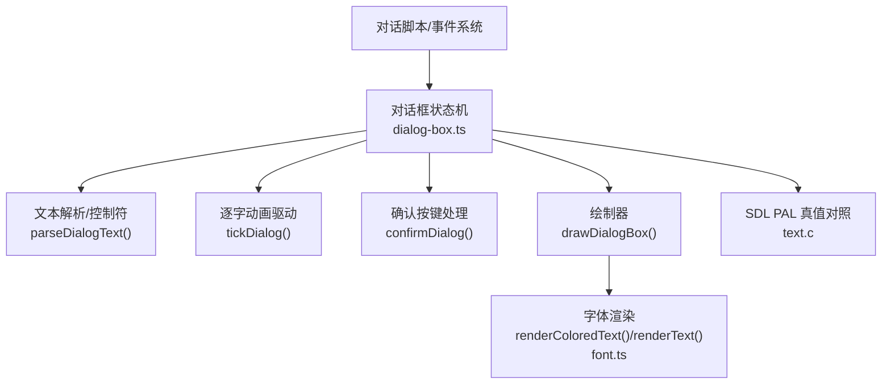
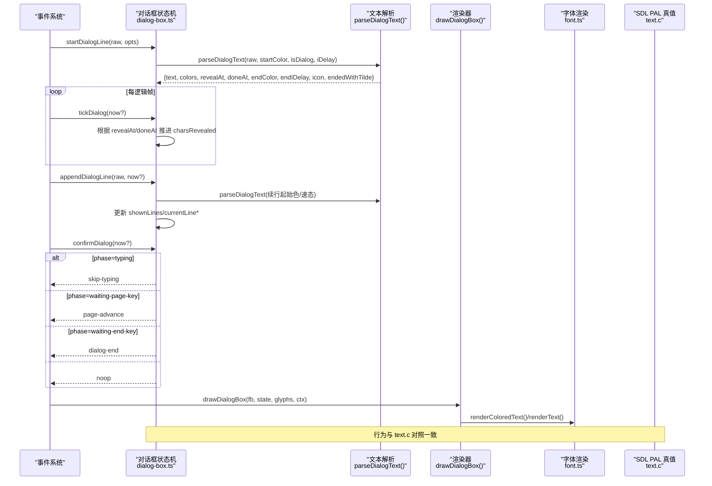
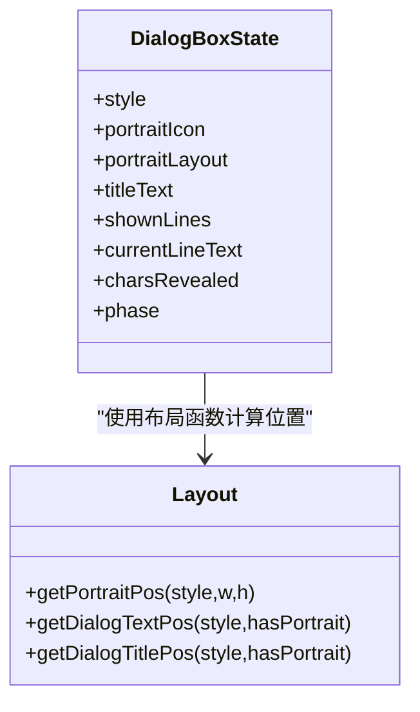
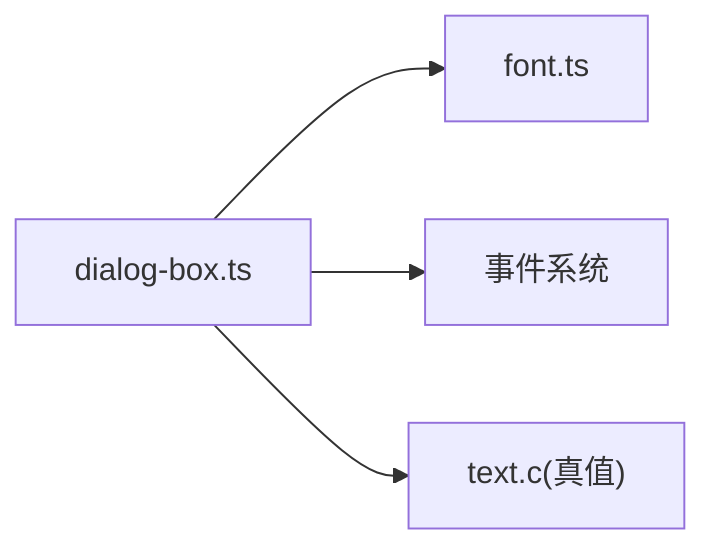

# 对话框系统

<cite>
**本文引用的文件**
- [dialog-box.ts](file://packages/game/src/present/dialog-box.ts)
- [font.ts](file://packages/game/src/present/font.ts)
- [dialog-bug2-skip.test.ts](file://packages/game/src/core/dialog-bug2-skip.test.ts)
- [dialog-box.test.ts](file://packages/game/src/present/dialog-box.test.ts)
- [text.c](file://reference/sdlpal/text.c)
</cite>

## 目录
1. [简介](#简介)
2. [项目结构](#项目结构)
3. [核心组件](#核心组件)
4. [架构总览](#架构总览)
5. [详细组件分析](#详细组件分析)
6. [依赖关系分析](#依赖关系分析)
7. [性能考量](#性能考量)
8. [故障排查指南](#故障排查指南)
9. [结论](#结论)
10. [附录](#附录)

## 简介
本技术文档聚焦于对话框系统的实现与行为，围绕以下目标展开：
- 状态机设计：typing、line-done、waiting-page-key、waiting-end-key 四种状态的转换逻辑。
- 文本渲染引擎：字符控制符解析（颜色切换 $NN、打字速度 $NN、行尾暂停 ~NN）、逐字显示动画、多行自动滚动。
- 头像系统：角色立绘位置计算、布局适配、与文本的相对定位。
- 交互逻辑：Confirm 按键处理、跳过打字、翻页机制、等键图标闪烁。
- sdlpal 源码对照实现细节和边界情况处理。

## 项目结构
对话框系统位于“呈现层”与“核心状态”之间，主要文件如下：
- packages/game/src/present/dialog-box.ts：对话框状态机、文本解析、绘制、交互处理。
- packages/game/src/present/font.ts：逐字符上色渲染函数。
- reference/sdlpal/text.c：SDL PAL 原版文本/对话框实现，作为真值参考。
- packages/game/src/core/dialog-bug2-skip.test.ts 与 packages/game/src/present/dialog-box.test.ts：关键行为测试用例。



**图表来源**
- [dialog-box.ts:1-120](file://packages/game/src/present/dialog-box.ts#L1-L120)
- [font.ts:133-165](file://packages/game/src/present/font.ts#L133-L165)
- [text.c:1458-1613](file://reference/sdlpal/text.c#L1458-L1613)

**章节来源**
- [dialog-box.ts:1-120](file://packages/game/src/present/dialog-box.ts#L1-L120)
- [font.ts:133-165](file://packages/game/src/present/font.ts#L133-L165)
- [text.c:1458-1613](file://reference/sdlpal/text.c#L1458-L1613)

## 核心组件
- 状态机与生命周期
  - typing：当前行逐字显示中；Confirm 可跳至行末并置 fUserSkip。
  - line-done：当前行显示完毕；由事件系统自动推进到下一行，无需 Confirm。
  - waiting-page-key：累计满 4 行后等待 Confirm 清屏翻页。
  - waiting-end-key：整段结束且仍有内容时等待 Confirm 关闭对话框。
- 文本解析与控制符
  - 颜色切换：- 青、' 红、@ 红 alt、“ 黄（仅普通对话生效）。
  - 打字速度：$NN 修改 iDelayTime，影响每字延时。
  - 行尾暂停：~NN 提前结束当前行并追加固定停顿。
  - 等键图标：) 或 ( 设置图标帧号。
  - 转义：\ 转义下一个字符。
- 渲染与动画
  - 逐字显示基于 wall-clock 时间驱动，兼容旧 tick 驱动回退。
  - 姓名牌 title 独立位置与颜色，不计入正文行数。
  - narration 居中提示框走特殊路径，数字以黄色 sprite 显示。
- 头像与布局
  - top/bottom/narration 三种样式下头像位置按宽高中心对齐。
  - 文本缩进与是否画头像解耦，portraitLayout 字段持久化布局。
- 交互与翻页
  - shouldWaitPageKey 判定第 5 行到来时进入 waiting-page-key。
  - confirmDialog 返回动作指令给事件系统：skip-typing/page-advance/dialog-end/noop。
  - key icon 在 waiting-page-key/waiting-end-key 显示并通过调色板轮转产生“闪烁”。

**章节来源**
- [dialog-box.ts:84-145](file://packages/game/src/present/dialog-box.ts#L84-L145)
- [dialog-box.ts:257-374](file://packages/game/src/present/dialog-box.ts#L257-L374)
- [dialog-box.ts:376-429](file://packages/game/src/present/dialog-box.ts#L376-L429)
- [dialog-box.ts:453-562](file://packages/game/src/present/dialog-box.ts#L453-L562)
- [dialog-box.ts:597-708](file://packages/game/src/present/dialog-box.ts#L597-L708)
- [dialog-box.ts:772-839](file://packages/game/src/present/dialog-box.ts#L772-L839)
- [font.ts:133-165](file://packages/game/src/present/font.ts#L133-L165)
- [text.c:1208-1353](file://reference/sdlpal/text.c#L1208-L1353)
- [text.c:1458-1613](file://reference/sdlpal/text.c#L1458-L1613)
- [text.c:1616-1749](file://reference/sdlpal/text.c#L1616-L1749)

## 架构总览
下图展示从事件系统到渲染层的完整流程，以及 SDL PAL 真值对照点。



**图表来源**
- [dialog-box.ts:257-374](file://packages/game/src/present/dialog-box.ts#L257-L374)
- [dialog-box.ts:453-562](file://packages/game/src/present/dialog-box.ts#L453-L562)
- [dialog-box.ts:597-708](file://packages/game/src/present/dialog-box.ts#L597-L708)
- [font.ts:133-165](file://packages/game/src/present/font.ts#L133-L165)
- [text.c:1458-1613](file://reference/sdlpal/text.c#L1458-L1613)
- [text.c:1616-1749](file://reference/sdlpal/text.c#L1616-L1749)

## 详细组件分析

### 状态机设计与转换
- 初始：startDialogLine 创建状态，phase='typing'（title 行直接 'line-done'）。
- 推进：tickDialog 依据 revealAt/doneAt 推进 charsRevealed；当 elapsed >= doneAt 时进入 'line-done'。
- 翻页：appendDialogLine 前调用 shouldWaitPageKey；若有效行数已达 4，则 setWaitingPageKey 进入 'waiting-page-key'。
- 结束：setWaitingEndKey 在整段结束时进入 'waiting-end-key'。
- 交互：confirmDialog 根据当前 phase 返回不同动作，驱动事件系统执行相应后续。

```mermaid
stateDiagram-v2
[*] --> typing : "startDialogLine"
typing --> line-done : "charsRevealed==len 且 elapsed>=doneAt"
line-done --> typing : "appendDialogLine(新行)"
line-done --> waiting-page-key : "shouldWaitPageKey=true"
waiting-page-key --> line-done : "confirmDialog → page-advance + resetDialogBody"
line-done --> waiting-end-key : "setWaitingEndKey(段末)"
waiting-end-key --> [*] : "confirmDialog → dialog-end"
```

**图表来源**
- [dialog-box.ts:257-374](file://packages/game/src/present/dialog-box.ts#L257-L374)
- [dialog-box.ts:376-429](file://packages/game/src/present/dialog-box.ts#L376-L429)
- [dialog-box.ts:453-562](file://packages/game/src/present/dialog-box.ts#L453-L562)

**章节来源**
- [dialog-box.ts:257-374](file://packages/game/src/present/dialog-box.ts#L257-L374)
- [dialog-box.ts:376-429](file://packages/game/src/present/dialog-box.ts#L376-L429)
- [dialog-box.ts:453-562](file://packages/game/src/present/dialog-box.ts#L453-L562)
- [dialog-box.test.ts:170-194](file://packages/game/src/present/dialog-box.test.ts#L170-L194)
- [dialog-box.test.ts:476-502](file://packages/game/src/present/dialog-box.test.ts#L476-L502)

### 文本渲染引擎与控制符解析
- 控制符语义与 sdlpal 对照：
  - 颜色切换：- 青、' 红、@ 红 alt、“ 黄（isDialog=FALSE 才生效）。
  - 打字速度：$NN 修改 iDelayTime，影响 revealAt 累计。
  - 行尾暂停：~NN 提前结束行并追加固定延时，endedWithTilde=true。
  - 等键图标：) 或 ( 设置 iconKind。
  - 转义：\ 输出下一个字符字面。
- 默认色映射：narration(isDialog=TRUE) 且当前色为 DEFAULT 时映射为 0（黑）。
- 逐字显示：revealAt[i] 表示第 i 个 code point 的出现时刻(ms)，tickDialog 用 wall-clock 推进。
- 多行自动滚动：shownLines 累积，currentLineText 在 typing/line-done 间切换；超过 4 行触发翻页。

```mermaid
flowchart TD
Start(["开始解析"]) --> Init["初始化 color/iDelay/cum/icon/out/colors/revealAt"]
Init --> Loop{"遍历每个字符"}
Loop --> |'-/'/@/"| Toggle["切换当前色(注意 isDialog 条件)"]
Loop --> |$NN| Speed["iDelay = floor(NN*10/7); 消费3字符"]
Loop --> |~NN| Tilde["记录 endDelay; 返回{...doneAt, endedWithTilde}"]
Loop --> |)/(| Icon["设置 icon=1/2"]
Loop --> |\| Escape["转义下一字符并 emit"]
Loop --> |其他| Emit["emit(ch): 写入 out/colors/revealAt; cum+=iDelay*8"]
Emit --> Loop
Toggle --> Loop
Speed --> Loop
Icon --> Loop
Escape --> Loop
Tilde --> End(["结束"])
Loop --> End
```

**图表来源**
- [dialog-box.ts:84-145](file://packages/game/src/present/dialog-box.ts#L84-L145)
- [text.c:1458-1613](file://reference/sdlpal/text.c#L1458-L1613)

**章节来源**
- [dialog-box.ts:84-145](file://packages/game/src/present/dialog-box.ts#L84-L145)
- [text.c:1458-1613](file://reference/sdlpal/text.c#L1458-L1613)

### 头像系统与布局适配
- 头像位置：
  - top：x=48-w/2, y=55-h/2。
  - bottom/narration：x=270-w/2, y=144-h/2。
  - center/item-box：不画头像。
- 文本位置：
  - top：有头像 x=96，无头像 x=44；y=26。
  - bottom/narration：有头像 x=20，无头像 x=44；y=126。
  - center：x=80, y=40。
- 姓名牌 title：
  - 首行且非 center 且末字冒号结尾 → 单独位置绘制，CYAN_ALT 色，不计入正文行数。
- portraitLayout 持久化布局位，避免立绘图被擦除后文本缩进丢失。



**图表来源**
- [dialog-box.ts:157-234](file://packages/game/src/present/dialog-box.ts#L157-L234)
- [dialog-box.ts:205-210](file://packages/game/src/present/dialog-box.ts#L205-L210)

**章节来源**
- [dialog-box.ts:157-234](file://packages/game/src/present/dialog-box.ts#L157-L234)
- [dialog-box.ts:205-210](file://packages/game/src/present/dialog-box.ts#L205-L210)
- [text.c:1277-1353](file://reference/sdlpal/text.c#L1277-L1353)

### 交互逻辑：Confirm、跳过、翻页、等键图标
- Confirm 处理：
  - typing 中：跳至行末，置 userSkip=true；若行尾带 ~NN，保留尾停顿并按墙钟对齐。
  - waiting-page-key：清屏+行计数归零，返回 page-advance。
  - waiting-end-key：返回 dialog-end。
  - 其他：noop。
- 翻页机制：
  - shouldWaitPageKey 检测 effectiveLines>=4 即触发 waiting-page-key。
  - resetDialogBody 清空 shownLines/currentLine*，保留 title/portrait/style/fontColorState。
- 等键图标闪烁：
  - 仅在 waiting-page-key/waiting-end-key 显示，center 样式不显示。
  - 通过 palette 索引 0xF9-0xFE 轮转实现“闪烁”，箭头本身常显。

```mermaid
sequenceDiagram
participant U as "用户"
participant DB as "对话框状态机"
participant ES as "事件系统"
U->>DB : 按下 Confirm
alt phase=typing
DB->>DB : charsRevealed=len; userSkip=true
DB-->>ES : skip-typing
else phase=waiting-page-key
DB->>DB : resetDialogBody(); userSkip=false
DB-->>ES : page-advance
else phase=waiting-end-key
DB-->>ES : dialog-end
else
DB-->>ES : noop
end
```

**图表来源**
- [dialog-box.ts:499-562](file://packages/game/src/present/dialog-box.ts#L499-L562)
- [dialog-box.ts:376-429](file://packages/game/src/present/dialog-box.ts#L376-L429)
- [dialog-box.ts:705-708](file://packages/game/src/present/dialog-box.ts#L705-L708)
- [text.c:1355-1448](file://reference/sdlpal/text.c#L1355-L1448)

**章节来源**
- [dialog-box.ts:499-562](file://packages/game/src/present/dialog-box.ts#L499-L562)
- [dialog-box.ts:376-429](file://packages/game/src/present/dialog-box.ts#L376-L429)
- [dialog-box.test.ts:476-502](file://packages/game/src/present/dialog-box.test.ts#L476-L502)
- [dialog-bug2-skip.test.ts:95-123](file://packages/game/src/core/dialog-bug2-skip.test.ts#L95-L123)
- [text.c:1355-1448](file://reference/sdlpal/text.c#L1355-L1448)

### sdlpal 源码对照与边界情况
- 真值对照要点：
  - 每行行距 18px，MAX_LINES_PER_PAGE=4。
  - TEXT_DisplayText 控制符处理与 per-char 绘制。
  - PAL_ShowDialogText 分页与标题识别逻辑。
  - PAL_DialogWaitForKey 等键循环与 palette 闪烁。
- 边界情况：
  - `~NN` 尾停顿不可被 Confirm 重置或加速；wall-clock 对齐确保只等剩余尾停顿。
  - 连续 Confirm 连锁瞬显同段后续行，直到翻页或段末复位 fUserSkip。
  - narration 居中提示框一次性显示，数字以黄色 sprite 显示，fShadow=FALSE。
  - center 样式不显示等键图标。

**章节来源**
- [dialog-box.ts:1-25](file://packages/game/src/present/dialog-box.ts#L1-L25)
- [dialog-box.ts:772-839](file://packages/game/src/present/dialog-box.ts#L772-L839)
- [text.c:1616-1749](file://reference/sdlpal/text.c#L1616-L1749)
- [text.c:1355-1448](file://reference/sdlpal/text.c#L1355-L1448)
- [dialog-bug2-skip.test.ts:95-123](file://packages/game/src/core/dialog-bug2-skip.test.ts#L95-L123)

## 依赖关系分析
- 模块内依赖：
  - dialog-box.ts 依赖 font.ts 的 renderText/renderColoredText。
  - dialog-box.ts 内部包含布局计算、状态机、交互处理与绘制。
- 外部依赖：
  - 事件系统驱动 startDialogLine/appendDialogLine/confirmDialog。
  - SDL PAL text.c 提供真值参考，用于对齐行为。



**图表来源**
- [dialog-box.ts:1-120](file://packages/game/src/present/dialog-box.ts#L1-L120)
- [font.ts:133-165](file://packages/game/src/present/font.ts#L133-L165)
- [text.c:1458-1613](file://reference/sdlpal/text.c#L1458-L1613)

**章节来源**
- [dialog-box.ts:1-120](file://packages/game/src/present/dialog-box.ts#L1-L120)
- [font.ts:133-165](file://packages/game/src/present/font.ts#L133-L165)
- [text.c:1458-1613](file://reference/sdlpal/text.c#L1458-L1613)

## 性能考量
- 逐字动画采用 wall-clock 驱动，避免旧 tick 驱动的成块蹦字问题，提升流畅度。
- 翻页清屏与 body 重置减少重复绘制开销。
- narration 路径一次性显示，避免不必要的逐字延迟。
- 等键图标通过 palette 轮转而非频繁重绘，降低渲染压力。

[本节为通用指导，不涉及具体文件分析]

## 故障排查指南
- 症状：按 Confirm 无法跳过 `~NN` 尾停顿
  - 原因：尾停顿是固定时长同步 UTIL_Delay，Confirm 不应重置。
  - 处理：确认 confirmDialog 在跳字前判断 endedWithTilde 且 charsRevealed 已满时返回 noop；wall-clock 对齐确保只等剩余尾停顿。
- 症状：连续 Confirm 导致无限卡在某句
  - 原因：错误地重置了 lineStartMs 或误判尾停顿。
  - 处理：检查 confirmDialog 对 `~NN` 分支的逻辑与 wall-clock 调整。
- 症状：翻页后头像或文本缩进异常
  - 原因：portraitLayout 未持久化或 resetDialogBody 误清布局相关状态。
  - 处理：确保 portraitLayout 与 style/fontColorState 不被误清。
- 症状：center 样式出现等键图标
  - 原因：shouldShowKeyIcon 未排除 center。
  - 处理：确认 shouldShowKeyIcon 对 center 样式的守卫。

**章节来源**
- [dialog-box.ts:499-562](file://packages/game/src/present/dialog-box.ts#L499-L562)
- [dialog-box.ts:705-708](file://packages/game/src/present/dialog-box.ts#L705-L708)
- [dialog-box.test.ts:476-502](file://packages/game/src/present/dialog-box.test.ts#L476-L502)
- [dialog-bug2-skip.test.ts:95-123](file://packages/game/src/core/dialog-bug2-skip.test.ts#L95-L123)

## 结论
本对话框系统严格对齐 sdlpal 真值，实现了稳健的状态机、精确的控制符解析、流畅的逐字动画与可靠的交互逻辑。通过对 wall-clock 的引入与边界情况的处理，系统在体验与还原度上达到较高水平。建议持续完善 e2e 测试覆盖更多边界场景，并在重构层保持与真值一致的布局与渲染策略。

[本节为总结性内容，不涉及具体文件分析]

## 附录
- 关键常量与接口
  - FRAMES_PER_CHAR、DIALOG_IDELAY_DEFAULT、MAX_LINES_PER_PAGE、LINE_HEIGHT_PX。
  - ParsedDialogLine 接口定义文本解析输出。
  - getDialogTextPos/getDialogTitlePos/getPortraitPos 布局函数。
- 参考 sdlpal 函数
  - TEXT_DisplayText、PAL_ShowDialogText、PAL_DialogWaitForKey、PAL_ClearDialog、PAL_EndDialog。

**章节来源**
- [dialog-box.ts:34-82](file://packages/game/src/present/dialog-box.ts#L34-L82)
- [dialog-box.ts:147-234](file://packages/game/src/present/dialog-box.ts#L147-L234)
- [text.c:1458-1613](file://reference/sdlpal/text.c#L1458-L1613)
- [text.c:1616-1749](file://reference/sdlpal/text.c#L1616-L1749)