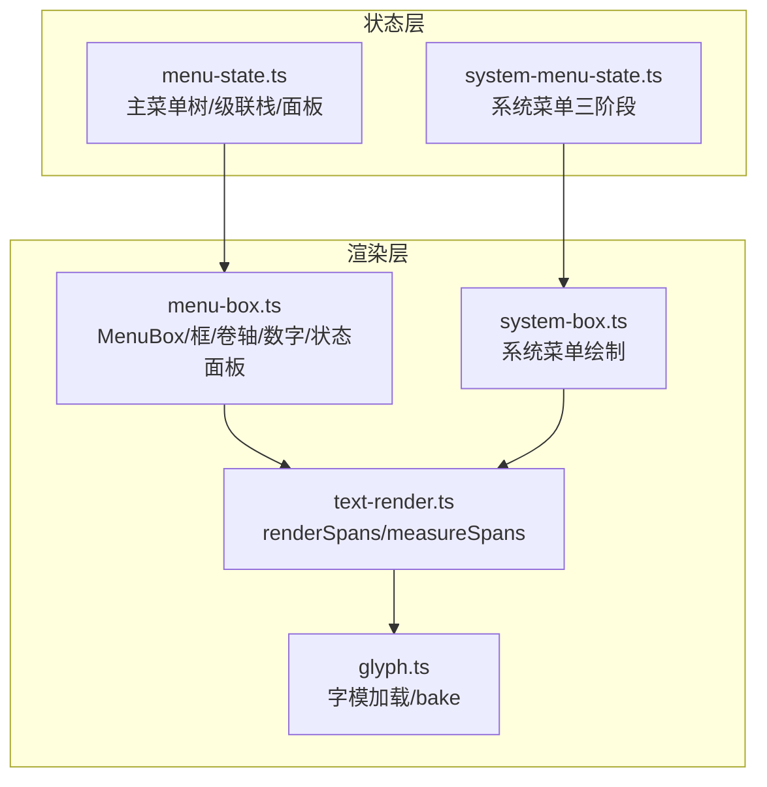
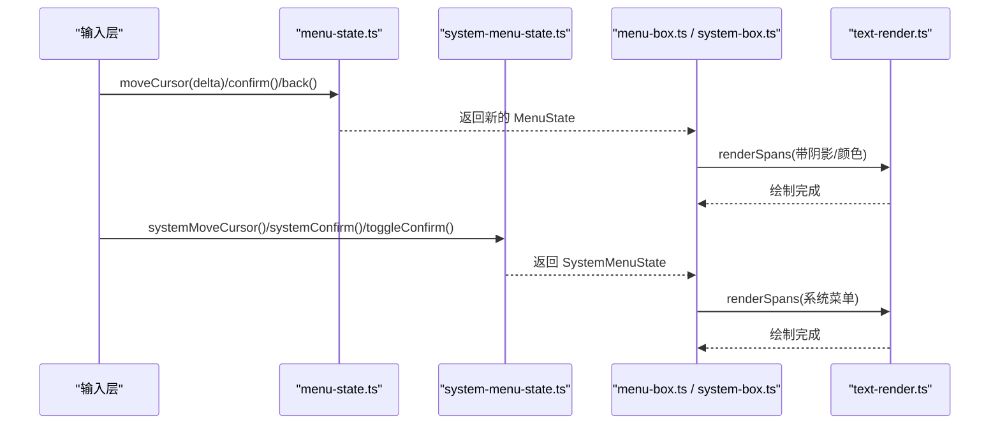
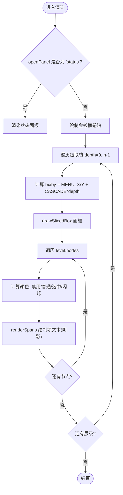
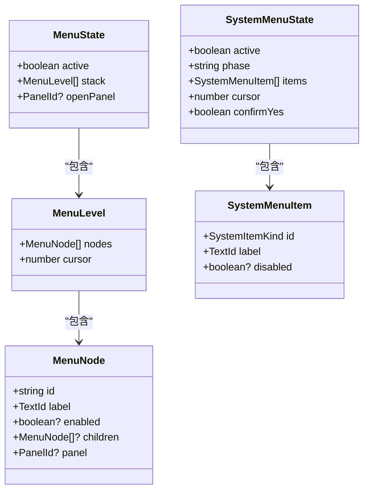
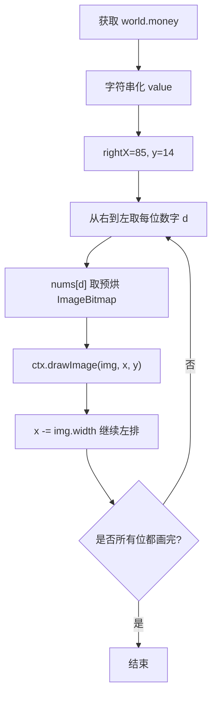
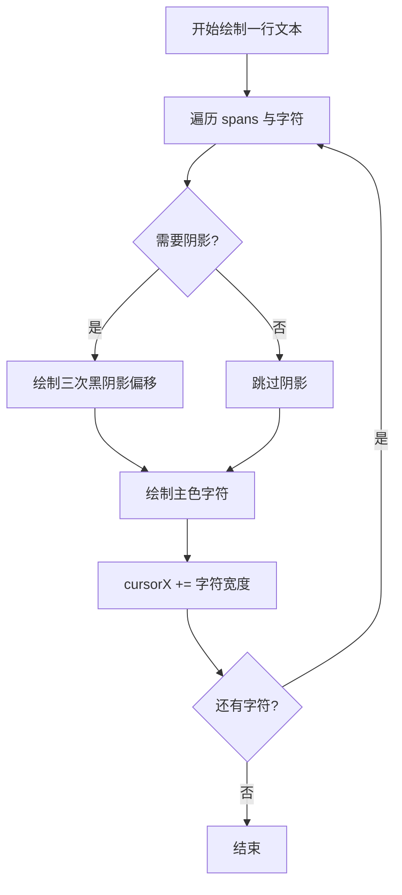
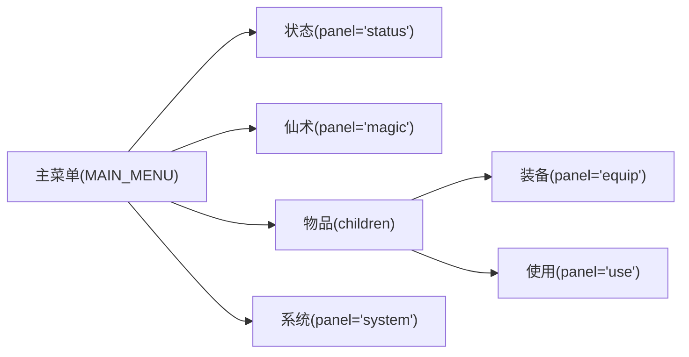
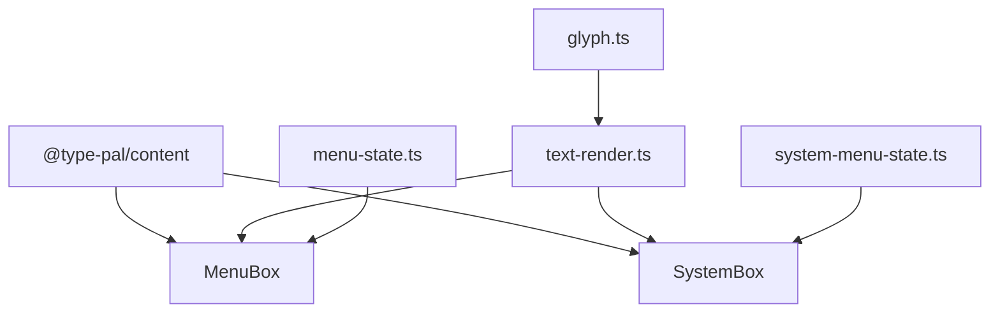

# 主菜单系统

<cite>
**本文引用的文件列表**
- [packages/reforge/src/menu/menu-box.ts](file://packages/reforge/src/menu/menu-box.ts)
- [packages/reforge/src/menu-state.ts](file://packages/reforge/src/menu-state.ts)
- [packages/reforge/src/system-menu-state.ts](file://packages/reforge/src/system-menu-state.ts)
- [packages/reforge/src/menu/system-box.ts](file://packages/reforge/src/menu/system-box.ts)
- [packages/reforge/src/text/text-render.ts](file://packages/reforge/src/text/text-render.ts)
- [packages/reforge/src/text/glyph.ts](file://packages/reforge/src/text/glyph.ts)
- [docs/phase2/menu/cash-box-plan.md](file://docs/phase2/menu/cash-box-plan.md)
</cite>

## 目录
1. [简介](#简介)
2. [项目结构](#项目结构)
3. [核心组件](#核心组件)
4. [架构总览](#架构总览)
5. [详细组件分析](#详细组件分析)
6. [依赖关系分析](#依赖关系分析)
7. [性能考量](#性能考量)
8. [故障排查指南](#故障排查指南)
9. [结论](#结论)
10. [附录：新菜单类型开发指南](#附录新菜单类型开发指南)

## 简介
本技术文档聚焦于“主菜单系统”的渲染架构与交互实现，覆盖以下关键主题：
- 菜单项布局算法、焦点管理逻辑、键盘导航实现
- 金钱显示框的位置计算、数字渲染、颜色处理
- 系统菜单与子菜单的层级关系：菜单栈管理、状态切换机制
- 菜单项的动态闪烁效果、阴影文本渲染、高分辨率适配策略
- 新菜单类型的开发与集成方法（菜单项定义、事件处理绑定、样式配置）

## 项目结构
主菜单系统由“状态机 + UI 渲染”两部分组成：
- 状态层：维护多级菜单树、级联栈、面板开关、系统菜单三阶段等纯函数式状态。
- 渲染层：基于 Canvas 2D 的九宫格框、卷轴、数字 sprite、字模渲染等原语，组合出主菜单、子菜单、系统菜单与状态面板。

图表来源
- [packages/reforge/src/menu/menu-box.ts:421-485](file://packages/reforge/src/menu/menu-box.ts#L421-L485)
- [packages/reforge/src/menu-state.ts:1-89](file://packages/reforge/src/menu-state.ts#L1-L89)
- [packages/reforge/src/system-menu-state.ts:1-92](file://packages/reforge/src/system-menu-state.ts#L1-L92)
- [packages/reforge/src/menu/system-box.ts:1-80](file://packages/reforge/src/menu/system-box.ts#L1-L80)
- [packages/reforge/src/text/text-render.ts:1-63](file://packages/reforge/src/text/text-render.ts#L1-L63)
- [packages/reforge/src/text/glyph.ts:1-88](file://packages/reforge/src/text/glyph.ts#L1-L88)

章节来源
- [packages/reforge/src/menu/menu-box.ts:1-561](file://packages/reforge/src/menu/menu-box.ts#L1-L561)
- [packages/reforge/src/menu-state.ts:1-89](file://packages/reforge/src/menu-state.ts#L1-L89)
- [packages/reforge/src/system-menu-state.ts:1-92](file://packages/reforge/src/system-menu-state.ts#L1-L92)
- [packages/reforge/src/menu/system-box.ts:1-80](file://packages/reforge/src/menu/system-box.ts#L1-L80)
- [packages/reforge/src/text/text-render.ts:1-63](file://packages/reforge/src/text/text-render.ts#L1-L63)
- [packages/reforge/src/text/glyph.ts:1-88](file://packages/reforge/src/text/glyph.ts#L1-L88)

## 核心组件
- 菜单状态机（menu-state.ts）
  - 维护主菜单树 MAIN_MENU、级联栈 stack、当前打开的面板 openPanel。
  - 提供 open/close/moveCursor/confirm/back/topLevel 等纯函数操作。
- 系统菜单状态机（system-menu-state.ts）
  - 三阶段 menu/confirm，支持 save/load/quit 占位与确认流程。
  - 提供 open/close/moveCursor/confirm/toggleConfirm/confirmYes 等函数。
- 菜单渲染器（menu-box.ts）
  - MenuBox.render 根据 state/world/now 决定渲染路径：状态面板或级联菜单。
  - 级联渲染 renderCascade 负责金钱框、逐层菜单框与项文字。
  - 提供 drawSlicedBox/drawScroll/drawNumber/drawConfirmBox 等原语。
- 系统菜单渲染（system-box.ts）
  - drawSystemMenu 绘制系统菜单框、选项、确认框与占位提示。
- 文本渲染（text-render.ts, glyph.ts）
  - renderSpans 负责字模解码、三层阴影、颜色覆盖；bakeGlyph 缓存每字符图像。

章节来源
- [packages/reforge/src/menu-state.ts:1-89](file://packages/reforge/src/menu-state.ts#L1-L89)
- [packages/reforge/src/system-menu-state.ts:1-92](file://packages/reforge/src/system-menu-state.ts#L1-L92)
- [packages/reforge/src/menu/menu-box.ts:421-561](file://packages/reforge/src/menu/menu-box.ts#L421-L561)
- [packages/reforge/src/menu/system-box.ts:1-80](file://packages/reforge/src/menu/system-box.ts#L1-L80)
- [packages/reforge/src/text/text-render.ts:1-63](file://packages/reforge/src/text/text-render.ts#L1-L63)
- [packages/reforge/src/text/glyph.ts:1-88](file://packages/reforge/src/text/glyph.ts#L1-L88)

## 架构总览
主菜单系统的控制流如下：
- 输入驱动状态机更新（moveCursor/confirm/back 等）。
- 渲染器读取最新状态并绘制：
  - 若 openPanel='status'，走状态面板渲染。
  - 否则走级联菜单渲染：先画金钱横卷轴，再按深度偏移绘制各层菜单框与项。
- 系统菜单作为独立面板叠加在主菜单之上，拥有自己的状态机与绘制流程。

图表来源
- [packages/reforge/src/menu/menu-box.ts:421-485](file://packages/reforge/src/menu/menu-box.ts#L421-L485)
- [packages/reforge/src/menu-state.ts:57-88](file://packages/reforge/src/menu-state.ts#L57-L88)
- [packages/reforge/src/system-menu-state.ts:42-91](file://packages/reforge/src/system-menu-state.ts#L42-L91)
- [packages/reforge/src/text/text-render.ts:20-51](file://packages/reforge/src/text/text-render.ts#L20-L51)

## 详细组件分析

### 菜单项布局算法与焦点管理
- 布局常量
  - 主菜单框位置 (MENU_X, MENU_Y)、宽 (MENU_W)、基础高 (MENU_H_BASE)、项起始坐标 (ITEM_X, ITEM_Y0)、行距 (ITEM_H)。
  - 级联偏移 (CASCADE_DX, CASCADE_DY) 用于子菜单相对父菜单的位移，形成“级联展开”。
- 焦点管理
  - 末层光标移动采用环绕算法：(cursor + delta + n) % n。
  - 面板打开时禁止移动光标，确保面板内交互优先。
- 选择态与禁用态
  - enabled=false 的项使用禁用色；选中禁用项使用禁用选中色。
  - 最深层且无面板时，选中项启用闪烁；有子面板时，最深层静态高亮以指示已展开路径。

图表来源
- [packages/reforge/src/menu/menu-box.ts:445-485](file://packages/reforge/src/menu/menu-box.ts#L445-L485)
- [packages/reforge/src/menu-state.ts:57-65](file://packages/reforge/src/menu-state.ts#L57-L65)

章节来源
- [packages/reforge/src/menu/menu-box.ts:134-160](file://packages/reforge/src/menu/menu-box.ts#L134-L160)
- [packages/reforge/src/menu/menu-box.ts:445-485](file://packages/reforge/src/menu/menu-box.ts#L445-L485)
- [packages/reforge/src/menu-state.ts:57-65](file://packages/reforge/src/menu-state.ts#L57-L65)

### 键盘导航实现
- 主菜单
  - moveCursor(s, delta)：仅对顶层生效，delta 为 ±1，支持首尾环绕。
  - confirm(s)：若节点有 children → 压栈；若有 panel → 打开面板；disabled 则忽略。
  - back(s)：面板打开 → 关闭面板；多层 → 弹栈；单层 → 关闭菜单。
- 系统菜单
  - systemMoveCursor(s, dir)：单列环绕，Up/Left=-1，Down/Right=+1。
  - systemConfirm(s)：save/load → 触发 action；quit → 进入 confirm；music/sound → placeholder。
  - systemToggleConfirm(s)：四方向切换“是/否”。
  - systemConfirmYes(s)：是 → quit action；否 → 关闭系统菜单。

图表来源
- [packages/reforge/src/menu-state.ts:6-40](file://packages/reforge/src/menu-state.ts#L6-L40)
- [packages/reforge/src/system-menu-state.ts:8-29](file://packages/reforge/src/system-menu-state.ts#L8-L29)

章节来源
- [packages/reforge/src/menu-state.ts:57-88](file://packages/reforge/src/menu-state.ts#L57-L88)
- [packages/reforge/src/system-menu-state.ts:42-91](file://packages/reforge/src/system-menu-state.ts#L42-L91)

### 金钱显示框的实现
- 位置计算
  - 横卷轴位于 (0,0)，长度 nLen=5，高度由 scroll 九宫格上中下三段自然高累加。
  - “金钱”标签位于 (10,10)，数字右对齐固定 rightX=85，y=14。
- 数字渲染
  - drawNumber(value, rightX, y, nums)：从个位开始向左排列，索引=数字值。
  - 数字资源 nums 预烘为 ImageBitmap，索引 0-9。
- 颜色处理
  - 数字使用黄色（默认），HP/MP 最大值分别用蓝色/青色数字 sprite。
- 资源加载
  - loadMenuAssets 并行加载数字 sprite、斜杠、角色立绘等。

图表来源
- [packages/reforge/src/menu/menu-box.ts:188-206](file://packages/reforge/src/menu/menu-box.ts#L188-L206)
- [packages/reforge/src/menu/menu-box.ts:452-459](file://packages/reforge/src/menu/menu-box.ts#L452-L459)
- [packages/reforge/src/menu/menu-box.ts:378-386](file://packages/reforge/src/menu/menu-box.ts#L378-L386)

章节来源
- [packages/reforge/src/menu/menu-box.ts:188-206](file://packages/reforge/src/menu/menu-box.ts#L188-L206)
- [packages/reforge/src/menu/menu-box.ts:452-459](file://packages/reforge/src/menu/menu-box.ts#L452-L459)
- [docs/phase2/menu/cash-box-plan.md:135-202](file://docs/phase2/menu/cash-box-plan.md#L135-L202)

### 动态闪烁效果与阴影文本渲染
- 闪烁效果
  - SELECTED_COLORS 为 6 帧循环数组，blink = SELECTED_COLORS[Math.floor(now / 100) % 6]。
  - 最深层且无面板时，选中项使用 blink；否则使用静态高亮色。
- 阴影文本
  - renderSpans 在绘制主色前，额外绘制三次黑色阴影（+1,0）、(0,+1)、(+1,+1)，形成柔和描边。
  - 可通过 forceRgba 强制覆盖 span 颜色（如姓名牌、禁用项等）。

图表来源
- [packages/reforge/src/text/text-render.ts:20-51](file://packages/reforge/src/text/text-render.ts#L20-L51)
- [packages/reforge/src/menu/menu-box.ts:153-160](file://packages/reforge/src/menu/menu-box.ts#L153-L160)
- [packages/reforge/src/menu/menu-box.ts:461-476](file://packages/reforge/src/menu/menu-box.ts#L461-L476)

章节来源
- [packages/reforge/src/text/text-render.ts:20-51](file://packages/reforge/src/text/text-render.ts#L20-L51)
- [packages/reforge/src/menu/menu-box.ts:153-160](file://packages/reforge/src/menu/menu-box.ts#L153-L160)
- [packages/reforge/src/menu/menu-box.ts:461-476](file://packages/reforge/src/menu/menu-box.ts#L461-L476)

### 高分辨率适配策略
- 调用方设置 ctx.scale(WORLD_SCALE=4)，UI 逻辑坐标为 320×200，实际物理像素为 1280×800。
- 字模沿用 16px 点阵，×4 整数放大后每个原像素变为 4×4 实色块，保持锐利不糊。
- 阴影偏移按物理像素调整，避免错位。

章节来源
- [packages/reforge/src/menu/menu-box.ts:1-7](file://packages/reforge/src/menu/menu-box.ts#L1-L7)
- [docs/phase2/foundation/render-foundation-plan.md:216-238](file://docs/phase2/foundation/render-foundation-plan.md#L216-L238)

### 系统菜单与子菜单的层级关系
- 主菜单树 MAIN_MENU 定义了“状态/仙术/物品/系统”四个一级项。
- 物品为二级菜单，包含“装备/使用”两个叶子面板。
- 系统菜单为独立面板，通过 openPanel='system' 在主菜单常驻基础上叠加绘制。

图表来源
- [packages/reforge/src/menu-state.ts:15-28](file://packages/reforge/src/menu-state.ts#L15-L28)

章节来源
- [packages/reforge/src/menu-state.ts:15-28](file://packages/reforge/src/menu-state.ts#L15-L28)

## 依赖关系分析
- 渲染层依赖
  - MenuBox 依赖 text-render/glyph 进行文本绘制，依赖 MenuAssets 提供的九宫格、数字 sprite、图标等资源。
  - system-box 复用 menu-box 的颜色常量与 drawSlicedBox/drawConfirmBox。
- 状态层依赖
  - menu-state 与 system-menu-state 相互独立，分别被上层 main 控制器协调。
- 外部依赖
  - content 包提供 locale、TextId、CharacterInstance、EQUIP_SLOT_IDS 等数据模型。

图表来源
- [packages/reforge/src/menu/menu-box.ts:8-20](file://packages/reforge/src/menu/menu-box.ts#L8-L20)
- [packages/reforge/src/menu/system-box.ts:4-16](file://packages/reforge/src/menu/system-box.ts#L4-L16)
- [packages/reforge/src/text/text-render.ts:1-4](file://packages/reforge/src/text/text-render.ts#L1-L4)
- [packages/reforge/src/text/glyph.ts:1-16](file://packages/reforge/src/text/glyph.ts#L1-L16)

章节来源
- [packages/reforge/src/menu/menu-box.ts:8-20](file://packages/reforge/src/menu/menu-box.ts#L8-L20)
- [packages/reforge/src/menu/system-box.ts:4-16](file://packages/reforge/src/menu/system-box.ts#L4-L16)
- [packages/reforge/src/text/text-render.ts:1-4](file://packages/reforge/src/text/text-render.ts#L1-L4)
- [packages/reforge/src/text/glyph.ts:1-16](file://packages/reforge/src/text/glyph.ts#L1-L16)

## 性能考量
- 资源预烘与缓存
  - 数字 sprite、九宫格 tile、角色立绘等在启动期并行加载，减少运行时开销。
  - bakeGlyph 对每字符+颜色组合缓存 HTMLCanvasElement，避免重复解码与涂绘。
- 离屏合成优化
  - 大阴影通过离屏 canvas + source-in 剪影方式一次性生成，降低多次 blit 成本。
- 平铺填充
  - tileFill 使用 clip 区域与循环绘制，避免拉伸变形，提升纹理一致性。

[本节为通用性能建议，无需特定文件引用]

## 故障排查指南
- 金钱数字未显示或错位
  - 检查 nums 资源是否正确加载（索引 0-9），以及 drawNumber 的 rightX/y 是否与卷轴贴合。
  - 参考计划文档中的浏览器验收步骤与参数调优说明。
- 阴影异常或过深
  - 确认 renderSpans 的 shadow=true 与 forceRgba 使用场景，避免不必要的阴影叠加。
  - 注意 drawBoxShadow 的离屏尺寸余量，防止右侧阴影被裁切。
- 闪烁不同步或卡顿
  - 检查 now 时间戳来源与 SELECTED_COLORS 索引计算，确保每帧稳定更新。
- 高分辨率模糊
  - 确认调用方 ctx.scale(WORLD_SCALE=4) 且 imageSmoothingEnabled=false，保证整数倍放大。

章节来源
- [docs/phase2/menu/cash-box-plan.md:135-218](file://docs/phase2/menu/cash-box-plan.md#L135-L218)
- [packages/reforge/src/menu/menu-box.ts:54-77](file://packages/reforge/src/menu/menu-box.ts#L54-L77)
- [packages/reforge/src/text/text-render.ts:20-51](file://packages/reforge/src/text/text-render.ts#L20-L51)

## 结论
主菜单系统通过“状态机 + 渲染器”的清晰分层，实现了可维护的多级菜单与系统菜单交互。其亮点包括：
- 数据驱动的菜单树与级联栈，便于扩展新菜单项与面板。
- 统一的九宫格框与卷轴原语，配合阴影与闪烁效果，还原原版观感。
- 高分辨率适配策略在不更换字模源的前提下获得锐利清晰的 UI。
- 金钱显示框的数字渲染与颜色处理具备良好可扩展性。

[本节为总结性内容，无需特定文件引用]

## 附录：新菜单类型开发指南
- 新增菜单项
  - 在 MAIN_MENU 中添加 MenuNode，指定 label、children 或 panel。
  - 如需禁用某项，设置 enabled=false。
- 事件处理绑定
  - 输入层调用 moveCursor/confirm/back 更新 MenuState。
  - 系统菜单使用 systemMoveCursor/systemConfirm/systemToggleConfirm/systemConfirmYes。
- 样式配置
  - 复用 COLOR_NORMAL/COLOR_DISABLED/COLOR_DISABLED_SEL/SELECTED_COLORS。
  - 通过 drawSlicedBox/drawScroll/drawConfirmBox 统一绘制风格。
- 资源准备
  - 在 loadMenuAssets 中按需加载新 sprite（数字、图标、框等），并确保索引一致。
- 验证与调试
  - 使用浏览器 dev 模式逐项核对布局、颜色、阴影与闪烁。
  - 参考 cash-box-plan 的自检清单与 commit 规范。

章节来源
- [packages/reforge/src/menu-state.ts:15-28](file://packages/reforge/src/menu-state.ts#L15-L28)
- [packages/reforge/src/system-menu-state.ts:14-21](file://packages/reforge/src/system-menu-state.ts#L14-L21)
- [packages/reforge/src/menu/menu-box.ts:149-160](file://packages/reforge/src/menu/menu-box.ts#L149-L160)
- [packages/reforge/src/menu/menu-box.ts:356-419](file://packages/reforge/src/menu/menu-box.ts#L356-L419)
- [docs/phase2/menu/cash-box-plan.md:204-218](file://docs/phase2/menu/cash-box-plan.md#L204-L218)