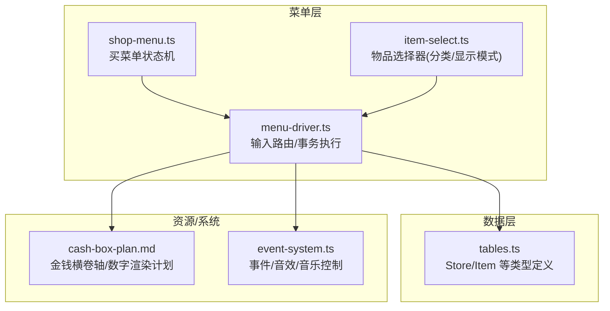
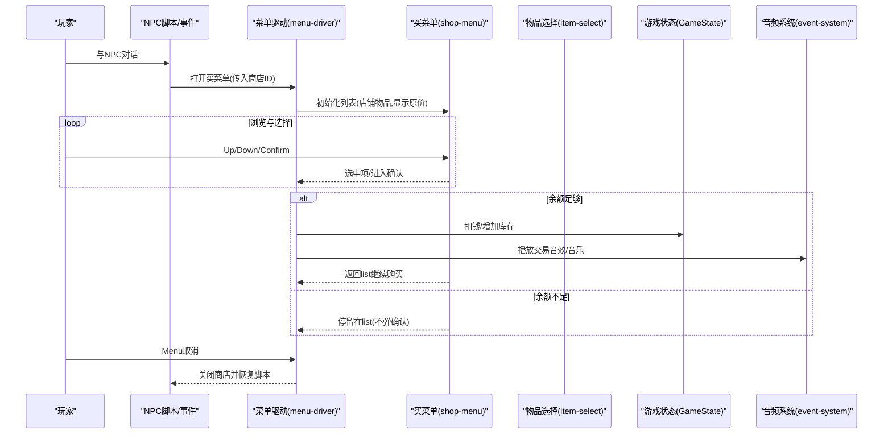
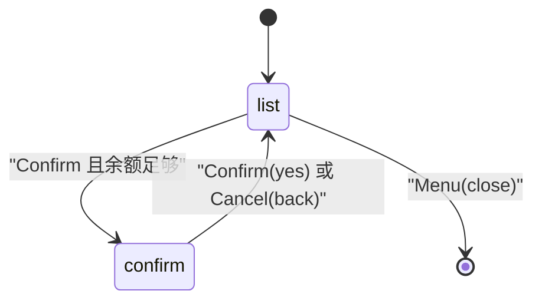
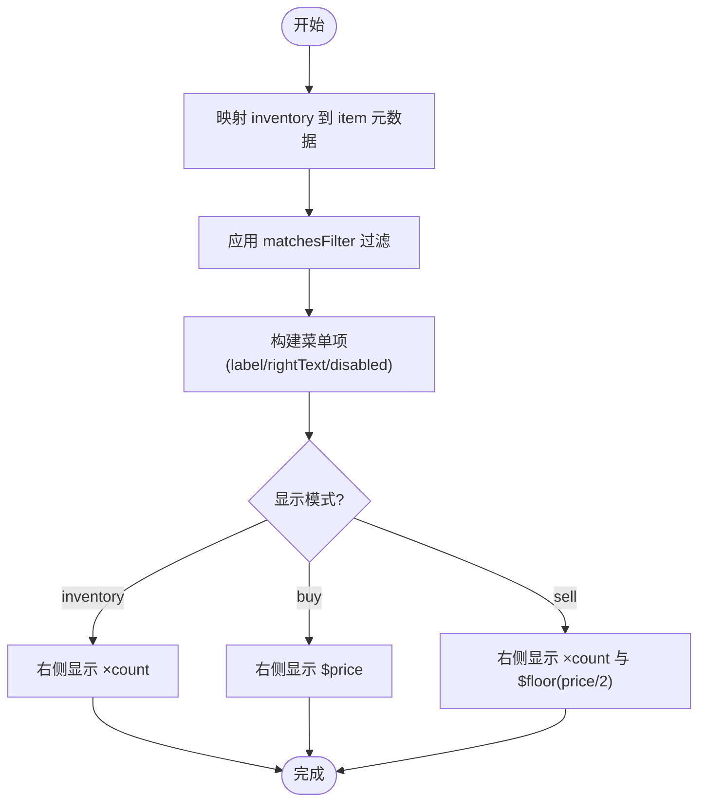
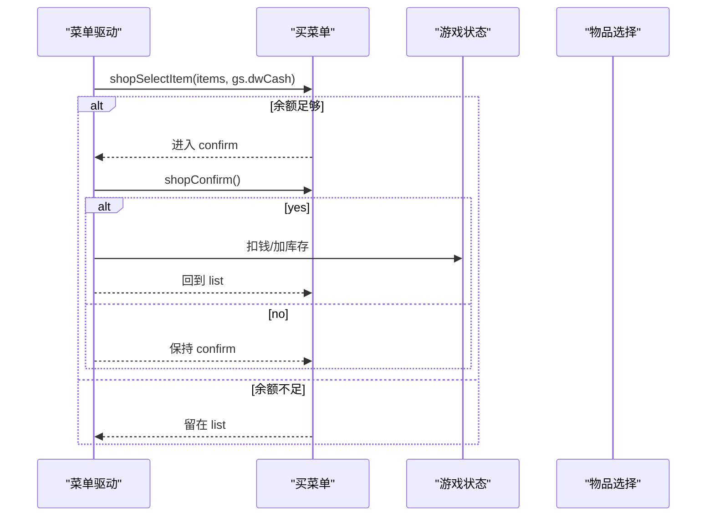
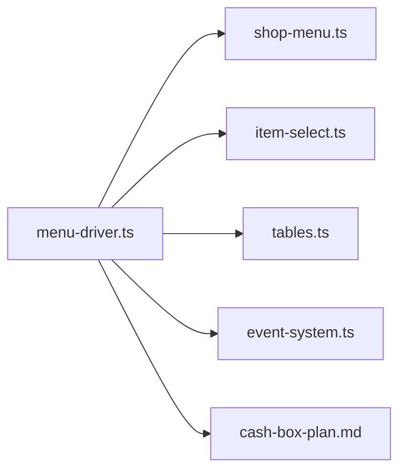

# 商店交易界面

<cite>
**本文引用的文件**
- [shop-menu.ts](file://packages/game/src/core/menu/shop-menu.ts)
- [menu-driver.ts](file://packages/game/src/core/menu/menu-driver.ts)
- [item-select.ts](file://packages/game/src/core/menu/item-select.ts)
- [tables.ts](file://packages/shared/src/tables.ts)
- [cash-box-plan.md](file://docs/phase2/menu/cash-box-plan.md)
- [event-system.ts](file://packages/game/src/core/event-system.ts)
</cite>

## 目录
1. [简介](#简介)
2. [项目结构](#项目结构)
3. [核心组件](#核心组件)
4. [架构总览](#架构总览)
5. [详细组件分析](#详细组件分析)
6. [依赖关系分析](#依赖关系分析)
7. [性能与体验优化](#性能与体验优化)
8. [故障排查指南](#故障排查指南)
9. [结论](#结论)
10. [附录：扩展与定制](#附录扩展与定制)

## 简介
本技术文档围绕“商店交易界面”的实现，系统性梳理商品展示布局、购买/出售模式切换、价格显示与库存管理、交易流程（选择—数量调整—确认结算）、货币处理（余额检查、动画与音效反馈）、筛选功能（类别过滤、价格排序、搜索匹配），以及与 NPC 对话集成、交易历史记录、折扣计算逻辑。同时提供新商店类型的创建指南与交易规则定制方法，帮助开发者快速扩展与落地。

## 项目结构
商店交易相关代码主要分布在菜单子系统与共享数据表定义中：
- 买菜单状态机与交互：shop-menu.ts
- 卖菜单与物品选择器：item-select.ts（配合 sell-menu.ts 的网格导航）
- 菜单驱动与输入路由：menu-driver.ts
- 商店数据结构与物品元数据：tables.ts
- 金钱横卷轴与数字渲染计划：cash-box-plan.md
- 事件系统与脚本回调（含音乐/音效控制）：event-system.ts

图表来源
- [shop-menu.ts:1-104](file://packages/game/src/core/menu/shop-menu.ts#L1-L104)
- [item-select.ts:1-88](file://packages/game/src/core/menu/item-select.ts#L1-L88)
- [menu-driver.ts:250-359](file://packages/game/src/core/menu/menu-driver.ts#L250-L359)
- [tables.ts:433-448](file://packages/shared/src/tables.ts#L433-L448)
- [cash-box-plan.md:1-229](file://docs/phase2/menu/cash-box-plan.md#L1-L229)
- [event-system.ts:82-101](file://packages/game/src/core/event-system.ts#L82-L101)

章节来源
- [shop-menu.ts:1-104](file://packages/game/src/core/menu/shop-menu.ts#L1-L104)
- [item-select.ts:1-88](file://packages/game/src/core/menu/item-select.ts#L1-L88)
- [menu-driver.ts:250-359](file://packages/game/src/core/menu/menu-driver.ts#L250-L359)
- [tables.ts:433-448](file://packages/shared/src/tables.ts#L433-L448)
- [cash-box-plan.md:1-229](file://docs/phase2/menu/cash-box-plan.md#L1-L229)
- [event-system.ts:82-101](file://packages/game/src/core/event-system.ts#L82-L101)

## 核心组件
- 买菜单状态机（shop-menu.ts）
  - 负责紧凑列表布局的状态流转：list → confirm → list；支持 Up/Down 在列表与确认框间切换；Confirm 进入确认阶段；Menu 退出或关闭。
  - 购买时进行余额检查，买不起不弹出确认框。
- 物品选择器（item-select.ts）
  - 支持 inventory/buy/sell 三种显示模式；按 flags 实现分类过滤（equip/potion/battle/important/usable/sellable/all）。
  - buy 模式显示原价；sell 模式显示数量与卖价（原价/2）。
- 菜单驱动（menu-driver.ts）
  - 统一分发输入到各菜单状态机；在 confirm-yes 时执行交易（扣钱/加物或减物/加钱）。
  - 卖菜单走全屏 grid 导航，卖出后刷新列表。
- 商店数据（tables.ts）
  - Store.items 为绝对 OBJECT id 序列，首个 0 截断；对应 sdlpal 商店条目数组。
- 金钱横卷轴（cash-box-plan.md）
  - 主菜单顶部横卷轴 + 数字右对齐渲染方案，用于展示余额。
- 事件系统（event-system.ts）
  - 提供播放/停止音乐、CD 音乐等事件码，可用于交易场景的音频反馈。

章节来源
- [shop-menu.ts:1-104](file://packages/game/src/core/menu/shop-menu.ts#L1-L104)
- [item-select.ts:1-88](file://packages/game/src/core/menu/item-select.ts#L1-L88)
- [menu-driver.ts:250-359](file://packages/game/src/core/menu/menu-driver.ts#L250-L359)
- [tables.ts:433-448](file://packages/shared/src/tables.ts#L433-L448)
- [cash-box-plan.md:1-229](file://docs/phase2/menu/cash-box-plan.md#L1-L229)
- [event-system.ts:82-101](file://packages/game/src/core/event-system.ts#L82-L101)

## 架构总览
下图展示了从 NPC 对话触发商店到完成交易的端到端流程，包括输入路由、状态机、事务执行与资源/系统交互。

图表来源
- [menu-driver.ts:250-359](file://packages/game/src/core/menu/menu-driver.ts#L250-L359)
- [shop-menu.ts:1-104](file://packages/game/src/core/menu/shop-menu.ts#L1-L104)
- [item-select.ts:1-88](file://packages/game/src/core/menu/item-select.ts#L1-L88)
- [event-system.ts:82-101](file://packages/game/src/core/event-system.ts#L82-L101)

## 详细组件分析

### 买菜单状态机（shop-menu.ts）
- 状态字段
  - mode: 'buy' | 'sell'
  - phase: 'list' | 'confirm'
  - list: 底层 SelectionMenu 状态
  - selectedItemId: 确认阶段选中的物品 ID
  - confirmYes: 确认默认 No(false)
- 关键行为
  - createBuyMenu：以店铺出售物品构建列表，rightText 显示原价。
  - shopMoveUp/Down：在 list 阶段移动光标；在 confirm 阶段切换 Yes/No。
  - shopSelectItem：list 阶段 Confirm 时，若为 buy 且 price > cash，则不进入 confirm，留在 list。
  - shopConfirm：返回 { itemId, mode, yes } 并重置状态回 list。
  - shopCancel：confirm→back；list→close（关闭商店并恢复脚本）。

图表来源
- [shop-menu.ts:1-104](file://packages/game/src/core/menu/shop-menu.ts#L1-L104)

章节来源
- [shop-menu.ts:1-104](file://packages/game/src/core/menu/shop-menu.ts#L1-L104)

### 物品选择器与筛选（item-select.ts）
- 显示模式
  - inventory：仅显示数量
  - buy：显示价格
  - sell：显示数量与卖价（price/2）
- 分类过滤
  - equip / potion / battle / important / usable / sellable / all
- 构造可见列表
  - 将 inventory 与 items 关联，应用 matchesFilter 过滤，生成 SelectionMenu 项。
  - rightText 根据 mode 动态生成。

图表来源
- [item-select.ts:1-88](file://packages/game/src/core/menu/item-select.ts#L1-L88)

章节来源
- [item-select.ts:1-88](file://packages/game/src/core/menu/item-select.ts#L1-L88)

### 菜单驱动与交易执行（menu-driver.ts）
- 输入路由
  - dispatchShopMenu：处理买菜单的 Up/Down/Confirm/Menu，调用 shop-* 函数更新状态。
  - dispatchSellMenu：处理卖菜单的全屏 grid 导航与确认。
- 事务执行
  - applyShopTransaction：
    - buy：再次校验 price <= cash，扣钱并增加库存。
    - sell：减少库存并增加 floor(price/2) 现金。
  - 卖菜单确认后刷新网格（refreshSellGrid），保证列表与库存一致。

图表来源
- [menu-driver.ts:250-359](file://packages/game/src/core/menu/menu-driver.ts#L250-L359)
- [shop-menu.ts:1-104](file://packages/game/src/core/menu/shop-menu.ts#L1-L104)

章节来源
- [menu-driver.ts:250-359](file://packages/game/src/core/menu/menu-driver.ts#L250-L359)

### 商店数据模型（tables.ts）
- Store
  - id：商店下标
  - items：绝对 OBJECT id 序列，首个 0 截断
- Item
  - id/_name/bitmap/price/scriptOnUse/scriptOnEquip/scriptOnThrow/scriptDesc/flags
- ItemFlags
  - usable/equipable/throwable/consuming/applyToAll/sellable/equipableBy[6]

章节来源
- [tables.ts:433-448](file://packages/shared/src/tables.ts#L433-L448)
- [tables.ts:51-70](file://packages/shared/src/tables.ts#L51-L70)
- [tables.ts:22-40](file://packages/shared/src/tables.ts#L22-L40)

### 金钱横卷轴与数字渲染（cash-box-plan.md）
- 目标：在主菜单顶部绘制原版金钱横卷轴与黄色数字，右对齐显示余额。
- 资产 bake：数字帧 19-28，横卷轴帧 44/45/46。
- 渲染：drawNumber 右对齐；drawCashBox 左头+中段×nLen+右头。
- 集成：renderMain 先画横卷轴与「金钱」标签，再画数字。

章节来源
- [cash-box-plan.md:1-229](file://docs/phase2/menu/cash-box-plan.md#L1-L229)

### 事件系统与音频反馈（event-system.ts）
- 事件码
  - OP_PLAY_MUSIC / OP_STOP_MUSIC / OP_PLAY_CD_MUSIC 等
- 用途
  - 在交易成功/失败时播放提示音或背景音乐片段，增强反馈。

章节来源
- [event-system.ts:82-101](file://packages/game/src/core/event-system.ts#L82-L101)

## 依赖关系分析
- 模块耦合
  - menu-driver.ts 依赖 shop-menu.ts、item-select.ts 与 tables.ts 的类型与数据。
  - shop-menu.ts 依赖 primitives 的选择菜单基础能力（SelectionMenuState 等）。
  - item-select.ts 依赖 InventoryEntry 与 Item 类型。
- 外部依赖
  - event-system.ts 提供音频/音乐控制事件码，供上层在交易流程中触发。
  - cash-box-plan.md 指导 UI 层渲染金钱横卷轴与数字，间接影响余额展示。

图表来源
- [menu-driver.ts:250-359](file://packages/game/src/core/menu/menu-driver.ts#L250-L359)
- [shop-menu.ts:1-104](file://packages/game/src/core/menu/shop-menu.ts#L1-L104)
- [item-select.ts:1-88](file://packages/game/src/core/menu/item-select.ts#L1-L88)
- [tables.ts:433-448](file://packages/shared/src/tables.ts#L433-L448)
- [event-system.ts:82-101](file://packages/game/src/core/event-system.ts#L82-L101)
- [cash-box-plan.md:1-229](file://docs/phase2/menu/cash-box-plan.md#L1-L229)

章节来源
- [menu-driver.ts:250-359](file://packages/game/src/core/menu/menu-driver.ts#L250-L359)
- [shop-menu.ts:1-104](file://packages/game/src/core/menu/shop-menu.ts#L1-L104)
- [item-select.ts:1-88](file://packages/game/src/core/menu/item-select.ts#L1-L88)
- [tables.ts:433-448](file://packages/shared/src/tables.ts#L433-L448)
- [event-system.ts:82-101](file://packages/game/src/core/event-system.ts#L82-L101)
- [cash-box-plan.md:1-229](file://docs/phase2/menu/cash-box-plan.md#L1-L229)

## 性能与体验优化
- 列表刷新策略
  - 卖菜单每帧刷新网格，确保库存变化即时反映，避免旧快照导致显示不一致。
- 余额检查前置
  - 买菜单在进入 confirm 前即做余额检查，减少无效确认弹窗。
- 渲染优化
  - 使用预烘焙的数字与横卷轴素材，避免运行时解码开销。
- 交互一致性
  - 方向键在 confirm 阶段 toggle Yes/No，符合原版行为，降低学习成本。

## 故障排查指南
- 症状：购买时未弹出确认框
  - 原因：price > cash，按设计直接留在 list。
  - 解决：检查 gs.dwCash 与 item.price；必要时在 UI 层给出提示。
- 症状：卖出后列表未更新
  - 原因：未在 confirm-yes 后刷新网格。
  - 解决：确保 refreshSellGrid 被调用，并同步 gs.iCurInvMenuItem。
- 症状：金额显示不正确
  - 原因：横卷轴/数字未正确加载或位置偏移。
  - 解决：核对 bake 产物路径与 drawNumber/drawCashBox 的坐标参数。
- 症状：交易无音效反馈
  - 原因：未触发音频事件。
  - 解决：在 applyShopTransaction 成功后调用相应事件码（如播放音效/音乐）。

章节来源
- [menu-driver.ts:250-359](file://packages/game/src/core/menu/menu-driver.ts#L250-L359)
- [shop-menu.ts:1-104](file://packages/game/src/core/menu/shop-menu.ts#L1-L104)
- [cash-box-plan.md:1-229](file://docs/phase2/menu/cash-box-plan.md#L1-L229)
- [event-system.ts:82-101](file://packages/game/src/core/event-system.ts#L82-L101)

## 结论
商店交易界面通过清晰的状态机与输入路由实现了购买/出售的核心流程，结合物品选择器的分类过滤与显示模式，提供了直观的商品浏览与交易体验。金钱横卷轴与数字渲染计划完善了余额展示，事件系统为交易过程提供了音频反馈。整体架构解耦良好，易于扩展新的商店类型与交易规则。

## 附录：扩展与定制

### 新增商店类型
- 数据层
  - 在 stores.json 中添加新 Store 条目，items 为绝对 OBJECT id 序列，首个 0 截断。
- 运行期
  - 通过 opcode 0x0026 打开买菜单，传入 store 下标；menu-driver 会据此构建列表。
- 验证
  - 确认列表显示原价，余额不足时不弹确认框。

章节来源
- [tables.ts:433-448](file://packages/shared/src/tables.ts#L433-L448)
- [menu-driver.ts:250-359](file://packages/game/src/core/menu/menu-driver.ts#L250-L359)

### 交易规则定制
- 折扣计算
  - 当前 sell 价格为 floor(price/2)。如需自定义折扣，可在 applyShopTransaction 或 sell 分支中替换计算逻辑。
- 限购/批量购买
  - 当前买菜单每次确认购买 1 个。如需批量，可在 shopSelectItem 前引入数量选择器，并在事务执行时按数量增减库存与金额。
- 条件售卖
  - 在 shopSelectItem 中增加额外条件（如角色等级、剧情标志）后再进入 confirm。
- 交易历史
  - 在 applyShopTransaction 成功后记录日志或写入存档（例如追加到 history 数组），便于回放与分析。

章节来源
- [menu-driver.ts:287-309](file://packages/game/src/core/menu/menu-driver.ts#L287-L309)
- [shop-menu.ts:60-77](file://packages/game/src/core/menu/shop-menu.ts#L60-L77)

### NPC 对话集成
- 触发商店
  - 在 NPC 脚本中使用 0x0026 打开买菜单，设置 waiting='shop' 与 ip 续跑点。
- 恢复流程
  - 关闭商店后，menu-mode 检测 waiting='shop'，切回 event 模式继续脚本。

章节来源
- [menu-driver.ts:250-359](file://packages/game/src/core/menu/menu-driver.ts#L250-L359)

### 货币处理与反馈
- 余额检查
  - 买菜单在进入 confirm 前检查 price <= cash。
- 动画与音效
  - 在事务执行后触发音频事件（播放/停止音乐、音效），提升反馈感。
- 余额展示
  - 使用横卷轴与数字渲染，右对齐显示余额。

章节来源
- [shop-menu.ts:60-77](file://packages/game/src/core/menu/shop-menu.ts#L60-L77)
- [event-system.ts:82-101](file://packages/game/src/core/event-system.ts#L82-L101)
- [cash-box-plan.md:1-229](file://docs/phase2/menu/cash-box-plan.md#L1-L229)