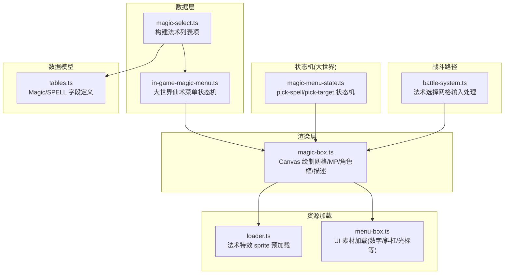
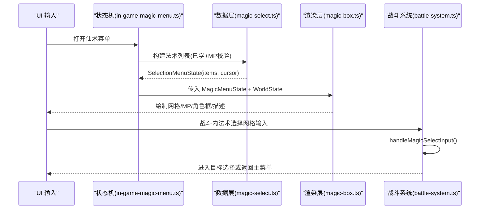
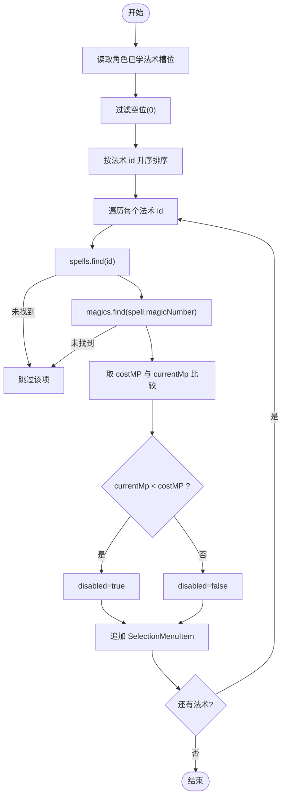
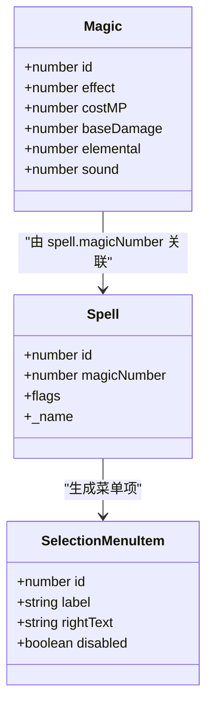
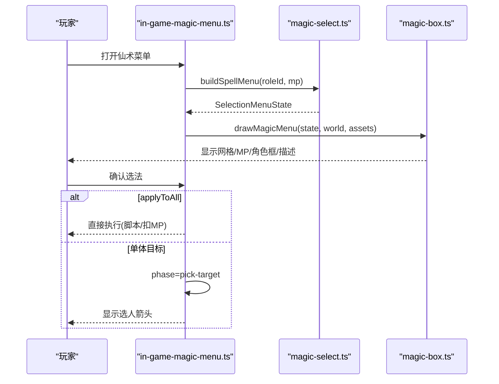
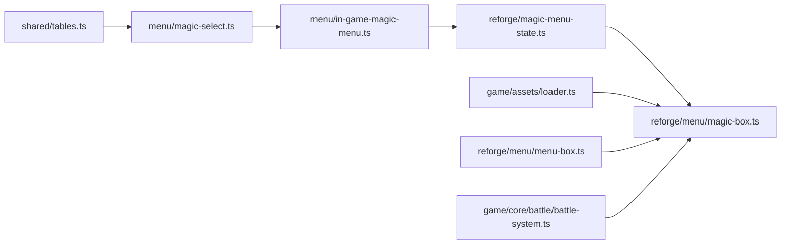

# 法术选择界面

<cite>
**本文引用的文件**
- [packages/game/src/core/menu/magic-select.ts](file://packages/game/src/core/menu/magic-select.ts)
- [packages/game/src/core/menu/in-game-magic-menu.ts](file://packages/game/src/core/menu/in-game-magic-menu.ts)
- [packages/reforge/src/magic-menu-state.ts](file://packages/reforge/src/magic-menu-state.ts)
- [packages/reforge/src/menu/magic-box.ts](file://packages/reforge/src/menu/magic-box.ts)
- [packages/game/src/core/battle/battle-system.ts](file://packages/game/src/core/battle/battle-system.ts)
- [packages/shared/src/tables.ts](file://packages/shared/src/tables.ts)
- [packages/game/src/assets/loader.ts](file://packages/game/src/assets/loader.ts)
- [packages/reforge/src/menu/menu-box.ts](file://packages/reforge/src/menu/menu-box.ts)
</cite>

## 目录
1. [简介](#简介)
2. [项目结构](#项目结构)
3. [核心组件](#核心组件)
4. [架构总览](#架构总览)
5. [详细组件分析](#详细组件分析)
6. [依赖关系分析](#依赖关系分析)
7. [性能考量](#性能考量)
8. [故障排查指南](#故障排查指南)
9. [结论](#结论)
10. [附录：扩展与定制指南](#附录扩展与定制指南)

## 简介
本技术文档围绕“法术选择界面”的实现，覆盖以下关键主题：
- 法术列表渲染：分类筛选、学习状态标记、MP 消耗显示
- 法术图标绘制：技能图标映射、等级标识、冷却状态（当前实现以 MP 不足禁用为主）
- 交互流程：光标移动、快捷键支持、确认执行
- 详情展示：伤害预览、目标类型、效果说明
- 解锁条件检查、角色权限验证、资源预加载机制
- 新法术类型的添加指南与界面定制方法

## 项目结构
本项目将“法术选择”拆分为数据层、状态机与渲染层，分别位于游戏核心与重绘模块中：
- 数据层：根据已学法术与魔法表生成菜单项，计算 MP 是否足够并标记禁用
- 状态机：大世界查看版与战斗内选择网格的状态流转与导航
- 渲染层：Canvas UI 绘制网格、MP 框、角色框、描述文本与光标

图表来源
- [packages/game/src/core/menu/magic-select.ts:1-57](file://packages/game/src/core/menu/magic-select.ts#L1-L57)
- [packages/game/src/core/menu/in-game-magic-menu.ts:1-307](file://packages/game/src/core/menu/in-game-magic-menu.ts#L1-L307)
- [packages/reforge/src/magic-menu-state.ts:1-65](file://packages/reforge/src/magic-menu-state.ts#L1-L65)
- [packages/reforge/src/menu/magic-box.ts:1-141](file://packages/reforge/src/menu/magic-box.ts#L1-L141)
- [packages/game/src/core/battle/battle-system.ts:1570-1602](file://packages/game/src/core/battle/battle-system.ts#L1570-L1602)
- [packages/shared/src/tables.ts:218-272](file://packages/shared/src/tables.ts#L218-L272)
- [packages/game/src/assets/loader.ts:279-311](file://packages/game/src/assets/loader.ts#L279-L311)
- [packages/reforge/src/menu/menu-box.ts:377-419](file://packages/reforge/src/menu/menu-box.ts#L377-L419)

章节来源
- [packages/game/src/core/menu/magic-select.ts:1-57](file://packages/game/src/core/menu/magic-select.ts#L1-L57)
- [packages/game/src/core/menu/in-game-magic-menu.ts:1-307](file://packages/game/src/core/menu/in-game-magic-menu.ts#L1-L307)
- [packages/reforge/src/magic-menu-state.ts:1-65](file://packages/reforge/src/magic-menu-state.ts#L1-L65)
- [packages/reforge/src/menu/magic-box.ts:1-141](file://packages/reforge/src/menu/magic-box.ts#L1-L141)
- [packages/game/src/core/battle/battle-system.ts:1570-1602](file://packages/game/src/core/battle/battle-system.ts#L1570-L1602)
- [packages/shared/src/tables.ts:218-272](file://packages/shared/src/tables.ts#L218-L272)
- [packages/game/src/assets/loader.ts:279-311](file://packages/game/src/assets/loader.ts#L279-L311)
- [packages/reforge/src/menu/menu-box.ts:377-419](file://packages/reforge/src/menu/menu-box.ts#L377-L419)

## 核心组件
- 法术列表数据生成器：从角色已学法术槽位出发，结合 spells.json 与 magic.json，生成 SelectionMenuItem 列表，按法术编号排序，依据 currentMp 与 costMP 判定 disabled。
- 大世界仙术菜单状态机：维护 pick-caster / pick-spell / pick-target / done 四阶段，提供 confirmCaster、confirmSpell、confirmTarget、cancelInGameMagic 等方法，并与刷新逻辑 refreshSpellMenu 联动。
- 大世界查看版状态机与渲染：magic-menu-state.ts 提供 resolveOutdoorSkills、open/close、magicConfirmSpell、magicMoveCursor；magic-box.ts 负责 Canvas 绘制网格、MP 框、角色框、描述与光标。
- 战斗内法术选择网格：battle-system.ts 的 handleMagicSelectInput 处理 Confirm 与网格导航，进入目标选择或返回主菜单。
- 数据模型：shared/tables.ts 中的 Magic 接口定义了 costMP、baseDamage、elemental、sound 等关键字段，供菜单与后续动画使用。
- 资源预加载：assets/loader.ts 基于 fire-sprites.json 按需加载法术特效帧；menu-box.ts 加载数字、斜杠、光标等 UI 素材。

章节来源
- [packages/game/src/core/menu/magic-select.ts:1-57](file://packages/game/src/core/menu/magic-select.ts#L1-L57)
- [packages/game/src/core/menu/in-game-magic-menu.ts:1-307](file://packages/game/src/core/menu/in-game-magic-menu.ts#L1-L307)
- [packages/reforge/src/magic-menu-state.ts:1-65](file://packages/reforge/src/magic-menu-state.ts#L1-L65)
- [packages/reforge/src/menu/magic-box.ts:1-141](file://packages/reforge/src/menu/magic-box.ts#L1-L141)
- [packages/game/src/core/battle/battle-system.ts:1570-1602](file://packages/game/src/core/battle/battle-system.ts#L1570-L1602)
- [packages/shared/src/tables.ts:218-272](file://packages/shared/src/tables.ts#L218-L272)
- [packages/game/src/assets/loader.ts:279-311](file://packages/game/src/assets/loader.ts#L279-L311)
- [packages/reforge/src/menu/menu-box.ts:377-419](file://packages/reforge/src/menu/menu-box.ts#L377-L419)

## 架构总览
下图展示了从数据到渲染的关键路径：数据层生成菜单项 → 状态机驱动交互 → 渲染层输出画面；战斗路径复用同一套数据与状态模型。

图表来源
- [packages/game/src/core/menu/in-game-magic-menu.ts:1-307](file://packages/game/src/core/menu/in-game-magic-menu.ts#L1-L307)
- [packages/game/src/core/menu/magic-select.ts:1-57](file://packages/game/src/core/menu/magic-select.ts#L1-L57)
- [packages/reforge/src/menu/magic-box.ts:1-141](file://packages/reforge/src/menu/magic-box.ts#L1-L141)
- [packages/game/src/core/battle/battle-system.ts:1570-1602](file://packages/game/src/core/battle/battle-system.ts#L1570-L1602)

## 详细组件分析

### 法术列表渲染：分类筛选、学习状态标记、MP 消耗显示
- 分类筛选：仅包含 usableOutsideBattle 的法术用于大世界查看版；战斗路径通过 flags.usableToEnemy/applyToAll 控制目标侧与全体语义。
- 学习状态标记：从角色 magic 槽位收集已学法术 id，过滤空位并按 id 升序排列，保证菜单恒按法术编号顺序。
- MP 消耗显示：读取对应 magic.costMP，若 currentMp < costMP 则设置 disabled，并在右侧文本显示“MP X”。

图表来源
- [packages/game/src/core/menu/magic-select.ts:26-56](file://packages/game/src/core/menu/magic-select.ts#L26-L56)

章节来源
- [packages/game/src/core/menu/magic-select.ts:1-57](file://packages/game/src/core/menu/magic-select.ts#L1-L57)
- [packages/game/src/core/menu/in-game-magic-menu.ts:127-143](file://packages/game/src/core/menu/in-game-magic-menu.ts#L127-L143)

### 法术图标绘制：技能图标映射、等级标识、冷却状态
- 技能图标映射：当前查看版以文字名称为主，未引入独立图标贴图；战斗路径可结合 magic.effect 与 loader.ts 的 fire-sprite 资源进行特效 overlay。
- 等级标识：当前实现未显示等级标识；如需扩展可在 SkillData/Magic 上增加 level 字段并在渲染层绘制。
- 冷却状态：当前以 MP 不足作为“禁用/灰显”的主要表现；冷却计时器尚未接入。

图表来源
- [packages/shared/src/tables.ts:218-272](file://packages/shared/src/tables.ts#L218-L272)
- [packages/game/src/core/menu/magic-select.ts:38-53](file://packages/game/src/core/menu/magic-select.ts#L38-L53)

章节来源
- [packages/shared/src/tables.ts:218-272](file://packages/shared/src/tables.ts#L218-L272)
- [packages/game/src/core/menu/magic-select.ts:1-57](file://packages/game/src/core/menu/magic-select.ts#L1-L57)

### 法术选择交互：光标移动、快捷键支持、确认执行
- 大世界查看版：
  - 状态机：open/close、magicConfirmSpell、magicBackFromTarget、magicMoveCursor（±列/±1，clamp）。
  - 渲染：drawMagicMenu 绘制红框网格、选中闪烁光标、MP box、角色框、描述文本；仅在 pick-target 阶段显示选人箭头。
- 战斗内选择网格：
  - handleMagicSelectInput 处理 Confirm：仅对 enabled 项生效，解析 flags 后进入目标选择；取消返回主菜单。
  - 网格导航：gridNavigate 支持行列移动，不跳过禁用项。

图表来源
- [packages/reforge/src/magic-menu-state.ts:31-64](file://packages/reforge/src/magic-menu-state.ts#L31-L64)
- [packages/reforge/src/menu/magic-box.ts:74-140](file://packages/reforge/src/menu/magic-box.ts#L74-L140)
- [packages/game/src/core/menu/in-game-magic-menu.ts:169-222](file://packages/game/src/core/menu/in-game-magic-menu.ts#L169-L222)
- [packages/game/src/core/battle/battle-system.ts:1578-1602](file://packages/game/src/core/battle/battle-system.ts#L1578-L1602)

章节来源
- [packages/reforge/src/magic-menu-state.ts:1-65](file://packages/reforge/src/magic-menu-state.ts#L1-L65)
- [packages/reforge/src/menu/magic-box.ts:1-141](file://packages/reforge/src/menu/magic-box.ts#L1-L141)
- [packages/game/src/core/menu/in-game-magic-menu.ts:1-307](file://packages/game/src/core/menu/in-game-magic-menu.ts#L1-L307)
- [packages/game/src/core/battle/battle-system.ts:1570-1602](file://packages/game/src/core/battle/battle-system.ts#L1570-L1602)

### 法术详情展示：伤害预览、目标类型、效果说明
- 伤害预览：Magic.baseDamage 可用于提示；当前查看版未直接展示数值，但数据结构已具备。
- 目标类型：spell.flags.applyToAll 与 usableToEnemy 决定目标范围与敌我侧；战斗路径据此进入不同 target 选择分支。
- 效果说明：查看版顶部浅黄区域渲染选中法术 desc；大世界查看版与战斗路径共用该字段。

章节来源
- [packages/shared/src/tables.ts:218-272](file://packages/shared/src/tables.ts#L218-L272)
- [packages/reforge/src/menu/magic-box.ts:132-140](file://packages/reforge/src/menu/magic-box.ts#L132-L140)
- [packages/game/src/core/battle/battle-system.ts:1589-1594](file://packages/game/src/core/battle/battle-system.ts#L1589-L1594)

### 解锁条件检查、角色权限验证、资源预加载机制
- 解锁条件检查：大世界查看版通过 usableOutsideBattle 过滤；角色已学法术来自 playerRoles.roles[roleId].magic 槽位。
- 角色权限验证：施法人 HP>0 才可被选中；单人队伍时自动跳过 caster 选择直接进入法术列表。
- 资源预加载：assets/loader.ts 基于 magics[].effect 去重加载 fire-sprite chunk；menu-box.ts 并行加载数字、斜杠、光标等 UI 素材。

章节来源
- [packages/game/src/core/menu/in-game-magic-menu.ts:85-106](file://packages/game/src/core/menu/in-game-magic-menu.ts#L85-L106)
- [packages/game/src/core/menu/magic-select.ts:30-36](file://packages/game/src/core/menu/magic-select.ts#L30-L36)
- [packages/game/src/assets/loader.ts:279-311](file://packages/game/src/assets/loader.ts#L279-L311)
- [packages/reforge/src/menu/menu-box.ts:377-419](file://packages/reforge/src/menu/menu-box.ts#L377-L419)

## 依赖关系分析
- 低耦合：数据层只产出 SelectionMenuItem，状态机与渲染层通过明确接口交互。
- 外部依赖：shared.tables 提供 Magic/Spell 字段契约；assets/loader 与 menu-box 提供运行时资源。
- 循环依赖：无直接循环；状态机与渲染层解耦，便于单测与替换。

图表来源
- [packages/shared/src/tables.ts:218-272](file://packages/shared/src/tables.ts#L218-L272)
- [packages/game/src/core/menu/magic-select.ts:1-57](file://packages/game/src/core/menu/magic-select.ts#L1-L57)
- [packages/game/src/core/menu/in-game-magic-menu.ts:1-307](file://packages/game/src/core/menu/in-game-magic-menu.ts#L1-L307)
- [packages/reforge/src/magic-menu-state.ts:1-65](file://packages/reforge/src/magic-menu-state.ts#L1-L65)
- [packages/reforge/src/menu/magic-box.ts:1-141](file://packages/reforge/src/menu/magic-box.ts#L1-L141)
- [packages/game/src/assets/loader.ts:279-311](file://packages/game/src/assets/loader.ts#L279-L311)
- [packages/reforge/src/menu/menu-box.ts:377-419](file://packages/reforge/src/menu/menu-box.ts#L377-L419)
- [packages/game/src/core/battle/battle-system.ts:1570-1602](file://packages/game/src/core/battle/battle-system.ts#L1570-L1602)

章节来源
- [packages/shared/src/tables.ts:218-272](file://packages/shared/src/tables.ts#L218-L272)
- [packages/game/src/core/menu/magic-select.ts:1-57](file://packages/game/src/core/menu/magic-select.ts#L1-L57)
- [packages/game/src/core/menu/in-game-magic-menu.ts:1-307](file://packages/game/src/core/menu/in-game-magic-menu.ts#L1-L307)
- [packages/reforge/src/magic-menu-state.ts:1-65](file://packages/reforge/src/magic-menu-state.ts#L1-L65)
- [packages/reforge/src/menu/magic-box.ts:1-141](file://packages/reforge/src/menu/magic-box.ts#L1-L141)
- [packages/game/src/assets/loader.ts:279-311](file://packages/game/src/assets/loader.ts#L279-L311)
- [packages/reforge/src/menu/menu-box.ts:377-419](file://packages/reforge/src/menu/menu-box.ts#L377-L419)
- [packages/game/src/core/battle/battle-system.ts:1570-1602](file://packages/game/src/core/battle/battle-system.ts#L1570-L1602)

## 性能考量
- 列表生成：按角色已学法术 id 排序与查找为线性复杂度，通常规模较小，开销可忽略。
- 资源加载：fire-sprite 按 effect 引用去重加载，避免全量 55 chunk；UI 素材并行加载减少首屏等待。
- 渲染优化：选中项闪烁采用时间片取模切换颜色数组，避免频繁对象创建。

[本节为通用指导，无需具体文件分析]

## 故障排查指南
- 法术不可用且光标跳过：确认 currentMp 与 costMP 比较逻辑是否正确；检查 usableOutsideBattle 过滤是否符合预期。
- 单人队伍无法进入法术列表：确认 partyMembers.length === 1 分支是否构建了 spellMenu 并直接切至 pick-spell。
- 战斗内 Confirm 无效：确保所选菜单项 disabled=false；检查 flags.usableToEnemy/applyToAll 是否正确解析。
- 描述文本不显示：确认选中法术存在 desc 字段且渲染坐标未被遮挡。

章节来源
- [packages/game/src/core/menu/magic-select.ts:44-51](file://packages/game/src/core/menu/magic-select.ts#L44-L51)
- [packages/game/src/core/menu/in-game-magic-menu.ts:85-106](file://packages/game/src/core/menu/in-game-magic-menu.ts#L85-L106)
- [packages/game/src/core/battle/battle-system.ts:1586-1596](file://packages/game/src/core/battle/battle-system.ts#L1586-L1596)
- [packages/reforge/src/menu/magic-box.ts:132-140](file://packages/reforge/src/menu/magic-box.ts#L132-L140)

## 结论
法术选择界面在数据层、状态机与渲染层之间实现了清晰的职责划分：数据层专注列表生成与 MP 校验，状态机管理交互阶段与导航，渲染层负责视觉呈现。战斗路径复用同一数据模型与状态语义，保证了行为一致性。未来可扩展图标、等级与冷却显示，并进一步丰富详情面板内容。

[本节为总结性内容，无需具体文件分析]

## 附录：扩展与定制指南

### 新增法术类型
- 数据层：在 shared/tables.ts 的 Magic 或相关枚举中添加新 type 字段与语义；在 spells.json 中配置 flags 与 script 钩子。
- 列表渲染：在 magic-select.ts 中根据新 type 调整排序或分组逻辑（如需要）。
- 交互与目标：在 battle-system.ts 的 handleMagicSelectInput 与 enterTargetForDraft 中为新 type 补充目标侧与全体语义。
- 渲染：在 magic-box.ts 中为新 type 添加图标映射或特殊高亮样式。

章节来源
- [packages/shared/src/tables.ts:218-272](file://packages/shared/src/tables.ts#L218-L272)
- [packages/game/src/core/menu/magic-select.ts:38-53](file://packages/game/src/core/menu/magic-select.ts#L38-L53)
- [packages/game/src/core/battle/battle-system.ts:1589-1594](file://packages/game/src/core/battle/battle-system.ts#L1589-L1594)
- [packages/reforge/src/menu/magic-box.ts:89-105](file://packages/reforge/src/menu/magic-box.ts#L89-L105)

### 界面定制方法
- 网格布局：调整 magic-box.ts 中的 GRID_X/Y/W/H、ITEM_DX/DY、GRID_COLS 等常量以匹配新分辨率或风格。
- 颜色与光标：修改 SELECTED_COLORS、COLOR_DISABLED/COLOR_DISABLED_SEL 及光标贴图路径。
- 数字与斜杠：在 menu-box.ts 的 loadAssets 中替换数字/斜杠贴图资源。
- 特效 overlay：在 loader.ts 中扩展 fire-sprite 清单与 RLE 解码管线，支持更多特效帧。

章节来源
- [packages/reforge/src/menu/magic-box.ts:9-49](file://packages/reforge/src/menu/magic-box.ts#L9-L49)
- [packages/reforge/src/menu/menu-box.ts:377-419](file://packages/reforge/src/menu/menu-box.ts#L377-L419)
- [packages/game/src/assets/loader.ts:279-311](file://packages/game/src/assets/loader.ts#L279-L311)