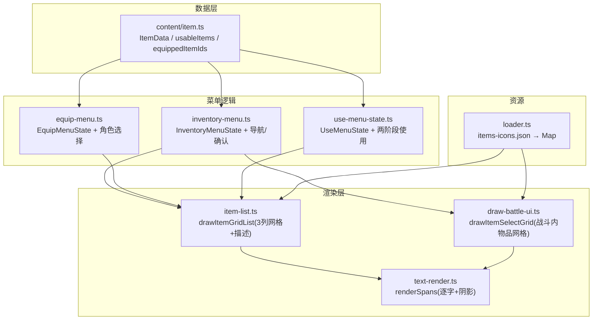
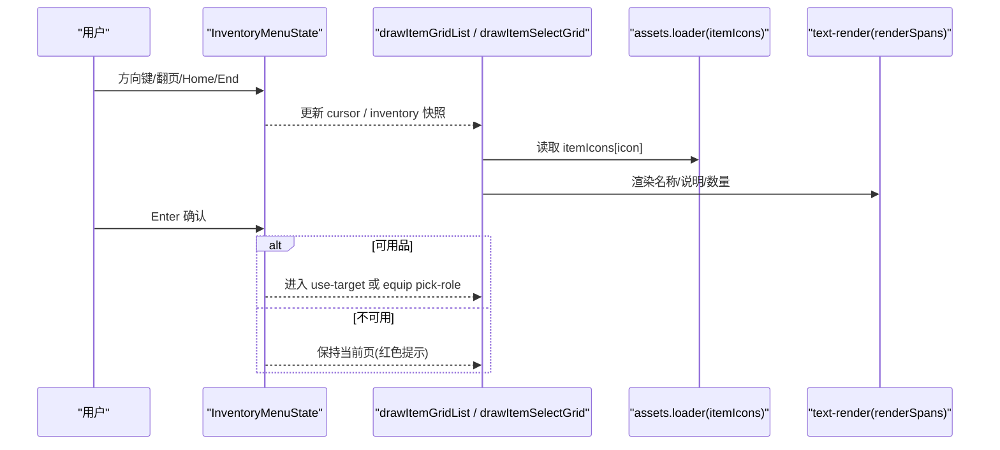
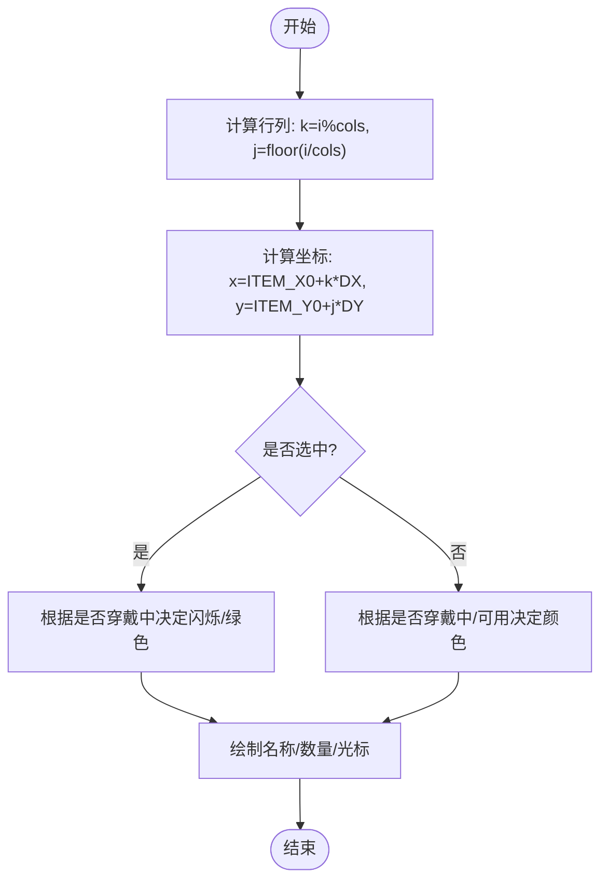
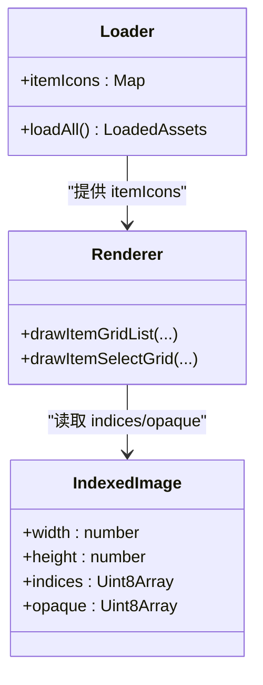
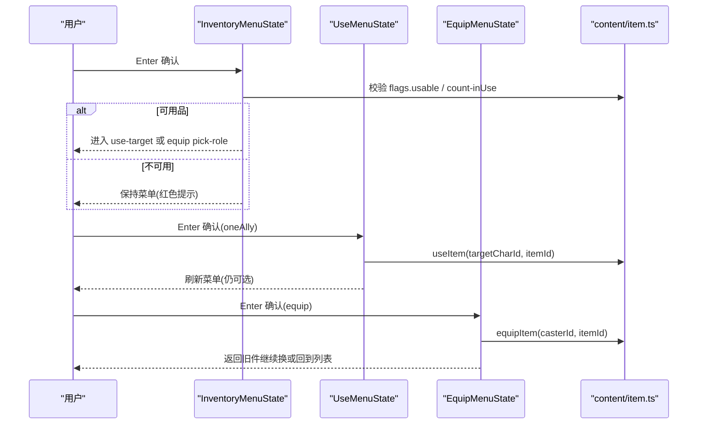
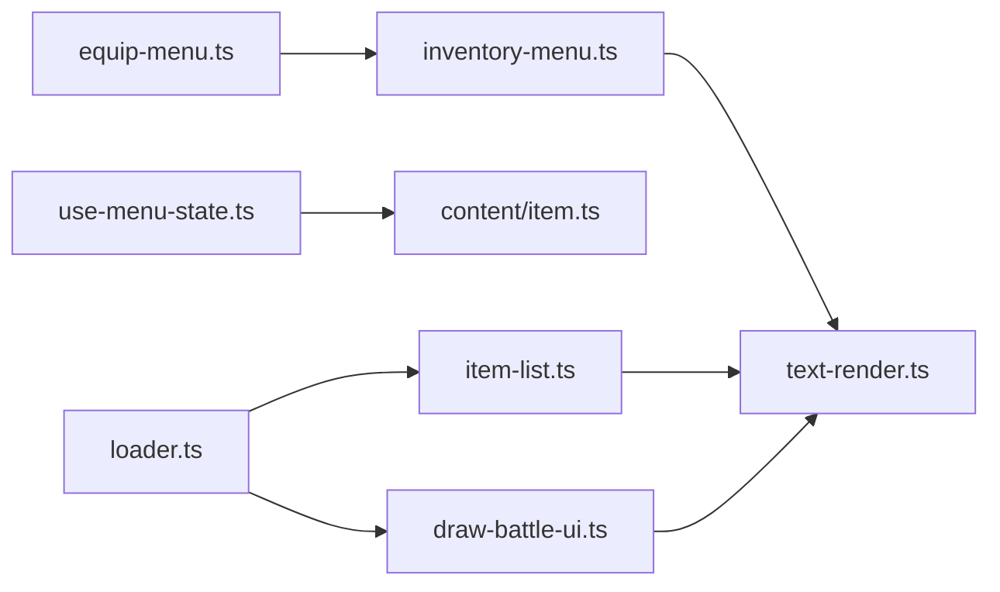

# 物品栏界面

<cite>
**本文引用的文件列表**   
- [packages/reforge/src/menu/item-list.ts](file://packages/reforge/src/menu/item-list.ts)
- [packages/game/src/core/menu/inventory-menu.ts](file://packages/game/src/core/menu/inventory-menu.ts)
- [packages/game/src/core/menu/equip-menu.ts](file://packages/game/src/core/menu/equip-menu.ts)
- [packages/reforge/src/use-menu-state.ts](file://packages/reforge/src/use-menu-state.ts)
- [packages/game/src/assets/loader.ts](file://packages/game/src/assets/loader.ts)
- [packages/game/src/present/battle/draw-battle-ui.ts](file://packages/game/src/present/battle/draw-battle-ui.ts)
- [packages/reforge/src/text/text-render.ts](file://packages/reforge/src/text/text-render.ts)
- [packages/content/src/item.ts](file://packages/content/src/item.ts)
</cite>

## 目录
1. [简介](#简介)
2. [项目结构](#项目结构)
3. [核心组件](#核心组件)
4. [架构总览](#架构总览)
5. [详细组件分析](#详细组件分析)
6. [依赖关系分析](#依赖关系分析)
7. [性能考量](#性能考量)
8. [故障排查指南](#故障排查指南)
9. [结论](#结论)
10. [附录](#附录)

## 简介
本技术文档围绕“物品栏界面”的实现，系统性梳理并解释以下关键主题：
- 网格布局算法：行列计算、滚动分页、光标定位与边界处理
- 图标渲染管线：精灵图集映射、缩放适配、透明度处理
- 信息展示：名称显示、数量标记、品质/状态标识（穿戴中、可用/不可用）
- 交互流程：选择高亮、使用确认、装备预览与切换
- 筛选与排序：过滤规则、搜索过滤、排序策略
- 扩展与优化：自定义样式方法、性能优化技巧

## 项目结构
本项目采用多包分层组织，与物品栏相关的代码主要分布在以下位置：
- 菜单逻辑与状态机：inventory-menu、equip-menu、use-menu-state
- 渲染层：reforge 的 item-list 与 battle UI 中的 drawItemSelectGrid
- 资源加载：assets loader 负责物品图标等图集加载
- 文本渲染：text-render 提供逐字绘制与阴影效果
- 数据模型：content 层的 ItemData、usableItems、equippedItemIds 等

图表来源
- [packages/reforge/src/menu/item-list.ts:1-89](file://packages/reforge/src/menu/item-list.ts#L1-L89)
- [packages/game/src/core/menu/inventory-menu.ts:1-275](file://packages/game/src/core/menu/inventory-menu.ts#L1-L275)
- [packages/game/src/core/menu/equip-menu.ts:1-112](file://packages/game/src/core/menu/equip-menu.ts#L1-L112)
- [packages/reforge/src/use-menu-state.ts:1-100](file://packages/reforge/src/use-menu-state.ts#L1-L100)
- [packages/game/src/assets/loader.ts:334-357](file://packages/game/src/assets/loader.ts#L334-L357)
- [packages/game/src/present/battle/draw-battle-ui.ts:586-626](file://packages/game/src/present/battle/draw-battle-ui.ts#L586-L626)
- [packages/reforge/src/text/text-render.ts:1-63](file://packages/reforge/src/text/text-render.ts#L1-L63)
- [packages/content/src/item.ts:1-227](file://packages/content/src/item.ts#L1-L227)

章节来源
- [packages/reforge/src/menu/item-list.ts:1-89](file://packages/reforge/src/menu/item-list.ts#L1-L89)
- [packages/game/src/core/menu/inventory-menu.ts:1-275](file://packages/game/src/core/menu/inventory-menu.ts#L1-L275)
- [packages/game/src/core/menu/equip-menu.ts:1-112](file://packages/game/src/core/menu/equip-menu.ts#L1-L112)
- [packages/reforge/src/use-menu-state.ts:1-100](file://packages/reforge/src/use-menu-state.ts#L1-L100)
- [packages/game/src/assets/loader.ts:334-357](file://packages/game/src/assets/loader.ts#L334-L357)
- [packages/game/src/present/battle/draw-battle-ui.ts:586-626](file://packages/game/src/present/battle/draw-battle-ui.ts#L586-L626)
- [packages/reforge/src/text/text-render.ts:1-63](file://packages/reforge/src/text/text-render.ts#L1-L63)
- [packages/content/src/item.ts:1-227](file://packages/content/src/item.ts#L1-L227)

## 核心组件
- InventoryMenuState：全屏物品菜单状态，维护线性光标、库存快照、过滤类型、目标选择子菜单。提供上下左右、翻页、首尾跳转等输入处理，以及进入“选目标”阶段的确认逻辑。
- EquipMenuState：复用 InventoryMenuState 作为列表层，进入“选角色”阶段进行装备替换，支持 swap 链式回退。
- UseMenuState：两阶段使用菜单（pick-item → pick-target），单体回复类需选目标，脚本/全体类直接执行。
- drawItemGridList：3 列网格渲染，包含名称、数量、选中光标、底部 itembox 图标与多行说明。
- drawItemSelectGrid：战斗内物品网格通用绘制，含分页、灰项色、数量与光标。
- assets loader：从 items-icons.json 批量加载 BALL.MKF 物品图标到 Map<chunkIndex, IndexedImage>。
- text-render：逐字符渲染，支持阴影与固定颜色覆盖。

章节来源
- [packages/game/src/core/menu/inventory-menu.ts:1-275](file://packages/game/src/core/menu/inventory-menu.ts#L1-L275)
- [packages/game/src/core/menu/equip-menu.ts:1-112](file://packages/game/src/core/menu/equip-menu.ts#L1-L112)
- [packages/reforge/src/use-menu-state.ts:1-100](file://packages/reforge/src/use-menu-state.ts#L1-L100)
- [packages/reforge/src/menu/item-list.ts:1-89](file://packages/reforge/src/menu/item-list.ts#L1-L89)
- [packages/game/src/present/battle/draw-battle-ui.ts:586-626](file://packages/game/src/present/battle/draw-battle-ui.ts#L586-L626)
- [packages/game/src/assets/loader.ts:334-357](file://packages/game/src/assets/loader.ts#L334-L357)
- [packages/reforge/src/text/text-render.ts:1-63](file://packages/reforge/src/text/text-render.ts#L1-L63)

## 架构总览
物品栏界面由“数据层 → 菜单逻辑层 → 渲染层 → 资源层”构成。数据层提供 ItemData 与能力判断；菜单逻辑层维护状态与交互；渲染层将状态转换为像素；资源层提供图标与字体等资源。

图表来源
- [packages/game/src/core/menu/inventory-menu.ts:156-215](file://packages/game/src/core/menu/inventory-menu.ts#L156-L215)
- [packages/reforge/src/menu/item-list.ts:42-88](file://packages/reforge/src/menu/item-list.ts#L42-L88)
- [packages/game/src/present/battle/draw-battle-ui.ts:646-681](file://packages/game/src/present/battle/draw-battle-ui.ts#L646-L681)
- [packages/game/src/assets/loader.ts:334-357](file://packages/game/src/assets/loader.ts#L334-L357)
- [packages/reforge/src/text/text-render.ts:20-51](file://packages/reforge/src/text/text-render.ts#L20-L51)

## 详细组件分析

### 网格布局算法（行列计算、滚动分页、光标定位）
- 行列与单元格尺寸
  - 3 列网格，每行高度固定，列宽为 100px，行距 18px，列表框尺寸与偏移在 item-list.ts 中定义。
  - 战斗内网格常量在 draw-battle-ui.ts 中定义，包括 ITEM_COLS=3、ITEM_ROWS=7、ITEM_PAGE_LINE_OFFSET 等。
- 光标定位与边界
  - 线性光标索引 i，行号 j = floor(i / cols)，列号 k = i % cols；坐标 x = ITEM_X0 + k * ITEM_DX，y = ITEM_Y0 + j * ITEM_DY。
  - 输入处理：上/下按列数步进，左/右按 1 步进，PageUp/PageDown 按整页步进，Home/End 跳首尾；所有移动均 clamp 到 [0, n-1]，不 wrap。
- 滚动分页
  - 战斗内网格通过 pageLineOffset 控制可见页起始，确保光标始终在可视范围内；reforge 侧以固定行数渲染，调用方负责裁剪。
- 颜色与状态
  - 六段颜色规则：选中且不可用→暗红；选中且可用且穿戴中→橄榄绿；选中且可用未穿戴→闪烁黄；未选中且不可用→暗红；未选中且穿戴中→橄榄绿；普通→米白。

图表来源
- [packages/reforge/src/menu/item-list.ts:53-72](file://packages/reforge/src/menu/item-list.ts#L53-L72)
- [packages/game/src/present/battle/draw-battle-ui.ts:646-681](file://packages/game/src/present/battle/draw-battle-ui.ts#L646-L681)
- [packages/game/src/core/menu/inventory-menu.ts:156-215](file://packages/game/src/core/menu/inventory-menu.ts#L156-L215)

章节来源
- [packages/reforge/src/menu/item-list.ts:9-27](file://packages/reforge/src/menu/item-list.ts#L9-L27)
- [packages/game/src/present/battle/draw-battle-ui.ts:117-131](file://packages/game/src/present/battle/draw-battle-ui.ts#L117-L131)
- [packages/game/src/core/menu/inventory-menu.ts:43-56](file://packages/game/src/core/menu/inventory-menu.ts#L43-L56)

### 物品图标渲染（精灵图集映射、缩放适配、透明度处理）
- 精灵图集映射
  - 资源加载器从 items-icons.json 读取 chunkIndex 清单，并行加载对应 PNG，构建 Map<chunkIndex, IndexedImage>，供菜单与战斗 UI 使用。
  - 渲染时依据 item.icon 或 item.bitmap 取图，若缺失则跳过（防御性）。
- 缩放适配
  - reforge 侧使用 Canvas.drawImage 直接绘制，调用方已做 ctx.scale；战斗内使用自定义 blitSpriteOpaque 写入 Framebuffer，保持像素对齐。
- 透明度处理
  - IndexedImage 包含 indices 与 opaque 掩码；blitSpriteOpaque 仅对 opaque>0 的像素写入，实现透明背景。
  - 文字渲染 renderSpans 支持 shadow 三层叠加与 forceRgba 覆盖，保证可读性与风格一致。

图表来源
- [packages/game/src/assets/loader.ts:334-357](file://packages/game/src/assets/loader.ts#L334-L357)
- [packages/game/src/present/battle/draw-battle-ui.ts:172-194](file://packages/game/src/present/battle/draw-battle-ui.ts#L172-L194)
- [packages/reforge/src/menu/item-list.ts:75-80](file://packages/reforge/src/menu/item-list.ts#L75-L80)
- [packages/reforge/src/text/text-render.ts:20-51](file://packages/reforge/src/text/text-render.ts#L20-L51)

章节来源
- [packages/game/src/assets/loader.ts:334-357](file://packages/game/src/assets/loader.ts#L334-L357)
- [packages/game/src/present/battle/draw-battle-ui.ts:172-194](file://packages/game/src/present/battle/draw-battle-ui.ts#L172-L194)
- [packages/reforge/src/menu/item-list.ts:75-80](file://packages/reforge/src/menu/item-list.ts#L75-L80)
- [packages/reforge/src/text/text-render.ts:20-51](file://packages/reforge/src/text/text-render.ts#L20-L51)

### 物品信息展示（名称显示、数量标记、品质标识）
- 名称显示
  - 使用 renderSpans 逐字绘制，支持阴影与固定颜色覆盖；名称取自 ItemData.name 或 _name。
- 数量标记
  - 当 count > 1 时在右侧绘制青色数字；战斗内从 rightText 解析数字后绘制。
- 品质/状态标识
  - 穿戴中：橄榄绿（MENUITEM_COLOR_EQUIPPEDITEM）
  - 选中且可用：闪烁黄色（MENUITEM_COLOR_SELECTED_FIRST..TOTAL）
  - 不可用：暗红（MENUITEM_COLOR_INACTIVE / SELECTED_INACTIVE）
  - 普通：米白（MENUITEM_COLOR）

章节来源
- [packages/reforge/src/menu/item-list.ts:28-39](file://packages/reforge/src/menu/item-list.ts#L28-L39)
- [packages/game/src/core/menu/inventory-menu.ts:50-91](file://packages/game/src/core/menu/inventory-menu.ts#L50-L91)
- [packages/game/src/present/battle/draw-battle-ui.ts:646-681](file://packages/game/src/present/battle/draw-battle-ui.ts#L646-L681)

### 物品操作交互（选择高亮、使用确认、装备预览）
- 选择高亮
  - 网格渲染时根据 selected 与 isUsable/isEquipped 决定颜色与光标精灵绘制。
- 使用确认
  - InventoryMenu.confirmInventoryItem：校验 flags.usable 与 count-inUse；进入 target 选择；确认后返回 itemId 与 roleId。
  - UseMenuState.useConfirm：oneAlly 进入 pick-target；脚本/全体类直接执行 useItem 并刷新菜单。
- 装备预览与切换
  - EquipMenu.confirmEquipItem：校验 matchesFilter('equip') 与 count-inUse；进入 pick-role；confirmEquipRole 返回 {itemId, roleId}；equipApply 支持 swap 链（旧件留待继续换）。

图表来源
- [packages/game/src/core/menu/inventory-menu.ts:219-261](file://packages/game/src/core/menu/inventory-menu.ts#L219-L261)
- [packages/reforge/src/use-menu-state.ts:61-99](file://packages/reforge/src/use-menu-state.ts#L61-L99)
- [packages/game/src/core/menu/equip-menu.ts:53-96](file://packages/game/src/core/menu/equip-menu.ts#L53-L96)
- [packages/content/src/item.ts:128-149](file://packages/content/src/item.ts#L128-L149)

章节来源
- [packages/game/src/core/menu/inventory-menu.ts:219-261](file://packages/game/src/core/menu/inventory-menu.ts#L219-L261)
- [packages/reforge/src/use-menu-state.ts:61-99](file://packages/reforge/src/use-menu-state.ts#L61-L99)
- [packages/game/src/core/menu/equip-menu.ts:53-96](file://packages/game/src/core/menu/equip-menu.ts#L53-L96)
- [packages/content/src/item.ts:128-149](file://packages/content/src/item.ts#L128-L149)

### 筛选功能、搜索过滤与排序规则
- 筛选规则
  - matchesFilter 基于 Item.flags 判定：equip、potion、battle、important、usable、sellable 等。
  - InventoryMenu 列表全量显示，filter 仅影响颜色（非匹配项画成 INACTIVE），确认时对不可用项 no-op。
- 搜索过滤
  - 开发面板提供按名称/id 的字符串 includes 过滤，用于调试与快速定位。
- 排序规则
  - 默认按 inventory 顺序；如需排序可在构造菜单前对 visible 列表排序（例如按名称、价格、类别分组）。

章节来源
- [packages/game/src/core/menu/item-select.ts:37-55](file://packages/game/src/core/menu/item-select.ts#L37-L55)
- [packages/game/src/core/menu/inventory-menu.ts:120-154](file://packages/game/src/core/menu/inventory-menu.ts#L120-L154)
- [packages/game/src/dev/dev-panel.ts:1616-1627](file://packages/game/src/dev/dev-panel.ts#L1616-L1627)

## 依赖关系分析
- 模块耦合
  - inventory-menu 与 equip-menu 共享 InventoryMenuState 与颜色规则；use-menu-state 依赖 content 的 usableItems/useItem。
  - 渲染层 item-list 与 battle UI 共用网格绘制思想，但分别实现以适应不同上下文。
- 外部依赖
  - assets loader 提供 itemIcons；text-render 提供字体与阴影；content 提供数据与行为。

图表来源
- [packages/game/src/core/menu/inventory-menu.ts:1-275](file://packages/game/src/core/menu/inventory-menu.ts#L1-L275)
- [packages/game/src/core/menu/equip-menu.ts:1-112](file://packages/game/src/core/menu/equip-menu.ts#L1-L112)
- [packages/reforge/src/use-menu-state.ts:1-100](file://packages/reforge/src/use-menu-state.ts#L1-L100)
- [packages/reforge/src/menu/item-list.ts:1-89](file://packages/reforge/src/menu/item-list.ts#L1-L89)
- [packages/game/src/present/battle/draw-battle-ui.ts:586-626](file://packages/game/src/present/battle/draw-battle-ui.ts#L586-L626)
- [packages/game/src/assets/loader.ts:334-357](file://packages/game/src/assets/loader.ts#L334-L357)
- [packages/reforge/src/text/text-render.ts:1-63](file://packages/reforge/src/text/text-render.ts#L1-L63)
- [packages/content/src/item.ts:1-227](file://packages/content/src/item.ts#L1-L227)

章节来源
- [packages/game/src/core/menu/inventory-menu.ts:1-275](file://packages/game/src/core/menu/inventory-menu.ts#L1-L275)
- [packages/game/src/core/menu/equip-menu.ts:1-112](file://packages/game/src/core/menu/equip-menu.ts#L1-L112)
- [packages/reforge/src/use-menu-state.ts:1-100](file://packages/reforge/src/use-menu-state.ts#L1-L100)
- [packages/reforge/src/menu/item-list.ts:1-89](file://packages/reforge/src/menu/item-list.ts#L1-L89)
- [packages/game/src/present/battle/draw-battle-ui.ts:586-626](file://packages/game/src/present/battle/draw-battle-ui.ts#L586-L626)
- [packages/game/src/assets/loader.ts:334-357](file://packages/game/src/assets/loader.ts#L334-L357)
- [packages/reforge/src/text/text-render.ts:1-63](file://packages/reforge/src/text/text-render.ts#L1-L63)
- [packages/content/src/item.ts:1-227](file://packages/content/src/item.ts#L1-L227)

## 性能考量
- 资源加载
  - 使用 Promise.all 并行加载 items-icons 与 UI sprite frames，减少启动时间；失败条目 warn 并跳过，避免阻塞。
- 渲染优化
  - 网格绘制只遍历可见页，避免全量重绘；数量与光标仅在必要时绘制。
  - 文字渲染使用 bakeGlyph 缓存字形，减少重复计算。
- 内存管理
  - 使用 Map 存储 itemIcons，按 chunkIndex 查找 O(1)；IndexedImage 使用紧凑数组表示像素与掩码。

章节来源
- [packages/game/src/assets/loader.ts:334-357](file://packages/game/src/assets/loader.ts#L334-L357)
- [packages/reforge/src/text/text-render.ts:20-51](file://packages/reforge/src/text/text-render.ts#L20-L51)
- [packages/game/src/present/battle/draw-battle-ui.ts:646-681](file://packages/game/src/present/battle/draw-battle-ui.ts#L646-L681)

## 故障排查指南
- 物品图标不显示
  - 检查 items-icons.json 是否存在与路径是否正确；查看 loader 日志是否有 item icon load failed。
- 名称/说明错位
  - 确认 renderSpans 的 x/y 偏移与 DESC_LINE_H 设置；检查 glyphs 表是否完整。
- 光标越界或卡住
  - 核对 setCursorClamp 与 pageLineOffset 逻辑；确认输入事件是否被正确分发。
- 不可用项仍可确认
  - 检查 confirmInventoryItem 的 flags.usable 与 count-inUse 守卫；确认 filter 仅影响颜色而非列表。

章节来源
- [packages/game/src/assets/loader.ts:334-357](file://packages/game/src/assets/loader.ts#L334-L357)
- [packages/reforge/src/menu/item-list.ts:75-88](file://packages/reforge/src/menu/item-list.ts#L75-L88)
- [packages/game/src/core/menu/inventory-menu.ts:219-234](file://packages/game/src/core/menu/inventory-menu.ts#L219-L234)

## 结论
物品栏界面通过清晰的分层与严格的 sdlpal 真值对齐，实现了稳定的网格布局、可靠的图标渲染与直观的交互体验。筛选与颜色规则保证了可用性提示的一致性，资源加载与渲染优化确保了性能表现。后续可扩展更多过滤维度与排序策略，以满足更复杂的用户需求。

## 附录
- 自定义样式扩展建议
  - 新增颜色方案：在 pickItemRowColor 基础上扩展新的 MENUITEM_COLOR_* 常量，并在渲染层应用。
  - 自定义图标尺寸：调整 ITEM_ITEM_W 与 ITEM_LINE_DY，并重算 pageLineOffset 与光标偏移。
  - 增加品质标识：在 ItemData 中扩展 quality 字段，并在渲染层根据 quality 绘制边框或角标。
- 搜索与排序增强
  - 在 createInventoryMenu 前对 visible 列表进行排序（如按名称拼音、价格降序、类别分组）。
  - 引入正则表达式过滤，支持通配符与大小写忽略。