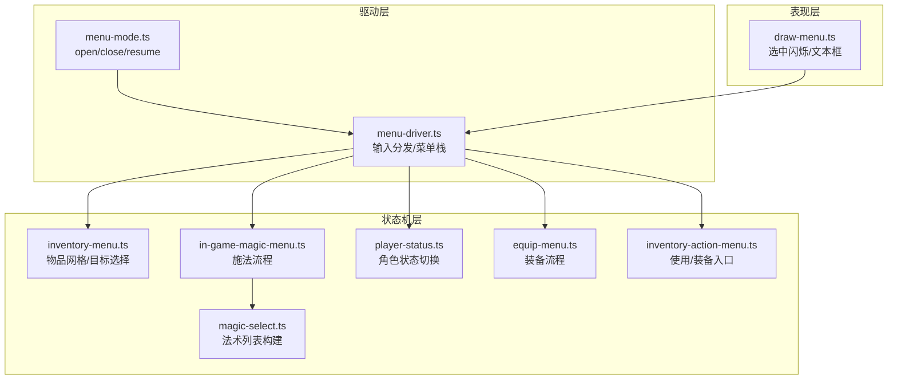
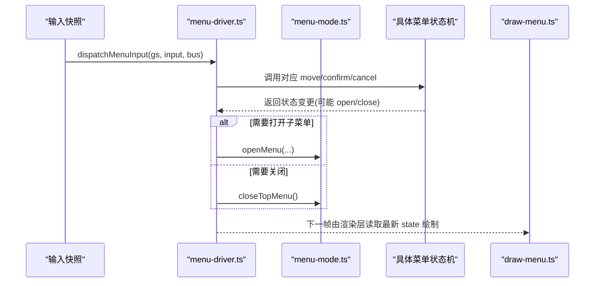
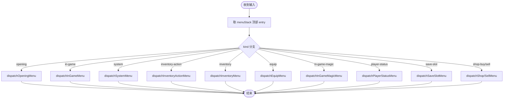
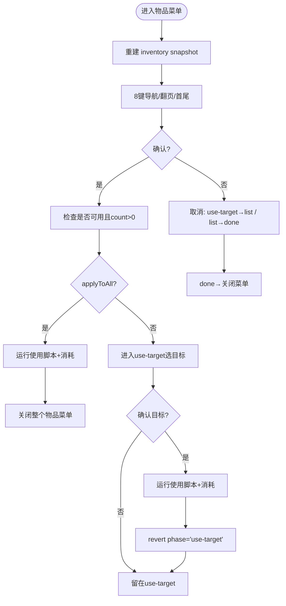
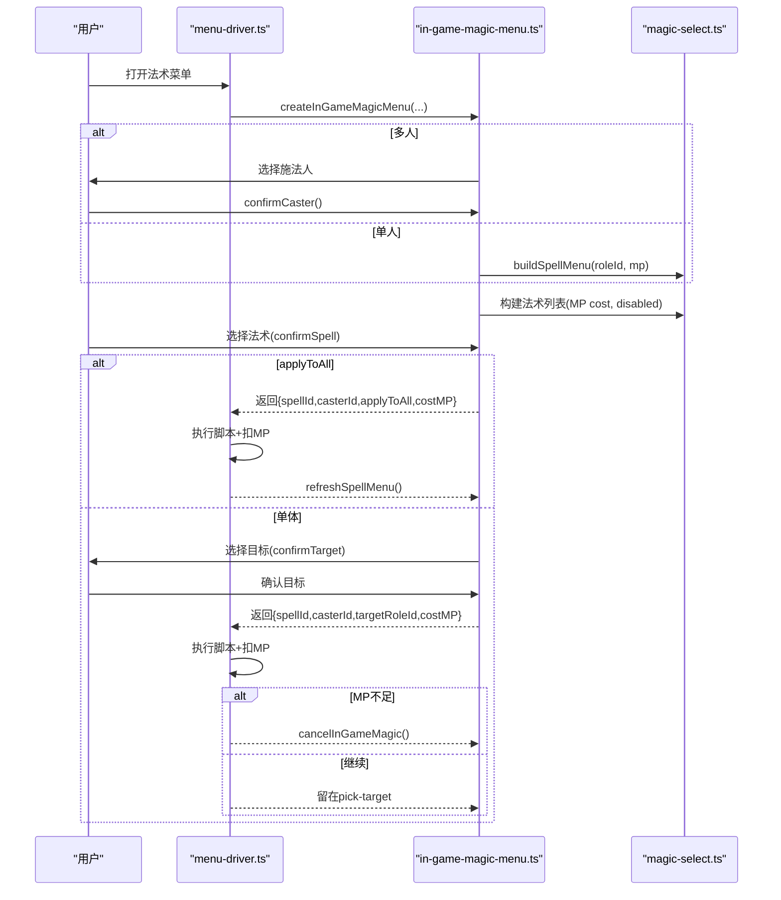
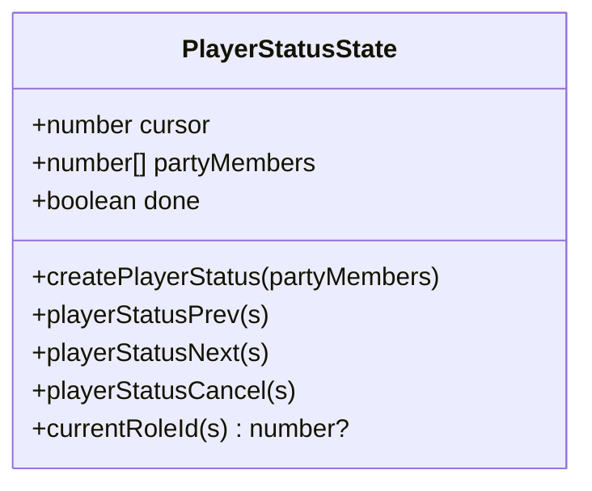
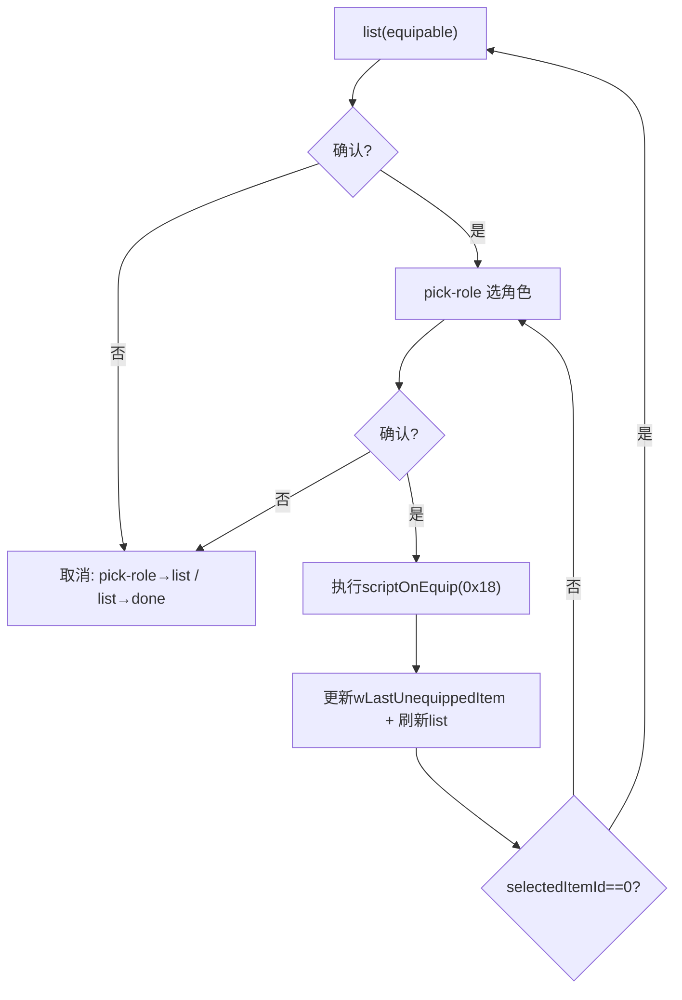
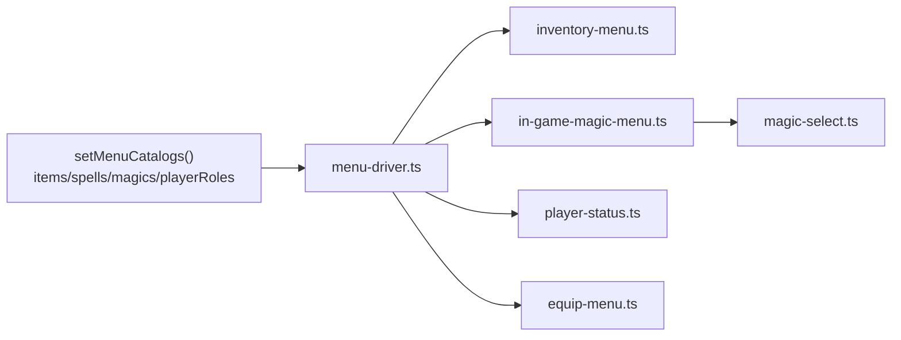
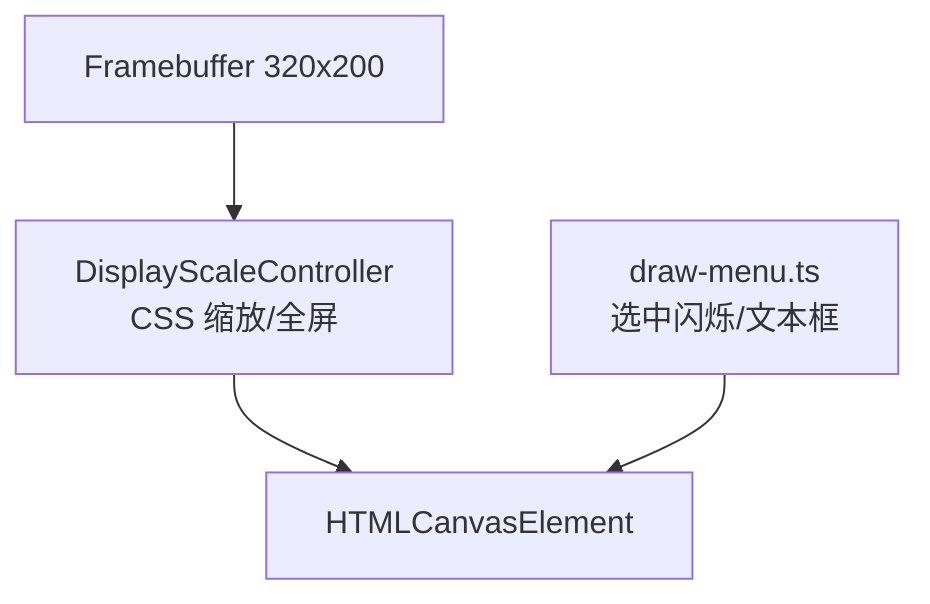

# 菜单组件

<cite>
**本文引用的文件**   
- [menu-driver.ts](file://packages/game/src/core/menu/menu-driver.ts)
- [menu-mode.ts](file://packages/game/src/core/menu/menu-mode.ts)
- [inventory-menu.ts](file://packages/game/src/core/menu/inventory-menu.ts)
- [in-game-magic-menu.ts](file://packages/game/src/core/menu/in-game-magic-menu.ts)
- [magic-select.ts](file://packages/game/src/core/menu/magic-select.ts)
- [player-status.ts](file://packages/game/src/core/menu/player-status.ts)
- [equip-menu.ts](file://packages/game/src/core/menu/equip-menu.ts)
- [inventory-action-menu.ts](file://packages/game/src/core/menu/inventory-action-menu.ts)
- [draw-menu.ts](file://packages/game/src/present/menu/draw-menu.ts)
- [display-scale.ts](file://packages/game/src/tools/display-scale.ts)
- [plan.md](file://docs/phase2/menu/plan.md)
</cite>

## 目录
1. [简介](#简介)
2. [项目结构](#项目结构)
3. [核心组件](#核心组件)
4. [架构总览](#架构总览)
5. [详细组件分析](#详细组件分析)
6. [依赖关系分析](#依赖关系分析)
7. [性能与响应式布局](#性能与响应式布局)
8. [故障排查指南](#故障排查指南)
9. [结论](#结论)
10. [附录：新菜单类型开发指南](#附录新菜单类型开发指南)

## 简介
本技术文档聚焦于“菜单组件系统”，围绕主菜单架构、物品栏界面、法术选择界面、角色状态界面展开，深入讲解渲染、焦点管理、键盘导航逻辑，并给出响应式布局算法、高分辨率适配策略与自定义主题支持方案。文末提供新菜单类型的开发与集成方法，帮助快速扩展菜单体系。

## 项目结构
菜单系统位于 packages/game/src/core/menu 下，采用“驱动 + 状态机 + 渲染”的分层组织方式：
- 驱动层：统一输入路由、菜单栈管理、子菜单跳转与关闭。
- 状态机层：各菜单独立维护自身状态（如物品栏、法术、装备等）。
- 表现层：负责绘制 UI、颜色闪烁、文本框等。

图表来源
- [menu-driver.ts:1-120](file://packages/game/src/core/menu/menu-driver.ts#L1-L120)
- [menu-mode.ts:32-62](file://packages/game/src/core/menu/menu-mode.ts#L32-L62)
- [inventory-menu.ts:1-120](file://packages/game/src/core/menu/inventory-menu.ts#L1-L120)
- [in-game-magic-menu.ts:1-120](file://packages/game/src/core/menu/in-game-magic-menu.ts#L1-L120)
- [magic-select.ts:1-57](file://packages/game/src/core/menu/magic-select.ts#L1-L57)
- [player-status.ts:1-59](file://packages/game/src/core/menu/player-status.ts#L1-L59)
- [draw-menu.ts:63-73](file://packages/game/src/present/menu/draw-menu.ts#L63-L73)

章节来源
- [menu-driver.ts:1-120](file://packages/game/src/core/menu/menu-driver.ts#L1-L120)
- [menu-mode.ts:32-62](file://packages/game/src/core/menu/menu-mode.ts#L32-L62)

## 核心组件
- 菜单驱动与栈：集中处理输入事件，按当前菜单 kind 分派到对应状态机；维护 menuStack，控制打开/关闭与返回模式。
- 物品栏：全屏网格布局，支持 8 键导航、翻页、首尾跳转；在“使用”路径中进入目标选择，支持 applyToAll 快捷路径。
- 法术选择：三阶段流程（选施法人→选法术→选目标），MP 不足禁用项，applyToAll 直接执行。
- 角色状态：整屏展示属性、装备槽、头像与数值，左右/上下切换队员，越界退出。
- 装备菜单：先选可装备物品，再选角色，执行脚本后刷新列表，支持回退与继续换装。
- 使用/装备入口：从主菜单进入的二级 box，简化为跳转到对应菜单。

章节来源
- [menu-driver.ts:208-248](file://packages/game/src/core/menu/menu-driver.ts#L208-L248)
- [inventory-menu.ts:1-120](file://packages/game/src/core/menu/inventory-menu.ts#L1-L120)
- [in-game-magic-menu.ts:1-120](file://packages/game/src/core/menu/in-game-magic-menu.ts#L1-L120)
- [player-status.ts:1-59](file://packages/game/src/core/menu/player-status.ts#L1-L59)
- [equip-menu.ts:1-120](file://packages/game/src/core/menu/equip-menu.ts#L1-L120)
- [inventory-action-menu.ts:1-120](file://packages/game/src/core/menu/inventory-action-menu.ts#L1-L120)

## 架构总览
菜单系统以“驱动 → 状态机 → 渲染”三层解耦，通过模块级 catalog 注入运行时数据，避免 tick 接口侵入依赖。

图表来源
- [menu-driver.ts:208-248](file://packages/game/src/core/menu/menu-driver.ts#L208-L248)
- [menu-mode.ts:53-62](file://packages/game/src/core/menu/menu-mode.ts#L53-L62)
- [draw-menu.ts:63-73](file://packages/game/src/present/menu/draw-menu.ts#L63-L73)

## 详细组件分析

### 主菜单架构与输入路由
- 输入路由：根据 menuStack 顶部的 kind 分发到对应 dispatcher，统一处理 Up/Down/Left/Right/PgUp/PgDn/Home/End/Confirm/Menu。
- 快捷键直达：大世界 E/W/F/S 分别直达物品使用、装备、法术、状态。
- 全局记忆：iCurMainMenuItem/iCurInvMenuItem/iCurSystemMenuItem 跨菜单持久化光标位置。
- 关闭与恢复：关闭菜单后根据 battle/event/shop 上下文决定回到战斗/事件/探索。

图表来源
- [menu-driver.ts:208-248](file://packages/game/src/core/menu/menu-driver.ts#L208-L248)
- [menu-mode.ts:32-62](file://packages/game/src/core/menu/menu-mode.ts#L32-L62)

章节来源
- [menu-driver.ts:129-147](file://packages/game/src/core/menu/menu-driver.ts#L129-L147)
- [menu-driver.ts:398-439](file://packages/game/src/core/menu/menu-driver.ts#L398-L439)
- [menu-driver.ts:441-530](file://packages/game/src/core/menu/menu-driver.ts#L441-L530)
- [menu-driver.ts:532-580](file://packages/game/src/core/menu/menu-driver.ts#L532-L580)
- [menu-mode.ts:32-62](file://packages/game/src/core/menu/menu-mode.ts#L32-L62)

### 物品栏界面（网格布局、数量显示、使用/装备）
- 网格布局：固定列数与行数（列=3，行=7），线性光标 clamp 不 wrap。
- 数量显示：每帧从 gs.inventory 重建 snapshot，确保 count 实时同步；装备中的物品 inUse=-1 参与可用判定。
- 使用流程：
  - 若 item.applyToAll：直接跑脚本并消耗，完成后关闭整个物品菜单。
  - 否则进入 use-target 阶段，选择目标队员，确认后跑脚本并可重复使用（保持 use-target）。
- 颜色规则：选中/未选中 × 可用/不可用 × 已装备，组合出 6 种颜色，含选中闪烁。

图表来源
- [inventory-menu.ts:1-120](file://packages/game/src/core/menu/inventory-menu.ts#L1-L120)
- [inventory-menu.ts:167-215](file://packages/game/src/core/menu/inventory-menu.ts#L167-L215)
- [inventory-menu.ts:217-275](file://packages/game/src/core/menu/inventory-menu.ts#L217-L275)
- [menu-driver.ts:582-674](file://packages/game/src/core/menu/menu-driver.ts#L582-L674)

章节来源
- [inventory-menu.ts:43-91](file://packages/game/src/core/menu/inventory-menu.ts#L43-L91)
- [inventory-menu.ts:114-154](file://packages/game/src/core/menu/inventory-menu.ts#L114-L154)
- [inventory-menu.ts:167-215](file://packages/game/src/core/menu/inventory-menu.ts#L167-L215)
- [inventory-menu.ts:217-275](file://packages/game/src/core/menu/inventory-menu.ts#L217-L275)
- [menu-driver.ts:582-674](file://packages/game/src/core/menu/menu-driver.ts#L582-L674)

### 法术选择界面（筛选、MP 消耗、学习状态）
- 三阶段流程：pick-caster → pick-spell → pick-target（或 applyToAll 直接执行）。
- 法术列表：仅列出该角色已学且可在世界使用的法术，按 ObjectID 升序排列；MP 不足则 disabled。
- MP 刷新：每次扣 MP 后重建 spellMenu，并将光标落回上次选择的法术。
- 单人队伍优化：跳过 caster 选择直接进入法术列表。

图表来源
- [in-game-magic-menu.ts:64-125](file://packages/game/src/core/menu/in-game-magic-menu.ts#L64-L125)
- [in-game-magic-menu.ts:127-160](file://packages/game/src/core/menu/in-game-magic-menu.ts#L127-L160)
- [in-game-magic-menu.ts:169-222](file://packages/game/src/core/menu/in-game-magic-menu.ts#L169-L222)
- [magic-select.ts:26-56](file://packages/game/src/core/menu/magic-select.ts#L26-L56)
- [menu-driver.ts:777-800](file://packages/game/src/core/menu/menu-driver.ts#L777-L800)

章节来源
- [in-game-magic-menu.ts:1-120](file://packages/game/src/core/menu/in-game-magic-menu.ts#L1-L120)
- [in-game-magic-menu.ts:127-160](file://packages/game/src/core/menu/in-game-magic-menu.ts#L127-L160)
- [in-game-magic-menu.ts:169-222](file://packages/game/src/core/menu/in-game-magic-menu.ts#L169-L222)
- [magic-select.ts:1-57](file://packages/game/src/core/menu/magic-select.ts#L1-L57)

### 角色状态界面（属性、装备、状态效果）
- 一屏整布局：FBP 背景 + 头像 + 6 个装备槽 + 基础数值 + 五维 + 毒素行 + 名称。
- 切换队员：左/上减少索引，右/下/搜索增加索引；越界即退出菜单。
- 无分页概念：属性/装备/法术信息同屏显示。

图表来源
- [player-status.ts:1-59](file://packages/game/src/core/menu/player-status.ts#L1-L59)

章节来源
- [player-status.ts:1-59](file://packages/game/src/core/menu/player-status.ts#L1-L59)

### 装备菜单（换装流程与列表刷新）
- 流程：list(equipable) → pick-role → 执行 scriptOnEquip → 更新 wLastUnequippedItem → 刷新 equip grid → 若 selectedItemId==0 回 list，否则继续换装。
- 交互：list 使用 8 键导航；pick-role 上下/左右切换队员；不可装备的角色灰色不可选。
- 刷新策略：换装后必须重建 equip list，保证背包变化即时反映。

图表来源
- [menu-driver.ts:676-775](file://packages/game/src/core/menu/menu-driver.ts#L676-L775)
- [equip-menu.ts:1-120](file://packages/game/src/core/menu/equip-menu.ts#L1-L120)

章节来源
- [menu-driver.ts:676-775](file://packages/game/src/core/menu/menu-driver.ts#L676-L775)
- [equip-menu.ts:1-120](file://packages/game/src/core/menu/equip-menu.ts#L1-L120)

### 使用/装备入口（二级 box）
- 从主菜单“物品”进入二级 box（装备/使用），ESC 会关闭整个菜单栈（对齐 sdlpal 行为）。
- 选择“装备”→ 打开装备菜单；选择“使用”→ 打开物品菜单（filter=usable）。

章节来源
- [menu-driver.ts:532-580](file://packages/game/src/core/menu/menu-driver.ts#L532-L580)
- [inventory-action-menu.ts:1-120](file://packages/game/src/core/menu/inventory-action-menu.ts#L1-L120)

## 依赖关系分析
- 模块耦合：menu-driver 作为中心调度，依赖各菜单状态机；状态机之间低耦合，通过返回值与外部 handler 通信。
- 数据源：catalogs（items/spells/magics/playerRoles）通过 setMenuCatalogs 注入，避免 tick 参数污染。
- 运行时投影：menuRoles 将运行时角色态投影为菜单可见态，确保学会的法术、等级、HP/MP 正确显示。

图表来源
- [menu-driver.ts:82-119](file://packages/game/src/core/menu/menu-driver.ts#L82-L119)
- [menu-driver.ts:208-248](file://packages/game/src/core/menu/menu-driver.ts#L208-L248)
- [magic-select.ts:1-57](file://packages/game/src/core/menu/magic-select.ts#L1-L57)

章节来源
- [menu-driver.ts:82-119](file://packages/game/src/core/menu/menu-driver.ts#L82-L119)
- [menu-driver.ts:208-248](file://packages/game/src/core/menu/menu-driver.ts#L208-L248)

## 性能与响应式布局
- 渲染频率：选中项闪烁基于时间片（约 100ms 周期），避免每帧重绘造成抖动。
- 列表刷新：物品栏每帧重建 snapshot，保证数量实时同步；换装后强制刷新列表，避免旧缓存导致不一致。
- 高分辨率适配：Canvas 内部分辨率恒为 320×200，通过 CSS 缩放实现多倍率显示；支持全屏与百分比缩放，居中锚定屏幕。
- 自定义主题：通过颜色常量与 draw 层色值映射，可替换选中/禁用/装备等颜色，配合闪烁周期形成主题风格。

图表来源
- [display-scale.ts:1-35](file://packages/game/src/tools/display-scale.ts#L1-L35)
- [draw-menu.ts:63-73](file://packages/game/src/present/menu/draw-menu.ts#L63-L73)

章节来源
- [display-scale.ts:1-35](file://packages/game/src/tools/display-scale.ts#L1-L35)
- [draw-menu.ts:63-73](file://packages/game/src/present/menu/draw-menu.ts#L63-L73)

## 故障排查指南
- 菜单空白或报错：检查是否在启动时调用了 setMenuCatalogs 注入 items/spells/playerRoles。
- 物品数量不减少：确认每帧重建了 inventory snapshot，并在 use-target 阶段检测 count<=0 自动回退。
- 法术不可见：确认 playerRoles 已投影运行时数据（menuRoles），且 spells 过滤 usableOutsideBattle。
- 换装后列表异常：确认 scriptOnEquip 执行后重建了 equip list，并更新 wLastUnequippedItem。
- ESC 行为不符预期：注意不同菜单对 Menu 键的处理差异（有的关闭整个菜单栈，有的仅回退一层）。

章节来源
- [menu-driver.ts:82-119](file://packages/game/src/core/menu/menu-driver.ts#L82-L119)
- [menu-driver.ts:582-674](file://packages/game/src/core/menu/menu-driver.ts#L582-L674)
- [in-game-magic-menu.ts:127-160](file://packages/game/src/core/menu/in-game-magic-menu.ts#L127-L160)
- [menu-driver.ts:676-775](file://packages/game/src/core/menu/menu-driver.ts#L676-L775)

## 结论
本菜单系统以清晰的驱动-状态机-渲染分层实现了高保真还原与可扩展性。物品栏、法术选择、角色状态与装备菜单均严格对齐 sdlpal 行为，并通过运行时投影与列表刷新保障数据一致性。结合 CSS 缩放与主题色常量，系统具备良好的高分辨率适配与主题定制能力。

## 附录：新菜单类型开发指南
- 新增菜单 kind：在 menu-driver 的 dispatchMenuInput 中添加分支，实现对应的 dispatcher。
- 定义状态机：新建 xxx-menu.ts，导出 createXxxMenu、move/confirm/cancel 等方法，维护 phase 与必要快照。
- 注册入口：在主菜单或快捷键处 openMenu({ kind:'xxx', state:createXxxMenu(...) })。
- 渲染接入：在 draw-menu 中为新 kind 添加绘制逻辑，复用选中闪烁与文本框工具。
- 测试覆盖：参考现有 __tests__ 编写失败用例，验证导航、确认、取消与边界条件。
- 参考计划：phase2 菜单计划提供了最小可行实现思路与任务拆分，可作为扩展起点。

章节来源
- [menu-driver.ts:208-248](file://packages/game/src/core/menu/menu-driver.ts#L208-L248)
- [plan.md:1-11](file://docs/phase2/menu/plan.md#L1-L11)