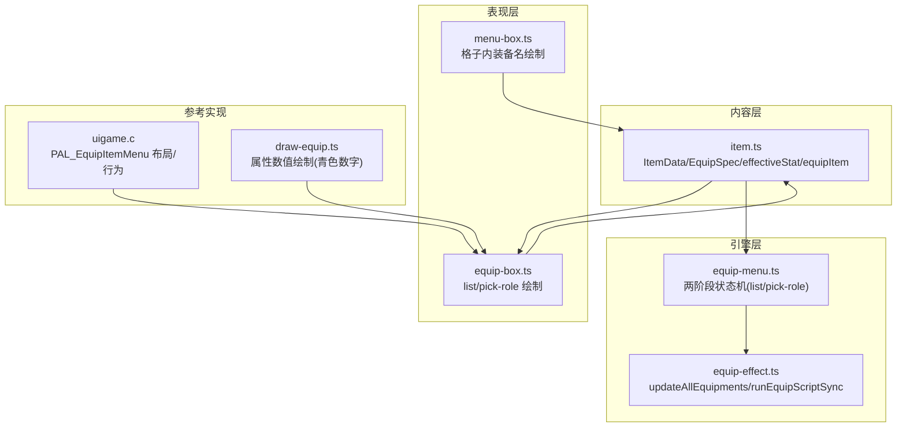
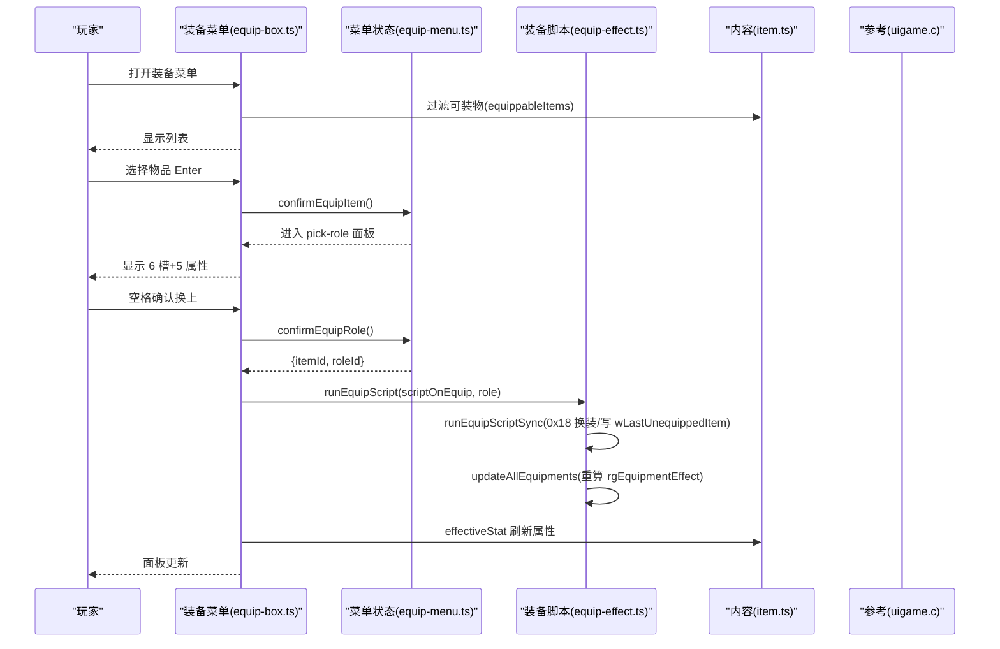
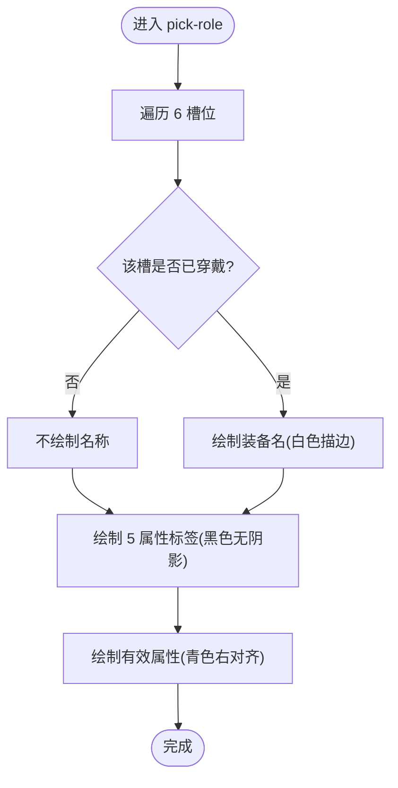
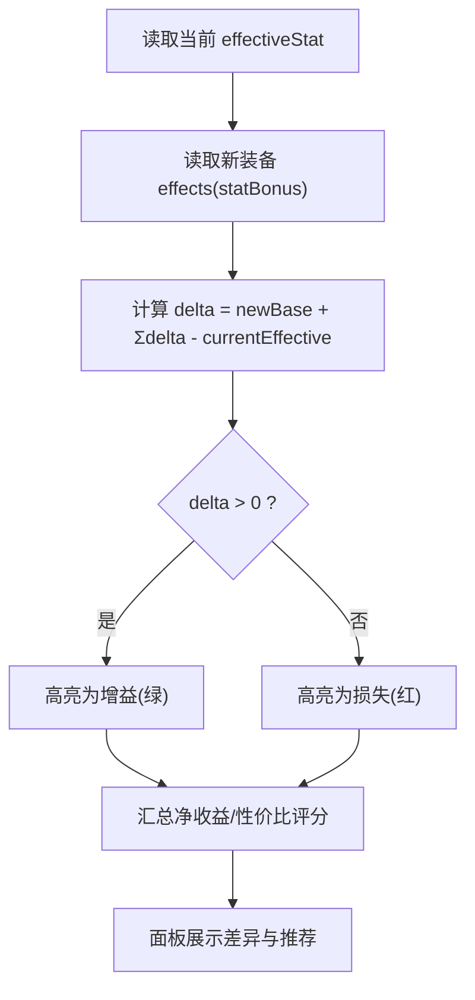
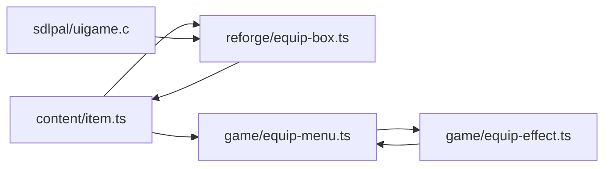

# 装备管理界面

<cite>
**本文引用的文件**
- [equip-effect.ts](file://packages/game/src/core/equip-effect.ts)
- [equip-menu.ts](file://packages/game/src/core/menu/equip-menu.ts)
- [equip-box.ts](file://packages/reforge/src/menu/equip-box.ts)
- [menu-box.ts](file://packages/reforge/src/menu/menu-box.ts)
- [item.ts](file://packages/content/src/item.ts)
- [item-data-design.md](file://docs/phase2/foundation/item-data-design.md)
- [uigame.c](file://reference/sdlpal/uigame.c)
- [draw-equip.ts](file://packages/game/src/present/menu/draw-equip.ts)
</cite>

## 目录
1. [简介](#简介)
2. [项目结构](#项目结构)
3. [核心组件](#核心组件)
4. [架构总览](#架构总览)
5. [详细组件分析](#详细组件分析)
6. [依赖关系分析](#依赖关系分析)
7. [性能与体验优化](#性能与体验优化)
8. [故障排查指南](#故障排查指南)
9. [结论](#结论)
10. [附录：新装备类型集成与界面自定义](#附录新装备类型集成与界面自定义)

## 简介
本技术文档面向“装备管理界面”，覆盖以下目标：
- 装备槽位布局：武器、防具、饰品等 6 个槽位的定义与显示逻辑；穿戴状态与替换流程。
- 属性对比：当前 vs 新装备的属性差异高亮思路与性价比评估方法。
- 预览能力：3D 模型展示、外观切换、特效预览的扩展点说明（概念性）。
- 交互操作：卸下确认、批量管理、一键更换的流程设计。
- 品质/耐久/强化等级：在现有数据层上的预留位置与渲染建议。
- 新装备类型集成方法与界面自定义指南。

## 项目结构
装备管理涉及三层：
- 内容层（content）：物品与装备的数据模型、可装过滤、有效属性计算、不可变换装函数。
- 引擎层（game）：原版脚本驱动的真实值计算与运行时更新（scriptOnEquip 链、属性回灌）。
- 表现层（reforge）：菜单 UI 的两阶段流程（列表选择 + 角色确认面板），以及格子内名称绘制。



图表来源
- [equip-effect.ts:503-517](file://packages/game/src/core/equip-effect.ts#L503-L517)
- [equip-menu.ts:43-51](file://packages/game/src/core/menu/equip-menu.ts#L43-L51)
- [equip-box.ts:171-187](file://packages/reforge/src/menu/equip-box.ts#L171-L187)
- [menu-box.ts:546-560](file://packages/reforge/src/menu/menu-box.ts#L546-L560)
- [item.ts:71-90](file://packages/content/src/item.ts#L71-L90)
- [uigame.c:1861-1893](file://reference/sdlpal/uigame.c#L1861-L1893)
- [draw-equip.ts:152-158](file://packages/game/src/present/menu/draw-equip.ts#L152-L158)

章节来源
- [item.ts:71-90](file://packages/content/src/item.ts#L71-L90)
- [equip-effect.ts:503-517](file://packages/game/src/core/equip-effect.ts#L503-L517)
- [equip-menu.ts:43-51](file://packages/game/src/core/menu/equip-menu.ts#L43-L51)
- [equip-box.ts:171-187](file://packages/reforge/src/menu/equip-box.ts#L171-L187)
- [menu-box.ts:546-560](file://packages/reforge/src/menu/menu-box.ts#L546-L560)
- [uigame.c:1861-1893](file://reference/sdlpal/uigame.c#L1861-L1893)
- [draw-equip.ts:152-158](file://packages/game/src/present/menu/draw-equip.ts#L152-L158)

## 核心组件
- 内容层 item.ts
  - 定义 ItemData、EquipSpec、CombatStat，提供 effectiveStat 计算与 equippableItems 过滤、equipItem 不可变换装。
- 引擎层 equip-effect.ts
  - 对齐 sdlpal 真值：updateAllEquipments 重算所有装备效果；runEquipScriptSync 同步执行 scriptOnEquip 链（含 0x17/0x18/0x19/0x1A/0x2D/0x29）。
- 引擎层 equip-menu.ts
  - 两阶段状态机：list（复用 InventoryMenuState）→ pick-role（确认面板），Confirm 后由 dispatcher 触发 runEquipScript。
- 表现层 equip-box.ts
  - 两阶段绘制：list 使用共享网格；pick-role 显示选中物卷轴、角色名牌、6 槽当前装备、5 属性有效值。
- 表现层 menu-box.ts
  - 格子内装备名绘制（居中底部、描边、专用色）。

章节来源
- [item.ts:71-90](file://packages/content/src/item.ts#L71-L90)
- [equip-effect.ts:503-517](file://packages/game/src/core/equip-effect.ts#L503-L517)
- [equip-menu.ts:43-51](file://packages/game/src/core/menu/equip-menu.ts#L43-L51)
- [equip-box.ts:171-187](file://packages/reforge/src/menu/equip-box.ts#L171-L187)
- [menu-box.ts:546-560](file://packages/reforge/src/menu/menu-box.ts#L546-L560)

## 架构总览
从用户点击到属性生效的关键路径：
- 打开装备菜单 → 列表筛选可装物 → 进入角色确认面板 → 确认换上 → 运行 scriptOnEquip 链 → 更新 rgEquipmentEffect → 刷新有效属性。



图表来源
- [equip-box.ts:171-187](file://packages/reforge/src/menu/equip-box.ts#L171-L187)
- [equip-menu.ts:80-85](file://packages/game/src/core/menu/equip-menu.ts#L80-L85)
- [equip-effect.ts:543-545](file://packages/game/src/core/equip-effect.ts#L543-L545)
- [equip-effect.ts:503-517](file://packages/game/src/core/equip-effect.ts#L503-L517)
- [item.ts:71-90](file://packages/content/src/item.ts#L71-L90)
- [uigame.c:1861-1893](file://reference/sdlpal/uigame.c#L1861-L1893)

## 详细组件分析

### 槽位布局与穿戴状态
- 6 个槽位：weapon/head/body/cloak/feet/accessory，顺序与原版一致（头/披风/身/手/足/饰）。
- 面板中仅当 slot 有装备时才绘制名称，空槽留白。
- 右侧 5 项属性为 effectiveStat 结果（攻击/魔法攻击/防御/速度/运气），青色数字右对齐。



图表来源
- [equip-box.ts:129-168](file://packages/reforge/src/menu/equip-box.ts#L129-L168)
- [item.ts:71-90](file://packages/content/src/item.ts#L71-L90)

章节来源
- [equip-box.ts:129-168](file://packages/reforge/src/menu/equip-box.ts#L129-L168)
- [item.ts:71-90](file://packages/content/src/item.ts#L71-L90)

### 替换逻辑与脚本驱动
- 替换入口：confirmEquipRole 返回 {itemId, roleId}，由上层 dispatcher 调用 runEquipScript。
- runEquipScriptSync 处理 0x18：若槽位当前件与新件不同则执行库存交换并记录 wLastUnequippedItem；否则视为“重算 effect”的 noop。
- 完成后 updateAllEquipments 清空覆盖层并重跑所有装备脚本，确保属性一致。

```mermaid
sequenceDiagram
participant Menu as "菜单(confirmEquipRole)"
participant Script as "runEquipScriptSync"
participant Inv as "库存"
participant GS as "GameState"
Menu->>Script : 传入 scriptOnEquip, roleId
Script->>GS : iCurEquipPart=partIdx; removeEquipmentEffect(partIdx)
Script->>GS : cur = rgwEquipment[partIdx][roleId]
alt cur != newItem
Script->>GS : rgwEquipment[partIdx][roleId]=newItem
Script->>Inv : 移除新装备1 / 旧装备入包1(或原位替换)
Script->>GS : wLastUnequippedItem=cur
else cur == newItem
Script->>Script : 仅重算 effect(noop)
end
Script-->>Menu : 返回
```

图表来源
- [equip-effect.ts:412-442](file://packages/game/src/core/equip-effect.ts#L412-L442)
- [equip-effect.ts:503-517](file://packages/game/src/core/equip-effect.ts#L503-L517)
- [equip-menu.ts:80-85](file://packages/game/src/core/menu/equip-menu.ts#L80-L85)

章节来源
- [equip-effect.ts:412-442](file://packages/game/src/core/equip-effect.ts#L412-L442)
- [equip-effect.ts:503-517](file://packages/game/src/core/equip-effect.ts#L503-L517)
- [equip-menu.ts:80-85](file://packages/game/src/core/menu/equip-menu.ts#L80-L85)

### 属性对比与性价比评估
- 当前 vs 新装备：在 pick-role 面板中，左侧显示待换物品图标/数量/名称，右侧显示 effectiveStat 结果；可在“应用前”通过临时叠加 statBonus 进行对比（见“对比算法”流程图）。
- 差异高亮：建议在 UI 层对每个属性的差值做颜色标记（如绿色上升、红色下降），并在面板顶部汇总“净收益”。
- 性价比评估：可按“属性提升总和 / 购买价”或“关键属性权重加权提升 / 价格”计算评分，供排序或提示。



[此图为概念流程，无需源码映射]

### 装备预览功能（概念）
- 3D 模型展示：可在 pick-role 面板左上角预留 3D 视口，按 slot 加载对应模型资源，支持旋转/缩放。
- 外观切换：根据 slot 的 modelId 或 sprite 索引切换外观；灵珠类可切换“佩戴/未佩戴”外观。
- 特效预览：在模型上叠加粒子/光效，用于展示 grantStatus/attackAll 等效果（需 phase3 引擎配合）。

[本节为概念性说明，不涉及具体源码]

### 交互操作：卸下确认、批量管理、一键更换
- 卸下确认：当 slot 已有装备且玩家选择“空槽”时弹出确认框，避免误卸。
- 批量管理：在 list 阶段支持多选（Shift/Ctrl），统一应用到选定角色或全部角色（需校验 equipableBy）。
- 一键更换：基于性价比评分自动选择最优组合，逐槽位应用（可加“撤销”步骤）。

[本节为交互设计建议，不涉及具体源码]

### 品质标识、耐久度、强化等级
- 品质标识：可在物品 icon 边框或名称旁增加品质徽标（如普通/稀有/传说），由 ItemData 新增字段控制。
- 耐久度：在 ItemData 增加 durability/maxDurability，面板显示“耐久条”与剩余百分比。
- 强化等级：在 ItemData 增加 refineLevel，面板显示“+N”标识，并在 effectiveStat 中按规则累加。

[本节为扩展建议，不涉及具体源码]

## 依赖关系分析
- content 层被 reforge 表现层与 game 引擎层共同依赖。
- 表现层依赖内容层的 effectiveStat 与 equippableItems 进行过滤与计算。
- 引擎层依赖 GameState 与全局命令表，负责真实值与脚本链执行。
- 参考 sdlpal 代码用于对齐布局与行为。



图表来源
- [item.ts:71-90](file://packages/content/src/item.ts#L71-L90)
- [equip-box.ts:171-187](file://packages/reforge/src/menu/equip-box.ts#L171-L187)
- [equip-menu.ts:43-51](file://packages/game/src/core/menu/equip-menu.ts#L43-L51)
- [equip-effect.ts:503-517](file://packages/game/src/core/equip-effect.ts#L503-L517)
- [uigame.c:1861-1893](file://reference/sdlpal/uigame.c#L1861-L1893)

章节来源
- [item.ts:71-90](file://packages/content/src/item.ts#L71-L90)
- [equip-box.ts:171-187](file://packages/reforge/src/menu/equip-box.ts#L171-L187)
- [equip-menu.ts:43-51](file://packages/game/src/core/menu/equip-menu.ts#L43-L51)
- [equip-effect.ts:503-517](file://packages/game/src/core/equip-effect.ts#L503-L517)
- [uigame.c:1861-1893](file://reference/sdlpal/uigame.c#L1861-L1893)

## 性能与体验优化
- 属性计算缓存：effectiveStat 每次遍历已穿戴装备的 effects，建议对角色维度缓存结果，仅在换装/脚本变更后失效。
- 列表过滤优化：equippableItems 先按模板过滤再查 items map，减少无效对象创建。
- 渲染批处理：pick-role 面板中的 label 与数字绘制尽量合并批次，减少 ctx 状态切换。
- 脚本执行限制：runEquipScriptSync 内置 tick 上限，防止死循环导致卡顿。

[本节为通用优化建议]

## 故障排查指南
- 换装无效：检查 confirmEquipRole 是否正确返回 {itemId, roleId}，并确保 dispatcher 调用了 runEquipScript。
- 属性未刷新：确认 updateAllEquipments 是否在换装后被调用，且 rgEquipmentEffect 已清零重算。
- 面板显示异常：核对 PR_SLOTS 顺序与 locale 文本键是否匹配；检查 EQUIP_SLOT_IDS 与 CharacterInstance.equipment 键一致。
- 格子名错位：menu-box 中装备名绘制坐标与字体度量需与 EQUIP_SLOT_SIZE 对齐。

章节来源
- [equip-menu.ts:80-85](file://packages/game/src/core/menu/equip-menu.ts#L80-L85)
- [equip-effect.ts:503-517](file://packages/game/src/core/equip-effect.ts#L503-L517)
- [equip-box.ts:129-168](file://packages/reforge/src/menu/equip-box.ts#L129-L168)
- [menu-box.ts:546-560](file://packages/reforge/src/menu/menu-box.ts#L546-L560)

## 结论
本装备管理界面以“内容层数据 + 引擎层真值 + 表现层两阶段菜单”的分层架构实现，严格对齐 sdlpal 的行为与布局。通过 effectiveStat 与 scriptOnEquip 链的配合，实现了穿戴即生效、可对比、可扩展的装备系统。后续可在品质/耐久/强化与预览方面继续增强，同时完善批量与一键更换等高级交互。

## 附录：新装备类型集成与界面自定义

### 新增装备类型（数据层）
- 在 EquipEffect 联合中添加新的 kind（例如“护盾”“穿透”），并在 effectiveStat 或引擎层添加相应计算分支。
- 在 ItemData.equip.effects 中声明新效果，保持向后兼容（可选字段）。

章节来源
- [item.ts:14-30](file://packages/content/src/item.ts#L14-L30)
- [item-data-design.md:45-66](file://docs/phase2/foundation/item-data-design.md#L45-L66)

### 新增槽位
- 在 EQUIP_SLOT_IDS 追加新槽位，并在 equip-box.ts 的 PR_SLOTS 中补充 label 与行序。
- 在 CharacterInstance.equipment 结构中增加对应字段，确保 equipItem 能读写。

章节来源
- [item.ts:9-11](file://packages/content/src/item.ts#L9-L11)
- [equip-box.ts:54-62](file://packages/reforge/src/menu/equip-box.ts#L54-L62)

### 界面自定义
- 布局坐标：PR_* 常量集中管理，便于主题化与分辨率适配。
- 配色：COLOR_* 常量集中管理，支持暗黑/高对比度主题。
- 字体与描边：renderSpans 统一封装，shadow/forceRgba 参数控制样式。

章节来源
- [equip-box.ts:23-52](file://packages/reforge/src/menu/equip-box.ts#L23-L52)
- [menu-box.ts:546-560](file://packages/reforge/src/menu/menu-box.ts#L546-L560)

### 与参考实现的对照
- 面板背景与图片框：参考 uigame.c 的 EquipImageBox 与属性/槽位标签位置。
- 属性数值绘制：参考 draw-equip.ts 的青色数字绘制方式。

章节来源
- [uigame.c:1861-1893](file://reference/sdlpal/uigame.c#L1861-L1893)
- [draw-equip.ts:152-158](file://packages/game/src/present/menu/draw-equip.ts#L152-L158)