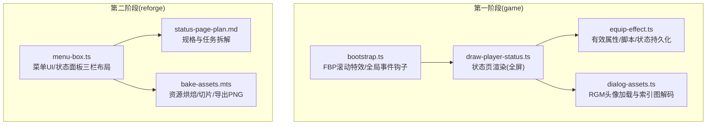
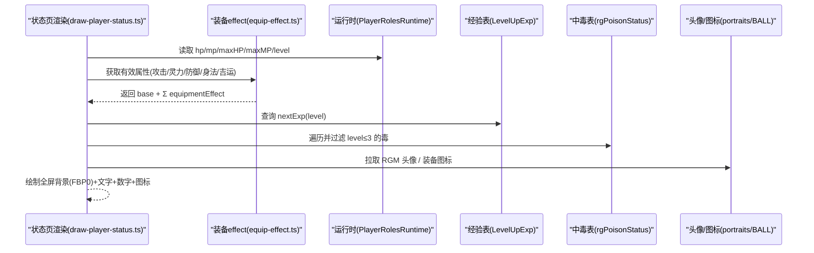
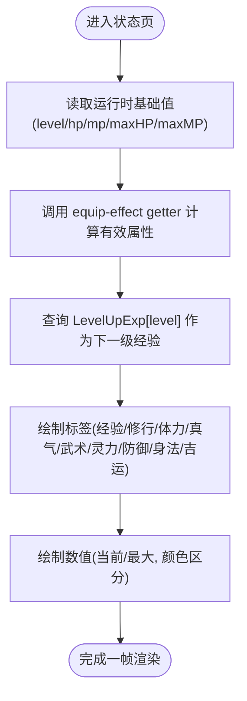
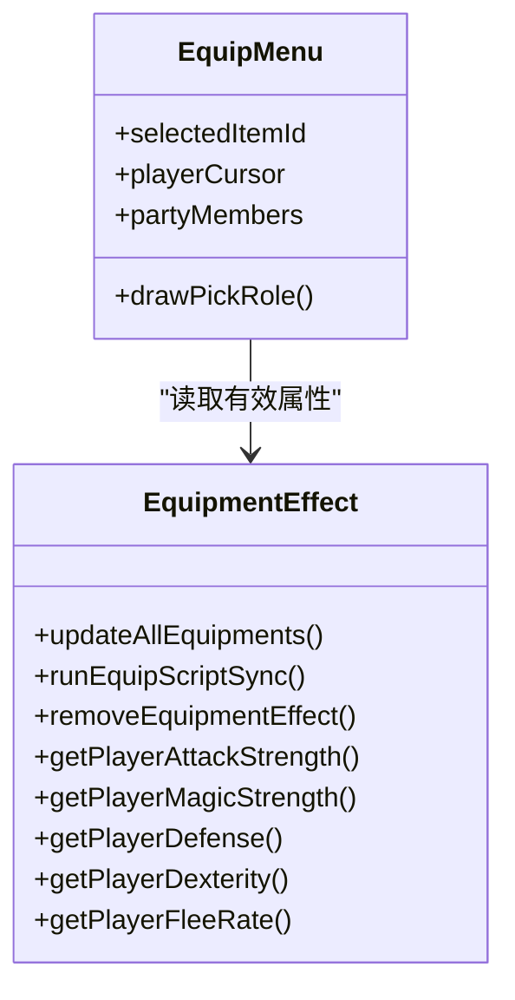
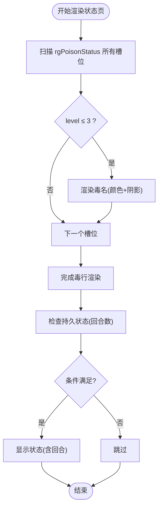
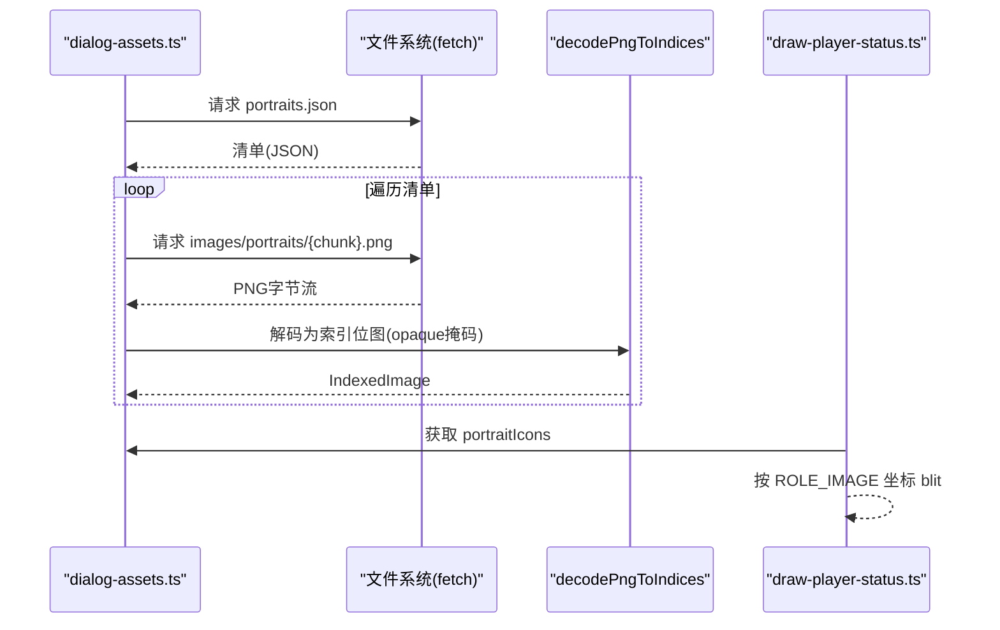
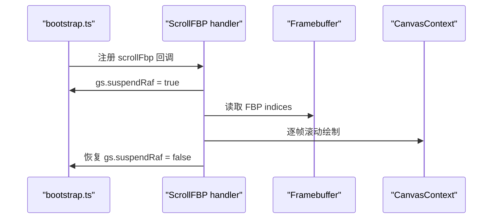
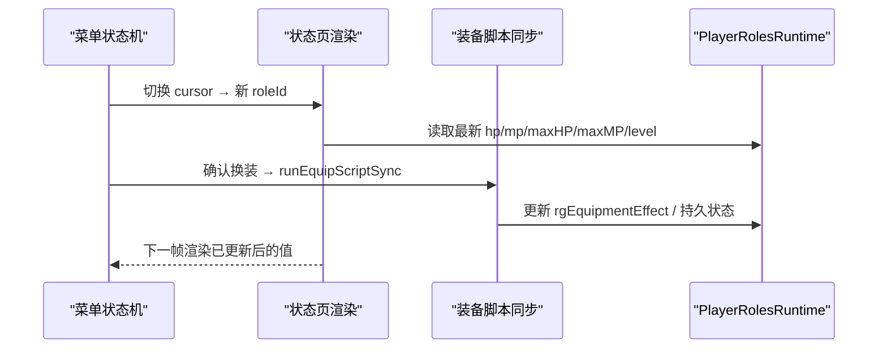
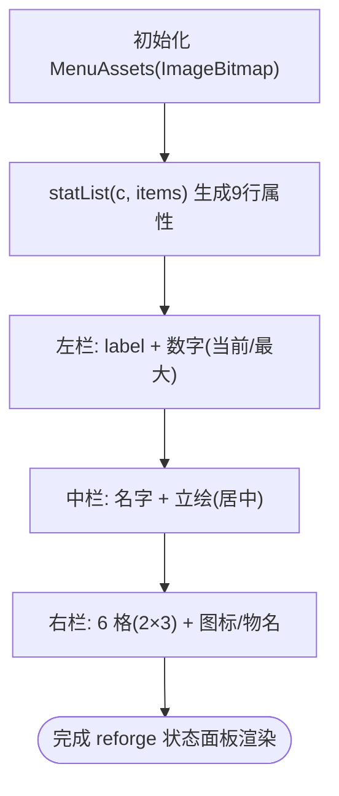
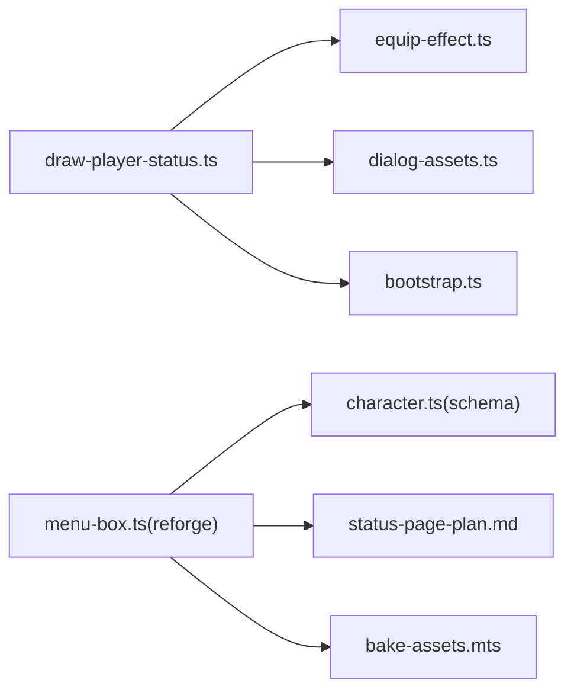

# 角色状态界面

<cite>
**本文引用的文件**
- [packages/reforge/src/menu/menu-box.ts](file://packages/reforge/src/menu/menu-box.ts)
- [packages/game/src/present/menu/draw-player-status.ts](file://packages/game/src/present/menu/draw-player-status.ts)
- [packages/game/src/core/equip-effect.ts](file://packages/game/src/core/equip-effect.ts)
- [packages/content/src/character.ts](file://packages/content/src/character.ts)
- [docs/phase2/menu/status-page-plan.md](file://docs/phase2/menu/status-page-plan.md)
- [packages/game/src/present/menu/draw-equip.ts](file://packages/game/src/present/menu/draw-equip.ts)
- [packages/game/src/assets/dialog-assets.ts](file://packages/game/src/assets/dialog-assets.ts)
- [packages/migrate/scripts/bake-assets.mts](file://packages/migrate/scripts/bake-assets.mts)
- [packages/game/src/shell/bootstrap.ts](file://packages/game/src/shell/bootstrap.ts)
- [packages/game/src/tools/minimap.ts](file://packages/game/src/tools/minimap.ts)
</cite>

## 目录
1. [简介](#简介)
2. [项目结构](#项目结构)
3. [核心组件](#核心组件)
4. [架构总览](#架构总览)
5. [详细组件分析](#详细组件分析)
6. [依赖关系分析](#依赖关系分析)
7. [性能考虑](#性能考虑)
8. [故障排查指南](#故障排查指南)
9. [结论](#结论)
10. [附录](#附录)

## 简介
本技术文档围绕“角色状态界面”的实现与扩展，覆盖以下关键主题：
- 角色属性显示：数值计算、等级进度条、经验值展示
- 装备信息渲染：装备槽位、属性加成、套装效果
- 状态效果指示：中毒标记、增益减益、持续时间显示
- 角色头像绘制：PNG资源映射、表情变化、动画效果
- 全屏背景渲染、多角色切换、数据实时更新机制
- 自定义状态面板的扩展接口与主题定制方法

本项目包含两套实现路径：
- 第一阶段（game 包）：以 sdlpal 为真值进行 1:1 移植，严格对齐原版布局、颜色、时序。
- 第二阶段（reforge 包）：全新 Canvas 2D 引擎重写，采用数据驱动与可配置布局，便于扩展与主题化。

## 项目结构
与角色状态界面直接相关的代码分布在两个阶段：
- 第一阶段（game）：draw-player-status.ts、equip-effect.ts、dialog-assets.ts、bootstrap.ts
- 第二阶段（reforge）：menu-box.ts、status-page-plan.md、bake-assets.mts

图表来源
- [packages/game/src/present/menu/draw-player-status.ts:1-271](file://packages/game/src/present/menu/draw-player-status.ts#L1-L271)
- [packages/game/src/core/equip-effect.ts:1-546](file://packages/game/src/core/equip-effect.ts#L1-L546)
- [packages/game/src/assets/dialog-assets.ts:31-69](file://packages/game/src/assets/dialog-assets.ts#L31-L69)
- [packages/game/src/shell/bootstrap.ts:1305-1324](file://packages/game/src/shell/bootstrap.ts#L1305-L1324)
- [packages/reforge/src/menu/menu-box.ts:1-561](file://packages/reforge/src/menu/menu-box.ts#L1-L561)
- [docs/phase2/menu/status-page-plan.md:1-83](file://docs/phase2/menu/status-page-plan.md#L1-L83)
- [packages/migrate/scripts/bake-assets.mts:33-65](file://packages/migrate/scripts/bake-assets.mts#L33-L65)

章节来源
- [packages/game/src/present/menu/draw-player-status.ts:1-271](file://packages/game/src/present/menu/draw-player-status.ts#L1-L271)
- [packages/reforge/src/menu/menu-box.ts:1-561](file://packages/reforge/src/menu/menu-box.ts#L1-L561)

## 核心组件
- 属性与数值计算
  - 基础属性来自运行时 PlayerRolesRuntime，有效属性通过 equip-effect.ts 的 getter 累加装备 effect 层，得到最终显示值。
  - 经验与升级阈值：当前经验取自 Exp.rgPrimaryExp，下一级所需经验取自 LevelUpExp[level]。
- 装备信息与加成
  - 6 个装备槽位；装备名色 0xBE；装备图标按 item.bitmap 映射到 BALL 图集。
  - 有效属性（武术/灵力/防御/身法/吉运）在状态页与装备预览中均使用 equip-effect.ts 的 getter。
- 状态效果指示
  - 中毒行：遍历 rgPoisonStatus，仅 level≤3 的毒显示，名称来自 WORD 表，颜色偏移 +10，末两项重叠。
  - 增益/减益：通过 setPersistentPlayerStatus 写入持久状态数组，回合数控制显隐。
- 头像绘制
  - RGM.MKF chunk → portraits PNG → 索引位图 + palette 上色 → 不透明遮罩 blit。
- 全屏背景与特效
  - 状态页背景 = FBP chunk 0；支持 ScrollFBP 滚动卷入特效。
- 多角色切换
  - 状态页根据 cursor 选择 partyMembers 中的 roleId；装备页提供角色列表框与四态高亮闪烁。
- 实时更新
  - 装备脚本同步执行（0x17/0x18/0x19/0x1A/0x2D/0x29），即时刷新有效属性与状态；菜单渲染每帧读取最新 runtime。

章节来源
- [packages/game/src/present/menu/draw-player-status.ts:100-271](file://packages/game/src/present/menu/draw-player-status.ts#L100-L271)
- [packages/game/src/core/equip-effect.ts:26-109](file://packages/game/src/core/equip-effect.ts#L26-L109)
- [packages/game/src/assets/dialog-assets.ts:31-69](file://packages/game/src/assets/dialog-assets.ts#L31-L69)
- [packages/game/src/shell/bootstrap.ts:1305-1324](file://packages/game/src/shell/bootstrap.ts#L1305-L1324)

## 架构总览
状态界面由“数据层（runtime + 装备effect）→ 渲染层（fbp/sprite/text）→ 交互层（菜单状态机）”构成。

图表来源
- [packages/game/src/present/menu/draw-player-status.ts:157-271](file://packages/game/src/present/menu/draw-player-status.ts#L157-L271)
- [packages/game/src/core/equip-effect.ts:26-109](file://packages/game/src/core/equip-effect.ts#L26-L109)

## 详细组件分析

### 属性显示与数值计算
- 字段顺序与用词
  - 经验/修行/体力/真气/武术/灵力/防御/身法/吉运，共 9 项，顺序与原版一致。
- 数值来源
  - 基础值：PlayerRolesRuntime（level/hp/maxHP/mp/maxMP）。
  - 有效属性：getPlayerXxxStrength/Defense/Dexterity/FleeRate，累加各装备 slot 的 effect。
  - 经验：curExp=rgPrimaryExp[role].wExp；nextExp=LevelUpExp[level]。
- 显示规则
  - 体力/真气显示“当前/最大”，斜杠 sprite 分隔，最大值蓝/青数字区分。
  - 等级数字黄色右对齐；经验下一级的青色数字用于进度提示。

图表来源
- [packages/game/src/present/menu/draw-player-status.ts:202-253](file://packages/game/src/present/menu/draw-player-status.ts#L202-L253)
- [packages/game/src/core/equip-effect.ts:26-72](file://packages/game/src/core/equip-effect.ts#L26-L72)

章节来源
- [packages/game/src/present/menu/draw-player-status.ts:84-96](file://packages/game/src/present/menu/draw-player-status.ts#L84-L96)
- [packages/game/src/present/menu/draw-player-status.ts:234-253](file://packages/game/src/present/menu/draw-player-status.ts#L234-L253)
- [packages/game/src/core/equip-effect.ts:26-72](file://packages/game/src/core/equip-effect.ts#L26-L72)

### 装备信息渲染（槽位、加成、套装效果）
- 槽位与布局
  - 6 槽位：头/肩/身/手/脚/颈；名称位置与数值位置遵循 ScreenLayout 常量。
  - 装备名色 0xBE；图标按 item.bitmap 从 BALL 图集 blit。
- 属性预览
  - 装备预览页右侧显示 effective stat（cyan 数字），与状态页一致。
- 套装效果
  - 通过 scriptOnEquip 链（0x17/0x18/0x19/0x1A/0x2D/0x29）写入 rgEquipmentEffect 与持久状态，影响有效属性与特殊状态（如双攻）。

图表来源
- [packages/game/src/present/menu/draw-equip.ts:121-207](file://packages/game/src/present/menu/draw-equip.ts#L121-L207)
- [packages/game/src/core/equip-effect.ts:503-546](file://packages/game/src/core/equip-effect.ts#L503-L546)

章节来源
- [packages/game/src/present/menu/draw-equip.ts:58-72](file://packages/game/src/present/menu/draw-equip.ts#L58-L72)
- [packages/game/src/present/menu/draw-equip.ts:152-158](file://packages/game/src/present/menu/draw-equip.ts#L152-L158)
- [packages/game/src/core/equip-effect.ts:26-72](file://packages/game/src/core/equip-effect.ts#L26-L72)

### 状态效果指示（中毒、增益/减益、持续时间）
- 中毒行
  - 遍历 rgPoisonStatus[slot][role]，仅 level≤3 的毒显示；名称来自 WORD 表，颜色 = poison.color + 10，fShadow=TRUE；末两项重叠。
- 增益/减益
  - setPersistentPlayerStatus 写入持久状态数组，回合数控制显隐；部分状态仅在 HP!=0 时生效（如 Bravery/Haste/DualAttack）。
- 持续时间显示
  - 工具面板与战斗检视输出结构化 statuses 与 entries，含回合数与来源说明。

图表来源
- [packages/game/src/present/menu/draw-player-status.ts:255-270](file://packages/game/src/present/menu/draw-player-status.ts#L255-L270)
- [packages/game/src/core/equip-effect.ts:316-339](file://packages/game/src/core/equip-effect.ts#L316-L339)

章节来源
- [packages/game/src/present/menu/draw-player-status.ts:255-270](file://packages/game/src/present/menu/draw-player-status.ts#L255-L270)
- [packages/game/src/core/equip-effect.ts:316-339](file://packages/game/src/core/equip-effect.ts#L316-L339)

### 角色头像绘制（PNG映射、表情变化、动画）
- 资源映射
  - RGM.MKF chunk → portraits JSON → 下载 PNG → decodePngToIndices → 索引位图 + opaque mask。
- 表情与动画
  - 对话头像为静态帧；若需表情变化/动画，可在 portraits 扩展多帧并按逻辑切换。
- 上色与绘制
  - 索引位图必须经 palette 上色后 blit，否则颜色错误。

图表来源
- [packages/game/src/assets/dialog-assets.ts:31-69](file://packages/game/src/assets/dialog-assets.ts#L31-L69)
- [packages/game/src/present/menu/draw-player-status.ts:173-178](file://packages/game/src/present/menu/draw-player-status.ts#L173-L178)

章节来源
- [packages/game/src/assets/dialog-assets.ts:31-69](file://packages/game/src/assets/dialog-assets.ts#L31-L69)
- [packages/game/src/present/menu/draw-player-status.ts:173-178](file://packages/game/src/present/menu/draw-player-status.ts#L173-L178)

### 全屏背景渲染与特效
- 背景
  - 状态页使用 FBP chunk 0 全屏铺底；装备页使用 FBP chunk 1。
- 滚动特效
  - ScrollFBP 触发后，suspendRaf 暂停主循环，执行滚动吸入动画，完成后恢复。

图表来源
- [packages/game/src/shell/bootstrap.ts:1305-1324](file://packages/game/src/shell/bootstrap.ts#L1305-L1324)

章节来源
- [packages/game/src/shell/bootstrap.ts:1305-1324](file://packages/game/src/shell/bootstrap.ts#L1305-L1324)

### 多角色切换与数据实时更新
- 多角色切换
  - 状态页依据 state.cursor 选择 partyMembers 中的 roleId；装备页提供角色列表框与四态高亮闪烁。
- 实时更新
  - 装备脚本同步执行，即时更新 rgEquipmentEffect 与持久状态；菜单渲染每帧读取最新 runtime，保证 UI 与战斗快照一致。

图表来源
- [packages/game/src/present/menu/draw-player-status.ts:163-166](file://packages/game/src/present/menu/draw-player-status.ts#L163-L166)
- [packages/game/src/core/equip-effect.ts:359-487](file://packages/game/src/core/equip-effect.ts#L359-L487)

章节来源
- [packages/game/src/present/menu/draw-player-status.ts:163-166](file://packages/game/src/present/menu/draw-player-status.ts#L163-L166)
- [packages/game/src/core/equip-effect.ts:359-487](file://packages/game/src/core/equip-effect.ts#L359-L487)

### 第二阶段：Reforge 状态面板（三栏布局与数据驱动）
- 布局
  - 左栏：9 属性竖排（label 字模 + value 数字 sprite）；中栏：名字 + 立绘水平居中；右栏：6 装备格 2×3 平铺网格。
- 数据驱动
  - statList 生成属性行，带 max 的行显示“当前/最大”；装备格遍历 EQUIP_SLOT_IDS，空槽留空。
- 资源
  - 预烘 ImageBitmap（黄框九宫格、状态背景、数字、斜杠、立绘等），零运行时烤。

图表来源
- [packages/reforge/src/menu/menu-box.ts:286-298](file://packages/reforge/src/menu/menu-box.ts#L286-L298)
- [packages/reforge/src/menu/menu-box.ts:487-559](file://packages/reforge/src/menu/menu-box.ts#L487-L559)
- [docs/phase2/menu/status-page-plan.md:10-32](file://docs/phase2/menu/status-page-plan.md#L10-L32)

章节来源
- [packages/reforge/src/menu/menu-box.ts:162-186](file://packages/reforge/src/menu/menu-box.ts#L162-L186)
- [packages/reforge/src/menu/menu-box.ts:306-419](file://packages/reforge/src/menu/menu-box.ts#L306-L419)
- [docs/phase2/menu/status-page-plan.md:10-32](file://docs/phase2/menu/status-page-plan.md#L10-L32)

### 资源烘焙与切片（bake-assets）
- 功能
  - 将 portraits PNG 烘焙到 public/portraits；对单行卷轴/itembox 做切片，生成九宫格 tile。
- 用途
  - 为 reforge 菜单 UI 提供预烘 RGBA 资源，避免运行时开销。

章节来源
- [packages/migrate/scripts/bake-assets.mts:33-65](file://packages/migrate/scripts/bake-assets.mts#L33-L65)

## 依赖关系分析
- 模块耦合
  - draw-player-status.ts 依赖 equip-effect.ts（有效属性）、dialog-assets.ts（头像）、fbp 背景资源。
  - menu-box.ts（reforge）依赖 content schema（CharacterInstance.luck）、locale 文本、预烘资源。
- 外部依赖
  - SDL 原语（uigame.c/palcfg.c）作为真值参考；浏览器 Canvas 2D API 负责像素级绘制。

图表来源
- [packages/game/src/present/menu/draw-player-status.ts:1-271](file://packages/game/src/present/menu/draw-player-status.ts#L1-L271)
- [packages/reforge/src/menu/menu-box.ts:1-561](file://packages/reforge/src/menu/menu-box.ts#L1-L561)
- [packages/content/src/character.ts:36-73](file://packages/content/src/character.ts#L36-L73)

章节来源
- [packages/game/src/present/menu/draw-player-status.ts:1-271](file://packages/game/src/present/menu/draw-player-status.ts#L1-L271)
- [packages/reforge/src/menu/menu-box.ts:1-561](file://packages/reforge/src/menu/menu-box.ts#L1-L561)
- [packages/content/src/character.ts:36-73](file://packages/content/src/character.ts#L36-L73)

## 性能考虑
- 预烘资源
  - reforge 使用 ImageBitmap 预烘，减少运行时解码与调色开销。
- 批量加载
  - dialog-assets.ts 使用 Promise.all 并发加载 portraits，降低首屏等待。
- 节流渲染
  - 小部件（如小地图）使用 requestAnimationFrame 节流，避免无谓重绘。
- 内存与缓存
  - 索引位图 + opaque mask 直写 framebuffer，避免额外拷贝；按需 blit 只画可见区域。

章节来源
- [packages/reforge/src/menu/menu-box.ts:341-419](file://packages/reforge/src/menu/menu-box.ts#L341-L419)
- [packages/game/src/assets/dialog-assets.ts:43-69](file://packages/game/src/assets/dialog-assets.ts#L43-L69)
- [packages/game/src/tools/minimap.ts:375-398](file://packages/game/src/tools/minimap.ts#L375-L398)

## 故障排查指南
- 头像颜色异常
  - 现象：对话框或状态页头像偏色。
  - 原因：未使用 palette 上色直接  显示索引位图。
  - 处理：确保 decodePngToIndices 后按 palette 上色再 blit。
- 装备加成不生效
  - 现象：状态页属性与预期不符。
  - 原因：未正确运行 updateAllEquipments 或 runEquipScriptSync。
  - 处理：在启动/读档/换装后调用更新函数，确保 rgEquipmentEffect 被填充。
- 中毒行缺失或错位
  - 现象：毒名未显示或重叠。
  - 原因：level>3 的毒不显示；j 计数与 y 坐标计算未按 sdlpal 规则。
  - 处理：核对过滤条件与 y=58+j*18 及末两项重叠逻辑。
- 全屏背景不显示
  - 现象：状态页无背景。
  - 原因：FBP chunk 0 未加载或 drawBattleBg 未调用。
  - 处理：确认 statusBg 注入与 drawBattleBg 调用。

章节来源
- [packages/game/src/assets/dialog-assets.ts:31-69](file://packages/game/src/assets/dialog-assets.ts#L31-L69)
- [packages/game/src/core/equip-effect.ts:503-546](file://packages/game/src/core/equip-effect.ts#L503-L546)
- [packages/game/src/present/menu/draw-player-status.ts:255-270](file://packages/game/src/present/menu/draw-player-status.ts#L255-L270)
- [packages/game/src/shell/bootstrap.ts:1305-1324](file://packages/game/src/shell/bootstrap.ts#L1305-L1324)

## 结论
角色状态界面在第一阶段实现了与 sdlpal 高度一致的 1:1 还原，包括属性计算、装备加成、状态指示、头像绘制与全屏背景特效；在第二阶段通过 reforge 提供了数据驱动的三栏布局与资源预烘方案，便于扩展与主题定制。建议后续：
- 完善多角色翻页与装备图标系统（item 系统切片）
- 引入更多表情帧与动画（portraits 扩展）
- 增加自定义状态面板的扩展接口（插槽/主题变量）

## 附录
- 自定义状态面板扩展接口（基于 reforge）
  - 新增属性：在 CharacterInstance.baseStats 与 locale 中添加 luck 与对应 word。
  - 新增槽位：EQUIP_SLOT_IDS 扩展，renderStatus 自动遍历。
  - 主题定制：MenuAssets 提供 nums/numsBlue/numsCyan/slash/avatar 等替换入口。
- 主题定制方法
  - 替换 MenuAssets 中的 ImageBitmap 资源（数字、斜杠、立绘、背景）。
  - 调整布局常量（STAT_LINE_H、EQUIP_SLOT_SIZE 等）适配不同分辨率。

章节来源
- [packages/content/src/character.ts:36-73](file://packages/content/src/character.ts#L36-L73)
- [packages/reforge/src/menu/menu-box.ts:306-419](file://packages/reforge/src/menu/menu-box.ts#L306-L419)
- [docs/phase2/menu/status-page-plan.md:41-68](file://docs/phase2/menu/status-page-plan.md#L41-L68)