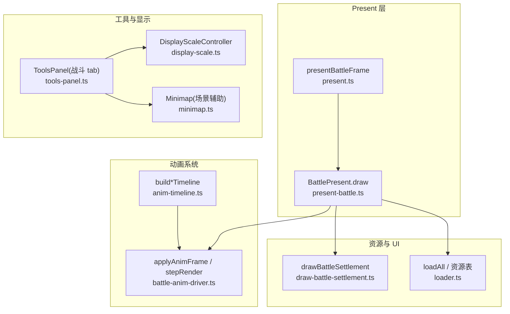
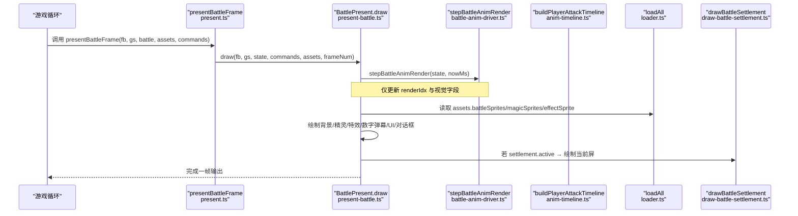
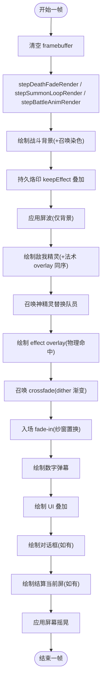
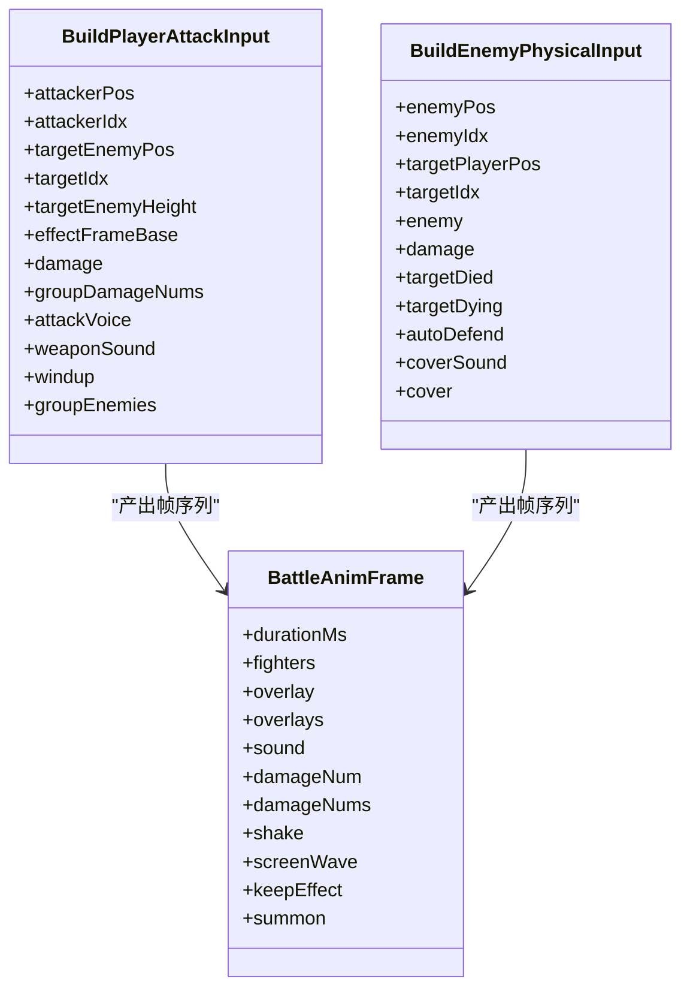
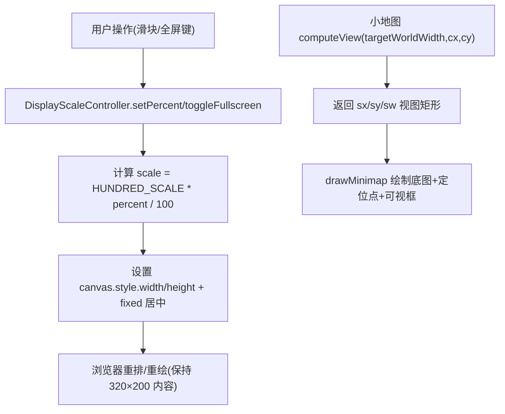
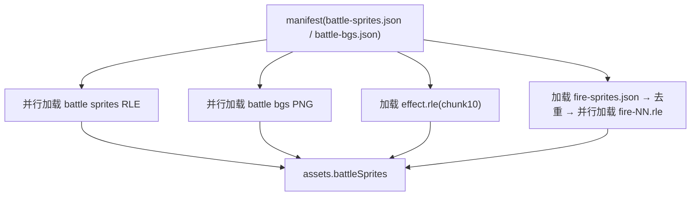
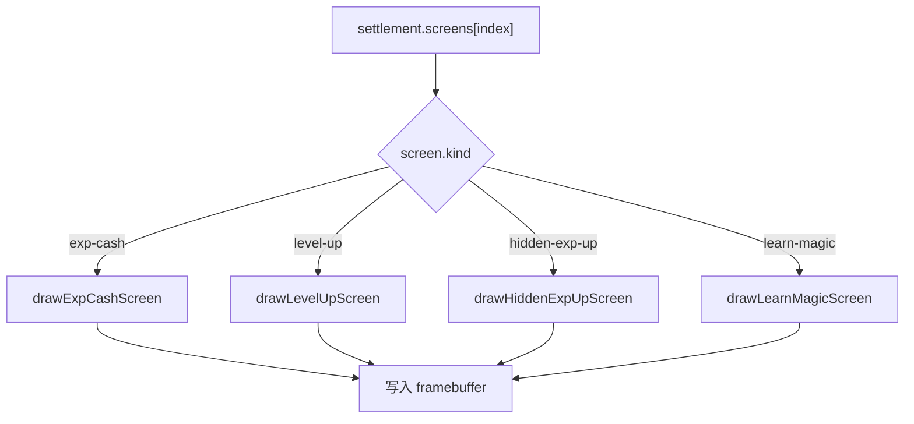
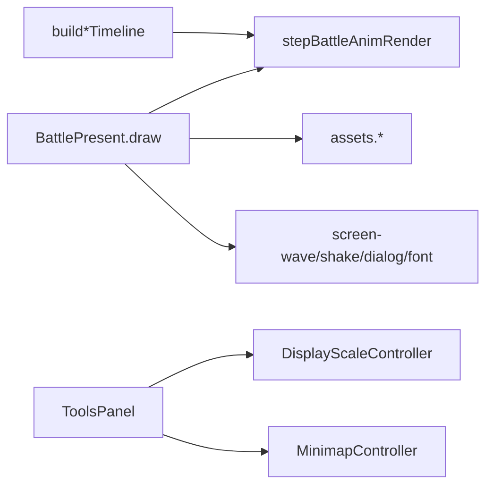

# 战斗渲染系统

<cite>
**本文引用的文件**   
- [present-battle.ts](file://packages/game/src/present/battle/present-battle.ts)
- [present.ts](file://packages/game/src/present/present.ts)
- [draw-battle-settlement.ts](file://packages/game/src/present/battle/draw-battle-settlement.ts)
- [anim-timeline.ts](file://packages/game/src/core/battle/anim-timeline.ts)
- [battle-anim-driver.ts](file://packages/game/src/core/battle/battle-anim-driver.ts)
- [attack-mate.ts](file://packages/game/src/core/battle/actions/attack-mate.ts)
- [attack.ts](file://packages/game/src/core/battle/actions/attack.ts)
- [loader.ts](file://packages/game/src/assets/loader.ts)
- [display-scale.ts](file://packages/game/src/tools/display-scale.ts)
- [minimap.ts](file://packages/game/src/tools/minimap.ts)
- [tools-panel.ts](file://packages/game/src/tools/tools-panel.ts)
</cite>

## 目录
1. [简介](#简介)
2. [项目结构](#项目结构)
3. [核心组件](#核心组件)
4. [架构总览](#架构总览)
5. [详细组件分析](#详细组件分析)
6. [依赖关系分析](#依赖关系分析)
7. [性能考量](#性能考量)
8. [故障排查指南](#故障排查指南)
9. [结论](#结论)
10. [附录](#附录)

## 简介
本技术文档聚焦于“战斗渲染系统”，系统性阐述从背景绘制、角色精灵渲染、UI 叠加到结算画面展示的完整流程；并深入解析战斗动画系统（动作播放、攻击特效、受击反馈、死亡动画）、战斗相机与显示缩放适配、动态调整机制，以及性能优化策略（精灵批处理、动画缓存、内存管理）。同时提供调试工具与自定义战斗界面的扩展方法，帮助开发者快速定位问题并高效扩展。

## 项目结构
围绕战斗渲染的关键模块分布如下：
- Present 层负责一帧装配与绘制顺序控制
- 动画时间线构建器负责生成声明式帧序列
- 动画驱动负责将帧应用到状态并触发副作用
- 资源加载器负责战斗精灵、背景、特效等资源的准备
- 工具面板与显示缩放用于调试与展示适配

图表来源
- [present-battle.ts:127-360](file://packages/game/src/present/battle/present-battle.ts#L127-L360)
- [present.ts:763-775](file://packages/game/src/present/present.ts#L763-L775)
- [anim-timeline.ts:311-458](file://packages/game/src/core/battle/anim-timeline.ts#L311-L458)
- [battle-anim-driver.ts:140-204](file://packages/game/src/core/battle/battle-anim-driver.ts#L140-L204)
- [loader.ts:239-312](file://packages/game/src/assets/loader.ts#L239-L312)
- [draw-battle-settlement.ts:78-95](file://packages/game/src/present/battle/draw-battle-settlement.ts#L78-L95)
- [display-scale.ts:20-50](file://packages/game/src/tools/display-scale.ts#L20-L50)
- [tools-panel.ts:504-525](file://packages/game/src/tools/tools-panel.ts#L504-L525)
- [minimap.ts:42-48](file://packages/game/src/tools/minimap.ts#L42-L48)

章节来源
- [present-battle.ts:127-360](file://packages/game/src/present/battle/present-battle.ts#L127-L360)
- [present.ts:763-775](file://packages/game/src/present/present.ts#L763-L775)

## 核心组件
- BattlePresent：战斗一帧装配器，负责消费命令、绘制背景/精灵/特效/UI/对话框/结算、应用屏波/抖屏/淡入淡出等全局效果。
- 动画时间线构建器：以纯函数方式产出 BattleAnimFrame[]，描述每帧的 fighter 变化、overlay、音效、抖动等。
- 动画驱动：将帧应用到 BattleState，并在逻辑 tick 推进时触发副作用（伤害数字、音效），在 present 端按真实时间细分视觉帧。
- 资源加载器：集中加载战斗精灵、背景、魔法/命中特效、UI sprite、物品图标等，并提供 battleEffectIndex 等真值表。
- 结算渲染：对照原版多屏 box 布局，绘制经验/金钱、升级属性对比、练成提示等。
- 显示缩放与工具面板：CSS 缩放 canvas、全屏切换、FPS 开关、战斗 tab 只读信息展示。

章节来源
- [present-battle.ts:104-135](file://packages/game/src/present/battle/present-battle.ts#L104-L135)
- [anim-timeline.ts:26-35](file://packages/game/src/core/battle/anim-timeline.ts#L26-L35)
- [battle-anim-driver.ts:115-154](file://packages/game/src/core/battle/battle-anim-driver.ts#L115-L154)
- [loader.ts:239-312](file://packages/game/src/assets/loader.ts#L239-L312)
- [draw-battle-settlement.ts:78-95](file://packages/game/src/present/battle/draw-battle-settlement.ts#L78-L95)
- [display-scale.ts:20-50](file://packages/game/src/tools/display-scale.ts#L20-L50)
- [tools-panel.ts:504-525](file://packages/game/src/tools/tools-panel.ts#L504-L525)

## 架构总览
战斗渲染采用“Present 装配 + 声明式动画 + 驱动应用”的分层设计。Present 层严格遵循 sdlpal 的绘制顺序，确保背景、精灵、特效、UI、对话框、结算的正确层级；动画系统通过时间线解耦“逻辑推进”和“视觉细分”，避免拍频与卡顿；资源加载器按需加载并缓存关键资源，减少运行时开销。

图表来源
- [present.ts:763-775](file://packages/game/src/present/present.ts#L763-L775)
- [present-battle.ts:127-360](file://packages/game/src/present/battle/present-battle.ts#L127-L360)
- [battle-anim-driver.ts:174-204](file://packages/game/src/core/battle/battle-anim-driver.ts#L174-L204)
- [anim-timeline.ts:311-458](file://packages/game/src/core/battle/anim-timeline.ts#L311-L458)
- [loader.ts:239-312](file://packages/game/src/assets/loader.ts#L239-L312)
- [draw-battle-settlement.ts:78-95](file://packages/game/src/present/battle/draw-battle-settlement.ts#L78-L95)

## 详细组件分析

### 战斗渲染管线（背景→精灵→特效→UI→结算）
- 背景绘制：根据战场 id 取 BattleBgAsset，支持召唤期背景染色。
- 持久烙印：W4 keepEffect 将法术 overlay 烙进背景，后续帧重绘 bg 时保留。
- 屏波效果：在精灵之前对背景施加波浪扭曲，避免精灵被撕裂。
- 精灵渲染：敌我双方精灵统一 z 排序，死员画倒下帧；召唤神出场替换队员。
- 特效叠加：kind='magic' 与精灵同序；kind='effect' 恒最上层。
- 召唤 crossfade：对场景层做 dither 渐变，UI 随后清晰覆盖。
- 入场 fade-in：纱窗式整像素置换揭示新战斗帧。
- 数字弹幕：基于精灵底锚计算坐标，使用 UI sprite 数字帧绘制。
- UI 叠加：主菜单/二级菜单/目标光标/HPMP 状态栏。
- 对话框：复用大世界 dialog 渲染，覆于战斗场景之上。
- 结算演出：按当前 screen index 绘制单屏 box。
- 屏幕摇晃：最后阶段施加，对齐视频输出阶段 shake。

图表来源
- [present-battle.ts:127-360](file://packages/game/src/present/battle/present-battle.ts#L127-L360)

章节来源
- [present-battle.ts:127-360](file://packages/game/src/present/battle/present-battle.ts#L127-L360)

### 战斗动画系统（动作/特效/受击/死亡）
- 玩家物理攻击：前摇举武器→冲刺→命中特效+受击闪白→击退→复位。
- 敌人物理攻击：施法前摇→冲锋→命中受击→击退→死亡/濒死→复位。
- 友军误伤走入：前摇→走到目标前→挥臂→友军击退+闪白→复位。
- 投掷物挥臂：前移→持物姿态→出手→衔接 OffMagic 特效。
- 使用物品：前摇→使用者前移+手势→目标闪烁→停顿。
- 魔法链：PreMagic 上移+手势+cast 特效→OffMagic 落点特效→PostMagic 收尾。
- 受击反馈：iColorShift 闪烁、damageNum 弹出、shake 震动。
- 死亡动画：frameBak=2(死)/1(濒死)，延迟后恢复站立或睡姿。

图表来源
- [anim-timeline.ts:245-298](file://packages/game/src/core/battle/anim-timeline.ts#L245-L298)
- [anim-timeline.ts:460-491](file://packages/game/src/core/battle/anim-timeline.ts#L460-L491)
- [anim-timeline.ts:311-458](file://packages/game/src/core/battle/anim-timeline.ts#L311-L458)
- [anim-timeline.ts:509-670](file://packages/game/src/core/battle/anim-timeline.ts#L509-L670)

章节来源
- [anim-timeline.ts:311-458](file://packages/game/src/core/battle/anim-timeline.ts#L311-L458)
- [anim-timeline.ts:509-670](file://packages/game/src/core/battle/anim-timeline.ts#L509-L670)
- [attack-mate.ts:77-103](file://packages/game/src/core/battle/actions/attack-mate.ts#L77-L103)
- [attack.ts:491-520](file://packages/game/src/core/battle/actions/attack.ts#L491-L520)

### 战斗相机系统与显示缩放
- 内部分辨率固定为 320×200，Canvas 通过 CSS 进行显示缩放，不改变游戏坐标。
- 缩放范围 10%~1000%，默认 100%（960×600），localStorage 持久化。
- 全屏切换：document.fullscreen API，居中 letterbox 显示。
- 小地图视图：世界像素到缩略图变换，以主角为中心裁剪，支持多档缩放。

图表来源
- [display-scale.ts:20-50](file://packages/game/src/tools/display-scale.ts#L20-L50)
- [minimap.ts:42-48](file://packages/game/src/tools/minimap.ts#L42-L48)

章节来源
- [display-scale.ts:20-50](file://packages/game/src/tools/display-scale.ts#L20-L50)
- [minimap.ts:42-48](file://packages/game/src/tools/minimap.ts#L42-L48)

### 资源加载与缓存
- 战斗精灵：按 kind-id 键名加载 RLE 帧集，失败跳过。
- 战斗背景：按 FBP chunk id 加载 PNG。
- 命中特效：DATA.MKF chunk 10，RLE 帧集。
- 法术特效：FIRE.MKF 各 chunk，按 magics[].effect 引用去重加载。
- UI sprite：SPRITEUI 前 18 帧用于菜单/数字。
- 物品图标：BALL.MKF 对应 chunk 映射。

图表来源
- [loader.ts:239-312](file://packages/game/src/assets/loader.ts#L239-L312)

章节来源
- [loader.ts:239-312](file://packages/game/src/assets/loader.ts#L239-L312)

### 结算画面展示
- Phase A：获得经验值/打败敌人得文钱，数字右对齐/中位对齐。
- Phase B：升级 box，标题+8 属性 old→cur，箭头与斜杠 sprite。
- Phase D：练成提示，name/练成/magicName 三段拼接，色 0x1B。

图表来源
- [draw-battle-settlement.ts:78-95](file://packages/game/src/present/battle/draw-battle-settlement.ts#L78-L95)

章节来源
- [draw-battle-settlement.ts:78-95](file://packages/game/src/present/battle/draw-battle-settlement.ts#L78-L95)

## 依赖关系分析
- Present 层依赖：
  - 动画驱动：stepBattleAnimRender 更新视觉帧
  - 资源表：battleSprites/magicSprites/effectSprite/uiSpriteFrames
  - 子系统：屏波/抖屏、对话框、字体、数字绘制
- 动画系统依赖：
  - 时间线构建器：build*Timeline 产出帧序列
  - 驱动：applyAnimFrameVisual/advanceBattleAnimFrames
- 工具面板依赖：
  - DisplayScaleController：缩放/全屏
  - MinimapController：场景小地图

图表来源
- [present-battle.ts:127-360](file://packages/game/src/present/battle/present-battle.ts#L127-L360)
- [battle-anim-driver.ts:174-204](file://packages/game/src/core/battle/battle-anim-driver.ts#L174-L204)
- [anim-timeline.ts:311-458](file://packages/game/src/core/battle/anim-timeline.ts#L311-L458)
- [tools-panel.ts:504-525](file://packages/game/src/tools/tools-panel.ts#L504-L525)
- [minimap.ts:42-48](file://packages/game/src/tools/minimap.ts#L42-L48)

章节来源
- [present-battle.ts:127-360](file://packages/game/src/present/battle/present-battle.ts#L127-L360)
- [battle-anim-driver.ts:174-204](file://packages/game/src/core/battle/battle-anim-driver.ts#L174-L204)
- [anim-timeline.ts:311-458](file://packages/game/src/core/battle/anim-timeline.ts#L311-L458)
- [tools-panel.ts:504-525](file://packages/game/src/tools/tools-panel.ts#L504-L525)
- [minimap.ts:42-48](file://packages/game/src/tools/minimap.ts#L42-L48)

## 性能考量
- 精灵批处理：
  - 敌我精灵与法术 overlay 统一 z 排序，减少跨层 blit 次数。
  - magic overlays 收集后批量排序绘制，降低绘制抖动。
- 动画缓存：
  - 资源按 manifest 并行加载，RLE 压缩帧集减少 I/O 与内存占用。
  - 法术特效按引用去重加载，避免重复 chunk。
- 内存管理：
  - 召唤 crossfade 仅在需要时拷贝 lastFrameBuf，非 fade 帧不分配。
  - introBackup 在进入战斗首帧快照，退出后释放。
- 视觉细分：
  - stepBattleAnimRender 按 wall-clock 推进 renderIdx，避免 40ms tick 导致的拍频。
- 屏幕效果：
  - 屏波/抖屏在合适阶段应用，避免对精灵造成撕裂或额外重绘。

[本节为通用指导，无需列出具体文件来源]

## 故障排查指南
- 施法慢/拍频：
  - 检查 stepBattleAnimRender 是否按真实时间推进 renderIdx，确认逻辑 idx 与视觉分离。
- Boss 横向撕裂：
  - 确认屏波应用在精灵之前，且 animWave 临时叠加后及时恢复。
- 数字先蹦再跑：
  - 检查 damageNum 挂帧时机，确保在命中特效 i==0 帧或 PostMagic 第一帧弹出。
- 受击回弹卡顿：
  - 检查敌物理攻击收尾 frameBak 与位置归位是否合并到同一帧，避免瞬移复位的两段式。
- 召唤卡顿：
  - 确认 summon loop 由 stepSummonLoopRender 驱动，避免与 stepBattleAnimRender 双驱。
- 全屏/缩放异常：
  - 检查 DisplayScaleController 的 CSS 设置与 fullscreen API 调用是否正确。

章节来源
- [present-battle.ts:210-225](file://packages/game/src/present/battle/present-battle.ts#L210-L225)
- [anim-timeline.ts:509-670](file://packages/game/src/core/battle/anim-timeline.ts#L509-L670)
- [battle-anim-driver.ts:174-204](file://packages/game/src/core/battle/battle-anim-driver.ts#L174-L204)
- [display-scale.ts:20-50](file://packages/game/src/tools/display-scale.ts#L20-L50)

## 结论
战斗渲染系统通过分层设计与声明式动画，实现了高保真还原与流畅体验。Present 层严格遵循原版绘制顺序，动画系统解耦逻辑与视觉，资源加载器保证高效加载与缓存，工具面板与显示缩放提供完善的调试与适配能力。建议持续优化精灵批处理与动画细分，关注内存峰值与跨帧状态清理，确保在不同设备上的稳定表现。

[本节为总结性内容，无需列出具体文件来源]

## 附录
- 自定义战斗界面扩展方法：
  - 在 BattleAssets 中注入新的 uiSpriteFrames/glyphs/itemIcons/objectPoisons，供 drawBattleUI 与相关绘制函数使用。
  - 通过 tools-panel 的战斗 tab 只读信息接口，扩展实时战况展示。
  - 利用 display-scale 控制器实现自定义缩放策略或全屏行为。

章节来源
- [present-battle.ts:56-97](file://packages/game/src/present/battle/present-battle.ts#L56-L97)
- [tools-panel.ts:394-471](file://packages/game/src/tools/tools-panel.ts#L394-L471)
- [display-scale.ts:20-50](file://packages/game/src/tools/display-scale.ts#L20-L50)