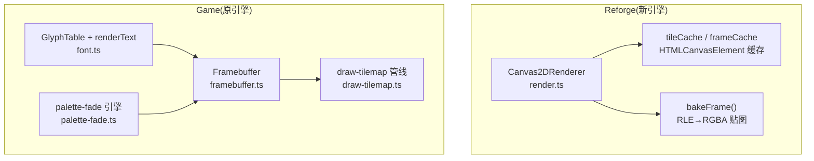
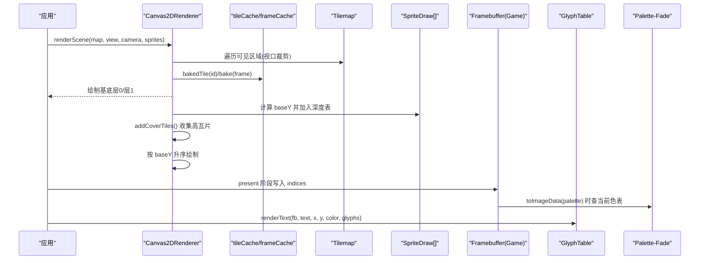
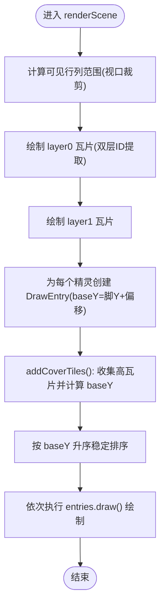
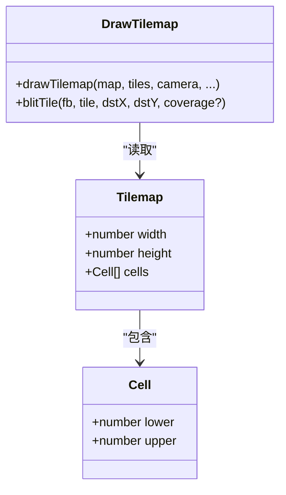
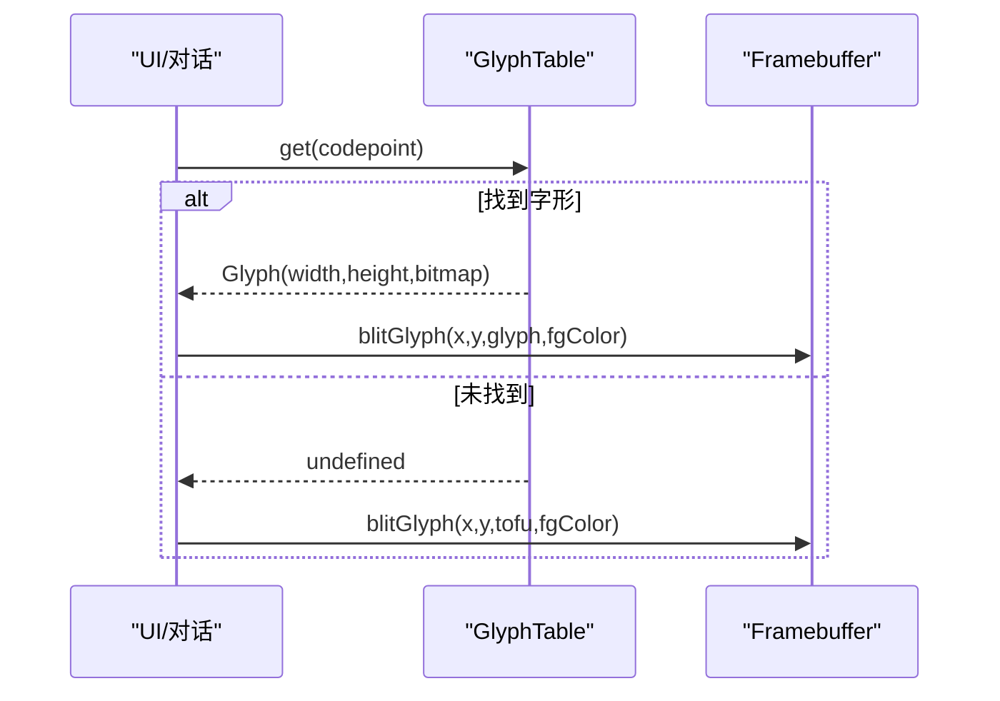
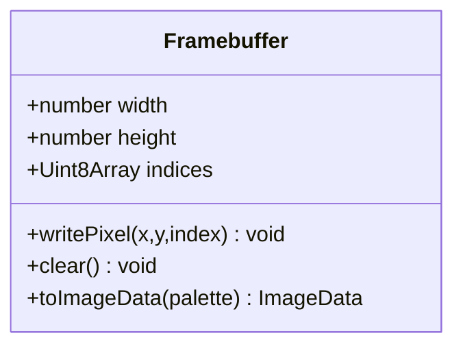
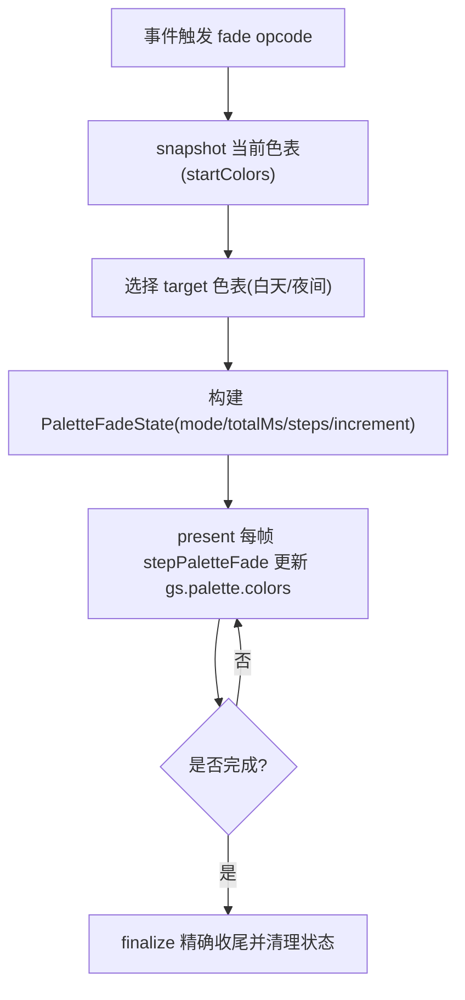
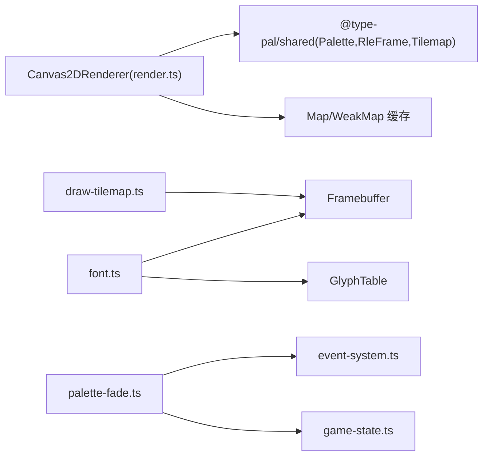

# 渲染引擎

<cite>
**本文引用的文件**
- [packages/game/src/present/framebuffer.ts](file://packages/game/src/present/framebuffer.ts)
- [packages/reforge/src/render.ts](file://packages/reforge/src/render.ts)
- [packages/game/src/present/draw-tilemap.ts](file://packages/game/src/present/draw-tilemap.ts)
- [packages/pal-extract/scripts/render-tilemap.ts](file://packages/pal-extract/scripts/render-tilemap.ts)
- [packages/game/src/present/font.ts](file://packages/game/src/present/font.ts)
- [reference/sdlpal/font.c](file://reference/sdlpal/font.c)
- [reference/sdlpal/font.h](file://reference/sdlpal/font.h)
- [packages/game/src/core/palette-fade.ts](file://packages/game/src/core/palette-fade.ts)
- [packages/game/src/core/game-state.ts](file://packages/game/src/core/game-state.ts)
- [packages/game/src/core/event-system.ts](file://packages/game/src/core/event-system.ts)
- [reference/sdlpal/video_glsl.c](file://reference/sdlpal/video_glsl.c)
</cite>

## 目录
1. [简介](#简介)
2. [项目结构](#项目结构)
3. [核心组件](#核心组件)
4. [架构总览](#架构总览)
5. [详细组件分析](#详细组件分析)
6. [依赖关系分析](#依赖关系分析)
7. [性能考量](#性能考量)
8. [故障排查指南](#故障排查指南)
9. [结论](#结论)
10. [附录](#附录)

## 简介
本技术文档聚焦于 Canvas 2D 渲染系统的核心实现，覆盖以下关键主题：
- 精灵绘制优化算法与遮挡排序（baseY）
- 地图瓦片渲染管线（等距瓦片、双层 tile、视口裁剪）
- 字体渲染系统（字形位图 blit、占位回退）
- 帧缓冲机制与离屏渲染（索引缓冲、调色板转换）
- 视口裁剪与批量绘制优化（缓存、合并 drawImage）
- 像素级精度控制、颜色调色板处理、透明度混合
- 渲染性能策略（纹理缓存、调用合并、GPU 加速利用）
- 自定义渲染效果扩展方法与调试工具使用

## 项目结构
本项目包含两套运行时代码：第一阶段（game）以忠实还原为主；第二阶段（reforge）为全新 Canvas 2D 重写。本文重点围绕 reforge 的 Canvas 2D 渲染器以及 game 中的帧缓冲/字体/调色板淡入淡出等子系统展开。

图表来源
- [packages/reforge/src/render.ts:87-125](file://packages/reforge/src/render.ts#L87-L125)
- [packages/game/src/present/framebuffer.ts:1-50](file://packages/game/src/present/framebuffer.ts#L1-L50)
- [packages/game/src/present/font.ts:1-42](file://packages/game/src/present/font.ts#L1-L42)
- [packages/game/src/core/palette-fade.ts:1-251](file://packages/game/src/core/palette-fade.ts#L1-L251)
- [packages/game/src/present/draw-tilemap.ts:1-90](file://packages/game/src/present/draw-tilemap.ts#L1-L90)

章节来源
- [packages/reforge/src/render.ts:1-258](file://packages/reforge/src/render.ts#L1-L258)
- [packages/game/src/present/framebuffer.ts:1-50](file://packages/game/src/present/framebuffer.ts#L1-L50)
- [packages/game/src/present/font.ts:1-42](file://packages/game/src/present/font.ts#L1-L42)
- [packages/game/src/core/palette-fade.ts:1-251](file://packages/game/src/core/palette-fade.ts#L1-L251)
- [packages/game/src/present/draw-tilemap.ts:1-90](file://packages/game/src/present/draw-tilemap.ts#L1-L90)

## 核心组件
- Canvas2DRenderer：基于 Canvas 2D 的场景渲染器，负责基底两层瓦片绘制、精灵与 cover-tile 的深度排序与绘制、缓存烘焙。
- Framebuffer：320×200 索引缓冲，支持逐像素写入、清屏、索引到 RGBA 转换。
- GlyphTable + renderText：字形表加载与按位图 blit 的文本渲染。
- palette-fade：调色板 ramp 淡入淡出引擎，独立于 dither 像素混合，直接修改色表。
- draw-tilemap：等距瓦片绘制管线，含双层 tile、视口裁剪、coverage mask 辅助修复接缝。

章节来源
- [packages/reforge/src/render.ts:87-165](file://packages/reforge/src/render.ts#L87-L165)
- [packages/game/src/present/framebuffer.ts:1-50](file://packages/game/src/present/framebuffer.ts#L1-L50)
- [packages/game/src/present/font.ts:1-42](file://packages/game/src/present/font.ts#L1-L42)
- [packages/game/src/core/palette-fade.ts:1-251](file://packages/game/src/core/palette-fade.ts#L1-L251)
- [packages/game/src/present/draw-tilemap.ts:1-90](file://packages/game/src/present/draw-tilemap.ts#L1-L90)

## 架构总览
下图展示从场景数据到屏幕输出的整体流程，包括 Reformat 的 Canvas 2D 管线与 Game 的帧缓冲/字体/调色板子系统协作。

图表来源
- [packages/reforge/src/render.ts:127-165](file://packages/reforge/src/render.ts#L127-L165)
- [packages/game/src/present/framebuffer.ts:36-47](file://packages/game/src/present/framebuffer.ts#L36-L47)
- [packages/game/src/present/font.ts:1-42](file://packages/game/src/present/font.ts#L1-L42)
- [packages/game/src/core/palette-fade.ts:1-251](file://packages/game/src/core/palette-fade.ts#L1-L251)

## 详细组件分析

### Canvas2DRenderer（精灵绘制与遮挡）
- 设计要点
  - 基底两层瓦片先画（layer0 后 layer1），随后将精灵与“会盖住该精灵的高瓦片”统一入深度表，按 baseY 升序绘制，实现高度感知的遮挡。
  - 精灵 baseY = 脚 Y；cover-tile baseY 由行、子行、高度共同决定，确保投影靠前者后画、正确遮挡。
  - 通过 tileCache 与 frameCache 缓存 HTMLCanvasElement，减少重复烘焙与 drawImage 开销。
- 关键流程
  - renderScene：视口裁剪 → 基底两层瓦片 → 构建 DrawEntry 列表（精灵 + cover-tile）→ 排序 → 绘制。
  - addCoverTiles：定位可能遮挡精灵的高瓦片，计算其 screenX/screenY 与 baseY，并入表。
  - bake/bakedTile：RLE 帧或瓦片帧烘焙为带透明度的 Canvas 贴图。

图表来源
- [packages/reforge/src/render.ts:127-165](file://packages/reforge/src/render.ts#L127-L165)
- [packages/reforge/src/render.ts:167-240](file://packages/reforge/src/render.ts#L167-L240)
- [packages/reforge/src/render.ts:25-45](file://packages/reforge/src/render.ts#L25-L45)

章节来源
- [packages/reforge/src/render.ts:1-258](file://packages/reforge/src/render.ts#L1-258)

### 地图瓦片渲染管线（等距瓦片、双层 tile、视口裁剪）
- 数据结构
  - Tilemap.cells[row][col] 存储 lower/upper 双 DWORD，分别编码 layer0/layer1 的瓦片 ID、高度等信息。
  - tileIdLayer0/tileIdLayer1 从 DWORD 中提取有效 ID，layer1 需减 1 表示无瓦片。
- 绘制逻辑
  - 对可见行列进行边界裁剪，避免越界访问。
  - 对每个 cell 分别绘制 lower 与 upper 层，注意 h-subrow 的 Y 步进与半格偏移。
  - 可选 coverage mask 记录被瓦片实际绘制的像素，用于修复美术接缝问题。

图表来源
- [packages/game/src/present/draw-tilemap.ts:14-90](file://packages/game/src/present/draw-tilemap.ts#L14-L90)

章节来源
- [packages/game/src/present/draw-tilemap.ts:1-90](file://packages/game/src/present/draw-tilemap.ts#L1-L90)
- [packages/pal-extract/scripts/render-tilemap.ts:152-228](file://packages/pal-extract/scripts/render-tilemap.ts#L152-L228)

### 字体渲染系统（字形位图 blit）
- 数据源
  - glyphs.json 提供 codepoint → 位图(bitmapBase64)、宽高信息。
  - 未命中字形时使用 tofu 占位框（16×16 空心框）。
- 渲染流程
  - loadGlyphs 解析 JSON，构造 GlyphTable。
  - renderText 遍历 UTF-8 codepoint，查找 Glyph，按位图逐像素写入 framebuffer 对应位置。
  - measureText 用于宽度测量。

图表来源
- [packages/game/src/present/font.ts:1-42](file://packages/game/src/present/font.ts#L1-L42)

章节来源
- [packages/game/src/present/font.ts:1-42](file://packages/game/src/present/font.ts#L1-L42)
- [reference/sdlpal/font.c:174-198](file://reference/sdlpal/font.c#L174-L198)
- [reference/sdlpal/font.h:22-66](file://reference/sdlpal/font.h#L22-L66)

### 帧缓冲机制与离屏渲染
- Framebuffer 接口
  - 320×200 默认尺寸，indices 为 Uint8Array 索引缓冲。
  - writePixel 带边界检查；clear 填充 0；toImageData 根据 Palette 转换为 RGBA ImageData。
- 离屏用途
  - 开发面板中整张地图缩略图渲染需要超出屏幕尺寸的 framebuffer。
  - 战斗/菜单等可单独在离屏缓冲绘制后再合成。

图表来源
- [packages/game/src/present/framebuffer.ts:1-50](file://packages/game/src/present/framebuffer.ts#L1-L50)

章节来源
- [packages/game/src/present/framebuffer.ts:1-50](file://packages/game/src/present/framebuffer.ts#L1-L50)

### 调色板淡入淡出（palette-fade）
- 目标
  - 模拟 sdlpal palette.c 的 FadeOut/FadeIn/SceneFade/PaletteFade/ColorFade/FadeToRed。
  - 与 dither 像素混合正交：本模块 mutate gs.palette.colors（色表），不改动 fb.indices。
- 数学模型
  - lerp：线性插值，适用于 FadeOut/FadeIn/SceneFade/PaletteFade。
  - approach：逐步收敛，适用于 ColorFade/FadeToRed。
- 集成点
  - event-system 在特定 opcode 下创建 paletteFadeState。
  - present.ts 每帧 stepPaletteFade 更新 gs.palette.colors。
  - game-state 维护 basePalette（稳定参考）与 palette（工作副本）。

图表来源
- [packages/game/src/core/palette-fade.ts:1-251](file://packages/game/src/core/palette-fade.ts#L1-L251)
- [packages/game/src/core/event-system.ts:2527-2544](file://packages/game/src/core/event-system.ts#L2527-L2544)
- [packages/game/src/core/game-state.ts:768-785](file://packages/game/src/core/game-state.ts#L768-L785)

章节来源
- [packages/game/src/core/palette-fade.ts:1-251](file://packages/game/src/core/palette-fade.ts#L1-L251)
- [packages/game/src/core/event-system.ts:2527-2544](file://packages/game/src/core/event-system.ts#L2527-L2544)
- [packages/game/src/core/game-state.ts:768-785](file://packages/game/src/core/game-state.ts#L768-L785)

### 透明度混合与像素精度
- 透明度
  - RLE 帧烘焙时 opaque[i] 决定 alpha：opaque=true → 255，否则 0。
  - 瓦片 blit 使用 opaque mask 判断跳过，避免误把 palette-0 当作透明。
- 像素精度
  - 世界坐标到屏幕坐标采用 Math.round 取整，保证对齐。
  - 等距瓦片 row 步进 TILE_H，h-subrow 偏移 SUBROW_Y_STEP，严格遵循原版公式。

章节来源
- [packages/reforge/src/render.ts:25-45](file://packages/reforge/src/render.ts#L25-L45)
- [packages/game/src/present/draw-tilemap.ts:55-80](file://packages/game/src/present/draw-tilemap.ts#L55-L80)

### 自定义渲染效果扩展方法
- 在 Canvas2DRenderer 中新增 pass：
  - 在 renderScene 末尾追加自定义绘制回调，复用现有 ctx 与缓存。
  - 如需多通道，可在 frameCache 基础上增加 post-process 缓存。
- 在 Game 管线中扩展：
  - 在 present 阶段插入 effect 步骤，读取 fb.indices 并改写，再输出。
  - 结合 palette-fade 实现全局色调/滤镜。

[本节为概念性扩展建议，无需源码引用]

### 渲染调试工具使用指南
- 像素差分测试
  - 使用脚本生成 baseline PNG，并与自身渲染结果逐像素对比，快速定位差异。
- 覆盖率掩码
  - 传入 coverage mask 给 blitTile，标记被瓦片实际绘制的像素，辅助诊断接缝漏黑问题。
- 帧缓冲只读视图
  - 通过 fb.indices 直接检查像素索引，验证写入路径与边界条件。

章节来源
- [packages/pal-extract/scripts/render-tilemap.ts:152-228](file://packages/pal-extract/scripts/render-tilemap.ts#L152-L228)
- [packages/game/src/present/draw-tilemap.test.ts:97-137](file://packages/game/src/present/draw-tilemap.test.ts#L97-L137)
- [packages/game/src/present/framebuffer.test.ts:1-43](file://packages/game/src/present/framebuffer.test.ts#L1-L43)

## 依赖关系分析
- Canvas2DRenderer 依赖 Palette、RleFrame、Tilemap 类型定义，内部使用 Map/WeakMap 管理缓存。
- draw-tilemap 依赖 Framebuffer 与 TileImages 抽象，便于替换后端（如离屏渲染）。
- font.ts 依赖 GlyphTable 与 Framebuffer，解耦字形数据与渲染。
- palette-fade 与 event-system、game-state 协作，形成“事件创建 → 每帧步进 → 收尾”的闭环。

图表来源
- [packages/reforge/src/render.ts:87-95](file://packages/reforge/src/render.ts#L87-L95)
- [packages/game/src/present/draw-tilemap.ts:1-33](file://packages/game/src/present/draw-tilemap.ts#L1-L33)
- [packages/game/src/present/font.ts:12-23](file://packages/game/src/present/font.ts#L12-L23)
- [packages/game/src/core/palette-fade.ts:1-251](file://packages/game/src/core/palette-fade.ts#L1-L251)
- [packages/game/src/core/event-system.ts:2527-2544](file://packages/game/src/core/event-system.ts#L2527-L2544)
- [packages/game/src/core/game-state.ts:768-785](file://packages/game/src/core/game-state.ts#L768-L785)

章节来源
- [packages/reforge/src/render.ts:87-95](file://packages/reforge/src/render.ts#L87-L95)
- [packages/game/src/present/draw-tilemap.ts:1-33](file://packages/game/src/present/draw-tilemap.ts#L1-L33)
- [packages/game/src/present/font.ts:12-23](file://packages/game/src/present/font.ts#L12-L23)
- [packages/game/src/core/palette-fade.ts:1-251](file://packages/game/src/core/palette-fade.ts#L1-L251)
- [packages/game/src/core/event-system.ts:2527-2544](file://packages/game/src/core/event-system.ts#L2527-L2544)
- [packages/game/src/core/game-state.ts:768-785](file://packages/game/src/core/game-state.ts#L768-L785)

## 性能考量
- 纹理缓存
  - tileCache 与 frameCache 复用 HTMLCanvasElement，避免重复 RLE→RGBA 烘焙。
- 绘制调用合并
  - 将精灵与 cover-tile 统一入表，排序后批量 drawImage，减少状态切换。
- GPU 加速利用
  - Canvas 2D 的 putImageData/drawImage 通常由浏览器合成器加速；尽量保持贴图尺寸一致、减少频繁重建。
- 视口裁剪
  - 仅遍历可见行列，显著降低瓦片绘制量。
- 调色板更新
  - palette-fade 直接改色表，避免逐像素重算，提升淡入淡出性能。

[本节为通用指导，无需源码引用]

## 故障排查指南
- 接缝漏黑
  - 启用 coverage mask 标记被瓦片绘制的像素，确认哪些区域未被覆盖，针对性修复。
- 透明像素误判
  - 确认使用 opaque mask 而非 idx===0 判断透明，避免 palette-0 被错误跳过。
- 调色板淡入不动画
  - 检查 event-system 是否正确创建 paletteFadeState，present 是否每帧调用 stepPaletteFade。
- 字形缺失
  - 确认 glyphs.json 已加载且 has/get 返回正确；未命中字形应显示 tofu 占位。

章节来源
- [packages/game/src/present/draw-tilemap.test.ts:97-137](file://packages/game/src/present/draw-tilemap.test.ts#L97-L137)
- [packages/game/src/present/draw-tilemap.ts:55-80](file://packages/game/src/present/draw-tilemap.ts#L55-L80)
- [packages/game/src/core/event-system.ts:2527-2544](file://packages/game/src/core/event-system.ts#L2527-L2544)
- [packages/game/src/present/font.ts:1-42](file://packages/game/src/present/font.ts#L1-L42)

## 结论
本渲染引擎在 Canvas 2D 上实现了高度可控的 2D 表现：通过 baseY 深度排序达成正确的遮挡关系；借助缓存与视口裁剪显著提升性能；以帧缓冲与调色板淡入淡出分离关注点，兼顾保真与扩展性。未来可进一步引入多通道后处理与更细粒度的批处理策略，以满足更大规模场景与特效需求。

[本节为总结，无需源码引用]

## 附录
- 相关参考（SDL 侧 GLSL 后处理）
  - sRGB 转换与混合函数位于 video_glsl.c，可作为自定义效果的参考实现。

章节来源
- [reference/sdlpal/video_glsl.c:230-258](file://reference/sdlpal/video_glsl.c#L230-L258)
- [reference/sdlpal/video_glsl.c:432-698](file://reference/sdlpal/video_glsl.c#L432-L698)