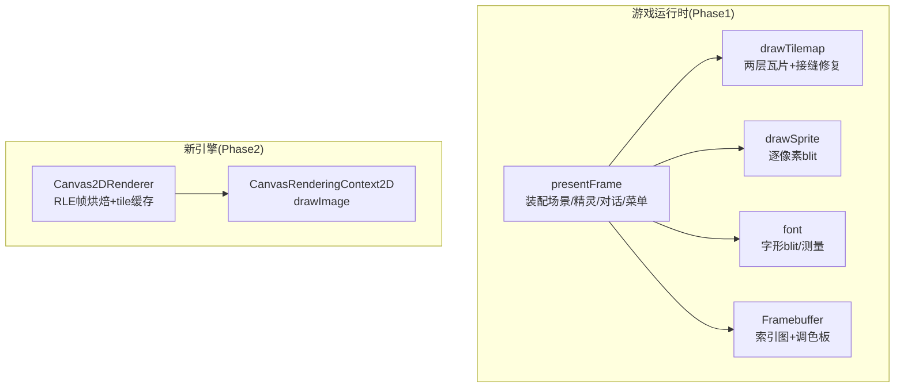
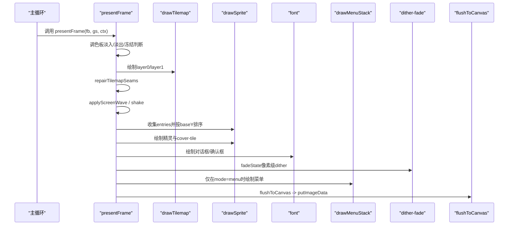
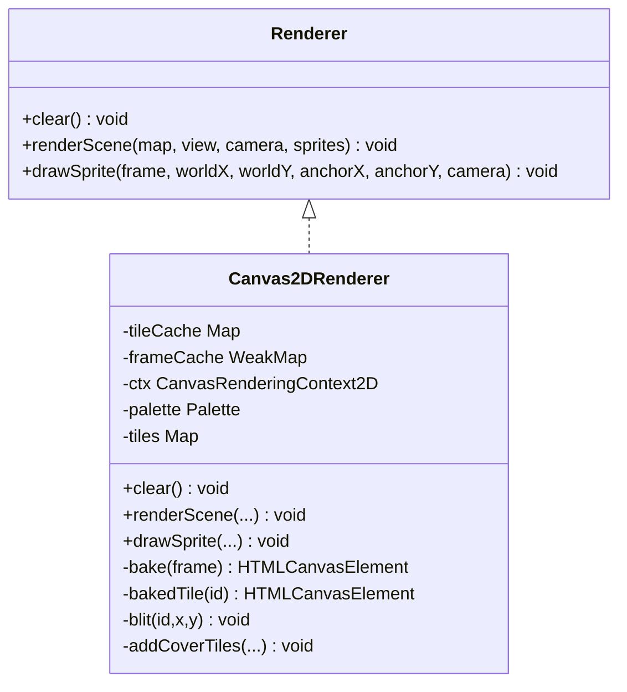
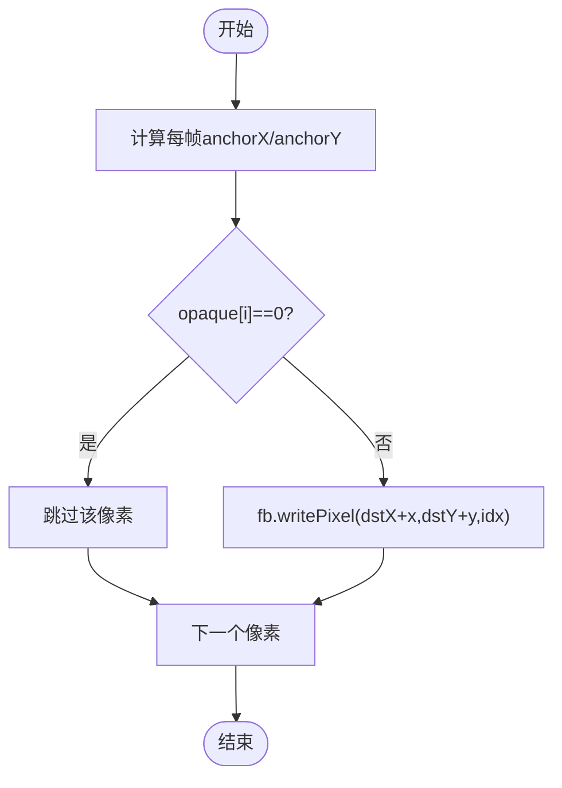
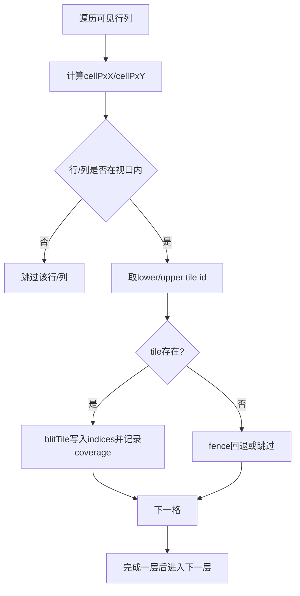
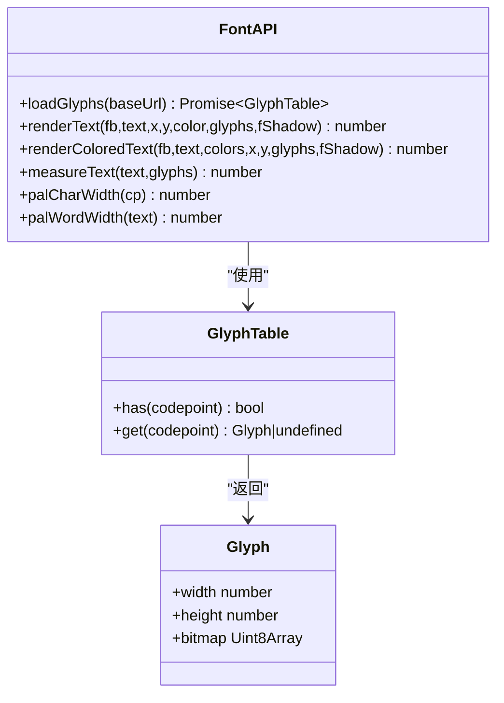
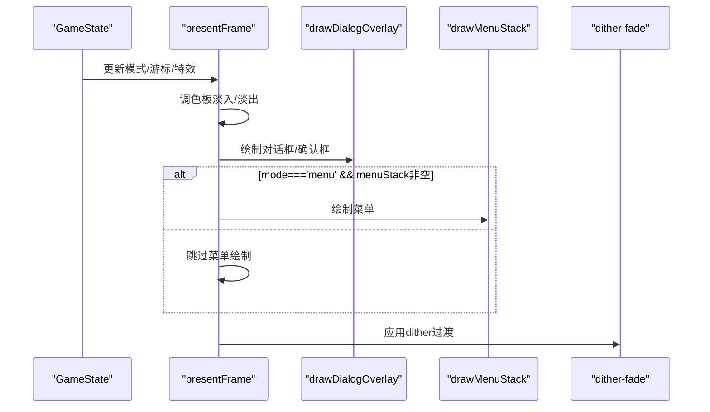
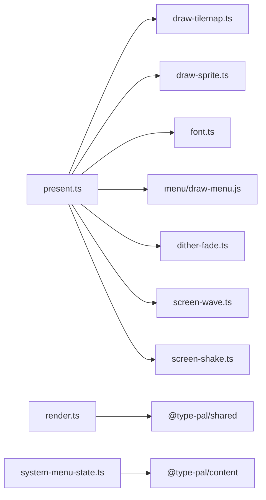

# 表现层系统

<cite>
**本文引用的文件**   
- [present.ts](file://packages/game/src/present/present.ts)
- [draw-tilemap.ts](file://packages/game/src/present/draw-tilemap.ts)
- [draw-sprite.ts](file://packages/game/src/present/draw-sprite.ts)
- [font.ts](file://packages/game/src/present/font.ts)
- [render.ts](file://packages/reforge/src/render.ts)
- [system-menu-state.ts](file://packages/reforge/src/system-menu-state.ts)
</cite>

## 目录
1. [简介](#简介)
2. [项目结构](#项目结构)
3. [核心组件](#核心组件)
4. [架构总览](#架构总览)
5. [详细组件分析](#详细组件分析)
6. [依赖关系分析](#依赖关系分析)
7. [性能与优化](#性能与优化)
8. [故障排查指南](#故障排查指南)
9. [结论](#结论)
10. [附录](#附录)

## 简介
本技术文档聚焦于表现层系统的实现，围绕 Canvas 2D 渲染引擎、精灵绘制优化、地图瓦片渲染、字体渲染系统、UI 组件（对话框、菜单、动画与转场）、渲染管线优化（批量绘制、离屏缓冲、视口裁剪）以及响应式适配、跨浏览器兼容与性能调优策略展开。同时提供自定义渲染效果的扩展方法与调试工具使用指南，帮助读者快速理解并高效扩展该系统。

## 项目结构
本项目包含两套运行时代码：
- 第一阶段（game 包）：以 sdlpal 为真值参考的忠实还原，Canvas 2D 通过帧缓冲 + putImageData 输出到屏幕。
- 第二阶段（reforge 包）：全新 Canvas 2D 渲染器，采用 RLE 帧烘焙与 tile 缓存，按 Y 深度排序与 cover-tile 遮挡。

图表来源
- [present.ts:166-686](file://packages/game/src/present/present.ts#L166-L686)
- [draw-tilemap.ts:92-151](file://packages/game/src/present/draw-tilemap.ts#L92-L151)
- [draw-sprite.ts:39-54](file://packages/game/src/present/draw-sprite.ts#L39-L54)
- [font.ts:105-131](file://packages/game/src/present/font.ts#L105-L131)
- [render.ts:87-165](file://packages/reforge/src/render.ts#L87-L165)

章节来源
- [present.ts:166-686](file://packages/game/src/present/present.ts#L166-L686)
- [render.ts:87-165](file://packages/reforge/src/render.ts#L87-L165)

## 核心组件
- 帧缓冲与主循环
  - Framebuffer 维护 Uint8Array 索引图，最终经 toImageData(palette) 转换为 ImageData 并通过 putImageData 输出。
  - presentFrame 负责一帧装配：调色板淡入/淡出、特效（水波、震屏）、场景图层、精灵与覆盖瓦片、对话框、菜单、fadeState 像素级 dither 过渡等。
- 地图瓦片渲染
  - drawTilemap 分两层绘制（底层 layer0、顶层 layer1），严格遵循 sdlpal 坐标公式与 fence 填充；repairTilemapSeams 修复透明接缝导致的漏黑。
- 精灵绘制
  - drawSprite 基于 SpriteImage 的 opaque mask 进行逐像素写入，避免 palette-0 被误判为透明。
- 字体渲染
  - font.ts 提供 GlyphTable 接口与 loadGlyphs 加载 Unifont CN BDF 预处理的 glyphs.json；支持单色/多色文本、阴影、测量宽度。
- 新引擎渲染器
  - Canvas2DRenderer 将 RLE 帧烘焙为 HTMLCanvasElement，缓存 tile 与 frame，按 baseY 排序后 drawImage 批量绘制，减少 CPU 位图操作。

章节来源
- [present.ts:166-686](file://packages/game/src/present/present.ts#L166-L686)
- [draw-tilemap.ts:92-151](file://packages/game/src/present/draw-tilemap.ts#L92-L151)
- [draw-sprite.ts:39-54](file://packages/game/src/present/draw-sprite.ts#L39-L54)
- [font.ts:44-62](file://packages/game/src/present/font.ts#L44-L62)
- [render.ts:87-165](file://packages/reforge/src/render.ts#L87-L165)

## 架构总览
下图展示从 GameState 到最终屏幕输出的关键路径，包括特效、遮罩、覆盖瓦片与 UI 叠加顺序。

图表来源
- [present.ts:166-686](file://packages/game/src/present/present.ts#L166-L686)
- [draw-tilemap.ts:92-151](file://packages/game/src/present/draw-tilemap.ts#L92-L151)
- [draw-sprite.ts:39-54](file://packages/game/src/present/draw-sprite.ts#L39-L54)
- [font.ts:105-131](file://packages/game/src/present/font.ts#L105-L131)

## 详细组件分析

### Canvas 2D 渲染引擎（新引擎）
Canvas2DRenderer 实现了 Renderer 接口，核心流程：
- 资源烘焙：bakeFrame 将 RLEFrame 转为 HTMLCanvasElement；frameCache/tileCache 复用结果。
- 场景渲染：renderScene 先画基底两层，再收集精灵与 cover-tile，按 baseY 升序稳定排序后绘制。
- 直接绘制：drawSprite 用于独立精灵绘制（如 UI 元素）。

图表来源
- [render.ts:73-85](file://packages/reforge/src/render.ts#L73-L85)
- [render.ts:87-165](file://packages/reforge/src/render.ts#L87-L165)

章节来源
- [render.ts:87-165](file://packages/reforge/src/render.ts#L87-L165)

### 精灵绘制优化
- 锚点与对齐：toSpriteImages 为每帧计算 anchorX=width/2、anchorY=height，确保脚底中心对齐，不同高度帧不偏移。
- 透明度处理：opaque mask 决定写入，避免 palette-0 被误判为透明。
- 批量绘制：在 present.ts 中统一收集 entries，按 baseY 排序后一次性绘制，减少状态切换与分支。

图表来源
- [draw-sprite.ts:26-37](file://packages/game/src/present/draw-sprite.ts#L26-L37)
- [draw-sprite.ts:39-54](file://packages/game/src/present/draw-sprite.ts#L39-L54)
- [present.ts:298-589](file://packages/game/src/present/present.ts#L298-L589)

章节来源
- [draw-sprite.ts:26-37](file://packages/game/src/present/draw-sprite.ts#L26-L37)
- [draw-sprite.ts:39-54](file://packages/game/src/present/draw-sprite.ts#L39-L54)
- [present.ts:298-589](file://packages/game/src/present/present.ts#L298-L589)

### 地图瓦片渲染
- 双层绘制：layer0 先画，layer1 后画，保证家具/墙体在精灵之上形成遮挡。
- 坐标公式：严格遵循 sdlpal map.c 的 row/col 像素映射与 fence 填充。
- 接缝修复：coverage 标记实际写入像素，对未覆盖区域做邻域扩散填充，复现原版“缝里是邻接地形”的效果。

图表来源
- [draw-tilemap.ts:92-151](file://packages/game/src/present/draw-tilemap.ts#L92-L151)
- [draw-tilemap.ts:169-208](file://packages/game/src/present/draw-tilemap.ts#L169-L208)

章节来源
- [draw-tilemap.ts:92-151](file://packages/game/src/present/draw-tilemap.ts#L92-L151)
- [draw-tilemap.ts:169-208](file://packages/game/src/present/draw-tilemap.ts#L169-L208)

### 字体渲染系统
- 字形表：loadGlyphs 异步加载 glyphs.json，构建 has/get 接口。
- 文本绘制：renderText/renderColoredText 支持单色/多色与三重阴影；measureText 用于布局测量；palCharWidth/palWordWidth 近似 sdlpal 字宽规则。
- 兼容性：glyphs 未加载时使用 tofu 占位框，避免崩溃。

图表来源
- [font.ts:44-62](file://packages/game/src/present/font.ts#L44-L62)
- [font.ts:105-131](file://packages/game/src/present/font.ts#L105-L131)
- [font.ts:140-165](file://packages/game/src/present/font.ts#L140-L165)
- [font.ts:174-198](file://packages/game/src/present/font.ts#L174-L198)

章节来源
- [font.ts:44-62](file://packages/game/src/present/font.ts#L44-L62)
- [font.ts:105-131](file://packages/game/src/present/font.ts#L105-L131)
- [font.ts:140-165](file://packages/game/src/present/font.ts#L140-L165)
- [font.ts:174-198](file://packages/game/src/present/font.ts#L174-L198)

### UI 组件系统
- 对话框系统
  - drawDialogOverlay 负责绘制当前与保留的对话框，并在等待确认时绘制确认框。
  - 对话框颜色闪烁：applyDialogIconPaletteShift 模拟 sdlpal 箭头图标 palette 轮转效果。
- 菜单组件
  - drawMenuStack 仅在 mode='menu' 且 menuStack 非空时绘制，避免脚本执行期间遮挡对话。
  - reforge 的系统菜单状态机 system-menu-state.ts 定义 save/load/music/sound/quit 项与交互逻辑。
- 动画与转场
  - 调色板淡入/淡出：stepPaletteFade 驱动 gs.palette.colors 渐变。
  - 像素级 dither 过渡：fadeState 累积逼近 backupPixels，实现平滑淡入/淡出。
  - 屏幕特效：applyScreenWave 与 applyScreenShake 分别实现水波与震屏。

图表来源
- [present.ts:120-136](file://packages/game/src/present/present.ts#L120-L136)
- [present.ts:655-675](file://packages/game/src/present/present.ts#L655-L675)
- [present.ts:628-643](file://packages/game/src/present/present.ts#L628-L643)
- [system-menu-state.ts:1-29](file://packages/reforge/src/system-menu-state.ts#L1-L29)

章节来源
- [present.ts:120-136](file://packages/game/src/present/present.ts#L120-L136)
- [present.ts:655-675](file://packages/game/src/present/present.ts#L655-L675)
- [present.ts:628-643](file://packages/game/src/present/present.ts#L628-L643)
- [system-menu-state.ts:1-29](file://packages/reforge/src/system-menu-state.ts#L1-L29)

### 渲染管线优化
- 批量绘制与排序
  - present.ts 将所有精灵与 cover-tile 收集为 DrawEntry，按 baseY 稳定排序后统一绘制，减少状态切换与分支。
- 离屏缓冲
  - Phase1 使用 Framebuffer 作为离屏缓冲，最终一次 putImageData 输出；Phase2 使用 HTMLCanvasElement 缓存 tile/frame，减少重复解码与 blit。
- 视口裁剪
  - drawTilemap 对整行/整列进行视口外快速剔除；精灵绘制前进行屏外剔除，避免无效覆盖计算。
- 覆盖瓦片
  - addCoverTileEntries 精确计算会遮挡精灵的高瓦片，参与同一排序队列，确保正确遮挡。

章节来源
- [present.ts:298-589](file://packages/game/src/present/present.ts#L298-L589)
- [draw-tilemap.ts:92-151](file://packages/game/src/present/draw-tilemap.ts#L92-L151)
- [render.ts:127-165](file://packages/reforge/src/render.ts#L127-L165)

### 响应式设计适配与跨浏览器兼容
- 分辨率设置
  - 通过 display-scale 工具与 Canvas 尺寸控制实现缩放；present.ts 注释强调单位与相机语义与 sdlpal 一致。
- 浏览器差异
  - Canvas 2D 上下文可用性检查（reforge render.ts bakeFrame 抛出错误）；putImageData 兼容性良好，注意 ImageData 大小限制。
- 性能建议
  - 优先使用 tile/frame 缓存；减少每帧对象分配（如 seamCoverageBuf 复用）；按需绘制 UI 层。

章节来源
- [render.ts:25-45](file://packages/reforge/src/render.ts#L25-L45)
- [present.ts:138-152](file://packages/game/src/present/present.ts#L138-L152)

### 自定义渲染效果扩展方法
- 新增特效通道
  - 在 present.ts 中插入新的 applyXXX 函数（如水波/震屏），在合适阶段调用（例如 sprite 绘制前后）。
- 自定义覆盖层
  - 在 drawDialogOverlay 之后添加自定义 UI 层，保持最上层绘制顺序。
- 新渲染后端
  - 实现 Renderer 接口（如 WebGL2），替换 Canvas2DRenderer，保持 clear/renderScene/drawSprite 契约。

章节来源
- [present.ts:292-296](file://packages/game/src/present/present.ts#L292-L296)
- [present.ts:683-685](file://packages/game/src/present/present.ts#L683-L685)
- [render.ts:73-85](file://packages/reforge/src/render.ts#L73-L85)

### 调试工具使用指南
- 开发面板
  - tools-panel 提供只读信息、小地图、设置、历史对话、速通计时器等；便于定位表现问题。
- 帧缓冲可视化
  - 通过 fb.indices 与 palette 生成图像，辅助比对像素级差异。
- 单元测试
  - present.test.ts 验证菜单/对话框绘制路径；draw-battle-ui.test.ts 验证战斗 UI 写入区域。

章节来源
- [present.test.ts:79-116](file://packages/game/src/present/present.test.ts#L79-L116)
- [present.ts:688-695](file://packages/game/src/present/present.ts#L688-L695)

## 依赖关系分析
- present.ts 依赖 draw-tilemap、draw-sprite、font、dither-fade、screen-wave、screen-shake、dialog-box、menu/draw-menu、follower-render 等模块。
- reforge render.ts 依赖 shared 类型（Palette、RleFrame、Tilemap），实现 Renderer 接口。
- system-menu-state.ts 提供纯逻辑状态机，供 UI 层消费。

图表来源
- [present.ts:1-31](file://packages/game/src/present/present.ts#L1-L31)
- [render.ts:10-11](file://packages/reforge/src/render.ts#L10-L11)
- [system-menu-state.ts:4-4](file://packages/reforge/src/system-menu-state.ts#L4-L4)

章节来源
- [present.ts:1-31](file://packages/game/src/present/present.ts#L1-L31)
- [render.ts:10-11](file://packages/reforge/src/render.ts#L10-L11)
- [system-menu-state.ts:1-29](file://packages/reforge/src/system-menu-state.ts#L1-L29)

## 性能与优化
- 资源缓存
  - Phase2 使用 tileCache/frameCache 减少重复解码与 blit；Phase1 复用 seamCoverageBuf 避免每帧分配。
- 批量绘制
  - 统一 entries 排序后绘制，降低状态切换与分支开销。
- 视口裁剪
  - 行/列级快速剔除与精灵屏外剔除，减少无效绘制。
- 像素级过渡
  - dither fade 时间驱动，慢帧自动追赶步数，保证视觉一致性。
- 内存管理
  - WeakMap 用于 frame 缓存，避免长期持有大对象导致内存泄漏。

[本节为通用指导，无需具体文件引用]

## 故障排查指南
- 黑色三角/缝隙漏黑
  - 原因：fb.clear() 到 index 0 暴露透明像素；修复：repairTilemapSeams 用 coverage 邻域扩散填充。
- 精灵半透明异常
  - 原因：palette-0 被误判为透明；修复：使用 opaque mask 判定写入。
- 菜单遮挡对话
  - 原因：非 menu 模式仍绘制菜单；修复：仅在 mode='menu' 时绘制菜单。
- 跟随者角色错乱
  - 原因：跟随者使用了队长 sprite；修复：按各自 roleId 查 npcSpriteFrames。
- 字体显示为 tofu
  - 原因：glyphs 未加载；修复：确保 loadGlyphs 成功注入 GlyphTable。

章节来源
- [draw-tilemap.ts:169-208](file://packages/game/src/present/draw-tilemap.ts#L169-L208)
- [draw-sprite.ts:39-54](file://packages/game/src/present/draw-sprite.ts#L39-L54)
- [present.ts:655-675](file://packages/game/src/present/present.ts#L655-L675)
- [present.ts:424-433](file://packages/game/src/present/present.ts#L424-L433)
- [font.ts:44-62](file://packages/game/src/present/font.ts#L44-L62)

## 结论
表现层系统通过严格的 sdlpal 行为对齐与现代化渲染优化，实现了高保真与高性能的统一。Phase1 以帧缓冲为核心，Phase2 引入资源烘焙与缓存机制，显著提升绘制效率。UI 组件与特效系统在正确的绘制顺序下协同工作，确保视觉一致性与用户体验。未来可扩展更多渲染后端与自定义效果，同时借助调试工具持续优化。

[本节为总结性内容，无需具体文件引用]

## 附录
- API 参考
  - presentFrame：主装配入口，参数 fb/gs/ctx/advanceEffects。
  - flushToCanvas：将 Framebuffer 输出到 Canvas。
  - Canvas2DRenderer：Renderer 接口的 Canvas 2D 实现。
  - font.ts：字体渲染与测量 API。
- 配置与数据
  - glyphs.json：字形数据源。
  - tileset/bitmap：瓦片与精灵资源。

[本节为补充说明，无需具体文件引用]