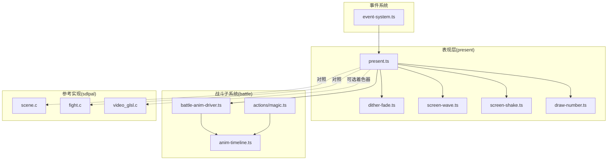
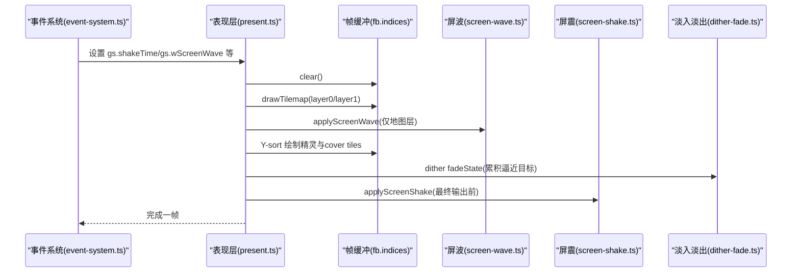
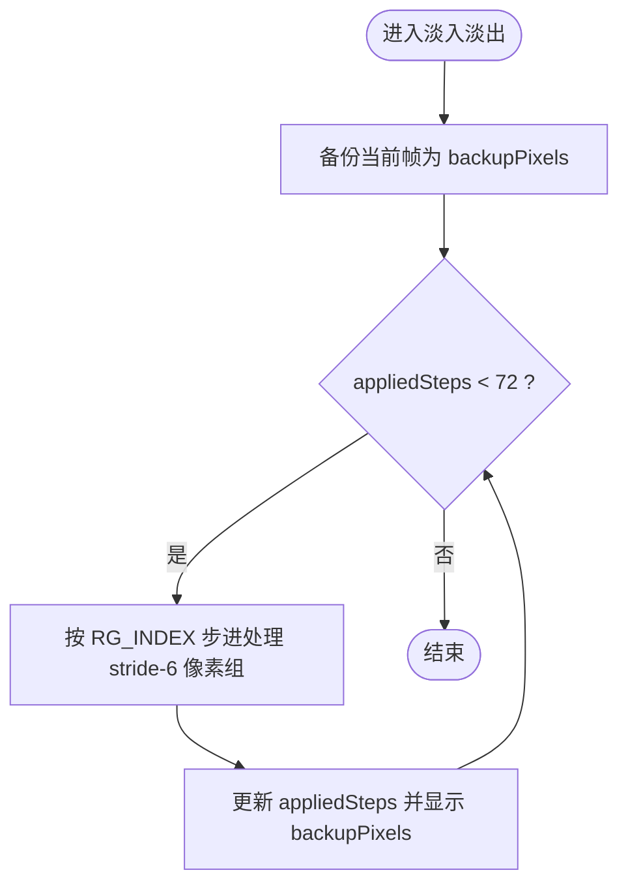
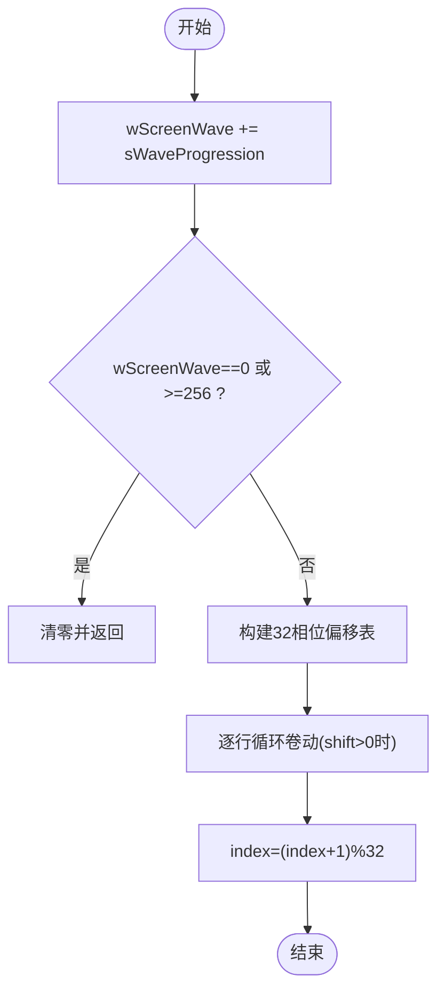
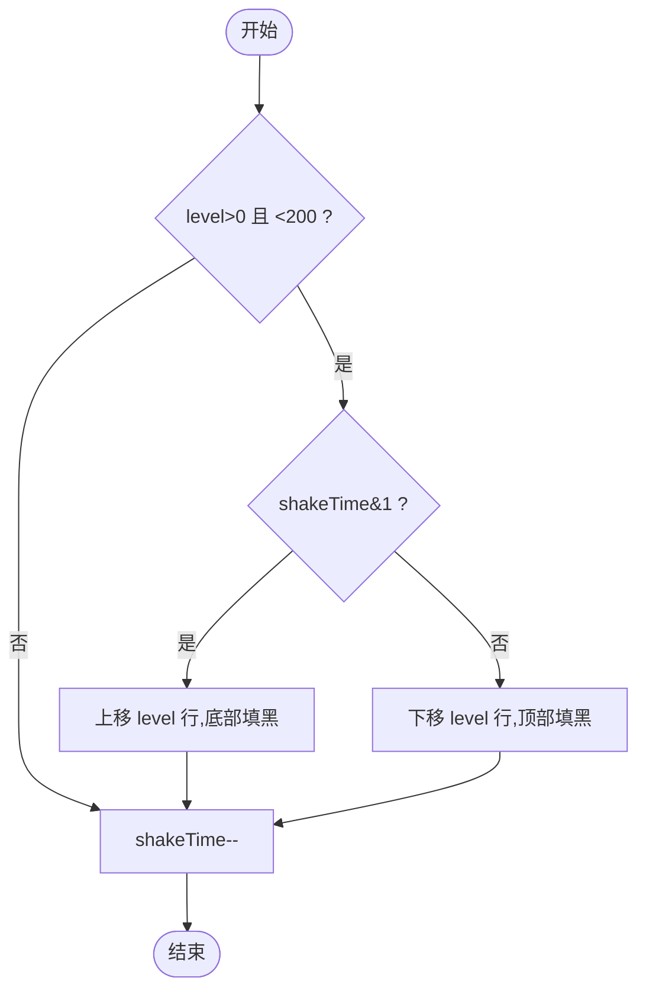
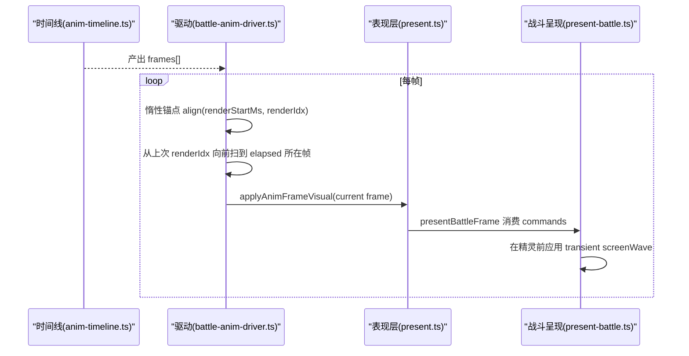
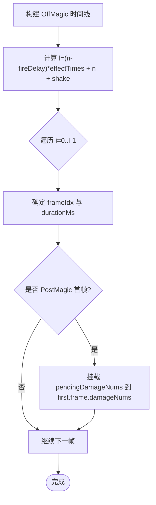
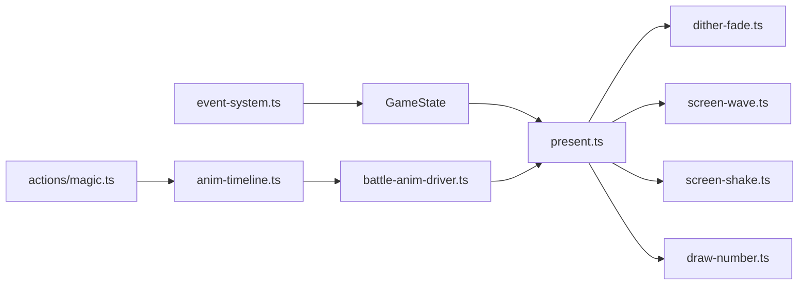

# 视觉效果系统

<cite>
**本文引用的文件**   
- [present.ts](file://packages/game/src/present/present.ts)
- [dither-fade.ts](file://packages/game/src/present/dither-fade.ts)
- [screen-wave.ts](file://packages/game/src/present/screen-wave.ts)
- [screen-shake.ts](file://packages/game/src/present/screen-shake.ts)
- [draw-number.ts](file://packages/game/src/present/draw-number.ts)
- [anim-timeline.ts](file://packages/game/src/core/battle/anim-timeline.ts)
- [battle-anim-driver.ts](file://packages/game/src/core/battle/battle-anim-driver.ts)
- [magic.ts](file://packages/game/src/core/battle/actions/magic.ts)
- [event-system.ts](file://packages/game/src/core/event-system.ts)
- [scene.c](file://reference/sdlpal/scene.c)
- [fight.c](file://reference/sdlpal/fight.c)
- [video_glsl.c](file://reference/sdlpal/video_glsl.c)
</cite>

## 目录
1. [简介](#简介)
2. [项目结构](#项目结构)
3. [核心组件](#核心组件)
4. [架构总览](#架构总览)
5. [详细组件分析](#详细组件分析)
6. [依赖关系分析](#依赖关系分析)
7. [性能考量](#性能考量)
8. [故障排查指南](#故障排查指南)
9. [结论](#结论)
10. [附录](#附录)

## 简介
本技术文档聚焦于“视觉效果系统”，覆盖转场与屏幕特效、战斗特效、动画时间线与帧同步、以及性能优化策略。目标是帮助开发者理解并扩展：抖动淡入淡出算法、屏幕震动效果、波纹扭曲特效；伤害数字动画、技能特效渲染、粒子效果系统；动画时间线管理、插值算法、帧同步机制；特效池复用、批量渲染、硬件加速等。

## 项目结构
本仓库采用多包结构，第一阶段（忠实还原）以 TypeScript 重写 sdlpal 行为，第二阶段为全新引擎。视觉相关代码集中在 packages/game 的 present 层与 battle 子系统：
- present 层负责像素缓冲绘制、调色板淡入淡出、屏幕波动与震动、对话框与菜单叠加。
- battle 子系统提供战斗动画时间线构建与驱动、法术动作装配、伤害数字挂载点。
- event-system 将脚本指令映射到全局状态（如屏震、夜间调色）。
- reference/sdlpal 作为真值参考，用于对齐原版时序与算法。



图表来源
- [present.ts:166-686](file://packages/game/src/present/present.ts#L166-L686)
- [dither-fade.ts:1-45](file://packages/game/src/present/dither-fade.ts#L1-L45)
- [screen-wave.ts:1-72](file://packages/game/src/present/screen-wave.ts#L1-L72)
- [screen-shake.ts:1-55](file://packages/game/src/present/screen-shake.ts#L1-L55)
- [draw-number.ts:1-110](file://packages/game/src/present/draw-number.ts#L1-L110)
- [anim-timeline.ts:1-800](file://packages/game/src/core/battle/anim-timeline.ts#L1-L800)
- [battle-anim-driver.ts:173-204](file://packages/game/src/core/battle/battle-anim-driver.ts#L173-L204)
- [magic.ts:428-645](file://packages/game/src/core/battle/actions/magic.ts#L428-L645)
- [event-system.ts:3886-3910](file://packages/game/src/core/event-system.ts#L3886-L3910)
- [scene.c:373-447](file://reference/sdlpal/scene.c#L373-L447)
- [fight.c:2861-2909](file://reference/sdlpal/fight.c#L2861-L2909)
- [video_glsl.c:1166-1191](file://reference/sdlpal/video_glsl.c#L1166-L1191)

章节来源
- [README.md:1-139](file://README.md#L1-L139)

## 核心组件
- 抖动淡入淡出：基于 nibble-dither 的 72 step 平滑过渡，复用于场景切换与战斗开场淡入。
- 屏幕波动：按行循环卷动，形成水波/热浪荡漾感，仅作用于地图层，精灵不受影响。
- 屏幕震动：垂直方向奇偶交替位移 + 黑条填充，模拟冲击反馈。
- 伤害数字：基于 sprite 的数字绘制，支持颜色与对齐模式，精确对齐 sdlpal 行为。
- 战斗动画时间线：纯函数构建 BattleAnimFrame[]，由驱动按 wall-clock 推进，保证逻辑与视觉一致。
- 事件系统对接：脚本指令设置全局特效标志（如屏震），present 层消费并应用。

章节来源
- [dither-fade.ts:1-45](file://packages/game/src/present/dither-fade.ts#L1-L45)
- [screen-wave.ts:1-72](file://packages/game/src/present/screen-wave.ts#L1-L72)
- [screen-shake.ts:1-55](file://packages/game/src/present/screen-shake.ts#L1-L55)
- [draw-number.ts:1-110](file://packages/game/src/present/draw-number.ts#L1-L110)
- [anim-timeline.ts:1-800](file://packages/game/src/core/battle/anim-timeline.ts#L1-L800)
- [battle-anim-driver.ts:173-204](file://packages/game/src/core/battle/battle-anim-driver.ts#L173-L204)
- [event-system.ts:3886-3910](file://packages/game/src/core/event-system.ts#L3886-L3910)

## 架构总览
整体渲染管线遵循 sdlpal 顺序：先绘制两层 tilemap，再施加屏幕波动，随后 Y-sort 绘制精灵与 cover tiles，最后叠加对话框、菜单与 fadeState。战斗路径在 present-battle.ts 中委托 BattlePresent.draw，并在背景绘制后、精灵之前应用屏波，确保角色与特效不被横向撕裂。



图表来源
- [present.ts:166-686](file://packages/game/src/present/present.ts#L166-L686)
- [screen-wave.ts:1-72](file://packages/game/src/present/screen-wave.ts#L1-L72)
- [screen-shake.ts:1-55](file://packages/game/src/present/screen-shake.ts#L1-L55)
- [dither-fade.ts:1-45](file://packages/game/src/present/dither-fade.ts#L1-L45)
- [event-system.ts:3886-3910](file://packages/game/src/core/event-system.ts#L3886-L3910)

## 详细组件分析

### 抖动淡入淡出算法
- 原理：每步处理 stride-6 像素组，outer 迭代控制低 nibble 向 target 逼近，高 nibble 立即取 target，形成平滑过渡。
- 使用位置：场景切换淡入淡出、战斗开场淡入。
- 关键参数：DITHER_TOTAL_STEPS=72，RG_INDEX 决定 inner 处理相位。
- 复杂度：O(N)，N 为像素数；内存复用 backupPixels 避免频繁分配。



图表来源
- [dither-fade.ts:1-45](file://packages/game/src/present/dither-fade.ts#L1-L45)
- [present.ts:606-643](file://packages/game/src/present/present.ts#L606-L643)

章节来源
- [dither-fade.ts:1-45](file://packages/game/src/present/dither-fade.ts#L1-L45)
- [present.ts:606-643](file://packages/game/src/present/present.ts#L606-L643)

### 屏幕波动特效
- 原理：逐扫描线计算 32 相位偏移表，对每行进行左移循环卷动，index 每帧 +1 产生滚动波形。
- 作用范围：仅在 tilemap 绘制之后、精灵绘制之前调用，确保精灵不受扭曲。
- 生命周期：wScreenWave 每帧累加 sWaveProgression，越界清零自动关闭。



图表来源
- [screen-wave.ts:1-72](file://packages/game/src/present/screen-wave.ts#L1-L72)
- [scene.c:373-447](file://reference/sdlpal/scene.c#L373-L447)
- [present.ts:292-296](file://packages/game/src/present/present.ts#L292-L296)

章节来源
- [screen-wave.ts:1-72](file://packages/game/src/present/screen-wave.ts#L1-L72)
- [scene.c:373-447](file://reference/sdlpal/scene.c#L373-L447)
- [present.ts:292-296](file://packages/game/src/present/present.ts#L292-L296)

### 屏幕震动效果
- 原理：奇偶帧整幅垂直平移，顶部/底部用黑色填充，shakeTime 自减至 0 停止。
- 触发方式：脚本指令 OP_SHAKE_SCREEN 写入 shakeTime/shakeLevel，present 层消费。
- 适用场景：大世界/cutscene 冲击反馈；战斗内通过 anim frame.shake 在 present-battle.ts 末尾应用。



图表来源
- [screen-shake.ts:1-55](file://packages/game/src/present/screen-shake.ts#L1-L55)
- [event-system.ts:3886-3910](file://packages/game/src/core/event-system.ts#L3886-L3910)
- [present.ts:677-685](file://packages/game/src/present/present.ts#L677-L685)

章节来源
- [screen-shake.ts:1-55](file://packages/game/src/present/screen-shake.ts#L1-L55)
- [event-system.ts:3886-3910](file://packages/game/src/core/event-system.ts#L3886-L3910)
- [present.ts:677-685](file://packages/game/src/present/present.ts#L677-L685)

### 战斗特效系统
- 伤害数字动画：基于 sprite 的数字绘制，支持 yellow/blue/cyan 颜色与 left/mid/right 对齐，R-to-L blit。
- 技能特效渲染：PreMagic/OffMagic/PostMagic 三段式时间线，overlay kind='effect' 挂 lpEffectSprite 帧，落点按公式计算。
- 粒子效果系统：当前以 lpEffectSprite 帧序列为主，可视为轻量粒子；未来可扩展 GPU 粒子。

```mermaid
classDiagram
class BattleAnimFrame {
+number durationMs
+FighterDelta[] fighters
+Overlay overlay
+DamageNum damageNum
+DamageNum[] damageNums
+number sound
+boolean updateGesture
+number screenWave
}
class Overlay {
+string kind
+number spriteChunk
+number frameIdx
+number x
+number y
}
class DamageNum {
+{kind : string,idx : number} target
+number value
+string color
}
BattleAnimFrame --> Overlay : "包含"
BattleAnimFrame --> DamageNum : "包含"
```

图表来源
- [anim-timeline.ts:1-800](file://packages/game/src/core/battle/anim-timeline.ts#L1-L800)
- [draw-number.ts:1-110](file://packages/game/src/present/draw-number.ts#L1-L110)

章节来源
- [anim-timeline.ts:1-800](file://packages/game/src/core/battle/anim-timeline.ts#L1-L800)
- [draw-number.ts:1-110](file://packages/game/src/present/draw-number.ts#L1-L110)

### 动画时间线管理与帧同步
- 时间线构建：纯函数 build*Timeline 产出 BattleAnimFrame[]，不 mutate state。
- 驱动推进：stepBattleAnimRender 根据 nowMs 惰性锚点对齐 renderIdx，不回退、不落后逻辑 idx。
- 帧时长：BATTLE_FRAME_TIME=40ms，delayMs(frames)=frames×40。
- 法术时间线：OffMagic 总帧 l=(n-fireDelay)*effectTimes + n + shake，每帧 durationMs=(speed+5)*10。



图表来源
- [anim-timeline.ts:1-800](file://packages/game/src/core/battle/anim-timeline.ts#L1-L800)
- [battle-anim-driver.ts:173-204](file://packages/game/src/core/battle/battle-anim-driver.ts#L173-L204)
- [present.ts:763-776](file://packages/game/src/present/present.ts#L763-L776)

章节来源
- [anim-timeline.ts:1-800](file://packages/game/src/core/battle/anim-timeline.ts#L1-L800)
- [battle-anim-driver.ts:173-204](file://packages/game/src/core/battle/battle-anim-driver.ts#L173-L204)
- [present.ts:763-776](file://packages/game/src/present/present.ts#L763-L776)

### 法术时间与伤害挂载
- OffMagic 时间线：按 magic.type 分支 normal/attackAll/attackWhole/attackField，计算 effectTimes 与 shake。
- 伤害挂载：未建动画链则即时 emit showDamageNum；有链则挂到 PostMagic 第一帧，确保命中后立即弹出。
- 吹飞 iBlow：全体受击方逐帧随机累加 x+=blow,y+=trunc(blow/2)，末帧复位 posOriginal。



图表来源
- [anim-timeline.ts:1-800](file://packages/game/src/core/battle/anim-timeline.ts#L1-L800)
- [magic.ts:428-645](file://packages/game/src/core/battle/actions/magic.ts#L428-L645)
- [fight.c:2861-2909](file://reference/sdlpal/fight.c#L2861-L2909)

章节来源
- [anim-timeline.ts:1-800](file://packages/game/src/core/battle/anim-timeline.ts#L1-L800)
- [magic.ts:428-645](file://packages/game/src/core/battle/actions/magic.ts#L428-L645)
- [fight.c:2861-2909](file://reference/sdlpal/fight.c#L2861-L2909)

## 依赖关系分析
- present.ts 依赖 dither-fade.ts、screen-wave.ts、screen-shake.ts、draw-number.ts 等原语。
- battle 子系统通过 anim-timeline.ts 构建帧序列，由 battle-anim-driver.ts 驱动，present.ts 消费命令并渲染。
- event-system.ts 将脚本指令映射到全局状态，present.ts 消费这些状态应用特效。
- 参考 sdlpal 源码用于对齐行为与边界条件。



图表来源
- [event-system.ts:3886-3910](file://packages/game/src/core/event-system.ts#L3886-L3910)
- [present.ts:166-686](file://packages/game/src/present/present.ts#L166-L686)
- [anim-timeline.ts:1-800](file://packages/game/src/core/battle/anim-timeline.ts#L1-L800)
- [battle-anim-driver.ts:173-204](file://packages/game/src/core/battle/battle-anim-driver.ts#L173-L204)
- [magic.ts:428-645](file://packages/game/src/core/battle/actions/magic.ts#L428-L645)

章节来源
- [event-system.ts:3886-3910](file://packages/game/src/core/event-system.ts#L3886-L3910)
- [present.ts:166-686](file://packages/game/src/present/present.ts#L166-L686)
- [anim-timeline.ts:1-800](file://packages/game/src/core/battle/anim-timeline.ts#L1-L800)
- [battle-anim-driver.ts:173-204](file://packages/game/src/core/battle/battle-anim-driver.ts#L173-L204)
- [magic.ts:428-645](file://packages/game/src/core/battle/actions/magic.ts#L428-L645)

## 性能考量
- 特效池复用：lpEffectSprite 帧序列复用 DATA.MKF chunk 10，减少重复解压与分配。
- 批量渲染：tilemap 双层全画 + cover tiles 重画，Y-sort 稳定排序，减少 overdraw。
- 硬件加速：参考 sdlpal video_glsl.c 的 GLSL 管线，可在浏览器端启用 WebGL 着色器以提升复杂特效性能。
- 计数器节流：fade-only 补帧时 advanceEffects=false，避免 wave/shake 计数过快导致拍频。

章节来源
- [anim-timeline.ts:1-800](file://packages/game/src/core/battle/anim-timeline.ts#L1-L800)
- [present.ts:166-686](file://packages/game/src/present/present.ts#L166-L686)
- [video_glsl.c:1166-1191](file://reference/sdlpal/video_glsl.c#L1166-L1191)

## 故障排查指南
- 屏波错位：确认 applyScreenWave 在精灵绘制之前调用，且 transient screenWave 在帧末恢复旧值。
- 屏震提前结束：检查 advanceEffects 传参，fade-only 补帧不应推进 shakeTime。
- 伤害数字时机：确认 attachDamageNumsToFirstFrame 挂载到 PostMagic 首帧，而非整条链结束后。
- 淡入淡出不生效：验证 backupPixels 已快照且 appliedSteps 正确推进，rgIndex 相位顺序无误。

章节来源
- [present.ts:292-296](file://packages/game/src/present/present.ts#L292-L296)
- [present.ts:677-685](file://packages/game/src/present/present.ts#L677-L685)
- [magic.ts:428-645](file://packages/game/src/core/battle/actions/magic.ts#L428-L645)
- [dither-fade.ts:1-45](file://packages/game/src/present/dither-fade.ts#L1-L45)

## 结论
本视觉效果系统以 sdlpal 为真值，严格对齐时序与算法，实现了抖动淡入淡出、屏幕波动与震动、战斗时间线与伤害数字等核心能力。通过纯函数时间线构建与惰性锚点驱动，保证了逻辑与视觉的一致性。未来可在 GPU 侧引入更多粒子与着色器特效，进一步提升表现力与性能。

## 附录
- 自定义开发接口建议：
  - 新增特效原语：在 present.ts 中增加独立模块（如 particle.ts），提供 applyXXX(indices, gs, advanceEffects)。
  - 时间线扩展：在 anim-timeline.ts 中新增 build*Timeline，定义 BattleAnimFrame 字段（如 overlays、particleBurst）。
  - 调试工具：利用 dev-panel.ts 注入 raw opcode 触发特效，快速验证行为。
- 调试工具使用指南：
  - 打开开发面板 → 特效(tab) → 输入 op0/1/2 默认值 → 点击按钮触发对应 opcode。
  - RNG 动画播放：选择 chunk、调色盘、速度，Space 中止。

章节来源
- [dev-panel.ts:1677-1902](file://packages/game/src/dev/dev-panel.ts#L1677-L1902)