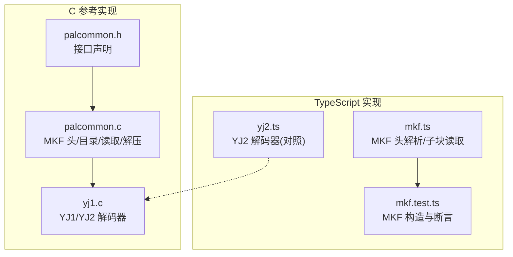
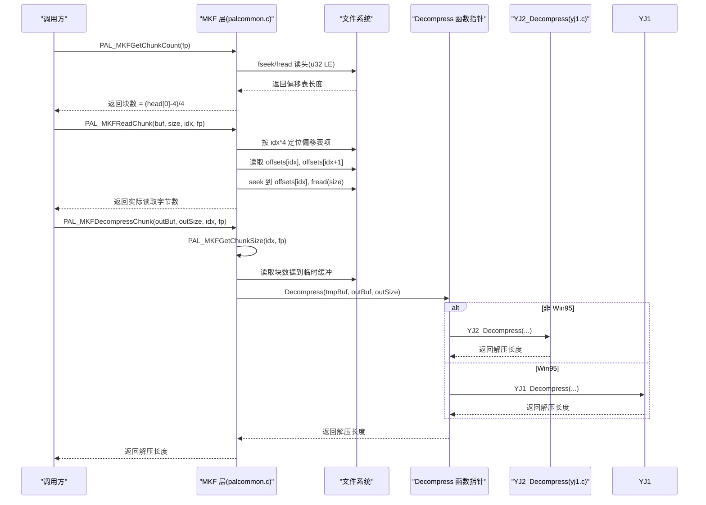
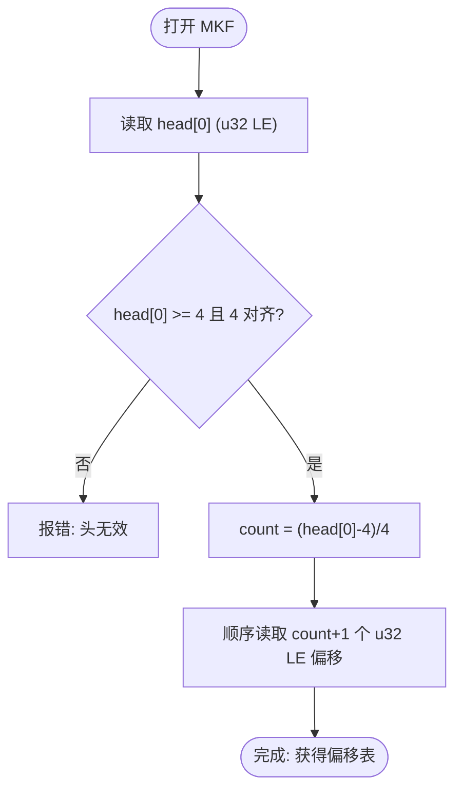
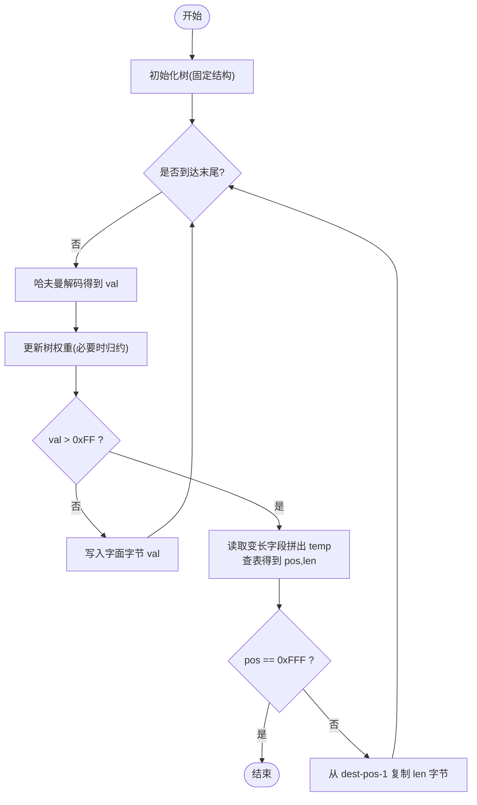
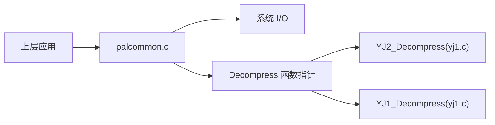
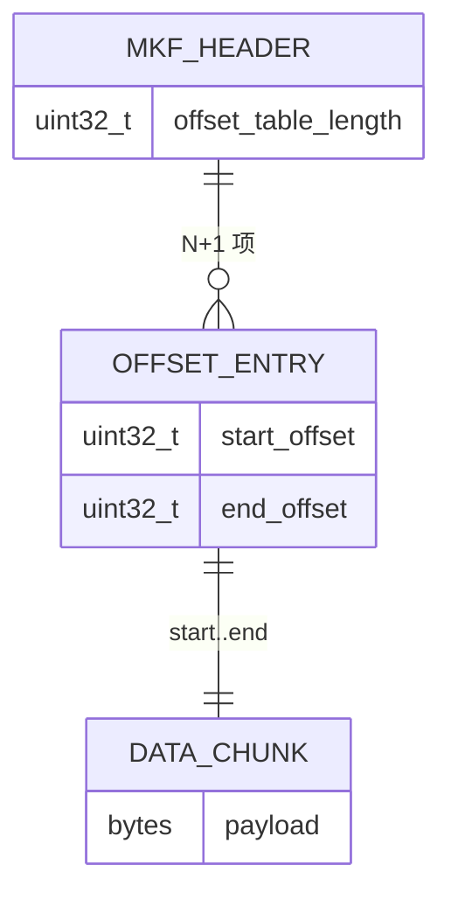

# MKF 归档解析器

<cite>
**本文引用的文件**   
- [palcommon.c](file://reference/sdlpal/palcommon.c)
- [palcommon.h](file://reference/sdlpal/palcommon.h)
- [yj1.c](file://reference/sdlpal/yj1.c)
- [mkf.ts](file://packages/shared/src/mkf.ts)
- [mkf.test.ts](file://packages/pal-extract/src/io/mkf.test.ts)
- [yj2.ts](file://packages/shared/src/yj2.ts)
</cite>

## 目录
1. [简介](#简介)
2. [项目结构](#项目结构)
3. [核心组件](#核心组件)
4. [架构总览](#架构总览)
5. [详细组件分析](#详细组件分析)
6. [依赖关系分析](#依赖关系分析)
7. [性能考量](#性能考量)
8. [故障排查指南](#故障排查指南)
9. [结论](#结论)
10. [附录](#附录)

## 简介
本文件面向需要理解与扩展“MKF 归档格式”的开发者，系统性梳理了：
- MKF 文件头结构与目录索引机制（偏移表、块数量计算）
- 压缩块头的识别与解压流程（YJ1/YJ2 两种算法）
- YJ2 自适应哈夫曼 + LZSS 回引的实现细节
- 错误处理与边界条件（越界、非法偏移、内存安全）
- 自定义归档格式的扩展方法与性能优化建议

该文档同时提供代码级图示与可追溯来源，便于读者快速定位实现。

## 项目结构
仓库中与 MKF 解析相关的核心位置如下：
- C 端参考实现（SDL Pal）：
  - palcommon.c/h：MKF 头/目录读取、块大小/内容读取、解压入口选择
  - yj1.c：YJ1/YJ2 解码器实现（含树构建、位流读取、LZSS 回引）
- TypeScript 侧轻量实现与测试：
  - packages/shared/src/mkf.ts：MKF 头解析与子块读取
  - packages/pal-extract/src/io/mkf.test.ts：MKF 构造用例与断言
  - packages/shared/src/yj2.ts：YJ2 解码器的 TS 对照实现



图表来源
- [palcommon.c:850-1137](file://reference/sdlpal/palcommon.c#L850-L1137)
- [palcommon.h:227-279](file://reference/sdlpal/palcommon.h#L227-L279)
- [yj1.c:238-436](file://reference/sdlpal/yj1.c#L238-L436)
- [mkf.ts:1-44](file://packages/shared/src/mkf.ts#L1-L44)
- [mkf.test.ts:1-39](file://packages/pal-extract/src/io/mkf.test.ts#L1-L39)
- [yj2.ts:136-200](file://packages/shared/src/yj2.ts#L136-L200)

章节来源
- [palcommon.c:850-1137](file://reference/sdlpal/palcommon.c#L850-L1137)
- [palcommon.h:227-279](file://reference/sdlpal/palcommon.h#L227-L279)
- [yj1.c:238-436](file://reference/sdlpal/yj1.c#L238-L436)
- [mkf.ts:1-44](file://packages/shared/src/mkf.ts#L1-L44)
- [mkf.test.ts:1-39](file://packages/pal-extract/src/io/mkf.test.ts#L1-L39)
- [yj2.ts:136-200](file://packages/shared/src/yj2.ts#L136-L200)

## 核心组件
- MKF 归档头与目录索引
  - 头为 N+1 个无符号 32 位小端整数，构成偏移表；第一个 u32 表示偏移表长度，据此推导子块数量
  - 通过偏移表可获取任意子块的起始与结束偏移，从而得到数据长度
- MKF 块读取与解压
  - 提供获取块数量、块大小、读取块数据、查询解压后大小、直接解压到缓冲等 API
  - 根据平台配置选择 YJ1 或 YJ2 解码器进行解压
- YJ2 压缩算法
  - 固定结构的自适应哈夫曼树 + LZSS 回引
  - 使用查表辅助解析变长字段，支持动态权重归约防止溢出

章节来源
- [palcommon.c:850-1137](file://reference/sdlpal/palcommon.c#L850-L1137)
- [palcommon.h:227-279](file://reference/sdlpal/palcommon.h#L227-L279)
- [yj1.c:238-436](file://reference/sdlpal/yj1.c#L238-L436)
- [mkf.ts:1-44](file://packages/shared/src/mkf.ts#L1-L44)
- [yj2.ts:136-200](file://packages/shared/src/yj2.ts#L136-L200)

## 架构总览
下图展示了从打开 MKF 到解压一个压缩块的完整调用链，以及 MKF 头/目录与数据区的关系。



图表来源
- [palcommon.c:850-1137](file://reference/sdlpal/palcommon.c#L850-L1137)
- [palcommon.h:260-279](file://reference/sdlpal/palcommon.h#L260-L279)
- [yj1.c:356-436](file://reference/sdlpal/yj1.c#L356-L436)

## 详细组件分析

### MKF 文件头与目录索引
- 头布局
  - 首项为 u32 LE，表示偏移表长度（包含自身），由此计算子块数量：count = (head[0] - 4) / 4
  - 随后是 count+1 个 u32 LE 偏移：offsets[i] 为第 i 个子块的起点，offsets[i+1] 为其终点
- 目录访问
  - 获取块数量：读取 head[0] 并转换字节序后计算
  - 获取块大小：读取 offsets[i] 与 offsets[i+1]，差值即长度
  - 读取块数据：seek 到 offsets[i]，按长度读取
- 校验与边界
  - 若 buffer 过小或 head[0] 不合法（如小于 4 或非 4 对齐），应拒绝解析
  - 对 index 越界、长度大于目标缓冲等情况返回错误码



图表来源
- [palcommon.c:850-884](file://reference/sdlpal/palcommon.c#L850-L884)
- [mkf.ts:12-30](file://packages/shared/src/mkf.ts#L12-L30)
- [mkf.test.ts:12-21](file://packages/pal-extract/src/io/mkf.test.ts#L12-L21)

章节来源
- [palcommon.c:850-884](file://reference/sdlpal/palcommon.c#L850-L884)
- [mkf.ts:12-30](file://packages/shared/src/mkf.ts#L12-L30)
- [mkf.test.ts:12-21](file://packages/pal-extract/src/io/mkf.test.ts#L12-L21)

### 块读取与解压流程
- 块大小查询
  - 先验证块索引有效，再读取相邻两个偏移，计算差值
- 块数据读取
  - 校验参数有效性、索引范围、缓冲区容量
  - seek 到块起点并按长度读取
- 解压入口
  - 先读取块数据到临时缓冲，再调用全局函数指针 Decompress
  - 在非 Win95 模式下，Decompress 指向 YJ2_Decompress；Win95 模式指向 YJ1_Decompress
- 解压前尺寸探测
  - 针对压缩块，先读取块头以获取 UncompressedLength，用于分配输出缓冲

```mermaid
sequenceDiagram
participant U as "上层"
participant M as "MKF 层"
participant F as "文件"
participant D as "Decompress"
U->>M : PAL_MKFGetChunkSize(i)
M->>F : seek 4*i; read off_i, off_{i+1}
M-->>U : off_{i+1}-off_i
U->>M : PAL_MKFReadChunk(buf, sz, i, fp)
M->>F : seek off_i; fread(sz)
M-->>U : 返回读取长度
U->>M : PAL_MKFGetDecompressedSize(i, fp)
M->>F : seek off_i; 读取块头
M-->>U : 返回 UncompressedLength
U->>M : PAL_MKFDecompressChunk(out, outSz, i, fp)
M->>M : 读取块数据到 tmp
M->>D : Decompress(tmp, out, outSz)
D-->>M : 返回解压长度
M-->>U : 返回解压长度
```

图表来源
- [palcommon.c:886-1137](file://reference/sdlpal/palcommon.c#L886-L1137)
- [palcommon.h:260-279](file://reference/sdlpal/palcommon.h#L260-L279)

章节来源
- [palcommon.c:886-1137](file://reference/sdlpal/palcommon.c#L886-L1137)
- [palcommon.h:260-279](file://reference/sdlpal/palcommon.h#L260-L279)

### YJ2 压缩算法实现
YJ2 采用“自适应哈夫曼 + LZSS 回引”的组合策略，关键要点如下：
- 压缩头
  - 首 4 字节为 UncompressedLength（LE），后续为位流
- 自适应哈夫曼树
  - 固定最大节点数与叶子集合，维护 weight 与 parent/left/right 指针
  - 每解码一个符号后提升其权重，并在根权重达到阈值时整体右移归约，避免溢出
- 位流读取
  - 低位优先逐 bit 读取，内部使用位偏移 ptr 管理
- LZSS 回引
  - 当哈夫曼符号 > 0xFF 时，进入回引分支
  - 先读 8bit 作为高位段，再按查表决定额外位数，拼接成 temp
  - 用查表将 temp 映射为 pos（距离）和 len（复制长度）
  - 从 dest-pos-1 处顺序复制 len 字节
- 终止条件
  - 当 pos == 0xFFF 时表示结束



图表来源
- [yj1.c:238-436](file://reference/sdlpal/yj1.c#L238-L436)
- [yj2.ts:136-200](file://packages/shared/src/yj2.ts#L136-L200)

章节来源
- [yj1.c:238-436](file://reference/sdlpal/yj1.c#L238-L436)
- [yj2.ts:136-200](file://packages/shared/src/yj2.ts#L136-L200)

### 错误处理与边界情况
- 参数与资源检查
  - 空指针、零长度缓冲、索引越界均返回错误码
  - 块长度超过目标缓冲时返回特定错误码
- 非法偏移检测
  - 头长度非 4 对齐、负计数、偏移表越界均应拒绝
  - 读取偏移时需确保在文件范围内
- 内存安全保护
  - 解压前分配临时缓冲需判空
  - 解压后及时释放临时缓冲，避免泄漏
- 损坏文件恢复
  - 建议在应用层捕获错误码，尝试跳过坏块或降级到未压缩路径（若存在）
  - 对于 YJ2，可在位流读取前做最小长度校验，避免越界

章节来源
- [palcommon.c:938-1137](file://reference/sdlpal/palcommon.c#L938-L1137)
- [mkf.ts:12-43](file://packages/shared/src/mkf.ts#L12-L43)
- [mkf.test.ts:23-39](file://packages/pal-extract/src/io/mkf.test.ts#L23-L39)

## 依赖关系分析
- 模块耦合
  - palcommon.c 对外暴露 MKF 操作 API，内部依赖系统 IO 与 Decompress 函数指针
  - Decompress 在运行时绑定到 YJ1 或 YJ2 解码器
- 外部依赖
  - 标准库 I/O（fseek/fread）
  - 字节序转换宏（LE 读写）
- 潜在循环依赖
  - 当前实现为单向依赖，未见循环引用



图表来源
- [palcommon.c:850-1137](file://reference/sdlpal/palcommon.c#L850-L1137)
- [palcommon.h:260-279](file://reference/sdlpal/palcommon.h#L260-L279)
- [yj1.c:356-436](file://reference/sdlpal/yj1.c#L356-L436)

章节来源
- [palcommon.c:850-1137](file://reference/sdlpal/palcommon.c#L850-L1137)
- [palcommon.h:260-279](file://reference/sdlpal/palcommon.h#L260-L279)
- [yj1.c:356-436](file://reference/sdlpal/yj1.c#L356-L436)

## 性能考量
- 减少重复 I/O
  - 批量读取多个块时，尽量复用文件句柄与缓存
- 预分配输出缓冲
  - 通过 PAL_MKFGetDecompressedSize 预先获取解压后长度，避免二次分配
- 位流解码优化
  - YJ2 中位读取频繁，可采用整字缓冲与位偏移合并策略，减少函数调用开销
- 树权重归约
  - 仅在根权重达到阈值时执行归约，避免每次更新都遍历全树
- 并行解压
  - 不同块之间相互独立，可在多线程环境下并发解压（注意线程安全与内存池）

## 故障排查指南
- 常见错误码与含义
  - -1：参数错误或块不存在
  - -2：目标缓冲不足
  - -3：解压内存分配失败
- 定位步骤
  - 确认头长度与对齐性
  - 打印偏移表，检查 offsets[i] 与 offsets[i+1] 的单调性与范围
  - 对 YJ2，检查 UncompressedLength 与目标缓冲大小
  - 在位流解码过程中记录 ptr 与已写长度，定位异常分支
- 日志建议
  - 记录每个块的索引、偏移、长度、解压结果
  - 对 YJ2，记录首次出现 pos==0xFFF 的位置，判断是否为正常结束

章节来源
- [palcommon.c:938-1137](file://reference/sdlpal/palcommon.c#L938-L1137)
- [yj1.c:356-436](file://reference/sdlpal/yj1.c#L356-L436)

## 结论
MKF 归档采用简洁高效的“偏移表 + 压缩块”结构，配合 YJ1/YJ2 两种解码器，兼顾兼容性与压缩率。YJ2 的自适应哈夫曼与 LZSS 回引组合在图像/纹理等资源上表现良好。通过严格的边界检查与错误码约定，可实现稳健的解析与解压流程。在此基础上，可按需扩展新的压缩算法或归档变种，并通过批处理与并行化进一步提升吞吐。

## 附录

### MKF 头与目录定义（概念图）


### 自定义归档格式扩展方法
- 新增魔数与版本字段
  - 在头前增加魔数字段与版本号，便于多格式共存与向后兼容
- 扩展元数据
  - 在偏移表之后追加可选元数据段（如哈希、时间戳、压缩标志位）
- 压缩标志位
  - 为每个块增加标志位，指示是否压缩、使用何种算法、是否 RLE 等
- 校验与完整性
  - 引入 CRC32 或 SHA1 校验，支持损坏检测与选择性重传
- 增量更新
  - 支持追加式写入与尾部索引更新，便于热更新场景

### 性能优化技巧
- 零拷贝视图
  - 在语言层使用内存视图/切片避免复制（如 JS 的 Uint8Array.subarray）
- 预取与流水线
  - 提前读取下一个块的偏移与长度，建立流水线
- 内存池
  - 复用临时缓冲与树节点数组，降低分配/释放开销
- SIMD 加速
  - 对字面复制与简单编码路径使用 SIMD 指令集优化