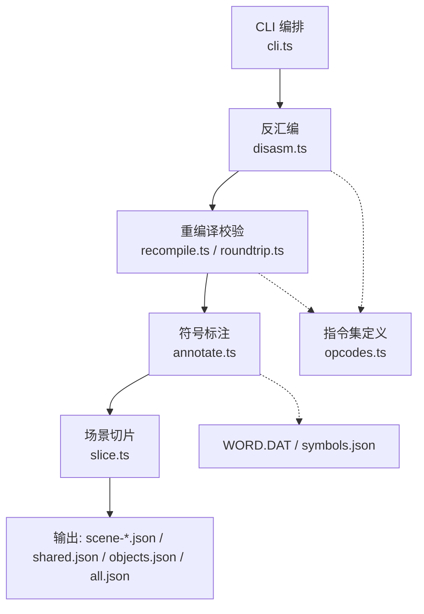
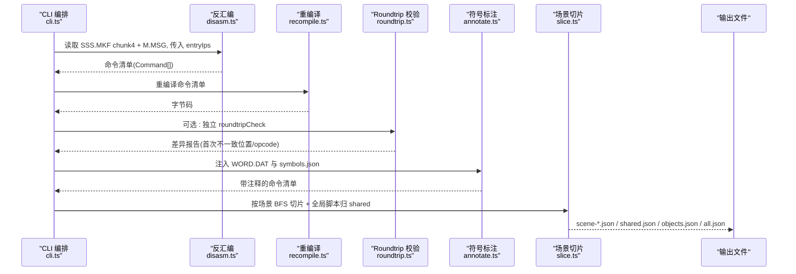
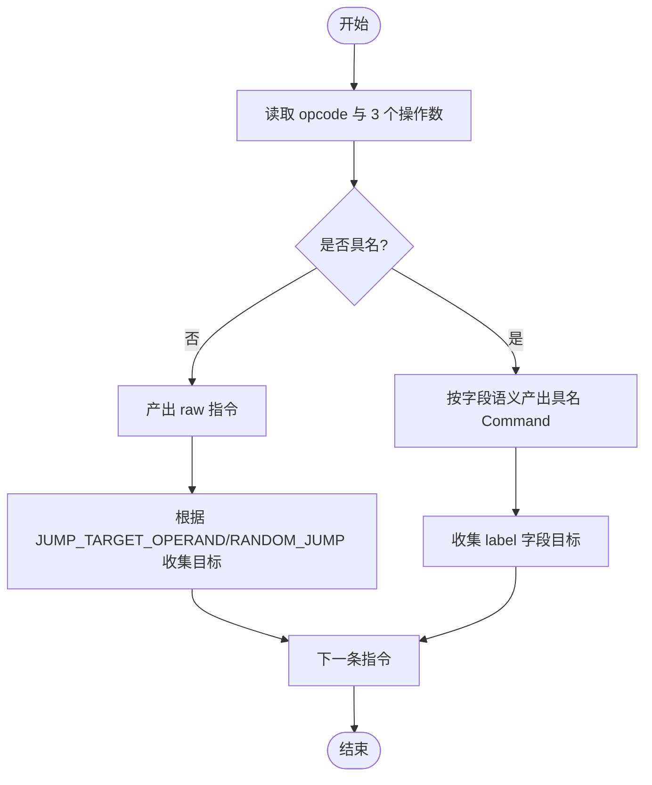
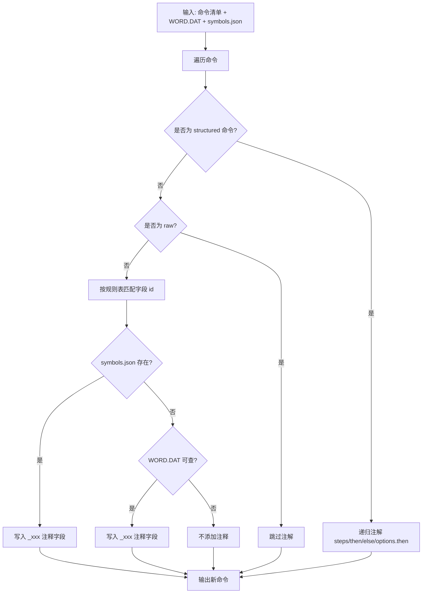
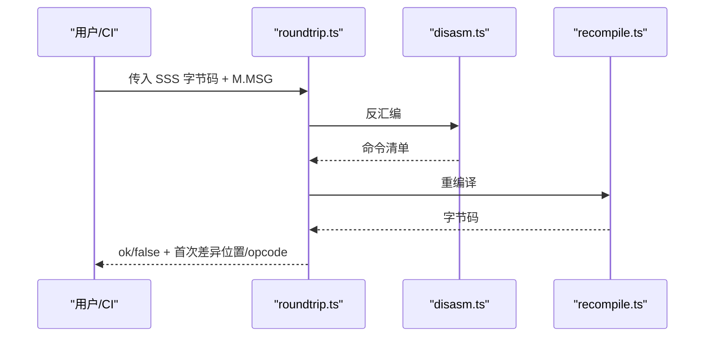
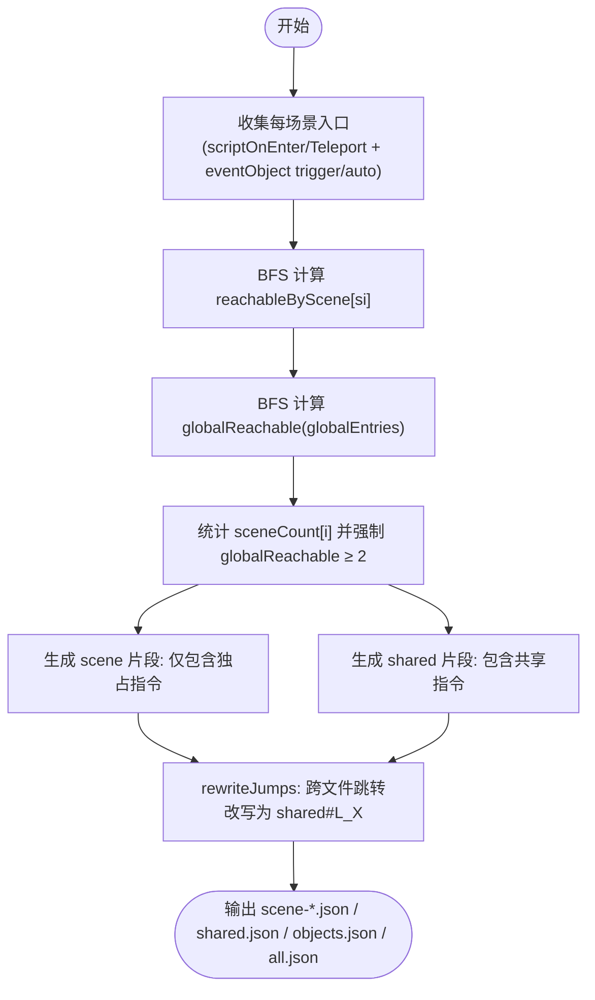
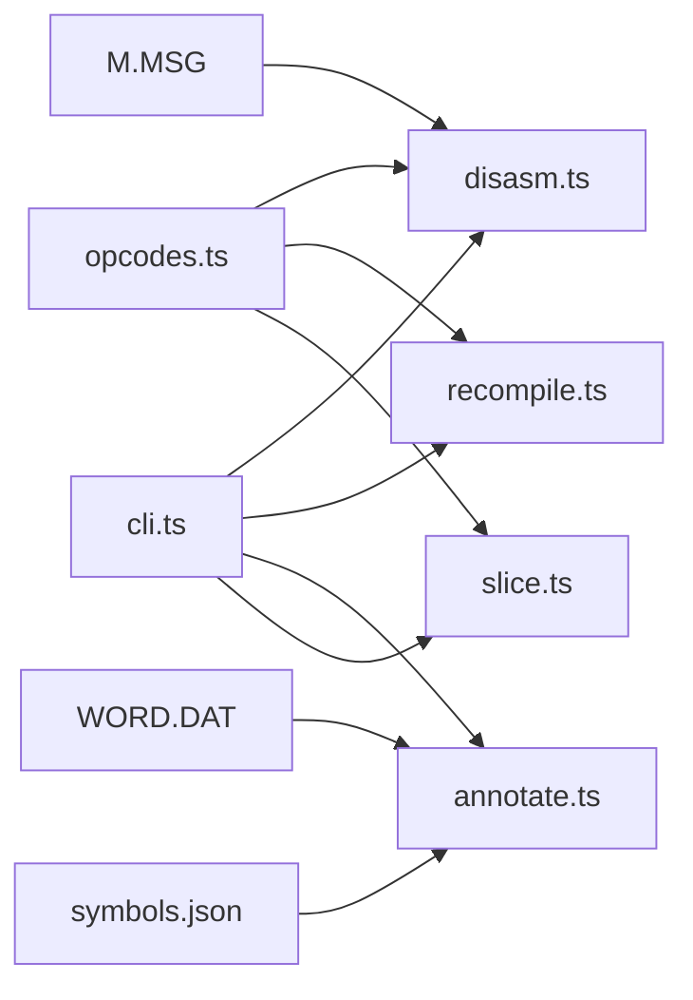

# 事件脚本反汇编器

<cite>
**本文引用的文件**   
- [disasm.ts](file://packages/pal-extract/src/events/disasm.ts)
- [opcodes.ts](file://packages/pal-extract/src/events/opcodes.ts)
- [recompile.ts](file://packages/pal-extract/src/events/recompile.ts)
- [annotate.ts](file://packages/pal-extract/src/events/annotate.ts)
- [slice.ts](file://packages/pal-extract/src/events/slice.ts)
- [cli.ts](file://packages/pal-extract/src/cli.ts)
- [roundtrip.ts](file://packages/pal-extract/src/events/roundtrip.ts)
- [disasm.test.ts](file://packages/pal-extract/src/events/disasm.test.ts)
- [slice.test.ts](file://packages/pal-extract/src/events/slice.test.ts)
- [script.c](file://reference/sdlpal/script.c)
</cite>

## 目录
1. [简介](#简介)
2. [项目结构](#项目结构)
3. [核心组件](#核心组件)
4. [架构总览](#架构总览)
5. [详细组件分析](#详细组件分析)
6. [依赖关系分析](#依赖关系分析)
7. [性能考量](#性能考量)
8. [故障排查指南](#故障排查指南)
9. [结论](#结论)
10. [附录](#附录)

## 简介
本系统面向目标游戏（1998 Win9x 版）的事件脚本字节码，提供完整的“反汇编—符号标注—切片—重编译验证”流水线。其目标是：
- 将原始字节码解析为结构化命令清单，并生成人类可读的标签与注释；
- 按场景可达性进行切片，提取共享代码，便于运行时按需加载；
- 通过“重新编译对比 + 字节级一致性检查”确保转写忠实度；
- 提供调试信息与错误定位能力，辅助问题诊断。

## 项目结构
围绕事件脚本处理的核心模块位于 packages/pal-extract/src/events 下，关键文件职责如下：
- opcodes.ts：指令集定义、跳转目标映射、随机跳常量、动词与操作码双向查找表
- disasm.ts：两遍扫描反汇编，收集跳转目标并打标签，内联消息文本
- recompile.ts：命令到字节码的重编译，严格对偶于反汇编
- annotate.ts：基于 WORD.DAT 与 symbols.json 的变量名推断与常量字符串替换
- slice.ts：按场景 BFS 可达性切片，跨文件跳转改写
- cli.ts：编排入口，串联 disasm → round-trip 校验 → annotate → slice → 输出
- roundtrip.ts：独立 round-trip 校验工具，返回差异详情
- 测试用例：disasm.test.ts、slice.test.ts 覆盖关键路径与边界

图表来源
- [cli.ts:238-276](file://packages/pal-extract/src/cli.ts#L238-L276)
- [disasm.ts:36-101](file://packages/pal-extract/src/events/disasm.ts#L36-L101)
- [recompile.ts:11-95](file://packages/pal-extract/src/events/recompile.ts#L11-L95)
- [roundtrip.ts:23-59](file://packages/pal-extract/src/events/roundtrip.ts#L23-L59)
- [annotate.ts:70-105](file://packages/pal-extract/src/events/annotate.ts#L70-L105)
- [slice.ts:46-204](file://packages/pal-extract/src/events/slice.ts#L46-L204)
- [opcodes.ts:47-227](file://packages/pal-extract/src/events/opcodes.ts#L47-L227)

章节来源
- [cli.ts:238-276](file://packages/pal-extract/src/cli.ts#L238-L276)
- [disasm.ts:36-101](file://packages/pal-extract/src/events/disasm.ts#L36-L101)
- [opcodes.ts:47-227](file://packages/pal-extract/src/events/opcodes.ts#L47-L227)

## 核心组件
- 指令集注册表(opcodes.ts)
  - 以 opcodeTable 为中心，记录每个已具名指令的字段语义与类型(value/label/message/object/item/spell/enemy/person/sprite/scene)
  - fillUnnamedOpcodes 自动填充未具名范围(0x0000..0x00A7)为 raw 占位，保证字节可逆
  - JUMP_TARGET_OPERAND 精确描述条件跳转类 raw 指令的目标 operand 索引，供 disasm 与 slice 使用
  - RANDOM_JUMP_OPCODE 标识 0xA2 随机跳，目标为相对区间 i+1..i+op0
  - lookupVerb / lookupOpcode 提供 verb ↔ opcode 的双向查找
- 反汇编(disasm.ts)
  - 两遍扫描：第一遍产出 Command 并收集 label 目标；第二遍对所有被跳转的指令及 entryIps 打 L_N 标签
  - 针对 showDialog 内联 messages 文本；end/goto/showDialog/giveItem/loadScene/setPalette 等产出具名 Command
  - 其余具名但 M1 未完整处理的指令回退为 raw，确保 round-trip 不变量
- 重编译(recompile.ts)
  - 严格对偶于 disasm：遍历命令，根据 label→index 映射回填 goto 目标，按字段写回字节
  - setDialogStyle* 系列保留非零 arg0/arg1/arg2，保证字节一致
- 符号标注(annotate.ts)
  - 基于 WORD.DAT 全局 wObjectID 命名空间偏移修正后的查表逻辑，结合 symbols.json 优先策略
  - 递归注解 sequence/if/choice 子树
- 场景切片(slice.ts)
  - 对每个场景 BFS 收集可达指令集合；统计每条指令被几个场景 reach
  - 独占指令入对应 scene 文件，≥2 个场景 reach 的指令入 shared；globalEntries(items/spells/enemyObjects scripts) 强制归 shared
  - 重写 goto 目标：若目标在 shared，则改写为 "shared#L_X"
- CLI 编排(cli.ts)
  - 组装 entryIps 与 globalScriptEntries，调用 disasm → recompile 校验 → annotate → slice → 写出 events 产物
- Round-trip 校验(roundtrip.ts)
  - 返回首次不一致的字节偏移、指令下标、该指令 opcode，用于快速定位 disasm/recompile 偏差

章节来源
- [opcodes.ts:47-227](file://packages/pal-extract/src/events/opcodes.ts#L47-L227)
- [disasm.ts:36-101](file://packages/pal-extract/src/events/disasm.ts#L36-L101)
- [recompile.ts:11-95](file://packages/pal-extract/src/events/recompile.ts#L11-L95)
- [annotate.ts:70-105](file://packages/pal-extract/src/events/annotate.ts#L70-L105)
- [slice.ts:46-204](file://packages/pal-extract/src/events/slice.ts#L46-L204)
- [cli.ts:238-276](file://packages/pal-extract/src/cli.ts#L238-L276)
- [roundtrip.ts:23-59](file://packages/pal-extract/src/events/roundtrip.ts#L23-L59)

## 架构总览
下图展示从字节码到结构化 JSON 的端到端流程，以及关键校验点。

图表来源
- [cli.ts:238-276](file://packages/pal-extract/src/cli.ts#L238-L276)
- [disasm.ts:36-101](file://packages/pal-extract/src/events/disasm.ts#L36-L101)
- [recompile.ts:11-95](file://packages/pal-extract/src/events/recompile.ts#L11-L95)
- [roundtrip.ts:23-59](file://packages/pal-extract/src/events/roundtrip.ts#L23-L59)
- [annotate.ts:70-105](file://packages/pal-extract/src/events/annotate.ts#L70-L105)
- [slice.ts:46-204](file://packages/pal-extract/src/events/slice.ts#L46-L204)

## 详细组件分析

### 指令集与参数解析
- 指令格式：每条指令固定 8 字节 = u16 LE opcode + 3×u16 LE 操作数
- 字段类型：value/label/message/object/item/spell/enemy/person/sprite/scene
- 跳转目标：JUMP_TARGET_OPERAND 精确指定条件跳转类 raw 指令的目标 operand 索引
- 随机跳：0xA2 目标为相对区间 i+1..i+op0，需全部收集以保证切片正确性
- 未具名填充：fillUnnamedOpcodes 将 0x0000..0x00A7 中未定义项补为 raw，保持字节可逆

图表来源
- [opcodes.ts:212-227](file://packages/pal-extract/src/events/opcodes.ts#L212-L227)
- [opcodes.ts:243-283](file://packages/pal-extract/src/events/opcodes.ts#L243-L283)
- [disasm.ts:51-86](file://packages/pal-extract/src/events/disasm.ts#L51-L86)

章节来源
- [opcodes.ts:47-227](file://packages/pal-extract/src/events/opcodes.ts#L47-L227)
- [opcodes.ts:243-283](file://packages/pal-extract/src/events/opcodes.ts#L243-L283)
- [disasm.ts:51-86](file://packages/pal-extract/src/events/disasm.ts#L51-L86)

### 符号标注过程
- 变量名推断：基于 WORD.DAT 各命名空间起始偏移(PERSON_OBJ_START/ITEM_OBJ_START/SPELL_OBJ_START/ENEMY_OBJ_START)，修正 off-by-N 问题
- 常量字符串替换：showDialog 在 disasm 阶段内联 text；其他如 _item/_spell/_person/_enemy/_scene 由 annotate 追加
- 优先级：symbols.json 优先于 WORD.DAT；raw 命令不注释
- 递归注解：sequence/if/choice 子树均递归处理

图表来源
- [annotate.ts:22-68](file://packages/pal-extract/src/events/annotate.ts#L22-L68)
- [annotate.ts:70-105](file://packages/pal-extract/src/events/annotate.ts#L70-L105)

章节来源
- [annotate.ts:22-68](file://packages/pal-extract/src/events/annotate.ts#L22-L68)
- [annotate.ts:70-105](file://packages/pal-extract/src/events/annotate.ts#L70-L105)

### 反编译验证机制
- 重新编译对比：recompile 严格对偶于 disasm，按 label→index 映射回填 goto 目标，逐字段写回字节
- 字节级一致性检查：CLI 与 roundtrip.ts 比较原始字节码与重编译结果，失败时输出首次不一致位置、指令下标、opcode
- 差异报告：roundtrip.ts 返回 firstDiffOffset/firstDiffInstruction/firstDiffOpcode，便于定位具体指令

图表来源
- [roundtrip.ts:23-59](file://packages/pal-extract/src/events/roundtrip.ts#L23-L59)
- [recompile.ts:11-95](file://packages/pal-extract/src/events/recompile.ts#L11-L95)
- [disasm.ts:36-101](file://packages/pal-extract/src/events/disasm.ts#L36-L101)

章节来源
- [roundtrip.ts:23-59](file://packages/pal-extract/src/events/roundtrip.ts#L23-L59)
- [recompile.ts:11-95](file://packages/pal-extract/src/events/recompile.ts#L11-L95)

### 脚本切片技术
- 场景分割：对每个场景 BFS 收集可达指令集合，统计每条指令被几个场景 reach
- 共享代码提取：≥2 个场景 reach 的指令放入 shared；globalEntries(items/spells/enemyObjects scripts) 强制归 shared
- 依赖分析：goto 目标若在 shared，则改写为 "shared#L_X"；raw 条件跳转与 0xA2 随机跳目标由 pushRawJumpTargets 收集
- end 行为对齐 sdlpal：0x0001(end advance)收 i+1；0x0002(end reset)收 resetTo 与 i+1

图表来源
- [slice.ts:46-204](file://packages/pal-extract/src/events/slice.ts#L46-L204)
- [slice.ts:206-242](file://packages/pal-extract/src/events/slice.ts#L206-L242)

章节来源
- [slice.ts:46-204](file://packages/pal-extract/src/events/slice.ts#L46-L204)
- [slice.ts:206-242](file://packages/pal-extract/src/events/slice.ts#L206-L242)

### 调试信息与错误定位
- 长度校验：disasm 在输入非 8 倍数时报错，快速发现数据损坏或解析错位
- 首次差异定位：roundtrip.ts 返回 firstDiffOffset/firstDiffInstruction/firstDiffOpcode，配合 sdlpal script.c 对照定位
- 日志与警告：CLI 在 round-trip 失败时输出明确提示；魔法脚本运行器遇到 non-raw 命令会 warn 并跳过
- 测试覆盖：disasm.test.ts 与 slice.test.ts 覆盖关键分支与边界，包括 13 个新增条件跳转目标、0xA2 随机跳、end 续行等

章节来源
- [disasm.ts:41-43](file://packages/pal-extract/src/events/disasm.ts#L41-L43)
- [roundtrip.ts:23-59](file://packages/pal-extract/src/events/roundtrip.ts#L23-L59)
- [disasm.test.ts:79-81](file://packages/pal-extract/src/events/disasm.test.ts#L79-L81)
- [slice.test.ts:123-191](file://packages/pal-extract/src/events/slice.test.ts#L123-L191)

## 依赖关系分析
- 低耦合高内聚：opcodes.ts 作为单一事实源，被 disasm/recompile/slice 共同依赖
- 外部依赖：WORD.DAT 与 symbols.json 仅被 annotate 使用；M.MSG 仅被 disasm 用于内联文本
- 潜在循环：无直接循环依赖；CLI 作为编排层聚合各模块
- 运行时契约：label 命名约定 "L_N"/"shared#L_N" 贯穿 disasm/slice/recompile

图表来源
- [opcodes.ts:47-227](file://packages/pal-extract/src/events/opcodes.ts#L47-L227)
- [disasm.ts:36-101](file://packages/pal-extract/src/events/disasm.ts#L36-L101)
- [recompile.ts:11-95](file://packages/pal-extract/src/events/recompile.ts#L11-L95)
- [annotate.ts:70-105](file://packages/pal-extract/src/events/annotate.ts#L70-L105)
- [slice.ts:46-204](file://packages/pal-extract/src/events/slice.ts#L46-L204)
- [cli.ts:238-276](file://packages/pal-extract/src/cli.ts#L238-L276)

章节来源
- [opcodes.ts:47-227](file://packages/pal-extract/src/events/opcodes.ts#L47-L227)
- [cli.ts:238-276](file://packages/pal-extract/src/cli.ts#L238-L276)

## 性能考量
- 时间复杂度
  - 反汇编：O(N)，N 为指令条数
  - 重编译：O(N)
  - 符号标注：O(N·K)，K 为规则数量（常数级）
  - 切片 BFS：O(N + E)，E 为边数（goto/条件跳转/随机跳）
- 空间复杂度
  - 命令数组 O(N)
  - 标签集合与可达集合 O(N)
- 优化建议
  - 大文件分块处理：对超大 SSS 可按场景预划分再并行反汇编
  - 缓存 label→index 映射：recompile 已实现，避免重复遍历
  - 减少对象创建：在热点路径复用临时视图与缓冲区

## 故障排查指南
- 常见错误
  - 字节码长度不是 8 倍数：检查 SSS 解析是否正确、chunk 偏移是否对齐
  - round-trip 失败：根据 firstDiffInstruction 与 firstDiffOpcode 对照 script.c 确认字段语义
  - 场景缺失指令：检查 JUMP_TARGET_OPERAND 与 RANDOM_JUMP_OPCODE 是否覆盖所有条件跳转
  - 物品/法术/敌人脚本无效：确认 globalEntries 已加入 entryIps 且切片后进入 shared
- 定位步骤
  - 使用 roundtrip.ts 获取差异位置
  - 在 disasm.test.ts 与 slice.test.ts 中构造最小复现用例
  - 对照 reference/sdlpal/script.c 确认跳转目标与 end 行为

章节来源
- [disasm.ts:41-43](file://packages/pal-extract/src/events/disasm.ts#L41-L43)
- [roundtrip.ts:23-59](file://packages/pal-extract/src/events/roundtrip.ts#L23-L59)
- [slice.ts:125-161](file://packages/pal-extract/src/events/slice.ts#L125-L161)
- [script.c:594-646](file://reference/sdlpal/script.c#L594-L646)

## 结论
本系统以 opcodes.ts 为权威指令集，通过两遍反汇编与严格重编译校验，实现了高保真的事件脚本反汇编与切片。符号标注与场景切片进一步提升了可维护性与运行时效率。完善的测试与差异报告机制确保了转写的忠实度与可追溯性。

## 附录
- 术语
  - 指令：一条 8 字节的脚本操作
  - 标签：形如 L_N 的指令标记，支持跨文件 shared#L_N
  - 切片：按场景可达性拆分命令清单
- 参考实现
  - SDLPal 脚本解释器：reference/sdlpal/script.c