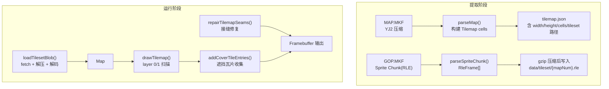
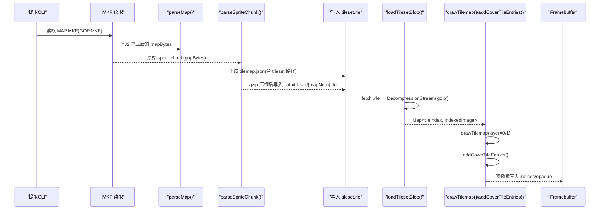
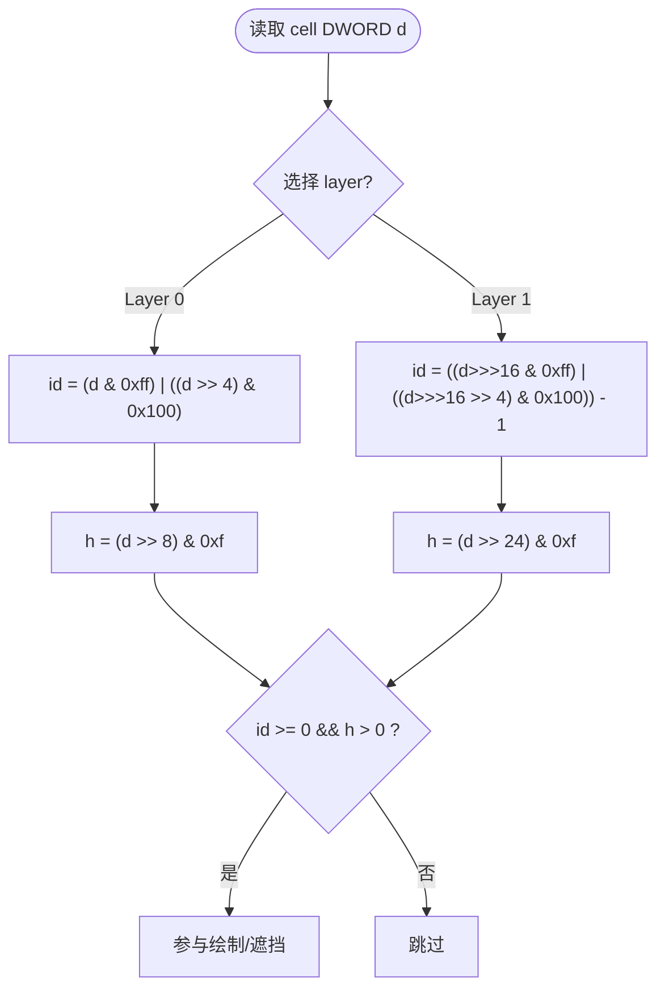
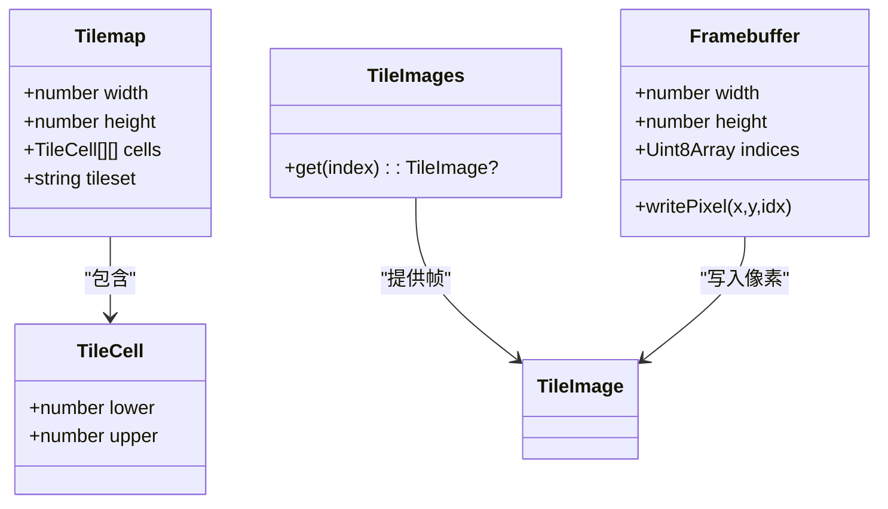
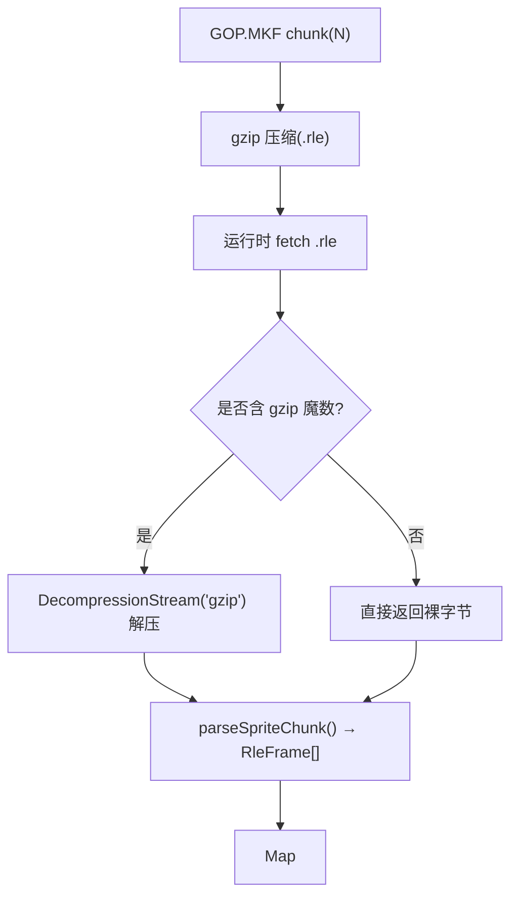
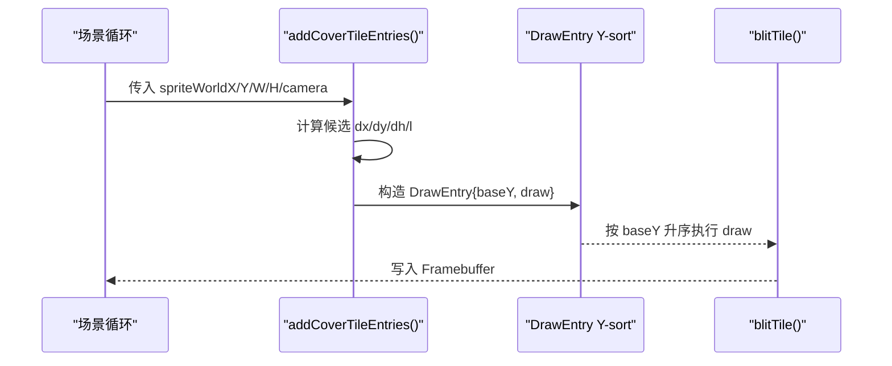
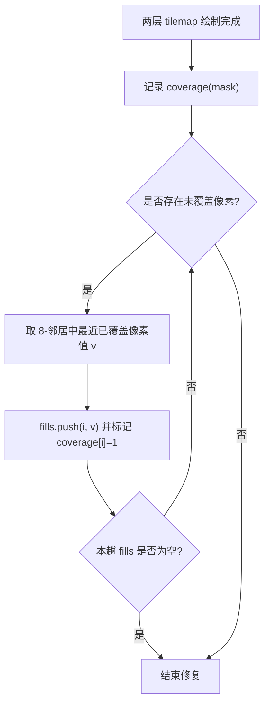
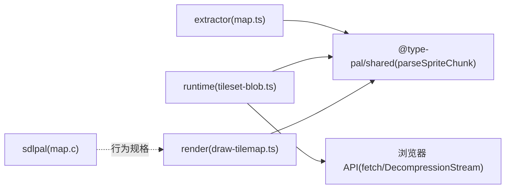

# 地图瓦片提取器

<cite>
**本文引用的文件**
- [packages/pal-extract/src/resources/map.ts](file://packages/pal-extract/src/resources/map.ts)
- [packages/game/src/assets/tileset-blob.ts](file://packages/game/src/assets/tileset-blob.ts)
- [packages/game/src/present/draw-tilemap.ts](file://packages/game/src/present/draw-tilemap.ts)
- [reference/sdlpal/map.c](file://reference/sdlpal/map.c)
- [packages/pal-extract/scripts/render-tilemap.ts](file://packages/pal-extract/scripts/render-tilemap.ts)
- [packages/pal-extract/scripts/sdlpal-dump-map-all.ts](file://packages/pal-extract/scripts/sdlpal-dump-map-all.ts)
- [reference/sdlpal/patches/headless-map-dump.patch](file://reference/sdlpal/patches/headless-map-dump.patch)
- [docs/phase1/plans/2026-05-23-m2-runtime-slice.md](file://docs/phase1/plans/2026-05-23-m2-runtime-slice.md)
- [docs/phase1/plans/2026-05-24-m4-pal-extract-complete-design.md](file://docs/phase1/plans/2026-05-24-m4-pal-extract-complete-design.md)
</cite>

## 目录
1. [简介](#简介)
2. [项目结构](#项目结构)
3. [核心组件](#核心组件)
4. [架构总览](#架构总览)
5. [详细组件分析](#详细组件分析)
6. [依赖关系分析](#依赖关系分析)
7. [性能考量](#性能考量)
8. [故障排查指南](#故障排查指南)
9. [结论](#结论)
10. [附录](#附录)

## 简介
本文件系统化阐述“地图瓦片提取系统”的数据格式、解析流程与运行时渲染策略，覆盖以下要点：
- 瓦片数据格式：16×16 菱形网格布局、9-bit 瓦片 ID 编码、碰撞属性位图（高度字段）。
- 图层分离机制：背景层（layer 0）与前景层（layer 1）的独立解析与绘制顺序。
- GOP 文件格式：瓦片组压缩、增量更新与版本兼容性说明。
- tileset 优化策略：原始 RLE 数据保存、按需加载与缓存机制。
- 地图验证工具与调试输出：像素级基线对比、全图导出与差异报告。

## 项目结构
围绕地图瓦片的核心代码分布在资源提取与游戏运行两个包中：
- 提取阶段：解析 MAP.MKF/GOP.MKF，生成 tilemap JSON 与 gzip 化的 tileset blob。
- 运行阶段：按 tilemap 与 tileset blob 进行瓦片解码、Y-sort 与遮挡计算、最终绘制。

图示来源
- [packages/pal-extract/src/resources/map.ts:1-72](file://packages/pal-extract/src/resources/map.ts#L1-L72)
- [packages/game/src/assets/tileset-blob.ts:1-151](file://packages/game/src/assets/tileset-blob.ts#L1-L151)
- [packages/game/src/present/draw-tilemap.ts:1-384](file://packages/game/src/present/draw-tilemap.ts#L1-L384)

章节来源
- [packages/pal-extract/src/resources/map.ts:1-72](file://packages/pal-extract/src/resources/map.ts#L1-L72)
- [packages/game/src/assets/tileset-blob.ts:1-151](file://packages/game/src/assets/tileset-blob.ts#L1-L151)
- [packages/game/src/present/draw-tilemap.ts:1-384](file://packages/game/src/present/draw-tilemap.ts#L1-L384)

## 核心组件
- 地图解析器：将 MAP.MKF 的 u32 cell 数组解析为 Tilemap.cells[row][col] = { lower, upper }。
- Tileset Blob 解码器：从 gzip 化的 GOP chunk 字节流解码出 Map<tileIndex, IndexedImage>。
- 瓦片渲染器：实现 layer 0/1 的扫描、坐标变换、Y-sort 与遮挡瓦片计算。
- 接缝修复器：基于 coverage mask 的邻域扩散填充，复现原版不清屏导致的视觉连续性。

章节来源
- [packages/pal-extract/src/resources/map.ts:1-72](file://packages/pal-extract/src/resources/map.ts#L1-L72)
- [packages/game/src/assets/tileset-blob.ts:1-151](file://packages/game/src/assets/tileset-blob.ts#L1-L151)
- [packages/game/src/present/draw-tilemap.ts:1-384](file://packages/game/src/present/draw-tilemap.ts#L1-L384)

## 架构总览
下图展示从 MKF 到运行时渲染的端到端数据流，以及关键算法位置。

图示来源
- [packages/pal-extract/src/resources/map.ts:1-72](file://packages/pal-extract/src/resources/map.ts#L1-L72)
- [packages/game/src/assets/tileset-blob.ts:1-151](file://packages/game/src/assets/tileset-blob.ts#L1-L151)
- [packages/game/src/present/draw-tilemap.ts:1-384](file://packages/game/src/present/draw-tilemap.ts#L1-L384)

## 详细组件分析

### 瓦片数据格式与位图语义
- 网格布局：128 行 × 64 列，每格包含两个 DWORD（lower/upper），分别对应 h=0 与 h=1 子行。
- 9-bit 瓦片 ID 编码：
  - 底层（layer 0）：(d & 0xff) | ((d >> 4) & 0x100)，范围 0..511，0 表示有效瓦片。
  - 顶层（layer 1）：((d>>>16 & 0xff) | ((d>>>16 >> 4) & 0x100)) - 1，0 表示无瓦片。
- 碰撞属性位图（高度字段）：
  - layer 0：(d >> 8) & 0xf
  - layer 1：(d >> 24) & 0xf
  - 用于遮挡判定与 blit_y 计算；iTileHeight > 0 才参与遮挡。

图示来源
- [packages/game/src/present/draw-tilemap.ts:46-53](file://packages/game/src/present/draw-tilemap.ts#L46-L53)
- [packages/game/src/present/draw-tilemap.ts:332-346](file://packages/game/src/present/draw-tilemap.ts#L332-L346)
- [reference/sdlpal/map.c:197-219](file://reference/sdlpal/map.c#L197-L219)

章节来源
- [packages/game/src/present/draw-tilemap.ts:46-53](file://packages/game/src/present/draw-tilemap.ts#L46-L53)
- [packages/game/src/present/draw-tilemap.ts:332-346](file://packages/game/src/present/draw-tilemap.ts#L332-L346)
- [reference/sdlpal/map.c:197-219](file://reference/sdlpal/map.c#L197-L219)

### 图层分离机制（背景层/前景层）
- 背景层（layer 0）：先绘制，承载地砖、墙基等基础地形。
- 前景层（layer 1）：后绘制，承载门、柜子侧面、柱子等遮挡物，需与精灵进行 Y-sort。
- 坐标与偏移：
  - h=0（lower）：屏幕位置 (col*32 - 16, row*16 - 8)
  - h=1（upper）：屏幕位置 (col*32, row*16)
- 边界 fence 处理：
  - layer 0 越界时回退到首格 tile（非留黑）。
  - layer 1 越界直接 continue 跳过。

图示来源
- [packages/pal-extract/src/resources/map.ts:18-23](file://packages/pal-extract/src/resources/map.ts#L18-L23)
- [packages/game/src/present/draw-tilemap.ts:21-33](file://packages/game/src/present/draw-tilemap.ts#L21-L33)

章节来源
- [packages/pal-extract/src/resources/map.ts:18-23](file://packages/pal-extract/src/resources/map.ts#L18-L23)
- [packages/game/src/present/draw-tilemap.ts:21-33](file://packages/game/src/present/draw-tilemap.ts#L21-L33)

### GOP 文件格式与压缩
- 存储形式：GOP.MKF 每个 mapNum 对应一个 sprite chunk（RLE 帧序列），不经过 YJ2 压缩。
- 运行时优化：
  - 提取阶段将 GOP chunk 以 gzip 压缩保存为 data/tileset/{mapNum}.rle。
  - 运行阶段通过浏览器原生 DecompressionStream('gzip') 解压，再用 parseSpriteChunk 解码。
- 兼容性：
  - 文件名后缀 .rle 避免静态服务器误判 Content-Encoding 导致二次解压。
  - 若上游已解压（无 gzip 魔数 0x1f 0x8b），直接返回裸字节。

图示来源
- [packages/game/src/assets/tileset-blob.ts:105-135](file://packages/game/src/assets/tileset-blob.ts#L105-L135)
- [packages/game/src/assets/tileset-blob.ts:142-150](file://packages/game/src/assets/tileset-blob.ts#L142-L150)
- [packages/pal-extract/src/resources/map.ts:58-61](file://packages/pal-extract/src/resources/map.ts#L58-L61)

章节来源
- [packages/game/src/assets/tileset-blob.ts:105-135](file://packages/game/src/assets/tileset-blob.ts#L105-L135)
- [packages/game/src/assets/tileset-blob.ts:142-150](file://packages/game/src/assets/tileset-blob.ts#L142-L150)
- [packages/pal-extract/src/resources/map.ts:58-61](file://packages/pal-extract/src/resources/map.ts#L58-L61)

### tileset 优化策略（原始 RLE 保存、按需加载、缓存）
- 原始 RLE 保存：
  - 不再逐 tile 编 PNG，而是保存 gzip 化的原始 GOP chunk，减少中间转换损耗与体积。
- 按需加载：
  - 运行时仅加载当前场景所需 mapNum 的 tileset blob，避免一次性载入全部图集。
- 缓存机制：
  - 解码结果 Map<tileIndex, IndexedImage> 可在内存中复用，避免重复解码。
  - 角色/NPC/Battle 等资源共用同一解码管线，统一使用 IndexedImage 结构。

章节来源
- [packages/pal-extract/src/resources/map.ts:20-23](file://packages/pal-extract/src/resources/map.ts#L20-L23)
- [packages/game/src/assets/tileset-blob.ts:1-17](file://packages/game/src/assets/tileset-blob.ts#L1-L17)
- [packages/game/src/assets/tileset-blob.ts:41-48](file://packages/game/src/assets/tileset-blob.ts#L41-L48)

### 瓦片渲染与遮挡（Y-sort 与 cover tile）
- 扫描范围：根据精灵世界坐标与尺寸计算候选行列区间。
- 候选点：对每个候选单元格，考虑 5 个相邻候选（dx, dy, dh）组合。
- 遮挡条件：tileId ≥ 0 且 iTileHeight > 0 且满足 y 方向覆盖判断。
- 排序键 baseY：用于 DrawEntry 的 Y-sort，确保正确前后关系。
- 屏幕绘制位：依据 sdlpal 真实 blit 公式推导，消除 iLayer 项影响。

图示来源
- [packages/game/src/present/draw-tilemap.ts:255-383](file://packages/game/src/present/draw-tilemap.ts#L255-L383)

章节来源
- [packages/game/src/present/draw-tilemap.ts:255-383](file://packages/game/src/present/draw-tilemap.ts#L255-L383)

### 瓦片接缝修复（repairs seams）
- 根因：每帧清屏至 index 0，而原版不清屏，导致斜接缝处露出纯黑。
- 方案：在两层 base tilemap 画完后，基于 coverage mask 做邻域扩散填充，最多若干趟。
- 关键点：用 coverage 而非 indices===0 判断漏黑，避免误改 opaque palette-0 像素。

图示来源
- [packages/game/src/present/draw-tilemap.ts:169-208](file://packages/game/src/present/draw-tilemap.ts#L169-L208)

章节来源
- [packages/game/src/present/draw-tilemap.ts:169-208](file://packages/game/src/present/draw-tilemap.ts#L169-L208)

### 地图验证工具与调试输出
- 全图导出：
  - sdlpal 头补丁提供 --dump-map N --out FILE [--palette P] 能力，可导出完整地图 PNG。
- 自动化比对：
  - 脚本遍历所有 scene，调用 sdlpal --dump-map 与 render-tilemap.ts 渲染结果进行像素 diff。
  - 输出 JSON 报告与 Markdown 摘要，便于追踪失败场景与原因分类。
- 已知问题与修复：
  - 9-bit tile id 被错误截断、h=0/h=1 子行位置误用等 bug 已在历史计划文档中记录并修复。

章节来源
- [reference/sdlpal/patches/headless-map-dump.patch:1-235](file://reference/sdlpal/patches/headless-map-dump.patch#L1-L235)
- [packages/pal-extract/scripts/sdlpal-dump-map-all.ts:161-210](file://packages/pal-extract/scripts/sdlpal-dump-map-all.ts#L161-L210)
- [packages/pal-extract/scripts/render-tilemap.ts:152-169](file://packages/pal-extract/scripts/render-tilemap.ts#L152-L169)
- [docs/phase1/plans/2026-05-23-m2-runtime-slice.md:3363-3372](file://docs/phase1/plans/2026-05-23-m2-runtime-slice.md#L3363-L3372)

## 依赖关系分析
- 提取阶段依赖：
  - @type-pal/shared 的 parseSpriteChunk 与类型定义。
  - MKF 读取与 YJ2 解压（由上层 CLI 负责）。
- 运行阶段依赖：
  - 浏览器 API：fetch、DecompressionStream('gzip')。
  - 共享解码：parseSpriteChunk 保证 tileset 与 npc/battle/magic 一致。
- 外部参考：
  - reference/sdlpal/map.c 作为行为真值，指导 tile id 提取、高度字段与 blit 公式。

图示来源
- [packages/pal-extract/src/resources/map.ts:12-13](file://packages/pal-extract/src/resources/map.ts#L12-L13)
- [packages/game/src/assets/tileset-blob.ts:19](file://packages/game/src/assets/tileset-blob.ts#L19)
- [packages/game/src/present/draw-tilemap.ts:1](file://packages/game/src/present/draw-tilemap.ts#L1)
- [reference/sdlpal/map.c:197-219](file://reference/sdlpal/map.c#L197-L219)

章节来源
- [packages/pal-extract/src/resources/map.ts:12-13](file://packages/pal-extract/src/resources/map.ts#L12-L13)
- [packages/game/src/assets/tileset-blob.ts:19](file://packages/game/src/assets/tileset-blob.ts#L19)
- [packages/game/src/present/draw-tilemap.ts:1](file://packages/game/src/present/draw-tilemap.ts#L1)
- [reference/sdlpal/map.c:197-219](file://reference/sdlpal/map.c#L197-L219)

## 性能考量
- 请求合并：tileset 改为单 blob 下载，显著降低 HTTP 请求数与 createImageBitmap 开销。
- 零拷贝：IndexedImage.indices 直接复用 RleFrame.pixels，避免额外复制。
- 按需加载：仅加载当前场景所需的 mapNum 的 tileset，控制内存占用。
- 渲染裁剪：整行/整列 viewport 裁剪，减少无效绘制。
- 接缝修复复杂度：多趟邻域扩散，但受限于 maxPasses，实际 thin seam 快速收敛。

[本节为通用性能建议，无需特定文件引用]

## 故障排查指南
- 瓦片 ID 异常：
  - 检查 9-bit 提取逻辑是否正确拼接 bit 12 到低 8 位。
  - 确认 layer 1 的 id 减一语义（0 表示无瓦片）。
- 子行错位：
  - 核对 h=0/h=1 的屏幕偏移公式，避免整体偏置反转。
- 遮挡缺失或穿模：
  - 校验 iTileHeight 提取与覆盖条件；确认 baseY 排序键与 blit_y 公式。
- 接缝漏黑：
  - 确认 coverage mask 正确记录已覆盖像素；扩散修复次数足够。
- 环境兼容：
  - 若 DecompressionStream 不可用，需引入 fflate 兜底。

章节来源
- [packages/game/src/present/draw-tilemap.ts:46-53](file://packages/game/src/present/draw-tilemap.ts#L46-L53)
- [packages/game/src/present/draw-tilemap.ts:332-346](file://packages/game/src/present/draw-tilemap.ts#L332-L346)
- [packages/game/src/assets/tileset-blob.ts:112-117](file://packages/game/src/assets/tileset-blob.ts#L112-L117)

## 结论
本系统以 sdlpal 源码为真值锚点，实现了高保真的地图瓦片提取与渲染管线。通过 9-bit 瓦片 ID 精确编码、layer 0/1 分层绘制、Y-sort 遮挡与接缝修复，确保了视觉一致性。tileset 采用 gzip 化原始 RLE 保存与运行时按需加载，兼顾体积与性能。配套的验证工具链提供了像素级回归保障，有助于持续对齐原版行为。

[本节为总结性内容，无需特定文件引用]

## 附录
- 资源组织决策：
  - world/tileset/ 按 mapNum 存放，自动 dedup 不同 scene 共享的 map。
  - 顶层数据表平铺 + 索引型 JSON 分子目录，避免大量文件平铺。
- 路径变更影响面：
  - 提取 CLI、baseline 工具、运行时 loader 与 dev-panel 均需要同步更新路径。

章节来源
- [docs/phase1/plans/2026-05-24-m4-pal-extract-complete-design.md:162-181](file://docs/phase1/plans/2026-05-24-m4-pal-extract-complete-design.md#L162-L181)