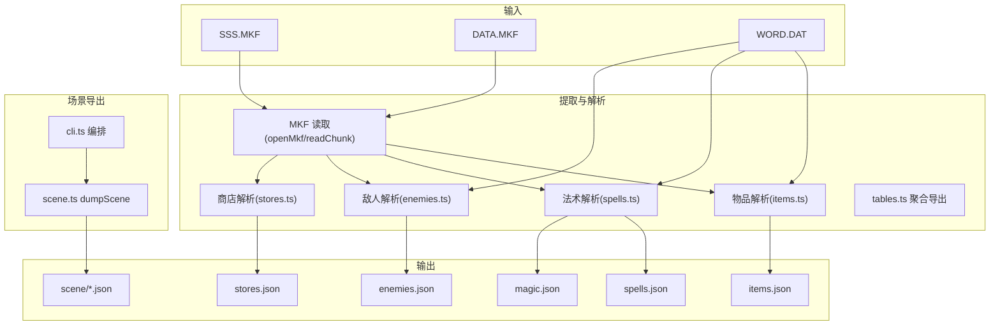
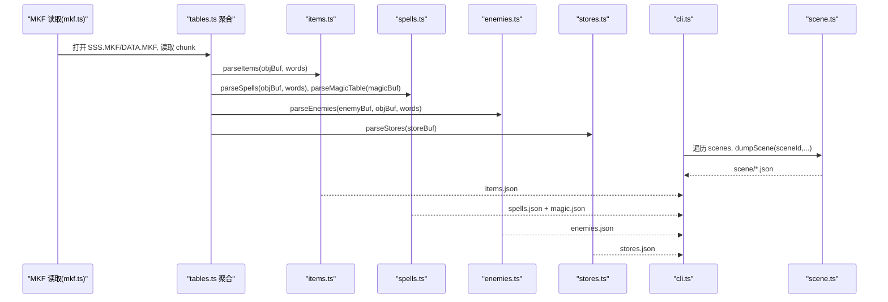
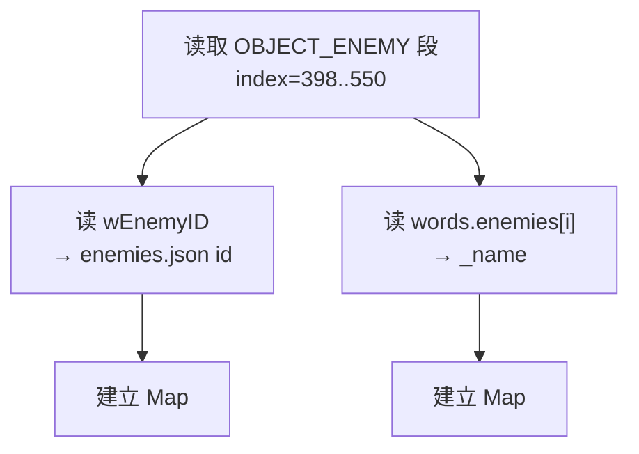
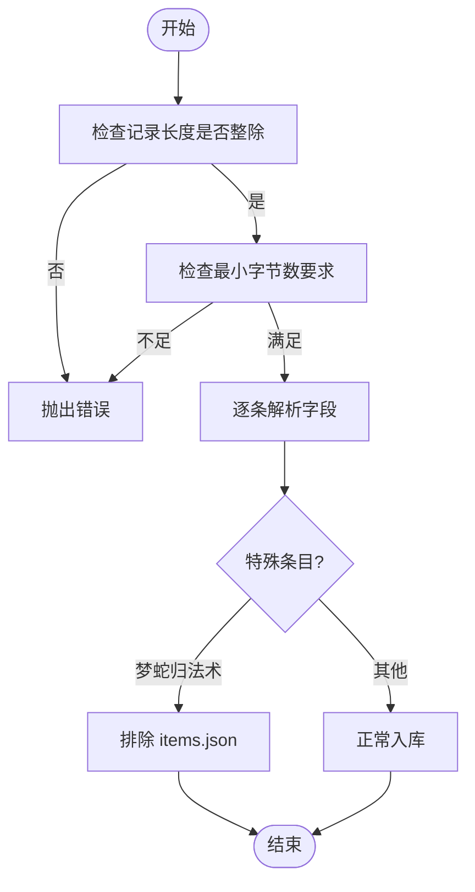
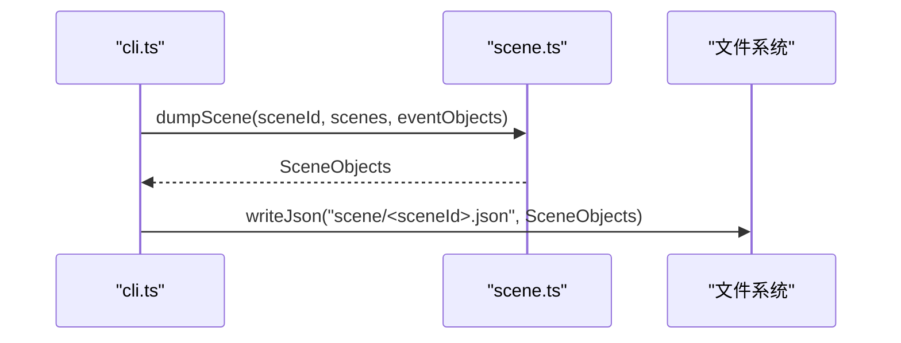
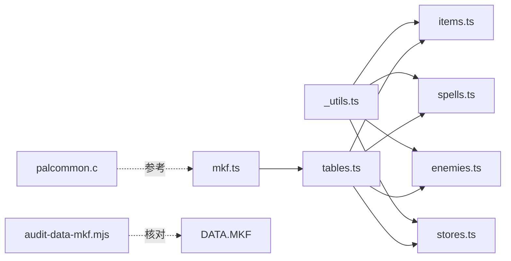

# 数据表解析器

<cite>
**本文引用的文件**   
- [README.md](file://README.md)
- [tables.ts](file://packages/pal-extract/src/resources/tables.ts)
- [tables.test.ts](file://packages/pal-extract/src/resources/tables.test.ts)
- [_utils.ts](file://packages/pal-extract/src/resources/parsers/_utils.ts)
- [items.ts](file://packages/pal-extract/src/resources/parsers/items.ts)
- [spells.ts](file://packages/pal-extract/src/resources/parsers/spells.ts)
- [enemies.ts](file://packages/pal-extract/src/resources/parsers/enemies.ts)
- [stores.ts](file://packages/pal-extract/src/resources/parsers/stores.ts)
- [mkf.ts](file://packages/pal-extract/src/io/mkf.ts)
- [palcommon.c](file://reference/sdlpal/palcommon.c)
- [audit-data-mkf.mjs](file://packages/pal-extract/audit-data-mkf.mjs)
- [scene.ts](file://packages/pal-extract/src/resources/scene.ts)
- [cli.ts](file://packages/pal-extract/src/cli.ts)
- [state-dump.ts](file://packages/game/src/dev/state-dump.ts)
- [battle-inspect.ts](file://packages/game/src/core/inspect/battle-inspect.ts)
</cite>

## 目录
1. [简介](#简介)
2. [项目结构](#项目结构)
3. [核心组件](#核心组件)
4. [架构总览](#架构总览)
5. [详细组件分析](#详细组件分析)
6. [依赖关系分析](#依赖关系分析)
7. [性能与复杂度](#性能与复杂度)
8. [故障排查指南](#故障排查指南)
9. [结论](#结论)
10. [附录：数据结构定义与校验规则](#附录数据结构定义与校验规则)

## 简介
本文件面向“数据表解析系统”，聚焦以下目标：
- 数据结构定义：敌人属性、物品数据、法术效果、商店配置。
- 关联关系处理：对象引用解析、ID 映射转换、外键约束验证。
- 多源数据合并：SSS.MKF 与 DATA.MKF 整合、字段对齐、缺失值处理。
- 数据验证规则：范围检查、逻辑一致性、业务规则验证。
- 数据导出与格式化：JSON 输出、场景切片导出、运行时状态导出。

该解析系统以 sdlpal 源码为真值参考，将原版 MKF/WORD.DAT 等二进制资源提取并转换为结构化 JSON，供游戏运行时与编辑器消费。

## 项目结构
- 资源提取层（pal-extract）
  - MKF 归档读取：统一从 shared 暴露 openMkf/readChunk/chunkCount。
  - 数据表解析：按 parser 拆分到 parsers/*.ts，通过 tables.ts 聚合导出。
  - 名称表：WORD.DAT 解析后提供 _name 注释回填。
- 共享类型（shared）
  - 所有数据表条目类型（Item、Spell、Magic、Enemy、Store、PlayerRole 等）。
- 运行时（game）
  - 使用解析后的 JSON 进行战斗、菜单、事件等系统运行。
  - 开发期导出工具：帧级状态导出、战斗信息面板。

图表来源
- [mkf.ts:1-7](file://packages/pal-extract/src/io/mkf.ts#L1-L7)
- [tables.ts:1-37](file://packages/pal-extract/src/resources/tables.ts#L1-L37)
- [items.ts:1-105](file://packages/pal-extract/src/resources/parsers/items.ts#L1-L105)
- [spells.ts:1-300](file://packages/pal-extract/src/resources/parsers/spells.ts#L1-L300)
- [enemies.ts:1-253](file://packages/pal-extract/src/resources/parsers/enemies.ts#L1-L253)
- [stores.ts:1-49](file://packages/pal-extract/src/resources/parsers/stores.ts#L1-L49)
- [scene.ts:40-89](file://packages/pal-extract/src/resources/scene.ts#L40-L89)
- [cli.ts:656-673](file://packages/pal-extract/src/cli.ts#L656-L673)

章节来源
- [README.md:1-139](file://README.md#L1-L139)
- [tables.ts:1-37](file://packages/pal-extract/src/resources/tables.ts#L1-L37)

## 核心组件
- 共享常量与字节读写
  - OBJECT 数组布局、各段起始索引与数量、u16/s16 小端读取。
- 物品解析
  - 从 SSS.MKF chunk 2(OBJECT_ITEM) 解析，过滤特殊项(梦蛇)，填充 _name。
- 法术解析
  - 从 SSS.MKF chunk 2(OBJECT_MAGIC) 解析 Spell wrapper；从 DATA.MKF chunk 4(MAGIC) 解析 Magic stats。
- 敌人解析
  - 从 DATA.MKF chunk 1(ENEMY) 解析 Enemy；从 SSS.MKF chunk 2(OBJECT_ENEMY) 解析 AI 脚本钩子；构建 ID 映射。
- 商店解析
  - 从 DATA.MKF chunk 0(STORE) 解析商店列表，首个 0 截断。
- 场景导出
  - 遍历 scenes，按 sceneRanges 切片 eventObjects，输出 scene/*.json。

章节来源
- [_utils.ts:1-63](file://packages/pal-extract/src/resources/parsers/_utils.ts#L1-L63)
- [items.ts:1-105](file://packages/pal-extract/src/resources/parsers/items.ts#L1-L105)
- [spells.ts:1-300](file://packages/pal-extract/src/resources/parsers/spells.ts#L1-L300)
- [enemies.ts:1-253](file://packages/pal-extract/src/resources/parsers/enemies.ts#L1-L253)
- [stores.ts:1-49](file://packages/pal-extract/src/resources/parsers/stores.ts#L1-L49)
- [scene.ts:40-89](file://packages/pal-extract/src/resources/scene.ts#L40-L89)

## 架构总览
下图展示从原始资源到结构化 JSON 的端到端流程，以及关键跨表引用与 ID 映射。

图表来源
- [mkf.ts:1-7](file://packages/pal-extract/src/io/mkf.ts#L1-L7)
- [tables.ts:1-37](file://packages/pal-extract/src/resources/tables.ts#L1-L37)
- [items.ts:1-105](file://packages/pal-extract/src/resources/parsers/items.ts#L1-L105)
- [spells.ts:1-300](file://packages/pal-extract/src/resources/parsers/spells.ts#L1-L300)
- [enemies.ts:1-253](file://packages/pal-extract/src/resources/parsers/enemies.ts#L1-L253)
- [stores.ts:1-49](file://packages/pal-extract/src/resources/parsers/stores.ts#L1-L49)
- [scene.ts:40-89](file://packages/pal-extract/src/resources/scene.ts#L40-L89)
- [cli.ts:656-673](file://packages/pal-extract/src/cli.ts#L656-L673)

## 详细组件分析

### 数据结构定义
- 物品(Item)
  - id: 全局 OBJECT 索引(wObjectID)，用于与引擎交互。
  - bitmap/price/scriptOnUse/scriptOnEquip/scriptOnThrow/scriptDesc/flags。
  - flags 拆位包含 usable/equipable/throwable/consuming/applyToAll/sellable 及最多 6 个角色可装备位。
- 法术(Spell/Magic)
  - Spell: id(=OBJECT 索引)、magicNumber(指向 Magic[])、scriptOnSuccess/scriptOnUse/scriptDesc、flags。
  - Magic: effect/type/xOffset/yOffset/special/speed/keepEffect/fireDelay/effectTimes/shake/wave/unknown/costMP/baseDamage/elemental/sound。
- 敌人(Enemy/Object)
  - Enemy: 基础数值、声音、抗性、掉落/偷取、元素抗性等。
  - Object_ENEMY: 每队槽位的 OBJECT 绝对 index，含 resistanceToSorcery 与 AI 脚本入口。
- 商店(Store)
  - id: 商店下标；items: 绝对 OBJECT id 列表(首个 0 截断)。

章节来源
- [shared/src/tables.ts:1-642](file://packages/shared/src/tables.ts#L1-L642)
- [_utils.ts:1-63](file://packages/pal-extract/src/resources/parsers/_utils.ts#L1-L63)

### 关联关系处理
- 对象引用解析
  - 物品/法术/敌人均基于 SSS.MKF chunk 2 的 OBJECT 数组，按语义段解读。
  - 商店 items 中的 id 直接对应 items.json 的 id(绝对 OBJECT 索引)。
- ID 映射转换
  - buildObjectIndexToEnemyIdMap：OBJECT_ENEMY 绝对 index → enemies.json id。
  - buildEnemyObjectNameMap：OBJECT_ENEMY 绝对 index → 显示名(_name)。
- 外键约束验证
  - 测试用例确保 items 不含 295(梦蛇)，spells 包含 295；store.items 均为有效 OBJECT id。

图表来源
- [enemies.ts:198-253](file://packages/pal-extract/src/resources/parsers/enemies.ts#L198-L253)

章节来源
- [enemies.ts:1-253](file://packages/pal-extract/src/resources/parsers/enemies.ts#L1-L253)
- [tables.test.ts:46-84](file://packages/pal-extract/src/resources/tables.test.ts#L46-L84)

### 多源数据合并
- 数据来源
  - SSS.MKF chunk 2: OBJECT 数组(物品/法术/敌人对象)。
  - DATA.MKF chunk 0/1/2/4/5: STORE/ENEMY/ENEMYTEAM/MAGIC/BATTLEFIELD。
  - WORD.DAT: 名称表，用于 _name 回填。
- 字段对齐
  - 严格对照 sdlpal global.h 偏移与 signed/unsigned 语义(如 Enemy.attackStrength 等 SHORT)。
- 缺失值处理
  - 未找到名字时保留 undefined(仅注释用，不影响运行)。
  - 商店 items 遇 0 即截断。

章节来源
- [tables.ts:1-37](file://packages/pal-extract/src/resources/tables.ts#L1-L37)
- [items.ts:1-105](file://packages/pal-extract/src/resources/parsers/items.ts#L1-L105)
- [spells.ts:1-300](file://packages/pal-extract/src/resources/parsers/spells.ts#L1-L300)
- [enemies.ts:1-253](file://packages/pal-extract/src/resources/parsers/enemies.ts#L1-L253)
- [stores.ts:1-49](file://packages/pal-extract/src/resources/parsers/stores.ts#L1-L49)

### 数据验证规则
- 范围检查
  - 记录长度整除校验(ENEMY_SIZE/MAGIC_SIZE/STORE_RECORD_SIZE)。
  - 最小字节数校验(OBJECT 段需覆盖 ITEM/SPELL/PLAYER 段)。
- 逻辑一致性
  - 295(梦蛇)归属 spells.json 而非 items.json。
  - store.items 中首个 0 截断。
- 业务规则验证
  - 测试断言：物品数量、价格、id 区间；法术 flags 位正确性；商店条目非空等。

图表来源
- [items.ts:72-105](file://packages/pal-extract/src/resources/parsers/items.ts#L72-L105)
- [spells.ts:118-151](file://packages/pal-extract/src/resources/parsers/spells.ts#L118-L151)
- [stores.ts:28-49](file://packages/pal-extract/src/resources/parsers/stores.ts#L28-L49)
- [enemies.ts:64-140](file://packages/pal-extract/src/resources/parsers/enemies.ts#L64-L140)

章节来源
- [tables.test.ts:46-84](file://packages/pal-extract/src/resources/tables.test.ts#L46-L84)

### 数据导出与格式化
- 批量导出
  - cli.ts 编排：遍历所有场景，调用 dumpScene 输出 scene/*.json。
- 场景切片
  - scene.ts 根据 sceneRanges 切分全局 eventObjects，生成每个场景的对象清单。
- 运行时导出
  - state-dump.ts 支持帧级状态导出为 NDJSON，便于回放与比对。

图表来源
- [cli.ts:656-673](file://packages/pal-extract/src/cli.ts#L656-L673)
- [scene.ts:40-89](file://packages/pal-extract/src/resources/scene.ts#L40-L89)
- [state-dump.ts:32-106](file://packages/game/src/dev/state-dump.ts#L32-L106)

章节来源
- [cli.ts:656-673](file://packages/pal-extract/src/cli.ts#L656-L673)
- [scene.ts:40-89](file://packages/pal-extract/src/resources/scene.ts#L40-L89)
- [state-dump.ts:32-106](file://packages/game/src/dev/state-dump.ts#L32-L106)

## 依赖关系分析
- 模块耦合
  - parsers/* 依赖 _utils.ts 的布局常量与 u16/s16。
  - tables.ts 作为 barrel 聚合导出，降低调用方耦合。
  - mkf.ts re-export shared 的 MKF 能力，保持内部路径稳定。
- 外部依赖
  - sdlpal palcommon.c 提供 MKF chunk 读取行为参考。
  - audit-data-mkf.mjs 用于快速核对 DATA.MKF chunk 结构与大小。

图表来源
- [_utils.ts:1-63](file://packages/pal-extract/src/resources/parsers/_utils.ts#L1-L63)
- [mkf.ts:1-7](file://packages/pal-extract/src/io/mkf.ts#L1-L7)
- [tables.ts:1-37](file://packages/pal-extract/src/resources/tables.ts#L1-L37)
- [palcommon.c:907-976](file://reference/sdlpal/palcommon.c#L907-L976)
- [audit-data-mkf.mjs:1-30](file://packages/pal-extract/audit-data-mkf.mjs#L1-L30)

章节来源
- [mkf.ts:1-7](file://packages/pal-extract/src/io/mkf.ts#L1-L7)
- [palcommon.c:907-976](file://reference/sdlpal/palcommon.c#L907-L976)
- [audit-data-mkf.mjs:1-30](file://packages/pal-extract/audit-data-mkf.mjs#L1-L30)

## 性能与复杂度
- 时间复杂度
  - 解析均为 O(N) 线性扫描(N 为记录数或 OBJECT 条目数)。
- 空间复杂度
  - 主要内存占用为中间 DataView 与输出数组，整体 O(N)。
- 优化建议
  - 对超大 OBJECT 数组可考虑流式解析与按需视图，但当前规模下无必要。
  - 复用 DataView 实例避免重复构造开销。

[本节为通用指导，不直接分析具体文件]

## 故障排查指南
- 常见错误
  - 记录长度不整除：检查 DATA.MKF chunk 是否正确加载。
  - OBJECT 段被截断：确认 SSS.MKF chunk 2 完整。
  - 商店 items 异常：检查首个 0 截断位置是否符合预期。
- 定位方法
  - 使用 audit-data-mkf.mjs 核对 chunk 计数与偏移。
  - 借助 tables.test.ts 断言快速回归。
  - 运行时查看 battle-inspect.ts 的输出，确认敌人/物品引用是否正确。

章节来源
- [audit-data-mkf.mjs:1-30](file://packages/pal-extract/audit-data-mkf.mjs#L1-L30)
- [tables.test.ts:46-84](file://packages/pal-extract/src/resources/tables.test.ts#L46-L84)
- [battle-inspect.ts:340-377](file://packages/game/src/core/inspect/battle-inspect.ts#L340-L377)

## 结论
本解析系统以 sdlpal 为真值锚点，完成从二进制资源到结构化 JSON 的高保真转写。通过严格的布局对齐、signed/unsigned 语义处理、跨表 ID 映射与完整性校验，确保了数据在运行时的一致性与可维护性。后续可在第二阶段内容管线中复用此解析结果，结合编辑器校验层进一步提升数据质量。

[本节为总结，不直接分析具体文件]

## 附录：数据结构定义与校验规则

### 数据结构定义速览
- Item
  - id/bitmap/price/scriptOnUse/scriptOnEquip/scriptOnThrow/scriptDesc/flags(equipableBy 长度为 6)。
- Spell/Magic
  - Spell.id 为 OBJECT 索引；magicNumber 指向 Magic[]。
  - Magic.type 具名映射，speed/sound 为 signed。
- Enemy
  - attackStrength/magicStrength/defense/dexterity 为 signed modifier。
  - elemResistance 拆 wind/thunder/water/fire/earth。
- Store
  - items 为绝对 OBJECT id 列表，首个 0 截断。

章节来源
- [shared/src/tables.ts:1-642](file://packages/shared/src/tables.ts#L1-L642)

### 校验规则清单
- 长度与边界
  - ENEMY_SIZE/MAGIC_SIZE/STORE_RECORD_SIZE 整除校验。
  - OBJECT 段最小字节数校验。
- 引用完整性
  - items 不包含 295；spells 包含 295。
  - store.items 均为有效 OBJECT id。
- 业务规则
  - 梦蛇归属 spells.json。
  - 商店列表首个 0 截断。

章节来源
- [items.ts:72-105](file://packages/pal-extract/src/resources/parsers/items.ts#L72-L105)
- [spells.ts:118-151](file://packages/pal-extract/src/resources/parsers/spells.ts#L118-L151)
- [stores.ts:28-49](file://packages/pal-extract/src/resources/parsers/stores.ts#L28-L49)
- [tables.test.ts:46-84](file://packages/pal-extract/src/resources/tables.test.ts#L46-L84)