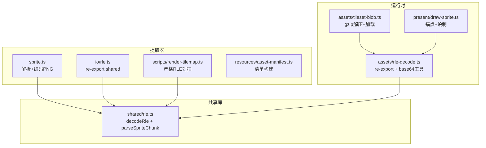
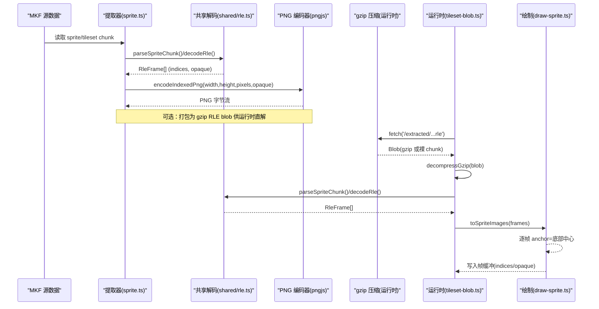
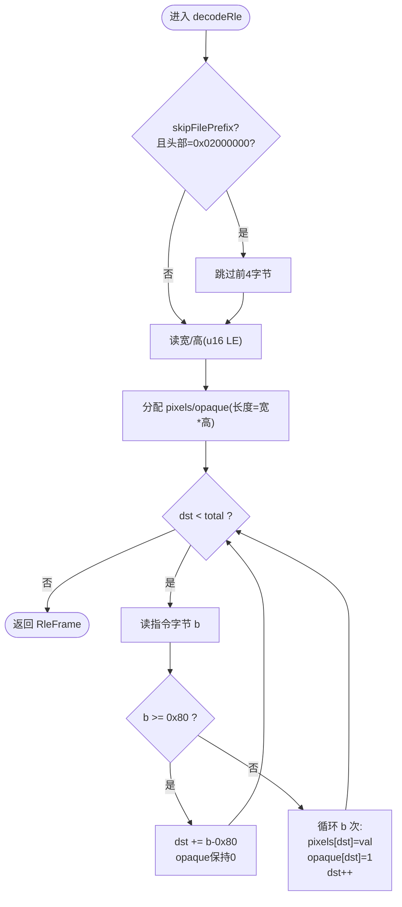
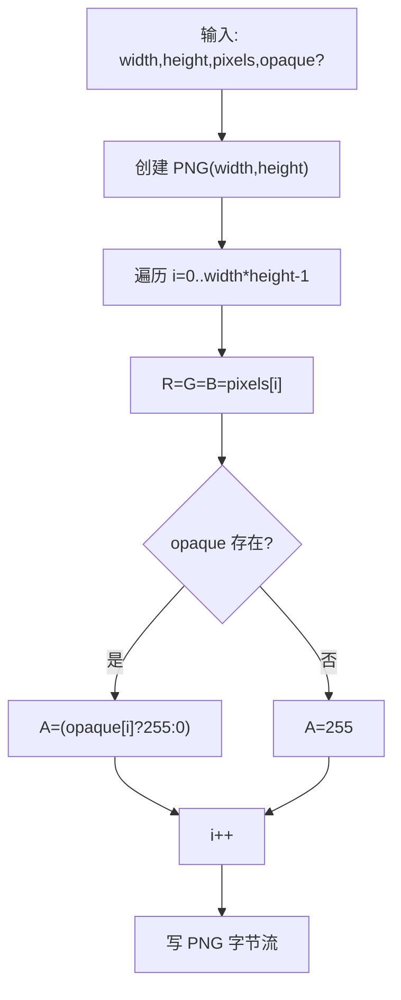
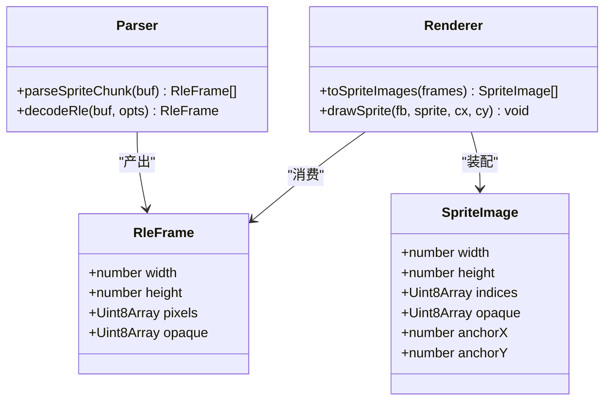
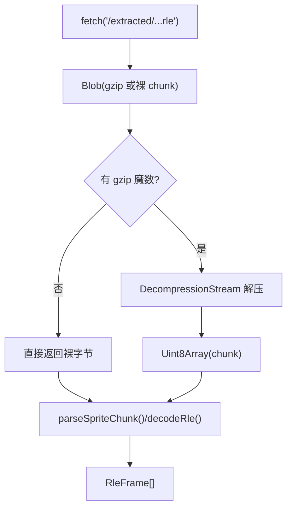
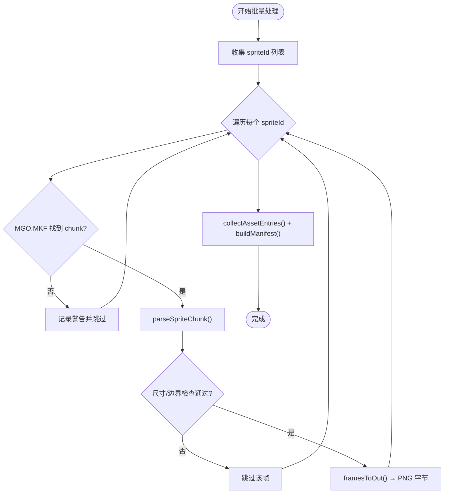
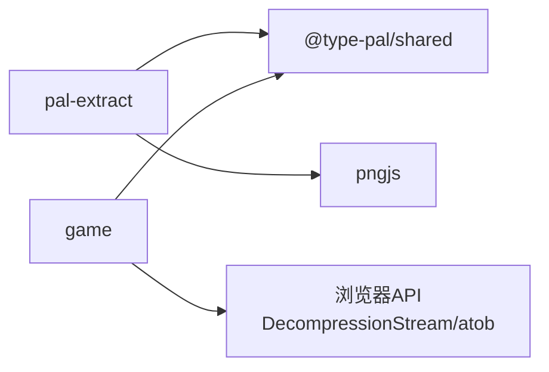

# 精灵图集转换器

<cite>
**本文引用的文件**   
- [packages/shared/src/rle.ts](file://packages/shared/src/rle.ts)
- [packages/pal-extract/src/io/rle.ts](file://packages/pal-extract/src/io/rle.ts)
- [packages/pal-extract/src/resources/sprite.ts](file://packages/pal-extract/src/resources/sprite.ts)
- [packages/game/src/assets/rle-decode.ts](file://packages/game/src/assets/rle-decode.ts)
- [packages/game/src/present/draw-sprite.ts](file://packages/game/src/present/draw-sprite.ts)
- [packages/game/src/assets/tileset-blob.ts](file://packages/game/src/assets/tileset-blob.ts)
- [packages/pal-extract/scripts/render-tilemap.ts](file://packages/pal-extract/scripts/render-tilemap.ts)
- [packages/pal-extract/src/resources/asset-manifest.ts](file://packages/pal-extract/src/resources/asset-manifest.ts)
</cite>

## 目录
1. [简介](#简介)
2. [项目结构](#项目结构)
3. [核心组件](#核心组件)
4. [架构总览](#架构总览)
5. [详细组件分析](#详细组件分析)
6. [依赖关系分析](#依赖关系分析)
7. [性能考量](#性能考量)
8. [故障排查指南](#故障排查指南)
9. [结论](#结论)
10. [附录](#附录)

## 简介
本文件面向“精灵图集转换系统”，围绕 RLE 压缩解码、PNG 输出（索引色模式与透明度）、精灵帧管理与锚点定位、资源管线优化（gzip 存储与运行时解压）以及批量处理与错误恢复进行系统化说明。目标是让读者在不深入源码的情况下，也能理解从原始 MKF chunk 到可运行图集的完整流程，并掌握关键算法与工程权衡。

## 项目结构
该子系统横跨提取器（pal-extract）、共享库（shared）与运行时（game）三个层次：
- 提取层：解析 MKF 中的 sprite/tileset chunk，按帧解码 RLE，生成 PNG 或打包为 gzip 的 RLE blob。
- 共享层：提供统一的 RLE 解码与精灵 chunk 解析逻辑，确保提取与运行一致。
- 运行层：按需解压 gzip 的 RLE blob，重建索引位图，计算每帧锚点，绘制到帧缓冲。

图表来源
- [packages/pal-extract/src/resources/sprite.ts:1-86](file://packages/pal-extract/src/resources/sprite.ts#L1-L86)
- [packages/pal-extract/src/io/rle.ts:1-7](file://packages/pal-extract/src/io/rle.ts#L1-L7)
- [packages/pal-extract/scripts/render-tilemap.ts:42-68](file://packages/pal-extract/scripts/render-tilemap.ts#L42-L68)
- [packages/shared/src/rle.ts:1-127](file://packages/shared/src/rle.ts#L1-L127)
- [packages/game/src/assets/rle-decode.ts:1-20](file://packages/game/src/assets/rle-decode.ts#L1-L20)
- [packages/game/src/present/draw-sprite.ts:1-54](file://packages/game/src/present/draw-sprite.ts#L1-L54)
- [packages/game/src/assets/tileset-blob.ts:89-111](file://packages/game/src/assets/tileset-blob.ts#L89-L111)

章节来源
- [packages/pal-extract/src/resources/sprite.ts:1-86](file://packages/pal-extract/src/resources/sprite.ts#L1-L86)
- [packages/pal-extract/src/io/rle.ts:1-7](file://packages/pal-extract/src/io/rle.ts#L1-L7)
- [packages/pal-extract/scripts/render-tilemap.ts:42-68](file://packages/pal-extract/scripts/render-tilemap.ts#L42-L68)
- [packages/shared/src/rle.ts:1-127](file://packages/shared/src/rle.ts#L1-L127)
- [packages/game/src/assets/rle-decode.ts:1-20](file://packages/game/src/assets/rle-decode.ts#L1-L20)
- [packages/game/src/present/draw-sprite.ts:1-54](file://packages/game/src/present/draw-sprite.ts#L1-L54)
- [packages/game/src/assets/tileset-blob.ts:89-111](file://packages/game/src/assets/tileset-blob.ts#L89-L111)

## 核心组件
- RLE 解码器（共享）：统一实现单帧 RLE 解码与精灵 chunk 解析，保证提取与运行一致性。
- 精灵帧导出（提取器）：将索引位图编码为 PNG（索引色模式），并在 alpha 通道承载 opaque mask。
- 运行时渲染（游戏）：根据每帧宽高计算锚点（底部中心），按 opaque mask 写入帧缓冲。
- 资源管线（运行时）：以 gzip 压缩存储 RLE blob，运行时用浏览器原生 DecompressionStream 解压，兼容 Content-Encoding 场景。
- 清单生成（提取器）：扫描 extracted 产物，生成稳定版本号的资产清单，用于离线预缓存等。

章节来源
- [packages/shared/src/rle.ts:1-127](file://packages/shared/src/rle.ts#L1-L127)
- [packages/pal-extract/src/resources/sprite.ts:1-86](file://packages/pal-extract/src/resources/sprite.ts#L1-L86)
- [packages/game/src/present/draw-sprite.ts:1-54](file://packages/game/src/present/draw-sprite.ts#L1-L54)
- [packages/game/src/assets/tileset-blob.ts:89-111](file://packages/game/src/assets/tileset-blob.ts#L89-L111)
- [packages/pal-extract/src/resources/asset-manifest.ts:1-55](file://packages/pal-extract/src/resources/asset-manifest.ts#L1-L55)

## 架构总览
下图展示从 MKF chunk 到运行时绘制的端到端数据流，包括 RLE 解码、PNG 编码、gzip 打包与运行时解压、帧锚点与绘制。

图表来源
- [packages/pal-extract/src/resources/sprite.ts:1-86](file://packages/pal-extract/src/resources/sprite.ts#L1-L86)
- [packages/shared/src/rle.ts:1-127](file://packages/shared/src/rle.ts#L1-L127)
- [packages/game/src/assets/tileset-blob.ts:89-111](file://packages/game/src/assets/tileset-blob.ts#L89-L111)
- [packages/game/src/present/draw-sprite.ts:1-54](file://packages/game/src/present/draw-sprite.ts#L1-L54)

## 详细组件分析

### RLE 压缩解码算法
- 游程编码原理
  - 指令字节 b：
    - b ≥ 0x80：跳过 b-0x80 个像素（透明，opaque=0；pixels 保持 0）。
    - b < 0x80：接下来 b 个字节为直接像素值（opaque=1；palette index 即使 0 也合法）。
  - 帧头：宽 u16 LE + 高 u16 LE。
  - 单帧整-chunk 前缀：某些数据（如 RGM 头像）在整 chunk 作为一帧时，首部带 0x00000002 文件头前缀，需跳过。通过 decodeRle(buf, { skipFilePrefix }) 控制。
- 像素重建过程
  - 初始化 width×height 的 pixels 与 opaque 数组（默认全 0）。
  - 顺序扫描指令流，按规则填充 indices 与 opaque mask。
  - 关键不变式：只有 opaque[i]=1 时 pixels[i] 才有效；opaque=0 表示 RLE-skip 透明。
- 调色板映射
  - 解码阶段不执行颜色映射，仅输出 palette index。
  - 渲染阶段由引擎查调色板填色；PNG 编码时将 index 写入 RGB 三通道，alpha 承载 opaque mask，便于调试与可视化。

图表来源
- [packages/shared/src/rle.ts:27-83](file://packages/shared/src/rle.ts#L27-L83)

章节来源
- [packages/shared/src/rle.ts:1-127](file://packages/shared/src/rle.ts#L1-L127)
- [packages/pal-extract/src/io/rle.ts:1-7](file://packages/pal-extract/src/io/rle.ts#L1-L7)
- [packages/game/src/assets/rle-decode.ts:1-20](file://packages/game/src/assets/rle-decode.ts#L1-L20)

### PNG 格式输出（IndexedColor 模式）
- 索引色模式
  - 将每个像素的 palette index 写入 R/G/B 三通道（R=G=B=index），A 通道承载 opaque mask（>0 即不透明）。
  - 优点：无需在磁盘上烘焙颜色，运行时查调色板填色，节省空间并保持灵活性。
- 颜色量化
  - 本方案不进行颜色量化；直接使用原 palette index。若未来需要减少调色板规模，可在提取阶段做量化后再编码。
- 透明度处理
  - A 通道 = 255 表示 opaque，0 表示透明。
  - 修复历史问题：之前把 palette-0 当作透明导致人物头发暗部半透明；现通过 opaque mask 区分“显式画 0”和“RLE-skip 透明”。

图表来源
- [packages/pal-extract/src/resources/sprite.ts:25-42](file://packages/pal-extract/src/resources/sprite.ts#L25-L42)

章节来源
- [packages/pal-extract/src/resources/sprite.ts:1-86](file://packages/pal-extract/src/resources/sprite.ts#L1-L86)

### 精灵帧管理（动画序列组织、尺寸计算、锚点定位）
- 动画序列组织
  - 精灵 chunk 头包含 imagecount 与帧偏移表；parseSpriteChunk 按序解析，跳过 offset=0 的空帧。
  - 键一致性铁律：返回数组下标 i 即为 tile/sprite 索引，运行时与提取器必须一致。
- 帧尺寸计算
  - 每帧独立宽高；安全守卫限制 w/h ≤ 400，避免损坏数据导致的异常大尺寸。
- 锚点定位
  - 每帧锚点 = 底部中心：anchorX = floor(width/2)，anchorY = height。
  - 绘制时 dstX = cx - anchorX，dstY = cy - anchorY，确保脚底对齐同一行，不受帧高差异影响。

图表来源
- [packages/shared/src/rle.ts:108-126](file://packages/shared/src/rle.ts#L108-L126)
- [packages/game/src/present/draw-sprite.ts:1-54](file://packages/game/src/present/draw-sprite.ts#L1-L54)

章节来源
- [packages/shared/src/rle.ts:85-127](file://packages/shared/src/rle.ts#L85-L127)
- [packages/game/src/present/draw-sprite.ts:1-54](file://packages/game/src/present/draw-sprite.ts#L1-L54)

### 资源管线优化（gzip 压缩存储、运行时解压策略、内存使用优化）
- 存储策略
  - 将 RLE 二进制打包为 gzip 的 .rle 文件，显著减小体积。
  - 文件名后缀使用 .rle 而非 .rle.gz，避免静态服务器自动添加 Content-Encoding: gzip 导致二次解压。
- 运行时解压
  - 使用浏览器原生 DecompressionStream 解压 gzip。
  - 兼容性：Chrome 80+/Safari 16.4+/Firefox 113+，SW 上下文可用。
  - 兜底：若无 DecompressionStream，抛错（后续可引入 fflate）。
- Content-Encoding 双解压防御
  - 检测 gzip 魔数 0x1f 0x8b：无魔数则上游已解压，直接返回裸 chunk，避免报错。
- 内存优化
  - 解码后复用 Uint8Array（不拷贝），减少 GC 压力。
  - 按需解压与解析，避免一次性加载全部资源。

图表来源
- [packages/game/src/assets/tileset-blob.ts:89-111](file://packages/game/src/assets/tileset-blob.ts#L89-L111)
- [packages/shared/src/rle.ts:108-126](file://packages/shared/src/rle.ts#L108-L126)

章节来源
- [packages/game/src/assets/tileset-blob.ts:89-111](file://packages/game/src/assets/tileset-blob.ts#L89-L111)
- [packages/shared/src/rle.ts:108-126](file://packages/shared/src/rle.ts#L108-L126)

### 批量处理流程与错误恢复机制
- 批量处理
  - 遍历 MGO.MKF 中指定 sprite id 集合，逐个 chunk 解析并导出帧列表。
  - 生成 asset-manifest.json：收集所有 extracted 文件路径与大小，过滤非资源项，排序后计算 SHA256 前缀作为 version。
- 错误恢复
  - 缺失 chunk：记录警告并跳过对应 sprite。
  - 空帧/越界：parseSpriteChunk 跳过 offset=0 或越界条目。
  - 尺寸异常：w/h > 400 视为损坏尾帧，跳过。
  - 网络失败：loadTilesetBlob 在 fetch 失败时抛出错误，调用方可捕获重试或降级。

图表来源
- [packages/pal-extract/src/resources/sprite.ts:70-85](file://packages/pal-extract/src/resources/sprite.ts#L70-L85)
- [packages/pal-extract/src/resources/asset-manifest.ts:27-54](file://packages/pal-extract/src/resources/asset-manifest.ts#L27-L54)

章节来源
- [packages/pal-extract/src/resources/sprite.ts:60-85](file://packages/pal-extract/src/resources/sprite.ts#L60-L85)
- [packages/pal-extract/src/resources/asset-manifest.ts:1-55](file://packages/pal-extract/src/resources/asset-manifest.ts#L1-L55)

### 严格像素对拍（tilemap 渲染）
- 背景：现有 io/rle.ts 将“透明跳过”与“显式画 0”合并成 indices[i]=0，丢失语义差异，导致 tilemap 像素级差异。
- 解决：render-tilemap.ts 自行实现 RLE 解码，保留 opaque mask，确保与 sdlpal 行为一致。

章节来源
- [packages/pal-extract/scripts/render-tilemap.ts:42-68](file://packages/pal-extract/scripts/render-tilemap.ts#L42-L68)

## 依赖关系分析
- 模块耦合
  - pal-extract 与 game 均依赖 shared/rle.ts，保证两端解码一致。
  - pal-extract 内部 re-export 共享解码器，降低维护成本。
  - game 运行时通过 rle-decode.ts re-export 共享解码器，并补充 base64 工具。
- 外部依赖
  - pngjs：用于 PNG 编码。
  - 浏览器 API：DecompressionStream、atob。
- 潜在循环依赖
  - 当前无循环依赖；shared 为纯函数库，被上层单向引用。

图表来源
- [packages/pal-extract/src/io/rle.ts:1-7](file://packages/pal-extract/src/io/rle.ts#L1-L7)
- [packages/game/src/assets/rle-decode.ts:1-20](file://packages/game/src/assets/rle-decode.ts#L1-L20)
- [packages/pal-extract/src/resources/sprite.ts:1-10](file://packages/pal-extract/src/resources/sprite.ts#L1-L10)

章节来源
- [packages/pal-extract/src/io/rle.ts:1-7](file://packages/pal-extract/src/io/rle.ts#L1-L7)
- [packages/game/src/assets/rle-decode.ts:1-20](file://packages/game/src/assets/rle-decode.ts#L1-L20)
- [packages/pal-extract/src/resources/sprite.ts:1-10](file://packages/pal-extract/src/resources/sprite.ts#L1-L10)

## 性能考量
- 解码复杂度
  - decodeRle 时间复杂度 O(N)，N=width×height；空间复杂度 O(N)。
- 内存复用
  - 解码后直接复用 Uint8Array，避免额外拷贝。
- I/O 优化
  - gzip 压缩显著减小传输体积；运行时按需解压。
  - 清单生成基于文件扫描与哈希，适合部署前一次性构建。
- 渲染优化
  - 锚点按帧自身尺寸计算，避免重复缩放与裁剪。
  - 使用 opaque mask 快速跳过透明像素，减少写入次数。

## 故障排查指南
- 现象：人物头发/眼睛等 palette-0 区域出现半透明
  - 原因：早期以“idx===0 即透明”判断，未区分 RLE-skip 与显式 0。
  - 修复：使用 opaque mask；PNG 的 A 通道承载 opaque；绘制时依据 opaque 决定是否写入。
- 现象：tilemap 像素级差异
  - 原因：通用 RLE 解码合并了透明与显式 0 的语义。
  - 修复：render-tilemap.ts 自实现严格 RLE 解码，保留 opaque mask。
- 现象：运行时解压报错 “incorrect header check”
  - 原因：上游服务器已解掉 Content-Encoding，再次解压导致魔数不符。
  - 修复：decompressGzip 先检测 gzip 魔数，无魔数直接返回裸字节。
- 现象：部分帧缺失或显示异常
  - 原因：chunk 中 frame offset=0 或损坏尾帧。
  - 修复：parseSpriteChunk 跳过无效帧；尺寸超限保护。

章节来源
- [packages/pal-extract/src/resources/sprite.ts:12-42](file://packages/pal-extract/src/resources/sprite.ts#L12-L42)
- [packages/pal-extract/scripts/render-tilemap.ts:42-68](file://packages/pal-extract/scripts/render-tilemap.ts#L42-L68)
- [packages/game/src/assets/tileset-blob.ts:89-111](file://packages/game/src/assets/tileset-blob.ts#L89-L111)
- [packages/shared/src/rle.ts:108-126](file://packages/shared/src/rle.ts#L108-L126)

## 结论
本系统通过统一的 RLE 解码器、索引色 PNG 输出、严格的 opaque mask 语义、按帧锚点定位与 gzip 资源管线，实现了从 MKF 到运行时的高保真精灵图集转换。关键设计要点在于：
- 解码与渲染分离：解码只负责 indices/opaque，颜色映射在运行时进行。
- 语义清晰：opaque mask 明确区分“透明跳过”与“显式 0”。
- 工程稳健：尺寸/边界保护、Content-Encoding 双解压防御、清单化资产版本管理。

## 附录
- 术语
  - RLE：游程编码（Run-Length Encoding）。
  - IndexedImage：索引位图，像素值为 palette index。
  - Anchor：精灵绘制时的锚点（底部中心）。
- 参考实现
  - sdlpal 行为规格位于 reference/sdlpal/，本仓库以其为真值对照。