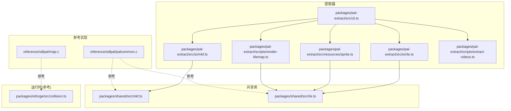
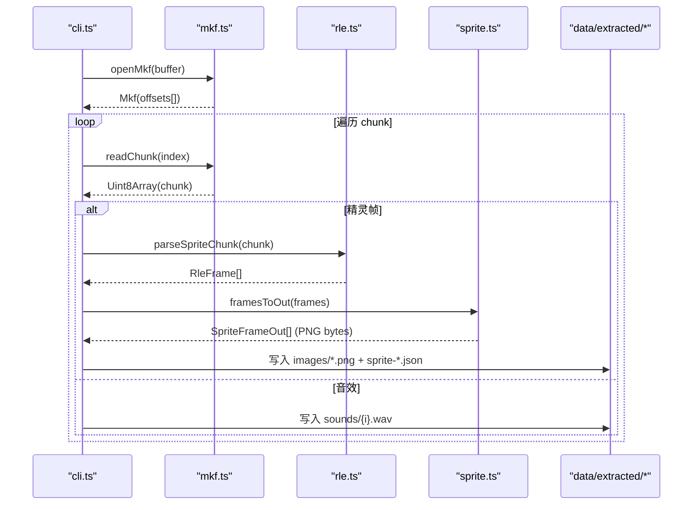
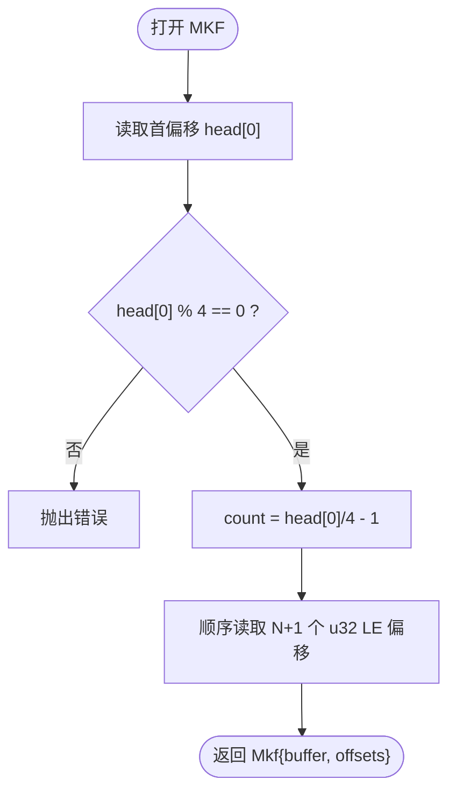
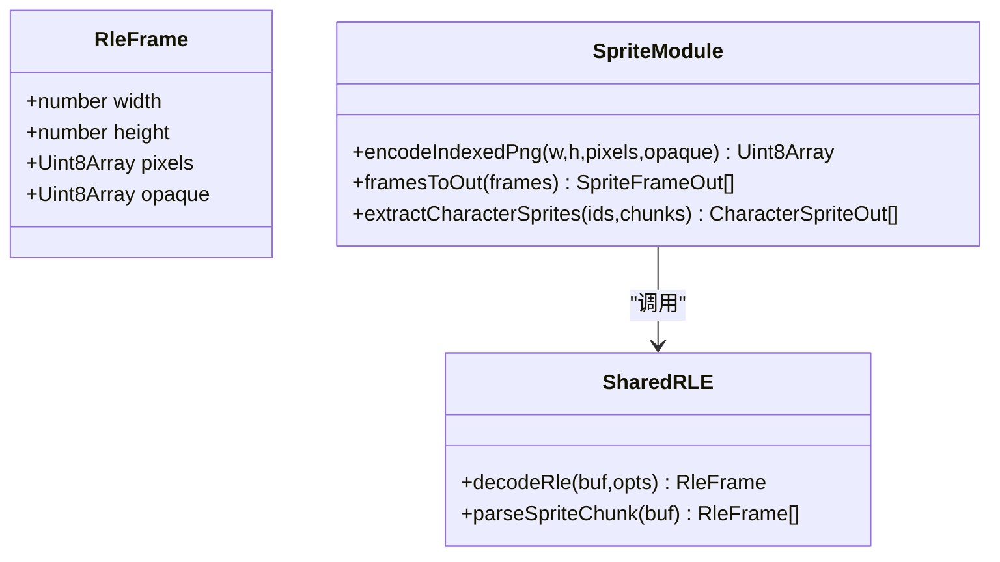
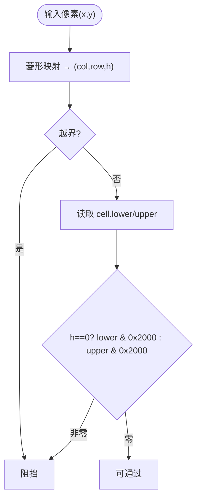
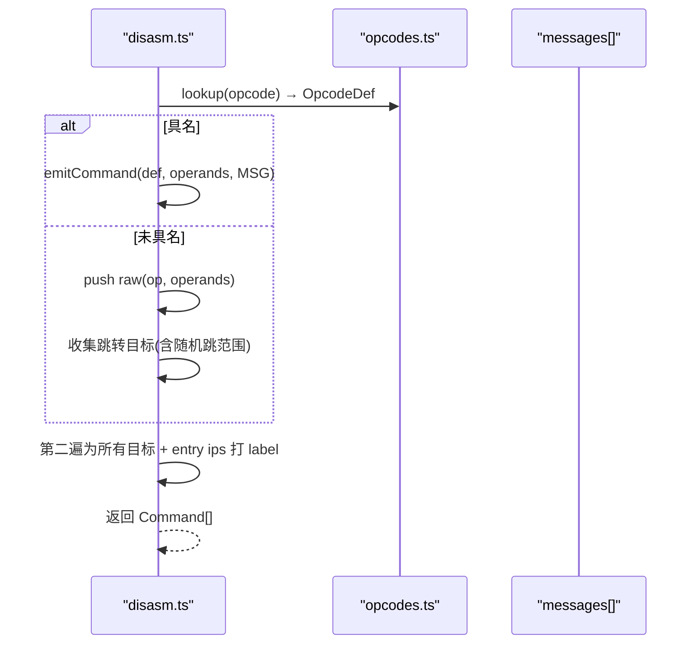
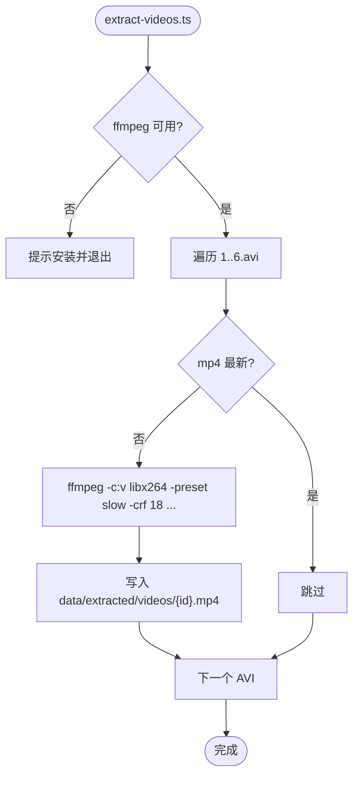
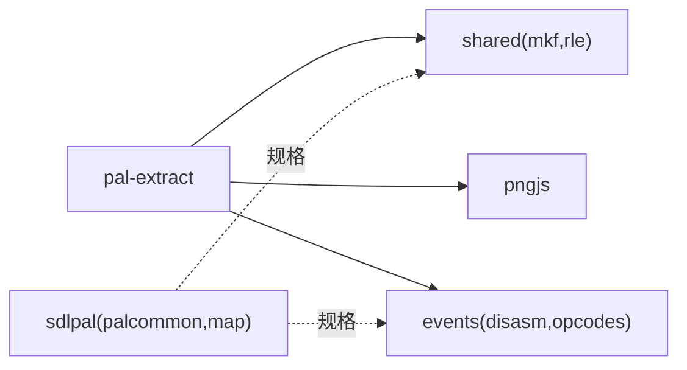

# 资源提取工具

<cite>
**本文引用的文件**   
- [packages/shared/src/mkf.ts](file://packages/shared/src/mkf.ts)
- [packages/pal-extract/src/io/mkf.ts](file://packages/pal-extract/src/io/mkf.ts)
- [packages/shared/src/rle.ts](file://packages/shared/src/rle.ts)
- [packages/pal-extract/src/io/rle.ts](file://packages/pal-extract/src/io/rle.ts)
- [packages/pal-extract/src/resources/sprite.ts](file://packages/pal-extract/src/resources/sprite.ts)
- [packages/pal-extract/scripts/render-tilemap.ts](file://packages/pal-extract/scripts/render-tilemap.ts)
- [reference/sdlpal/palcommon.c](file://reference/sdlpal/palcommon.c)
- [reference/sdlpal/map.c](file://reference/sdlpal/map.c)
- [packages/reforge/src/collision.ts](file://packages/reforge/src/collision.ts)
- [packages/reforge/src/collision.test.ts](file://packages/reforge/src/collision.test.ts)
- [packages/pal-extract/src/events/opcodes.ts](file://packages/pal-extract/src/events/opcodes.ts)
- [packages/pal-extract/src/events/disasm.ts](file://packages/pal-extract/src/events/disasm.ts)
- [packages/pal-extract/src/cli.ts](file://packages/pal-extract/src/cli.ts)
- [packages/pal-extract/scripts/extract-videos.ts](file://packages/pal-extract/scripts/extract-videos.ts)
</cite>

## 目录
1. [简介](#简介)
2. [项目结构](#项目结构)
3. [核心组件](#核心组件)
4. [架构总览](#架构总览)
5. [详细组件分析](#详细组件分析)
6. [依赖关系分析](#依赖关系分析)
7. [性能考量](#性能考量)
8. [故障排查指南](#故障排查指南)
9. [结论](#结论)
10. [附录](#附录)

## 简介
本文件面向“资源提取工具”的完整技术文档，覆盖以下目标：
- MKF 归档文件格式解析：文件头、目录索引、数据块压缩与解压。
- 精灵图集转换流程：RLE 压缩解码、调色板处理、PNG 输出。
- 地图瓦片提取：瓦片数据解析、碰撞信息提取、图层分离。
- 事件脚本反汇编：指令集定义、字节码解析、可读性重构。
- 音频视频格式转换：MIDI 音乐提取、WAV 音效转换、动画帧序列处理。
- 命令行接口使用指南与自定义解析器开发方法。

## 项目结构
仓库采用多包工作区组织，资源提取相关代码集中在 packages/pal-extract 与 packages/shared，参考实现位于 reference/sdlpal。

图表来源
- [packages/pal-extract/src/cli.ts](file://packages/pal-extract/src/cli.ts)
- [packages/pal-extract/src/io/mkf.ts](file://packages/pal-extract/src/io/mkf.ts)
- [packages/pal-extract/src/io/rle.ts](file://packages/pal-extract/src/io/rle.ts)
- [packages/pal-extract/src/resources/sprite.ts](file://packages/pal-extract/src/resources/sprite.ts)
- [packages/pal-extract/scripts/render-tilemap.ts](file://packages/pal-extract/scripts/render-tilemap.ts)
- [packages/pal-extract/scripts/extract-videos.ts](file://packages/pal-extract/scripts/extract-videos.ts)
- [packages/shared/src/mkf.ts](file://packages/shared/src/mkf.ts)
- [packages/shared/src/rle.ts](file://packages/shared/src/rle.ts)
- [reference/sdlpal/palcommon.c](file://reference/sdlpal/palcommon.c)
- [reference/sdlpal/map.c](file://reference/sdlpal/map.c)
- [packages/reforge/src/collision.ts](file://packages/reforge/src/collision.ts)

章节来源
- [packages/pal-extract/src/cli.ts](file://packages/pal-extract/src/cli.ts)
- [packages/shared/src/mkf.ts](file://packages/shared/src/mkf.ts)
- [packages/shared/src/rle.ts](file://packages/shared/src/rle.ts)

## 核心组件
- MKF 归档读取：提供 openMkf/chunkCount/readChunk，按 LE u32 偏移表定位子块。
- RLE 精灵解码：decodeRle 支持可选跳过单帧整-chunk 前缀；parseSpriteChunk 解析帧偏移表并做尺寸安全校验。
- 精灵图集导出：将索引位图编码为 PNG（R=G=B=调色板下标，A=opaque mask）。
- 脚本反汇编：opcodeTable + disasm 两遍扫描产出具名命令与标签。
- 音视频管线：SOUNDS.MKF 直接写 WAV；Musics 目录拷贝 MIDI/OGG；AVI 离线转码 MP4。

章节来源
- [packages/shared/src/mkf.ts](file://packages/shared/src/mkf.ts)
- [packages/shared/src/rle.ts](file://packages/shared/src/rle.ts)
- [packages/pal-extract/src/resources/sprite.ts](file://packages/pal-extract/src/resources/sprite.ts)
- [packages/pal-extract/src/events/opcodes.ts](file://packages/pal-extract/src/events/opcodes.ts)
- [packages/pal-extract/src/events/disasm.ts](file://packages/pal-extract/src/events/disasm.ts)
- [packages/pal-extract/src/cli.ts](file://packages/pal-extract/src/cli.ts)

## 架构总览
资源提取的整体流程如下：CLI 驱动各模块从 data/raw 读取原始数据，经 MKF 解包、RLE 解码、结构化输出到 data/extracted，同时生成 JSON/PNG/WAV/MP4 等中间产物供运行时消费。

图表来源
- [packages/pal-extract/src/cli.ts](file://packages/pal-extract/src/cli.ts)
- [packages/pal-extract/src/io/mkf.ts](file://packages/pal-extract/src/io/mkf.ts)
- [packages/shared/src/mkf.ts](file://packages/shared/src/mkf.ts)
- [packages/pal-extract/src/io/rle.ts](file://packages/pal-extract/src/io/rle.ts)
- [packages/shared/src/rle.ts](file://packages/shared/src/rle.ts)
- [packages/pal-extract/src/resources/sprite.ts](file://packages/pal-extract/src/resources/sprite.ts)

## 详细组件分析

### MKF 归档解析
- 文件头：N+1 个 u32 LE 偏移，[i] 指向第 i 个子块起始位置；子块数 = head[0]/4 - 1。
- 读取子块：根据 offsets[i]..offsets[i+1] 切片得到 chunk 字节数组。
- 与 sdlpal 对齐：openMkf/chunkCount/readChunk 语义与 PAL_MKFGetChunkCount / PAL_MKFReadChunk 一致。

图表来源
- [packages/shared/src/mkf.ts](file://packages/shared/src/mkf.ts)
- [reference/sdlpal/palcommon.c](file://reference/sdlpal/palcommon.c)

章节来源
- [packages/shared/src/mkf.ts](file://packages/shared/src/mkf.ts)
- [packages/pal-extract/src/io/mkf.ts](file://packages/pal-extract/src/io/mkf.ts)
- [reference/sdlpal/palcommon.c](file://reference/sdlpal/palcommon.c)

### 精灵图集转换（RLE 解码与 PNG 输出）
- RLE 帧头：u16 LE 宽 + u16 LE 高；指令流中 b>=0x80 表示跳过 b-0x80 像素（透明），否则读 b 个像素值（不透明）。
- 单帧整-chunk 前缀：当 skipFilePrefix=true 时，跳过 0x00000002 前缀后再读帧头。
- 精灵 chunk 解析：imagecount 作为 frame[0] 的 word-offset；每条 u16 偏移左移 1 得字节偏移；对异常帧做维度上限保护。
- PNG 编码：R=G=B=调色板下标，A=opaque mask（>0 即不透明），避免把 palette-0 误判为透明。

图表来源
- [packages/shared/src/rle.ts](file://packages/shared/src/rle.ts)
- [packages/pal-extract/src/resources/sprite.ts](file://packages/pal-extract/src/resources/sprite.ts)

章节来源
- [packages/shared/src/rle.ts](file://packages/shared/src/rle.ts)
- [packages/pal-extract/src/io/rle.ts](file://packages/pal-extract/src/io/rle.ts)
- [packages/pal-extract/src/resources/sprite.ts](file://packages/pal-extract/src/resources/sprite.ts)

### 地图瓦片提取与碰撞
- 瓦片数据：地图加载时从 GOP.MKF 读取 tile bitmap 数据，运行时通过层号与坐标获取对应 tile。
- 碰撞判定：菱形四分法将像素映射到网格坐标与子行 h，再查 cell.lower/upper 的障碍位 bit 13（0x2000）。
- 图层分离：lower/upper 分别代表底层与上层瓦片，渲染与碰撞需区分。

图表来源
- [reference/sdlpal/map.c](file://reference/sdlpal/map.c)
- [packages/reforge/src/collision.ts](file://packages/reforge/src/collision.ts)
- [packages/reforge/src/collision.test.ts](file://packages/reforge/src/collision.test.ts)

章节来源
- [reference/sdlpal/map.c](file://reference/sdlpal/map.c)
- [packages/reforge/src/collision.ts](file://packages/reforge/src/collision.ts)
- [packages/reforge/src/collision.test.ts](file://packages/reforge/src/collision.test.ts)

### 事件脚本反汇编
- 指令格式：每条 8 字节 = u16 LE opcode + 3×u16 LE 操作数。
- 指令集：opcodeTable 定义具名指令与字段类型；未具名填充 raw 占位，保证字节可逆。
- 反汇编流程：两遍扫描——第一遍翻译为 Command 并收集跳转目标；第二遍为目标打 L_ 标签；入口 ip 也打标。
- 特殊跳转：条件跳转与随机跳（0xA2）的目标收集用于切片 BFS 与标签注入。

图表来源
- [packages/pal-extract/src/events/disasm.ts](file://packages/pal-extract/src/events/disasm.ts)
- [packages/pal-extract/src/events/opcodes.ts](file://packages/pal-extract/src/events/opcodes.ts)

章节来源
- [packages/pal-extract/src/events/opcodes.ts](file://packages/pal-extract/src/events/opcodes.ts)
- [packages/pal-extract/src/events/disasm.ts](file://packages/pal-extract/src/events/disasm.ts)

### 音频与视频转换
- SFX：SOUNDS.MKF 每个非空 chunk 即为完整 RIFF/WAVE，直接写出 sounds/{i}.wav，并生成 metadata.json。
- BGM：Musics 目录下 .mid 与 .ogg 原样拷贝，生成 music-manifest.json。
- 过场动画：1~6.avi（Microsoft MPEG-4 v3 + MP3）通过 ffmpeg 离线转码为 H.264+AAC 的 mp4，增量构建。

图表来源
- [packages/pal-extract/scripts/extract-videos.ts](file://packages/pal-extract/scripts/extract-videos.ts)
- [packages/pal-extract/src/cli.ts](file://packages/pal-extract/src/cli.ts)

章节来源
- [packages/pal-extract/src/cli.ts](file://packages/pal-extract/src/cli.ts)
- [packages/pal-extract/scripts/extract-videos.ts](file://packages/pal-extract/scripts/extract-videos.ts)

## 依赖关系分析
- pal-extract 内部 re-export shared 中的 mkf/rle 能力，保持路径兼容。
- sprite 模块依赖 shared 的 RLE 解码与 pngjs 编码。
- 脚本系统依赖 opcodes 注册表与 disasm 两遍扫描逻辑。
- 参考 sdlpal 的 palcommon.c 与 map.c 作为格式与行为真值。

图表来源
- [packages/pal-extract/src/io/mkf.ts](file://packages/pal-extract/src/io/mkf.ts)
- [packages/pal-extract/src/io/rle.ts](file://packages/pal-extract/src/io/rle.ts)
- [packages/pal-extract/src/resources/sprite.ts](file://packages/pal-extract/src/resources/sprite.ts)
- [packages/pal-extract/src/events/disasm.ts](file://packages/pal-extract/src/events/disasm.ts)
- [packages/pal-extract/src/events/opcodes.ts](file://packages/pal-extract/src/events/opcodes.ts)
- [packages/shared/src/mkf.ts](file://packages/shared/src/mkf.ts)
- [packages/shared/src/rle.ts](file://packages/shared/src/rle.ts)
- [reference/sdlpal/palcommon.c](file://reference/sdlpal/palcommon.c)
- [reference/sdlpal/map.c](file://reference/sdlpal/map.c)

章节来源
- [packages/pal-extract/src/io/mkf.ts](file://packages/pal-extract/src/io/mkf.ts)
- [packages/pal-extract/src/io/rle.ts](file://packages/pal-extract/src/io/rle.ts)
- [packages/pal-extract/src/resources/sprite.ts](file://packages/pal-extract/src/resources/sprite.ts)
- [packages/pal-extract/src/events/disasm.ts](file://packages/pal-extract/src/events/disasm.ts)
- [packages/pal-extract/src/events/opcodes.ts](file://packages/pal-extract/src/events/opcodes.ts)
- [packages/shared/src/mkf.ts](file://packages/shared/src/mkf.ts)
- [packages/shared/src/rle.ts](file://packages/shared/src/rle.ts)
- [reference/sdlpal/palcommon.c](file://reference/sdlpal/palcommon.c)
- [reference/sdlpal/map.c](file://reference/sdlpal/map.c)

## 性能考量
- MKF 读取：基于 DataView 一次解析偏移表，后续 subarray 零拷贝切片，内存友好。
- RLE 解码：逐指令线性扫描，skip 与 literal 分支常数时间；对异常帧进行维度上限保护避免死循环。
- PNG 编码：RGBA 四通道复制简单直观，磁盘体积增大但实现简洁；可按需优化为索引色或专用编码器。
- 视频转码：ffmpeg preset slow + CRF 18 质量优先，适合一次性构建；增量构建通过 mtime 判断跳过重复转码。

## 故障排查指南
- MKF 头非法：首偏移非 4 倍数或计算出的 count 为负会抛错，检查输入文件是否损坏或被截断。
- 精灵帧越界：parseSpriteChunk 遇到 offset=0 或超出缓冲长度会跳过；若出现天文宽高，会被维度上限保护过滤。
- 透明与 palette-0 混淆：确保 encodeIndexedPng 传入 opaque mask，避免把 palette-0 当作透明。
- 脚本反汇编长度校验：bytecode 长度必须为 8 的倍数，否则抛错；检查 M.MSG 与脚本 chunk 对齐。
- 随机跳目标遗漏：0xA2 会相对跳到 [i+1, i+op0]，slice/BFS 需全收目标，避免运行时代码缺失。
- 视频转码失败：确认 ffmpeg 在 PATH 且参数正确；若输出为空则重新执行。

章节来源
- [packages/shared/src/mkf.ts](file://packages/shared/src/mkf.ts)
- [packages/shared/src/rle.ts](file://packages/shared/src/rle.ts)
- [packages/pal-extract/src/resources/sprite.ts](file://packages/pal-extract/src/resources/sprite.ts)
- [packages/pal-extract/src/events/disasm.ts](file://packages/pal-extract/src/events/disasm.ts)
- [packages/pal-extract/src/events/opcodes.ts](file://packages/pal-extract/src/events/opcodes.ts)
- [packages/pal-extract/scripts/extract-videos.ts](file://packages/pal-extract/scripts/extract-videos.ts)

## 结论
本资源提取工具以 sdlpal 为真值，围绕 MKF/RLE/脚本/音视频四大子系统构建了稳定、可验证的提取链路。通过共享解码器与严格的两遍反汇编，确保了提取产物与运行时的一致性；结合增量转码与详尽的错误处理，提升了工程可用性。

## 附录

### 命令行接口使用指南
- 基础提取：pnpm extract 从 data/raw 生成 data/extracted。
- 仅转码视频：pnpm -F @type-pal/pal-extract extract:videos。
- 运行测试：pnpm test 或 pnpm check 包含类型检查与回归测试。

章节来源
- [packages/pal-extract/src/cli.ts](file://packages/pal-extract/src/cli.ts)
- [packages/pal-extract/scripts/extract-videos.ts](file://packages/pal-extract/scripts/extract-videos.ts)

### 自定义解析器开发方法
- 新增 MKF 子格式：复用 openMkf/readChunk 读取 chunk，编写独立解析函数并输出 JSON/PNG/WAV 等。
- 扩展 RLE 场景：若存在带不同前缀的帧，可在 decodeRle 的 opts.skipFilePrefix 控制下统一处理。
- 扩展脚本指令：在 opcodes.ts 中补充 OpcodeDef，并在 disasm.ts 的 emitCommand 中增加对应分支，保持 round-trip 可逆。
- 集成到 CLI：在 cli.ts 中添加新的提取步骤，遵循现有命名与输出目录约定。

章节来源
- [packages/shared/src/mkf.ts](file://packages/shared/src/mkf.ts)
- [packages/shared/src/rle.ts](file://packages/shared/src/rle.ts)
- [packages/pal-extract/src/events/opcodes.ts](file://packages/pal-extract/src/events/opcodes.ts)
- [packages/pal-extract/src/events/disasm.ts](file://packages/pal-extract/src/events/disasm.ts)
- [packages/pal-extract/src/cli.ts](file://packages/pal-extract/src/cli.ts)