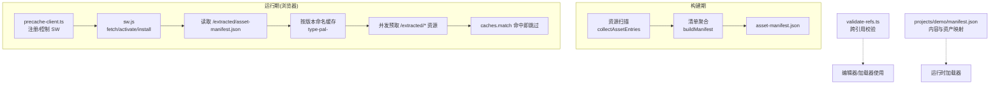
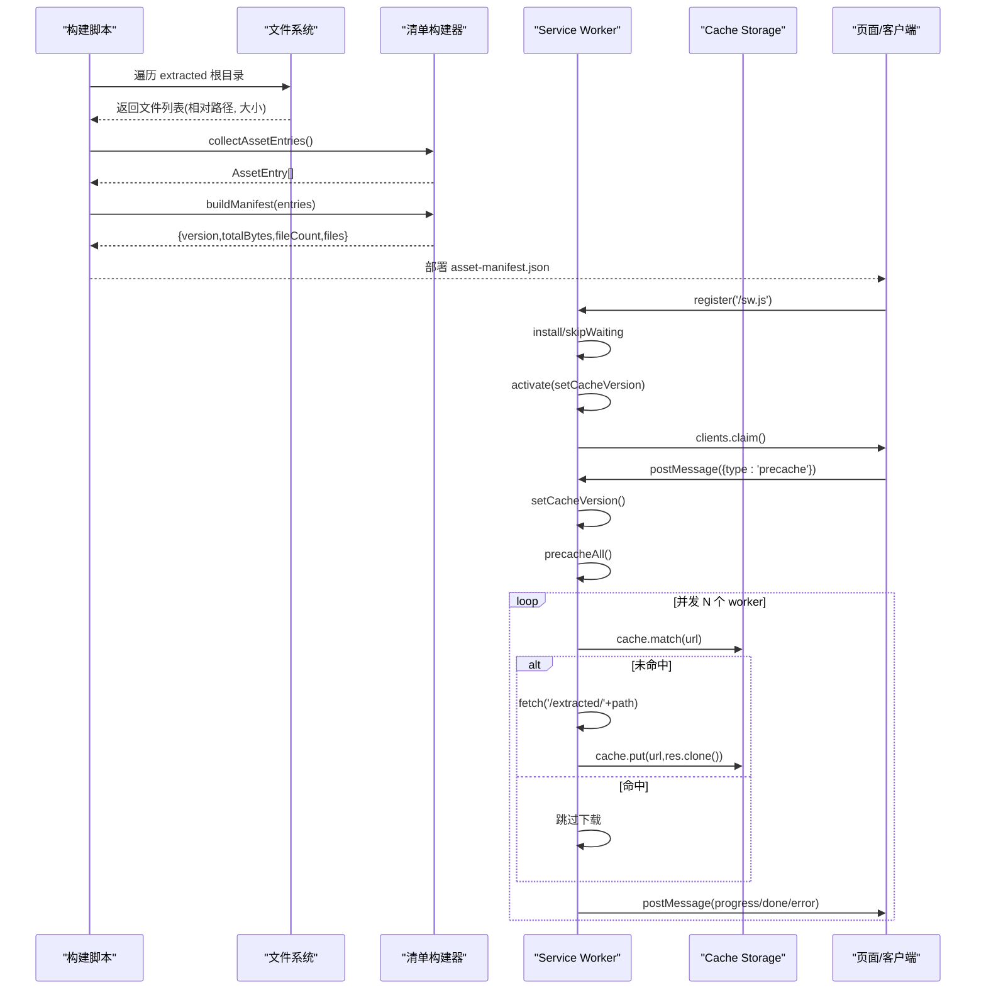
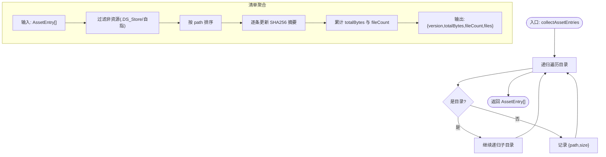
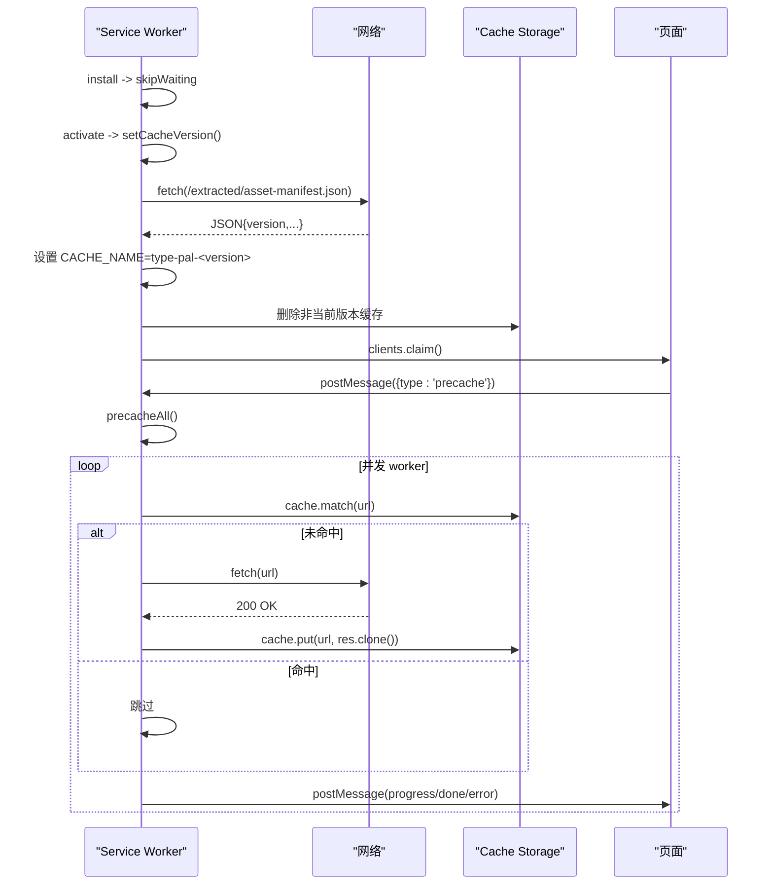
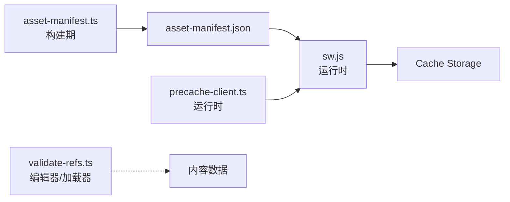

# 资源清单构建器

<cite>
**本文引用的文件**   
- [packages/pal-extract/src/resources/asset-manifest.ts](file://packages/pal-extract/src/resources/asset-manifest.ts)
- [packages/pal-extract/src/__tests__/asset-manifest.test.ts](file://packages/pal-extract/src/__tests__/asset-manifest.test.ts)
- [packages/game/public/sw.js](file://packages/game/public/sw.js)
- [packages/game/src/shell/precache-client.ts](file://packages/game/src/shell/precache-client.ts)
- [packages/content/src/validate-refs.ts](file://packages/content/src/validate-refs.ts)
- [projects/demo/manifest.json](file://projects/demo/manifest.json)
</cite>

## 目录
1. [简介](#简介)
2. [项目结构](#项目结构)
3. [核心组件](#核心组件)
4. [架构总览](#架构总览)
5. [详细组件分析](#详细组件分析)
6. [依赖关系分析](#依赖关系分析)
7. [性能与优化](#性能与优化)
8. [故障排查指南](#故障排查指南)
9. [结论](#结论)
10. [附录](#附录)

## 简介
本文件系统化阐述“资源清单构建系统”的设计与实现，覆盖清单格式、资源发现、去重与路径规范化、大小统计、与服务工作集成的预缓存配置（白名单、缓存策略、离线支持），以及清单验证与完整性检查。目标是让读者既能理解整体架构，也能快速定位到具体实现位置进行二次开发或排障。

## 项目结构
围绕资源清单的构建与消费，仓库中涉及的关键模块如下：
- 清单构建与扫描：位于提取包内，负责遍历输出目录、过滤噪声文件、生成稳定版本号的清单。
- 运行时预缓存：浏览器端 Service Worker 读取清单并后台预取资源，提供离线能力与进度上报。
- 客户端协调：在应用壳层注册 SW、控制预缓存时机（开始/暂停/恢复）。
- 内容引用校验：对数据模型间的跨表引用进行一致性检查，作为数据质量保障。
- 示例工程清单：演示内容与资产映射的组织方式。

图表来源
- [packages/pal-extract/src/resources/asset-manifest.ts:1-55](file://packages/pal-extract/src/resources/asset-manifest.ts#L1-L55)
- [packages/game/public/sw.js:1-160](file://packages/game/public/sw.js#L1-L160)
- [packages/game/src/shell/precache-client.ts:1-32](file://packages/game/src/shell/precache-client.ts#L1-L32)
- [packages/content/src/validate-refs.ts:1-43](file://packages/content/src/validate-refs.ts#L1-L43)
- [projects/demo/manifest.json:1-33](file://projects/demo/manifest.json#L1-L33)

章节来源
- [packages/pal-extract/src/resources/asset-manifest.ts:1-55](file://packages/pal-extract/src/resources/asset-manifest.ts#L1-L55)
- [packages/game/public/sw.js:1-160](file://packages/game/public/sw.js#L1-L160)
- [packages/game/src/shell/precache-client.ts:1-32](file://packages/game/src/shell/precache-client.ts#L1-L32)
- [packages/content/src/validate-refs.ts:1-43](file://packages/content/src/validate-refs.ts#L1-L43)
- [projects/demo/manifest.json:1-33](file://projects/demo/manifest.json#L1-L33)

## 核心组件
- 清单数据结构
  - 条目项：包含相对路径与字节大小。
  - 清单对象：包含版本号、总字节数、文件数量与文件列表。
- 资源发现
  - 递归遍历输出根目录，收集所有文件，统一为 POSIX 风格路径。
- 清单聚合
  - 过滤非资源文件（清单自身与 .DS_Store），按路径排序后计算稳定哈希作为 version，累计 totalBytes 与 fileCount。
- 服务工作者集成
  - 激活时拉取清单，按 manifest.version 设置缓存名前缀；仅缓存 GET 且匹配 /extracted/* 与 /assets/* 的请求；后台并发预取，断点续传。
- 客户端协调
  - 生产环境注册 SW，缓冲 startPrecache 直到 active worker 就绪；支持 precache-pause/resume 以配合开场视频播放。
- 内容引用校验
  - 定义 Issue 与 ContentBundle 接口，用于跨表引用完整性检查（错误/警告分级）。

章节来源
- [packages/pal-extract/src/resources/asset-manifest.ts:1-55](file://packages/pal-extract/src/resources/asset-manifest.ts#L1-L55)
- [packages/pal-extract/src/__tests__/asset-manifest.test.ts:1-48](file://packages/pal-extract/src/__tests__/asset-manifest.test.ts#L1-L48)
- [packages/game/public/sw.js:1-160](file://packages/game/public/sw.js#L1-L160)
- [packages/game/src/shell/precache-client.ts:1-32](file://packages/game/src/shell/precache-client.ts#L1-L32)
- [packages/content/src/validate-refs.ts:1-43](file://packages/content/src/validate-refs.ts#L1-L43)

## 架构总览
清单构建与预缓存的整体流程如下：

图表来源
- [packages/pal-extract/src/resources/asset-manifest.ts:1-55](file://packages/pal-extract/src/resources/asset-manifest.ts#L1-L55)
- [packages/game/public/sw.js:1-160](file://packages/game/public/sw.js#L1-L160)
- [packages/game/src/shell/precache-client.ts:1-32](file://packages/game/src/shell/precache-client.ts#L1-L32)

## 详细组件分析

### 清单构建器（资产清单）
- 职责
  - 扫描输出目录，过滤噪声文件，生成稳定版本号的清单。
- 关键函数
  - collectAssetEntries(rootDir): 递归遍历，产出相对路径与大小。
  - buildManifest(entries): 过滤、排序、哈希、汇总。
- 设计要点
  - 路径规范化：将 Windows 反斜杠统一为正斜杠，保证跨平台一致。
  - 去重与过滤：排除清单自身与任意目录下的 .DS_Store。
  - 稳定性：内部按 path 排序，确保相同内容产生相同 version。
  - 完整性：totalBytes/fileCount 由 files 推导，便于校验。

图表来源
- [packages/pal-extract/src/resources/asset-manifest.ts:1-55](file://packages/pal-extract/src/resources/asset-manifest.ts#L1-L55)

章节来源
- [packages/pal-extract/src/resources/asset-manifest.ts:1-55](file://packages/pal-extract/src/resources/asset-manifest.ts#L1-L55)
- [packages/pal-extract/src/__tests__/asset-manifest.test.ts:1-48](file://packages/pal-extract/src/__tests__/asset-manifest.test.ts#L1-L48)

### 服务工作者（离线预缓存）
- 职责
  - 安装后立即接管页面；激活时根据清单版本清理旧缓存；拦截静态资源请求；后台并发预取并按进度上报。
- 关键逻辑
  - shouldCache(url): 仅缓存同源 GET 且路径前缀为 /extracted/ 或 /assets/ 的资源。
  - setCacheVersion(): 拉取清单，设置 CACHE_NAME 为 type-pal-<version>，删除非当前版本的旧缓存。
  - precacheAll(): 并发 worker 循环拉取清单中的文件，命中则跳过，失败不中断，完成后上报 done。
  - message 处理: 支持 precache、precache-pause、precache-resume，配合开场视频阶段控制带宽占用。
- 缓存策略
  - 版本隔离：每个 manifest.version 对应独立缓存空间，避免新旧格式混用导致运行时崩溃。
  - 续传机制：基于 cache.match 判断是否已存在，避免重复下载。
  - 网络降级：fetch 失败不影响其他资源；运行时按需请求兜底。

图表来源
- [packages/game/public/sw.js:1-160](file://packages/game/public/sw.js#L1-L160)

章节来源
- [packages/game/public/sw.js:1-160](file://packages/game/public/sw.js#L1-L160)

### 客户端协调（预缓存控制）
- 职责
  - 在生产环境注册 SW；缓冲 startPrecache 直到 active worker 就绪；提供 pause/resume 控制。
- 关键点
  - isProd 控制是否注册 SW。
  - onReady/onUnavailable 回调处理 SW 可用性与异常。
  - 早于 ready 的 startPrecache 会被缓冲，待 active worker 就绪后补发 precache 指令。

章节来源
- [packages/game/src/shell/precache-client.ts:1-32](file://packages/game/src/shell/precache-client.ts#L1-L32)

### 内容引用校验（完整性检查）
- 职责
  - 定义 Issue 与 ContentBundle 接口，用于跨表引用完整性校验（如场景实体引用角色/技能等）。
- 使用场景
  - 编辑器侧在保存/导出时触发，阻止坏数据进入下游。
  - 加载器侧可告警弱失效引用，辅助定位问题。

章节来源
- [packages/content/src/validate-refs.ts:1-43](file://packages/content/src/validate-refs.ts#L1-L43)

### 示例工程清单（内容与资产映射）
- 作用
  - 描述游戏内容文件与资源目录的映射关系，供运行时加载器解析。
- 关键字段
  - id/name/contentVersion/entryScene：元信息。
  - content：各数据表相对路径。
  - assets：资源根与各类型资源目录。
  - startWorld：初始世界状态（队伍、金钱、技能、背包、种子属性）。

章节来源
- [projects/demo/manifest.json:1-33](file://projects/demo/manifest.json#L1-L33)

## 依赖关系分析
- 构建期
  - 清单构建器依赖 Node 标准库（fs/path/crypto），无外部第三方依赖。
- 运行期
  - Service Worker 依赖浏览器 Cache Storage API 与 Fetch API。
  - 客户端协调依赖 navigator.serviceWorker 与 postMessage 通信。
- 数据流
  - 构建期产出 asset-manifest.json → 运行时 SW 拉取 → 按版本管理缓存 → 页面接收进度事件。

图表来源
- [packages/pal-extract/src/resources/asset-manifest.ts:1-55](file://packages/pal-extract/src/resources/asset-manifest.ts#L1-L55)
- [packages/game/public/sw.js:1-160](file://packages/game/public/sw.js#L1-L160)
- [packages/game/src/shell/precache-client.ts:1-32](file://packages/game/src/shell/precache-client.ts#L1-L32)
- [packages/content/src/validate-refs.ts:1-43](file://packages/content/src/validate-refs.ts#L1-L43)

章节来源
- [packages/pal-extract/src/resources/asset-manifest.ts:1-55](file://packages/pal-extract/src/resources/asset-manifest.ts#L1-L55)
- [packages/game/public/sw.js:1-160](file://packages/game/public/sw.js#L1-L160)
- [packages/game/src/shell/precache-client.ts:1-32](file://packages/game/src/shell/precache-client.ts#L1-L32)
- [packages/content/src/validate-refs.ts:1-43](file://packages/content/src/validate-refs.ts#L1-L43)

## 性能与优化
- 去重与过滤
  - 通过过滤清单自身与 .DS_Store，避免无效条目污染 version 与体积统计。
- 路径规范化
  - 统一正斜杠路径，消除平台差异导致的重复或错配。
- 版本稳定性
  - 内部排序 + 固定序列化顺序，使相同内容在不同构建环境下产生相同 version。
- 预缓存并发
  - 并发度设为 8，充分利用带宽；断点续传减少重复下载。
- 缓存命中优先
  - 先查缓存再发起网络，显著降低首屏与后续访问延迟。
- 大任务保活
  - 使用 waitUntil 防止长任务被浏览器终止，结合 resume 机制在视频期间暂停、播完恢复。

[本节为通用指导，无需源码引用]

## 故障排查指南
- 清单版本不一致导致缓存错位
  - 现象：旧缓存命中新格式资源，出现 404 或运行时崩溃。
  - 排查：确认 manifest.version 是否变化；检查 activate 阶段是否正确清理旧缓存。
  - 参考：激活阶段按版本清理旧缓存的逻辑。
- 预缓存中途停止
  - 现象：进度停在某个百分比。
  - 排查：确认是否使用了 waitUntil 保活；是否在视频期间误触发了 precache；resume 后是否重启了 precacheAll。
  - 参考：message 处理与 precacheAll 的并发与续传逻辑。
- 客户端未触发预缓存
  - 现象：startPrecache 早于 SW ready，导致无进度。
  - 排查：确认客户端是否缓冲了 startPrecache，并在 active worker 就绪后补发。
  - 参考：客户端协调的缓冲与补发逻辑。
- 数据引用断裂
  - 现象：运行时找不到目标资源或字段。
  - 排查：使用 validate-refs 进行跨引用校验，定位 error/warn 级别问题。
  - 参考：Issue 与 ContentBundle 的定义与使用。

章节来源
- [packages/game/public/sw.js:1-160](file://packages/game/public/sw.js#L1-L160)
- [packages/game/src/shell/precache-client.ts:1-32](file://packages/game/src/shell/precache-client.ts#L1-L32)
- [packages/content/src/validate-refs.ts:1-43](file://packages/content/src/validate-refs.ts#L1-L43)

## 结论
本系统通过稳定的清单构建与严格的版本化缓存策略，实现了高效的离线预缓存与良好的用户体验。清单构建器保证了版本稳定与体积统计准确；服务工作者提供了可靠的缓存管理与并发预取；客户端协调确保了合适的启动时机与带宽分配；内容引用校验为数据质量提供了基础保障。建议持续完善自动化测试与监控指标，进一步提升系统的健壮性与可观测性。

[本节为总结，无需源码引用]

## 附录
- 清单字段说明
  - version：基于文件路径与大小的稳定哈希前缀。
  - totalBytes：所有资源字节总和。
  - fileCount：资源文件数量。
  - files：资源条目数组，每项含 path 与 size。
- 白名单规则
  - 仅缓存同源 GET 请求，且路径前缀为 /extracted/ 或 /assets/。
- 离线支持
  - 通过 Cache Storage 与 precacheAll 实现全量预取；断网情况下仍可加载已缓存资源。

[本节为补充说明，无需源码引用]