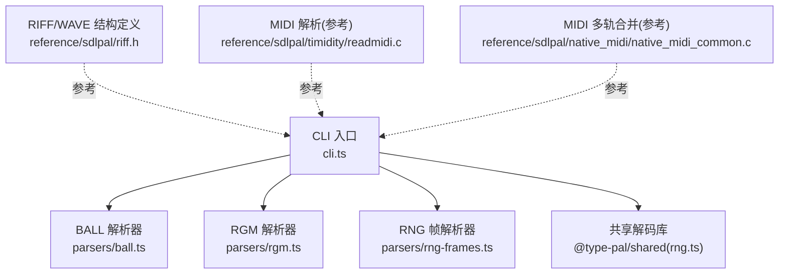
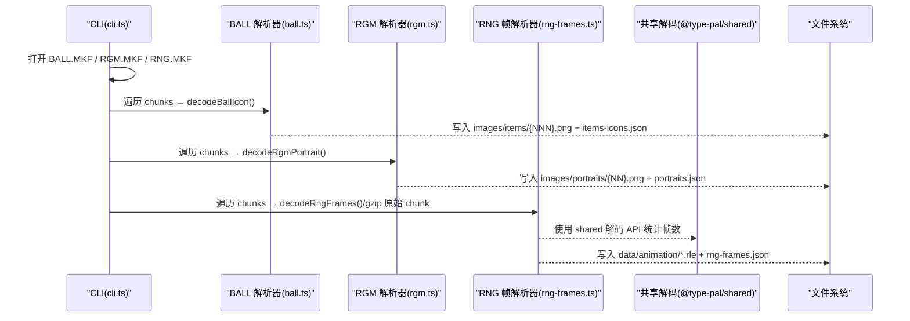
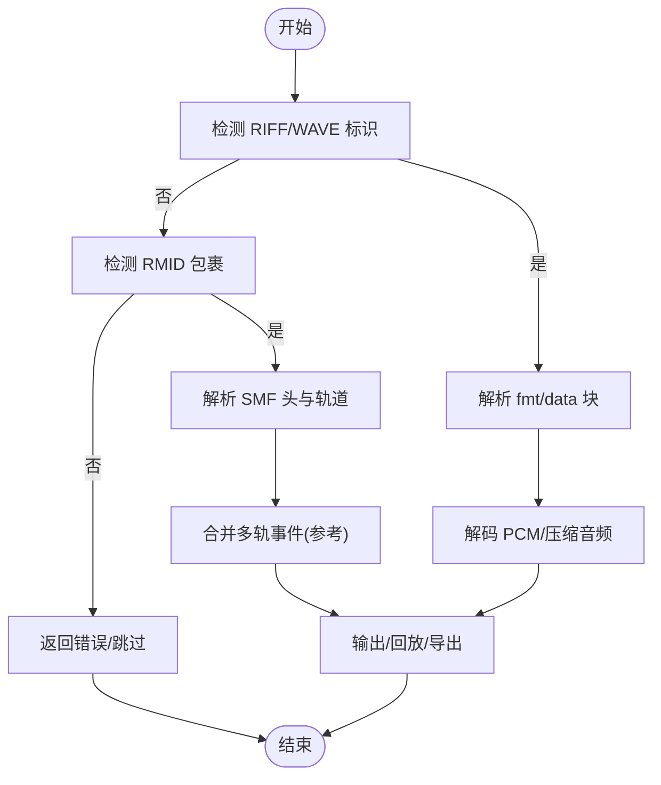
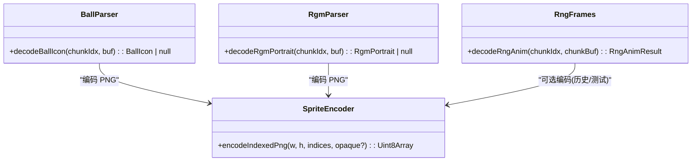
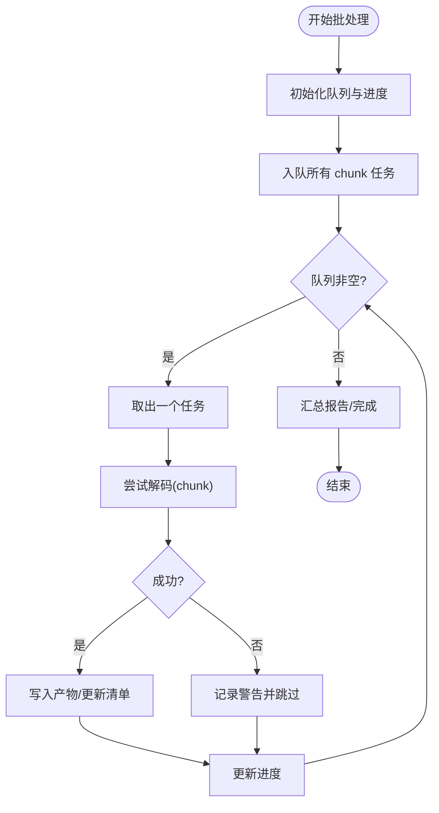
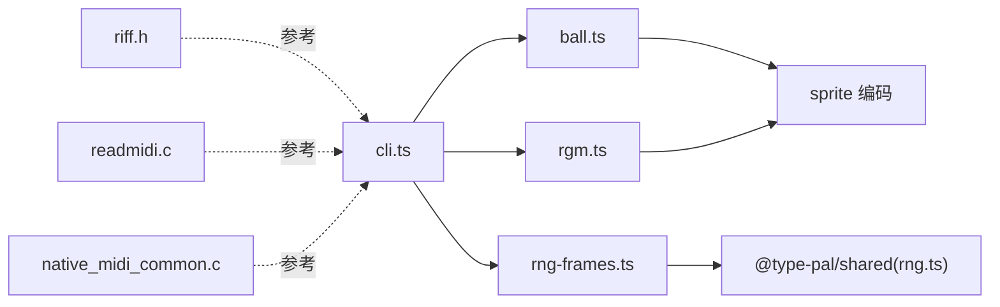

# 音视频转换器

<cite>
**本文引用的文件**   
- [packages/pal-extract/src/cli.ts](file://packages/pal-extract/src/cli.ts)
- [packages/pal-extract/src/resources/parsers/ball.ts](file://packages/pal-extract/src/resources/parsers/ball.ts)
- [packages/pal-extract/src/resources/parsers/rgm.ts](file://packages/pal-extract/src/resources/parsers/rgm.ts)
- [packages/pal-extract/src/resources/parsers/rng-frames.ts](file://packages/pal-extract/src/resources/parsers/rng-frames.ts)
- [reference/sdlpal/riff.h](file://reference/sdlpal/riff.h)
- [reference/sdlpal/timidity/readmidi.c](file://reference/sdlpal/timidity/readmidi.c)
- [reference/sdlpal/native_midi/native_midi_common.c](file://reference/sdlpal/native_midi/native_midi_common.c)
- [docs/phase1/plans/2026-05-27-m4-extract-audit.md](file://docs/phase1/plans/2026-05-27-m4-extract-audit.md)
- [docs/phase1/status/resource-status.md](file://docs/phase1/status/resource-status.md)
</cite>

## 目录
1. [简介](#简介)
2. [项目结构](#项目结构)
3. [核心组件](#核心组件)
4. [架构总览](#架构总览)
5. [详细组件分析](#详细组件分析)
6. [依赖关系分析](#依赖关系分析)
7. [性能考量](#性能考量)
8. [故障排查指南](#故障排查指南)
9. [结论](#结论)
10. [附录](#附录)

## 简介
本文件面向“音视频转换器”子系统，聚焦资源提取与格式处理管线：音频（RIFF/WAVE、MIDI）、图像（角色头像、物品图标、动画帧序列）以及特殊格式（RNG 动画、RGM 肖像、BALL 图标）。文档同时覆盖批量处理流程（并发解码、进度跟踪、错误隔离）与质量检查/格式验证策略。

## 项目结构
- 资源提取 CLI 入口位于 packages/pal-extract/src/cli.ts，负责读取原始 MKF 包、调用各解析器、输出 PNG/JSON 清单等产物。
- 专用解析器位于 resources/parsers 下：ball.ts（物品图标）、rgm.ts（角色头像）、rng-frames.ts（RNG 动画帧）。
- 参考 sdlpal 源码用于真值锚定：riff.h 定义 RIFF/WAVE 结构；timidity 子模块提供 MIDI 解析逻辑；native_midi 提供多轨事件合并等实现细节。
- 审计与状态文档记录关键修复与覆盖范围。

图表来源
- [packages/pal-extract/src/cli.ts](file://packages/pal-extract/src/cli.ts)
- [packages/pal-extract/src/resources/parsers/ball.ts](file://packages/pal-extract/src/resources/parsers/ball.ts)
- [packages/pal-extract/src/resources/parsers/rgm.ts](file://packages/pal-extract/src/resources/parsers/rgm.ts)
- [packages/pal-extract/src/resources/parsers/rng-frames.ts](file://packages/pal-extract/src/resources/parsers/rng-frames.ts)
- [reference/sdlpal/riff.h](file://reference/sdlpal/riff.h)
- [reference/sdlpal/timidity/readmidi.c](file://reference/sdlpal/timidity/readmidi.c)
- [reference/sdlpal/native_midi/native_midi_common.c](file://reference/sdlpal/native_midi/native_midi_common.c)

章节来源
- [packages/pal-extract/src/cli.ts](file://packages/pal-extract/src/cli.ts)
- [reference/sdlpal/riff.h](file://reference/sdlpal/riff.h)
- [reference/sdlpal/timidity/readmidi.c](file://reference/sdlpal/timidity/readmidi.c)
- [reference/sdlpal/native_midi/native_midi_common.c](file://reference/sdlpal/native_midi/native_midi_common.c)

## 核心组件
- BALL 物品图标解码：从 BALL.MKF 的每个 chunk 中按 RLE 位图规则解码为索引 PNG，并生成 items-icons.json 清单。
- RGM 角色头像解码：从 RGM.MKF 的每个 chunk 中按 RLE 位图规则解码为索引 PNG，并生成 portraits.json 清单。
- RNG 动画帧处理：对 RNG.MKF 的每个 chunk 执行帧级解码，产出帧计数与帧索引信息；当前优化为将原始 chunk 压缩存储，运行时再解码。
- 音频格式支持：基于 sdlpal 参考实现，理解 RIFF/WAVE 结构与 MIDI 解析要点，作为后续扩展或校验的依据。

章节来源
- [packages/pal-extract/src/resources/parsers/ball.ts](file://packages/pal-extract/src/resources/parsers/ball.ts)
- [packages/pal-extract/src/resources/parsers/rgm.ts](file://packages/pal-extract/src/resources/parsers/rgm.ts)
- [packages/pal-extract/src/resources/parsers/rng-frames.ts](file://packages/pal-extract/src/resources/parsers/rng-frames.ts)
- [reference/sdlpal/riff.h](file://reference/sdlpal/riff.h)
- [reference/sdlpal/timidity/readmidi.c](file://reference/sdlpal/timidity/readmidi.c)

## 架构总览
下图展示 CLI 到各解析器的调用关系，以及与参考实现的关联。

图表来源
- [packages/pal-extract/src/cli.ts](file://packages/pal-extract/src/cli.ts)
- [packages/pal-extract/src/resources/parsers/ball.ts](file://packages/pal-extract/src/resources/parsers/ball.ts)
- [packages/pal-extract/src/resources/parsers/rgm.ts](file://packages/pal-extract/src/resources/parsers/rgm.ts)
- [packages/pal-extract/src/resources/parsers/rng-frames.ts](file://packages/pal-extract/src/resources/parsers/rng-frames.ts)

## 详细组件分析

### 音频格式处理
- RIFF/WAVE 结构解析
  - 参考 riff.h 中的 RIFFHeader、WAVEFormatPCM、BitmapInfoHeader 等结构体与常量，用于识别 WAVE 数据块与位图信息头，确保后续解码路径正确分支。
- MIDI 音乐提取
  - readmidi.c 展示了 RMID/MIDI 头部校验、分片读取、轨道数与节拍单位解析等关键步骤，可作为提取与校验依据。
  - native_midi_common.c 的多轨事件合并逻辑可用于理解 MIDI 播放时序与事件调度，辅助构建时间轴与进度跟踪。

图表来源
- [reference/sdlpal/riff.h](file://reference/sdlpal/riff.h)
- [reference/sdlpal/timidity/readmidi.c](file://reference/sdlpal/timidity/readmidi.c)
- [reference/sdlpal/native_midi/native_midi_common.c](file://reference/sdlpal/native_midi/native_midi_common.c)

章节来源
- [reference/sdlpal/riff.h](file://reference/sdlpal/riff.h)
- [reference/sdlpal/timidity/readmidi.c](file://reference/sdlpal/timidity/readmidi.c)
- [reference/sdlpal/native_midi/native_midi_common.c](file://reference/sdlpal/native_midi/native_midi_common.c)

### 图像格式转换
- 角色头像解码（RGM）
  - 解析 RGM.MKF 的每个 chunk，跳过 4 字节文件头后按 RLE 解码，生成索引 PNG 并写入 images/portraits/{NN}.png，同时更新 portraits.json 清单。
- 物品图标提取（BALL）
  - 解析 BALL.MKF 的每个 chunk，同样跳过 4 字节文件头并按 RLE 解码，生成索引 PNG 并写入 images/items/{NNN}.png，同时更新 items-icons.json 清单。
- 动画帧序列处理（RNG）
  - 对 RNG.MKF 的每个 chunk 进行帧级解码，统计帧数与帧索引；当前优化为将原始 chunk 以 gzip 压缩存储为 *.rle，运行时由共享库解码，避免大量 PNG 体积膨胀。

图表来源
- [packages/pal-extract/src/resources/parsers/ball.ts](file://packages/pal-extract/src/resources/parsers/ball.ts)
- [packages/pal-extract/src/resources/parsers/rgm.ts](file://packages/pal-extract/src/resources/parsers/rgm.ts)
- [packages/pal-extract/src/resources/parsers/rng-frames.ts](file://packages/pal-extract/src/resources/parsers/rng-frames.ts)

章节来源
- [packages/pal-extract/src/resources/parsers/ball.ts](file://packages/pal-extract/src/resources/parsers/ball.ts)
- [packages/pal-extract/src/resources/parsers/rgm.ts](file://packages/pal-extract/src/resources/parsers/rgm.ts)
- [packages/pal-extract/src/resources/parsers/rng-frames.ts](file://packages/pal-extract/src/resources/parsers/rng-frames.ts)

### 特殊格式支持
- RNG 动画格式
  - 通过共享库解码 RNG 帧，CLI 侧仅统计帧数并保存压缩后的原始 chunk，减少 I/O 与磁盘占用。
- RGM 肖像数据
  - 与 BALL 同模式：RLE 解码 + 索引 PNG 编码，适配对话框与玩家状态界面显示。
- BALL 图标编码
  - 针对 252 个物品图标逐一解码，空 chunk 自动跳过，清单包含宽高与 chunkIndex 映射。

章节来源
- [packages/pal-extract/src/resources/parsers/rng-frames.ts](file://packages/pal-extract/src/resources/parsers/rng-frames.ts)
- [packages/pal-extract/src/resources/parsers/rgm.ts](file://packages/pal-extract/src/resources/parsers/rgm.ts)
- [packages/pal-extract/src/resources/parsers/ball.ts](file://packages/pal-extract/src/resources/parsers/ball.ts)

### 批量处理流程
- 并发解码
  - 建议在各 chunk 级别采用任务队列并行处理，限制最大并发度以避免内存峰值过高。
- 进度跟踪
  - 维护已处理/总数计数器，结合 manifest 的 frameCount/chunkIndex 字段计算整体进度百分比。
- 错误隔离
  - 单个 chunk 解码失败应记录警告并跳过，不影响其他 chunk 的处理；最终在清单中标注缺失项以便人工复核。

[此图为概念流程图，不直接映射具体源文件]

## 依赖关系分析
- CLI 与各解析器之间为单向依赖：CLI 调用解析器函数，解析器内部依赖共享解码与编码器。
- 参考 sdlpal 代码作为“规格来源”，不参与运行时代码，但指导解析行为与边界条件处理。

图表来源
- [packages/pal-extract/src/cli.ts](file://packages/pal-extract/src/cli.ts)
- [packages/pal-extract/src/resources/parsers/ball.ts](file://packages/pal-extract/src/resources/parsers/ball.ts)
- [packages/pal-extract/src/resources/parsers/rgm.ts](file://packages/pal-extract/src/resources/parsers/rgm.ts)
- [packages/pal-extract/src/resources/parsers/rng-frames.ts](file://packages/pal-extract/src/resources/parsers/rng-frames.ts)
- [reference/sdlpal/riff.h](file://reference/sdlpal/riff.h)
- [reference/sdlpal/timidity/readmidi.c](file://reference/sdlpal/timidity/readmidi.c)
- [reference/sdlpal/native_midi/native_midi_common.c](file://reference/sdlpal/native_midi/native_midi_common.c)

章节来源
- [packages/pal-extract/src/cli.ts](file://packages/pal-extract/src/cli.ts)
- [reference/sdlpal/riff.h](file://reference/sdlpal/riff.h)
- [reference/sdlpal/timidity/readmidi.c](file://reference/sdlpal/timidity/readmidi.c)
- [reference/sdlpal/native_midi/native_midi_common.c](file://reference/sdlpal/native_midi/native_midi_common.c)

## 性能考量
- RNG 动画优化：将原始 chunk 压缩存储，运行时再解码，显著降低磁盘与网络传输成本。
- 索引 PNG 编码：对头像与图标采用索引色与透明掩码，减小体积并保持与原引擎一致的显示效果。
- 并发控制：合理设置并发上限，避免解码阶段出现内存抖动；对大文件优先流式处理。

[本节为通用指导，无需特定文件引用]

## 故障排查指南
- 常见错误定位
  - RLE 解码失败：查看对应解析器的警告日志，确认 chunk 是否为空或损坏。
  - 清单不一致：比对 manifest 中的 count/frameCount 与实际输出文件数量。
  - 颜色异常：确认是否使用了正确的调色板与索引映射（尤其头像与图标）。
- 参考审计记录
  - BALL/RGM 的 RLE 解码修复记录可对照审计文档，快速定位历史问题与修复点。

章节来源
- [docs/phase1/plans/2026-05-27-m4-extract-audit.md](file://docs/phase1/plans/2026-05-27-m4-extract-audit.md)
- [docs/phase1/status/resource-status.md](file://docs/phase1/status/resource-status.md)

## 结论
本子系统围绕 CLI 驱动的资源提取管线，实现了 BALL/RGM/RNG 三类关键图像的可靠解码与输出，并以 sdlpal 参考实现为真值锚，确保格式兼容与行为一致。通过压缩与索引编码优化，兼顾了体积与性能。后续可在音频路径上进一步扩展 RIFF/WAVE 与 MIDI 的完整提取与转码能力。

## 附录
- 清单字段说明
  - items-icons.json：包含每个物品的 chunkIndex、width、height，供运行时按索引加载图标。
  - portraits.json：包含每个角色的 chunkIndex、width、height，供运行时按索引加载头像。
  - rng-frames.json：包含每个动画 chunk 的 frameCount 与 frames[index] 列表，供运行时按帧播放。

章节来源
- [packages/pal-extract/src/cli.ts](file://packages/pal-extract/src/cli.ts)