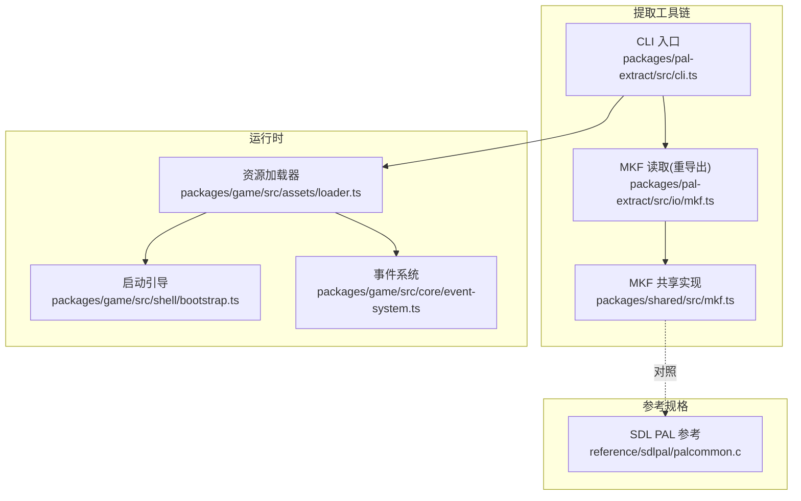
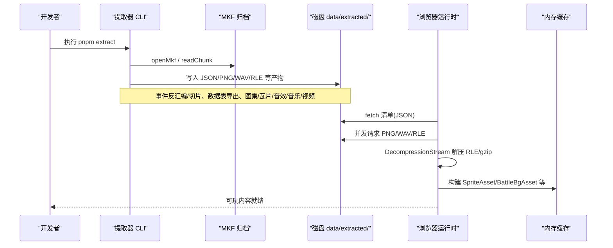
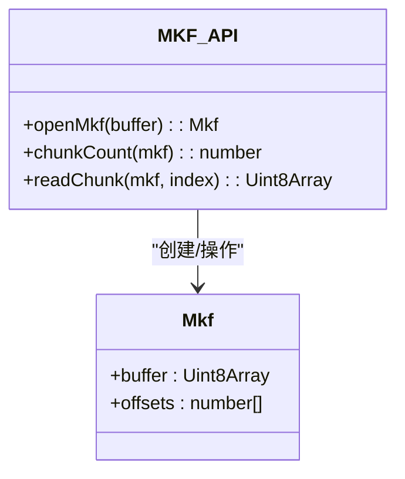
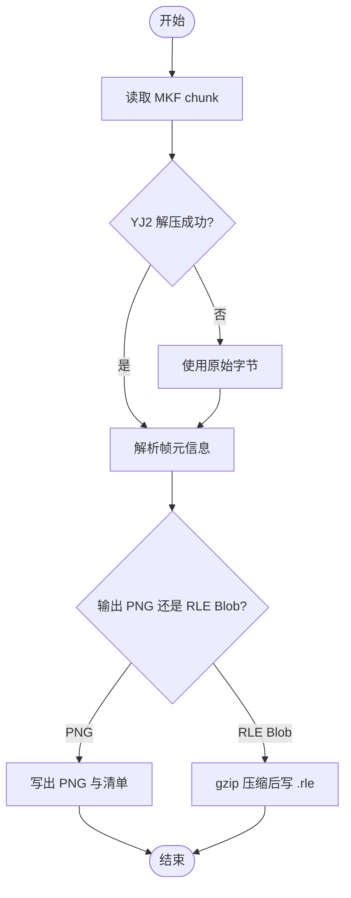
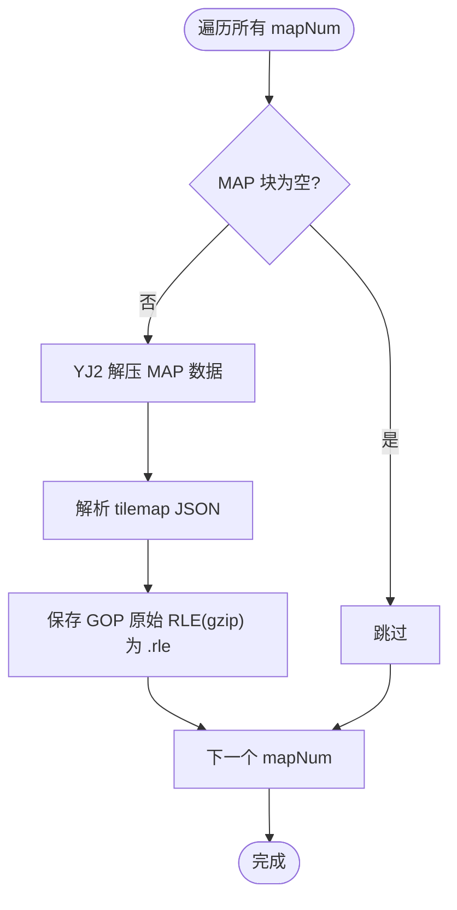
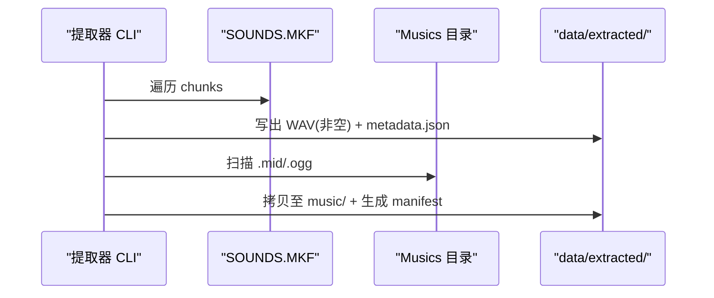
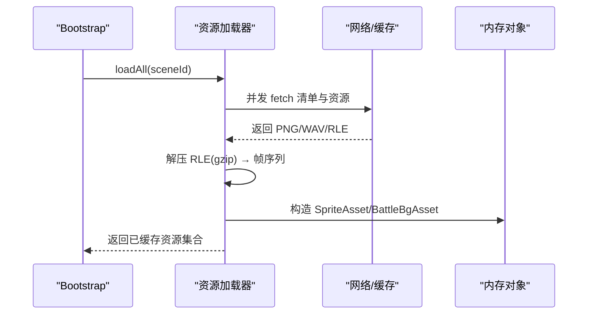
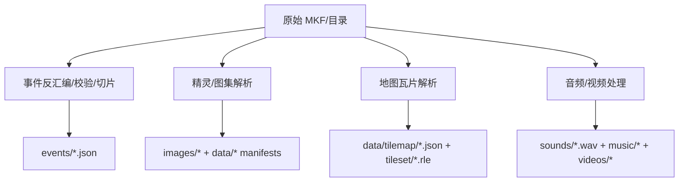
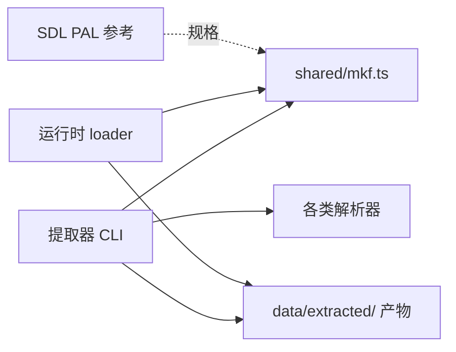

# 资源管理系统

<cite>
**本文引用的文件**   
- [README.md](file://README.md)
- [cli.ts](file://packages/pal-extract/src/cli.ts)
- [mkf.ts（提取器重导出）](file://packages/pal-extract/src/io/mkf.ts)
- [mkf.ts（共享实现）](file://packages/shared/src/mkf.ts)
- [loader.ts（游戏资源加载）](file://packages/game/src/assets/loader.ts)
- [bootstrap.ts（启动引导）](file://packages/game/src/shell/bootstrap.ts)
- [event-system.ts（事件系统）](file://packages/game/src/core/event-system.ts)
- [02-architecture.md（架构文档）](file://docs/phase1/02-architecture.md)
- [palcommon.c（SDL PAL MKF 参考）](file://reference/sdlpal/palcommon.c)
</cite>

## 目录
1. [简介](#简介)
2. [项目结构](#项目结构)
3. [核心组件](#核心组件)
4. [架构总览](#架构总览)
5. [详细组件分析](#详细组件分析)
6. [依赖关系分析](#依赖关系分析)
7. [性能考量](#性能考量)
8. [故障排查指南](#故障排查指南)
9. [结论](#结论)
10. [附录：自定义资源格式扩展指南](#附录自定义资源格式扩展指南)

## 简介
本文件系统性地说明资源管理全链路，包括从原始 MKF 归档到现代 JSON/PNG/WAV 等格式的提取与转换、运行时异步加载与缓存优化、资源管线工作流、验证与错误处理策略，以及面向未来的自定义资源格式扩展方法。目标是让具备不同技术背景的读者都能理解并高效使用该系统。

## 项目结构
仓库采用多包工作区组织，资源相关的关键位置如下：
- 提取工具链：packages/pal-extract（CLI 入口、MKF 解析、精灵图集/地图瓦片/音视频转换、数据表与事件反汇编）
- 运行时：packages/game（浏览器端资源加载、预取、缓存、事件执行、渲染消费）
- 共享库：packages/shared（MKF 归档读写等跨包复用能力）
- 参考规格：reference/sdlpal（C 源码作为行为与格式真值）
- 文档：docs（阶段规划与决策记录）

图表来源
- [cli.ts:1-800](file://packages/pal-extract/src/cli.ts#L1-L800)
- [mkf.ts（提取器重导出）:1-7](file://packages/pal-extract/src/io/mkf.ts#L1-L7)
- [mkf.ts（共享实现）:1-44](file://packages/shared/src/mkf.ts#L1-L44)
- [loader.ts（游戏资源加载）:239-277](file://packages/game/src/assets/loader.ts#L239-L277)
- [bootstrap.ts（启动引导）:215-236](file://packages/game/src/shell/bootstrap.ts#L215-L236)
- [event-system.ts（事件系统）:688-704](file://packages/game/src/core/event-system.ts#L688-L704)
- [palcommon.c（SDL PAL MKF 参考）:907-1136](file://reference/sdlpal/palcommon.c#L907-L1136)

章节来源
- [README.md:1-139](file://README.md#L1-L139)
- [02-architecture.md（架构文档）:34-79](file://docs/phase1/02-architecture.md#L34-L79)

## 核心组件
- MKF 归档解析：提供 openMkf/chunkCount/readChunk 等基础能力，严格遵循 SDL PAL 的偏移表与字节序约定。
- 精灵图集转换：将 RLE/YJ2 压缩的 sprite chunk 解码为索引位图，并以 PNG 或 gzip+RLE blob 形式输出；支持 NPC、战斗角色、魔法特效、UI 帧等。
- 地图瓦片处理：按 mapNum 去重生成 tileset 与 tilemap JSON，tileset 以 gzip 原始 RLE 存储，运行时按需解压。
- 音频视频转换：SOUNDS.MKF 整块 WAV 直出；Musics 目录内 MIDI/OGG 原样保留；外部脚本负责 AVI→MP4/WebM 转码。
- 运行时加载：并行 fetch + DecompressionStream 解压缩，SpriteAsset/BattleBgAsset 等内存对象缓存，避免重复 IO。
- 事件系统：事件 JSON 被“执行”而非“画出来”，通过命令总线驱动 UI/音频/场景切换等表现层。

章节来源
- [cli.ts:1-800](file://packages/pal-extract/src/cli.ts#L1-L800)
- [mkf.ts（共享实现）:1-44](file://packages/shared/src/mkf.ts#L1-L44)
- [loader.ts（游戏资源加载）:239-277](file://packages/game/src/assets/loader.ts#L239-L277)
- [bootstrap.ts（启动引导）:215-236](file://packages/game/src/shell/bootstrap.ts#L215-L236)
- [event-system.ts（事件系统）:688-704](file://packages/game/src/core/event-system.ts#L688-L704)
- [02-architecture.md（架构文档）:34-79](file://docs/phase1/02-architecture.md#L34-L79)

## 架构总览
下图展示从原始 MKF 到现代资源的完整流水线，以及运行时的加载路径。

图表来源
- [cli.ts:1-800](file://packages/pal-extract/src/cli.ts#L1-L800)
- [mkf.ts（共享实现）:1-44](file://packages/shared/src/mkf.ts#L1-L44)
- [loader.ts（游戏资源加载）:239-277](file://packages/game/src/assets/loader.ts#L239-L277)
- [bootstrap.ts（启动引导）:215-236](file://packages/game/src/shell/bootstrap.ts#L215-L236)

## 详细组件分析

### MKF 归档解析
- 设计要点
  - 头为 N+1 个 u32 LE 偏移，子文件数由首偏移推导。
  - 严格校验对齐与范围，越界抛错，便于早期发现损坏数据。
  - 提取器与运行时共用同一实现，保证一致性。
- 复杂度
  - openMkf：O(N) 扫描偏移表；readChunk：O(L) 返回子数组视图（零拷贝）。
- 依赖关系
  - 提取器 io/mkf.ts 仅 re-export shared 实现，避免重复维护。
- 错误处理
  - 非法头长度、非 4 字节对齐、负计数、越界访问均抛出明确错误。

图表来源
- [mkf.ts（共享实现）:1-44](file://packages/shared/src/mkf.ts#L1-L44)
- [mkf.ts（提取器重导出）:1-7](file://packages/pal-extract/src/io/mkf.ts#L1-L7)
- [palcommon.c（SDL PAL MKF 参考）:907-1136](file://reference/sdlpal/palcommon.c#L907-L1136)

章节来源
- [mkf.ts（共享实现）:1-44](file://packages/shared/src/mkf.ts#L1-L44)
- [mkf.ts（提取器重导出）:1-7](file://packages/pal-extract/src/io/mkf.ts#L1-L7)
- [palcommon.c（SDL PAL MKF 参考）:907-1136](file://reference/sdlpal/palcommon.c#L907-L1136)

### 精灵图集转换
- 输入
  - MGO.FKP/F.MKF/ABC.MKF/DATA.MKF(FIRE/MAGIC/UI) 等 YJ2/RLE 压缩的 sprite chunk。
- 处理
  - 尝试 YJ2 解压，失败回退 raw；解析帧元信息（宽高、索引）。
  - 输出两种形态：PNG（适合小图标/头像/背景）与 gzip+RLE blob（后缀 .rle，避免服务器 Content-Encoding 双解压）。
- 优化
  - 每 sprite 一个 .rle 文件，显著减少文件数量与体积；运行时一次性解压并缓存帧。
- 典型路径
  - NPC/角色：data/sprite/{id}.rle
  - 战斗角色：data/battle-sprite/{kind}/{id}.rle
  - 魔法特效：data/magic/effect.rle、data/magic/fire-{NN}.rle
  - UI 帧：images/ui/frame-NN.png + data/ui-sprite/spriteui.json

图表来源
- [cli.ts:700-800](file://packages/pal-extract/src/cli.ts#L700-L800)
- [cli.ts:484-511](file://packages/pal-extract/src/cli.ts#L484-L511)
- [cli.ts:374-381](file://packages/pal-extract/src/cli.ts#L374-L381)
- [cli.ts:356-373](file://packages/pal-extract/src/cli.ts#L356-L373)

章节来源
- [cli.ts:356-381](file://packages/pal-extract/src/cli.ts#L356-L381)
- [cli.ts:484-511](file://packages/pal-extract/src/cli.ts#L484-L511)
- [cli.ts:700-800](file://packages/pal-extract/src/cli.ts#L700-L800)

### 地图瓦片处理
- 输入
  - MAP.MKF/GOP.MKF 中每个 mapNum 的 YJ2 压缩地图数据与 GOP 原始 RLE。
- 处理
  - 对每个唯一 mapNum 解析 tilemap JSON，并将 GOP 原始 RLE 以 gzip 压缩保存为 tileset/{mapNum}.rle。
  - 未被任何场景引用但非空的 map 也一并提取，便于资源浏览与未来使用。
- 运行时
  - 通过 scene→mapNum→tilemap JSON 查找，按需加载对应 .rle 并解压。

图表来源
- [cli.ts:593-654](file://packages/pal-extract/src/cli.ts#L593-L654)

章节来源
- [cli.ts:593-654](file://packages/pal-extract/src/cli.ts#L593-L654)

### 音频视频格式转换
- 音频
  - SOUNDS.MKF：每个非空 chunk 即完整 RIFF/WAVE，直接写出 sounds/{i}.wav，并生成 metadata.json。
  - Musics：MIDI 原样保留，CD 音轨 OGG 原样保留，生成 music-manifest.json。
- 视频
  - 独立脚本负责 AVI→MP4/WebM 转码，不在主提取流程中重建，避免线上误删。
- 运行时
  - 音频按 manifest 并发加载，WAV/OGG 交由浏览器原生解码。

图表来源
- [cli.ts:513-555](file://packages/pal-extract/src/cli.ts#L513-L555)

章节来源
- [cli.ts:513-555](file://packages/pal-extract/src/cli.ts#L513-L555)

### 运行时资源加载系统
- 现代资源格式设计
  - JSON 清单描述资源结构与尺寸；PNG 用于静态位图；.rle 用于高压缩比的可解压帧序列；WAV/OGG 用于音频；MIDI 原样播放。
- 异步加载策略
  - 启动期并行加载 assets、glyphs、dialogAssets；soundfont 提前下载但不阻塞关键路径。
  - 资源加载器对 battle sprites、battle backgrounds、magic effect 等采用 Promise.all 并发拉取。
- 内存管理机制
  - 将帧序列封装为 SpriteAsset，背景封装为 BattleBgAsset，避免重复解码与 IO。
  - 运行时按需解压 .rle，结果驻留内存供渲染循环复用。
- 缓存优化
  - 浏览器 HTTP 缓存 + Service Worker 离线预缓存；.rle 后缀规避服务器自动 gzip 导致的二次解压问题。

图表来源
- [bootstrap.ts（启动引导）:215-236](file://packages/game/src/shell/bootstrap.ts#L215-L236)
- [loader.ts（游戏资源加载）:239-277](file://packages/game/src/assets/loader.ts#L239-L277)

章节来源
- [bootstrap.ts（启动引导）:215-236](file://packages/game/src/shell/bootstrap.ts#L215-L236)
- [loader.ts（游戏资源加载）:239-277](file://packages/game/src/assets/loader.ts#L239-L277)

### 资源管线工作流程（从 MKF 到现代格式）
- 事件与数据表
  - 反汇编字节码 → round-trip 校验 → 标注/切片 → 输出 events/*.json 与 data/*.json。
- 图像与图集
  - 解析 sprite chunk → 选择 PNG 或 .rle 输出 → 生成清单。
- 地图与瓦片
  - 解析 tilemap → 保存 GOP 原始 RLE(gzip) → 生成 tilemap JSON。
- 音频与视频
  - SOUNDS.MKF 直出 WAV；Musics 目录原样拷贝；外部脚本转码视频。

图表来源
- [cli.ts:203-280](file://packages/pal-extract/src/cli.ts#L203-L280)
- [cli.ts:356-381](file://packages/pal-extract/src/cli.ts#L356-L381)
- [cli.ts:593-654](file://packages/pal-extract/src/cli.ts#L593-L654)
- [cli.ts:513-555](file://packages/pal-extract/src/cli.ts#L513-L555)

章节来源
- [cli.ts:203-280](file://packages/pal-extract/src/cli.ts#L203-L280)
- [cli.ts:356-381](file://packages/pal-extract/src/cli.ts#L356-L381)
- [cli.ts:593-654](file://packages/pal-extract/src/cli.ts#L593-L654)
- [cli.ts:513-555](file://packages/pal-extract/src/cli.ts#L513-L555)

## 依赖关系分析
- 模块耦合
  - 提取器 CLI 强依赖 io/mkf.ts（再转发至 shared），并集中编排各资源解析器。
  - 运行时 loader 依赖清单 JSON 与资源 URL 规范，与提取器产出路径一一对应。
- 外部依赖
  - SDL PAL 参考实现作为格式与行为的权威来源，确保一致性。
- 潜在风险
  - 路径变更需同步更新提取器与运行时两处；建议通过清单与常量集中管理。

图表来源
- [cli.ts:1-800](file://packages/pal-extract/src/cli.ts#L1-L800)
- [mkf.ts（共享实现）:1-44](file://packages/shared/src/mkf.ts#L1-L44)
- [loader.ts（游戏资源加载）:239-277](file://packages/game/src/assets/loader.ts#L239-L277)
- [palcommon.c（SDL PAL MKF 参考）:907-1136](file://reference/sdlpal/palcommon.c#L907-L1136)

章节来源
- [cli.ts:1-800](file://packages/pal-extract/src/cli.ts#L1-L800)
- [mkf.ts（共享实现）:1-44](file://packages/shared/src/mkf.ts#L1-L44)
- [loader.ts（游戏资源加载）:239-277](file://packages/game/src/assets/loader.ts#L239-L277)
- [palcommon.c（SDL PAL MKF 参考）:907-1136](file://reference/sdlpal/palcommon.c#L907-L1136)

## 性能考量
- 传输体积
  - 使用 gzip+RLE .rle 替代大量 per-frame PNG，显著降低带宽与缓存占用。
  - 正确命名 .rle 避免服务器 Content-Encoding 自动 gzip 导致的双解压问题。
- 解码开销
  - 运行时在首次使用时解压并缓存帧，后续渲染零额外 CPU 开销。
- 并发与优先级
  - 启动期并行加载 assets/glyphs/dialogAssets；soundfont 后台下载不阻塞关键路径。
- 缓存命中
  - 浏览器 HTTP 缓存 + SW 离线预缓存，提升二次启动速度。

[本节为通用指导，无需特定文件来源]

## 故障排查指南
- 常见错误
  - MKF 越界或头异常：检查 openMkf 抛出的错误信息，确认输入文件完整性。
  - YJ2 解压失败：部分 chunk 可能未压缩，代码已做 try/catch 回退 raw；若仍失败，核对源数据。
  - 资源 404：确认提取器是否清理了旧产物且重新生成；注意 videos/ 目录由独立脚本生成，不应被主流程删除。
  - 文本 tofu：loadGlyphs 失败会降级显示占位符，不影响可运行性。
- 定位步骤
  - 查看控制台 warn/error 日志，定位具体资源名与类型。
  - 对比 data/extracted 清单与实际文件是否存在。
  - 使用 sdlpal 参考实现进行差分比对，确认格式一致性。

章节来源
- [cli.ts:172-188](file://packages/pal-extract/src/cli.ts#L172-L188)
- [cli.ts:253-259](file://packages/pal-extract/src/cli.ts#L253-L259)
- [cli.ts:484-511](file://packages/pal-extract/src/cli.ts#L484-L511)
- [bootstrap.ts（启动引导）:215-236](file://packages/game/src/shell/bootstrap.ts#L215-L236)

## 结论
该资源管理系统以 SDL PAL 为真值锚点，构建了从 MKF 到现代格式的稳健提取管线，并在运行时采用并发加载、按需解压与内存缓存策略，兼顾体积与性能。通过清单化与路径规范化，降低了耦合与维护成本。未来可在 schema 校验与可视化编辑器方面进一步增强，以提升内容生产与迭代效率。

[本节为总结性内容，无需特定文件来源]

## 附录：自定义资源格式扩展指南
- 新增一种资源类型的步骤
  1. 定义清单字段与 URL 规范（JSON 清单 + 二进制/图片/音频文件）。
  2. 在提取器 CLI 中添加解析与输出逻辑，遵循现有命名与目录约定。
  3. 在运行时 loader 中增加对应的加载与缓存逻辑，保持并发与错误处理风格一致。
  4. 补充单测与 baseline，确保与 sdlpal 参考行为一致。
- 注意事项
  - 优先使用 .rle 存储可解压帧序列，避免过多小 PNG 带来的请求放大。
  - 清单与路径变更需同步更新提取器与运行时两处，建议使用常量集中管理。
  - 对于大单体资源（如 soundfont），采用后台下载与门控策略，避免阻塞关键路径。

[本节为通用指导，无需特定文件来源]