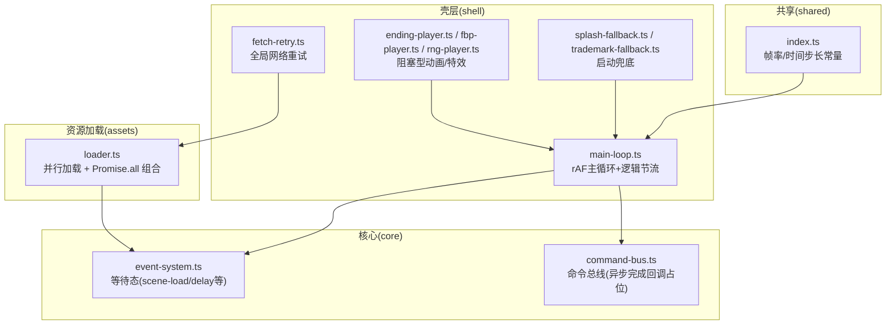
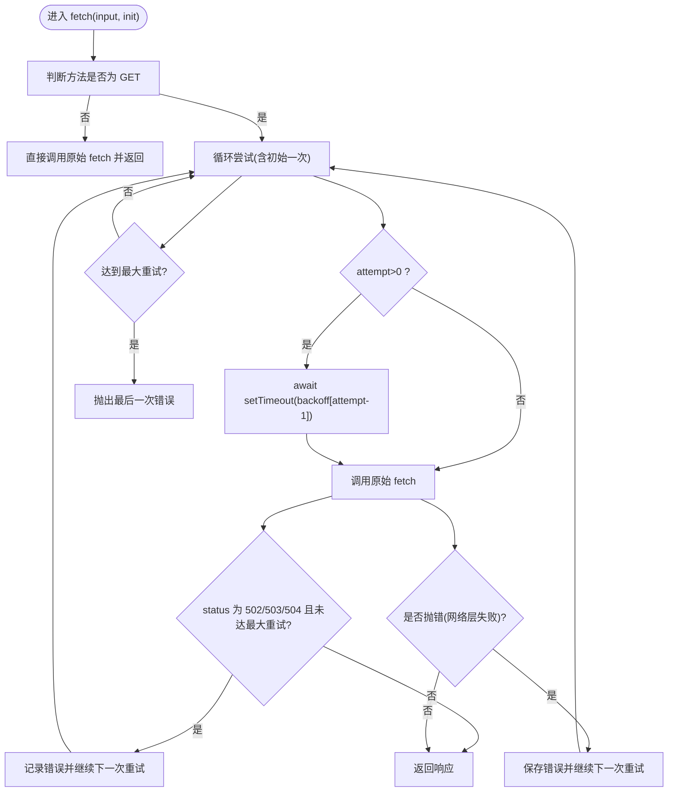
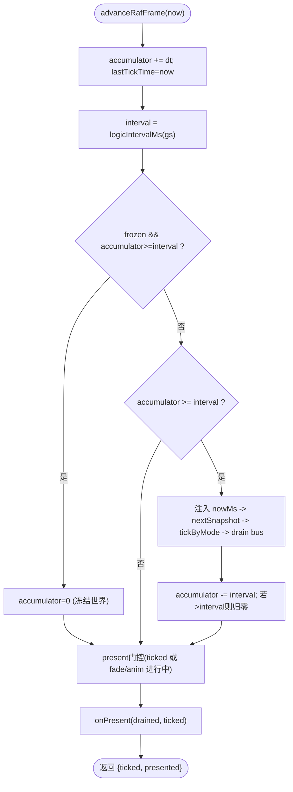
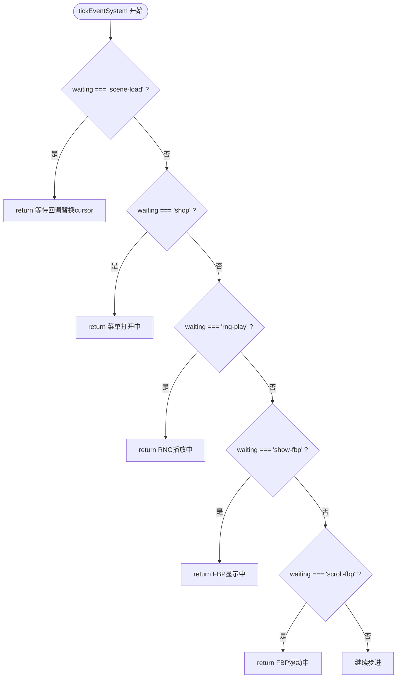
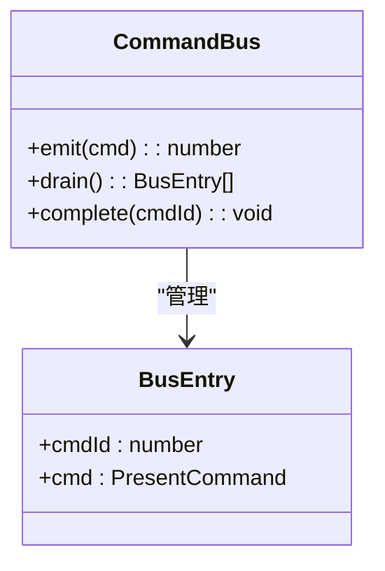
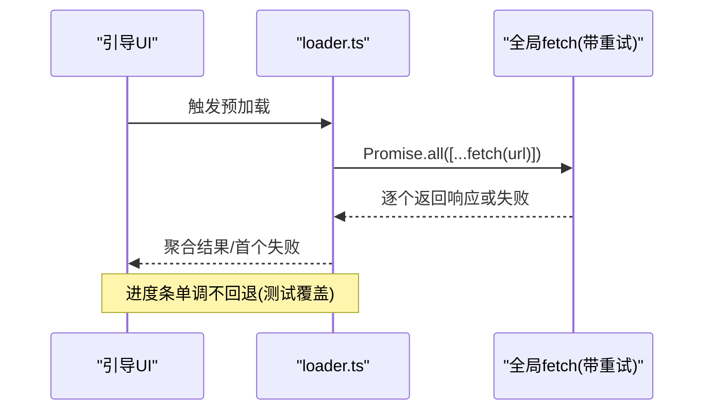
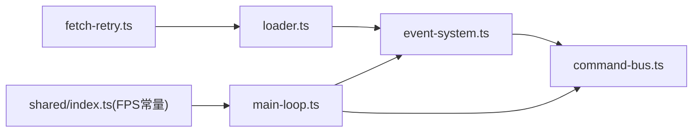

# Promise链式处理

<cite>
**本文引用的文件**   
- [packages/game/src/shell/fetch-retry.ts](file://packages/game/src/shell/fetch-retry.ts)
- [packages/game/src/shell/main-loop.ts](file://packages/game/src/shell/main-loop.ts)
- [packages/game/src/core/event-system.ts](file://packages/game/src/core/event-system.ts)
- [packages/game/src/core/command-bus.ts](file://packages/game/src/core/command-bus.ts)
- [packages/game/src/assets/loader.ts](file://packages/game/src/assets/loader.ts)
- [packages/game/src/shell/boot-loading.test.ts](file://packages/game/src/shell/boot-loading.test.ts)
- [packages/game/src/shell/ending-player.ts](file://packages/game/src/shell/ending-player.ts)
- [packages/game/src/shell/fbp-player.ts](file://packages/game/src/shell/fbp-player.ts)
- [packages/game/src/shell/rng-player.ts](file://packages/game/src/shell/rng-player.ts)
- [packages/game/src/shell/splash-fallback.ts](file://packages/game/src/shell/splash-fallback.ts)
- [packages/game/src/shell/trademark-fallback.ts](file://packages/game/src/shell/trademark-fallback.ts)
- [packages/game/src/dev/state-dump.ts](file://packages/game/src/dev/state-dump.ts)
- [packages/shared/src/index.ts](file://packages/shared/src/index.ts)
</cite>

## 目录
1. [引言](#引言)
2. [项目结构](#项目结构)
3. [核心组件](#核心组件)
4. [架构总览](#架构总览)
5. [详细组件分析](#详细组件分析)
6. [依赖关系分析](#依赖关系分析)
7. [性能考量](#性能考量)
8. [故障排查指南](#故障排查指南)
9. [结论](#结论)
10. [附录](#附录)

## 引言
本文件围绕“Promise链式处理系统”在仓库中的实现与使用进行系统化说明，聚焦以下目标：
- 链式调用封装、错误传播机制、结果聚合策略
- 超时控制（全局、单任务、重试退避）
- Promise工具函数（allSettled增强、race条件处理、延迟执行器）
- 错误处理策略（统一捕获、降级、恢复）
- 性能优化（并发池化、微任务优化、内存泄漏防护）
- 调试支持（追踪、耗时统计、失败原因分析）

## 项目结构
本项目采用多包结构，与Promise链式处理相关的代码主要分布在游戏壳层（shell）、资源加载（assets）、主循环（main-loop）、事件系统（event-system）以及共享常量（shared）。



图示来源
- [packages/game/src/shell/fetch-retry.ts:1-58](file://packages/game/src/shell/fetch-retry.ts#L1-L58)
- [packages/game/src/shell/main-loop.ts:1-182](file://packages/game/src/shell/main-loop.ts#L1-L182)
- [packages/game/src/core/event-system.ts:1594-1623](file://packages/game/src/core/event-system.ts#L1594-L1623)
- [packages/game/src/core/command-bus.ts:58-88](file://packages/game/src/core/command-bus.ts#L58-L88)
- [packages/game/src/assets/loader.ts:161-342](file://packages/game/src/assets/loader.ts#L161-L342)
- [packages/shared/src/index.ts:14-39](file://packages/shared/src/index.ts#L14-L39)

章节来源
- [packages/game/src/shell/main-loop.ts:1-182](file://packages/game/src/shell/main-loop.ts#L1-L182)
- [packages/shared/src/index.ts:14-39](file://packages/shared/src/index.ts#L14-L39)

## 核心组件
- 全局网络重试层：对GET请求进行幂等安全重试，按状态码与网络异常分类，指数退避。
- 主循环与节流：基于requestAnimationFrame的固定步长累积器，按模式选择逻辑间隔，避免卡顿后连追。
- 事件系统等待态：场景加载、延时、商店菜单、RNG/FBP播放等通过waiting字段挂起步进。
- 命令总线：为异步命令提供ID与完成回调占位，便于后续将异步资源与命令关联。
- 资源加载器：大量使用Promise.all进行并发加载，结合进度门控与UI反馈。
- 阻塞型动画/特效：以Promise包装setTimeout，配合主循环present门控实现平滑过渡。

章节来源
- [packages/game/src/shell/fetch-retry.ts:1-58](file://packages/game/src/shell/fetch-retry.ts#L1-L58)
- [packages/game/src/shell/main-loop.ts:49-137](file://packages/game/src/shell/main-loop.ts#L49-L137)
- [packages/game/src/core/event-system.ts:1594-1623](file://packages/game/src/core/event-system.ts#L1594-L1623)
- [packages/game/src/core/command-bus.ts:58-88](file://packages/game/src/core/command-bus.ts#L58-L88)
- [packages/game/src/assets/loader.ts:161-342](file://packages/game/src/assets/loader.ts#L161-L342)
- [packages/game/src/shell/ending-player.ts:40-40](file://packages/game/src/shell/ending-player.ts#L40-L40)
- [packages/game/src/shell/fbp-player.ts:62-62](file://packages/game/src/shell/fbp-player.ts#L62-L62)
- [packages/game/src/shell/rng-player.ts:136-138](file://packages/game/src/shell/rng-player.ts#L136-L138)

## 架构总览
下图展示从启动到运行期Promise链的关键路径：全局重试安装 → 资源并发加载 → 事件系统等待态 → 主循环驱动present。

```mermaid
sequenceDiagram
participant Boot as "引导/入口"
participant Retry as "全局重试(installFetchRetry)"
participant Loader as "资源加载(loader.ts)"
participant Bus as "命令总线(command-bus)"
participant Event as "事件系统(event-system)"
participant Loop as "主循环(main-loop)"
participant Present as "渲染(onPresent)"
Boot->>Retry : 安装全局fetch重试
Boot->>Loader : 发起批量资源请求(Promise.all)
Loader-->>Boot : 返回聚合结果或首个失败
Boot->>Event : 装载脚本/场景(可能设置 waiting='scene-load')
loop 每帧
Loop->>Event : tickByMode()
Event->>Bus : emit(cmd)/drain()
alt waiting=scene-load/delay/shop/rng-play/show-fbp/scroll-fbp
Event-->>Loop : 跳过步进
else 可推进
Event-->>Loop : 推进游标/更新状态
end
Loop->>Present : onPresent(drained, ticked)
end
```

图示来源
- [packages/game/src/shell/fetch-retry.ts:20-51](file://packages/game/src/shell/fetch-retry.ts#L20-L51)
- [packages/game/src/assets/loader.ts:161-342](file://packages/game/src/assets/loader.ts#L161-L342)
- [packages/game/src/core/event-system.ts:1594-1623](file://packages/game/src/core/event-system.ts#L1594-L1623)
- [packages/game/src/core/command-bus.ts:63-88](file://packages/game/src/core/command-bus.ts#L63-L88)
- [packages/game/src/shell/main-loop.ts:162-181](file://packages/game/src/shell/main-loop.ts#L162-L181)

## 详细组件分析

### 全局网络重试层（installFetchRetry）
- 职责：仅对GET请求进行幂等安全重试；对网络层失败与5xx网关错误进行退避重试；其他状态码原样返回。
- 关键行为：
  - 默认重试次数与退避序列可配置；首次失败后按退避数组等待。
  - 非GET请求直接透传，不重试。
  - 测试用卸载接口用于还原全局fetch。
- 错误传播：最后一次失败抛出，供上层Promise链捕获。
- 集成点：必须在进度门控初始化之前安装，确保boot-loading也能受益于重试。



图示来源
- [packages/game/src/shell/fetch-retry.ts:20-51](file://packages/game/src/shell/fetch-retry.ts#L20-L51)

章节来源
- [packages/game/src/shell/fetch-retry.ts:1-58](file://packages/game/src/shell/fetch-retry.ts#L1-L58)

### 主循环与节流（advanceRafFrame/startRafLoop）
- 职责：基于rAF的固定步长累积器，按模式选择逻辑间隔（探索/事件100ms，战斗40ms），每帧至多推进一个逻辑tick，避免卡顿后连追。
- 关键行为：
  - accumulator累加dt，超过interval时推进一次逻辑，然后减去interval并对溢出做clamp。
  - present门控：仅在逻辑tick或各类fade/动画进行中才调用onPresent，减少空转重绘。
  - 速通手动暂停冻结世界：冻结时不清accumulator，但停止推进逻辑。
- 与事件系统协作：每tick注入nowMs，事件系统据此计算delayUntilMs等。



图示来源
- [packages/game/src/shell/main-loop.ts:66-137](file://packages/game/src/shell/main-loop.ts#L66-L137)
- [packages/game/src/shell/main-loop.ts:162-181](file://packages/game/src/shell/main-loop.ts#L162-L181)
- [packages/shared/src/index.ts:14-39](file://packages/shared/src/index.ts#L14-L39)

章节来源
- [packages/game/src/shell/main-loop.ts:1-182](file://packages/game/src/shell/main-loop.ts#L1-L182)
- [packages/shared/src/index.ts:14-39](file://packages/shared/src/index.ts#L14-L39)

### 事件系统等待态（waiting 集合）
- 职责：在特定异步阶段（场景加载、延时、商店菜单、RNG/FBP播放等）挂起事件步进，避免跨帧不一致。
- 关键waiting值：
  - scene-load：等待bootstrap回调替换cursor后再继续
  - delay：根据delayUntilMs推进
  - shop：菜单打开期间阻塞
  - rng-play / show-fbp / scroll-fbp：播放中阻塞
- 与主循环协作：每tick检查waiting，命中则return跳过步进。



图示来源
- [packages/game/src/core/event-system.ts:1594-1623](file://packages/game/src/core/event-system.ts#L1594-L1623)

章节来源
- [packages/game/src/core/event-system.ts:1594-1623](file://packages/game/src/core/event-system.ts#L1594-L1623)

### 命令总线（CommandBus）
- 职责：为命令分配唯一ID，收集待消费命令，并提供完成回调占位以便未来将异步资源与命令关联。
- 关键点：
  - emit返回cmdId，drain返回当前队列并清空
  - complete目前为空实现，预留异步完成钩子



图示来源
- [packages/game/src/core/command-bus.ts:58-88](file://packages/game/src/core/command-bus.ts#L58-L88)

章节来源
- [packages/game/src/core/command-bus.ts:58-88](file://packages/game/src/core/command-bus.ts#L58-L88)

### 资源加载器（Promise.all 聚合与进度）
- 职责：并发加载资源清单与数据，使用Promise.all聚合结果；结合UI进度条与单调不回退策略。
- 关键行为：
  - 多处使用Promise.all并行拉取JSON/图集等资源
  - 测试覆盖“进度单调不回退”：当分母增大时，显示值保持上限
- 与重试层协作：由全局重试层保障GET请求的健壮性



图示来源
- [packages/game/src/assets/loader.ts:161-342](file://packages/game/src/assets/loader.ts#L161-L342)
- [packages/game/src/shell/boot-loading.test.ts:38-61](file://packages/game/src/shell/boot-loading.test.ts#L38-L61)
- [packages/game/src/shell/fetch-retry.ts:20-51](file://packages/game/src/shell/fetch-retry.ts#L20-L51)

章节来源
- [packages/game/src/assets/loader.ts:161-342](file://packages/game/src/assets/loader.ts#L161-L342)
- [packages/game/src/shell/boot-loading.test.ts:38-61](file://packages/game/src/shell/boot-loading.test.ts#L38-L61)

### 阻塞型动画/特效（Promise + setTimeout）
- 职责：以Promise包装setTimeout，配合主循环present门控实现平滑过渡（淡入/淡出/颜色渐变/全屏图/滚动卷入/RNG播放等）。
- 特点：
  - 每个特效内部返回Promise，外部可await或链式then/catch
  - 主循环在fade/anim进行中持续present，保证视觉平滑

```mermaid
sequenceDiagram
participant Caller as "调用方"
participant Effect as "特效(ending/fbp/rng等)"
participant Loop as "主循环"
Caller->>Effect : 调用特效(返回Promise)
Effect->>Effect : setTimeout(ms)
loop 每帧
Loop->>Effect : present门控放行(fade/anim)
end
Effect-->>Caller : Promise resolve
```

图示来源
- [packages/game/src/shell/ending-player.ts:40-40](file://packages/game/src/shell/ending-player.ts#L40-L40)
- [packages/game/src/shell/fbp-player.ts:62-62](file://packages/game/src/shell/fbp-player.ts#L62-L62)
- [packages/game/src/shell/rng-player.ts:136-138](file://packages/game/src/shell/rng-player.ts#L136-L138)
- [packages/game/src/shell/splash-fallback.ts:164-166](file://packages/game/src/shell/splash-fallback.ts#L164-L166)
- [packages/game/src/shell/trademark-fallback.ts:51-51](file://packages/game/src/shell/trademark-fallback.ts#L51-L51)
- [packages/game/src/shell/main-loop.ts:118-136](file://packages/game/src/shell/main-loop.ts#L118-L136)

章节来源
- [packages/game/src/shell/ending-player.ts:40-40](file://packages/game/src/shell/ending-player.ts#L40-L40)
- [packages/game/src/shell/fbp-player.ts:62-62](file://packages/game/src/shell/fbp-player.ts#L62-L62)
- [packages/game/src/shell/rng-player.ts:136-138](file://packages/game/src/shell/rng-player.ts#L136-L138)
- [packages/game/src/shell/splash-fallback.ts:164-166](file://packages/game/src/shell/splash-fallback.ts#L164-L166)
- [packages/game/src/shell/trademark-fallback.ts:51-51](file://packages/game/src/shell/trademark-fallback.ts#L51-L51)
- [packages/game/src/shell/main-loop.ts:118-136](file://packages/game/src/shell/main-loop.ts#L118-L136)

## 依赖关系分析
- 低耦合：全局重试层独立于业务逻辑，仅拦截globalThis.fetch；资源加载器与事件系统通过waiting语义解耦。
- 明确边界：主循环负责时序与present门控；事件系统负责指令步进；命令总线作为桥接。
- 潜在风险：
  - 过多Promise.all可能导致瞬时峰值并发，需结合进度门控与并发限制
  - 长时间waiting状态需确保回调能正确替换cursor/waiting，避免死锁



图示来源
- [packages/game/src/shell/fetch-retry.ts:1-58](file://packages/game/src/shell/fetch-retry.ts#L1-L58)
- [packages/game/src/assets/loader.ts:161-342](file://packages/game/src/assets/loader.ts#L161-L342)
- [packages/game/src/core/event-system.ts:1594-1623](file://packages/game/src/core/event-system.ts#L1594-L1623)
- [packages/game/src/core/command-bus.ts:58-88](file://packages/game/src/core/command-bus.ts#L58-L88)
- [packages/game/src/shell/main-loop.ts:1-182](file://packages/game/src/shell/main-loop.ts#L1-L182)
- [packages/shared/src/index.ts:14-39](file://packages/shared/src/index.ts#L14-L39)

章节来源
- [packages/game/src/shell/fetch-retry.ts:1-58](file://packages/game/src/shell/fetch-retry.ts#L1-L58)
- [packages/game/src/assets/loader.ts:161-342](file://packages/game/src/assets/loader.ts#L161-L342)
- [packages/game/src/core/event-system.ts:1594-1623](file://packages/game/src/core/event-system.ts#L1594-L1623)
- [packages/game/src/core/command-bus.ts:58-88](file://packages/game/src/core/command-bus.ts#L58-L88)
- [packages/game/src/shell/main-loop.ts:1-182](file://packages/game/src/shell/main-loop.ts#L1-L182)
- [packages/shared/src/index.ts:14-39](file://packages/shared/src/index.ts#L14-L39)

## 性能考量
- 并发控制与池化
  - 资源加载广泛使用Promise.all，适合短小资源；大清单建议引入并发池（如文档计划中提到的worker池方案）以避免峰值压力。
- 微任务优化
  - 主循环采用rAF与固定步长，避免微任务风暴；present门控减少不必要的绘制。
- 内存泄漏防护
  - 所有基于setTimeout的特效均返回Promise，建议在调用处妥善catch并在必要时清理引用；避免在长生命周期对象上持有过久的事件监听。
- 帧率与节奏
  - 逻辑间隔按模式切换，clamp防止连追；present在fade/anim期间高频刷新，保证视觉平滑。

[本节为通用指导，无需具体文件分析]

## 故障排查指南
- 全局网络问题
  - 现象：部分资源偶发失败，刷新即愈
  - 定位：确认installFetchRetry已先于进度门控安装；检查重试次数与退避配置
  - 参考：[packages/game/src/shell/fetch-retry.ts:1-58](file://packages/game/src/shell/fetch-retry.ts#L1-L58)
- 进度条回退
  - 现象：新请求发起导致进度百分比回退
  - 定位：检查进度门控实现是否维护“最大值不回退”
  - 参考：[packages/game/src/shell/boot-loading.test.ts:47-61](file://packages/game/src/shell/boot-loading.test.ts#L47-L61)
- 事件卡住
  - 现象：场景切换或延时后无推进
  - 定位：检查waiting集合是否被正确清除；确认bootstrap回调替换了cursor
  - 参考：[packages/game/src/core/event-system.ts:1594-1623](file://packages/game/src/core/event-system.ts#L1594-L1623)
- 主循环卡顿
  - 现象：卡顿后出现瞬移或跳帧
  - 定位：确认accumulator clamp与“永不补帧”策略生效
  - 参考：[packages/game/src/shell/main-loop.ts:90-116](file://packages/game/src/shell/main-loop.ts#L90-L116)
- 调试与回放
  - 启用state dump：URL参数tp_dump=1，导出NDJSON逐帧状态
  - 参考：[packages/game/src/dev/state-dump.ts:68-106](file://packages/game/src/dev/state-dump.ts#L68-L106)

章节来源
- [packages/game/src/shell/fetch-retry.ts:1-58](file://packages/game/src/shell/fetch-retry.ts#L1-L58)
- [packages/game/src/shell/boot-loading.test.ts:47-61](file://packages/game/src/shell/boot-loading.test.ts#L47-L61)
- [packages/game/src/core/event-system.ts:1594-1623](file://packages/game/src/core/event-system.ts#L1594-L1623)
- [packages/game/src/shell/main-loop.ts:90-116](file://packages/game/src/shell/main-loop.ts#L90-L116)
- [packages/game/src/dev/state-dump.ts:68-106](file://packages/game/src/dev/state-dump.ts#L68-L106)

## 结论
本仓库在Promise链式处理方面形成了清晰的层次：全局重试保障网络健壮性，资源加载器以Promise.all聚合并发，事件系统通过waiting语义协调异步阶段，主循环以固定步长与present门控保证稳定节奏与流畅呈现。结合state dump与测试用例，可在复杂异步链路中进行有效定位与回归验证。

[本节为总结，无需具体文件分析]

## 附录
- 术语
  - waiting：事件系统用于挂起步进的状态标记
  - accumulator：主循环累积器，用于节流与防连追
  - present门控：决定是否调用onPresent的条件集合
- 相关常量
  - 探索/事件帧间隔、战斗帧间隔、淡入淡出帧间隔定义见共享模块

章节来源
- [packages/shared/src/index.ts:14-39](file://packages/shared/src/index.ts#L14-L39)