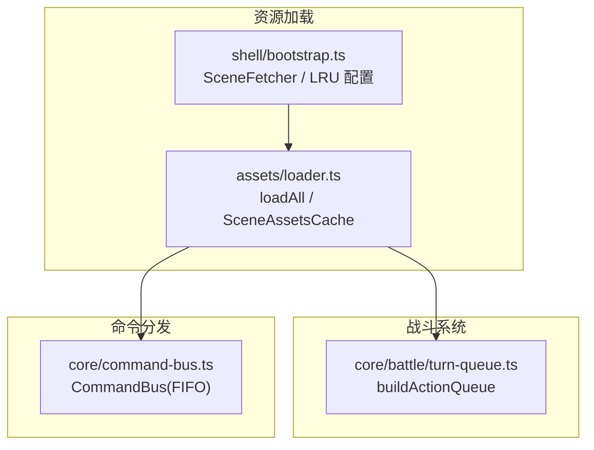
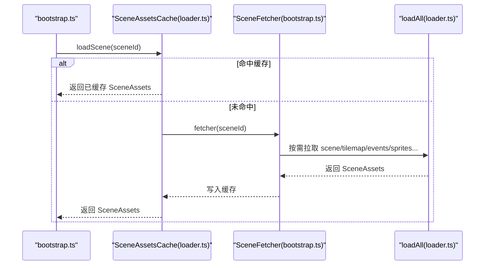
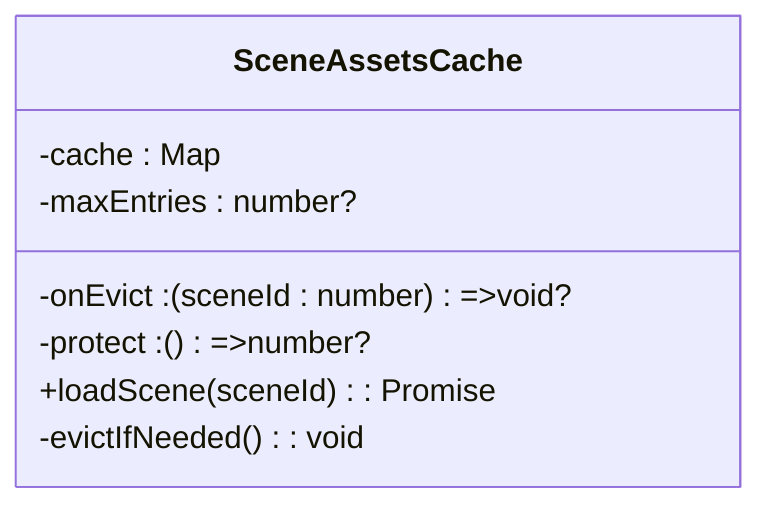
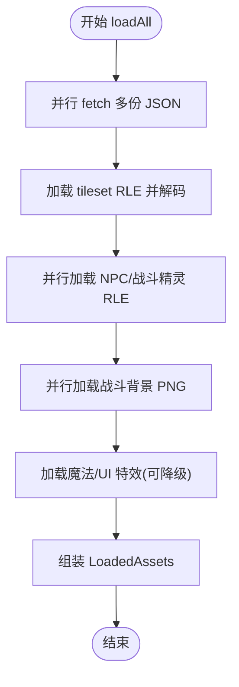
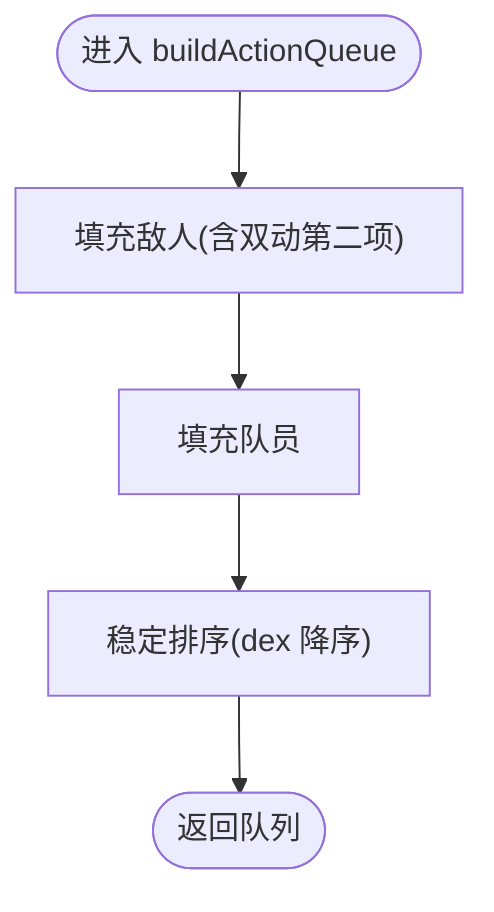
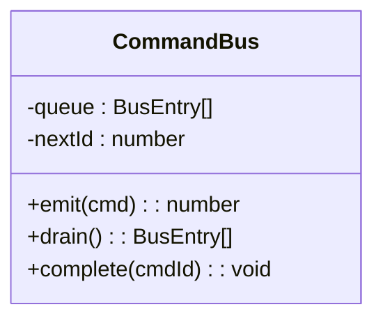
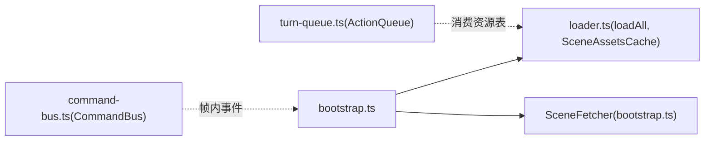

# 加载队列管理

<cite>
**本文引用的文件**   
- [packages/game/src/assets/loader.ts](file://packages/game/src/assets/loader.ts)
- [packages/game/src/shell/bootstrap.ts](file://packages/game/src/shell/bootstrap.ts)
- [packages/game/src/core/battle/turn-queue.ts](file://packages/game/src/core/battle/turn-queue.ts)
- [packages/game/src/core/command-bus.ts](file://packages/game/src/core/command-bus.ts)
</cite>

## 目录
1. [简介](#简介)
2. [项目结构](#项目结构)
3. [核心组件](#核心组件)
4. [架构总览](#架构总览)
5. [详细组件分析](#详细组件分析)
6. [依赖关系分析](#依赖关系分析)
7. [性能考虑](#性能考虑)
8. [故障排查指南](#故障排查指南)
9. [结论](#结论)
10. [附录：队列操作 API](#附录队列操作-api)

## 简介
本文件围绕“加载队列管理系统”进行系统化文档化，聚焦以下目标：
- 任务队列数据结构设计：优先级队列、任务状态跟踪、依赖关系管理
- 并发控制机制：最大并发数限制、动态调整策略、资源竞争避免
- 任务调度算法：FIFO 与优先级混合调度、任务分组执行、负载均衡
- 队列监控：实时状态查询、性能指标收集、异常检测
- 队列优化：内存使用控制、垃圾回收策略、缓存预热
- 队列操作 API：添加任务、暂停恢复、取消任务、清空队列

在仓库中，与“加载队列”直接相关的实现主要分布在：
- 场景资源懒加载与 LRU 缓存（SceneAssetsCache）
- 启动期并行资源加载（loadAll）
- 战斗回合行动队列（ActionQueue）
- 命令总线（CommandBus）用于帧内事件分发

## 项目结构
与加载队列相关的关键位置：
- assets/loader.ts：提供 loadAll 批量加载与 SceneAssetsCache 懒加载 + LRU 淘汰
- shell/bootstrap.ts：编排启动期并行加载、构建 SceneFetcher、注入 LRU 上限与保护项
- core/battle/turn-queue.ts：战斗回合 ActionQueue 的优先级排序与双动处理
- core/command-bus.ts：帧内命令队列（简单 FIFO），用于驱动表现层消费

图表来源
- [packages/game/src/assets/loader.ts:135-390](file://packages/game/src/assets/loader.ts#L135-L390)
- [packages/game/src/assets/loader.ts:451-499](file://packages/game/src/assets/loader.ts#L451-L499)
- [packages/game/src/shell/bootstrap.ts:556-628](file://packages/game/src/shell/bootstrap.ts#L556-L628)
- [packages/game/src/core/battle/turn-queue.ts:68-99](file://packages/game/src/core/battle/turn-queue.ts#L68-L99)
- [packages/game/src/core/command-bus.ts:69-88](file://packages/game/src/core/command-bus.ts#L69-L88)

章节来源
- [packages/game/src/assets/loader.ts:135-390](file://packages/game/src/assets/loader.ts#L135-L390)
- [packages/game/src/assets/loader.ts:451-499](file://packages/game/src/assets/loader.ts#L451-L499)
- [packages/game/src/shell/bootstrap.ts:556-628](file://packages/game/src/shell/bootstrap.ts#L556-L628)
- [packages/game/src/core/battle/turn-queue.ts:68-99](file://packages/game/src/core/battle/turn-queue.ts#L68-L99)
- [packages/game/src/core/command-bus.ts:69-88](file://packages/game/src/core/command-bus.ts#L69-L88)

## 核心组件
- 场景资源懒加载缓存（SceneAssetsCache）
  - 职责：按 sceneId 懒加载场景资源；支持可选 LRU 淘汰与“受保护”条目（当前渲染场景不可淘汰）
  - 关键接口：loadScene(sceneId)、可选 onEvict、可选 protect()
- 启动期并行加载（loadAll）
  - 职责：一次性并行拉取多类资源（JSON、PNG、RLE 等），并组装为 LoadedAssets
- 战斗回合行动队列（ActionQueue）
  - 职责：每轮根据敏捷值降序排列行动顺序；支持敌人双动（第二次行动标记 fIsSecond）
- 命令总线（CommandBus）
  - 职责：帧内命令 FIFO 队列，供表现层逐帧 drain 消费

章节来源
- [packages/game/src/assets/loader.ts:451-499](file://packages/game/src/assets/loader.ts#L451-L499)
- [packages/game/src/assets/loader.ts:135-390](file://packages/game/src/assets/loader.ts#L135-L390)
- [packages/game/src/core/battle/turn-queue.ts:68-99](file://packages/game/src/core/battle/turn-queue.ts#L68-L99)
- [packages/game/src/core/command-bus.ts:69-88](file://packages/game/src/core/command-bus.ts#L69-L88)

## 架构总览
从“加载队列”视角看，系统由三层协作：
- 启动期并行加载层：Promise.all 并发拉取大量资源，失败项降级处理（warn + 跳过）
- 场景懒加载层：SceneAssetsCache 负责按需 fetch + LRU 淘汰，配合 bootstrap 中的 SceneFetcher
- 运行时调度层：战斗 ActionQueue 基于敏捷值优先级；CommandBus 作为帧内 FIFO 通道

图表来源
- [packages/game/src/assets/loader.ts:451-499](file://packages/game/src/assets/loader.ts#L451-L499)
- [packages/game/src/shell/bootstrap.ts:556-628](file://packages/game/src/shell/bootstrap.ts#L556-L628)
- [packages/game/src/assets/loader.ts:135-390](file://packages/game/src/assets/loader.ts#L135-L390)

## 详细组件分析

### 场景资源懒加载缓存（SceneAssetsCache）
- 数据结构
  - 内部 Map<number, SceneAssets>，利用 JS Map 插入顺序维护 LRU（最旧→最近）
  - 可选 maxEntries 触发淘汰；onEvict 回调联动清理外部缓存（如 tileImagesBySceneId）
  - protect() 返回当前不可淘汰的 sceneId（正在渲染的场景）
- 行为要点
  - loadScene：命中则刷新 MRU；未命中则调用 fetcher 并写入缓存后尝试淘汰
  - evictIfNeeded：从最旧端扫描，跳过 protected 项，直到 size ≤ maxEntries
- 复杂度
  - 查找 O(1)，淘汰线性扫描 Map.keys()，但仅当超 cap 时触发且通常很快

图表来源
- [packages/game/src/assets/loader.ts:451-499](file://packages/game/src/assets/loader.ts#L451-L499)

章节来源
- [packages/game/src/assets/loader.ts:451-499](file://packages/game/src/assets/loader.ts#L451-L499)

### 启动期并行加载（loadAll）
- 并发模型
  - 使用 Promise.all 并行拉取 JSON、PNG、RLE 等资源
  - 对部分非关键资源采用 .catch 降级（例如 object-players.json、words.json、特效 sprite 缺失）
- 资源管线优化
  - tileset 以 gzip RLE blob 形式单文件加载，解码后成 Map
  - NPC 精灵与战斗精灵均走 RLE 管线，减少请求数量
  - 法术特效与 UI sprite 通过 manifest 去重只加载被引用 chunk
- 错误处理
  - 单个资源失败不中断整体流程，记录 warn 并继续

图表来源
- [packages/game/src/assets/loader.ts:135-390](file://packages/game/src/assets/loader.ts#L135-L390)

章节来源
- [packages/game/src/assets/loader.ts:135-390](file://packages/game/src/assets/loader.ts#L135-L390)

### 战斗回合行动队列（ActionQueue）
- 数据结构
  - PlayerSlot / EnemySlot：携带 idx、dex、dualMove 等信息
  - ActionQueueItem：isEnemy、idx、dex、fIsSecond、scriptReadyRan、checkPlayerCasualties
- 调度算法
  - 先填充所有敌人（含 dualMove 的第二条，dex 独立二抽或 dex-1 近似），再填充队员
  - 稳定排序：dex 降序；同 dex 保持填充顺序（敌人先于队员）
- 复杂度
  - 构造 O(n)，排序 O(n log n)，n 为双方单位总数

图表来源
- [packages/game/src/core/battle/turn-queue.ts:68-99](file://packages/game/src/core/battle/turn-queue.ts#L68-L99)

章节来源
- [packages/game/src/core/battle/turn-queue.ts:68-99](file://packages/game/src/core/battle/turn-queue.ts#L68-L99)

### 命令总线（CommandBus）
- 数据结构
  - 内部数组 queue: BusEntry[]，cmdId 自增
- 行为要点
  - emit(cmd)：入队并返回 cmdId
  - drain()：交换出队并重置内部数组（零拷贝切换）
  - complete(cmdId)：预留异步完成回调（M2 同步语义暂不关联）

图表来源
- [packages/game/src/core/command-bus.ts:69-88](file://packages/game/src/core/command-bus.ts#L69-L88)

章节来源
- [packages/game/src/core/command-bus.ts:69-88](file://packages/game/src/core/command-bus.ts#L69-L88)

## 依赖关系分析
- bootstrap.ts 依赖 loader.ts 的 SceneAssetsCache 与 loadAll
- SceneAssetsCache 依赖外部提供的 SceneFetcher（在 bootstrap.ts 中实现）
- battle turn-queue 与资源加载无直接耦合，但战斗表现层会复用已加载的资源表
- command-bus 与资源加载解耦，仅用于帧内命令分发

图表来源
- [packages/game/src/shell/bootstrap.ts:556-628](file://packages/game/src/shell/bootstrap.ts#L556-L628)
- [packages/game/src/assets/loader.ts:451-499](file://packages/game/src/assets/loader.ts#L451-L499)
- [packages/game/src/core/battle/turn-queue.ts:68-99](file://packages/game/src/core/battle/turn-queue.ts#L68-L99)
- [packages/game/src/core/command-bus.ts:69-88](file://packages/game/src/core/command-bus.ts#L69-L88)

章节来源
- [packages/game/src/shell/bootstrap.ts:556-628](file://packages/game/src/shell/bootstrap.ts#L556-L628)
- [packages/game/src/assets/loader.ts:451-499](file://packages/game/src/assets/loader.ts#L451-L499)
- [packages/game/src/core/battle/turn-queue.ts:68-99](file://packages/game/src/core/battle/turn-queue.ts#L68-L99)
- [packages/game/src/core/command-bus.ts:69-88](file://packages/game/src/core/command-bus.ts#L69-L88)

## 性能考虑
- 并发控制
  - 启动期：Promise.all 全量并行，适合 I/O 密集；若需限流，可在 bootstrap 侧封装并发池
  - 缩略图渲染：已有并发限 2 的实现示例（acquire/release 模式）
- 内存控制
  - SceneAssetsCache 的 LRU 上限（MAX_SCENE_CACHE=16）+ protect(currentSceneId) 防止黑屏
  - onEvict 联动释放 tileImagesBySceneId，避免内存泄漏
- 缓存预热
  - 启动期 loadAll 预载首屏所需资源；cutscene 前可按指令集预取角色 sprite
- 排序与分配
  - ActionQueue 使用稳定排序，时间复杂度 O(n log n)，n 较小，开销可控

[本节为通用指导，无需具体文件分析]

## 故障排查指南
- 资源缺失导致功能退化
  - 现象：object-players.json、words.json、特效 sprite 缺失时控制台 warn，对应功能降级
  - 定位：检查 loader.ts 中各 .catch 分支与 console.warn 输出
- 场景切换黑屏
  - 现象：LRU 淘汰了当前场景导致 tileImages 缺失
  - 定位：确认 SceneAssetsCache.protect 是否返回 currentSceneId；onEvict 是否删除了对应 tileImages
- 战斗行动顺序异常
  - 现象：双动敌人顺序不符合预期
  - 定位：检查 EnemySlot.dex2 是否正确传入；比较逻辑与 fIsSecond 设置是否符合 sdlpal 真值

章节来源
- [packages/game/src/assets/loader.ts:135-390](file://packages/game/src/assets/loader.ts#L135-L390)
- [packages/game/src/assets/loader.ts:451-499](file://packages/game/src/assets/loader.ts#L451-L499)
- [packages/game/src/core/battle/turn-queue.ts:68-99](file://packages/game/src/core/battle/turn-queue.ts#L68-L99)

## 结论
本项目在“加载队列管理”方面形成了清晰的层次：
- 启动期并行加载（高吞吐 I/O）
- 场景级懒加载 + LRU 淘汰（内存友好）
- 战斗回合优先级队列（忠实还原经典规则）
- 帧内命令 FIFO（低延迟分发）

这些组件共同保证了资源加载的性能与稳定性，同时为后续扩展（更细粒度的并发控制、监控与优化）提供了良好基础。

[本节为总结性内容，无需具体文件分析]

## 附录：队列操作 API
说明：以下为面向“加载队列管理”的抽象 API 建议，便于统一对外暴露能力。现有代码并未提供完整统一的“加载队列管理器”，以下 API 可作为未来封装的参考。

- 添加任务
  - addTask(task): number
    - 参数：task（包含 id、type、payload、priority、dependsOn[]）
    - 返回：任务 ID
- 暂停/恢复
  - pause(): void
  - resume(): void
- 取消任务
  - cancelTask(taskId): boolean
- 清空队列
  - clear(): void
- 状态查询
  - getStatus(): { pending: number; running: number; completed: number; failed: number }
- 指标采集
  - getMetrics(): { avgLatencyMs, p95LatencyMs, throughputPerSec, memoryUsageBytes }
- 动态调整
  - setConcurrency(maxConcurrent: number): void
  - setPriorityPolicy(policy: 'fifo' | 'priority' | 'mixed'): void

[本节为概念性 API 设计，不对应具体源码文件]