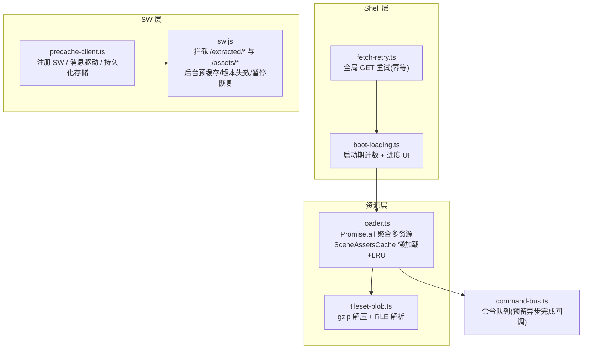
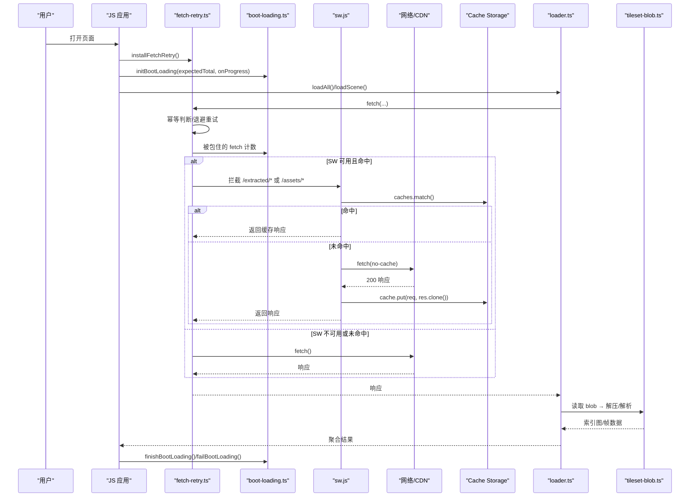
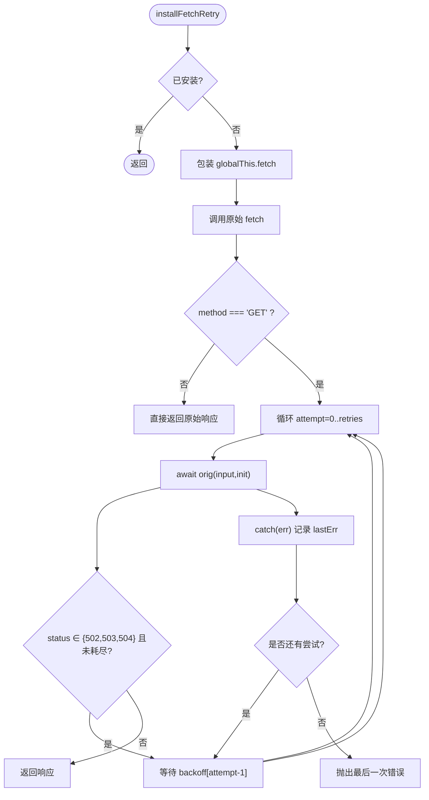
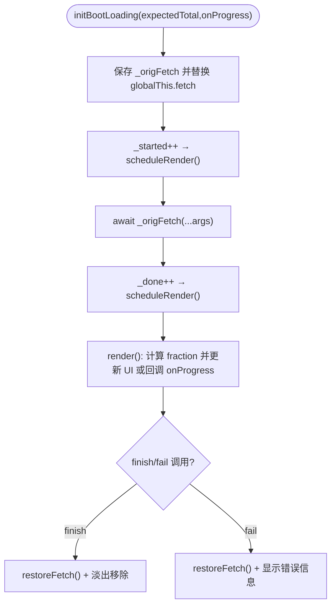
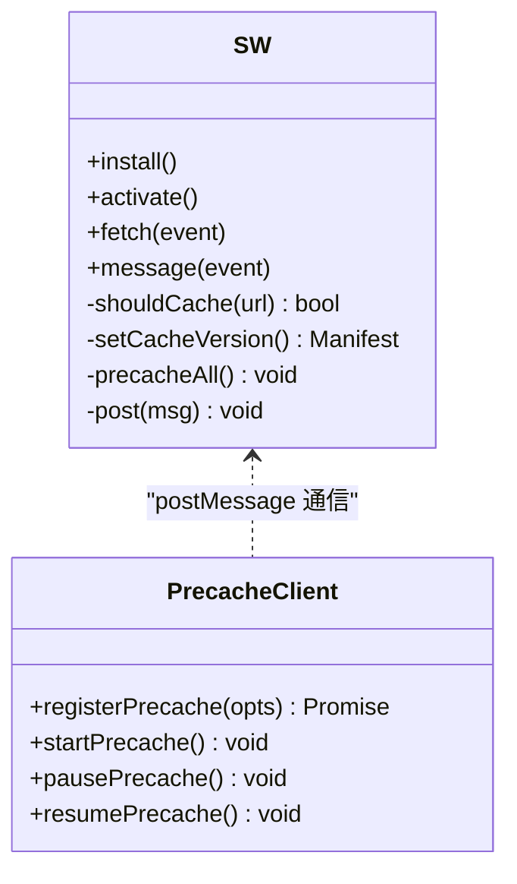
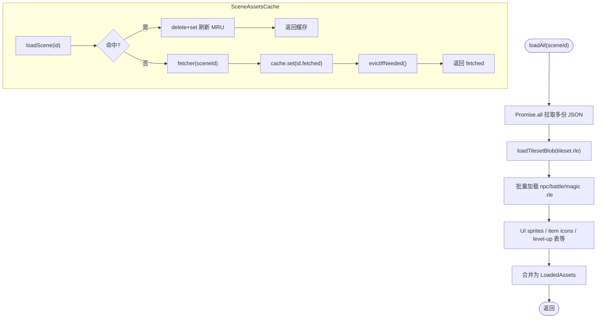
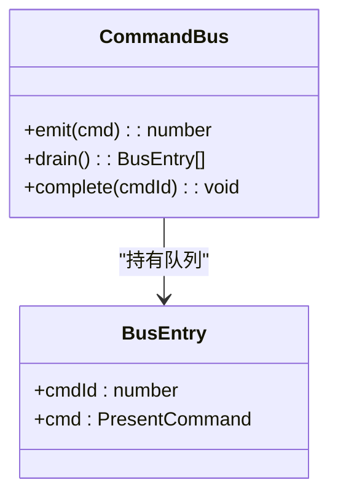
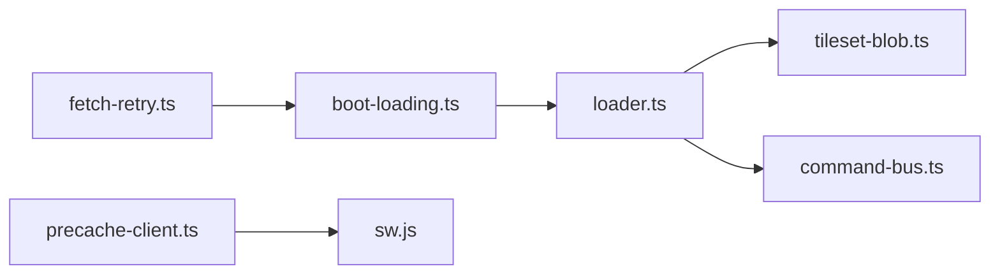

# 异步加载策略

<cite>
**本文引用的文件**
- [packages/game/src/shell/fetch-retry.ts](file://packages/game/src/shell/fetch-retry.ts)
- [packages/game/src/shell/boot-loading.ts](file://packages/game/src/shell/boot-loading.ts)
- [packages/game/public/sw.js](file://packages/game/public/sw.js)
- [packages/game/src/shell/precache-client.ts](file://packages/game/src/shell/precache-client.ts)
- [packages/game/src/assets/loader.ts](file://packages/game/src/assets/loader.ts)
- [packages/game/src/assets/tileset-blob.ts](file://packages/game/src/assets/tileset-blob.ts)
- [packages/game/src/core/command-bus.ts](file://packages/game/src/core/command-bus.ts)
</cite>

## 目录
1. [引言](#引言)
2. [项目结构](#项目结构)
3. [核心组件](#核心组件)
4. [架构总览](#架构总览)
5. [详细组件分析](#详细组件分析)
6. [依赖关系分析](#依赖关系分析)
7. [性能考量](#性能考量)
8. [故障排查指南](#故障排查指南)
9. [结论](#结论)
10. [附录](#附录)

## 引言
本文件系统化梳理本项目在“异步加载”方面的策略与实现，覆盖以下关键主题：
- Promise 链式调用：错误传播、结果聚合、超时控制
- 并发控制：最大并发数限制、任务队列管理、资源竞争避免
- 错误重试：指数退避、失败阈值、熔断器模式
- 进度跟踪：百分比计算、阶段划分、用户反馈
- 网络优化：请求合并、缓存策略、断点续传
- 调试工具：加载日志、性能分析、问题诊断

上述能力由前端 Shell 层（fetch 包装、启动覆盖层）、Service Worker（后台预缓存/版本失效/暂停恢复）、资源加载器（并行聚合、场景懒加载）共同构成。

## 项目结构
围绕异步加载的关键代码分布在如下模块：
- 网络层重试与启动覆盖层：shell/fetch-retry.ts、shell/boot-loading.ts
- Service Worker 与客户端协调：public/sw.js、shell/precache-client.ts
- 资源加载与解码：assets/loader.ts、assets/tileset-blob.ts
- 命令总线（为未来异步资源完成回调预留）：core/command-bus.ts

图表来源
- [packages/game/src/shell/fetch-retry.ts:1-58](file://packages/game/src/shell/fetch-retry.ts#L1-L58)
- [packages/game/src/shell/boot-loading.ts:1-150](file://packages/game/src/shell/boot-loading.ts#L1-L150)
- [packages/game/public/sw.js:1-160](file://packages/game/public/sw.js#L1-L160)
- [packages/game/src/shell/precache-client.ts:1-91](file://packages/game/src/shell/precache-client.ts#L1-L91)
- [packages/game/src/assets/loader.ts:1-500](file://packages/game/src/assets/loader.ts#L1-L500)
- [packages/game/src/assets/tileset-blob.ts:1-151](file://packages/game/src/assets/tileset-blob.ts#L1-L151)
- [packages/game/src/core/command-bus.ts:58-88](file://packages/game/src/core/command-bus.ts#L58-L88)

章节来源
- [packages/game/src/shell/fetch-retry.ts:1-58](file://packages/game/src/shell/fetch-retry.ts#L1-L58)
- [packages/game/src/shell/boot-loading.ts:1-150](file://packages/game/src/shell/boot-loading.ts#L1-L150)
- [packages/game/public/sw.js:1-160](file://packages/game/public/sw.js#L1-L160)
- [packages/game/src/shell/precache-client.ts:1-91](file://packages/game/src/shell/precache-client.ts#L1-L91)
- [packages/game/src/assets/loader.ts:1-500](file://packages/game/src/assets/loader.ts#L1-L500)
- [packages/game/src/assets/tileset-blob.ts:1-151](file://packages/game/src/assets/tileset-blob.ts#L1-L151)
- [packages/game/src/core/command-bus.ts:58-88](file://packages/game/src/core/command-bus.ts#L58-L88)

## 核心组件
- 全局 fetch 重试（仅 GET，幂等安全）：对网络层失败与 5xx 瞬时态进行有限次重试，带退避；非幂等方法不重试。
- 启动期覆盖层：包裹 fetch 计数，rAF 节流渲染进度条与状态文本；支持两段进度回调与错误提示。
- Service Worker 预缓存：按 manifest 版本清理旧缓存，后台并发拉取并写入 Cache Storage；支持暂停/恢复与进度上报。
- 预缓存客户端：注册 SW、持久化存储、缓冲 startPrecache 时机、转发进度事件。
- 资源加载器：Promise.all 聚合多资源；场景资源懒加载与 LRU 淘汰；RLE/gzip 解码管线。
- 命令总线：为未来将异步资源与 cmdId 关联的完成回调预留接口。

章节来源
- [packages/game/src/shell/fetch-retry.ts:1-58](file://packages/game/src/shell/fetch-retry.ts#L1-L58)
- [packages/game/src/shell/boot-loading.ts:1-150](file://packages/game/src/shell/boot-loading.ts#L1-L150)
- [packages/game/public/sw.js:1-160](file://packages/game/public/sw.js#L1-L160)
- [packages/game/src/shell/precache-client.ts:1-91](file://packages/game/src/shell/precache-client.ts#L1-L91)
- [packages/game/src/assets/loader.ts:1-500](file://packages/game/src/assets/loader.ts#L1-L500)
- [packages/game/src/assets/tileset-blob.ts:1-151](file://packages/game/src/assets/tileset-blob.ts#L1-L151)
- [packages/game/src/core/command-bus.ts:58-88](file://packages/game/src/core/command-bus.ts#L58-L88)

## 架构总览
下图展示从页面到 SW 再到资源加载器的完整异步链路，以及进度与错误的传播路径。

图表来源
- [packages/game/src/shell/fetch-retry.ts:1-58](file://packages/game/src/shell/fetch-retry.ts#L1-L58)
- [packages/game/src/shell/boot-loading.ts:1-150](file://packages/game/src/shell/boot-loading.ts#L1-L150)
- [packages/game/public/sw.js:1-160](file://packages/game/public/sw.js#L1-L160)
- [packages/game/src/assets/loader.ts:1-500](file://packages/game/src/assets/loader.ts#L1-L500)
- [packages/game/src/assets/tileset-blob.ts:1-151](file://packages/game/src/assets/tileset-blob.ts#L1-L151)

## 详细组件分析

### 组件一：全局 fetch 重试（幂等安全）
- 策略要点
  - 仅对 GET 方法重试，非幂等方法直接透传
  - 网络层 reject 与 502/503/504 触发重试，其余状态码原样返回
  - 固定次数重试 + 可配置退避序列（默认 2 次重试，退避 300ms/900ms）
  - 幂等安装：重复 install 不会双层包装
- 错误传播
  - 最后一次失败抛出，调用方可捕获统一处理
- 超时控制
  - 当前未内置超时；可在上层以 AbortController 封装实现
- 集成顺序
  - 必须在启动覆盖层之前安装，确保其能存活于 boot-loading 还原 fetch 之后

图表来源
- [packages/game/src/shell/fetch-retry.ts:1-58](file://packages/game/src/shell/fetch-retry.ts#L1-L58)

章节来源
- [packages/game/src/shell/fetch-retry.ts:1-58](file://packages/game/src/shell/fetch-retry.ts#L1-L58)

### 组件二：启动期覆盖层与两段进度
- 职责
  - 包裹 fetch 计数（已发起/已完成），rAF 节流更新 UI
  - 分母 = max(已发起, 预估总量)，保证单调不回退
  - 支持两段进度：必要资源就绪后回调 fraction 给统一 UI，不再自渲染 DOM
  - 提供 finishBootLoading/failBootLoading 收尾与错误提示
- 进度计算
  - 纯 done/started 会在每波新请求发起时分母跳涨导致回退；引入预估总量垫底，并在 finish 时强制满格
- 与 SW 协同
  - PROD 走 SW 统一进度时，此处不写 #boot-loading-fill/status，避免闪烁互盖

图表来源
- [packages/game/src/shell/boot-loading.ts:1-150](file://packages/game/src/shell/boot-loading.ts#L1-L150)

章节来源
- [packages/game/src/shell/boot-loading.ts:1-150](file://packages/game/src/shell/boot-loading.ts#L1-L150)

### 组件三：Service Worker 预缓存（后台、版本失效、暂停恢复）
- 功能
  - 拦截 /extracted/* 与 /assets/* 的 GET 请求，优先命中 Cache Storage，否则网络拉取并缓存
  - 激活时按 manifest.version 归位 CACHE_NAME，删除非当前版本的旧缓存
  - 后台预缓存：并发 worker 池，cursor 共享，cache.match 续传，定时上报进度
  - 开场视频期间暂停（waitWhilePaused），播完恢复（resumePrecaching）
- 并发与让路
  - CONCURRENCY 全速；设计文档提出 INITIAL_CONCURRENCY 与 BOOST_CONCURRENCY 的可增长池方案（计划中）
- 保活
  - waitUntil(precacheAll()) 防止浏览器终止长任务

图表来源
- [packages/game/public/sw.js:1-160](file://packages/game/public/sw.js#L1-L160)
- [packages/game/src/shell/precache-client.ts:1-91](file://packages/game/src/shell/precache-client.ts#L1-L91)

章节来源
- [packages/game/public/sw.js:1-160](file://packages/game/public/sw.js#L1-L160)
- [packages/game/src/shell/precache-client.ts:1-91](file://packages/game/src/shell/precache-client.ts#L1-L91)

### 组件四：资源加载器与场景懒加载
- 并行聚合
  - 使用 Promise.all 同时拉取 tilemap/palette/events/player-roles 等多份 JSON
  - 战斗精灵/背景、UI sprite、物品图标等通过 manifest 去重后批量加载
- 容错
  - 可选资源缺失时 warn 并跳过，不影响主流程
- 场景懒加载与 LRU
  - SceneAssetsCache 基于 Map 插入序维护 LRU，支持 maxEntries、onEvict、protect 保护当前场景
- 解码管线
  - tileset/npc/battle/magic 共用 gzip + RLE 解码，减少请求数与解码开销

图表来源
- [packages/game/src/assets/loader.ts:1-500](file://packages/game/src/assets/loader.ts#L1-L500)
- [packages/game/src/assets/tileset-blob.ts:1-151](file://packages/game/src/assets/tileset-blob.ts#L1-L151)

章节来源
- [packages/game/src/assets/loader.ts:1-500](file://packages/game/src/assets/loader.ts#L1-L500)
- [packages/game/src/assets/tileset-blob.ts:1-151](file://packages/game/src/assets/tileset-blob.ts#L1-L151)

### 组件五：命令总线（为异步资源完成回调预留）
- 当前语义为同步队列，complete 钩子预留用于未来把异步资源与 cmdId 关联，完成时回调

图表来源
- [packages/game/src/core/command-bus.ts:58-88](file://packages/game/src/core/command-bus.ts#L58-L88)

章节来源
- [packages/game/src/core/command-bus.ts:58-88](file://packages/game/src/core/command-bus.ts#L58-L88)

## 依赖关系分析
- 耦合与内聚
  - fetch-retry 与 boot-loading 均包装 globalThis.fetch，存在装配顺序约束（retry 先装）
  - boot-loading 与 loader 通过 onProgress 回调解耦 UI 与计数逻辑
  - precache-client 与 sw.js 通过 postMessage 通信，职责清晰
  - loader 与 tileset-blob 通过函数接口组合，高内聚低耦合
- 外部依赖
  - Service Worker API、Cache Storage、DecompressionStream、navigator.storage.persist
- 潜在环与风险
  - 无循环依赖；注意安装顺序与 SW 可用性降级路径

图表来源
- [packages/game/src/shell/fetch-retry.ts:1-58](file://packages/game/src/shell/fetch-retry.ts#L1-L58)
- [packages/game/src/shell/boot-loading.ts:1-150](file://packages/game/src/shell/boot-loading.ts#L1-L150)
- [packages/game/src/shell/precache-client.ts:1-91](file://packages/game/src/shell/precache-client.ts#L1-L91)
- [packages/game/public/sw.js:1-160](file://packages/game/public/sw.js#L1-L160)
- [packages/game/src/assets/loader.ts:1-500](file://packages/game/src/assets/loader.ts#L1-L500)
- [packages/game/src/assets/tileset-blob.ts:1-151](file://packages/game/src/assets/tileset-blob.ts#L1-L151)
- [packages/game/src/core/command-bus.ts:58-88](file://packages/game/src/core/command-bus.ts#L58-L88)

章节来源
- [packages/game/src/shell/fetch-retry.ts:1-58](file://packages/game/src/shell/fetch-retry.ts#L1-L58)
- [packages/game/src/shell/boot-loading.ts:1-150](file://packages/game/src/shell/boot-loading.ts#L1-L150)
- [packages/game/src/shell/precache-client.ts:1-91](file://packages/game/src/shell/precache-client.ts#L1-L91)
- [packages/game/public/sw.js:1-160](file://packages/game/public/sw.js#L1-L160)
- [packages/game/src/assets/loader.ts:1-500](file://packages/game/src/assets/loader.ts#L1-L500)
- [packages/game/src/assets/tileset-blob.ts:1-151](file://packages/game/src/assets/tileset-blob.ts#L1-L151)
- [packages/game/src/core/command-bus.ts:58-88](file://packages/game/src/core/command-bus.ts#L58-L88)

## 性能考量
- 并发控制
  - SW 后台预缓存使用固定并发（CONCURRENCY=8），避免饿死前台 fetch；设计文档提出可增长池（INITIAL/BOOST）以在可玩后提速
- 带宽让路
  - 开场视频期间暂停预缓存，避免 Range 请求与用户输入延迟
- 请求合并与去重
  - 资源管线将大量 per-frame PNG 合并为单个 gzip RLE blob，显著降低请求数与解码开销
- 缓存策略
  - SW 按 manifest.version 清理旧缓存，保留当前版本，避免每次发版重下全部资源
- 内存占用
  - SceneAssetsCache 支持 LRU 淘汰与 protect，防止常驻过多场景资源导致内存膨胀

章节来源
- [packages/game/public/sw.js:1-160](file://packages/game/public/sw.js#L1-L160)
- [packages/game/src/assets/loader.ts:1-500](file://packages/game/src/assets/loader.ts#L1-L500)
- [packages/game/src/assets/tileset-blob.ts:1-151](file://packages/game/src/assets/tileset-blob.ts#L1-L151)

## 故障排查指南
- 常见问题定位
  - 首屏黑屏/进度不动：检查 initBootLoading 是否执行、expectedTotal 是否合理、是否被 SW 接管导致 UI 切换
  - 资源偶发失败：确认 fetch-retry 是否安装、是否命中 5xx/网络层失败分支
  - 预缓存中断：查看 SW 是否被终止（需 waitUntil）、是否处于 paused 状态、manifest 是否可达
  - 版本错位：确认 activate 中 setCacheVersion 是否成功、旧缓存是否清理
- 建议的诊断手段
  - 在 loader 中对关键 fetch 增加 console.warn 输出 URL 与状态码
  - 在 SW message handler 打印 precache-progress/done/error 事件
  - 使用浏览器 DevTools 的 Network/Storage/Caches 面板核对命中情况
  - 在 shell 层添加轻量计时（如 performance.mark/markEvent）统计各阶段耗时

章节来源
- [packages/game/src/shell/boot-loading.ts:1-150](file://packages/game/src/shell/boot-loading.ts#L1-L150)
- [packages/game/src/shell/fetch-retry.ts:1-58](file://packages/game/src/shell/fetch-retry.ts#L1-L58)
- [packages/game/public/sw.js:1-160](file://packages/game/public/sw.js#L1-L160)
- [packages/game/src/assets/loader.ts:1-500](file://packages/game/src/assets/loader.ts#L1-L500)

## 结论
本项目通过“前端重试 + 启动覆盖层 + SW 预缓存 + 资源聚合与懒加载”的组合，构建了稳健高效的异步加载体系。其特点包括：
- 幂等安全的网络重试与合理的退避策略
- 两段进度与单调回退保护的启动体验
- 后台预缓存的版本化管理与暂停/恢复机制
- 资源管线压缩与解码优化，显著降低请求与解码成本
- 场景级懒加载与 LRU 控制内存占用

后续可扩展方向包括：
- 为 fetch-retry 增加超时控制与更细粒度的熔断器（按域名/路径）
- 实现 SW 可增长 worker 池（INITIAL/BOOST）与动态扩缩
- 在 loader 中引入请求合并与去重（同批相同 URL 合并）
- 完善命令总线中的异步资源完成回调，使 UI 与资源生命周期更紧密联动

## 附录
- 术语
  - 预缓存：后台提前下载并缓存静态资源
  - 版本失效：根据 manifest.version 清理旧缓存
  - 两段进度：必要资源就绪前/后的进度汇报
  - 幂等：多次执行不会产生副作用的操作（如 GET 重试）