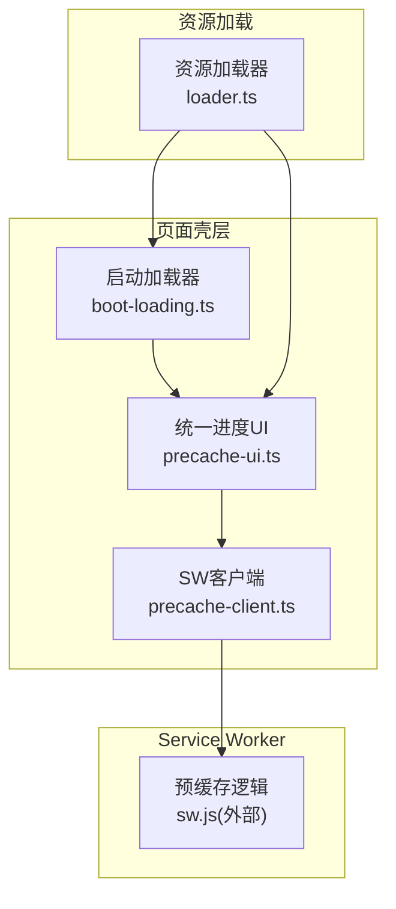
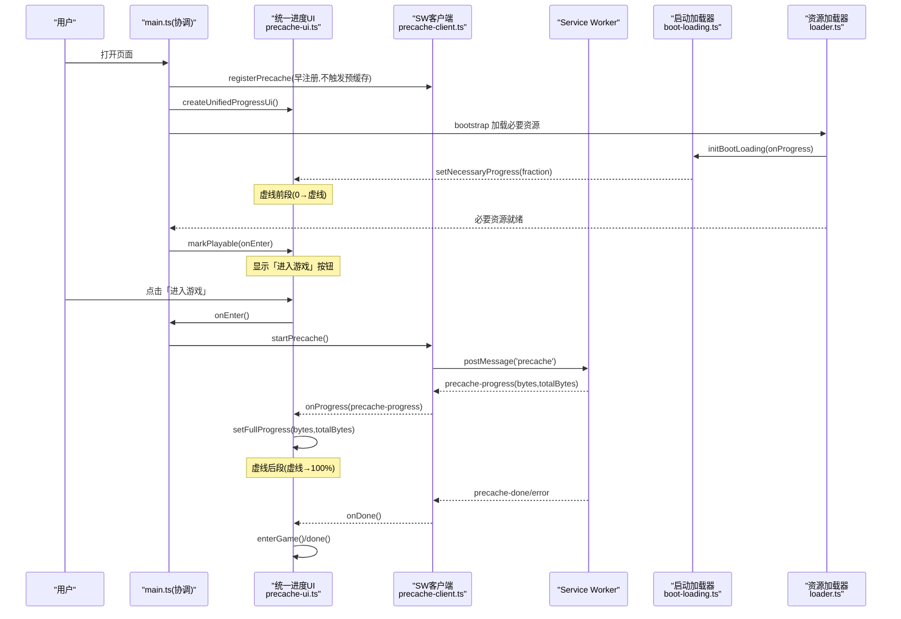
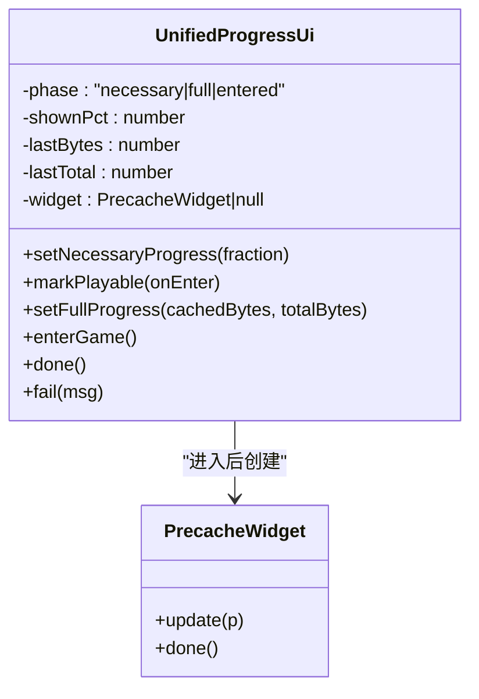
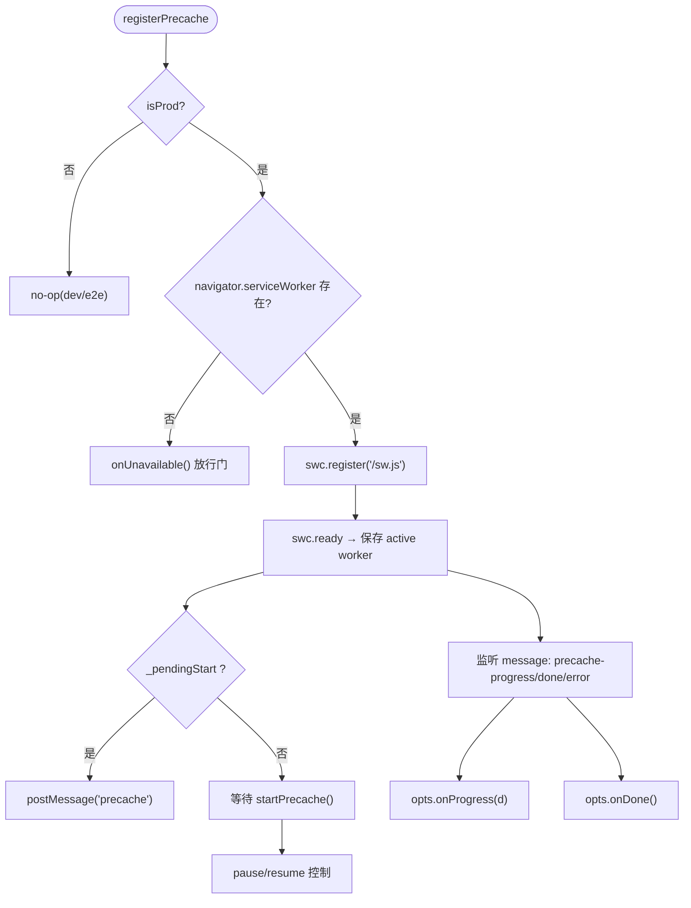
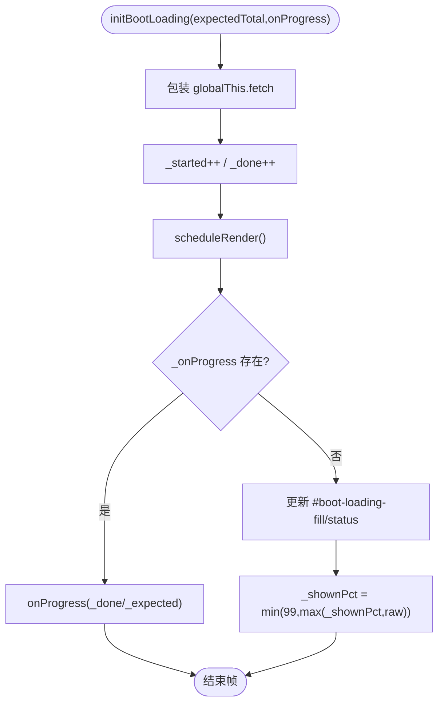
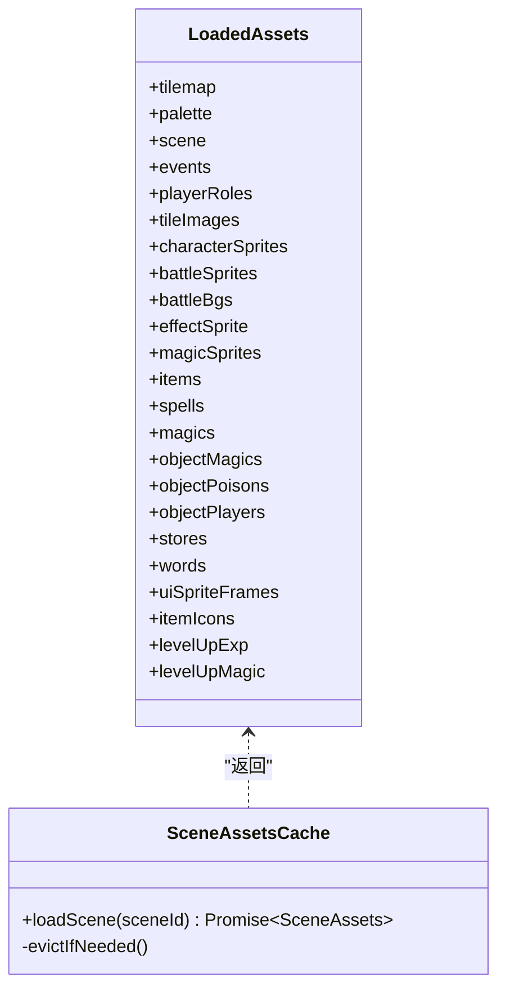
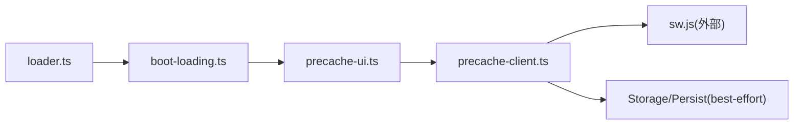

# 进度跟踪系统

<cite>
**本文引用的文件**   
- [packages/game/src/shell/precache-ui.ts](file://packages/game/src/shell/precache-ui.ts)
- [packages/game/src/shell/precache-client.ts](file://packages/game/src/shell/precache-client.ts)
- [packages/game/src/shell/boot-loading.ts](file://packages/game/src/shell/boot-loading.ts)
- [packages/game/src/assets/loader.ts](file://packages/game/src/assets/loader.ts)
- [docs/phase1/plans/2026-06-14-unified-precache-progress-gate.md](file://docs/phase1/plans/2026-06-14-unified-precache-progress-gate.md)
- [docs/phase1/plans/2026-06-14-unified-precache-progress-gate-impl.md](file://docs/phase1/plans/2026-06-14-unified-precache-progress-gate-impl.md)
- [reference/sdlpal/emscripten/main.js](file://reference/sdlpal/emscripten/main.js)
</cite>

## 目录
1. [简介](#简介)
2. [项目结构](#项目结构)
3. [核心组件](#核心组件)
4. [架构总览](#架构总览)
5. [详细组件分析](#详细组件分析)
6. [依赖关系分析](#依赖关系分析)
7. [性能考虑](#性能考虑)
8. [故障排查指南](#故障排查指南)
9. [结论](#结论)
10. [附录](#附录)

## 简介
本文件围绕“进度跟踪系统”进行系统化说明，覆盖以下目标：
- 百分比计算算法：总任务权重分配、已完成任务统计、实时进度更新
- 阶段划分策略：资源分类分组、预加载阶段、运行时加载阶段
- 用户反馈机制：进度条更新、加载提示显示、错误状态反馈
- 进度存储：本地缓存进度、断点续传支持、跨会话进度同步
- 性能优化：批量更新合并、防抖节流处理、渲染性能优化
- 进度API：订阅进度变化、获取详细状态、自定义进度处理器

该系统以“统一进度 + 可玩门 + 进入解锁”为核心设计，将冷启动必要资源加载与后台全量预缓存整合为一条连续、不回退的进度曲线，并提供明确的交互门控与用户体验保障。

## 项目结构
与进度跟踪相关的核心代码位于游戏包 shell 层与资源加载层，配合文档中的设计与实现计划：
- 统一进度 UI 控制器与右上角小部件：precache-ui.ts
- Service Worker 客户端（注册、持久化、消息转发）：precache-client.ts
- 启动期 fetch 计数与 fallback 进度条：boot-loading.ts
- 资源加载器（场景/战斗/特效等）：loader.ts
- 设计与实现计划：unified-precache-progress-gate.md / unified-precache-progress-gate-impl.md
- Emscripten 环境下的旧版进度回调参考：reference/sdlpal/emscripten/main.js

图表来源
- [packages/game/src/shell/precache-ui.ts:1-153](file://packages/game/src/shell/precache-ui.ts#L1-L153)
- [packages/game/src/shell/precache-client.ts:1-91](file://packages/game/src/shell/precache-client.ts#L1-L91)
- [packages/game/src/shell/boot-loading.ts:1-150](file://packages/game/src/shell/boot-loading.ts#L1-L150)
- [packages/game/src/assets/loader.ts:135-390](file://packages/game/src/assets/loader.ts#L135-L390)

章节来源
- [packages/game/src/shell/precache-ui.ts:1-153](file://packages/game/src/shell/precache-ui.ts#L1-L153)
- [packages/game/src/shell/precache-client.ts:1-91](file://packages/game/src/shell/precache-client.ts#L1-L91)
- [packages/game/src/shell/boot-loading.ts:1-150](file://packages/game/src/shell/boot-loading.ts#L1-L150)
- [packages/game/src/assets/loader.ts:135-390](file://packages/game/src/assets/loader.ts#L135-L390)
- [docs/phase1/plans/2026-06-14-unified-precache-progress-gate.md:1-82](file://docs/phase1/plans/2026-06-14-unified-precache-progress-gate.md#L1-L82)

## 核心组件
- 统一进度 UI 控制器
  - 负责三段态切换：虚线前（必要资源）、虚线后（SW 全量）、进入游戏后（右上角小部件）
  - 提供 setNecessaryProgress、markPlayable、setFullProgress、enterGame、done、fail 等接口
- Service Worker 客户端
  - 早注册 SW、请求持久化存储、转发 SW 进度消息
  - 控制 startPrecache/pause/resume 时机，避免与视频播放争抢带宽
- 启动加载器（fallback）
  - 在 SW 不可用时通过包装 window.fetch 计数，驱动 #boot-loading 进度条
  - 提供 finishBootLoading/failBootLoading/setBootLoadingNote 等能力
- 资源加载器
  - 按场景/战斗/特效等维度组织资源加载，产出 LoadedAssets
  - 与进度系统协作：在必要资源阶段贡献进度，在运行期按需加载

章节来源
- [packages/game/src/shell/precache-ui.ts:14-27](file://packages/game/src/shell/precache-ui.ts#L14-L27)
- [packages/game/src/shell/precache-client.ts:10-25](file://packages/game/src/shell/precache-client.ts#L10-L25)
- [packages/game/src/shell/boot-loading.ts:17-30](file://packages/game/src/shell/boot-loading.ts#L17-L30)
- [packages/game/src/assets/loader.ts:50-118](file://packages/game/src/assets/loader.ts#L50-L118)

## 架构总览
统一进度从页面打开起即开始，数据源来自 Service Worker 的已缓存字节与 manifest.totalBytes；必要资源加载走前台 fetch（经 SW cache-first），两者合并为一条单调不回退的进度曲线。越过“可玩点”出现「进入游戏」按钮，点击后解锁音视频并进入主循环，同时把覆盖层转为右上角半透明小部件继续跑满 100%。

图表来源
- [packages/game/src/shell/precache-ui.ts:69-152](file://packages/game/src/shell/precache-ui.ts#L69-L152)
- [packages/game/src/shell/precache-client.ts:34-90](file://packages/game/src/shell/precache-client.ts#L34-L90)
- [packages/game/src/shell/boot-loading.ts:104-128](file://packages/game/src/shell/boot-loading.ts#L104-L128)
- [packages/game/src/assets/loader.ts:135-190](file://packages/game/src/assets/loader.ts#L135-L190)
- [docs/phase1/plans/2026-06-14-unified-precache-progress-gate.md:23-52](file://docs/phase1/plans/2026-06-14-unified-precache-progress-gate.md#L23-L52)

## 详细组件分析

### 统一进度 UI 控制器（三态进度）
- 职责
  - 维护 phase 状态机：necessary → full → entered
  - 虚线位置由 playableFraction 决定，默认约 12%，用于映射必要资源进度到前半段
  - 进入后创建右上角 PrecacheWidget，复用视觉样式
- 关键行为
  - setNecessaryProgress：仅当 phase=necessary 生效，映射 fraction 到 0..playableFraction*100
  - markPlayable：切换到 full，显示常驻按钮，click 调用 onEnter
  - setFullProgress：基于 bytes/totalBytes 计算真实百分比，保持单调不回退
  - enterGame：移除覆盖层，必要时初始化 widget 并以最后已知进度填充
  - done/fail：收尾淡出或错误态展示
- 复杂度与性能
  - 每次更新 O(1)，内部使用 _shownPct 做单调 clamp，避免抖动
  - 进入后 widget.update 同样 O(1)，文本格式化 mb() 为常量开销

图表来源
- [packages/game/src/shell/precache-ui.ts:14-27](file://packages/game/src/shell/precache-ui.ts#L14-L27)
- [packages/game/src/shell/precache-ui.ts:29-64](file://packages/game/src/shell/precache-ui.ts#L29-L64)
- [packages/game/src/shell/precache-ui.ts:69-152](file://packages/game/src/shell/precache-ui.ts#L69-L152)

章节来源
- [packages/game/src/shell/precache-ui.ts:14-27](file://packages/game/src/shell/precache-ui.ts#L14-L27)
- [packages/game/src/shell/precache-ui.ts:69-152](file://packages/game/src/shell/precache-ui.ts#L69-L152)

### Service Worker 客户端（进度转发与时机控制）
- 职责
  - 早注册 SW，拿到 active worker，但不立即触发预缓存
  - 转发 SW 的 precache-progress/done/error 消息给 UI 回调
  - 控制 startPrecache/pause/resume 时机，避免与开场视频争抢带宽
- 关键行为
  - registerPrecache：尝试注册 SW，失败则 onUnavailable 放行可玩门
  - startPrecache：若 SW 未 ready，缓冲并在 ready 后补发
  - pause/resume：向 SW 发送暂停/恢复指令
- 错误处理
  - 无 SW 能力或注册失败 → 降级为现状（按需 fetch + 自动放行门）
  - error 与 done 均触发 onDone，确保 UI 收尾

图表来源
- [packages/game/src/shell/precache-client.ts:50-90](file://packages/game/src/shell/precache-client.ts#L50-L90)
- [packages/game/src/shell/precache-client.ts:34-48](file://packages/game/src/shell/precache-client.ts#L34-L48)

章节来源
- [packages/game/src/shell/precache-client.ts:10-25](file://packages/game/src/shell/precache-client.ts#L10-L25)
- [packages/game/src/shell/precache-client.ts:34-90](file://packages/game/src/shell/precache-client.ts#L34-L90)

### 启动加载器（fallback 进度与提示）
- 职责
  - 在 SW 不可用时，包装 window.fetch 计数，驱动 #boot-loading 进度条
  - 提供 finishBootLoading/failBootLoading/setBootLoadingNote 等能力
- 百分比算法
  - 分母 = max(已发起, 预估)，显示值单调不回退，封顶 99%（由 finish 给真 100）
  - 预估总量随管线优化调整（例如从 ~3236 降至 ~800）
- 与统一进度的协作
  - PROD 两段进度：initBootLoading 传入 onProgress，交由统一 UI 接管，不再直接写 DOM
  - 若无统一 UI（fallback），则自行渲染 #boot-loading-fill/status

图表来源
- [packages/game/src/shell/boot-loading.ts:104-128](file://packages/game/src/shell/boot-loading.ts#L104-L128)
- [packages/game/src/shell/boot-loading.ts:47-70](file://packages/game/src/shell/boot-loading.ts#L47-L70)
- [packages/game/src/shell/boot-loading.ts:17-30](file://packages/game/src/shell/boot-loading.ts#L17-L30)

章节来源
- [packages/game/src/shell/boot-loading.ts:17-30](file://packages/game/src/shell/boot-loading.ts#L17-L30)
- [packages/game/src/shell/boot-loading.ts:104-128](file://packages/game/src/shell/boot-loading.ts#L104-L128)

### 资源加载器（阶段划分与权重）
- 职责
  - 按场景/战斗/特效/物品图标等维度组织资源加载，产出 LoadedAssets
  - 在必要资源阶段参与进度（通过 fetch 计数或 SW 字节累计）
- 阶段划分策略
  - 预加载阶段：bootstrap 拉取必要资源（tilemap、palette、事件表、角色表、基础战斗表等）
  - 运行时加载阶段：场景切换时按需加载 SceneAssets（带 LRU 缓存与保护）
- 权重分配
  - 统一进度采用“字节口径”：bytes/totalBytes，天然具备权重意义（大文件占比高）
  - 必要资源阶段用 fraction 映射到 0..playableFraction*100，保证平滑衔接

图表来源
- [packages/game/src/assets/loader.ts:50-118](file://packages/game/src/assets/loader.ts#L50-L118)
- [packages/game/src/assets/loader.ts:451-499](file://packages/game/src/assets/loader.ts#L451-L499)

章节来源
- [packages/game/src/assets/loader.ts:135-390](file://packages/game/src/assets/loader.ts#L135-L390)
- [packages/game/src/assets/loader.ts:451-499](file://packages/game/src/assets/loader.ts#L451-L499)

### 百分比计算算法详解
- 总任务权重分配
  - 统一进度以“字节口径”作为权重：manifest.totalBytes 为分母，bytes 为分子
  - 必要资源阶段用 fraction 映射到 0..playableFraction*100，使两条曲线在虚线处自然衔接
- 已完成任务统计
  - SW 侧累计 bytes（单文件成功则 size 累加），前端收到 precache-progress 消息后更新
  - fallback 路径下，通过 _done/_expected 估算完成度
- 实时进度更新
  - 统一 UI 内部 _shownPct 做单调 clamp，避免回退
  - 进入后 widget.update 同样按 bytes/totalBytes 计算百分比

章节来源
- [packages/game/src/shell/precache-ui.ts:113-124](file://packages/game/src/shell/precache-ui.ts#L113-L124)
- [packages/game/src/shell/boot-loading.ts:47-70](file://packages/game/src/shell/boot-loading.ts#L47-L70)
- [docs/phase1/plans/2026-06-14-unified-precache-progress-gate.md:40-48](file://docs/phase1/plans/2026-06-14-unified-precache-progress-gate.md#L40-L48)

### 阶段划分策略
- 资源分类分组
  - 必要资源：tilemap、palette、事件表、角色表、基础战斗表、词表等
  - 全量资源：全部 extracted 资源（manifest.totalBytes）
- 预加载阶段
  - bootstrap 拉取必要资源，达到可玩点后显示「进入游戏」按钮
- 运行时加载阶段
  - 场景切换按需加载 SceneAssets，LRU 淘汰保护当前场景不被回收

章节来源
- [packages/game/src/assets/loader.ts:135-190](file://packages/game/src/assets/loader.ts#L135-L190)
- [packages/game/src/assets/loader.ts:451-499](file://packages/game/src/assets/loader.ts#L451-L499)
- [docs/phase1/plans/2026-06-14-unified-precache-progress-gate.md:35-52](file://docs/phase1/plans/2026-06-14-unified-precache-progress-gate.md#L35-L52)

### 用户反馈机制
- 进度条更新
  - 统一 UI 在必要资源阶段写 #boot-loading-fill/status；进入后转右上角 widget
- 加载提示显示
  - setBootLoadingNote 可在尾段注明正在等待的资源（如 soundfont）
- 错误状态反馈
  - failBootLoading 在覆盖层显示“启动失败:xxx”，不影响已进游戏的错误处理

章节来源
- [packages/game/src/shell/boot-loading.ts:76-79](file://packages/game/src/shell/boot-loading.ts#L76-L79)
- [packages/game/src/shell/boot-loading.ts:142-149](file://packages/game/src/shell/boot-loading.ts#L142-L149)
- [packages/game/src/shell/precache-ui.ts:143-151](file://packages/game/src/shell/precache-ui.ts#L143-L151)

### 进度存储与断点续传
- 本地缓存进度
  - SW 侧通过 Cache Storage 记录已缓存资源，浏览器持久化存储 best-effort
- 断点续传支持
  - 重载/中断后再触发预缓存，cache.match 跳过已缓存项，从未缓存项继续
- 跨会话进度同步
  - 同一站点下次访问时，SW 命中已有缓存，无需重复下载

章节来源
- [docs/phase1/plans/2026-06-13-offline-precache-sw.md:318-336](file://docs/phase1/plans/2026-06-13-offline-precache-sw.md#L318-L336)
- [packages/game/src/shell/precache-client.ts:74-79](file://packages/game/src/shell/precache-client.ts#L74-L79)

### 性能优化
- 批量更新合并
  - SW 侧对进度上报进行节流（固定间隔或到达总数时上报），减少消息频率
- 防抖节流处理
  - boot-loading 使用 requestAnimationFrame 调度 render，避免高频重绘
  - 统一 UI 内部 _shownPct 单调 clamp，避免频繁 DOM 写入
- 渲染性能优化
  - 进入后 widget 复用现有视觉，减少布局抖动；opacity transition 淡出更流畅

章节来源
- [packages/game/src/shell/boot-loading.ts:81-86](file://packages/game/src/shell/boot-loading.ts#L81-L86)
- [packages/game/src/shell/precache-ui.ts:86-92](file://packages/game/src/shell/precache-ui.ts#L86-L92)
- [docs/phase1/plans/2026-06-14-unified-precache-progress-gate-impl.md:422-459](file://docs/phase1/plans/2026-06-14-unified-precache-progress-gate-impl.md#L422-L459)

### 进度 API
- 订阅进度变化
  - registerPrecache(opts.onProgress) 接收 SW 进度消息
  - initBootLoading(onProgress) 在 fallback 路径下接收必要资源进度
- 获取详细状态
  - UnifiedProgressUi 暴露 setNecessaryProgress/markPlayable/setFullProgress/enterGame/done/fail
- 自定义进度处理器
  - 可通过 onProgress 回调接入自定义 UI 或日志系统

章节来源
- [packages/game/src/shell/precache-client.ts:10-25](file://packages/game/src/shell/precache-client.ts#L10-L25)
- [packages/game/src/shell/boot-loading.ts:104-128](file://packages/game/src/shell/boot-loading.ts#L104-L128)
- [packages/game/src/shell/precache-ui.ts:14-27](file://packages/game/src/shell/precache-ui.ts#L14-L27)

## 依赖关系分析
- 组件耦合
  - 统一 UI 依赖 SW 客户端与 boot-loading 的回调
  - SW 客户端依赖 navigator.serviceWorker 与 MessageChannel
  - 资源加载器与 boot-loading 通过 fetch 计数间接协作
- 外部依赖
  - Service Worker（sw.js）负责实际预缓存与进度上报
  - Cache Storage 与 navigator.storage.persist 提供持久化能力

图表来源
- [packages/game/src/shell/precache-ui.ts:1-153](file://packages/game/src/shell/precache-ui.ts#L1-L153)
- [packages/game/src/shell/precache-client.ts:1-91](file://packages/game/src/shell/precache-client.ts#L1-L91)
- [packages/game/src/shell/boot-loading.ts:1-150](file://packages/game/src/shell/boot-loading.ts#L1-L150)
- [packages/game/src/assets/loader.ts:135-390](file://packages/game/src/assets/loader.ts#L135-L390)

章节来源
- [packages/game/src/shell/precache-ui.ts:1-153](file://packages/game/src/shell/precache-ui.ts#L1-L153)
- [packages/game/src/shell/precache-client.ts:1-91](file://packages/game/src/shell/precache-client.ts#L1-L91)
- [packages/game/src/shell/boot-loading.ts:1-150](file://packages/game/src/shell/boot-loading.ts#L1-L150)
- [packages/game/src/assets/loader.ts:135-390](file://packages/game/src/assets/loader.ts#L135-L390)

## 性能考虑
- 并发控制
  - SW 侧采用可增长 worker 池，boost 时动态增加并发，共享 cursor 续传
- 带宽让路
  - 可玩前降低预缓存并发，优先尽快可玩；可玩后全速
- 首访体验
  - 首访 SW 接管前最早几个请求可能不计入，UI 通过单调 clamp 与预估垫底避免回退

章节来源
- [docs/phase1/plans/2026-06-14-unified-precache-progress-gate.md:45-60](file://docs/phase1/plans/2026-06-14-unified-precache-progress-gate.md#L45-L60)
- [docs/phase1/plans/2026-06-14-unified-precache-progress-gate-impl.md:422-459](file://docs/phase1/plans/2026-06-14-unified-precache-progress-gate-impl.md#L422-L459)

## 故障排查指南
- 常见问题
  - SW 注册失败：检查 isProd 与 https/http 环境，dev/e2e 应 no-op
  - 进度条不回退：确认 _shownPct 单调 clamp 与 bytes/totalBytes 口径一致
  - 竞速路径零网络：确认 SW 全缓存完毕再进入，且 fetch handler 跨 cache 匹配
- 定位步骤
  - 查看 SW 控制台与 Network 面板，确认 precache-progress 消息是否持续上报
  - 验证 pre-cache 完成后进入，右上角 widget 是否正确初始化与淡出
  - 在 fallback 路径下检查 #boot-loading-fill/status 是否正常更新

章节来源
- [packages/game/src/shell/precache-client.ts:50-90](file://packages/game/src/shell/precache-client.ts#L50-L90)
- [packages/game/src/shell/precache-ui.ts:139-151](file://packages/game/src/shell/precache-ui.ts#L139-L151)
- [docs/phase1/plans/2026-06-14-unified-precache-progress-gate-impl.md:770-774](file://docs/phase1/plans/2026-06-14-unified-precache-progress-gate-impl.md#L770-L774)

## 结论
本进度跟踪系统通过“统一进度 + 可玩门 + 进入解锁”的设计，将冷启动必要资源与后台全量预缓存无缝衔接，提供稳定、直观的用户体验。其核心优势包括：
- 单一数据源（SW 字节口径），单调不回退
- 明确交互门控，允许竞速玩家选择最佳进入时机
- 完善的错误与降级策略，确保在任何环境下均可正常游玩
- 良好的性能优化与可扩展 API，便于后续演进

## 附录
- 历史参考：Emscripten 环境下的旧版进度回调示例（仅供参考）

章节来源
- [reference/sdlpal/emscripten/main.js:61-94](file://reference/sdlpal/emscripten/main.js#L61-L94)