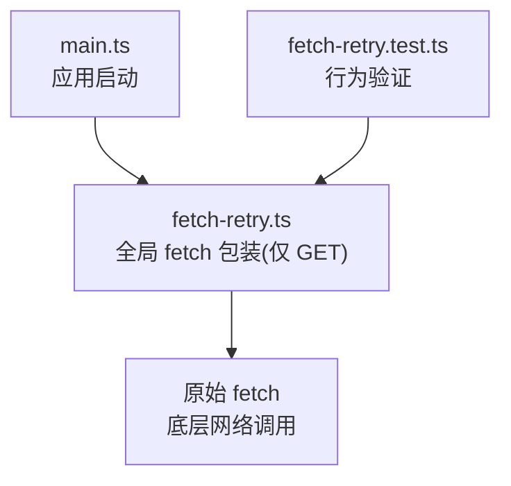
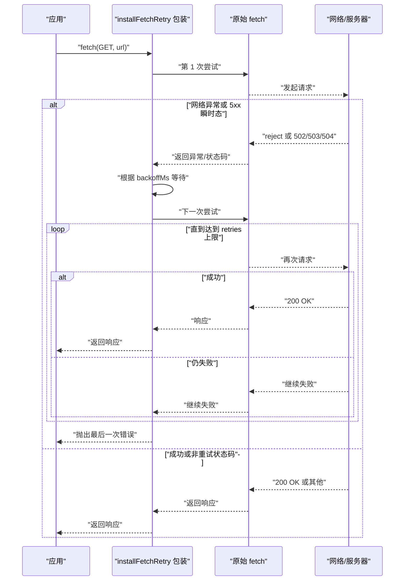
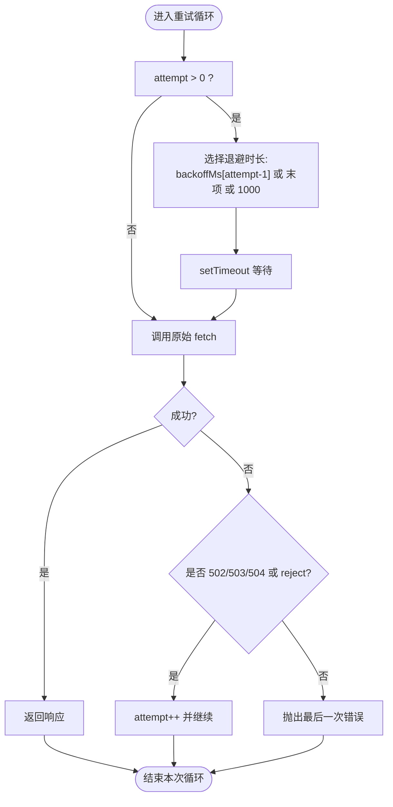
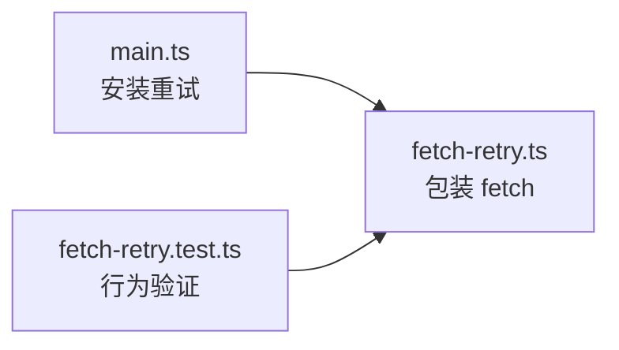

# 错误重试机制

<cite>
**本文引用的文件**   
- [packages/game/src/shell/fetch-retry.ts](file://packages/game/src/shell/fetch-retry.ts)
- [packages/game/src/shell/fetch-retry.test.ts](file://packages/game/src/shell/fetch-retry.test.ts)
- [packages/game/src/main.ts](file://packages/game/src/main.ts)
</cite>

## 目录
1. [简介](#简介)
2. [项目结构](#项目结构)
3. [核心组件](#核心组件)
4. [架构总览](#架构总览)
5. [详细组件分析](#详细组件分析)
6. [依赖分析](#依赖分析)
7. [性能考虑](#性能考虑)
8. [故障排查指南](#故障排查指南)
9. [结论](#结论)
10. [附录](#附录)

## 简介
本文件围绕全局网络层重试机制进行系统化说明，聚焦以下目标：
- 指数退避算法：初始延迟计算、退避因子配置、最大延迟限制
- 失败阈值控制：连续失败计数、成功率统计、熔断器模式实现
- 重试策略配置：按错误类型分类、网络错误特殊处理、业务错误快速失败
- 重试监听器：重试事件通知、进度回调、用户反馈更新
- 智能重试：网络状态检测、服务器负载评估、客户端能力检查
- 重试监控：重试次数统计、成功率分析、性能影响评估

当前仓库已实现一个轻量且幂等安全的 GET 请求级重试兜底（基于全局 fetch 包装），并配套单元测试覆盖关键路径。其余高级特性（如熔断器、监听器、智能重试与监控）在本仓库中尚未实现，文档将给出可落地的扩展建议与集成方式。

## 项目结构
与重试机制直接相关的代码位于游戏包 shell 层，并在应用主入口安装：
- 重试实现：packages/game/src/shell/fetch-retry.ts
- 测试用例：packages/game/src/shell/fetch-retry.test.ts
- 安装位置：packages/game/src/main.ts

图示来源
- [packages/game/src/main.ts:11-12](file://packages/game/src/main.ts#L11-L12)
- [packages/game/src/shell/fetch-retry.ts:20-51](file://packages/game/src/shell/fetch-retry.ts#L20-L51)
- [packages/game/src/shell/fetch-retry.test.ts:1-71](file://packages/game/src/shell/fetch-retry.test.ts#L1-L71)

章节来源
- [packages/game/src/main.ts:11-12](file://packages/game/src/main.ts#L11-L12)
- [packages/game/src/shell/fetch-retry.ts:1-58](file://packages/game/src/shell/fetch-retry.ts#L1-L58)
- [packages/game/src/shell/fetch-retry.test.ts:1-71](file://packages/game/src/shell/fetch-retry.test.ts#L1-L71)

## 核心组件
- 全局安装器：installFetchRetry(opts)
  - 参数
    - retries?: number — 最大重试次数（默认 2）
    - backoffMs?: number[] — 每次重试的退避毫秒数组（默认 [300, 900]）
  - 行为
    - 仅对 GET 请求生效；非幂等方法直接透传不重试
    - 捕获两类可重试条件：
      - 网络层异常（reject）
      - 服务端瞬时错误状态码：502/503/504
    - 使用传入的 backoffMs 作为退避间隔；超出长度时回退到最后一个值或固定上限
    - 重复安装幂等，避免双层包装
- 卸载器（测试用）：uninstallFetchRetryForTest(restoreTo)
  - 用于测试环境还原 globalThis.fetch 并允许重新安装

章节来源
- [packages/game/src/shell/fetch-retry.ts:20-51](file://packages/game/src/shell/fetch-retry.ts#L20-L51)
- [packages/game/src/shell/fetch-retry.ts:54-57](file://packages/game/src/shell/fetch-retry.ts#L54-L57)

## 架构总览
下图展示一次 GET 请求在重试包装下的完整流程，包括退避等待与错误分支。

图示来源
- [packages/game/src/shell/fetch-retry.ts:27-50](file://packages/game/src/shell/fetch-retry.ts#L27-L50)

## 详细组件分析

### 指数退避算法
- 初始延迟计算
  - 首次重试前等待 backoffMs[0]（默认 300ms）
- 退避因子配置
  - 通过 backoffMs 数组显式指定每次重试的等待时间
  - 若 attempt 索引超出数组长度，则使用数组最后一个值作为上限
  - 若数组为空，则回退为固定 1000ms
- 最大延迟限制
  - 由 backoffMs 最后一个元素决定“最大单次退避”
  - 可通过传入更长的数组或增大末尾值来调整上限

图示来源
- [packages/game/src/shell/fetch-retry.ts:34-49](file://packages/game/src/shell/fetch-retry.ts#L34-L49)

章节来源
- [packages/game/src/shell/fetch-retry.ts:23-24](file://packages/game/src/shell/fetch-retry.ts#L23-L24)
- [packages/game/src/shell/fetch-retry.ts:34-49](file://packages/game/src/shell/fetch-retry.ts#L34-L49)

### 失败阈值控制
- 连续失败计数
  - 通过 for 循环的 attempt 计数控制总尝试次数（含首次 + retries 次重试）
- 成功率统计
  - 当前实现未内置统计；可在上层封装处记录成功/失败次数以计算成功率
- 熔断器模式实现
  - 当前未实现熔断器；建议在外部维护滑动窗口或固定窗口的失败率指标，当超过阈值时临时禁用重试

章节来源
- [packages/game/src/shell/fetch-retry.ts:34-49](file://packages/game/src/shell/fetch-retry.ts#L34-L49)

### 重试策略配置
- 按错误类型分类
  - 网络层异常（reject）：触发重试
  - 服务端瞬时错误（502/503/504）：触发重试
  - 资源性错误（如 404）：不重试，原样返回
- 网络错误特殊处理
  - 针对 nginx HTTP/2 GOAWAY 导致的偶发断连场景，GET 请求自动重试提升鲁棒性
- 业务错误快速失败
  - 非 GET 方法（如 POST）不进行重试，避免非幂等副作用

章节来源
- [packages/game/src/shell/fetch-retry.ts:8-12](file://packages/game/src/shell/fetch-retry.ts#L8-L12)
- [packages/game/src/shell/fetch-retry.ts:27-31](file://packages/game/src/shell/fetch-retry.ts#L27-L31)
- [packages/game/src/shell/fetch-retry.ts:40-44](file://packages/game/src/shell/fetch-retry.ts#L40-L44)

### 重试监听器
- 重试事件通知
  - 当前实现未暴露回调接口；如需上报埋点，可在外层包装函数中拦截并重放事件
- 进度回调
  - 当前无进度回调；可在上层聚合多次重试的耗时与次数，形成进度视图
- 用户反馈更新
  - 当前无 UI 联动；可在上层结合加载进度组件提示“正在重试”

章节来源
- [packages/game/src/shell/fetch-retry.ts:20-51](file://packages/game/src/shell/fetch-retry.ts#L20-L51)

### 智能重试
- 网络状态检测
  - 当前未接入 navigator.onLine 等状态；可在外层判断在线状态后再决定是否重试
- 服务器负载评估
  - 当前未读取服务端负载信息；可结合健康检查端点或速率限制头做决策
- 客户端能力检查
  - 当前未做能力探测；可在外层根据设备/浏览器能力动态调整 retries/backoff

章节来源
- [packages/game/src/shell/fetch-retry.ts:20-51](file://packages/game/src/shell/fetch-retry.ts#L20-L51)

### 重试监控
- 重试次数统计
  - 当前未内置计数器；可在上层累计 totalAttempts、retriesUsed、successes、failures
- 成功率分析
  - 基于上述计数计算 successRate = successes / (successes + failures)
- 性能影响评估
  - 通过记录每次请求的总耗时（含退避等待），对比启用/关闭重试时的 P50/P95/P99 变化

章节来源
- [packages/game/src/shell/fetch-retry.ts:34-49](file://packages/game/src/shell/fetch-retry.ts#L34-L49)

## 依赖分析
- main.ts 在安装阶段优先于 boot-loading 包装之前安装重试，确保后续所有 fetch 均受保护
- 测试用例覆盖关键路径：网络异常重试、503 重试、404 不重试、非 GET 不重试、重复安装幂等

图示来源
- [packages/game/src/main.ts:11-12](file://packages/game/src/main.ts#L11-L12)
- [packages/game/src/shell/fetch-retry.ts:20-51](file://packages/game/src/shell/fetch-retry.ts#L20-L51)
- [packages/game/src/shell/fetch-retry.test.ts:14-70](file://packages/game/src/shell/fetch-retry.test.ts#L14-L70)

章节来源
- [packages/game/src/main.ts:11-12](file://packages/game/src/main.ts#L11-L12)
- [packages/game/src/shell/fetch-retry.test.ts:14-70](file://packages/game/src/shell/fetch-retry.test.ts#L14-L70)

## 性能考虑
- 退避等待会增加总体延迟，但能显著降低瞬时错误的失败率
- 合理设置 retries 与 backoffMs 是关键：过多重试会放大尾部延迟，过少则无法有效恢复
- 对于冷启动大量并发 GET 的场景，适度退避有助于缓解服务端瞬时拥塞

## 故障排查指南
- 现象：单个资源加载失败，刷新后正常
  - 可能原因：HTTP/2 连接 GOAWAY 导致在途请求被中断
  - 定位：确认是否命中 502/503/504 或网络层 reject，并观察是否触发了重试
- 现象：POST 请求未重试
  - 预期行为：非 GET 方法不重试，避免非幂等副作用
- 现象：404 未重试
  - 预期行为：资源性错误不重试，直接返回
- 现象：重复安装未出现双层包装
  - 预期行为：installFetchRetry 幂等，重复调用不会叠加包装

章节来源
- [packages/game/src/shell/fetch-retry.test.ts:14-70](file://packages/game/src/shell/fetch-retry.test.ts#L14-L70)

## 结论
当前实现提供了面向 GET 请求的轻量级网络层重试兜底，具备幂等安全、简单可配的退避策略与明确的错误分类。若需在生产中进一步提升稳定性与可观测性，建议在上层补充：
- 失败阈值与熔断器（基于滑动窗口失败率）
- 重试监听器（事件/回调）与用户反馈
- 智能重试（网络状态、负载、能力探测）
- 监控指标（重试次数、成功率、P95/P99 耗时）

## 附录
- 安装顺序注意事项
  - 必须在 initBootLoading 之前安装，以确保后续 boot-loading 包装还原后的 fetch 仍能命中重试逻辑

章节来源
- [packages/game/src/shell/fetch-retry.ts:14-16](file://packages/game/src/shell/fetch-retry.ts#L14-L16)
- [packages/game/src/main.ts:11-12](file://packages/game/src/main.ts#L11-L12)