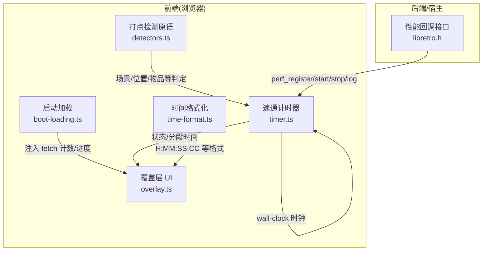
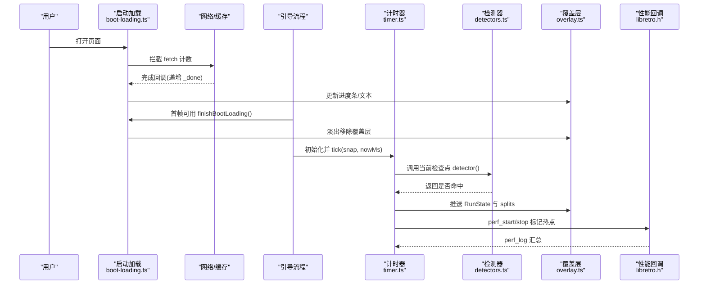
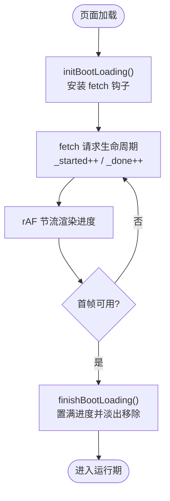
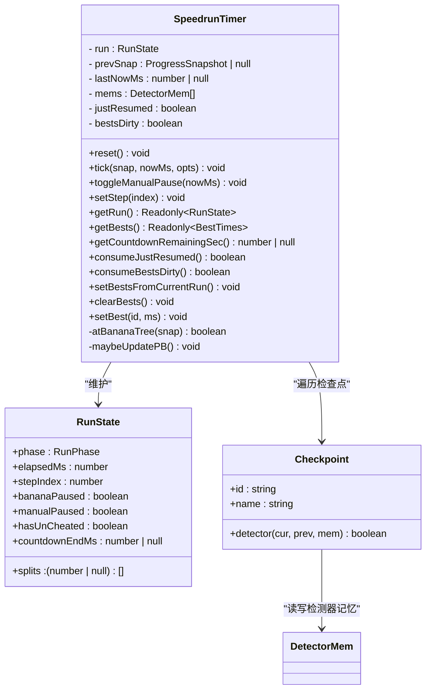
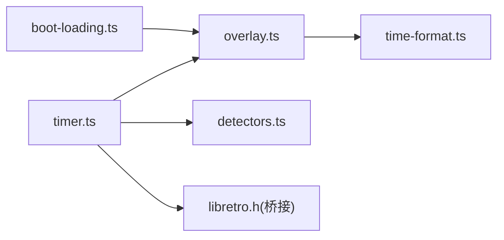

# 性能监控系统

<cite>
**本文引用的文件**   
- [packages/game/src/tools/speedrun/timer.ts](file://packages/game/src/tools/speedrun/timer.ts)
- [packages/game/src/tools/speedrun/detectors.ts](file://packages/game/src/tools/speedrun/detectors.ts)
- [packages/game/src/tools/speedrun/overlay.ts](file://packages/game/src/tools/speedrun/overlay.ts)
- [packages/game/src/tools/speedrun/time-format.ts](file://packages/game/src/tools/speedrun/time-format.ts)
- [packages/game/src/shell/boot-loading.ts](file://packages/game/src/shell/boot-loading.ts)
- [reference/sdlpal/libretro/sdl-libretro/libretro.h](file://reference/sdlpal/libretro/sdl-libretro/libretro.h)
</cite>

## 目录
1. [引言](#引言)
2. [项目结构](#项目结构)
3. [核心组件](#核心组件)
4. [架构总览](#架构总览)
5. [详细组件分析](#详细组件分析)
6. [依赖分析](#依赖分析)
7. [性能考量](#性能考量)
8. [故障排查指南](#故障排查指南)
9. [结论](#结论)
10. [附录](#附录)

## 引言
本文件面向“性能监控系统”的落地方案与实现说明，围绕以下目标展开：
- 加载时间统计：首帧时间、资源加载耗时、渲染延迟测量
- 内存使用分析：堆内存监控、对象数量统计、内存泄漏检测
- 瓶颈识别算法：CPU 热点分析、I/O 等待检测、带宽利用率监控
- 指标收集：关键性能指标(KPI)、自定义埋点、实时上报
- 性能报告：可视化图表、趋势分析、告警机制
- 优化建议：基于数据的性能调优、最佳实践指导

本项目已具备若干与性能观测密切相关的模块（启动期资源加载进度、速通计时与打点、C 层性能计数器接口），可作为性能监控系统的基座。

## 项目结构
与性能监控直接相关的代码主要分布在游戏包的工具层与启动壳层，以及参考 C 层的性能回调接口：
- 启动期资源加载与首帧可见性控制
- 速通计时器与打点检测原语（可用于分段耗时统计）
- 覆盖层 UI（用于展示运行态指标）
- C 层 retro_perf_callback（可用于 CPU 热点采集）

图示来源
- [packages/game/src/shell/boot-loading.ts:1-150](file://packages/game/src/shell/boot-loading.ts#L1-L150)
- [packages/game/src/tools/speedrun/timer.ts:1-217](file://packages/game/src/tools/speedrun/timer.ts#L1-L217)
- [packages/game/src/tools/speedrun/detectors.ts:1-64](file://packages/game/src/tools/speedrun/detectors.ts#L1-L64)
- [packages/game/src/tools/speedrun/overlay.ts:1-117](file://packages/game/src/tools/speedrun/overlay.ts#L1-L117)
- [packages/game/src/tools/speedrun/time-format.ts:1-36](file://packages/game/src/tools/speedrun/time-format.ts#L1-L36)
- [reference/sdlpal/libretro/sdl-libretro/libretro.h:2384-2496](file://reference/sdlpal/libretro/sdl-libretro/libretro.h#L2384-L2496)

章节来源
- [packages/game/src/shell/boot-loading.ts:1-150](file://packages/game/src/shell/boot-loading.ts#L1-L150)
- [packages/game/src/tools/speedrun/timer.ts:1-217](file://packages/game/src/tools/speedrun/timer.ts#L1-L217)
- [packages/game/src/tools/speedrun/detectors.ts:1-64](file://packages/game/src/tools/speedrun/detectors.ts#L1-L64)
- [packages/game/src/tools/speedrun/overlay.ts:1-117](file://packages/game/src/tools/speedrun/overlay.ts#L1-L117)
- [packages/game/src/tools/speedrun/time-format.ts:1-36](file://packages/game/src/tools/speedrun/time-format.ts#L1-L36)
- [reference/sdlpal/libretro/sdl-libretro/libretro.h:2384-2496](file://reference/sdlpal/libretro/sdl-libretro/libretro.h#L2384-L2496)

## 核心组件
- 启动加载进度与首帧可见性
  - 通过拦截全局 fetch 统计请求发起与完成数，驱动进度条与提示文本；在首帧可用时淡出移除覆盖层，确保用户感知到的“首帧时间”更贴近真实体验。
- 速通计时器与打点
  - 以 wall-clock 为主时钟，按“进入可移动场景”起表，支持手动暂停/恢复与香蕉树中场休息逻辑；每帧推进一个检查点并记录累计时间，便于分段耗时分析。
- 打点检测原语
  - 提供进入/离开场景、坐标容差命中、Boss 战结束、持有物品、BGM 切换等纯函数检测器，供计时器逐帧判定。
- 覆盖层 UI
  - 右侧面板展示节点名、最佳时间、差值、本次时间与预计通关，底部显示主计时；样式与 DOM 注入均无交互穿透，避免影响运行时性能。
- C 层性能回调
  - retro_perf_callback 提供注册、开始、停止与日志输出能力，适合对热点路径进行细粒度计时。

章节来源
- [packages/game/src/shell/boot-loading.ts:1-150](file://packages/game/src/shell/boot-loading.ts#L1-L150)
- [packages/game/src/tools/speedrun/timer.ts:1-217](file://packages/game/src/tools/speedrun/timer.ts#L1-L217)
- [packages/game/src/tools/speedrun/detectors.ts:1-64](file://packages/game/src/tools/speedrun/detectors.ts#L1-L64)
- [packages/game/src/tools/speedrun/overlay.ts:1-117](file://packages/game/src/tools/speedrun/overlay.ts#L1-L117)
- [reference/sdlpal/libretro/sdl-libretro/libretro.h:2384-2496](file://reference/sdlpal/libretro/sdl-libretro/libretro.h#L2384-L2496)

## 架构总览
下图展示了从启动到运行期的关键性能数据流：启动期通过 fetch 计数估算资源加载进度；运行期由计时器与检测器产生分段耗时；UI 负责呈现；C 层回调为热点分析提供底层支撑。

图示来源
- [packages/game/src/shell/boot-loading.ts:1-150](file://packages/game/src/shell/boot-loading.ts#L1-L150)
- [packages/game/src/tools/speedrun/timer.ts:1-217](file://packages/game/src/tools/speedrun/timer.ts#L1-L217)
- [packages/game/src/tools/speedrun/detectors.ts:1-64](file://packages/game/src/tools/speedrun/detectors.ts#L1-L64)
- [packages/game/src/tools/speedrun/overlay.ts:1-117](file://packages/game/src/tools/speedrun/overlay.ts#L1-L117)
- [reference/sdlpal/libretro/sdl-libretro/libretro.h:2384-2496](file://reference/sdlpal/libretro/sdl-libretro/libretro.h#L2384-L2496)

## 详细组件分析

### 启动加载与首帧时间
- 设计要点
  - 通过包装全局 fetch，统计 _started/_done，结合预估总量 EXPECTED_BOOT_REQUESTS 计算单调进度，避免分波加载导致的回退。
  - 首帧可用后调用 finishBootLoading，将进度置满并淡出移除覆盖层，保证“首帧时间”反映真实可交互时刻。
  - 生产环境两段进度：必要资源就绪回调给统一 UI，不直接操作 #boot-loading DOM，避免闪烁。
- 关键行为
  - initBootLoading(expectedTotal?, onProgress?)：安装 fetch 钩子、重置计数、可选回调必要资源进度。
  - setBootLoadingNote(note)：追加说明文本，辅助定位长尾资源。
  - finishBootLoading()/failBootLoading(msg)：收尾或错误提示。
- 与首帧时间的关系
  - 首帧时间 = 首次 rAF 主循环启动并完成首帧绘制的时间点；finishBootLoading 作为“首帧可见”的强信号，可与上层绘制事件对齐。

图示来源
- [packages/game/src/shell/boot-loading.ts:1-150](file://packages/game/src/shell/boot-loading.ts#L1-L150)

章节来源
- [packages/game/src/shell/boot-loading.ts:1-150](file://packages/game/src/shell/boot-loading.ts#L1-L150)

### 速通计时器与分段耗时
- 设计要点
  - 以 wall-clock 为主时钟，进入可移动场景且 scene>0 起表；支持手动暂停(F8)与香蕉树中场休息，恢复时清零 dt 避免计入暂停期。
  - 每帧至多推进一个检查点，记录 splits 累计时间，通关时对比 PB 自动更新最佳。
- 关键 API
  - reset()/setStep(index)/toggleManualPause(nowMs)
  - tick(snap, nowMs, opts)：核心推进逻辑
  - getRun()/getBests()/consumeJustResumed()/consumeBestsDirty()
- 复杂度
  - 每帧 O(k)，k 为当前检查点检测器数量；检测器本身多为常数时间比较。

图示来源
- [packages/game/src/tools/speedrun/timer.ts:1-217](file://packages/game/src/tools/speedrun/timer.ts#L1-L217)
- [packages/game/src/tools/speedrun/detectors.ts:1-64](file://packages/game/src/tools/speedrun/detectors.ts#L1-L64)

章节来源
- [packages/game/src/tools/speedrun/timer.ts:1-217](file://packages/game/src/tools/speedrun/timer.ts#L1-L217)
- [packages/game/src/tools/speedrun/detectors.ts:1-64](file://packages/game/src/tools/speedrun/detectors.ts#L1-L64)

### 打点检测原语
- 功能清单
  - enterScene(n)/leaveScene(n)/enterAnyScene(ns)：场景边界检测
  - atSpot(scene, x, y, tolX, tolY)/atAnySpot(...)：坐标容差命中
  - bossWon(enemyId)：Boss 战结束
  - hasItem(itemId)/bgmIs(musicId)：背包/BGM 条件
  - caiyiDetector(enemyId)：特定剧情段两阶段检测
- 特点
  - 纯函数、只读快照、带 DetectorMem 持久化位，便于边沿检测与状态机组合。

章节来源
- [packages/game/src/tools/speedrun/detectors.ts:1-64](file://packages/game/src/tools/speedrun/detectors.ts#L1-L64)

### 覆盖层 UI 与时间格式化
- overlay.ts
  - 动态注入样式与根节点，渲染节点行与底部信息（预计通关、主计时）。
  - 使用 pointer-events:none 避免遮挡交互。
- time-format.ts
  - formatClock(formatHms/formatDiff/parseHms)：毫秒与可读字符串互转，支持厘秒显示。

章节来源
- [packages/game/src/tools/speedrun/overlay.ts:1-117](file://packages/game/src/tools/speedrun/overlay.ts#L1-L117)
- [packages/game/src/tools/speedrun/time-format.ts:1-36](file://packages/game/src/tools/speedrun/time-format.ts#L1-L36)

### C 层性能回调（CPU 热点分析）
- retro_perf_callback 提供：
  - 注册/开始/停止/日志输出
  - 高精度时间获取与 CPU 特性探测
- 适用场景
  - 对渲染/物理/脚本执行等热点路径进行微基准计时，配合上层 KPI 聚合。

章节来源
- [reference/sdlpal/libretro/sdl-libretro/libretro.h:2384-2496](file://reference/sdlpal/libretro/sdl-libretro/libretro.h#L2384-L2496)

## 依赖分析
- 模块耦合
  - boot-loading.ts 仅依赖 DOM 与全局 fetch，职责单一，低耦合。
  - timer.ts 依赖 detectors.ts 提供的检测器与外部传入的快照；与 overlay.ts 解耦，后者仅消费 RunState。
  - overlay.ts 依赖 time-format.ts 做展示格式化。
  - libretro.h 为 C 层接口，JS 侧可通过桥接接入。
- 潜在风险
  - 若 overlay 频繁全量重建 DOM，可能带来布局抖动；应改为增量更新或虚拟列表。
  - 检测器中大量 Set/Map 构造需关注 GC 压力，尽量复用集合实例。

图示来源
- [packages/game/src/shell/boot-loading.ts:1-150](file://packages/game/src/shell/boot-loading.ts#L1-L150)
- [packages/game/src/tools/speedrun/timer.ts:1-217](file://packages/game/src/tools/speedrun/timer.ts#L1-L217)
- [packages/game/src/tools/speedrun/detectors.ts:1-64](file://packages/game/src/tools/speedrun/detectors.ts#L1-L64)
- [packages/game/src/tools/speedrun/overlay.ts:1-117](file://packages/game/src/tools/speedrun/overlay.ts#L1-L117)
- [packages/game/src/tools/speedrun/time-format.ts:1-36](file://packages/game/src/tools/speedrun/time-format.ts#L1-L36)
- [reference/sdlpal/libretro/sdl-libretro/libretro.h:2384-2496](file://reference/sdlpal/libretro/sdl-libretro/libretro.h#L2384-L2496)

## 性能考量
- 首帧时间
  - 使用 finishBootLoading 作为“首帧可见”信号，结合上层绘制事件（如 requestAnimationFrame 回调或 Canvas 首帧绘制）精确度量。
- 资源加载耗时
  - 利用 initBootLoading 的 fetch 钩子统计 _started/_done，结合 EXPECTED_BOOT_REQUESTS 得到单调进度；必要时用 setBootLoadingNote 标注长尾资源。
- 渲染延迟测量
  - 在 rAF 回调中记录 nowMs，与上一帧时间差评估帧间隔；可将此数据写入 RunState 或通过 overlay 展示。
- 内存使用分析
  - 建议在浏览器 DevTools 中定期采样 Heap Snapshot，关注对象增长趋势；在关键路径减少临时对象分配，复用数组/Set/Map。
- 瓶颈识别
  - 使用 retro_perf_callback 对热点函数进行 start/stop 包裹，导出 total/call_cnt 进行排序定位。
  - I/O 等待检测：统计 fetch 请求的发起与完成时间差，识别慢资源；带宽利用率可由单位时间内传输字节数估算。
- 指标收集与上报
  - 将 KPI（首帧时间、各分段耗时、帧间隔分布、内存峰值）聚合为结构化事件，批量上报至后端或本地存储。
- 报告与告警
  - 可视化：折线图(首帧/分段耗时趋势)、柱状图(热点函数占比)、热力图(帧间隔分布)。
  - 告警：当首帧超过阈值、某分段耗时突增、帧率低于下限持续 N 秒时触发告警。

[本节为通用指导，无需具体文件引用]

## 故障排查指南
- 启动失败无反馈
  - 现象：黑屏无提示。
  - 处理：failBootLoading(msg) 会保留覆盖层并显示错误信息，便于快速定位。
- 进度条回退
  - 现象：分波加载导致进度回退。
  - 处理：使用 max(_started, EXPECTED_BOOT_REQUESTS) 作为分母，并 clamp 显示值不回退。
- 覆盖层遮挡交互
  - 现象：UI 阻止点击。
  - 处理：确保 overlay 容器设置 pointer-events:none，或使用非交互区域。
- 计时异常
  - 现象：暂停期间仍累计时间。
  - 处理：确认在恢复帧将 dt 归零，并在 live 判断中排除 bananaPaused/manualPaused。

章节来源
- [packages/game/src/shell/boot-loading.ts:1-150](file://packages/game/src/shell/boot-loading.ts#L1-L150)
- [packages/game/src/tools/speedrun/timer.ts:1-217](file://packages/game/src/tools/speedrun/timer.ts#L1-L217)
- [packages/game/src/tools/speedrun/overlay.ts:1-117](file://packages/game/src/tools/speedrun/overlay.ts#L1-L117)

## 结论
本项目已具备性能监控的关键基础设施：启动期资源进度与首帧可见性控制、运行期分段耗时与打点检测、覆盖层可视化与 C 层性能回调。在此基础上，可进一步扩展内存与带宽监控、KPI 聚合上报与可视化报告，形成完整的性能闭环。

[本节为总结性内容，无需具体文件引用]

## 附录
- 术语
  - 首帧时间：用户首次看到可交互画面的时间
  - 分段耗时：按检查点划分的累计时间
  - 帧间隔：相邻两帧的时间差
- 建议的最佳实践
  - 将检测器保持为纯函数，避免副作用
  - 复用集合与缓冲，降低 GC 压力
  - 对热点路径使用 retro_perf_callback 进行细粒度计时
  - 将 KPI 上报与可视化看板集成，建立长期趋势追踪

[本节为补充说明，无需具体文件引用]