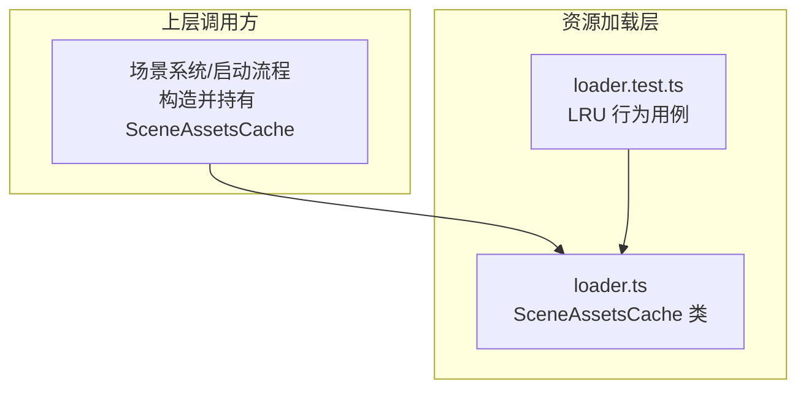
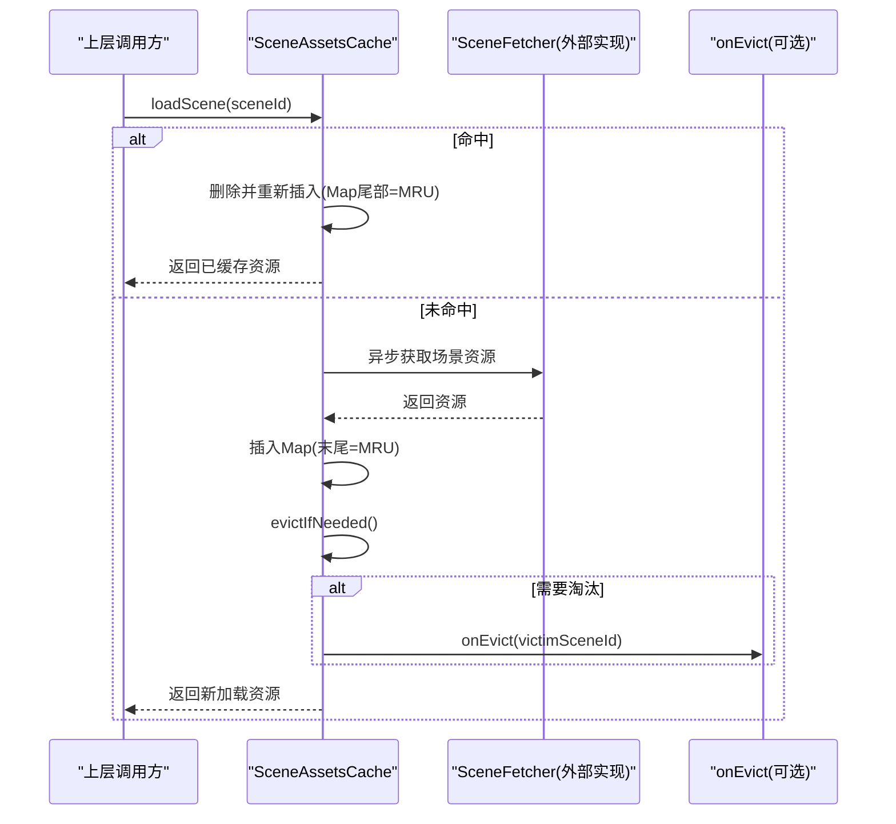
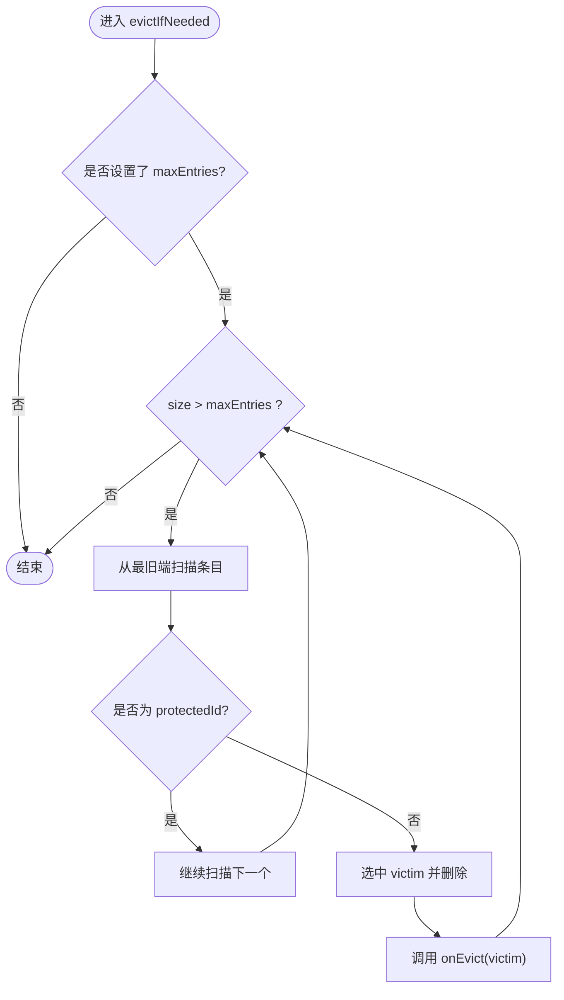
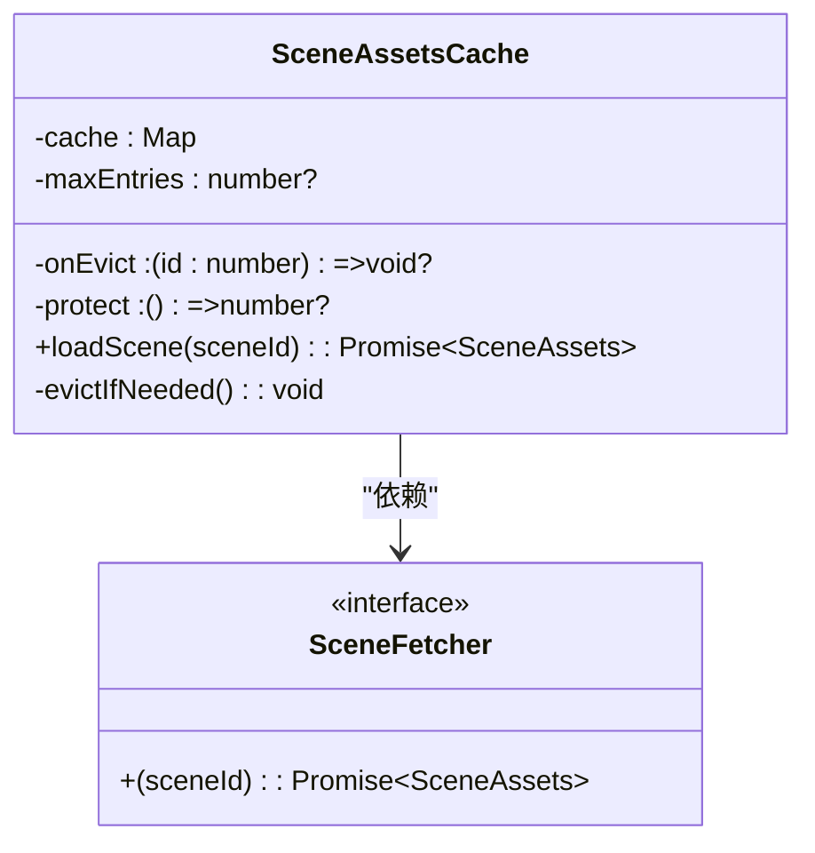

# LRU缓存实现

<cite>
**本文引用的文件**   
- [loader.ts](file://packages/game/src/assets/loader.ts)
- [loader.test.ts](file://packages/game/src/assets/loader.test.ts)
</cite>

## 目录
1. [简介](#简介)
2. [项目结构](#项目结构)
3. [核心组件](#核心组件)
4. [架构总览](#架构总览)
5. [详细组件分析](#详细组件分析)
6. [依赖关系分析](#依赖关系分析)
7. [性能与内存特性](#性能与内存特性)
8. [故障排查指南](#故障排查指南)
9. [结论](#结论)
10. [附录：配置选项与使用建议](#附录配置选项与使用建议)

## 简介
本文件围绕仓库中的场景资源懒加载缓存（SceneAssetsCache）进行系统化文档化，聚焦其作为 LRU（最近最少使用）缓存的实现原理、数据结构设计、容量控制与淘汰策略、访问频率更新机制、命中率优化思路、可配置项以及基准测试与内存占用分析方法。该缓存用于在运行时按需加载场景资源，并通过有界缓存避免全量常驻导致的内存膨胀。

## 项目结构
LRU 缓存的核心实现在资源加载模块中，提供面向“场景资源”的懒加载与淘汰能力；配套单元测试覆盖了命中、淘汰、保护等关键路径。

图表来源
- [loader.ts:451-498](file://packages/game/src/assets/loader.ts#L451-L498)
- [loader.test.ts:20-129](file://packages/game/src/assets/loader.test.ts#L20-L129)

章节来源
- [loader.ts:430-498](file://packages/game/src/assets/loader.ts#L430-L498)
- [loader.test.ts:20-129](file://packages/game/src/assets/loader.test.ts#L20-L129)

## 核心组件
- 场景资源缓存接口与选项
  - 最大条目数 maxEntries：启用有界 LRU；省略则无限缓存（向后兼容）。
  - 淘汰回调 onEvict：当某 sceneId 被移出缓存时触发，供调用方清理并行持有的大对象（如 tileImagesBySceneId）。
  - 保护函数 protect：返回当前不可淘汰的 sceneId（正在渲染的场景），即使位于 LRU 最旧端也不被淘汰，防止黑屏。
- 缓存类 SceneAssetsCache
  - 内部以 JS Map 维护键值对，利用 Map 迭代顺序即插入顺序的特性，将 MRU 置于末尾、LRU 置于头部。
  - loadScene(sceneId)：命中则刷新 recency（删除后重新 set 到末尾），未命中则通过 fetcher 获取并插入，随后执行淘汰检查。
  - evictIfNeeded()：当 size > maxEntries 时，从最旧端扫描第一个非 protected 的条目进行淘汰，并调用 onEvict。

章节来源
- [loader.ts:442-498](file://packages/game/src/assets/loader.ts#L442-L498)

## 架构总览
下图展示了 SceneAssetsCache 在资源加载链路中的位置与交互：上层按场景 ID 请求资源，缓存负责命中判断、recency 更新、容量控制与淘汰回调。

图表来源
- [loader.ts:467-498](file://packages/game/src/assets/loader.ts#L467-L498)

## 详细组件分析

### 数据结构与算法
- 数据结构
  - 使用 JS Map<number, SceneAssets> 作为底层容器，天然保持插入顺序。
  - 约定：迭代序 = LRU→MRU；命中时将键删除再 set，使其移动到 MRU 端。
- 时间复杂度
  - get(loadScene 命中分支)：O(1)（Map.get + delete + set）。
  - put(loadScene 未命中分支)：O(1)（Map.set），淘汰阶段为 O(k)，k 为超出容量的数量，通常 k 很小。
- 空间复杂度
  - 与缓存条目数线性相关；受 maxEntries 限制时可控。

章节来源
- [loader.ts:452-498](file://packages/game/src/assets/loader.ts#L452-L498)

### 容量控制与淘汰策略
- 容量上限
  - 通过 maxEntries 指定；若未设置，则不启用淘汰（无限缓存）。
- 淘汰触发条件
  - 每次插入后检查 size > maxEntries，循环淘汰直到满足上限。
- 淘汰规则
  - 从 Map 最旧端开始扫描，跳过被 protect 保护的 sceneId，选择首个非保护条目淘汰。
  - 若仅剩 protected 条目，则停止淘汰（宁可超 cap 也不影响当前渲染场景）。
- 淘汰副作用
  - 调用 onEvict(victim) 通知上层清理与该 sceneId 相关的并行缓存或大对象。

图表来源
- [loader.ts:481-498](file://packages/game/src/assets/loader.ts#L481-L498)

章节来源
- [loader.ts:481-498](file://packages/game/src/assets/loader.ts#L481-L498)

### 访问频率统计与 recency 更新
- 访问时间戳更新
  - 采用“移动至 MRU 端”的策略：命中时先 delete 再 set，使该键成为最新访问。
- 链表头部插入逻辑
  - 由于 Map 的 MRU 端在末尾，因此“插入到末尾”等价于“插入到链表头部”。
- 尾部淘汰规则
  - 淘汰从 Map 最旧端（迭代起始处）开始，符合“最久未使用优先淘汰”。

章节来源
- [loader.ts:467-498](file://packages/game/src/assets/loader.ts#L467-L498)

### 命中率优化策略（建议与实践）
- 预取策略
  - 在进入新场景前，基于历史访问模式预测即将使用的场景并提前 loadScene，提升后续命中概率。
- 热点数据保护
  - 使用 protect 回调固定当前渲染场景不被淘汰，避免切换过程中的黑屏或重复加载。
- 批量操作优化
  - 批量加载多个场景时，尽量合并请求并按访问热度排序，减少频繁淘汰带来的抖动。
- 并发与去重
  - 对于同一 sceneId 的并发请求，可在上层做请求去重，避免重复 fetch 与重复插入。

[本节为通用优化建议，不直接分析具体文件]

### 配置选项说明
- 初始容量
  - 通过 maxEntries 控制；默认不传表示无限缓存（向后兼容）。
- 扩容因子
  - 当前实现未内置动态扩容因子；如需渐进式扩容，可在上层根据内存水位或淘汰频率调整 maxEntries。
- 淘汰阈值
  - 即 maxEntries；也可结合 onEvict 统计淘汰率，动态调参。

章节来源
- [loader.ts:442-465](file://packages/game/src/assets/loader.ts#L442-L465)

## 依赖关系分析
- 内部依赖
  - SceneAssetsCache 依赖 JS Map 的有序语义与 O(1) 增删改查。
- 外部依赖
  - 依赖注入的 SceneFetcher 负责实际资源获取；缓存仅关注命中、recency 与淘汰。
- 耦合与内聚
  - 缓存与资源获取解耦，便于替换不同 fetcher 实现（本地/网络/混合）。
  - 淘汰回调 onEvict 将“缓存生命周期事件”暴露给上层，降低耦合度。

图表来源
- [loader.ts:451-498](file://packages/game/src/assets/loader.ts#L451-L498)

章节来源
- [loader.ts:451-498](file://packages/game/src/assets/loader.ts#L451-L498)

## 性能与内存特性
- 时间复杂度
  - 命中：O(1)
  - 未命中插入：O(1)
  - 淘汰：O(k)，k 通常为常数级（超出容量的小段）
- 空间复杂度
  - 与缓存条目数线性相关；受 maxEntries 约束后可控。
- 内存占用监控
  - 通过 onEvict 回调联动清理大对象（例如 tileImagesBySceneId），避免内存泄漏。
  - 建议在开发环境记录 onEvict 次数与缓存大小变化，评估 maxEntries 合理性。
- 基准测试建议
  - 构建不同 maxEntries 下的命中/淘汰曲线，对比 fetcher 调用次数与内存峰值。
  - 模拟热点访问分布（Zipf 分布）验证 recency 更新的有效性。

[本节为通用性能讨论，不直接分析具体文件]

## 故障排查指南
- 症状：频繁触发 onEvict 且命中率低
  - 可能原因：maxEntries 过小或访问模式过于分散。
  - 处理建议：增大 maxEntries；引入预取与热点保护。
- 症状：当前场景被意外淘汰导致黑屏
  - 可能原因：未正确设置 protect 或未返回当前渲染 sceneId。
  - 处理建议：确保 protect 始终返回当前场景 id，并在场景切换时及时更新。
- 症状：无限增长导致内存升高
  - 可能原因：未设置 maxEntries。
  - 处理建议：在生产环境显式传入 maxEntries，并结合 onEvict 清理并行缓存。

章节来源
- [loader.ts:481-498](file://packages/game/src/assets/loader.ts#L481-L498)

## 结论
SceneAssetsCache 以 JS Map 的顺序语义实现了简洁高效的 LRU 缓存：命中 O(1)、插入 O(1)、淘汰 O(k)。通过 maxEntries、onEvict 与 protect 三项配置，兼顾了内存可控、上层资源清理与运行期稳定性。配合预取、热点保护与批量优化，可进一步提升命中率与用户体验。

[本节为总结性内容，不直接分析具体文件]

## 附录：配置选项与使用建议
- 配置项
  - maxEntries：最大缓存条目数；省略表示无限缓存。
  - onEvict：淘汰回调，用于清理与 sceneId 关联的大对象。
  - protect：返回当前不可淘汰的 sceneId，防止黑屏。
- 使用建议
  - 生产环境务必设置 maxEntries，并结合 onEvict 清理并行缓存。
  - 在场景切换前后合理设置 protect，避免当前场景被误淘汰。
  - 针对热点场景实施预取，提高整体命中率。

章节来源
- [loader.ts:442-465](file://packages/game/src/assets/loader.ts#L442-L465)