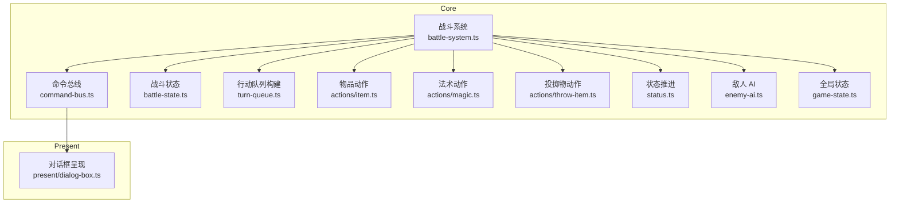
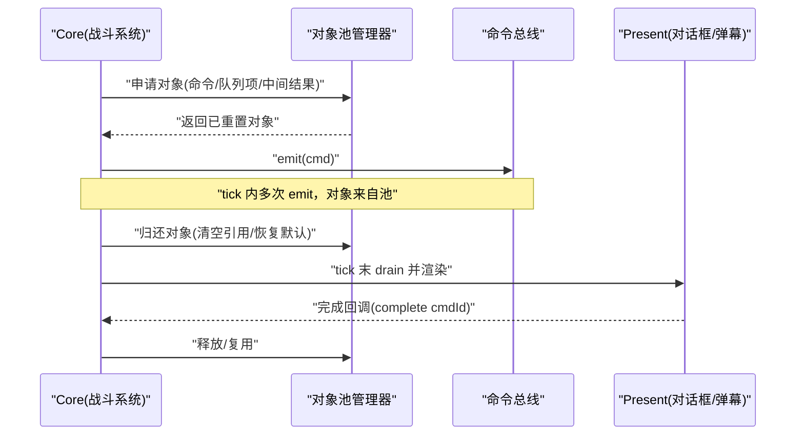
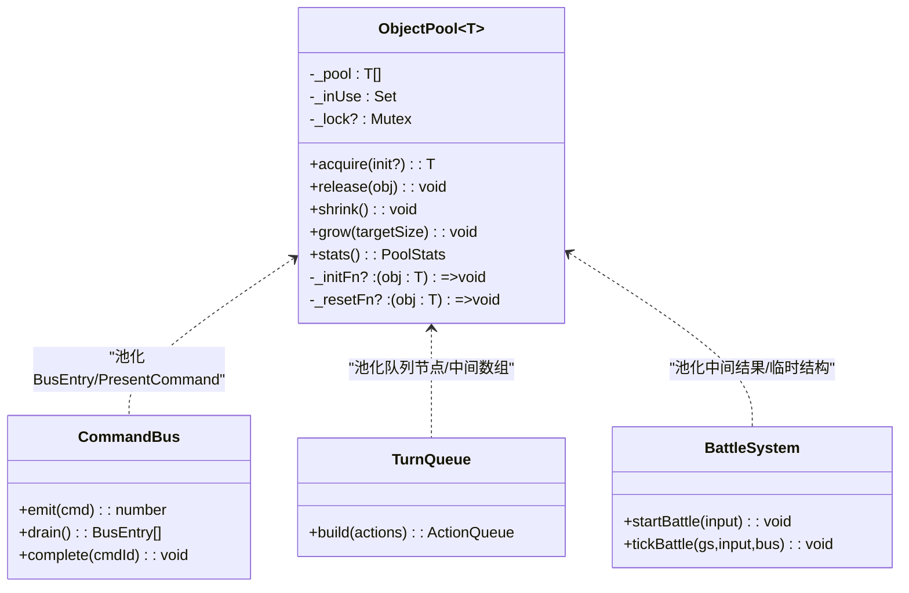
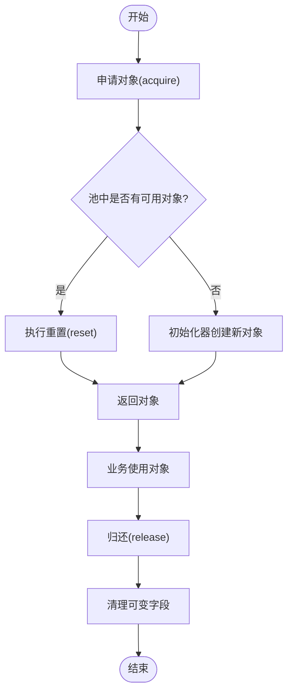
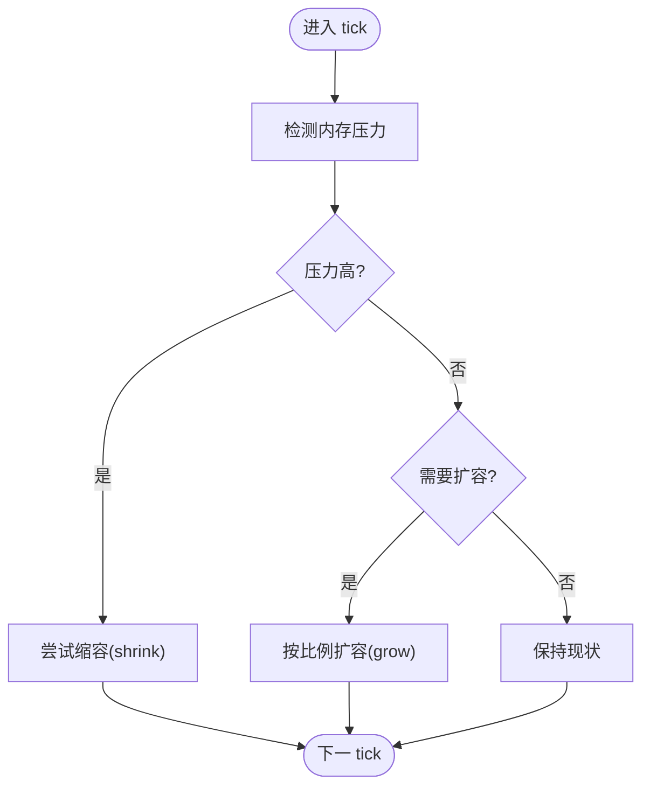
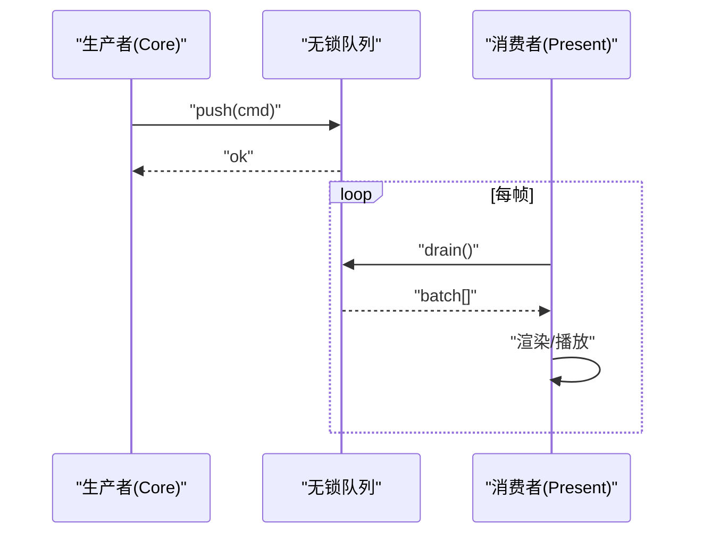
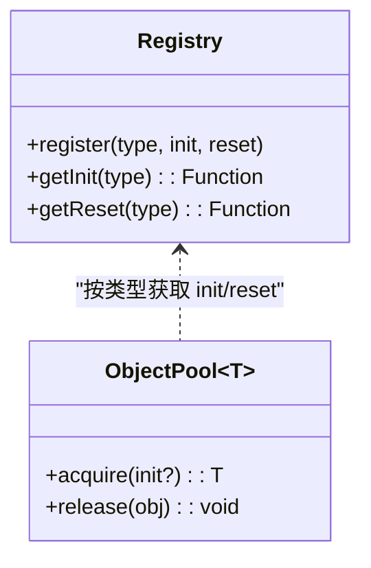
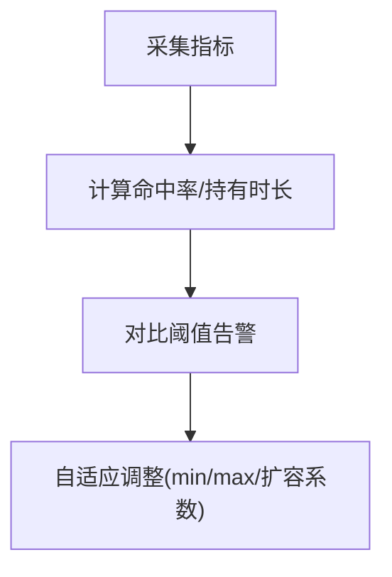
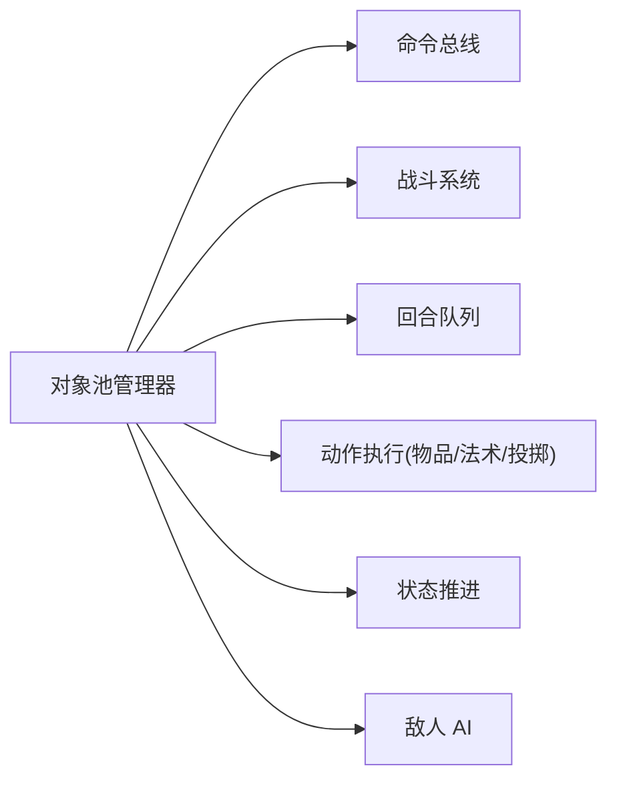

# 对象池管理

<cite>
**本文引用的文件**   
- [packages/game/src/core/command-bus.ts](file://packages/game/src/core/command-bus.ts)
- [packages/game/src/core/battle/battle-system.ts](file://packages/game/src/core/battle/battle-system.ts)
- [packages/game/src/core/battle/battle-state.ts](file://packages/game/src/core/battle/battle-state.ts)
- [packages/game/src/core/battle/turn-queue.ts](file://packages/game/src/core/battle/turn-queue.ts)
- [packages/game/src/core/battle/actions/item.ts](file://packages/game/src/core/battle/actions/item.ts)
- [packages/game/src/core/battle/actions/magic.ts](file://packages/game/src/core/battle/actions/magic.ts)
- [packages/game/src/core/battle/actions/throw-item.ts](file://packages/game/src/core/battle/actions/throw-item.ts)
- [packages/game/src/core/battle/status.ts](file://packages/game/src/core/battle/status.ts)
- [packages/game/src/core/battle/enemy-ai.ts](file://packages/game/src/core/battle/enemy-ai.ts)
- [packages/game/src/core/battle/__tests__/battle-opcodes.test.ts](file://packages/game/src/core/battle/__tests__/battle-opcodes.test.ts)
- [packages/game/src/core/battle/__tests__/battle-system.test.ts](file://packages/game/src/core/battle/__tests__/battle-system.test.ts)
- [packages/game/src/core/game-state.ts](file://packages/game/src/core/game-state.ts)
- [packages/game/src/present/dialog-box.ts](file://packages/game/src/present/dialog-box.ts)
</cite>

## 目录
1. [引言](#引言)
2. [项目结构](#项目结构)
3. [核心组件](#核心组件)
4. [架构总览](#架构总览)
5. [详细组件分析](#详细组件分析)
6. [依赖关系分析](#依赖关系分析)
7. [性能考量](#性能考量)
8. [故障排查指南](#故障排查指南)
9. [结论](#结论)
10. [附录](#附录)

## 引言
本文件围绕“对象池管理系统”的设计与实现进行系统化文档化，聚焦以下目标：
- 对象复用机制、生命周期管理与内存泄漏防护策略
- 对象创建与回收流程：初始化池化对象、获取时状态重置、归还时清理逻辑
- 池大小动态调整：最小/最大容量限制、自动扩容缩容策略、内存压力检测
- 线程安全考虑：并发访问保护、锁机制设计、无锁队列实现
- 对象类型注册机制：泛型支持、类型安全检查、自定义初始化器
- 性能监控：对象分配统计、池利用率分析、GC 压力评估

说明：当前仓库未提供通用对象池基础设施。本文以战斗系统为切入点，结合现有代码中的“临时池/队列/缓存”模式（如行动队列、命令通道、资源缓存等），抽象出可复用的对象池设计方案，并给出在现有工程中的落地建议与路径。

## 项目结构
与对象池相关的关键位置集中在游戏运行时 core 层与 present 层：
- Core → Present 单向命令通道：用于将核心逻辑产生的表现层指令批量下发，避免频繁 UI 重建
- 战斗系统：包含战斗状态机、回合队列构建、动作执行、状态效果推进等
- 资源缓存：战斗期间对 items/spells/magics/playerRoles 等表进行集中缓存，减少跨层查找成本

图表来源
- [packages/game/src/core/command-bus.ts:1-89](file://packages/game/src/core/command-bus.ts#L1-L89)
- [packages/game/src/core/battle/battle-system.ts:1-800](file://packages/game/src/core/battle/battle-system.ts#L1-L800)
- [packages/game/src/core/battle/battle-state.ts](file://packages/game/src/core/battle/battle-state.ts)
- [packages/game/src/core/battle/turn-queue.ts](file://packages/game/src/core/battle/turn-queue.ts)
- [packages/game/src/core/battle/actions/item.ts](file://packages/game/src/core/battle/actions/item.ts)
- [packages/game/src/core/battle/actions/magic.ts](file://packages/game/src/core/battle/actions/magic.ts)
- [packages/game/src/core/battle/actions/throw-item.ts](file://packages/game/src/core/battle/actions/throw-item.ts)
- [packages/game/src/core/battle/status.ts](file://packages/game/src/core/battle/status.ts)
- [packages/game/src/core/battle/enemy-ai.ts](file://packages/game/src/core/battle/enemy-ai.ts)
- [packages/game/src/core/game-state.ts](file://packages/game/src/core/game-state.ts)
- [packages/game/src/present/dialog-box.ts](file://packages/game/src/present/dialog-box.ts)

章节来源
- [packages/game/src/core/command-bus.ts:1-89](file://packages/game/src/core/command-bus.ts#L1-L89)
- [packages/game/src/core/battle/battle-system.ts:1-800](file://packages/game/src/core/battle/battle-system.ts#L1-L800)

## 核心组件
本节从“对象池视角”审视现有组件中可复用对象的产生、使用与回收方式，并提炼为通用对象池的接口与行为。

- 命令总线（CommandBus）
  - 职责：Core 向 Present 发送一次性表现命令；tick 末统一 drain，降低 UI 重建开销
  - 对象特征：短生命周期、高频 emit/drain，适合用对象池承载 BusEntry 与 PresentCommand
  - 关键接口：emit、drain、complete（预留异步回执）

- 战斗系统（BattleSystem）
  - 职责：战斗主循环、阶段路由、回合队列构建、动作执行、结算与退出
  - 对象特征：每场战斗会构造 BattleState、临时 ActionQueue、动画时间线等；这些对象可在多场战斗间复用

- 回合队列（TurnQueue）
  - 职责：根据 dex 与规则构建本轮行动顺序
  - 对象特征：每轮构建一次，元素数量与参战人数/敌人数量线性相关，适合池化

- 动作执行（Item/Magic/ThrowItem）
  - 职责：具体动作计算与副作用（扣血、加 buff、播放特效等）
  - 对象特征：可能创建中间结果对象（如伤害数值、命中特效参数），适合池化

- 状态推进（Status）
  - 职责：每 tick 推进毒/睡眠/麻痹等状态
  - 对象特征：迭代活体集合，可复用临时数组/映射以减少 GC

- 敌人 AI（EnemyAI）
  - 职责：选择目标、决策行动
  - 对象特征：维护候选池（pool）与排序/筛选中间结构，适合池化

章节来源
- [packages/game/src/core/command-bus.ts:1-89](file://packages/game/src/core/command-bus.ts#L1-L89)
- [packages/game/src/core/battle/battle-system.ts:1-800](file://packages/game/src/core/battle/battle-system.ts#L1-L800)
- [packages/game/src/core/battle/turn-queue.ts](file://packages/game/src/core/battle/turn-queue.ts)
- [packages/game/src/core/battle/actions/item.ts](file://packages/game/src/core/battle/actions/item.ts)
- [packages/game/src/core/battle/actions/magic.ts](file://packages/game/src/core/battle/actions/magic.ts)
- [packages/game/src/core/battle/actions/throw-item.ts](file://packages/game/src/core/battle/actions/throw-item.ts)
- [packages/game/src/core/battle/status.ts](file://packages/game/src/core/battle/status.ts)
- [packages/game/src/core/battle/enemy-ai.ts](file://packages/game/src/core/battle/enemy-ai.ts)

## 架构总览
下图展示“对象池”在现有系统中的潜在落点与数据流：Core 在 tick 内生成大量短期对象，通过对象池减少分配与 GC；Present 消费后归还对象至池。

图表来源
- [packages/game/src/core/command-bus.ts:1-89](file://packages/game/src/core/command-bus.ts#L1-L89)
- [packages/game/src/core/battle/battle-system.ts:1-800](file://packages/game/src/core/battle/battle-system.ts#L1-L800)

## 详细组件分析

### 对象池管理器（设计）
- 设计原则
  - 按类型隔离：不同对象类型独立池，避免类型污染
  - 生命周期闭环：申请→使用→归还→清理→再分配
  - 零拷贝语义：归还前由使用者负责清空可变字段
  - 可扩展：支持自定义初始化器/清理器
- 核心能力
  - 泛型支持：Pool<T>
  - 容量控制：min/max 容量、自动扩容/缩容
  - 并发安全：可选互斥锁或无锁队列（单生产者-多消费者场景）
  - 监控指标：分配次数、命中率、平均持有时间、峰值占用、GC 压力估算
- 典型 API
  - acquire(type, init?)
  - release(obj)
  - shrink() / grow(targetSize)
  - stats()

图表来源
- [packages/game/src/core/command-bus.ts:1-89](file://packages/game/src/core/command-bus.ts#L1-L89)
- [packages/game/src/core/battle/battle-system.ts:1-800](file://packages/game/src/core/battle/battle-system.ts#L1-L800)
- [packages/game/src/core/battle/turn-queue.ts](file://packages/game/src/core/battle/turn-queue.ts)

章节来源
- [packages/game/src/core/command-bus.ts:1-89](file://packages/game/src/core/command-bus.ts#L1-L89)
- [packages/game/src/core/battle/battle-system.ts:1-800](file://packages/game/src/core/battle/battle-system.ts#L1-L800)
- [packages/game/src/core/battle/turn-queue.ts](file://packages/game/src/core/battle/turn-queue.ts)

### 对象创建与回收流程
- 初始化池化对象
  - 首次 acquire 时若池为空则调用初始化器创建新对象
  - 初始化器可注入类型特定默认值（如命令类型、目标索引、颜色等）
- 获取对象时的状态重置
  - 每次 acquire 前执行 reset 函数，确保旧状态不泄露到下一次使用
  - 对于复杂对象，采用浅/深拷贝策略取决于对象是否被共享
- 归还对象时的清理逻辑
  - 使用者在不再持有引用前必须 release
  - release 内部仅清空可变字段，不销毁底层存储，以便复用

[此图为概念流程图，无需源码对应]

### 池大小动态调整
- 最小/最大容量限制
  - minCap：保证基础命中率，避免频繁扩容
  - maxCap：防止内存膨胀，受内存压力阈值触发收缩
- 自动扩容缩容策略
  - 扩容：当 inUse 接近 pool.size 且未达到 maxCap 时按比例增长（如 ×1.5）
  - 缩容：当空闲比例超过阈值且持续时间达到窗口时，逐步缩小至 minCap
- 内存压力检测
  - 基于 JS 引擎指标（如 heapUsed、gcCount）或应用层采样（帧内分配计数）
  - 当检测到压力升高时主动 shrink 并抑制进一步扩容

[此图为概念流程图，无需源码对应]

### 线程安全考虑
- 并发访问保护
  - 单线程 JS 事件循环下，通常无需显式锁；但 Web Worker 或多线程环境需引入互斥
- 锁机制设计
  - 轻量级自旋锁或信号量，仅在 acquire/release 临界区加锁
  - 读写分离：读多写少场景可采用分片锁降低竞争
- 无锁队列实现
  - 单生产者-多消费者：使用环形缓冲 + CAS 操作
  - 多生产者-多消费者：使用分段无锁队列或 lock-free 库

[此图为概念流程图，无需源码对应]

### 对象类型注册机制
- 泛型支持
  - Pool<T> 以类型作为键，避免运行时类型判断
- 类型安全检查
  - 在 acquire 时校验类型一致性，拒绝错误类型混用
- 自定义初始化器
  - 允许为每种类型注册 init/reset 钩子，实现领域特定的默认值与清理

[此图为概念类图，无需源码对应]

### 性能监控
- 对象分配统计
  - 记录每次 acquire/release，统计分配次数、命中率、平均持有时间
- 池利用率分析
  - 计算 inUse/pool.size 比率，识别热点类型与瓶颈
- GC 压力评估
  - 结合 heapUsed/gcCount 变化，评估对象池对 GC 的影响

[此图为概念流程图，无需源码对应]

## 依赖关系分析
- 直接依赖
  - 命令总线依赖对象池以池化 BusEntry 与 PresentCommand
  - 战斗系统依赖对象池以池化中间结果与临时结构
  - 回合队列依赖对象池以池化队列节点与中间数组
- 间接依赖
  - 动作执行模块依赖对象池以池化伤害数值、特效参数等
  - 状态推进模块依赖对象池以池化迭代中间结构
- 外部依赖
  - 无第三方对象池库，全部自实现以降低耦合

图表来源
- [packages/game/src/core/command-bus.ts:1-89](file://packages/game/src/core/command-bus.ts#L1-L89)
- [packages/game/src/core/battle/battle-system.ts:1-800](file://packages/game/src/core/battle/battle-system.ts#L1-L800)
- [packages/game/src/core/battle/turn-queue.ts](file://packages/game/src/core/battle/turn-queue.ts)
- [packages/game/src/core/battle/actions/item.ts](file://packages/game/src/core/battle/actions/item.ts)
- [packages/game/src/core/battle/actions/magic.ts](file://packages/game/src/core/battle/actions/magic.ts)
- [packages/game/src/core/battle/actions/throw-item.ts](file://packages/game/src/core/battle/actions/throw-item.ts)
- [packages/game/src/core/battle/status.ts](file://packages/game/src/core/battle/status.ts)
- [packages/game/src/core/battle/enemy-ai.ts](file://packages/game/src/core/battle/enemy-ai.ts)

章节来源
- [packages/game/src/core/command-bus.ts:1-89](file://packages/game/src/core/command-bus.ts#L1-L89)
- [packages/game/src/core/battle/battle-system.ts:1-800](file://packages/game/src/core/battle/battle-system.ts#L1-L800)

## 性能考量
- 减少分配热点
  - 将高频短命对象（命令、队列项、中间结果）纳入对象池
  - 合并小对象为紧凑结构，减少碎片
- 控制扩容频率
  - 合理设置初始容量与扩容系数，避免抖动
- 避免长持有
  - 严格在作用域结束时 release，防止泄漏
- 监控与调优
  - 基于命中率与持有时长动态调整容量
  - 结合 GC 指标评估优化效果

[本节为通用指导，无需源码对应]

## 故障排查指南
- 常见问题
  - 对象未归还导致泄漏：检查所有 release 路径，尤其是异常分支
  - 状态污染：确认 reset 函数覆盖所有可变字段
  - 容量不足：观察命中率与 inUse 比率，必要时提升 minCap
  - 过度扩容：监控内存压力，启用 shrink 策略
- 定位方法
  - 在 acquire/release 处打点，输出堆栈与持有时长
  - 针对热点类型单独建池并开启更细粒度监控
  - 使用浏览器性能面板观察分配热点与 GC 停顿

章节来源
- [packages/game/src/core/command-bus.ts:1-89](file://packages/game/src/core/command-bus.ts#L1-L89)
- [packages/game/src/core/battle/battle-system.ts:1-800](file://packages/game/src/core/battle/battle-system.ts#L1-L800)

## 结论
尽管当前仓库未提供通用对象池基础设施，但战斗系统与命令总线中存在大量短生命周期对象的使用场景。通过引入统一的对象池管理器，可实现对象复用、生命周期闭环与内存泄漏防护，同时配合动态容量调整与性能监控，显著降低 GC 压力并提升运行稳定性。建议在后续迭代中优先对命令总线、回合队列与动作执行模块落地对象池。

[本节为总结性内容，无需源码对应]

## 附录
- 参考实现要点
  - 命令总线：emit/drain/complete 接口清晰，适合作为对象池的第一个落地点
  - 战斗系统：每场战斗的资源缓存与中间结构可池化，减少跨层查找与分配
  - 测试用例：利用现有单元测试验证对象池的正确性与性能回归

章节来源
- [packages/game/src/core/command-bus.ts:1-89](file://packages/game/src/core/command-bus.ts#L1-L89)
- [packages/game/src/core/battle/battle-system.ts:1-800](file://packages/game/src/core/battle/battle-system.ts#L1-L800)
- [packages/game/src/core/battle/__tests__/battle-opcodes.test.ts:1906-1932](file://packages/game/src/core/battle/__tests__/battle-opcodes.test.ts#L1906-L1932)
- [packages/game/src/core/battle/__tests__/battle-system.test.ts:1421-1459](file://packages/game/src/core/battle/__tests__/battle-system.test.ts#L1421-L1459)