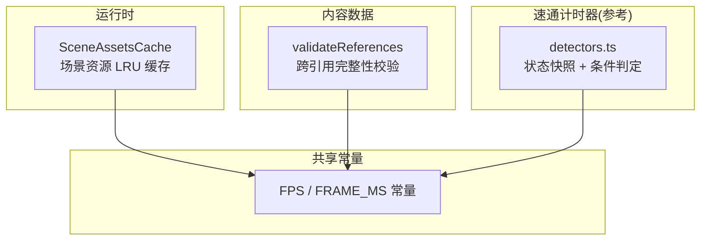
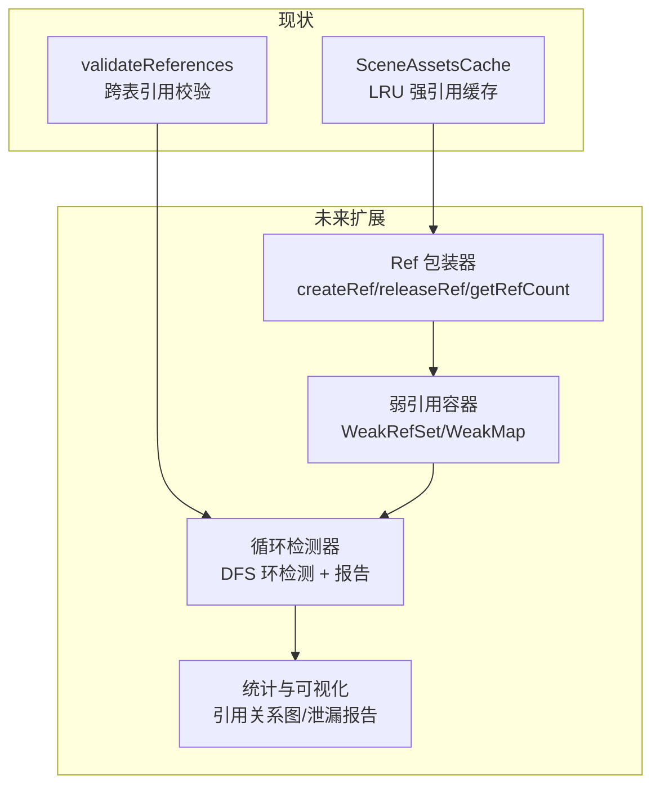
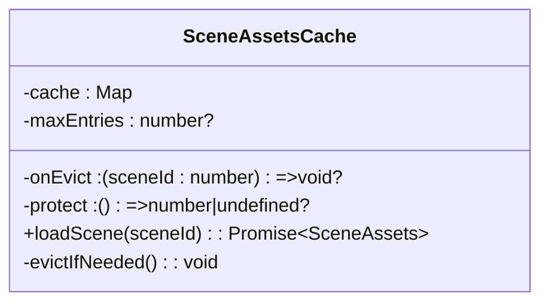
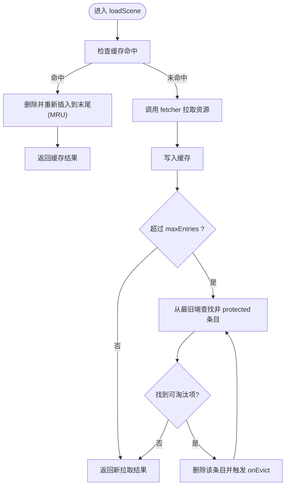
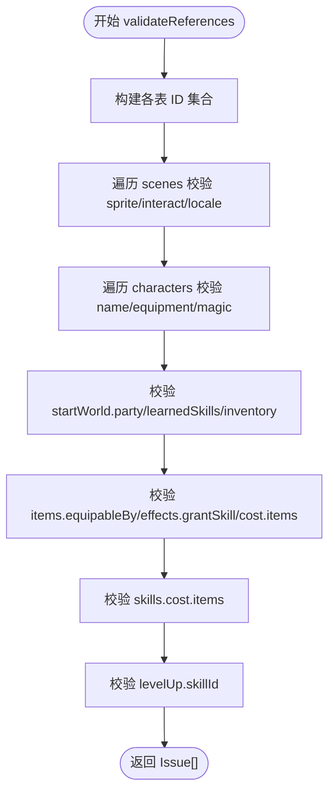
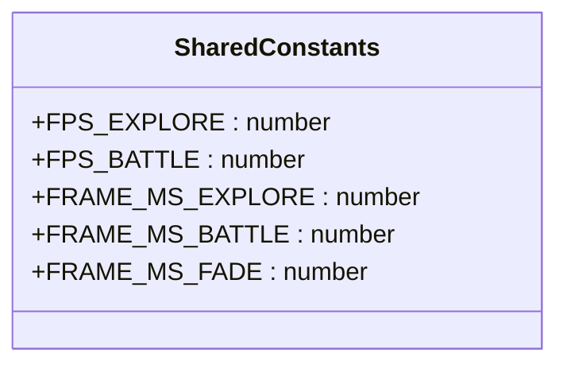
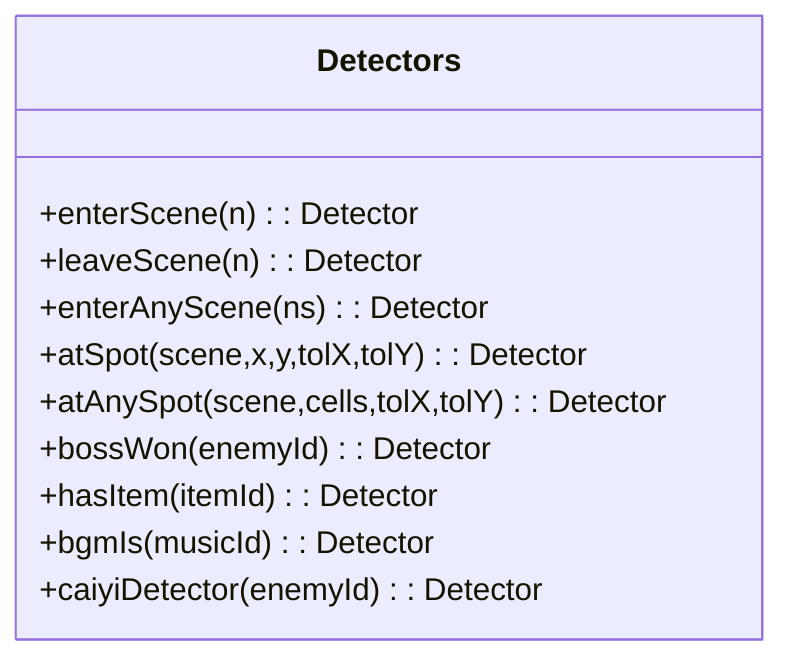
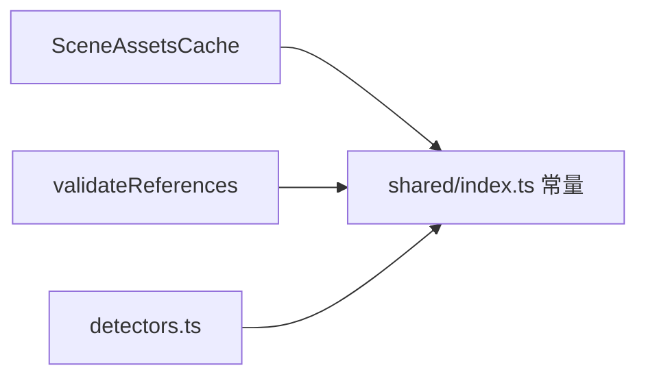

# 引用计数系统

<cite>
**本文引用的文件**
- [packages/game/src/assets/loader.ts](file://packages/game/src/assets/loader.ts)
- [packages/content/src/validate-refs.ts](file://packages/content/src/validate-refs.ts)
- [packages/shared/src/index.ts](file://packages/shared/src/index.ts)
- [docs/phase1/plans/2026-06-18-speedrun-timer.md](file://docs/phase1/plans/2026-06-18-speedrun-timer.md)
</cite>

## 目录
1. [引言](#引言)
2. [项目结构](#项目结构)
3. [核心组件](#核心组件)
4. [架构总览](#架构总览)
5. [详细组件分析](#详细组件分析)
6. [依赖关系分析](#依赖关系分析)
7. [性能考量](#性能考量)
8. [故障排查指南](#故障排查指南)
9. [结论](#结论)
10. [附录](#附录)

## 引言
本文件围绕“引用计数系统”的设计与实现进行系统化说明，重点覆盖以下方面：
- 引用计数机制的实现原理：依赖追踪、自动释放、循环引用检测算法
- 引用生命周期管理：获取时机、释放策略、零引用清理逻辑
- 循环引用检测：图遍历算法、弱引用机制、手动打破循环的方法
- 引用统计与调试：关系可视化、内存泄漏检测工具、引用链分析报告
- API 接口说明：createRef()、releaseRef()、getRefCount() 等使用示例
- 性能影响分析：引用操作开销、与垃圾回收协同、内存碎片化问题

需要特别说明的是：在当前仓库中并未发现显式的“引用计数对象”或 createRef()/releaseRef()/getRefCount() 等 API 的源码实现。因此，本文在“现状映射”部分将基于现有资源缓存与跨引用校验模块，提炼出与引用计数理念高度相关的实践；在“设计建议”部分则给出面向未来扩展的完整方案（含 API 与算法），以便后续落地。

## 项目结构
与“引用计数”主题直接相关的代码主要分布在两个层面：
- 运行时资源层：场景资源 LRU 缓存，体现“按访问热度淘汰”的资源持有与释放策略
- 内容数据层：跨表引用完整性校验，体现“依赖追踪与悬空引用检测”的数据侧能力

图表来源
- [packages/game/src/assets/loader.ts:451-499](file://packages/game/src/assets/loader.ts#L451-L499)
- [packages/content/src/validate-refs.ts:1-155](file://packages/content/src/validate-refs.ts#L1-L155)
- [packages/shared/src/index.ts:14-39](file://packages/shared/src/index.ts#L14-L39)
- [docs/phase1/plans/2026-06-18-speedrun-timer.md:349-403](file://docs/phase1/plans/2026-06-18-speedrun-timer.md#L349-L403)

章节来源
- [packages/game/src/assets/loader.ts:451-499](file://packages/game/src/assets/loader.ts#L451-L499)
- [packages/content/src/validate-refs.ts:1-155](file://packages/content/src/validate-refs.ts#L1-L155)
- [packages/shared/src/index.ts:14-39](file://packages/shared/src/index.ts#L14-L39)
- [docs/phase1/plans/2026-06-18-speedrun-timer.md:349-403](file://docs/phase1/plans/2026-06-18-speedrun-timer.md#L349-L403)

## 核心组件
- 场景资源 LRU 缓存（运行时）
  - 职责：按需加载场景资源，维护最近最少使用顺序，支持保护当前场景不被淘汰，并在超容量时触发淘汰回调
  - 关键行为：命中刷新 MRU、淘汰最旧非保护项、可配置上限与淘汰回调
- 跨引用完整性校验（内容数据）
  - 职责：扫描多表之间的引用关系，报告悬空引用（error/warn），为编辑器与加载器提供前置质量门禁
  - 关键行为：构建各表 ID 集合，逐项校验 sprite/dialogue/locale/item/skill 等引用是否有效

章节来源
- [packages/game/src/assets/loader.ts:451-499](file://packages/game/src/assets/loader.ts#L451-L499)
- [packages/content/src/validate-refs.ts:1-155](file://packages/content/src/validate-refs.ts#L1-L155)

## 架构总览
下图展示“引用计数系统”在工程中的现状映射与未来扩展点：
- 现状：资源层通过 LRU 控制“强引用”的生命周期；数据层通过校验器做“依赖追踪”
- 扩展：可在对象层引入 Ref 包装器，统一 manage 强/弱引用，并配合 GC 做自动回收

图表来源
- [packages/game/src/assets/loader.ts:451-499](file://packages/game/src/assets/loader.ts#L451-L499)
- [packages/content/src/validate-refs.ts:1-155](file://packages/content/src/validate-refs.ts#L1-L155)

## 详细组件分析

### 组件一：场景资源 LRU 缓存（强引用与自动释放）
该组件以 Map 维持插入顺序，作为 LRU 容器，提供 loadScene 的强引用获取与自动淘汰释放。

图表来源
- [packages/game/src/assets/loader.ts:451-499](file://packages/game/src/assets/loader.ts#L451-L499)

处理流程（LRU 淘汰）：

图表来源
- [packages/game/src/assets/loader.ts:451-499](file://packages/game/src/assets/loader.ts#L451-L499)

章节来源
- [packages/game/src/assets/loader.ts:451-499](file://packages/game/src/assets/loader.ts#L451-L499)

### 组件二：跨引用完整性校验（依赖追踪与悬空引用检测）
该模块对多表间引用进行一致性检查，输出 error/warn 两类问题，用于编辑器与加载器的前置门禁。

图表来源
- [packages/content/src/validate-refs.ts:1-155](file://packages/content/src/validate-refs.ts#L1-L155)

章节来源
- [packages/content/src/validate-refs.ts:1-155](file://packages/content/src/validate-refs.ts#L1-L155)

### 组件三：运行帧率与淡入淡出（时间驱动与采样）
共享常量定义了探索/战斗/淡入淡出的帧率与时长，影响引用对象的更新节奏与释放时机（例如淡入淡出期间高频采样）。

图表来源
- [packages/shared/src/index.ts:14-39](file://packages/shared/src/index.ts#L14-L39)

章节来源
- [packages/shared/src/index.ts:14-39](file://packages/shared/src/index.ts#L14-L39)

### 组件四：速通计时器检测原语（状态快照与事件判定）
虽然不直接涉及引用计数，但展示了“只读快照 + 条件判定”的模式，可作为引用关系可视化和泄漏检测的输入源。

图表来源
- [docs/phase1/plans/2026-06-18-speedrun-timer.md:349-403](file://docs/phase1/plans/2026-06-18-speedrun-timer.md#L349-L403)

章节来源
- [docs/phase1/plans/2026-06-18-speedrun-timer.md:349-403](file://docs/phase1/plans/2026-06-18-speedrun-timer.md#L349-L403)

## 依赖关系分析
- 运行时层（SceneAssetsCache）依赖共享常量（帧率/时长），用于决定淡入淡出与主循环采样频率
- 数据层（validateReferences）依赖共享类型定义（由 shared 包导出），确保多表引用的一致性
- 速通计时器（detectors）依赖共享常量，用于在不同模式下的时间步长保持一致

图表来源
- [packages/game/src/assets/loader.ts:451-499](file://packages/game/src/assets/loader.ts#L451-L499)
- [packages/content/src/validate-refs.ts:1-155](file://packages/content/src/validate-refs.ts#L1-L155)
- [packages/shared/src/index.ts:14-39](file://packages/shared/src/index.ts#L14-L39)
- [docs/phase1/plans/2026-06-18-speedrun-timer.md:349-403](file://docs/phase1/plans/2026-06-18-speedrun-timer.md#L349-L403)

章节来源
- [packages/game/src/assets/loader.ts:451-499](file://packages/game/src/assets/loader.ts#L451-L499)
- [packages/content/src/validate-refs.ts:1-155](file://packages/content/src/validate-refs.ts#L1-L155)
- [packages/shared/src/index.ts:14-39](file://packages/shared/src/index.ts#L14-L39)
- [docs/phase1/plans/2026-06-18-speedrun-timer.md:349-403](file://docs/phase1/plans/2026-06-18-speedrun-timer.md#L349-L403)

## 性能考量
- 资源缓存（LRU）
  - 时间复杂度：loadScene 命中 O(1)，淘汰过程线性扫描 Map 键序，整体 O(k)（k 为已缓存场景数）
  - 空间复杂度：O(N)，N 为最大缓存条目数
  - 优化建议：当 N 较大时可考虑双向链表+哈希表实现标准 LRU，避免每次 delete+set 的额外开销
- 跨引用校验
  - 时间复杂度：O(S+E+C+I+K+L)，其中 S/E/C/I/K/L 分别为各表规模
  - 空间复杂度：O(T)，T 为所有表 ID 集合大小
  - 优化建议：增量校验（仅对变更表建索引）、并行扫描（Web Worker）
- 与垃圾回收协同
  - 强引用会阻止 GC 回收；LRU 淘汰后若无其他强引用，GC 可回收
  - 若引入弱引用容器，需关注浏览器 GC 的不确定性，避免把“弱引用”当作“最终释放保证”
- 内存碎片化
  - 频繁创建/销毁小对象可能引发碎片；可通过对象池或复用数组降低分配压力

[本节为通用性能讨论，无需具体文件分析]

## 故障排查指南
- 资源未命中导致重复加载
  - 现象：多次 loadScene 同一 sceneId 仍触发 fetcher
  - 排查：确认命中路径是否执行了“删除并重新插入”刷新 MRU
  - 参考：[packages/game/src/assets/loader.ts:451-499](file://packages/game/src/assets/loader.ts#L451-L499)
- 当前场景被意外淘汰
  - 现象：正在使用的场景被 evict
  - 排查：确认 protect 回调是否正确返回当前场景 id，且 maxEntries≥2
  - 参考：[packages/game/src/assets/loader.ts:451-499](file://packages/game/src/assets/loader.ts#L451-L499)
- 跨引用悬空导致运行时异常
  - 现象：sprite/interact/locale/item/skill 等引用缺失
  - 排查：运行 validateReferences，定位 Issue 的 where 字段，补齐对应注册表或文本
  - 参考：[packages/content/src/validate-refs.ts:1-155](file://packages/content/src/validate-refs.ts#L1-L155)

章节来源
- [packages/game/src/assets/loader.ts:451-499](file://packages/game/src/assets/loader.ts#L451-L499)
- [packages/content/src/validate-refs.ts:1-155](file://packages/content/src/validate-refs.ts#L1-L155)

## 结论
- 现状映射：当前仓库未提供显式“引用计数对象”，但已通过 LRU 缓存与跨引用校验实现了“强引用生命周期管理”和“依赖追踪与悬空检测”的关键能力
- 扩展方向：建议在对象层引入统一的 Ref 包装器，结合弱引用容器与 DFS 环检测，形成完整的“引用计数系统”，并提供 createRef()/releaseRef()/getRefCount() 等 API
- 工程价值：该体系有助于减少内存泄漏风险、提升资源利用率，并为可视化与诊断工具提供稳定基础

[本节为总结性内容，无需具体文件分析]

## 附录

### 设计建议：引用计数 API 与算法（面向未来扩展）
以下为面向未来的设计建议，便于后续在工程中落地：

- API 设计
  - createRef(target, options?)：创建强引用，返回 Ref 句柄
  - releaseRef(ref)：释放强引用；若 ref 为弱引用，则解除弱绑定
  - getRefCount(id)：查询某目标当前的强引用计数
  - isAlive(id)：判断目标是否仍可被强引用访问（未被 GC 回收）
  - setWeakRef(parent, child)：建立弱引用关系，避免循环
  - detectCycles()：运行一次图遍历，返回潜在环列表
  - reportLeaks()：汇总长期存活且无外部引用的对象，生成泄漏报告

- 算法要点
  - 依赖追踪：每个对象维护 incoming/outgoing 引用边，增删时同步更新
  - 自动释放：ref.releaseRef() 将计数减一，归零时触发 finalize 钩子并通知监听者
  - 循环检测：基于 DFS 的有向图环检测，记录回溯路径，输出最小环集
  - 弱引用机制：使用 WeakMap/WeakSet 存储弱边，避免阻止 GC；定期清理失效弱引用
  - 统计与可视化：维护邻接表与计数直方图，导出 JSON 供前端渲染引用关系图

- 使用示例（概念性）
  - 获取与释放
    - const r = createRef(obj); // 强引用
    - releaseRef(r);           // 释放
    - console.log(getRefCount(obj.id)); // 查看剩余计数
  - 弱引用与破环
    - setWeakRef(parent, child); // 父→子弱引用
    - 若检测到环，提示开发者在合适位置改为弱引用或显式断开
  - 泄漏检测
    - 定时运行 detectCycles() 与 reportLeaks()，输出报告至调试面板

[本节为概念性设计与建议，不直接分析具体文件]