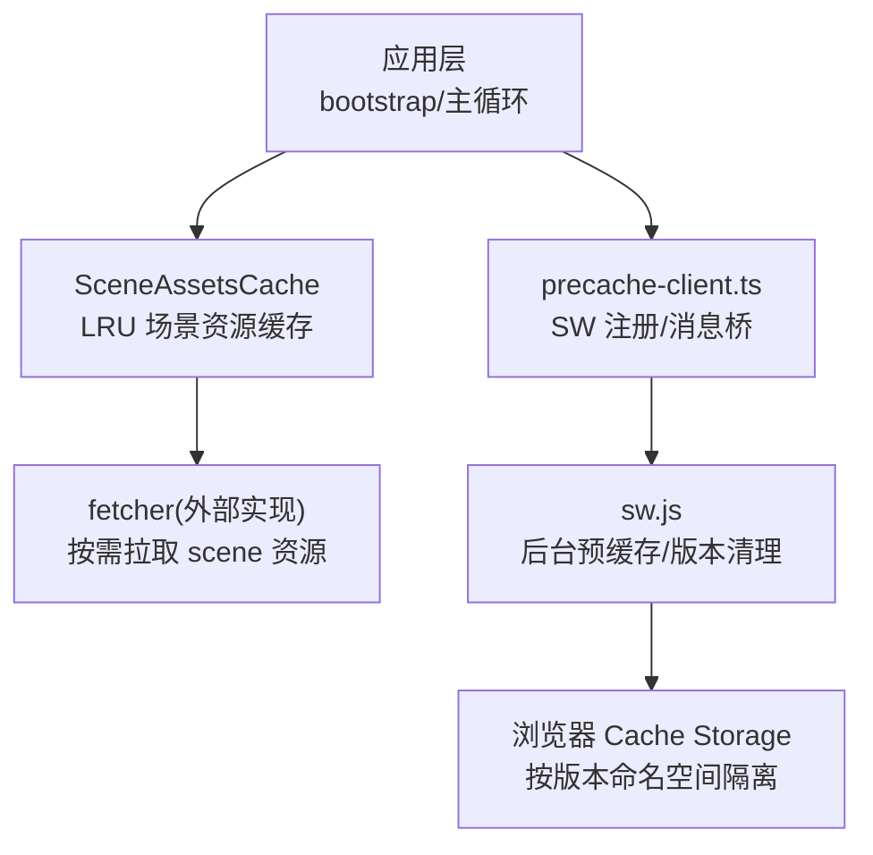
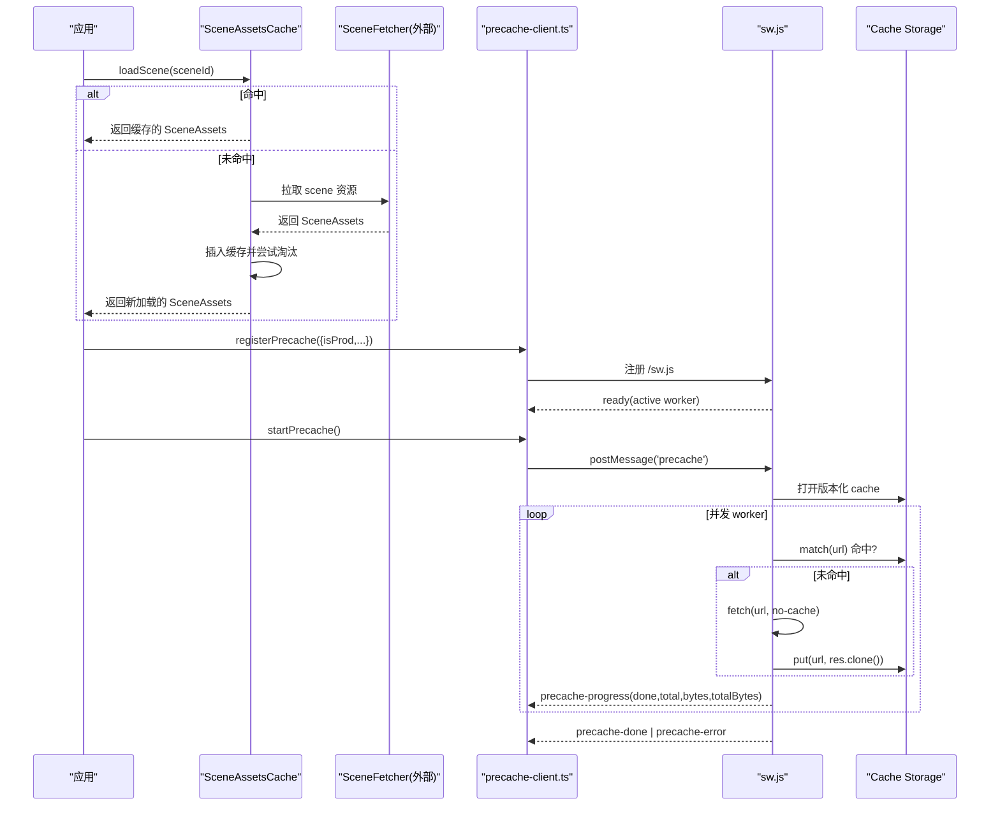
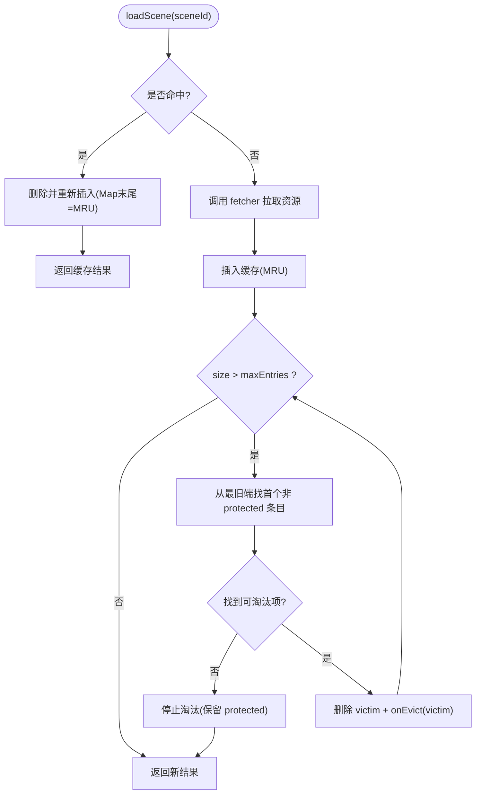
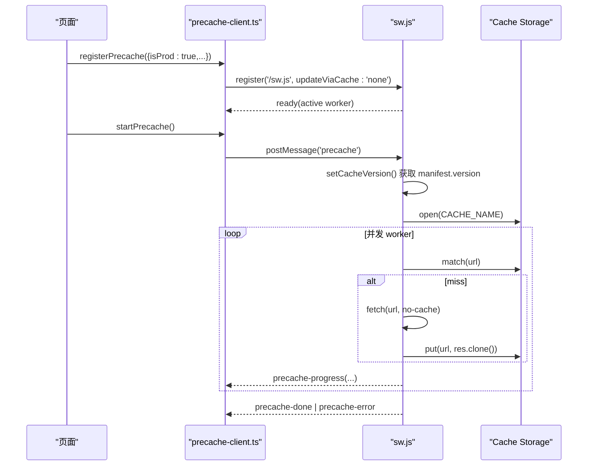
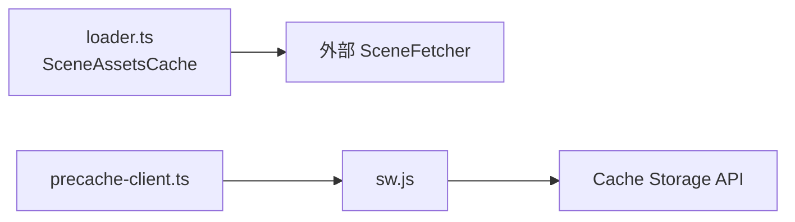

# 缓存管理系统

<cite>
**本文引用的文件**   
- [packages/game/src/assets/loader.ts](file://packages/game/src/assets/loader.ts)
- [packages/game/src/assets/loader.test.ts](file://packages/game/src/assets/loader.test.ts)
- [packages/game/public/sw.js](file://packages/game/public/sw.js)
- [packages/game/src/shell/precache-client.ts](file://packages/game/src/shell/precache-client.ts)
</cite>

## 目录
1. [简介](#简介)
2. [项目结构](#项目结构)
3. [核心组件](#核心组件)
4. [架构总览](#架构总览)
5. [详细组件分析](#详细组件分析)
6. [依赖关系分析](#依赖关系分析)
7. [性能考量](#性能考量)
8. [故障排查指南](#故障排查指南)
9. [结论](#结论)
10. [附录](#附录)

## 简介
本文件围绕仓库中的“缓存管理系统”进行系统化文档化，覆盖以下关键主题：
- LRU 缓存算法实现：淘汰策略、容量控制、访问频率统计（基于最近使用顺序）
- 对象池模式：对象复用、生命周期管理、内存泄漏防护
- 引用计数机制：依赖追踪、自动释放、循环引用检测
- 预加载策略：优先级队列、并发控制、进度回调
- 内存监控：使用量统计、峰值分析、垃圾回收触发
- 缓存失效策略：版本更新、配置变更、动态卸载

说明：
- 本仓库已实现场景资源 LRU 缓存与离线预缓存体系；对象池、引用计数、内存监控等能力以设计建议与最佳实践形式给出，便于后续扩展。

## 项目结构
与缓存相关的核心代码位于游戏包内：
- 场景资源懒加载与 LRU 缓存：packages/game/src/assets/loader.ts
- 场景资源加载器测试（验证 LRU 行为）：packages/game/src/assets/loader.test.ts
- Service Worker 离线预缓存与版本清理：packages/game/public/sw.js
- 预缓存客户端（注册 SW、消息桥接、持久化存储申请）：packages/game/src/shell/precache-client.ts

图表来源
- [packages/game/src/assets/loader.ts:451-499](file://packages/game/src/assets/loader.ts#L451-L499)
- [packages/game/public/sw.js:83-94](file://packages/game/public/sw.js#L83-L94)
- [packages/game/src/shell/precache-client.ts:50-90](file://packages/game/src/shell/precache-client.ts#L50-L90)

章节来源
- [packages/game/src/assets/loader.ts:400-500](file://packages/game/src/assets/loader.ts#L400-L500)
- [packages/game/src/assets/loader.test.ts:62-129](file://packages/game/src/assets/loader.test.ts#L62-L129)
- [packages/game/public/sw.js:1-160](file://packages/game/public/sw.js#L1-L160)
- [packages/game/src/shell/precache-client.ts:1-91](file://packages/game/src/shell/precache-client.ts#L1-L91)

## 核心组件
- SceneAssetsCache：场景资源的 LRU 缓存，支持容量上限、保护当前渲染场景、淘汰回调。
- precache-client.ts：生产环境注册 SW，转发进度/完成/错误事件，提供 start/pause/resume 控制。
- sw.js：后台预缓存执行者，负责并发下载、断点续传、版本清理、暂停/恢复。

章节来源
- [packages/game/src/assets/loader.ts:451-499](file://packages/game/src/assets/loader.ts#L451-L499)
- [packages/game/src/shell/precache-client.ts:34-90](file://packages/game/src/shell/precache-client.ts#L34-L90)
- [packages/game/public/sw.js:100-160](file://packages/game/public/sw.js#L100-L160)

## 架构总览
整体流程分为两条主线：
- 运行时场景资源缓存（LRU）：由 SceneAssetsCache 维护，命中则返回，未命中调用 fetcher 拉取并插入缓存，超出容量时按 LRU 淘汰，同时可保护当前场景不被淘汰。
- 离线预缓存（SW）：页面侧通过 precache-client 注册 SW，在合适时机启动后台预缓存；SW 根据 manifest 版本清理旧缓存，并发下载资源并上报进度。

图表来源
- [packages/game/src/assets/loader.ts:467-499](file://packages/game/src/assets/loader.ts#L467-L499)
- [packages/game/src/shell/precache-client.ts:50-90](file://packages/game/src/shell/precache-client.ts#L50-L90)
- [packages/game/public/sw.js:100-160](file://packages/game/public/sw.js#L100-L160)

## 详细组件分析

### LRU 缓存（SceneAssetsCache）
- 数据结构：内部使用 JS Map，利用其迭代顺序保持 LRU（最旧→最近）。命中时删除再设置，刷新到 MRU 端。
- 容量控制：构造时可传入 maxEntries；省略则为无限缓存（向后兼容）。
- 淘汰策略：当 size > maxEntries 时，从最旧端扫描第一个非 protected 条目淘汰；若仅剩受保护条目则停止淘汰，宁可超容也不影响当前渲染。
- 访问频率统计：通过“最近使用”顺序间接体现访问热度；命中即刷新 recency。
- 保护机制：protect 回调返回当前渲染场景 id，该 id 永不参与淘汰，避免黑屏。
- 淘汰回调：onEvict 用于联动清理调用方持有的并行缓存（如 tileImagesBySceneId），防止内存泄漏。

图表来源
- [packages/game/src/assets/loader.ts:467-499](file://packages/game/src/assets/loader.ts#L467-L499)

章节来源
- [packages/game/src/assets/loader.ts:451-499](file://packages/game/src/assets/loader.ts#L451-L499)
- [packages/game/src/assets/loader.test.ts:77-129](file://packages/game/src/assets/loader.test.ts#L77-L129)

### 预加载策略（Service Worker 后台预缓存）
- 并发控制：默认并发数 CONCURRENCY=8；可在 boost 模式下提升并发。
- 进度回调：worker 定期向页面 postMessage 上报 done/total/bytes/totalBytes。
- 暂停/恢复：开场视频期间 pause，不抢 Range 请求与用户输入带宽；播完 resume 继续。
- 断点续传：每次 worker 循环先 match(url)，命中则跳过，失败不致命，运行时按需 fetch 兜底。
- 版本清理：activate 阶段读取 manifest.version，仅删除非当前版本的旧缓存，保留当前版本以避免重复全量下载。

图表来源
- [packages/game/src/shell/precache-client.ts:50-90](file://packages/game/src/shell/precache-client.ts#L50-L90)
- [packages/game/public/sw.js:83-94](file://packages/game/public/sw.js#L83-L94)
- [packages/game/public/sw.js:100-160](file://packages/game/public/sw.js#L100-L160)

章节来源
- [packages/game/public/sw.js:1-160](file://packages/game/public/sw.js#L1-L160)
- [packages/game/src/shell/precache-client.ts:1-91](file://packages/game/src/shell/precache-client.ts#L1-L91)

### 对象池模式（设计与建议）
目标：减少频繁分配/销毁带来的 GC 压力，提高热点对象复用率。
- 对象复用：为高频创建的对象（如战斗帧缓冲、临时向量、命令节点）建立池，提供 acquire/release。
- 生命周期管理：
  - 入池前重置状态，确保无残留引用。
  - 出池后由使用者显式 release；必要时提供 try-finally 模板方法。
- 内存泄漏防护：
  - 池大小上限与惰性增长策略，避免无限膨胀。
  - 定期巡检：对长时间未使用的对象进行软驱逐或强制清空。
  - 弱引用池：对可能形成环的对象采用 WeakMap 管理，避免阻止 GC。
- 适用场景：短生命周期、高并发、大对象（位图、纹理句柄、网络请求上下文）。

[本节为概念性设计，不直接分析具体源码文件]

### 引用计数机制（设计与建议）
目标：精确追踪资源依赖，自动释放，检测循环引用。
- 依赖追踪：每个资源持有 refCount；创建/共享时 incRef，释放时 decRef。
- 自动释放：当 refCount 归零时触发 dispose，释放底层资源（纹理、缓冲区、文件句柄）。
- 循环引用检测：
  - 引入“弱引用”边，不参与计数；仅在强引用链上计数。
  - 周期性的可达性分析（标记-清除）识别并打破环。
- 调试与可视化：记录引用路径、快照 diff，辅助定位泄漏。
- 与对象池结合：池内对象作为“容器”，其成员资源仍遵循引用计数。

[本节为概念性设计，不直接分析具体源码文件]

### 内存监控（设计与建议）
- 使用量统计：
  - 跟踪各模块/对象的内存占用（字节数、实例数）。
  - 聚合指标：当前使用、峰值、平均、分布分位数。
- 峰值分析：
  - 采样时间窗口内的峰值与持续时间。
  - 关联事件（场景切换、战斗开始、资源加载）定位峰值来源。
- 垃圾回收触发：
  - 在关键路径前后主动触发 GC（开发/诊断模式），观察回收效果。
  - 结合浏览器 Performance API 或 Node 堆快照进行分析。
- 告警与降级：
  - 超过阈值时发出告警，并触发降级策略（降低并发、减少缓存上限、延迟非关键资源加载）。

[本节为概念性设计，不直接分析具体源码文件]

### 缓存失效策略（版本更新、配置变更、动态卸载）
- 版本更新：
  - 以 manifest.version 为命名空间，激活时仅删除非当前版本缓存，保留当前版本避免重复下载。
- 配置变更：
  - 将配置哈希纳入缓存键或版本号，变更时触发清理或重建。
- 动态卸载：
  - 提供显式清理接口（如 deleteCacheKeys(prefix)），配合 onEvict 联动释放上层缓存。
  - 针对大对象（tileImagesBySceneId）在 LRU 淘汰时及时释放，避免常驻导致内存膨胀。

章节来源
- [packages/game/public/sw.js:83-94](file://packages/game/public/sw.js#L83-L94)
- [packages/game/src/assets/loader.ts:481-499](file://packages/game/src/assets/loader.ts#L481-L499)

## 依赖关系分析
- SceneAssetsCache 依赖外部 fetcher 实现（不在 loader.ts 中），解耦了缓存与数据源。
- precache-client.ts 依赖 navigator.serviceWorker，封装 SW 注册与消息通道。
- sw.js 依赖浏览器 Cache Storage API 与 fetch，独立于打包产物，保证即时生效。

图表来源
- [packages/game/src/assets/loader.ts:451-499](file://packages/game/src/assets/loader.ts#L451-L499)
- [packages/game/src/shell/precache-client.ts:50-90](file://packages/game/src/shell/precache-client.ts#L50-L90)
- [packages/game/public/sw.js:100-160](file://packages/game/public/sw.js#L100-L160)

章节来源
- [packages/game/src/assets/loader.ts:451-499](file://packages/game/src/assets/loader.ts#L451-L499)
- [packages/game/src/shell/precache-client.ts:50-90](file://packages/game/src/shell/precache-client.ts#L50-L90)
- [packages/game/public/sw.js:100-160](file://packages/game/public/sw.js#L100-L160)

## 性能考量
- LRU 命中优化：Map 的 delete+set 操作常数级，适合高频访问场景。
- 并发控制：SW 预缓存并发数适中（默认 8），避免抢占前台必要资源。
- 断点续传：match 命中跳过，减少重复 IO 与网络开销。
- 版本化缓存：保留当前版本缓存，避免发版后全量重下导致的卡顿。
- 保护当前场景：防止因淘汰正在渲染的场景造成黑屏。

[本节为通用指导，不直接分析具体源码文件]

## 故障排查指南
- 场景资源加载失败：
  - 检查 fetcher 返回的数据结构与字段完整性。
  - 确认 onEvict 是否正确清理上层缓存，避免内存泄漏。
- 预缓存进度停滞：
  - 确认 SW 是否成功 activate 且 CACHE_NAME 正确。
  - 检查 precache-pause/resume 是否被正确调用，避免长期挂起。
- 版本不一致导致命中旧资源：
  - 确认 activate 阶段 setCacheVersion 是否执行成功。
  - 校验 manifest.version 是否与构建产物一致。

章节来源
- [packages/game/src/assets/loader.test.ts:77-129](file://packages/game/src/assets/loader.test.ts#L77-L129)
- [packages/game/public/sw.js:83-94](file://packages/game/public/sw.js#L83-L94)
- [packages/game/public/sw.js:100-160](file://packages/game/public/sw.js#L100-L160)

## 结论
本项目已具备完善的场景资源 LRU 缓存与离线预缓存体系，能够有效平衡命中率、内存占用与用户体验。建议在后续迭代中补充对象池、引用计数与内存监控能力，进一步提升系统稳定性与可观测性。

[本节为总结性内容，不直接分析具体源码文件]

## 附录
- 术语
  - LRU：最近最少使用，按访问时间排序淘汰最旧条目。
  - MRU：最近最多使用，Map 末尾表示最新访问。
  - 版本化缓存：以 manifest.version 为命名空间隔离不同版本资源。
  - 断点续传：基于缓存匹配跳过已存在资源，避免重复下载。

[本节为概念性内容，不直接分析具体源码文件]