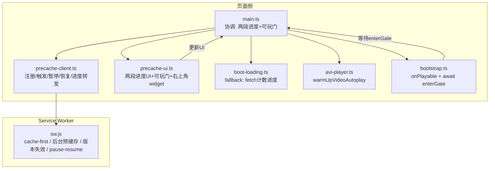
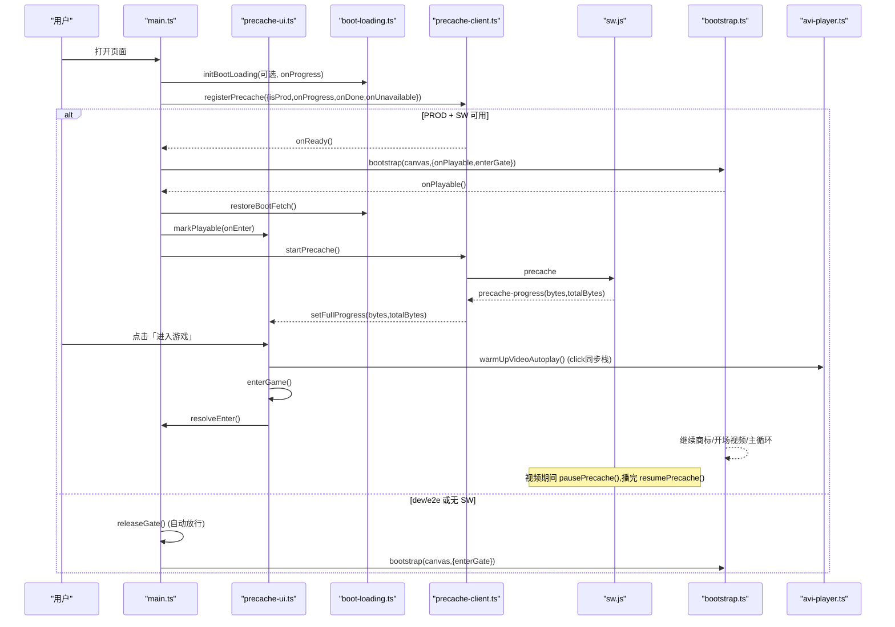
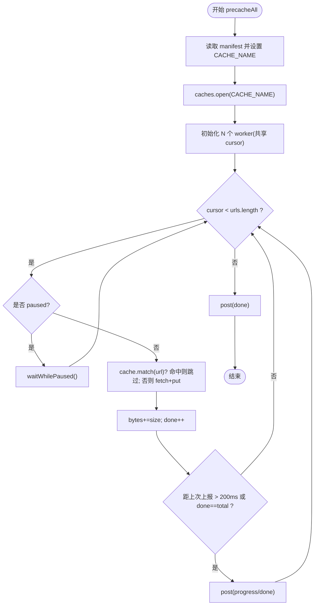
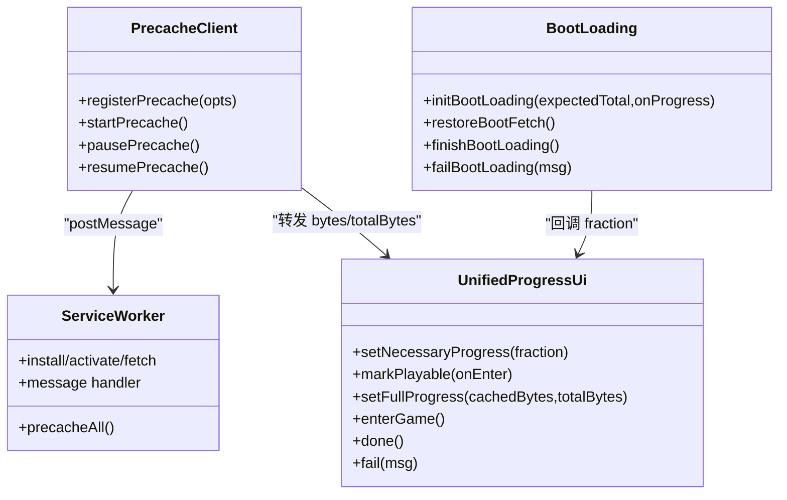
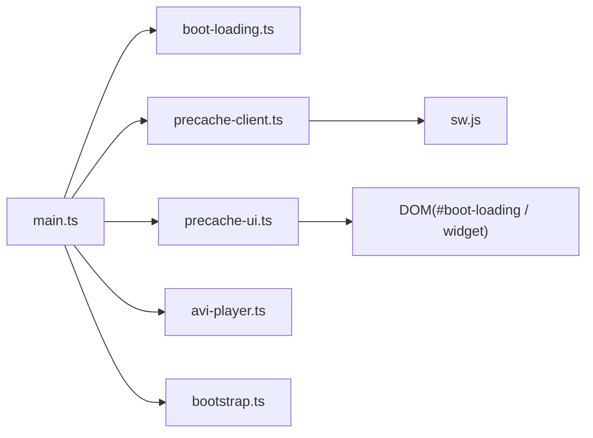

# 预加载策略

<cite>
**本文引用的文件**   
- [packages/game/src/shell/precache-client.ts](file://packages/game/src/shell/precache-client.ts)
- [packages/game/src/shell/precache-ui.ts](file://packages/game/src/shell/precache-ui.ts)
- [packages/game/public/sw.js](file://packages/game/public/sw.js)
- [packages/game/src/main.ts](file://packages/game/src/main.ts)
- [packages/game/src/shell/bootstrap.ts](file://packages/game/src/shell/bootstrap.ts)
- [packages/game/src/shell/boot-loading.ts](file://packages/game/src/shell/boot-loading.ts)
- [packages/game/src/shell/avi-player.ts](file://packages/game/src/shell/avi-player.ts)
</cite>

## 目录
1. [引言](#引言)
2. [项目结构](#项目结构)
3. [核心组件](#核心组件)
4. [架构总览](#架构总览)
5. [详细组件分析](#详细组件分析)
6. [依赖关系分析](#依赖关系分析)
7. [性能考量](#性能考量)
8. [故障排查指南](#故障排查指南)
9. [结论](#结论)
10. [附录](#附录)

## 引言
本文件系统化梳理并文档化当前仓库中的“预加载策略”，覆盖优先级队列、并发控制、进度回调、智能预加载、配置选项与性能优化等关键主题。该策略以 Service Worker 为网络层拦截器，结合页面侧的“两段进度 + 可玩门”机制，在保证首屏可玩性的同时，后台全量预缓存资源，实现离线可用与零冷加载体验。

## 项目结构
围绕预加载策略的关键代码分布在以下模块：
- 页面侧客户端：注册 SW、持久化存储、触发/暂停/恢复预缓存、转发进度事件
- 统一进度 UI：两段进度（必要资源→虚线；SW 全量→100%）、可玩门按钮、进入后右上角小条
- Service Worker：运行时 cache-first、后台预缓存、版本失效、消息驱动（含暂停/恢复）
- 启动协调：main.ts 负责环境判断、两段进度与门的装配、bootstrap 接入
- 启动引导：bootstrap.ts 在必要资源就绪后通知 UI 出按钮，并在用户确认后继续流程
- 启动计数：boot-loading.ts 在 SW 不可用时提供 fallback 的 fetch 计数进度
- 视频预热：avi-player.ts 提供 warmUpVideoAutoplay 用于解锁 video autoplay

图表来源
- [packages/game/src/main.ts:1-78](file://packages/game/src/main.ts#L1-L78)
- [packages/game/src/shell/precache-client.ts:1-91](file://packages/game/src/shell/precache-client.ts#L1-L91)
- [packages/game/src/shell/precache-ui.ts:1-153](file://packages/game/src/shell/precache-ui.ts#L1-L153)
- [packages/game/src/shell/boot-loading.ts:1-150](file://packages/game/src/shell/boot-loading.ts#L1-L150)
- [packages/game/src/shell/avi-player.ts:1-185](file://packages/game/src/shell/avi-player.ts#L1-L185)
- [packages/game/src/shell/bootstrap.ts:208-213](file://packages/game/src/shell/bootstrap.ts#L208-L213)
- [packages/game/public/sw.js:1-160](file://packages/game/public/sw.js#L1-L160)

章节来源
- [packages/game/src/main.ts:1-78](file://packages/game/src/main.ts#L1-L78)
- [packages/game/src/shell/precache-client.ts:1-91](file://packages/game/src/shell/precache-client.ts#L1-L91)
- [packages/game/src/shell/precache-ui.ts:1-153](file://packages/game/src/shell/precache-ui.ts#L1-L153)
- [packages/game/src/shell/boot-loading.ts:1-150](file://packages/game/src/shell/boot-loading.ts#L1-L150)
- [packages/game/src/shell/avi-player.ts:1-185](file://packages/game/src/shell/avi-player.ts#L1-L185)
- [packages/game/src/shell/bootstrap.ts:208-213](file://packages/game/src/shell/bootstrap.ts#L208-L213)
- [packages/game/public/sw.js:1-160](file://packages/game/public/sw.js#L1-L160)

## 核心组件
- 预缓存客户端（precache-client.ts）
  - 职责：仅生产环境注册 SW、申请持久化、触发/暂停/恢复后台预缓存、转发进度与完成/错误事件
  - 关键点：早注册但不立即触发预缓存；startPrecache 在 onPlayable 后调用；pause/resume 配合 modal 播放期让路
- 统一进度 UI（precache-ui.ts）
  - 职责：两段进度视觉连续（必要资源→虚线；SW 全量→100%），显示常驻“进入游戏”按钮，进入后转右上角半透明 widget
  - 关键点：单调不回退；phase 状态机（necessary/full/entered）；doneReceived 防空白框
- Service Worker（sw.js）
  - 职责：运行时 cache-first；后台预缓存（按清单遍历、续传、节流并发、定期上报）；版本失效；消息驱动（precache/pause/resume）
  - 关键点：跨 cache 命中；waitUntil 保活；paused 挂起 worker；activate 清理旧版本缓存
- 启动协调（main.ts）
  - 职责：根据 isProd 选择两条路径；PROD 下装配两段进度与门；dev/e2e 回退到现状
  - 关键点：gateReleased 守卫避免竞态；onPlayable 中 restoreBootFetch + markPlayable + startPrecache
- 启动引导（bootstrap.ts）
  - 职责：soundfontSettled 后调用 onPlayable；await enterGate 后再继续商标/开场视频/主循环
- 启动计数（boot-loading.ts）
  - 职责：包 fetch 计数，rAF 节流渲染；当 _origFetch 为空时不写 DOM（避免与 SW 进度互盖）
- 视频预热（avi-player.ts）
  - 职责：warmUpVideoAutoplay 在 click 同步栈内 muted play 一次，解锁 session 内 video autoplay

章节来源
- [packages/game/src/shell/precache-client.ts:1-91](file://packages/game/src/shell/precache-client.ts#L1-L91)
- [packages/game/src/shell/precache-ui.ts:1-153](file://packages/game/src/shell/precache-ui.ts#L1-L153)
- [packages/game/public/sw.js:1-160](file://packages/game/public/sw.js#L1-L160)
- [packages/game/src/main.ts:1-78](file://packages/game/src/main.ts#L1-L78)
- [packages/game/src/shell/bootstrap.ts:208-213](file://packages/game/src/shell/bootstrap.ts#L208-L213)
- [packages/game/src/shell/boot-loading.ts:1-150](file://packages/game/src/shell/boot-loading.ts#L1-L150)
- [packages/game/src/shell/avi-player.ts:1-185](file://packages/game/src/shell/avi-player.ts#L1-L185)

## 架构总览
整体采用“两段进度 + 显式可玩门 + SW 后台预缓存”的架构：
- 第一段：必要资源前台加载（fetch 计数或 SW 接管前），映射到 0→虚线
- 第二段：SW 全量预缓存（bytes/totalBytes），从虚线走到 100%
- 可玩门：必要资源就绪后出现“进入游戏”按钮，点击后预热 video autoplay、进入游戏、后台预缓存继续
- 让路：modal 播放期间（开场视频/CG/RNG/FBP/结局动画）暂停预缓存，避免抢带宽与输入延迟

图表来源
- [packages/game/src/main.ts:1-78](file://packages/game/src/main.ts#L1-L78)
- [packages/game/src/shell/precache-client.ts:1-91](file://packages/game/src/shell/precache-client.ts#L1-L91)
- [packages/game/src/shell/precache-ui.ts:1-153](file://packages/game/src/shell/precache-ui.ts#L1-L153)
- [packages/game/src/shell/boot-loading.ts:1-150](file://packages/game/src/shell/boot-loading.ts#L1-L150)
- [packages/game/src/shell/avi-player.ts:1-185](file://packages/game/src/shell/avi-player.ts#L1-L185)
- [packages/game/src/shell/bootstrap.ts:208-213](file://packages/game/src/shell/bootstrap.ts#L208-L213)
- [packages/game/public/sw.js:1-160](file://packages/game/public/sw.js#L1-L160)

## 详细组件分析

### 优先级队列与任务调度
- 任务定义
  - 后台预缓存任务来源于 asset-manifest.json 的 files 列表，每个条目包含 path 与 size，对应一个待缓存的资源请求
- 排序算法
  - 清单由提取器生成并按 path 排序，保证 version 稳定与遍历顺序确定性
- 动态优先级调整
  - 当前实现未引入基于优先级的重排；通过“暂停/恢复”机制在视频播放期让路，属于时间维度上的动态调度
- 并发控制
  - 固定并发数 CONCURRENCY=8，worker 共享 cursor 推进，已缓存项跳过（续传）
- 进度上报
  - 每 200ms 或完成全部时上报 {type:'precache-progress', done, total, bytes, totalBytes}
- 保活与健壮性
  - waitUntil(precacheAll()) 防止浏览器终止长任务；单文件失败不致命，运行时按需 fetch 兜底

图表来源
- [packages/game/public/sw.js:100-143](file://packages/game/public/sw.js#L100-L143)

章节来源
- [packages/game/public/sw.js:1-160](file://packages/game/public/sw.js#L1-L160)

### 并发控制策略
- 最大并发数限制
  - sw.js 中 CONCURRENCY=8，worker 池大小固定
- 资源竞争处理
  - 视频播放期通过 pausePrecache()/resumePrecache() 让路，避免 Range 请求与输入 IO 被抢占
- 任务调度算法
  - 多 worker 共享游标，逐个取下一个 url，命中即跳过，失败不中断整体流程

章节来源
- [packages/game/public/sw.js:65-81](file://packages/game/public/sw.js#L65-L81)
- [packages/game/public/sw.js:100-143](file://packages/game/public/sw.js#L100-L143)
- [packages/game/src/shell/precache-client.ts:34-48](file://packages/game/src/shell/precache-client.ts#L34-L48)

### 进度回调机制
- 加载进度计算
  - 第一段：boot-loading.ts 对 window.fetch 计数，rAF 节流渲染，必要时回调 fraction 给 UI
  - 第二段：SW 按 bytes/totalBytes 上报，UI 映射到后半段，单调不回退
- 事件通知系统
  - SW → 页面：precache-progress、precache-done、precache-error
  - 页面 → SW：precache、precache-pause、precache-resume
- 用户界面集成
  - createUnifiedProgressUi 管理三段状态（necessary/full/entered），进入后切换至右上角 widget

图表来源
- [packages/game/src/shell/precache-client.ts:1-91](file://packages/game/src/shell/precache-client.ts#L1-L91)
- [packages/game/src/shell/precache-ui.ts:1-153](file://packages/game/src/shell/precache-ui.ts#L1-L153)
- [packages/game/src/shell/boot-loading.ts:1-150](file://packages/game/src/shell/boot-loading.ts#L1-L150)
- [packages/game/public/sw.js:1-160](file://packages/game/public/sw.js#L1-L160)

章节来源
- [packages/game/src/shell/precache-client.ts:1-91](file://packages/game/src/shell/precache-client.ts#L1-L91)
- [packages/game/src/shell/precache-ui.ts:1-153](file://packages/game/src/shell/precache-ui.ts#L1-L153)
- [packages/game/src/shell/boot-loading.ts:1-150](file://packages/game/src/shell/boot-loading.ts#L1-L150)
- [packages/game/public/sw.js:1-160](file://packages/game/public/sw.js#L1-L160)

### 智能预加载
- 预测性加载算法
  - 当前未实现基于行为分析的预测；通过“必要资源就绪即出按钮 + 后台全量预缓存”的策略提升体验
- 用户行为分析
  - 未内置统计模型；可通过外部埋点扩展
- 网络状况适配
  - 当前使用固定并发；未来可按网络质量动态调整 CONCURRENCY 或暂停策略

章节来源
- [packages/game/public/sw.js:65-81](file://packages/game/public/sw.js#L65-L81)

### 配置选项说明
- 预加载窗口大小
  - CONCURRENCY=8（后台预缓存并发）
- 重试机制
  - 单文件失败不致命，运行时按需 fetch 兜底
- 超时处理
  - 未显式设置超时；依赖浏览器默认行为与网络层重试（fetch-retry 在 JS 层）
- 其他
  - updateViaCache:'none' 确保 SW 自更新
  - activate 阶段按版本清理旧缓存，保留当前版本

章节来源
- [packages/game/public/sw.js:1-160](file://packages/game/public/sw.js#L1-L160)

### 性能优化
- 批量加载
  - 后台预缓存按清单批量遍历，命中即跳过
- 压缩传输
  - 资源管线将 tileset/npc/动画/战斗/magic 改为 gzip RLE blob，显著减少请求数与体积
- CDN 加速策略
  - 静态资源通过 /extracted/* 与 /assets/* 路由，可由 CDN 缓存；SW 跨 cache 命中保障离线

章节来源
- [packages/game/public/sw.js:36-63](file://packages/game/public/sw.js#L36-L63)

## 依赖关系分析
- main.ts 依赖 boot-loading、precache-client、precache-ui、avi-player、bootstrap
- bootstrap.ts 依赖 audio、video、scene loader 等，并通过 deps.onPlayable/enterGate 与 main.ts 协作
- precache-client.ts 与 sw.js 通过 postMessage 通信
- precache-ui.ts 操作 #boot-loading 与右上角 widget DOM

图表来源
- [packages/game/src/main.ts:1-78](file://packages/game/src/main.ts#L1-L78)
- [packages/game/src/shell/precache-client.ts:1-91](file://packages/game/src/shell/precache-client.ts#L1-L91)
- [packages/game/src/shell/precache-ui.ts:1-153](file://packages/game/src/shell/precache-ui.ts#L1-L153)
- [packages/game/src/shell/boot-loading.ts:1-150](file://packages/game/src/shell/boot-loading.ts#L1-L150)
- [packages/game/src/shell/avi-player.ts:1-185](file://packages/game/src/shell/avi-player.ts#L1-L185)
- [packages/game/src/shell/bootstrap.ts:208-213](file://packages/game/src/shell/bootstrap.ts#L208-L213)
- [packages/game/public/sw.js:1-160](file://packages/game/public/sw.js#L1-L160)

章节来源
- [packages/game/src/main.ts:1-78](file://packages/game/src/main.ts#L1-L78)
- [packages/game/src/shell/precache-client.ts:1-91](file://packages/game/src/shell/precache-client.ts#L1-L91)
- [packages/game/src/shell/precache-ui.ts:1-153](file://packages/game/src/shell/precache-ui.ts#L1-L153)
- [packages/game/src/shell/boot-loading.ts:1-150](file://packages/game/src/shell/boot-loading.ts#L1-L150)
- [packages/game/src/shell/avi-player.ts:1-185](file://packages/game/src/shell/avi-player.ts#L1-L185)
- [packages/game/src/shell/bootstrap.ts:208-213](file://packages/game/src/shell/bootstrap.ts#L208-L213)
- [packages/game/public/sw.js:1-160](file://packages/game/public/sw.js#L1-L160)

## 性能考量
- 并发值调优：CONCURRENCY=8 在当前规模下平衡了后台吞吐与前台交互；可根据目标设备与网络条件动态调整
- 暂停时机：modal 播放期暂停预缓存，避免 Range 请求与输入延迟；可在更细粒度上评估暂停收益
- 版本失效：激活阶段只删除非当前版本缓存，避免每次发版都重新下载全量资源
- 进度单调：UI 内部 clamp 与 phase 状态机确保进度不回退，提升用户体验一致性

[本节为通用指导，无需源码引用]

## 故障排查指南
- 进度停在低位或无法到 100%
  - 检查 SW 是否 activated、是否正确 waitUntil 保活
  - 确认 manifest 可达且版本正确，旧缓存是否被误删
- 进入后视频仍需二次点击
  - 确认 warmUpVideoAutoplay 在 click 同步栈调用
  - 检查浏览器 autoplay policy 与 muted 设置
- 离线场景资源缺失
  - 验证 shouldCache 是否匹配 /extracted/* 与 /assets/*
  - 确认 caches.match 跨 cache 命中逻辑生效
- 进度闪烁或覆盖层残留
  - 检查 boot-loading.ts 的 render guard（仅在 _origFetch 存在时渲染）
  - 确认 UI 的 doneReceived 标志与 lastBytes 初始化

章节来源
- [packages/game/public/sw.js:1-160](file://packages/game/public/sw.js#L1-L160)
- [packages/game/src/shell/boot-loading.ts:1-150](file://packages/game/src/shell/boot-loading.ts#L1-L150)
- [packages/game/src/shell/avi-player.ts:157-185](file://packages/game/src/shell/avi-player.ts#L157-L185)
- [packages/game/src/shell/precache-ui.ts:1-153](file://packages/game/src/shell/precache-ui.ts#L1-L153)

## 结论
本预加载策略通过两段进度与显式可玩门，兼顾了首屏可玩性与后台全量预缓存；借助 Service Worker 的 cache-first 与后台预缓存能力，实现了离线可用与零冷加载。通过暂停/恢复机制让路于视频播放期，进一步提升了交互流畅度。后续可在并发自适应、预测性加载与网络感知方面持续优化。

[本节为总结，无需源码引用]

## 附录
- 关键接口速览
  - PrecacheProgress: { done, total, bytes, totalBytes }
  - RegisterPrecacheOpts: { isProd, onProgress, onDone?, onReady?, onUnavailable? }
  - UnifiedProgressUi: { setNecessaryProgress, markPlayable, setFullProgress, enterGame, done, fail }
  - BootstrapDeps: { onPlayable?, enterGate? }
- 运行要点
  - PROD 且 SW 可用：两段进度 + 可玩门 + 后台预缓存
  - dev/e2e 或无 SW：退化为现状（fetch 计数 + 自动进游戏）
  - 视频预热：在 click 同步栈调用 warmUpVideoAutoplay

章节来源
- [packages/game/src/shell/precache-client.ts:1-91](file://packages/game/src/shell/precache-client.ts#L1-L91)
- [packages/game/src/shell/precache-ui.ts:1-153](file://packages/game/src/shell/precache-ui.ts#L1-L153)
- [packages/game/src/shell/bootstrap.ts:208-213](file://packages/game/src/shell/bootstrap.ts#L208-L213)
- [packages/game/src/main.ts:1-78](file://packages/game/src/main.ts#L1-L78)