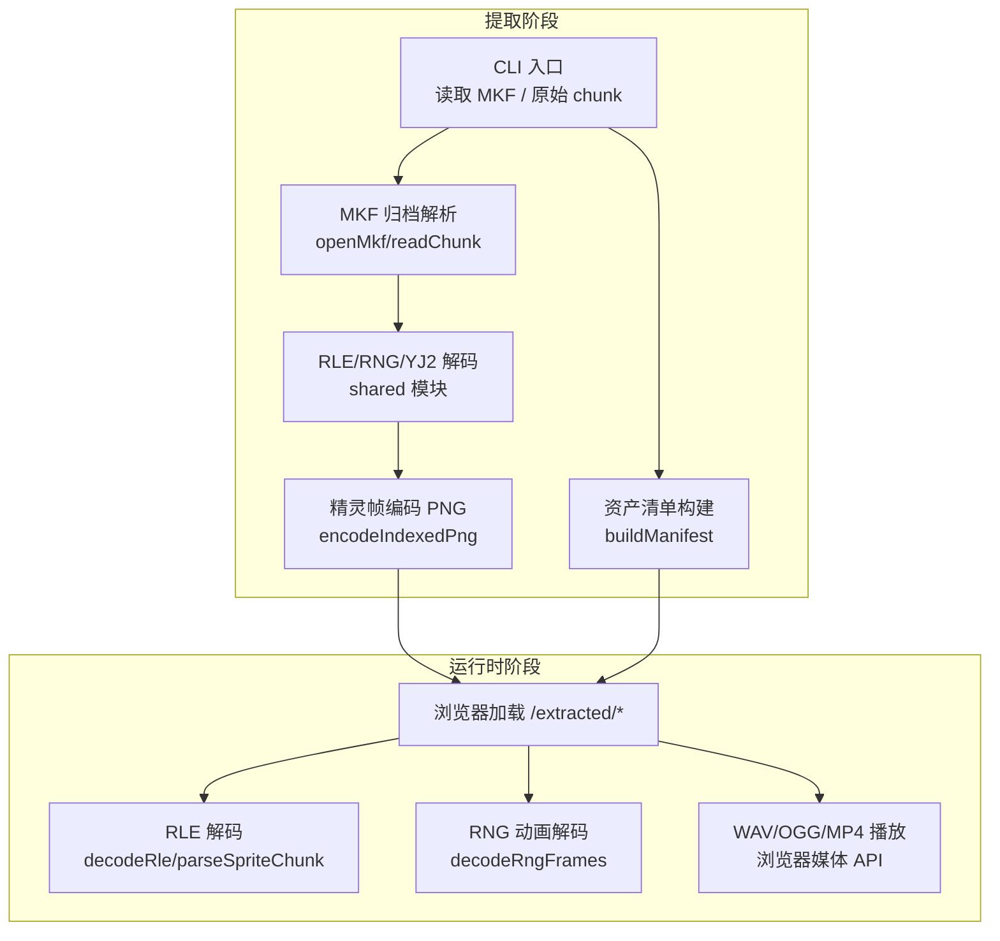
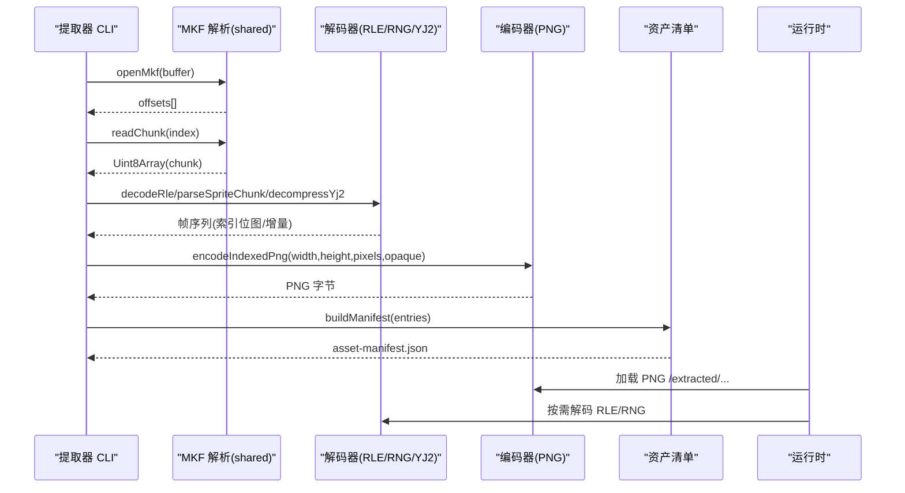
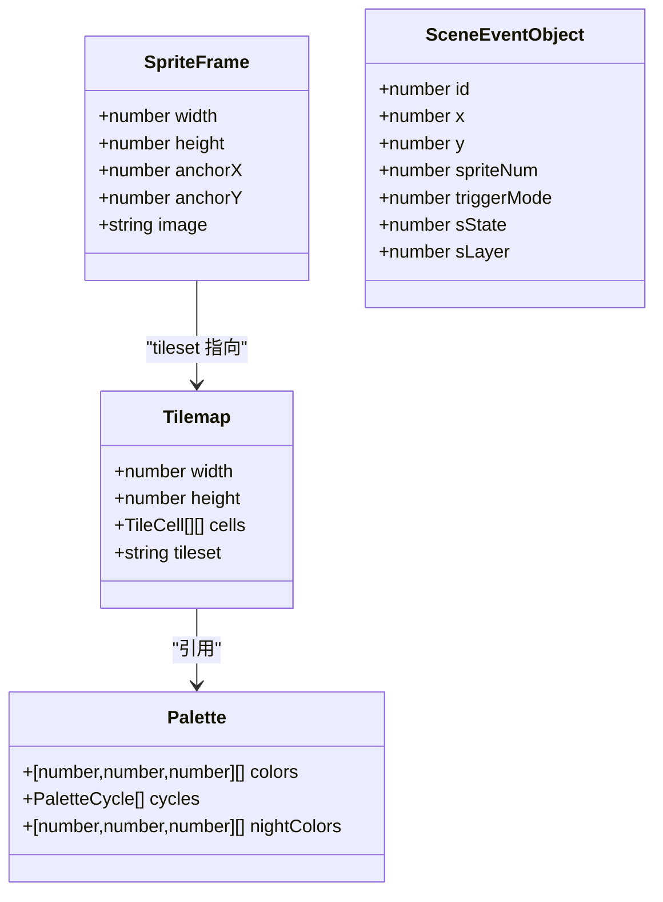
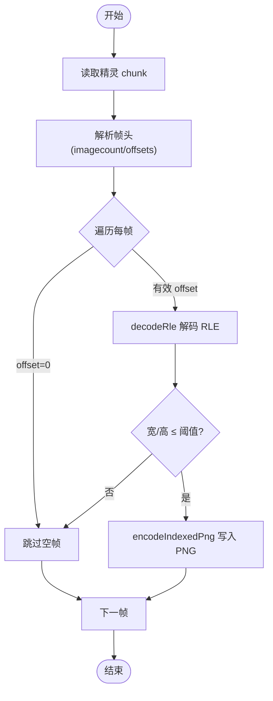
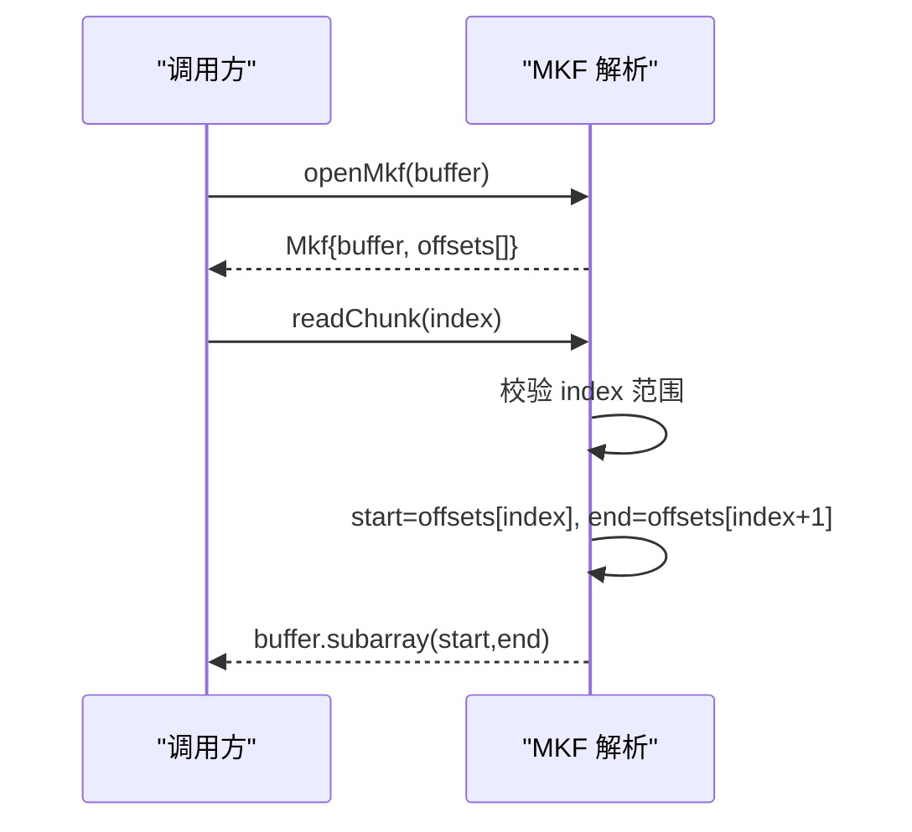
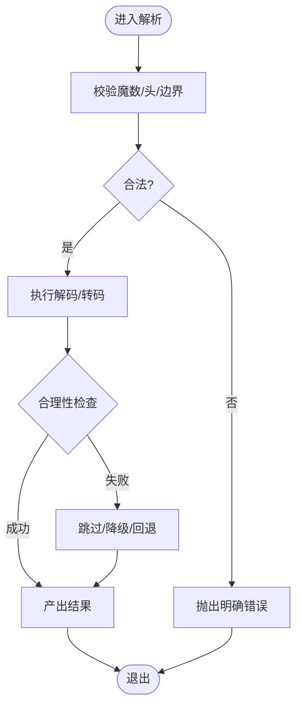

# 资源格式处理器

<cite>
**本文引用的文件**   
- [README.md](file://README.md)
- [resource-status.md](file://docs/phase1/status/resource-status.md)
- [asset-manifest.ts](file://packages/pal-extract/src/resources/asset-manifest.ts)
- [mkf.ts](file://packages/shared/src/mkf.ts)
- [rle.ts](file://packages/shared/src/rle.ts)
- [rng.ts](file://packages/shared/src/rng.ts)
- [sprite.ts](file://packages/pal-extract/src/resources/sprite.ts)
- [battle-sprite.ts](file://packages/pal-extract/src/resources/battle-sprite.ts)
- [sounds.ts](file://packages/pal-extract/src/resources/parsers/sounds.ts)
</cite>

## 目录
1. [简介](#简介)
2. [项目结构](#项目结构)
3. [核心组件](#核心组件)
4. [架构总览](#架构总览)
5. [详细组件分析](#详细组件分析)
6. [依赖关系分析](#依赖关系分析)
7. [性能考量](#性能考量)
8. [故障排查指南](#故障排查指南)
9. [结论](#结论)
10. [附录](#附录)

## 简介
本文件聚焦“资源格式处理器”的设计与实现，覆盖以下关键主题：
- JSON 配置文件解析：数据结构定义、字段验证、默认值处理
- PNG 精灵图集加载：图像解码、像素数据提取、透明度处理
- WAV 音频格式支持：采样率转换、声道处理、压缩格式
- 二进制资源解析：字节序处理、偏移计算、内存映射
- 格式扩展机制：插件架构、自定义处理器注册、版本兼容性检查
- 错误处理策略：格式验证失败、损坏文件检测、降级方案

本项目以 sdlpal 源码为行为规格，在 TypeScript 中重建资源提取与运行时消费链路。第一阶段强调“忠实还原”，第二阶段（Reforge）采用全新引擎与内容管线。

**章节来源**
- [README.md:1-139](file://README.md#L1-L139)

## 项目结构
围绕资源处理的代码主要分布在两个包：
- packages/shared：共享的解析器与数据结构（MKF、RLE、RNG、YJ2 等），供提取器与运行时共用
- packages/pal-extract：资源提取 CLI 与中间产物生成（资产清单、精灵图集、战斗 sprite、声音元数据等）

**图表来源**
- [mkf.ts:1-44](file://packages/shared/src/mkf.ts#L1-L44)
- [rle.ts:1-127](file://packages/shared/src/rle.ts#L1-L127)
- [rng.ts:1-179](file://packages/shared/src/rng.ts#L1-L179)
- [asset-manifest.ts:1-55](file://packages/pal-extract/src/resources/asset-manifest.ts#L1-L55)
- [sprite.ts:1-86](file://packages/pal-extract/src/resources/sprite.ts#L1-L86)

**章节来源**
- [README.md:110-131](file://README.md#L110-L131)

## 核心组件
本节概述资源处理的关键能力与职责边界：
- MKF 归档解析：提供 openMkf/chunkCount/readChunk，统一 LE u32 偏移表访问
- RLE 精灵解码：decodeRle 与 parseSpriteChunk，严格区分透明与 palette-0
- RNG 动画解码：sub-MKF + YJ2 + RLE delta blit，跨帧增量合成
- 精灵图集导出：将索引位图编码为 PNG，A 通道承载 opaque mask
- 资产清单：扫描 extracted 根，生成稳定哈希的版本清单
- 声音元数据：SOUNDS.MKF chunk 级统计（size/isEmpty）

**章节来源**
- [mkf.ts:1-44](file://packages/shared/src/mkf.ts#L1-L44)
- [rle.ts:1-127](file://packages/shared/src/rle.ts#L1-L127)
- [rng.ts:1-179](file://packages/shared/src/rng.ts#L1-L179)
- [sprite.ts:1-86](file://packages/pal-extract/src/resources/sprite.ts#L1-L86)
- [asset-manifest.ts:1-55](file://packages/pal-extract/src/resources/asset-manifest.ts#L1-L55)
- [sounds.ts:1-29](file://packages/pal-extract/src/resources/parsers/sounds.ts#L1-L29)

## 架构总览
资源处理贯穿“提取 → 中间产物 → 运行时消费”三段式流水线。下图展示从 MKF 到 PNG/WAV/JSON 的主要路径与交互。

**图表来源**
- [mkf.ts:1-44](file://packages/shared/src/mkf.ts#L1-L44)
- [rle.ts:1-127](file://packages/shared/src/rle.ts#L1-L127)
- [rng.ts:1-179](file://packages/shared/src/rng.ts#L1-L179)
- [sprite.ts:1-86](file://packages/pal-extract/src/resources/sprite.ts#L1-L86)
- [asset-manifest.ts:1-55](file://packages/pal-extract/src/resources/asset-manifest.ts#L1-L55)

## 详细组件分析

### JSON 配置文件解析
- 数据结构定义
  - 场景对象、调色板、精灵帧、地图单元等类型集中在 shared 资源模型中，明确 width/height、cells、colors、cycles、frames 等字段语义与约束
  - 事件对象表包含 sceneRanges 区间映射，便于运行时按场景切片
- 字段验证
  - 通过严格的接口类型与注释约定保证字段完整性；对异常值（如非法宽高）在解码层做防御性跳过
- 默认值处理
  - 夜间调色板 nightColors 可选，未提供时回退白天 colors
  - 精灵帧 opaque 未传入时视为全不透明，兼容无 RLE 的原始位图
- 典型使用位置
  - 资源模型定义：Tilemap/Palette/SpriteFrame/SceneEventObject 等
  - 精灵导出：encodeIndexedPng 根据 opaque 填充 alpha 通道

**图表来源**
- [resources.ts:1-141](file://packages/shared/src/resources.ts#L1-L141)

**章节来源**
- [resources.ts:1-141](file://packages/shared/src/resources.ts#L1-L141)
- [sprite.ts:25-42](file://packages/pal-extract/src/resources/sprite.ts#L25-L42)

### PNG 精灵图集加载
- 图像解码
  - 提取阶段：将 RLE 解码后的索引位图编码为 PNG，R=G=B=palette index，A=opaque mask
  - 运行阶段：浏览器直接加载 PNG，R 通道作为 palette 下标，A 通道决定不透明区域
- 像素数据提取
  - 通过 PNG 库写入 RGBA 平面，保持与 sdlpal 一致的索引语义
- 透明度处理
  - 修复历史问题：不再把 palette-0 当作透明，而是用 opaque mask 精确控制透明
  - 精灵帧维度校验：超过阈值（如 >400）的帧被跳过，避免畸形 chunk 导致死循环

**图表来源**
- [rle.ts:108-127](file://packages/shared/src/rle.ts#L108-L127)
- [sprite.ts:25-42](file://packages/pal-extract/src/resources/sprite.ts#L25-L42)

**章节来源**
- [rle.ts:1-127](file://packages/shared/src/rle.ts#L1-127)
- [sprite.ts:1-86](file://packages/pal-extract/src/resources/sprite.ts#L1-L86)

### WAV 音频格式支持
- 现状说明
  - 当前提取器对 SOUNDS.MKF 输出的是 chunk 级元数据（index/size/isEmpty），完整 WAV 整块 dump 由 CLI 负责，运行时音频系统接入留待后续
  - 文档指出运行时音频已接入，但具体 per-track 听验仍在进行中
- 设计要点
  - 若需扩展 WAV 解析：建议新增独立解析器，遵循与 MKF/RLE 相同的“共享解码器”模式，确保提取与运行时一致
  - 浏览器端可直接通过 MediaSource/Web Audio API 播放标准 WAV/OGG/MP4

**章节来源**
- [sounds.ts:1-29](file://packages/pal-extract/src/resources/parsers/sounds.ts#L1-L29)
- [resource-status.md:228-237](file://docs/phase1/status/resource-status.md#L228-L237)

### 二进制资源解析
- 字节序处理
  - MKF 使用小端 u32 偏移表；RLE 帧头使用小端 u16 宽高；RNG delta 指令含小端字面量
- 偏移计算
  - MKF 头首项为偏移表长度，子文件数 = (head[0] - 4)/4；readChunk 基于相邻偏移裁剪子数组
  - 精灵 chunk 的帧偏移表位于头部，word offset 左移 1 得到字节偏移
- 内存映射
  - 所有解析均基于 Uint8Array/DataView 零拷贝或轻量切片，避免额外分配

**图表来源**
- [mkf.ts:12-43](file://packages/shared/src/mkf.ts#L12-L43)

**章节来源**
- [mkf.ts:1-44](file://packages/shared/src/mkf.ts#L1-L44)
- [rle.ts:110-127](file://packages/shared/src/rle.ts#L110-L127)

### 格式扩展机制
- 插件架构
  - 当前仓库未提供通用“插件注册表”；各格式解析以独立模块组织（MKF/RLE/RNG/YJ2/精灵/清单等）
- 自定义处理器注册
  - 建议在 shared 中新增解析器并暴露统一函数签名，由 CLI 与运行时分别 import 使用，保持一致性
- 版本兼容性检查
  - 资产清单通过 SHA256 对文件列表与大小进行稳定哈希，version 前缀用于缓存失效与一致性校验
  - 对于二进制格式，建议在解析入口处增加魔数/头字段校验，失败即抛出明确错误

**章节来源**
- [asset-manifest.ts:27-39](file://packages/pal-extract/src/resources/asset-manifest.ts#L27-L39)
- [mkf.ts:12-24](file://packages/shared/src/mkf.ts#L12-L24)

### 错误处理策略
- 格式验证失败
  - MKF：头过小、首偏移非 4 倍数、计数为负、chunk 越界均抛错
  - RNG：遇到未知 opcode 立即抛错，快速定位指针错位
- 损坏文件检测
  - 精灵帧尺寸超限（>400）则跳过该帧，避免死循环
  - RNG 子 chunk 为空或 YJ2 解压失败则跳过该帧
- 降级方案
  - 缺失战斗/角色 sprite chunk 时记录警告并跳过
  - 夜间调色板缺失时回退白天调色板
  - 资产清单自动排除 .DS_Store 与自身，避免污染版本

**图表来源**
- [mkf.ts:12-43](file://packages/shared/src/mkf.ts#L12-L43)
- [rle.ts:108-127](file://packages/shared/src/rle.ts#L108-L127)
- [rng.ts:138-142](file://packages/shared/src/rng.ts#L138-L142)
- [asset-manifest.ts:22-25](file://packages/pal-extract/src/resources/asset-manifest.ts#L22-L25)

**章节来源**
- [mkf.ts:12-43](file://packages/shared/src/mkf.ts#L12-L43)
- [rle.ts:108-127](file://packages/shared/src/rle.ts#L108-L127)
- [rng.ts:138-142](file://packages/shared/src/rng.ts#L138-L142)
- [asset-manifest.ts:22-25](file://packages/pal-extract/src/resources/asset-manifest.ts#L22-L25)

## 依赖关系分析
- 模块内聚与耦合
  - shared 提供纯函数解码器，提取器与运行时共同依赖，降低分叉风险
  - pal-extract 内部通过 re-export 复用 shared 解析器，保持调用点稳定
- 外部依赖
  - PNG 编码依赖 pngjs
  - 浏览器运行时依赖原生 DecompressionStream 与媒体 API
- 潜在循环依赖
  - 当前结构清晰，未见循环导入

```mermaid
graph LR
SH_MKF["@type-pal/shared::mkf"] --> EX_SPRITE["pal-extract::sprite"]
SH_RLE["@type-pal/shared::rle"] --> EX_SPRITE
SH_RNG["@type-pal/shared::rng"] --> EX_BATTLE["pal-extract::battle-sprite"]
EX_SPRITE --> OUT_PNG["PNG 输出"]
EX_BATTLE --> OUT_JSON["JSON 描述"]
MAN["@type-pal/asset-manifest"] --> OUT_MANIFEST["asset-manifest.json"]
```

**图表来源**
- [mkf.ts:1-44](file://packages/shared/src/mkf.ts#L1-L44)
- [rle.ts:1-127](file://packages/shared/src/rle.ts#L1-L127)
- [rng.ts:1-179](file://packages/shared/src/rng.ts#L1-L179)
- [sprite.ts:1-86](file://packages/pal-extract/src/resources/sprite.ts#L1-L86)
- [battle-sprite.ts:1-51](file://packages/pal-extract/src/resources/battle-sprite.ts#L1-L51)
- [asset-manifest.ts:1-55](file://packages/pal-extract/src/resources/asset-manifest.ts#L1-L55)

**章节来源**
- [sprite.ts:1-86](file://packages/pal-extract/src/resources/sprite.ts#L1-L86)
- [battle-sprite.ts:1-51](file://packages/pal-extract/src/resources/battle-sprite.ts#L1-L51)
- [asset-manifest.ts:1-55](file://packages/pal-extract/src/resources/asset-manifest.ts#L1-L55)

## 性能考量
- 存储优化
  - 精灵资源从逐帧 PNG 改为 gzip 的 RLE blob，运行时按需解压，显著减小体积
- 解码效率
  - 使用 TypedArray/DataView 减少拷贝；RLE/RNG 解码为线性扫描
- 渲染路径
  - 运行时直接使用 PNG 的 R/A 通道，避免二次转码

[本节为通用指导，无需特定文件来源]

## 故障排查指南
- 常见问题
  - MKF 头错误或 chunk 越界：检查输入文件是否完整、是否为真正的 MKF 归档
  - 精灵帧过大导致卡死：确认 chunk 是否损坏或被误拼接
  - RNG 未知 opcode：表明 payload 损坏或 YJ2 解压失败
  - 夜间调色板缺失：确认 PAT.MKF 对应 chunk 是否存在
- 定位方法
  - 查看抛错信息中的偏移/索引，回溯至对应 chunk 与帧序号
  - 对比 sdlpal 参考实现的行为差异，优先对齐真值

**章节来源**
- [mkf.ts:12-43](file://packages/shared/src/mkf.ts#L12-L43)
- [rle.ts:108-127](file://packages/shared/src/rle.ts#L108-L127)
- [rng.ts:138-142](file://packages/shared/src/rng.ts#L138-L142)
- [resources.ts:31-42](file://packages/shared/src/resources.ts#L31-L42)

## 结论
本资源格式处理器以“共享解码器 + 提取器/运行时双端复用”为核心，结合严格的格式校验与健壮的错误处理，实现了从 MKF/RLE/RNG 到 PNG/JSON 的稳定管线。未来可在共享层继续扩展新的格式解析器，并通过资产清单与魔数校验保障版本兼容与可追溯性。

[本节为总结性内容，无需特定文件来源]

## 附录
- 术语
  - MKF：原版打包归档格式
  - RLE：游程编码精灵帧
  - RNG：带 delta 的动画序列
  - YJ2：RNG 帧载荷压缩算法
- 相关状态文档
  - 资源抽取覆盖度与 sprite 资源管线优化说明见状态文档

**章节来源**
- [resource-status.md:228-237](file://docs/phase1/status/resource-status.md#L228-L237)