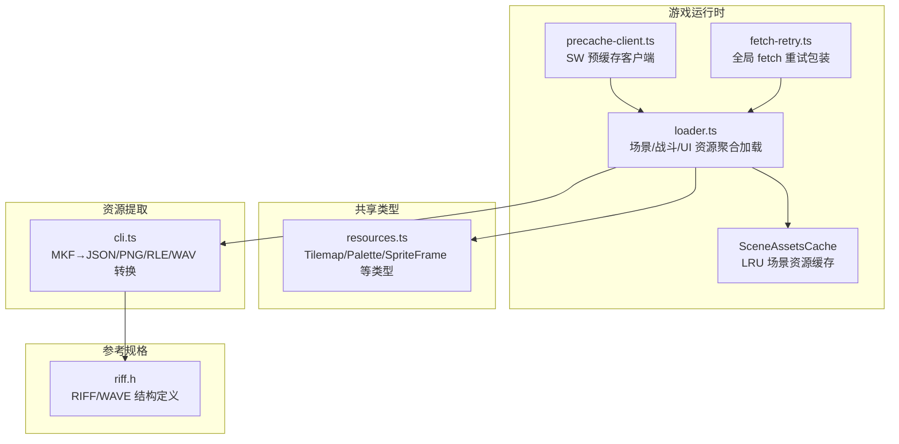
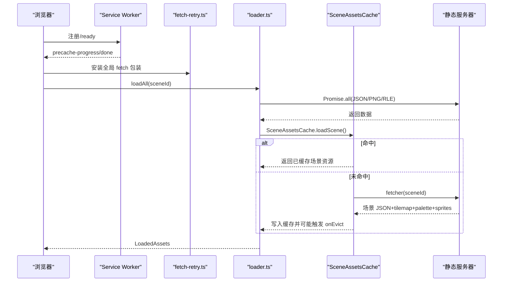
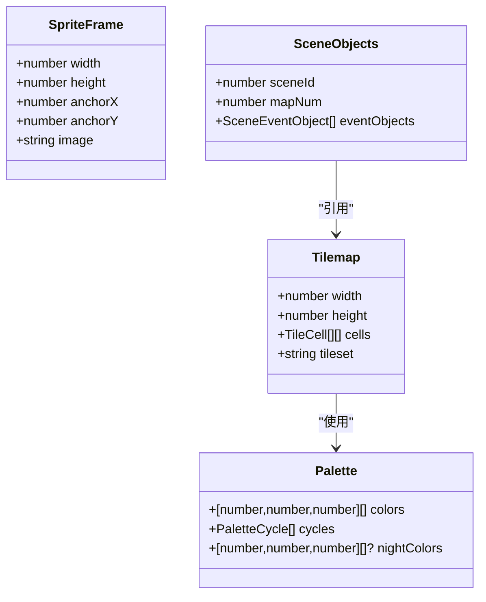
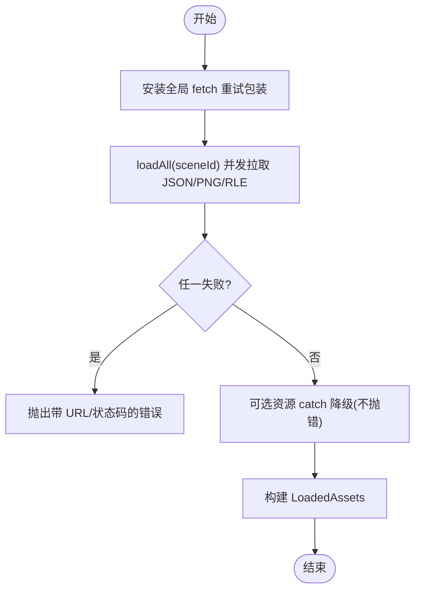
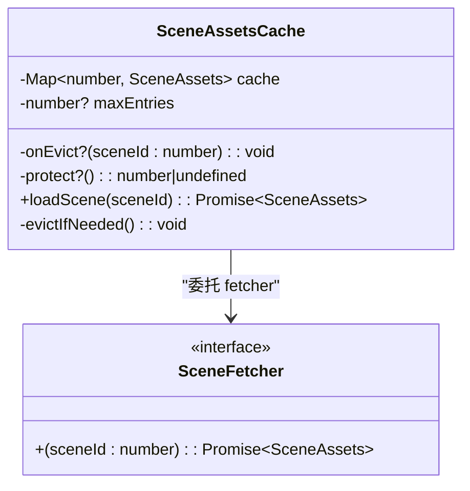
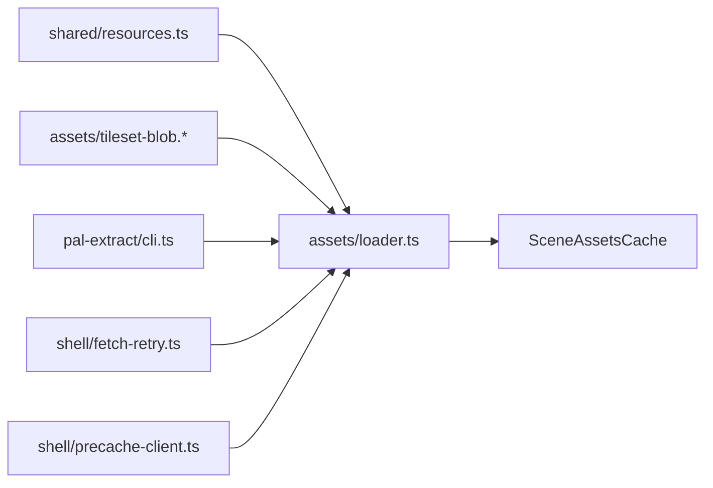

# 运行时资源加载器

<cite>
**本文引用的文件**   
- [packages/game/src/assets/loader.ts](file://packages/game/src/assets/loader.ts)
- [packages/shared/src/resources.ts](file://packages/shared/src/resources.ts)
- [packages/pal-extract/src/cli.ts](file://packages/pal-extract/src/cli.ts)
- [reference/sdlpal/riff.h](file://reference/sdlpal/riff.h)
- [packages/game/src/shell/fetch-retry.ts](file://packages/game/src/shell/fetch-retry.ts)
- [packages/game/src/shell/precache-client.ts](file://packages/game/src/shell/precache-client.ts)
- [docs/phase1/plans/2026-06-14-unified-precache-progress-gate-impl.md](file://docs/phase1/plans/2026-06-14-unified-precache-progress-gate-impl.md)
- [packages/game/src/assets/tileset-blob.test.ts](file://packages/game/src/assets/tileset-blob.test.ts)
- [packages/game/src/assets/rle-decode.test.ts](file://packages/game/src/assets/rle-decode.test.ts)
- [packages/game/src/shell/rng-player.test.ts](file://packages/game/src/shell/rng-player.test.ts)
</cite>

## 目录
1. [简介](#简介)
2. [项目结构](#项目结构)
3. [核心组件](#核心组件)
4. [架构总览](#架构总览)
5. [详细组件分析](#详细组件分析)
6. [依赖关系分析](#依赖关系分析)
7. [性能考量](#性能考量)
8. [故障排查指南](#故障排查指南)
9. [结论](#结论)
10. [附录](#附录)

## 简介
本文件面向“运行时资源加载系统”，围绕现代资源格式设计、异步加载策略、内存管理、缓存机制、资源验证与性能监控展开，结合仓库中实际实现进行系统化说明。重点覆盖：
- JSON 配置文件结构（场景、地图、调色板、战斗表等）
- PNG 精灵图集布局（RLE 压缩 blob + 帧元数据 manifest）
- WAV 音频格式规范（RIFF/WAVE chunk 结构）
- 异步加载策略（Promise 并发、重试退避、防风暴复用）
- 内存管理（对象池、引用计数、LRU 淘汰）
- 缓存机制（LRU 缓存、预加载、离线 Service Worker）
- 资源验证（完整性、版本兼容、损坏检测）
- 性能监控（加载耗时、内存占用、瓶颈识别）

## 项目结构
本项目采用多包工作区组织，资源加载相关代码主要位于 packages/game 与 packages/shared，资源提取工具位于 packages/pal-extract，参考 sdlpal 的 RIFF/WAVE 定义在 reference/sdlpal。

图表来源
- [packages/game/src/assets/loader.ts:135-390](file://packages/game/src/assets/loader.ts#L135-L390)
- [packages/game/src/assets/loader.ts:451-499](file://packages/game/src/assets/loader.ts#L451-L499)
- [packages/game/src/shell/precache-client.ts:34-65](file://packages/game/src/shell/precache-client.ts#L34-L65)
- [packages/game/src/shell/fetch-retry.ts:1-25](file://packages/game/src/shell/fetch-retry.ts#L1-L25)
- [packages/shared/src/resources.ts:1-141](file://packages/shared/src/resources.ts#L1-L141)
- [packages/pal-extract/src/cli.ts:1-200](file://packages/pal-extract/src/cli.ts#L1-L200)
- [reference/sdlpal/riff.h:1-113](file://reference/sdlpal/riff.h#L1-L113)

章节来源
- [packages/game/src/assets/loader.ts:135-390](file://packages/game/src/assets/loader.ts#L135-L390)
- [packages/shared/src/resources.ts:1-141](file://packages/shared/src/resources.ts#L1-L141)
- [packages/pal-extract/src/cli.ts:1-200](file://packages/pal-extract/src/cli.ts#L1-L200)
- [reference/sdlpal/riff.h:1-113](file://reference/sdlpal/riff.h#L1-L113)

## 核心组件
- 资源聚合加载器：负责并行拉取 JSON 配置、PNG 图集、RLE 压缩 blob，并组装为运行时可用数据结构。
- 场景资源缓存：基于 Map 的 LRU 缓存，支持保护当前渲染场景、淘汰回调联动清理。
- 网络层重试：对 GET 请求进行指数退避重试，屏蔽瞬时网络抖动与服务端限流。
- 预缓存客户端：通过 Service Worker 控制全量预缓存进度、暂停/恢复与加速。
- 资源格式类型：统一 Tilemap、Palette、SpriteFrame 等运行时数据结构。

章节来源
- [packages/game/src/assets/loader.ts:135-390](file://packages/game/src/assets/loader.ts#L135-L390)
- [packages/game/src/assets/loader.ts:451-499](file://packages/game/src/assets/loader.ts#L451-L499)
- [packages/game/src/shell/fetch-retry.ts:1-25](file://packages/game/src/shell/fetch-retry.ts#L1-L25)
- [packages/game/src/shell/precache-client.ts:34-65](file://packages/game/src/shell/precache-client.ts#L34-L65)
- [packages/shared/src/resources.ts:1-141](file://packages/shared/src/resources.ts#L1-L141)

## 架构总览
下图展示从浏览器启动到资源就绪的关键路径：Service Worker 预缓存 → 全局 fetch 重试 → 资源聚合加载 → 场景 LRU 缓存命中/回源 → 渲染使用。

图表来源
- [packages/game/src/shell/precache-client.ts:34-65](file://packages/game/src/shell/precache-client.ts#L34-L65)
- [packages/game/src/shell/fetch-retry.ts:1-25](file://packages/game/src/shell/fetch-retry.ts#L1-L25)
- [packages/game/src/assets/loader.ts:135-390](file://packages/game/src/assets/loader.ts#L135-L390)
- [packages/game/src/assets/loader.ts:451-499](file://packages/game/src/assets/loader.ts#L451-L499)

## 详细组件分析

### 现代资源格式设计
- JSON 配置文件结构
  - 场景与地图：scene.json 包含 sceneId、mapNum、事件对象列表；tilemap-N.json 包含 width、height、cells 与 tileset 相对路径。
  - 调色板：palette/0.json 提供白天 colors、可选 nightColors 与 cycles 动画段。
  - 战斗与物品：enemies.json、battle-fields.json、items.json、magic.json 等平铺数据表。
  - UI 与图标：ui-sprite/spriteui.json 描述 UI 帧索引与尺寸；items-icons.json 映射 chunkIndex 到图标 PNG。
- PNG 精灵图集布局
  - 旧方案：每帧独立 PNG + sprite-{id}.json。
  - 新方案：按 sprite 或 tileset 打包为 gzip 压缩的 RLE blob（后缀 .rle），runtime 用 DecompressionStream 解压后解析帧序列，减少请求数与体积。
  - 帧元数据 manifest：如 fire-sprites.json、battle-sprites.json、items-icons.json 用于按需加载与帧尺寸信息。
- WAV 音频格式规范
  - 每个非空 chunk 即完整 RIFF/WAVE 文件，可直接被底层播放器读取。
  - 结构遵循 riff.h 中的 RIFFHeader、WAVEFormatPCM 等定义。

图表来源
- [packages/shared/src/resources.ts:1-141](file://packages/shared/src/resources.ts#L1-L141)
- [packages/pal-extract/src/cli.ts:92-140](file://packages/pal-extract/src/cli.ts#L92-L140)
- [reference/sdlpal/riff.h:1-113](file://reference/sdlpal/riff.h#L1-L113)

章节来源
- [packages/shared/src/resources.ts:1-141](file://packages/shared/src/resources.ts#L1-L141)
- [packages/pal-extract/src/cli.ts:92-140](file://packages/pal-extract/src/cli.ts#L92-L140)
- [reference/sdlpal/riff.h:1-113](file://reference/sdlpal/riff.h#L1-L113)

### 异步加载策略
- Promise 链式与并发
  - 使用 Promise.all 并发拉取多个 JSON 与图片，失败时快速失败并携带 URL/状态码上下文。
  - 针对可选资源（object-players.json、words.json）采用 catch 降级，避免阻塞主流程。
- 并发控制与防风暴
  - RNG 播放场景下，同一 chunk 的多帧并发会复用 in-flight Promise，避免重复解压与解码导致的 O(N²) 放大。
- 错误重试机制
  - 全局 fetch 包装仅对幂等 GET 重试，区分网络层失败与网关瞬时错误（502/503/504），默认重试 2 次，退避 300ms/900ms。
  - 必须在 boot-loading 之前安装，确保后续所有 fetch 均受保护。

图表来源
- [packages/game/src/assets/loader.ts:135-190](file://packages/game/src/assets/loader.ts#L135-L190)
- [packages/game/src/shell/fetch-retry.ts:1-25](file://packages/game/src/shell/fetch-retry.ts#L1-L25)
- [packages/game/src/shell/rng-player.test.ts:287-319](file://packages/game/src/shell/rng-player.test.ts#L287-L319)

章节来源
- [packages/game/src/assets/loader.ts:135-190](file://packages/game/src/assets/loader.ts#L135-L190)
- [packages/game/src/shell/fetch-retry.ts:1-25](file://packages/game/src/shell/fetch-retry.ts#L1-L25)
- [packages/game/src/shell/rng-player.test.ts:287-319](file://packages/game/src/shell/rng-player.test.ts#L287-L319)

### 内存管理与对象池
- 对象池模式
  - IndexedImage 的 indices/opaque 数组直接复用底层 Uint8Array，避免拷贝开销。
- 引用计数
  - 场景资源缓存以 Map<number, SceneAssets> 维护引用，LRU 淘汰时调用 onEvict 由上层清理并行缓存（如 tileImagesBySceneId）。
- 垃圾回收优化
  - 将大对象（tileset、NPC/battle/magic sprites）以 blob 形式延迟解压，按需解码，降低峰值内存。
  - 保护当前渲染场景不被淘汰，避免黑屏与二次加载抖动。

章节来源
- [packages/game/src/assets/tileset-blob.test.ts:35-104](file://packages/game/src/assets/tileset-blob.test.ts#L35-L104)
- [packages/game/src/assets/loader.ts:451-499](file://packages/game/src/assets/loader.ts#L451-L499)

### 缓存机制
- LRU 缓存算法
  - 基于 JS Map 插入顺序实现 LRU，命中时 delete+set 刷新至 MRU 端。
  - 支持 maxEntries 上限与 protect 回调，保护当前场景不被淘汰。
- 预加载策略
  - 通过 precache-client 向 active worker 发送 precache/precache-boost 消息，控制预缓存并发与阶段。
- 离线缓存支持
  - Service Worker 注册成功后，监听 precache-progress/done 事件，完成后可离线游玩。

图表来源
- [packages/game/src/assets/loader.ts:451-499](file://packages/game/src/assets/loader.ts#L451-L499)
- [packages/game/src/shell/precache-client.ts:34-65](file://packages/game/src/shell/precache-client.ts#L34-L65)
- [docs/phase1/plans/2026-06-14-unified-precache-progress-gate-impl.md:301-392](file://docs/phase1/plans/2026-06-14-unified-precache-progress-gate-impl.md#L301-L392)

章节来源
- [packages/game/src/assets/loader.ts:451-499](file://packages/game/src/assets/loader.ts#L451-L499)
- [packages/game/src/shell/precache-client.ts:34-65](file://packages/game/src/shell/precache-client.ts#L34-L65)
- [docs/phase1/plans/2026-06-14-unified-precache-progress-gate-impl.md:301-392](file://docs/phase1/plans/2026-06-14-unified-precache-progress-gate-impl.md#L301-L392)

### 资源验证
- 完整性检查
  - fetchJson/fetchPng 对 HTTP 状态码校验，失败抛错并附带 URL 与状态码。
  - RLE 解码测试覆盖透明像素与 opaque palette-0 的正确性，确保像素级一致。
- 版本兼容性
  - 可选资源缺失时降级处理（object-players.json、words.json），保证主流程稳定。
- 损坏检测
  - 通过 decodeRle 与 parseSpriteChunk 的单元测试保障 RLE 帧头与前缀处理正确，避免异常数据导致崩溃。

章节来源
- [packages/game/src/assets/loader.ts:35-48](file://packages/game/src/assets/loader.ts#L35-L48)
- [packages/game/src/assets/rle-decode.test.ts:1-28](file://packages/game/src/assets/rle-decode.test.ts#L1-L28)
- [packages/game/src/assets/tileset-blob.test.ts:35-104](file://packages/game/src/assets/tileset-blob.test.ts#L35-L104)

### 性能监控
- 加载时间统计
  - 可在 precache-client 的 progress 事件中记录各阶段耗时，结合 onReady/onDone 计算端到端时长。
- 内存使用分析
  - 关注 tileImagesBySceneId 等大对象的 onEvict 清理，避免全场景常驻导致 ~100MB 内存占用。
- 瓶颈识别
  - RNG 播放并发风暴修复前后对比：同一 chunk 的 N 帧并发只触发一次底层加载，显著降低黑屏时长。

章节来源
- [packages/game/src/shell/precache-client.ts:34-65](file://packages/game/src/shell/precache-client.ts#L34-L65)
- [packages/game/src/assets/loader.ts:451-499](file://packages/game/src/assets/loader.ts#L451-L499)
- [packages/game/src/shell/rng-player.test.ts:287-319](file://packages/game/src/shell/rng-player.test.ts#L287-L319)

## 依赖关系分析
- loader.ts 依赖 shared 类型定义与 tileset-blob/png 解码模块，同时消费 pal-extract 产出的 JSON/PNG/RLE 资源。
- SceneAssetsCache 作为中间层解耦 fetcher 实现，便于替换不同场景资源的获取策略。
- fetch-retry.ts 在应用早期安装，影响全局 fetch 行为，提升鲁棒性。
- precache-client.ts 与 Service Worker 通信，控制预缓存生命周期。

图表来源
- [packages/game/src/assets/loader.ts:135-390](file://packages/game/src/assets/loader.ts#L135-L390)
- [packages/shared/src/resources.ts:1-141](file://packages/shared/src/resources.ts#L1-L141)
- [packages/pal-extract/src/cli.ts:1-200](file://packages/pal-extract/src/cli.ts#L1-L200)
- [packages/game/src/shell/fetch-retry.ts:1-25](file://packages/game/src/shell/fetch-retry.ts#L1-L25)
- [packages/game/src/shell/precache-client.ts:34-65](file://packages/game/src/shell/precache-client.ts#L34-L65)

章节来源
- [packages/game/src/assets/loader.ts:135-390](file://packages/game/src/assets/loader.ts#L135-L390)
- [packages/shared/src/resources.ts:1-141](file://packages/shared/src/resources.ts#L1-L141)
- [packages/pal-extract/src/cli.ts:1-200](file://packages/pal-extract/src/cli.ts#L1-L200)
- [packages/game/src/shell/fetch-retry.ts:1-25](file://packages/game/src/shell/fetch-retry.ts#L1-L25)
- [packages/game/src/shell/precache-client.ts:34-65](file://packages/game/src/shell/precache-client.ts#L34-L65)

## 性能考量
- 并发与去重
  - 使用 Promise.all 最大化吞吐；对同一 chunk 的并发访问复用 in-flight Promise，避免重复解压与解码。
- 压缩与传输
  - 采用 gzip 压缩的 RLE blob（.rle 后缀），避免服务器 Content-Encoding 双解压问题，减小体积且利于 SW 缓存。
- 内存峰值控制
  - 延迟解压与按需加载，配合 LRU 淘汰与 onEvict 清理，防止全场景常驻带来的高内存占用。
- 网络稳定性
  - 全局 fetch 重试与退避策略有效应对 nginx keepalive_requests 限制与链路抖动。

## 故障排查指南
- 资源 404/网络失败
  - 检查 fetchJson/fetchPng 的错误上下文（URL 与状态码），确认 /extracted 路径与软链是否正确。
- 场景切换黑屏
  - 确认 SceneAssetsCache.protect 是否返回当前场景 id，避免被 LRU 淘汰。
- 音效/音乐缺失
  - 核对 SOUNDS.MKF 提取产物 sounds/{i}.wav 是否存在，以及 metadata 索引是否匹配。
- 预缓存不生效
  - 检查 Service Worker 注册是否成功，监听 precache-progress/done 事件，必要时调用 boostPrecache 提升并发。

章节来源
- [packages/game/src/assets/loader.ts:135-190](file://packages/game/src/assets/loader.ts#L135-L190)
- [packages/game/src/assets/loader.ts:451-499](file://packages/game/src/assets/loader.ts#L451-L499)
- [packages/pal-extract/src/cli.ts:513-529](file://packages/pal-extract/src/cli.ts#L513-L529)
- [packages/game/src/shell/precache-client.ts:34-65](file://packages/game/src/shell/precache-client.ts#L34-L65)

## 结论
本运行时资源加载系统通过现代资源格式（JSON 配置、RLE 压缩 PNG 图集、RIFF/WAVE 音频）、并发与重试的异步策略、LRU 场景缓存与对象池化、Service Worker 预缓存与离线支持，构建了稳健高效的资源管线。结合完善的资源验证与性能监控手段，能够在复杂网络与内存约束下保持稳定表现。

## 附录
- 关键实现路径
  - 资源聚合加载：[packages/game/src/assets/loader.ts:135-390](file://packages/game/src/assets/loader.ts#L135-L390)
  - 场景 LRU 缓存：[packages/game/src/assets/loader.ts:451-499](file://packages/game/src/assets/loader.ts#L451-L499)
  - 全局 fetch 重试：[packages/game/src/shell/fetch-retry.ts:1-25](file://packages/game/src/shell/fetch-retry.ts#L1-L25)
  - 预缓存客户端：[packages/game/src/shell/precache-client.ts:34-65](file://packages/game/src/shell/precache-client.ts#L34-L65)
  - 资源类型定义：[packages/shared/src/resources.ts:1-141](file://packages/shared/src/resources.ts#L1-L141)
  - 资源提取 CLI：[packages/pal-extract/src/cli.ts:1-200](file://packages/pal-extract/src/cli.ts#L1-L200)
  - RIFF/WAVE 结构：[reference/sdlpal/riff.h:1-113](file://reference/sdlpal/riff.h#L1-L113)