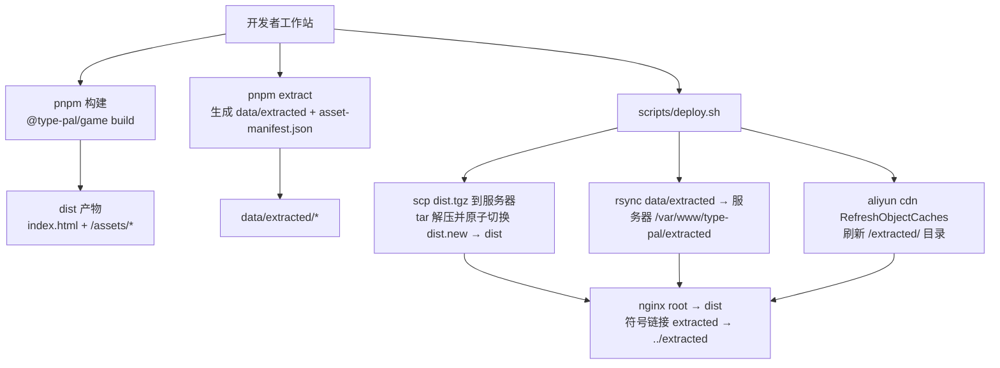
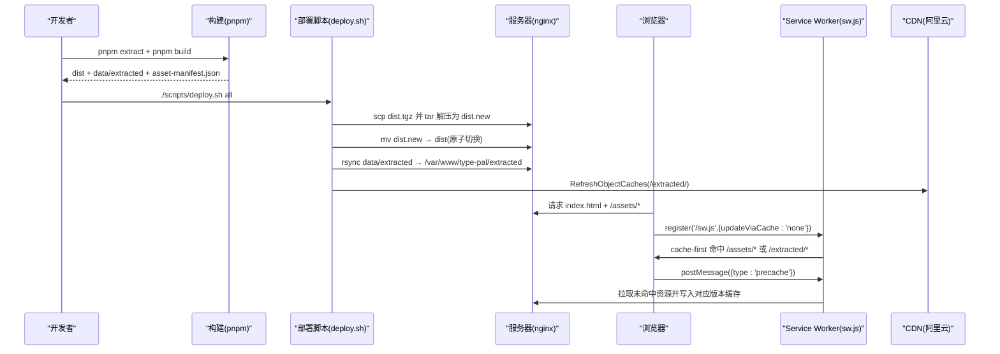
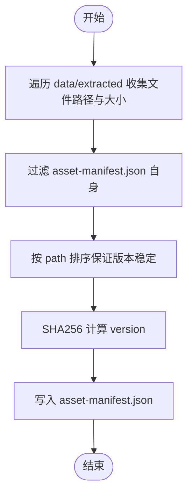
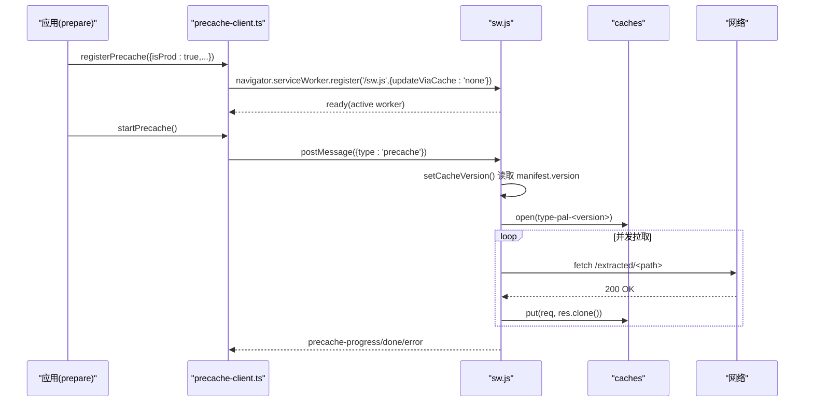
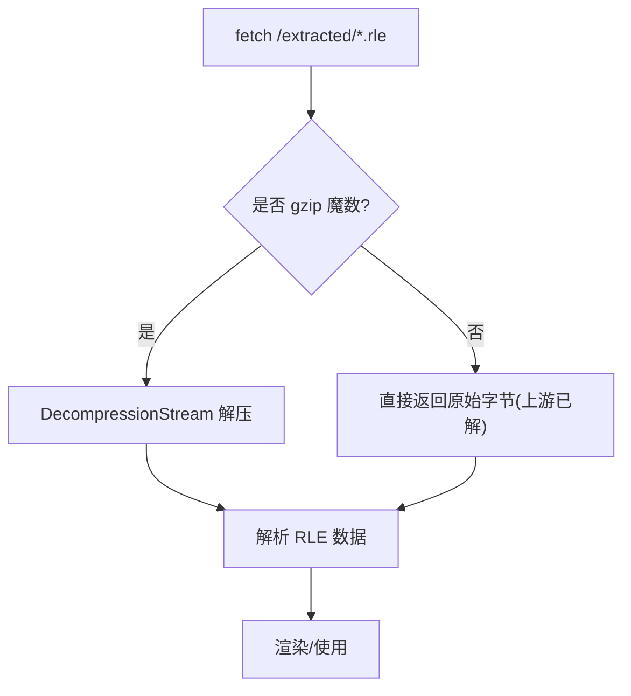
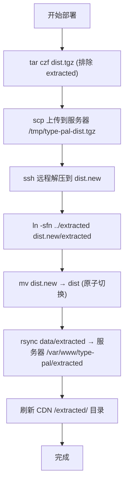
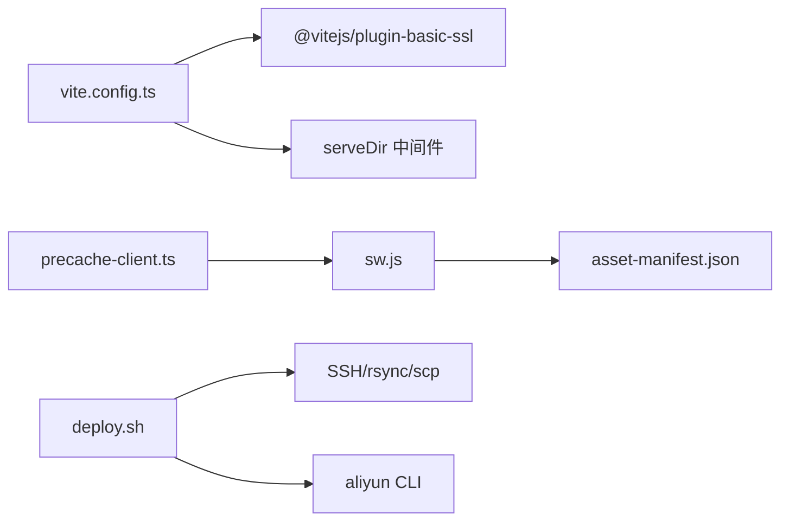

# 部署指南

<cite>
**本文引用的文件**   
- [README.md](file://README.md)
- [package.json](file://package.json)
- [vite.config.ts](file://packages/game/vite.config.ts)
- [sw.js](file://packages/game/public/sw.js)
- [precache-client.ts](file://packages/game/src/shell/precache-client.ts)
- [deploy.sh](file://scripts/deploy.sh)
- [asset-manifest.test.ts](file://packages/pal-extract/src/__tests__/asset-manifest.test.ts)
- [tileset-blob.ts](file://packages/game/src/assets/tileset-blob.ts)
- [tileset-blob.test.ts](file://packages/game/src/assets/tileset-blob.test.ts)
</cite>

## 目录
1. [简介](#简介)
2. [项目结构](#项目结构)
3. [核心组件](#核心组件)
4. [架构总览](#架构总览)
5. [详细组件分析](#详细组件分析)
6. [依赖关系分析](#依赖关系分析)
7. [性能优化策略](#性能优化策略)
8. [环境配置与域名管理](#环境配置与域名管理)
9. [监控方案](#监控方案)
10. [故障排查指南](#故障排查指南)
11. [结论](#结论)

## 简介
本指南面向生产环境，覆盖静态资源构建、Service Worker 注册与离线预缓存、性能优化（压缩/懒加载/缓存/CDN）、环境配置与域名管理、监控方案以及故障排查与回滚策略。目标是确保应用在生产环境的稳定性与性能表现。

## 项目结构
本项目采用 monorepo 组织：
- packages/game：Vite 浏览器运行时，包含 Service Worker 与离线预缓存客户端
- packages/pal-extract：资源提取工具，生成 data/extracted 与 asset-manifest.json
- scripts：一键部署脚本 deploy.sh，负责构建、原子切换、rsync 增量同步与 CDN 刷新
- 根 package.json：统一脚本入口（check/test/build/extract 等）

图表来源
- [deploy.sh:82-158](file://scripts/deploy.sh#L82-L158)
- [vite.config.ts:46-70](file://packages/game/vite.config.ts#L46-L70)
- [asset-manifest.test.ts:1-33](file://packages/pal-extract/src/__tests__/asset-manifest.test.ts#L1-L33)

章节来源
- [README.md:110-131](file://README.md#L110-L131)
- [package.json:5-15](file://package.json#L5-L15)
- [deploy.sh:1-203](file://scripts/deploy.sh#L1-L203)

## 核心组件
- 资源清单生成：pal-extract 在构建期扫描 data/extracted，输出 asset-manifest.json（含 version、totalBytes、fileCount、files），用于 SW 按版本管理缓存。
- 服务工作者：public/sw.js 原生实现，提供 cache-first 读取与后台预缓存；按 manifest.version 清理旧缓存，避免跨版本错位。
- 预缓存客户端：src/shell/precache-client.ts 仅在生产注册 SW，控制两段进度与视频期间暂停/恢复，向 SW 发送 precache 指令。
- 构建与部署：vite.config.ts 提供 dev/preview 中间件映射 /extracted；deploy.sh 执行构建、原子切换、rsync 增量同步与 CDN 刷新。

章节来源
- [asset-manifest.test.ts:1-33](file://packages/pal-extract/src/__tests__/asset-manifest.test.ts#L1-L33)
- [sw.js:1-160](file://packages/game/public/sw.js#L1-L160)
- [precache-client.ts:1-91](file://packages/game/src/shell/precache-client.ts#L1-L91)
- [vite.config.ts:1-70](file://packages/game/vite.config.ts#L1-L70)
- [deploy.sh:1-203](file://scripts/deploy.sh#L1-L203)

## 架构总览
生产端关键交互：
- 构建阶段：Vite 产出 dist；pal-extract 产出 data/extracted 与 asset-manifest.json
- 部署阶段：deploy.sh 将 dist 原子切换至服务器，并将 extracted 通过 rsync 增量同步，随后刷新 CDN
- 运行阶段：浏览器按需 fetch /assets/* 与 /extracted/*；SW 命中本地缓存或网络拉取；后台预缓存根据 manifest 全量填充

图表来源
- [deploy.sh:98-158](file://scripts/deploy.sh#L98-L158)
- [sw.js:36-63](file://packages/game/public/sw.js#L36-L63)
- [precache-client.ts:50-91](file://packages/game/src/shell/precache-client.ts#L50-L91)

## 详细组件分析

### 静态资源构建与清单
- Vite 构建目标 es2022，关闭内联，输出 dist；dev/preview 通过中间件将 /extracted 映射到仓库 data/extracted，避免 symlink 问题。
- pal-extract 生成 asset-manifest.json，version 对内容稳定敏感，剔除自身避免自指。

图表来源
- [asset-manifest.test.ts:1-33](file://packages/pal-extract/src/__tests__/asset-manifest.test.ts#L1-L33)
- [vite.config.ts:17-44](file://packages/game/vite.config.ts#L17-L44)

章节来源
- [vite.config.ts:46-70](file://packages/game/vite.config.ts#L46-L70)
- [asset-manifest.test.ts:1-33](file://packages/pal-extract/src/__tests__/asset-manifest.test.ts#L1-L33)

### Service Worker 注册与离线预缓存
- 客户端仅在 isProd=true 时注册 SW，使用 updateViaCache:'none' 绕过 HTTP 缓存，确保 sw.js 更新即时生效。
- 预缓存分两段：虚线后可玩门后启动全量预缓存；开场视频期间暂停，避免抢带宽导致交互延迟。
- SW 激活时按 manifest.version 设置 CACHE_NAME，并删除非当前版本的旧缓存，防止跨版本错位。

图表来源
- [precache-client.ts:50-91](file://packages/game/src/shell/precache-client.ts#L50-L91)
- [sw.js:83-143](file://packages/game/public/sw.js#L83-L143)

章节来源
- [precache-client.ts:1-91](file://packages/game/src/shell/precache-client.ts#L1-L91)
- [sw.js:1-160](file://packages/game/public/sw.js#L1-L160)

### 资源压缩与懒加载
- tileset-blob.ts 使用浏览器 DecompressionStream 解压 gzip blob，并对上游 Content-Encoding 已解压的情况做二次解压防御（魔数判断）。
- 资源按需加载：运行时按需 fetch /extracted/*，SW 的 cache-first 命中优先，未命中则网络拉取并缓存。

图表来源
- [tileset-blob.ts:89-111](file://packages/game/src/assets/tileset-blob.ts#L89-L111)
- [tileset-blob.test.ts:179-214](file://packages/game/src/assets/tileset-blob.test.ts#L179-L214)

章节来源
- [tileset-blob.ts:89-111](file://packages/game/src/assets/tileset-blob.ts#L89-L111)
- [tileset-blob.test.ts:179-214](file://packages/game/src/assets/tileset-blob.test.ts#L179-L214)

### 部署流程与回滚策略
- 应用壳：tar 打包 dist（排除 extracted），远程解压为 dist.new，原子切换 dist.new → dist，旧版保留 dist.old。
- 数据资源：rsync 增量同步 extracted，--delete 清理消失文件，--partial 支持续传。
- CDN 刷新：rsync 后调用 aliyun CLI 刷新 /extracted/ 目录，避免边缘节点缓存旧数据。
- 回滚：若新版本异常，可快速将 dist 切回 dist.old（由脚本保留）。

图表来源
- [deploy.sh:98-158](file://scripts/deploy.sh#L98-L158)

章节来源
- [deploy.sh:1-203](file://scripts/deploy.sh#L1-L203)

## 依赖关系分析
- 构建期依赖：Vite 插件 basicSsl（非 e2e）、自定义 serveDir 中间件
- 运行期依赖：navigator.serviceWorker、navigator.storage.persist、caches API
- 部署期依赖：SSH、rsync、tar、scp、aliyun CLI（可选）

图表来源
- [vite.config.ts:1-70](file://packages/game/vite.config.ts#L1-L70)
- [precache-client.ts:1-91](file://packages/game/src/shell/precache-client.ts#L1-L91)
- [sw.js:1-160](file://packages/game/public/sw.js#L1-L160)
- [deploy.sh:1-203](file://scripts/deploy.sh#L1-L203)

章节来源
- [vite.config.ts:1-70](file://packages/game/vite.config.ts#L1-L70)
- [deploy.sh:1-203](file://scripts/deploy.sh#L1-L203)

## 性能优化策略
- 资源压缩
  - 服务端启用 gzip/br 压缩静态资源（assets 与 extracted 中的文本/图像/音频）
  - 资源文件名带哈希，利于长期缓存
- 懒加载
  - 运行时按需 fetch /extracted/*，SW 命中优先；大体积资源延后加载
  - 开场视频期间暂停预缓存，避免抢占用户输入与 Range 请求带宽
- 缓存策略
  - SW cache-first：先查所有 type-pal-* 缓存，再网络拉取并缓存 200 响应
  - 按 manifest.version 隔离缓存，激活时清理旧版本，避免跨版本错位
  - 持久化存储：尝试 navigator.storage.persist 提升配额
- CDN 配置
  - /assets/* 长缓存（强缓存+版本号）
  - /extracted/* 短缓存或无缓存，配合部署后目录刷新，避免同路径内容变更仍命中旧缓存

[本节为通用指导，不直接分析具体文件]

## 环境配置与域名管理
- 环境变量
  - PROD：控制是否注册 SW 与预缓存（precache-client 中 isProd 门）
  - E2E：影响 vite.config 是否启用 basicSsl 与端口选择
- 域名与 HTTPS
  - 站点域名 pal.illegalscreed.cn，需 HTTPS（AudioWorklet 需要 secure context）
  - 首次上线需在 DNS 添加 A 记录，并在服务器安装证书（certbot）
- 开发/预览
  - dev 默认 5173，局域网访问建议开启 basicSsl 以获取 secure context
  - preview 模式同样挂载 /extracted 中间件，便于本地验证 SW/离线

章节来源
- [precache-client.ts:50-91](file://packages/game/src/shell/precache-client.ts#L50-L91)
- [vite.config.ts:7-10](file://packages/game/vite.config.ts#L7-L10)
- [deploy.sh:24-28](file://scripts/deploy.sh#L24-L28)

## 监控方案
- 错误追踪
  - 在浏览器层捕获全局错误与 Promise 未处理拒绝，上报至错误追踪平台
  - 针对 SW 相关错误（register 失败、manifest 不可达、precache-error）进行专项埋点
- 性能监控
  - 首屏时间、可玩时间（虚线出现）、预缓存耗时与成功率
  - 资源命中率（SW 命中 vs 网络）、CDN 命中率
- 用户行为分析
  - 场景进入、战斗触发、菜单操作等关键事件上报
  - 速通计时器可作为行为样本（可选）

[本节为通用指导，不直接分析具体文件]

## 故障排查指南
- 常见问题诊断
  - SW 未注册：检查 isProd 是否为 true、浏览器是否支持 serviceWorker、/sw.js 是否可达且未被 HTTP 缓存拦截
  - 预缓存卡住：确认 manifest 可获取、SW 是否被浏览器终止（waitUntil 保活）、是否在视频期间被暂停
  - 资源 404：检查 nginx 是否正确指向 dist，extracted 符号链接是否存在，CDN 是否刷新
- 日志收集
  - 前端 console.warn 与 onUnavailable/onError 回调信息
  - SW 侧 precache-progress/done/error 消息
- 回滚策略
  - 应用壳：将 dist 切回 dist.old（脚本保留旧版）
  - 数据资源：重新 rsync 正确版本的 extracted，并刷新 CDN

章节来源
- [precache-client.ts:50-91](file://packages/game/src/shell/precache-client.ts#L50-L91)
- [sw.js:13-34](file://packages/game/public/sw.js#L13-L34)
- [deploy.sh:116-124](file://scripts/deploy.sh#L116-L124)

## 结论
通过“构建期清单 + 运行期 SW 预缓存 + 原子切换 + 增量同步 + CDN 刷新”的组合，项目在大规模资源与频繁发版的场景下仍能保持稳定的首屏体验与离线可用性。配合完善的监控与回滚机制，可在生产环境中持续保障稳定性与性能。