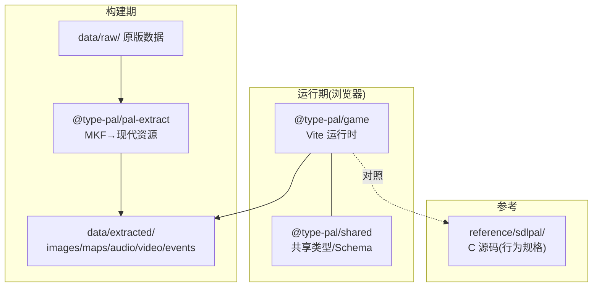
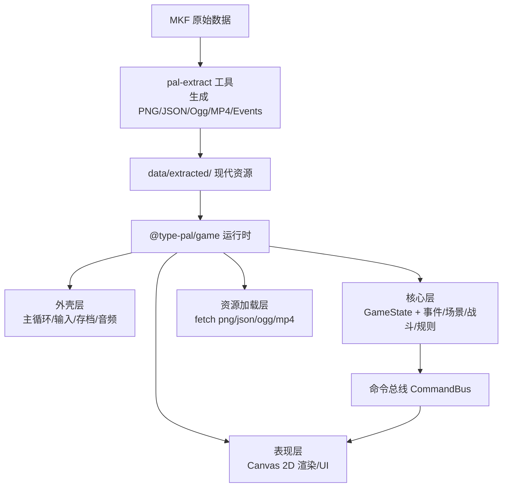
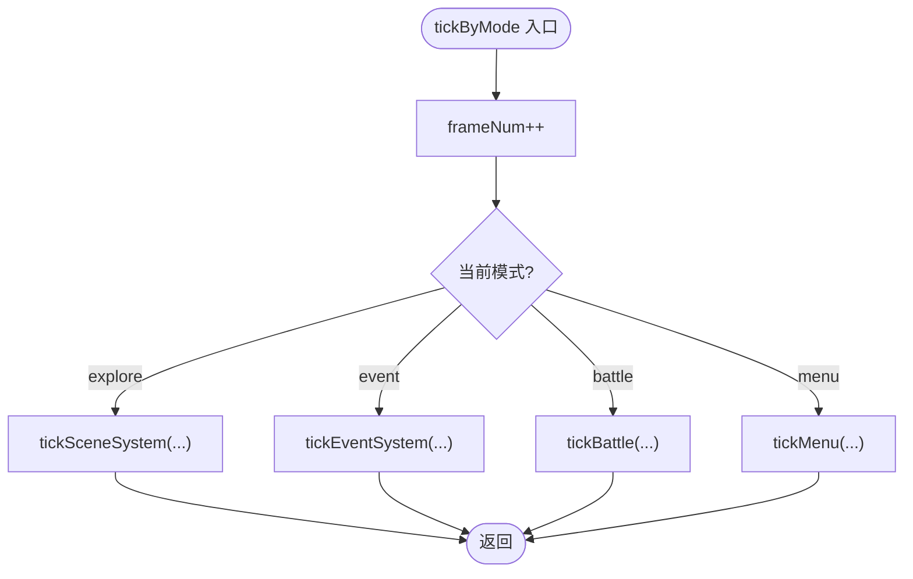
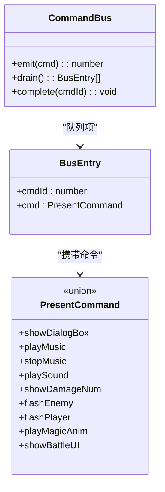
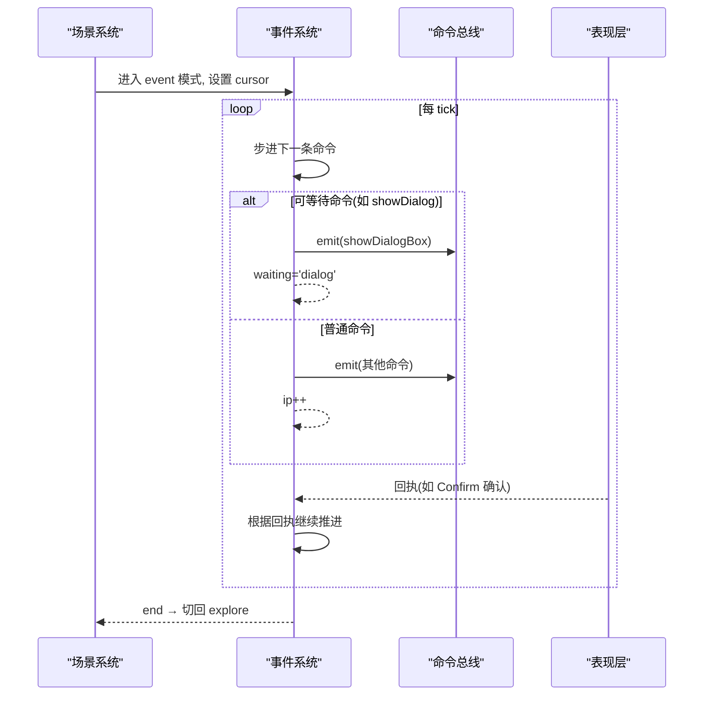
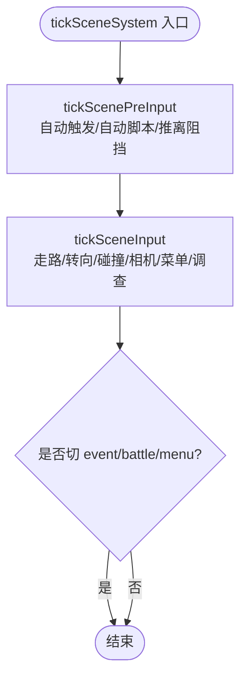
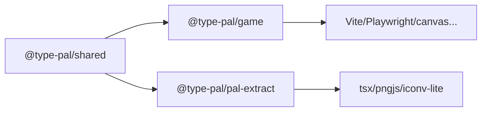

# 项目概述

<cite>
**本文引用的文件**   
- [README.md](file://README.md)
- [02-architecture.md](file://docs/phase1/02-architecture.md)
- [04-decisions.md](file://docs/phase1/04-decisions.md)
- [05-events-schema.md](file://docs/phase1/05-events-schema.md)
- [phase2 README.md](file://docs/phase2/README.md)
- [package.json](file://package.json)
- [game/package.json](file://packages/game/package.json)
- [pal-extract/package.json](file://packages/pal-extract/package.json)
- [shared/package.json](file://packages/shared/package.json)
- [mode.ts](file://packages/game/src/core/mode.ts)
- [command-bus.ts](file://packages/game/src/core/command-bus.ts)
- [event-system.ts](file://packages/game/src/core/event-system.ts)
- [scene-system.ts](file://packages/game/src/core/scene-system.ts)
</cite>

## 目录
1. [简介](#简介)
2. [项目结构](#项目结构)
3. [核心组件](#核心组件)
4. [架构总览](#架构总览)
5. [详细组件分析](#详细组件分析)
6. [依赖关系分析](#依赖关系分析)
7. [性能与体验特性](#性能与体验特性)
8. [快速开始与在线试玩](#快速开始与在线试玩)
9. [故障排查指南](#故障排查指南)
10. [结论](#结论)

## 简介
Type-Pal 是一个在浏览器环境中用 TypeScript 完全重写的经典中文 RPG《仙剑奇侠传》忠实移植项目。项目的核心目标是：以 sdlpal C 源码作为行为规格参考，在 TS 中重建资源提取、事件脚本、场景、战斗、菜单、存档、音频和演出系统；第一阶段追求“忠实还原”，第二阶段（Reforge）则面向现代化重制与新内容生产。

- 两个阶段
  - 第一阶段（忠实还原）：以 sdlpal / 原版为真值，逐系统复刻原版行为、时序和数据语义。
  - 第二阶段（Reforge 重制版）：全新引擎 + 内容编辑器 + 自有内容，不对齐旧引擎/原版行为，架构优先。
- 技术特色
  - 参考而非 fork：sdlpal C 源仅作为真值参考，运行时代码是 TS 原生实现。
  - Canvas 2D 渲染：维护 320×200 索引色帧缓冲，软件查表上色后缩放上屏，精确还原调色板循环与渐变。
  - 离线预缓存：生产环境注册 Service Worker，两段加载进度 + 可玩门，首次加载后可离线游玩。
  - 事件系统：将原版字节码反汇编成可读 JSON 事件，运行时由协程式步进器执行，支持“可等待命令”。

本概述为初学者提供清晰的项目理解路径，并给出快速开始、包结构与开发环境搭建说明。

章节来源
- [README.md:1-24](file://README.md#L1-L24)
- [02-architecture.md:1-26](file://docs/phase1/02-architecture.md#L1-L26)
- [04-decisions.md:1-26](file://docs/phase1/04-decisions.md#L1-L26)

## 项目结构
仓库采用 pnpm workspace monorepo 组织，关键目录与职责如下：
- packages/shared：共享类型与数据结构（资源、事件命令、输入、数据表等）。
- packages/pal-extract：Node CLI 工具，把原版 MKF 等资源转换为现代网页资源（PNG/JSON/WAV/OGG/MP4 等），只运行一次。
- packages/game：Vite 浏览器运行时，包含场景、战斗、事件 VM、菜单、存档、音频、Canvas 表现层、工具面板与离线预缓存（Service Worker）。
- packages/reforge：第二阶段新引擎（Canvas 2D），当前为切片 demo（移动/碰撞/对话）。
- packages/content：第二阶段自有内容数据（早期雏形）。
- reference/sdlpal：sdlpal 源码副本，作为行为、公式、数据格式与时序的规格来源。
- data/raw：原版数据输入目录（不入库）。
- data/extracted：pal-extract 生成的运行时资源（可再生）。
- scripts：sdlpal build、baseline 提取等辅助脚本。

图表来源
- [02-architecture.md:1-26](file://docs/phase1/02-architecture.md#L1-L26)
- [04-decisions.md:12-26](file://docs/phase1/04-decisions.md#L12-L26)

章节来源
- [README.md:110-131](file://README.md#L110-L131)
- [02-architecture.md:1-26](file://docs/phase1/02-architecture.md#L1-L26)

## 核心组件
- 两阶段架构
  - 离线转换（pal-extract）：一次性把 MKF 解析为现代资源，运行时不再接触 MKF。
  - 网页游戏（@type-pal/game）：分四层——外壳层（主循环/输入/存档/音频）、表现层（Canvas 2D 渲染/UI）、核心层（纯逻辑：GameState + 事件/场景/战斗/规则 + 命令总线）、资源加载层（fetch png/json/ogg/mp4）。
- 核心层设计
  - 一个状态机 GameState（唯一真相源，可序列化）。
  - 四大系统：场景系统（行走/碰撞/NPC 行为/触发检测）、事件系统（总导演/对话/编排）、战斗系统（回合/公式/AI/奖励）、规则系统（角色/物品/法术/升级/商店）。
  - 一条命令总线：核心层通过命令总线向表现层发令，避免耦合渲染细节。
- 事件系统与 events.json
  - 忠实转写：字节码 1:1 反汇编为带标签的可读 JSON 事件，无损可逆。
  - 富模型：结构化子集（sequence/if/choice/loop）供手写新内容，与 label/goto 并存。
  - 运行时：协程式步进器，遇到“可等待命令”挂起，每 tick 检查回执继续推进。

章节来源
- [02-architecture.md:56-104](file://docs/phase1/02-architecture.md#L56-L104)
- [05-events-schema.md:1-53](file://docs/phase1/05-events-schema.md#L1-L53)
- [05-events-schema.md:138-158](file://docs/phase1/05-events-schema.md#L138-L158)

## 架构总览
下图展示从离线转换到运行时的整体流程，以及核心层的分层与交互。

图表来源
- [02-architecture.md:1-26](file://docs/phase1/02-architecture.md#L1-L26)
- [02-architecture.md:56-104](file://docs/phase1/02-architecture.md#L56-L104)

章节来源
- [02-architecture.md:1-26](file://docs/phase1/02-architecture.md#L1-L26)
- [02-architecture.md:56-104](file://docs/phase1/02-architecture.md#L56-L104)

## 详细组件分析

### 顶层模式机与主循环分发
- 顶层模式机按当前模式分发 tick：探索、事件、战斗、菜单等。
- 全局 frameNum 推进，所有模式统一计数，确保 NPC 动画相位一致。
- 自动淡入：在 explore 模式下，若需要 FadeIn，则在 tick 前自动启动，冻结移动直到淡完。

图表来源
- [mode.ts:1-21](file://packages/game/src/core/mode.ts#L1-L21)

章节来源
- [mode.ts:1-21](file://packages/game/src/core/mode.ts#L1-L21)

### 命令总线（Core → Present）
- 单向通道：核心层 emit 命令，表现层 drain 消费。
- 支持异步回执：complete(cmdId) 接口预留，用于转场/视频等“可等待命令”。
- 典型命令：显示对话框、播放音效/BGM、战斗 UI 切换、伤害数字、攻击动画等。

图表来源
- [command-bus.ts:1-89](file://packages/game/src/core/command-bus.ts#L1-L89)

章节来源
- [command-bus.ts:1-89](file://packages/game/src/core/command-bus.ts#L1-L89)

### 事件系统（协程式步进器）
- 职责：读取 events.json，按 opcode 驱动剧情/对话/过场/战斗触发等。
- 可等待命令：showDialog/startBattle/转场/播放动画等会挂起，每 tick 检查回执继续。
- raw 兜底：未具名 opcode 默认 no-op skip + 日志，保证流程不中断。
- 调色板与淡入淡出：集中处理 fade-out/fade-in/palette-fade/color-fade/scene-fade 等特效。
- 场景切换：loadScene/changeMap 注入回调，异步完成后再恢复脚本推进。

图表来源
- [event-system.ts:1-120](file://packages/game/src/core/event-system.ts#L1-L120)
- [event-system.ts:685-704](file://packages/game/src/core/event-system.ts#L685-L704)
- [event-system.ts:645-671](file://packages/game/src/core/event-system.ts#L645-L671)

章节来源
- [event-system.ts:1-120](file://packages/game/src/core/event-system.ts#L1-L120)
- [event-system.ts:645-671](file://packages/game/src/core/event-system.ts#L645-L671)
- [event-system.ts:685-704](file://packages/game/src/core/event-system.ts#L685-L704)

### 场景系统（探索模式）
- 职责：输入→走路/转向→碰撞→自动触发区→Confirm 调查→切 mode。
- 碰撞：菱形四分法映射 tile + bit13 障碍位 + NPC 曼哈顿距离判定。
- 自动触发：按 triggerMode 阈值（Near/Normal/Far/Farther/Farthest）计算距离，命中后跑 trigger 脚本。
- 相机跟随：camera = party - partyoffset，边界 clamp。
- 搜索效果：NPC 转向队伍反方向 + 站立帧；队伍全员转向面对 NPC。

图表来源
- [scene-system.ts:443-465](file://packages/game/src/core/scene-system.ts#L443-L465)
- [scene-system.ts:467-569](file://packages/game/src/core/scene-system.ts#L467-L569)
- [scene-system.ts:575-584](file://packages/game/src/core/scene-system.ts#L575-L584)

章节来源
- [scene-system.ts:443-465](file://packages/game/src/core/scene-system.ts#L443-L465)
- [scene-system.ts:467-569](file://packages/game/src/core/scene-system.ts#L467-L569)
- [scene-system.ts:575-584](file://packages/game/src/core/scene-system.ts#L575-L584)

### 第二阶段（Reforge）概览
- 目标：现代化重制引擎 + 内容编辑器 + 自有内容生产，不对齐旧引擎/原版行为，架构优先。
- 文档组织：顶层方针（READ-FIRST/roadmap/decisions/design-backlog）+ foundation 跨切片地基 + 主题文件夹（slice/dialogue/menu 等）。
- 当前进展：Canvas 2D 室内场景 demo（鬼界民居），走/撞/对话已打通。

章节来源
- [phase2 README.md:1-85](file://docs/phase2/README.md#L1-L85)

## 依赖关系分析
- 包间依赖
  - @type-pal/game 依赖 @type-pal/shared（共享类型/Schema）。
  - @type-pal/pal-extract 依赖 @type-pal/shared（共享类型/Schema）。
- 运行时依赖
  - game 使用 Vite 构建，Playwright 做端到端测试，canvas/pixelmatch/pngjs 用于截图比对。
  - pal-extract 使用 tsx 运行 CLI，pngjs 输出图集，iconv-lite 处理文本编码。
- 外部参考
  - sdlpal 源码作为行为规格，不参与运行时。

图表来源
- [game/package.json:1-32](file://packages/game/package.json#L1-L32)
- [pal-extract/package.json:1-27](file://packages/pal-extract/package.json#L1-L27)
- [shared/package.json:1-17](file://packages/shared/package.json#L1-L17)

章节来源
- [game/package.json:1-32](file://packages/game/package.json#L1-L32)
- [pal-extract/package.json:1-27](file://packages/pal-extract/package.json#L1-L27)
- [shared/package.json:1-17](file://packages/shared/package.json#L1-L17)

## 性能与体验特性
- 固定步长主循环：探索/菜单/事件 10fps、战斗 25fps，逻辑与渲染同帧，不插值，忠实原版节奏。
- Canvas 2D 渲染：320×200 索引帧缓冲 + 软件调色板查表，精确还原调色板循环与渐变。
- 离线预缓存：Service Worker 两段加载进度 + 可玩门，首次加载后可离线游玩。
- 资源懒加载：场景资源按需 lazy fetch + cache，减少首屏压力。
- 输入录制与回放：抽象按键 + held/pressed 双模型，支持录制/确定性回放，便于端到端测试。

章节来源
- [04-decisions.md:12-26](file://docs/phase1/04-decisions.md#L12-L26)
- [README.md:25-34](file://README.md#L25-L34)

## 快速开始与在线试玩
- 在线试玩：https://pal.illegalscreed.cn/
- 前置准备：将原版数据文件放入 data/raw/（该目录不进 git，清单见 data/raw/README.md）。
- 安装与构建
  - pnpm install
  - pnpm extract（生成 data/extracted/，并通过软链暴露给运行时）
  - pnpm --filter @type-pal/game dev（启动浏览器运行时）
- 常用命令
  - pnpm check：全工作区 typecheck + 单元测试
  - pnpm test：全工作区 tests
  - pnpm typecheck：全工作区 TypeScript 检查
  - pnpm lint/format：Biome 代码质量与格式化
  - pnpm --filter @type-pal/game e2e：Playwright 端到端测试
  - pnpm --filter @type-pal/reforge dev：第二阶段 Reforge 新引擎 demo

章节来源
- [README.md:66-97](file://README.md#L66-L97)
- [README.md:110-131](file://README.md#L110-L131)

## 故障排查指南
- 资源问题
  - 现象：画面空白或报错无法加载资源。
  - 排查：确认 data/raw/ 已就位且 pnpm extract 成功生成 data/extracted/；检查 public/extracted 软链指向是否正确。
- 事件脚本异常
  - 现象：对话卡住或剧情不推进。
  - 排查：查看控制台 raw opcode 日志，定位未具名指令；必要时在事件系统中追加具名 handler。
- 碰撞与触发异常
  - 现象：无法触发明雷怪或 NPC 对话。
  - 排查：核对 triggerMode 阈值与 sState 状态；确认 isWalkable 的菱形碰撞与 bit13 障碍位逻辑。
- 音频与音乐
  - 现象：BGM/SFX 不播放或音量异常。
  - 排查：检查命令总线 playMusic/playSound 是否被消费；确认 Web Audio 上下文与权限。
- 离线预缓存
  - 现象：离线不可玩或进度条不更新。
  - 排查：确认 Service Worker 已注册；检查两段加载进度与可玩门逻辑。

章节来源
- [event-system.ts:1-120](file://packages/game/src/core/event-system.ts#L1-L120)
- [scene-system.ts:347-425](file://packages/game/src/core/scene-system.ts#L347-L425)
- [command-bus.ts:1-89](file://packages/game/src/core/command-bus.ts#L1-L89)

## 结论
Type-Pal 以 sdlpal 为行为规格，在浏览器中以 TypeScript 原生重写经典 RPG 的核心系统，第一阶段聚焦“忠实还原”，第二阶段开启现代化重制与新内容生态。通过离线转换 + 运行时解耦、Canvas 2D 精准渲染、事件系统协程化与命令总线、离线预缓存与现代 Web 能力，项目在保持原汁原味的同时具备良好的可扩展性与工程化水平。对于初学者，建议从 docs/phase1 与 phase2 的 README 入手，结合快速开始与包结构逐步深入。