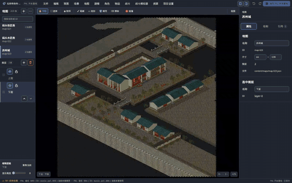
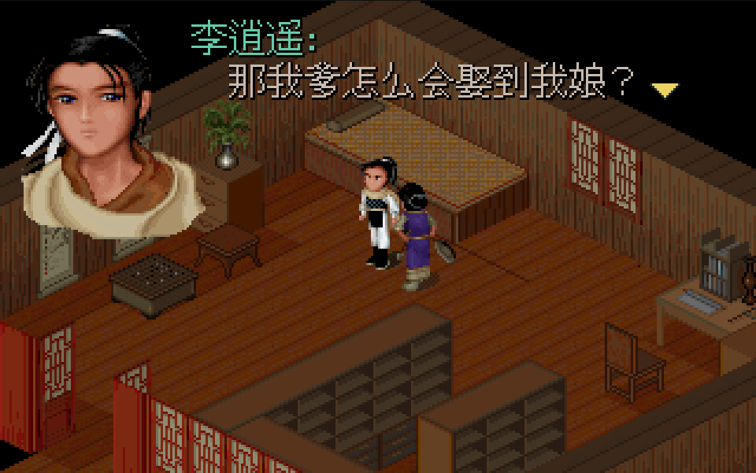
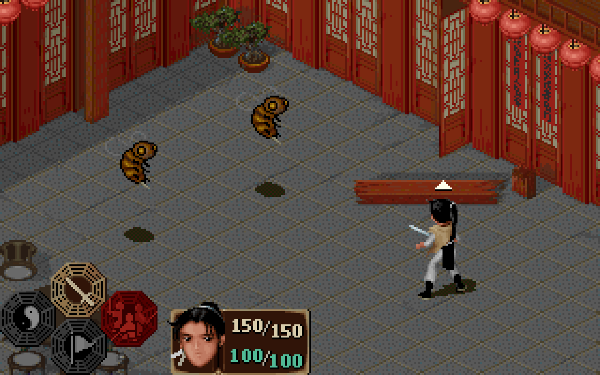
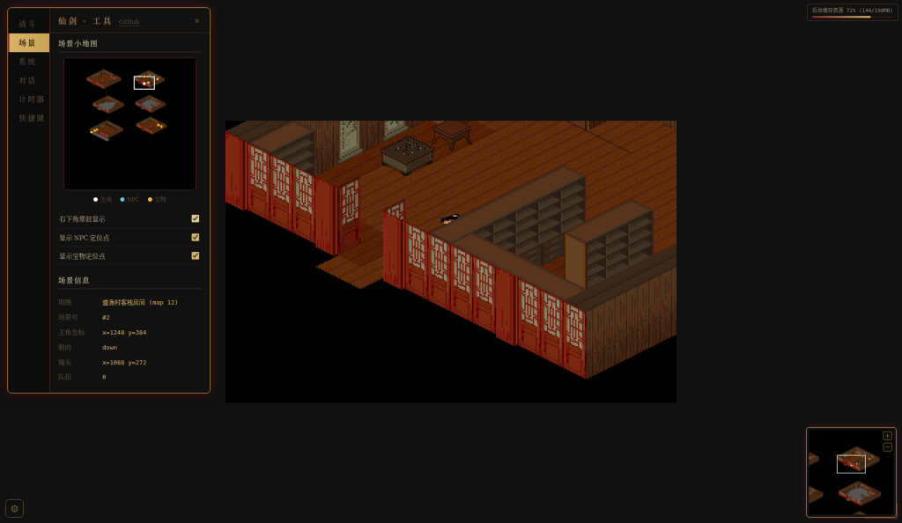
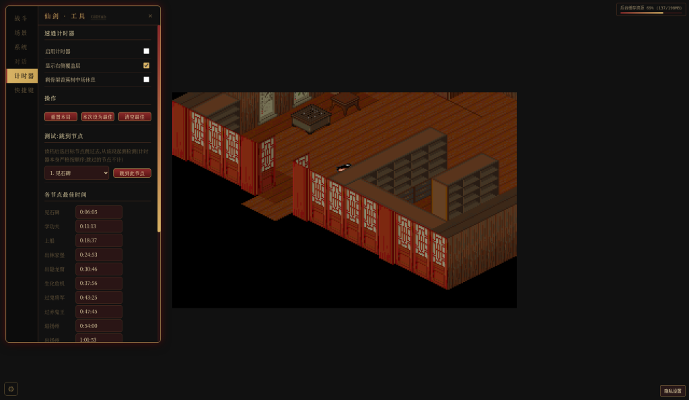
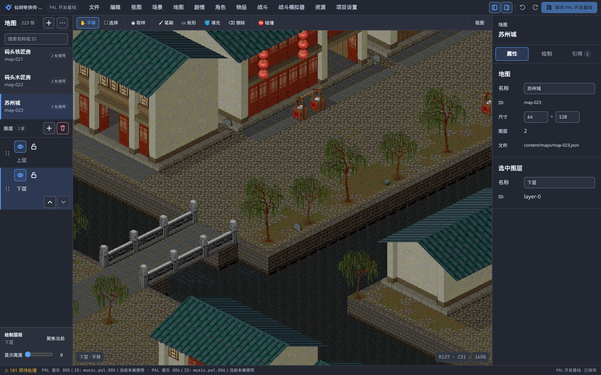
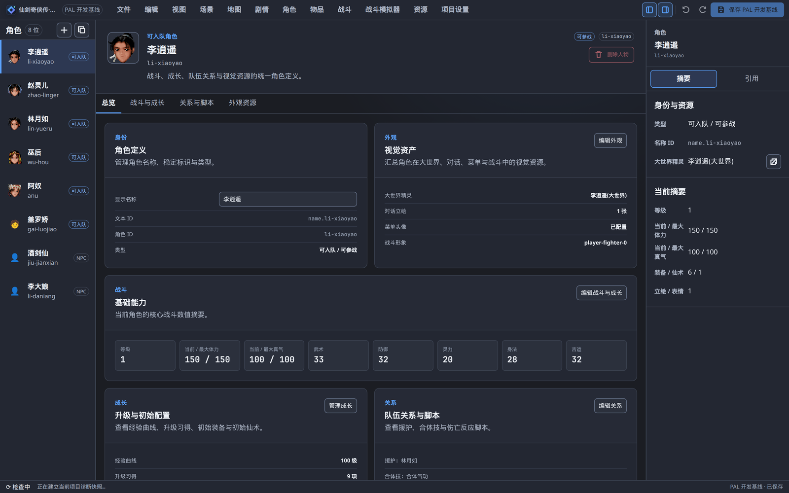
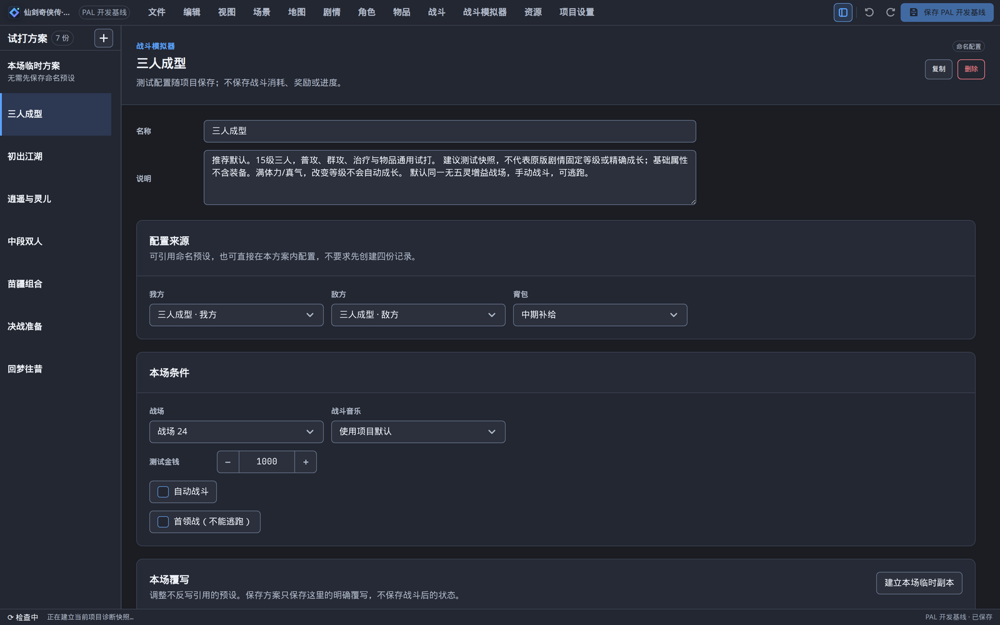
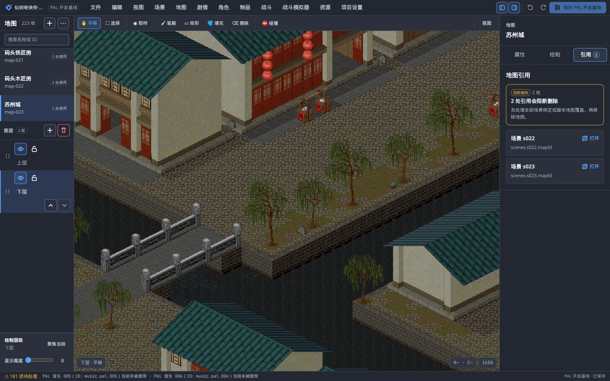
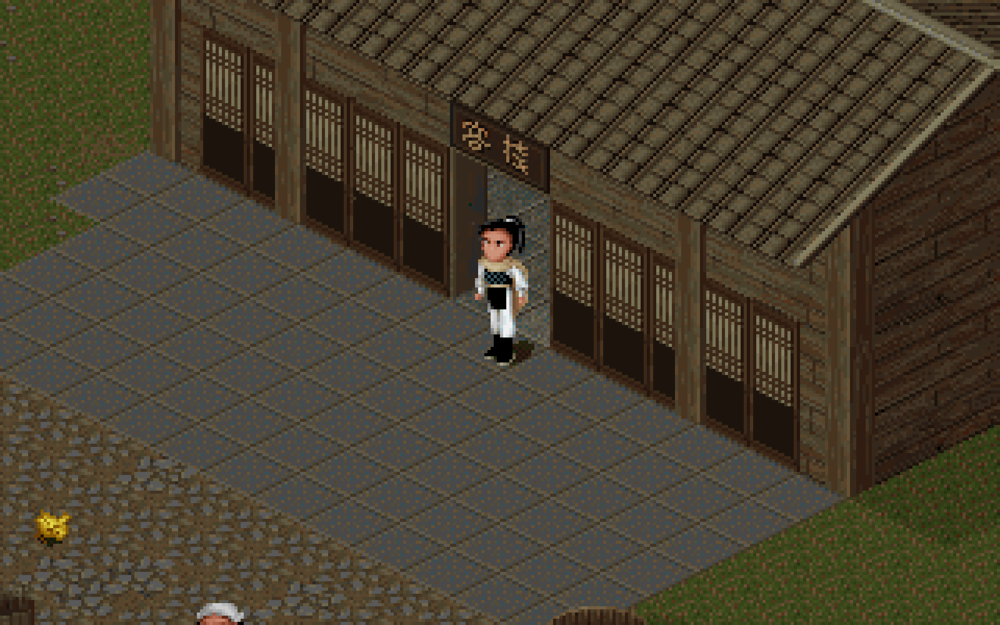

# Type PAL

[简体中文](README.md) | [English](README.en.md)

A from-scratch TypeScript rewrite of the 1995 RPG *The Legend of Sword and Fairy* (仙剑奇侠传, also known as PAL / Chinese Paladin) for the browser. Phase 1 can be played through to the ending. Phase 2 is a new runtime and a visual editor.

[](LICENSE)
[](https://pal.illegalscreed.cn/)
[](https://www.typescriptlang.org/)

**[▶ Play in the browser](https://pal.illegalscreed.cn/)**

The live demo’s game text is Chinese.



Map editing, scene editing, an NPC script, then play preview. The burned-in captions are Chinese.

<table>
<tr>
<td width="50%"><br>Phase 1 · Dialogue in the Yuhang inn</td>
<td width="50%"><br>Phase 1 · Turn-based battle</td>
</tr>
<tr>
<td><br>Phase 1 · Scene, coordinates, and scripts</td>
<td><br>Phase 1 · Speedrun timer</td>
</tr>
<tr>
<td><br>Phase 2 · Suzhou city map</td>
<td><br>Phase 2 · Character stats</td>
</tr>
<tr>
<td><br>Phase 2 · Battle simulator</td>
<td><br>Phase 2 · Reference diagnostics</td>
</tr>
<tr>
<td><br>Phase 2 · In-editor play preview</td>
<td></td>
</tr>
</table>

## What it is

| Phase | Status | What you get |
|---|---|---|
| Phase 1 · faithful recreation | [v1.0.0](https://github.com/IllegalCreed/type-pal/releases/tag/v1.0.0) is live | The browser runtime [`@type-pal/game`](packages/game). The main story can be played through: the final boss is defeated and the ending plays. That tag marks the first complete playthrough, not a bug-free stable release. |
| Phase 2 · Reforge | In development | A new runtime [`@type-pal/reforge`](packages/reforge), a React visual editor [`@type-pal/editor`](packages/editor), and an offline migrator [`@type-pal/migrate`](packages/migrate). |
| Phase 3 · productization | Planned | Replace copyrighted assets for a public release, plus a site and offline desktop builds. See [`docs/phase3/README.md`](docs/phase3/README.md). |

Phase 1, from the [v1.0.0 release notes](https://github.com/IllegalCreed/type-pal/releases/tag/v1.0.0) and the in-repo implementation notes:

- [`@type-pal/pal-extract`](packages/pal-extract) unpacks data tables, sprites, and event bytecode from the original MKF archives. YJ1 decompression corresponds to `yj1.c` in the reference tree ([`reference/README.md`](reference/README.md)).
- A TypeScript bytecode interpreter drives dialogue, cutscenes, scene changes, and battle triggers.
- A 320×200 indexed-color software framebuffer. Bitmaps store palette indexes and are colored at blit time.
- Turn-based battles: action queue, damage formulas, spells, status, enemy AI, and animation timelines.
- Original MIDI music is synthesized in the browser with SpessaSynth. The bank is TimGM6mb; see the license notes below.

Phase 2 pieces that are already in the tree (live detail is the [capability map](docs/phase2/capability-map.md) and the [task board](docs/ops/board.md)):

- Edit scenes, maps, scripts, characters, items, battles, assets, and project settings.
- Open and save a local project, undo/redo, reference diagnostics, in-editor play, and a standalone battle simulator.
- PAL content is published into the current project with a transactional publish and a three-way merge.
- A standalone playable package that does not need this source checkout is still an open phase-2 exit item.

## How this differs from sdlpal compiled to WebAssembly

[`reference/sdlpal/`](reference/sdlpal) is a copy of the [sdlpal](https://github.com/sdlpal/sdlpal) C sources. It is a reference spec. This repo does not compile or run it. Unpacking, the script VM, the 320×200 palette renderer, the battle system, and the editor are TypeScript. For phase 1, original game data and observed behavior come first; sdlpal is the reference implementation.

## Quickstart

Install Node.js 22, pnpm, and Git.

Without original game data, run the self-contained demo or create a blank project in the editor. The demo’s runtime dependencies are in the repo. It still includes a small amount of PAL-derived sample material:

```sh
pnpm install

# Reforge loads the self-contained demo
pnpm --filter @type-pal/reforge dev      # http://localhost:6050

# Editor start page. Create a blank project or open a local current-format project.
# This command does not auto-load the demo.
pnpm --filter @type-pal/editor dev:demo  # http://localhost:6011
```

To run the full PAL content, place a legally obtained copy of the original data in [`data/raw/`](data/raw) (file list: [`data/raw/README.md`](data/raw/README.md)), then extract and migrate:

```sh
pnpm install
pnpm extract
pnpm --filter @type-pal/migrate migrate:content --write
```

Start one app:

```sh
pnpm --filter @type-pal/editor dev      # editor + PAL, http://localhost:6010
pnpm --filter @type-pal/reforge dev:pal # Reforge + PAL, http://localhost:6051
pnpm --filter @type-pal/game dev        # phase-1 runtime, https://localhost:6005
```

`migrate:content` is a dry run unless you pass `--write`. The phase-1 dev server uses a local self-signed HTTPS certificate; the first visit to port 6005 needs a manual exception. Maintainer commands, debug entry points, and working rules are in [CONTRIBUTING.md](CONTRIBUTING.md). That guide’s long sections are in Chinese.

## Layout

| App | Package | Role | Local port |
|---|---|---|---:|
| Phase-1 runtime | [`@type-pal/game`](packages/game) | The shipped faithful browser game, and the behavior/UX reference for phase 2. | 6005 |
| Reforge | [`@type-pal/reforge`](packages/reforge) | The new runtime for modern content projects. | 6050 / 6051 |
| Editor | [`@type-pal/editor`](packages/editor) | Visual editing for maps, scenes, scripts, characters, items, battles, assets, and project settings. | 6010 / 6011 |

Other packages: [`packages/shared`](packages/shared) (shared types and decoding), [`packages/pal-extract`](packages/pal-extract) (offline extract), [`packages/content`](packages/content) (phase-2 content contract), [`packages/migrate`](packages/migrate) (offline migration). The doc index is [`docs/README.md`](docs/README.md) (Chinese).

## Where to read status

Capability cells, task state, and the content-format version move. This page does not copy that ledger.

| Question | Entry |
|---|---|
| Phase 1 | [`docs/phase1/README.md`](docs/phase1/README.md) |
| Phase 2 rules | [`docs/phase2/READ-FIRST.md`](docs/phase2/READ-FIRST.md) |
| Phase 2 progress | [`docs/phase2/capability-map.md`](docs/phase2/capability-map.md) |
| Phase 2 roadmap | [`docs/phase2/roadmap.md`](docs/phase2/roadmap.md) |
| Phase 3 | [`docs/phase3/README.md`](docs/phase3/README.md) |
| Current tasks | [`docs/ops/board.md`](docs/ops/board.md) |

## How it is built

The repository is written with AI coding agents working with the maintainer. The agreement is [`AGENTS.md`](AGENTS.md): task cards, one coding owner per implementation file at a time, and independent review. The current mode is assign / implement / independent acceptance. Older three-party sign-off notes remain in that file as history; they are not a gate for new work.

## License and disclaimer

**Unofficial fan project.** Not affiliated with, endorsed by, or authorized by Softstar (大宇 / 软星) or the other rights holders of *The Legend of Sword and Fairy*. Original assets and the live demo are for study and exchange only, and will be taken down on request. Please support the official game.

For a takedown or other rights request, open a [GitHub issue](https://github.com/IllegalCreed/type-pal/issues/new/choose) in this repository.

- Code written for this project is released under the [GNU General Public License v3.0](LICENSE), the same license as the sdlpal reference.
- The full original game data is not in Git. The live demo is a hosted build. Running the full PAL content locally requires your own legally obtained copy.
- Checked-in demos, regression fixtures, and part of Reforge’s default UI art include a small amount of PAL-derived material. That is not a cleared asset pack, and the GPL on the code does not relicense the original artwork. See [`PROVENANCE.md`](packages/reforge/src/engine-chrome/assets/PROVENANCE.md).
- Third-party components keep their own licenses. The repository GPL-3.0 does not relicense them.

### Third-party licenses

| Source | License | Note |
|---|---|---|
| [`reference/sdlpal/`](reference/sdlpal) | GPL-3.0 ([`LICENSE`](reference/sdlpal/LICENSE)) | Upstream snapshot, reference only. |
| `reference/sdlpal/timidity/` | [`COPYING`](reference/sdlpal/timidity/COPYING) is the Artistic License; the README in that directory says the upstream author also allows GPL or LGPL | Reference tree only. Not built by this repo. |
| `reference/sdlpal/adplug/` | [`NOTES/COPYING`](reference/sdlpal/adplug/NOTES/COPYING) is LGPL-2.1 | The notes describe the bundled older LGPL OPL emulator. They also mention a newer MAME-licensed emulator that restricts commercial redistribution; that newer emulator is not the copy included here. |
| `reference/sdlpal/overlay/` | CC BY 4.0 ([`COPYING`](reference/sdlpal/overlay/COPYING)) | libretro overlay art, reference tree only. |
| GNU Unifont | OFL-1.1, or GPL-2.0-or-later with the font embedding exception | See [`PROVENANCE.md`](packages/reforge/src/engine-chrome/assets/PROVENANCE.md), [`OFL-1.1.txt`](packages/reforge/src/engine-chrome/assets/licenses/OFL-1.1.txt), and [`COPYING`](packages/reforge/src/engine-chrome/assets/licenses/COPYING). |
| TimGM6mb soundfont | The in-repo notice says GPL-2 and links the GPL version 2 text, with no “or later” grant | [`packages/game/public/soundfont-LICENSE.txt`](packages/game/public/soundfont-LICENSE.txt) and the same file under Reforge. The bank stays under that notice. This repository’s GPL-3.0 does not relicense it. |

## Maintainers

Commands, debug entry points, data flow, and working rules: [CONTRIBUTING.md](CONTRIBUTING.md). Agent protocol: [`AGENTS.md`](AGENTS.md).
